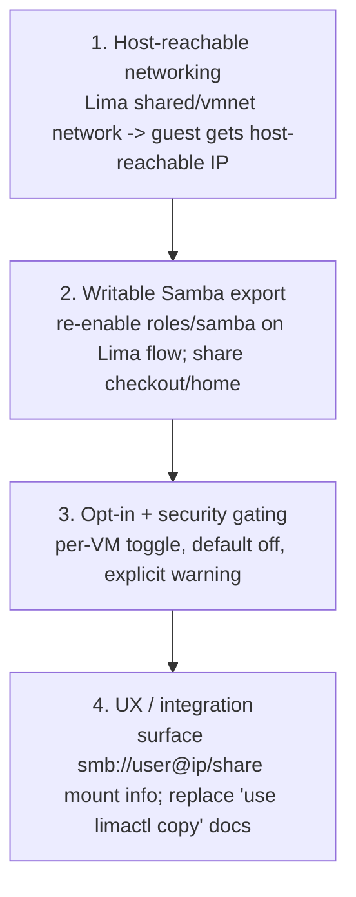

# Plan: Writable Samba Share to Expose VM Content to the Host

## Original Work Order

> ITEM 8 — Figure out the best way to share content out from the VMs to the host (replace limactl copy). Expose the checkout or home directory to the host as a network/shared folder — NOT a bind mount. A Samba role already exists (roles/samba) but is disabled on the Lima flow (samba_enabled: false) because there's no host-home mount. Lima VMs use user-mode networking by default; exposing SMB (port 445) or using host-side sshfs against the guest are candidate approaches. Must respect the security posture ("nothing leaves the VM" — a writable share punches a hole).

## Plan Clarifications

| Question | Answer |
|----------|--------|
| Which mechanism and access level? | A **writable Samba (SMB) share** over a **host-reachable Lima network** — the network-folder UX, reusing the existing `roles/samba`. Not a bind mount. |
| Read-only or read-write? | **Read-write** — the host can edit VM files, not just extract them. |
| Security posture? | Read-write network sharing is a deliberate, **opt-in** weakening of "nothing leaves the VM" — **default off**, scoped, and documented, mirroring the existing reset preserve-toggle precedent. |

## Executive Summary

Today, moving files between a VM and the host means manual `limactl copy`, and the Lima flow deliberately disables Samba (`samba_enabled: false`) because the VMs have no host mount and Lima's default user-mode networking exposes no guest ports to the host. This plan replaces `limactl copy` with a **writable SMB share**: the guest exports its checkout/home, the host mounts it natively (Finder/Explorer/`mount`), and edits flow both ways.

Two things make this work. First, the VM needs a **host-reachable address** — Lima's default user-mode (slirp) networking only allows outbound traffic, so reaching the guest's SMB port requires a Lima **shared/vmnet network** (socket_vmnet or the `vz` driver on macOS, vmnet on Linux) that gives the guest an IP the host can connect to. Second, the existing **`roles/samba`** — already carrying macOS-friendly `vfs_fruit` tuning and a writable `[homes]` share — is re-enabled for the Lima flow under an explicit opt-in and pointed at the right directory.

Because a writable network share is the largest hole in the project's "nothing leaves the VM" posture, it is gated like the reset preserve toggles: **off by default**, opt-in per VM, scoped to the checkout/org directory rather than blanket-exporting everything, and accompanied by an unambiguous security warning. The payoff is a far better workflow than `limactl copy` — a live, bidirectional folder — without making isolation the silent default. This plan is independent of the rename (06), the bash-script retirement (07), and the CI work (08).

## Context

### Current State vs Target State

| Current State | Target State | Why? |
|---------------|--------------|------|
| File movement is manual `limactl copy` (one-shot, one-way each call) | A mounted, writable SMB share — live, bidirectional | A real folder beats per-file copies for an iterative workflow |
| `roles/samba` is disabled on the Lima flow (`samba_enabled: false`) | Re-enabled per opt-in VM, exporting the checkout/home | The role exists and is macOS-tuned; only reachability + opt-in are missing |
| Lima default user-mode networking exposes no guest ports to the host | A Lima shared/vmnet network gives the guest a host-reachable IP for SMB (445) | The host must be able to reach the guest's SMB service |
| Isolation is absolute ("nothing leaves the VM") | Isolation is the default, with an explicit opt-in writable share as a documented exception | Preserve the security default while enabling the requested workflow |

### Background

- **The Samba role is ready-made**: `roles/samba` installs Samba, deploys an `smb.conf` with extensive macOS `vfs_fruit`/`streams_xattr` tuning (so Finder copies are fast and don't litter AppleDouble files), sets the share password via `smbpasswd` from `user_password`, and exports a writable `[homes]` share. The Lima flow simply sets `samba_enabled: false` today because there was no point without host reachability.
- **Lima networking is the blocker, not Samba.** Default user-mode/slirp networking is outbound-only; the host cannot reach guest:445. The options are a host-side **port-forward** (host 445 is privileged and collides with the host's own SMB, especially on macOS) or a **shared network** (socket_vmnet / `vz` on macOS, vmnet on Linux) that assigns the guest a host-reachable address (e.g. a `192.168.105.x` IP) — the latter is the clean path for SMB and is preferred here.
- **Security model precedent.** The README's security model states the VMs are ephemeral with no writable host mount, so `limactl delete` provably removes everything; the TUI reset preserve toggles are already described as a "deliberate, opt-in exception" to that rule. A writable share is a larger and longer-lived exception and should follow the same framing: opt-in, off by default, clearly warned, and never used for a VM suspected of compromise.
- **Credential handling.** The role derives the SMB password from `user_password`, which in the Lima base-image flow is generated once at base build and shared across clones. That is acceptable for a LAN-isolated dev VM but should be surfaced; a per-VM password is a possible refinement.
- **Scope of the export.** Blanket-exporting all of `$HOME` maximises the blast radius. Scoping the share to the checkout/org directory (the thing users actually want off the VM) keeps the exception narrow.
- **Independent** of Plans 06–08; it touches `roles/samba`, `group_vars`, the Lima overlay/network configuration, and optionally the create/reset config (a per-VM "enable host share" flag) and the TUI surface (showing the mount address).

## Architectural Approach

### Host-reachable networking

**Objective:** Let the host reach the guest's SMB service at all.

For share-enabled VMs, configure a Lima shared/vmnet network so the guest receives an address the host can connect to (socket_vmnet or `vz` on macOS, vmnet on Linux), and surface that address. This replaces the dead-end of user-mode networking and avoids the privileged-port/host-SMB conflict that a host-side 445 forward would cause. The feature is gated on this network being available, with a clear message when prerequisites (e.g. socket_vmnet) are missing.

### Writable Samba export

**Objective:** Export the right directory, writable, reusing the existing role.

Re-enable `roles/samba` on the Lima flow under an opt-in variable and point it at the checkout/org directory (and/or home), keeping the existing `vfs_fruit` tuning so macOS clients behave. Manage the SMB credential (reusing the role's `smbpasswd`-from-`user_password` mechanism, noting the shared-password caveat and the option of a per-VM password).

### Opt-in and security gating

**Objective:** Keep isolation the default; make the hole deliberate.

Add a per-VM toggle (default **off**) that enables the share, with a security warning mirroring the reset preserve-toggle framing: it weakens the "nothing leaves the VM" guarantee, the share is writable, and it must not be enabled for a VM suspected of compromise. Scoping the export narrowly (checkout/org dir) keeps the exception as small as the use case allows.

### UX and integration

**Objective:** Make mounting obvious and retire the `limactl copy` guidance.

Provide the host mount address/command (e.g. `smb://<user>@<guest-ip>/<share>`) via the TUI/CLI for a share-enabled VM, optionally with a helper to mount/unmount, and update the docs that currently say "move files in or out with `limactl copy`" to describe the share instead.

## Risk Considerations and Mitigation Strategies

Technical Risks

- **Lima networking varies by host/driver** (socket_vmnet install on macOS, `vz` vs `qemu`, Linux vmnet), and shared networking needs extra setup.
    - **Mitigation**: document per-platform setup; gate the feature on a reachable network and fail with a clear, actionable message when it isn't configured.
- **Port 445 conflicts / privileged ports** if a host-side forward were used.
    - **Mitigation**: use a shared-network guest IP and connect to guest:445 directly, avoiding host port 445 entirely.
- **macOS SMB metadata/perf quirks.**
    - **Mitigation**: the role's `smb.conf` already carries the recommended `vfs_fruit`/`streams_xattr` tuning.

Security Risks

- **A writable network share is the biggest weakening of "nothing leaves the VM"** of any item in this set — it allows host↔guest modification and persists while mounted.
    - **Mitigation**: opt-in and **off by default**; scope the export to the checkout/org dir rather than all of `$HOME`; document it as a deliberate exception (per the existing reset-preserve framing) and warn against using it for suspect VMs.
- **Shared SMB password across clones** (derived from a base-built `user_password`).
    - **Mitigation**: surface this explicitly; consider a per-VM password as a refinement; rely on the share being on a host-only/LAN-isolated network.

## Success Criteria

### Primary Success Criteria

1. A managed VM can be created/reset with a host-share opt-in; with the toggle **off** (the default), isolation is unchanged and no share or extra network is exposed.
2. With the toggle on, the host can mount a **writable** SMB share of the VM's checkout/home over a host-reachable Lima network and both read and write files — fully replacing `limactl copy` for that VM.
3. The feature is documented as a deliberate, opt-in security exception (default off, narrow scope, explicit warning), consistent with the existing reset-preserve framing.
4. Per-platform (macOS and Linux host) setup and mount instructions are documented, and a missing networking prerequisite yields a clear failure message rather than a silent dead share.

## Documentation

- **README.md** — extend the Security Model with the opt-in writable-share exception; document re-enabling `roles/samba` on the Lima flow; replace the "move files with `limactl copy`" guidance.
- **tui/README.md** — the host-share toggle, the mount address/command, and per-platform notes.
- **roles/samba** — usage notes for the Lima networked-share configuration.

## Resource Requirements

### Development Skills

- Ansible (the `samba` role), Lima networking (socket_vmnet / `vz` / vmnet shared networks), and Samba/SMB administration; Go for the TUI/CLI opt-in and mount-info surface.

### Technical Infrastructure

- macOS and Linux host test environments with Lima (including socket_vmnet on macOS) to validate reachability and mounting on both.

## Integration Strategy

Independent of Plans 06–08. It touches `roles/samba`, `group_vars`, the Lima overlay/network configuration, and optionally `vm.CreateConfig` plus the TUI create/reset forms (a per-VM share toggle) and the detail view (mount address). It deliberately does not alter the default isolation posture — only adds an opt-in path on top of it.

## Notes

- This is the largest security-surface change of the four deferred items; the default-off, narrow-scope, well-documented framing is essential, not optional.
- Host-side sshfs was considered (simpler, no guest service) but the network-folder UX and reuse of the existing macOS-tuned Samba role were preferred; sshfs remains a possible fallback if shared networking proves impractical on a given host.
