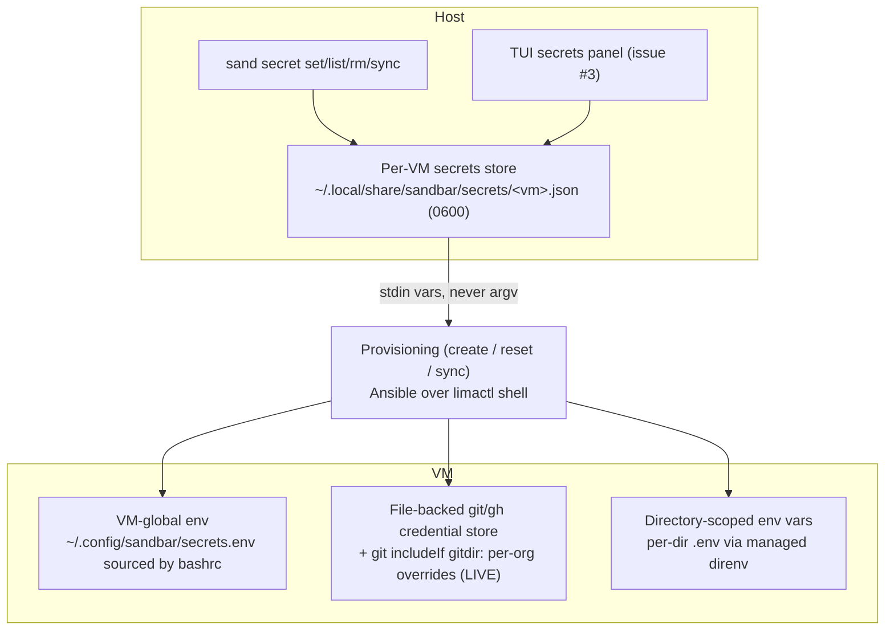
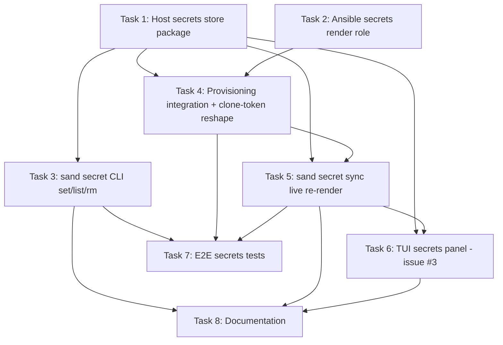

# Plan: Host-Backed Secrets Manager for Sandbar

## Original Work Order

> Add a secrets manager to Sandbar. Each VM should be able to have one or more environment variables set to work within a VM.
>
> I would like to remove direnv, but there are times someone might reasonably need to have different tokens within one VM for services like github. For example, they may be porting custom code from a project to a new public repository. Make suggestions, or let me know if i should keep direnv.
>
> Users need to be able to update secret values, such as when a token has a expired. I suspect there is no way to do this without requiring new shells, respawning tools like claude code, etc, but let me know if there's other ways to do this.
>
> The secrets should be stored on the host (if they aren't already) so a user can recreate a VM without having to regenerate secrets unless they want to.
>
> This will solve issue #3, but go beyond its scope too.

## Plan Clarifications

| Question | Decision |
| --- | --- |
| Keep or remove direnv? | **Keep it, fully managed by `sand`.** `sand` owns the secrets on the host and renders both VM-global env and per-directory `.env` files, running `direnv allow` on the user's behalf. The user never invokes direnv manually, but per-directory / multi-token scoping is retained. |
| Secret scopes per VM? | **VM-global + directory-scoped.** Global secrets apply everywhere in the VM; directory/org-scoped secrets apply only within a subtree (e.g. a per-org GitHub token) — this covers the "different GitHub tokens in one VM" porting case. |
| At-rest storage on host? | **Plaintext file, mode `0600`**, under the existing `sandbar` data dir. Matches how Lima, `gh`, and `~/.aws/credentials` already store tokens on the same host; no new dependency. |
| How far do live updates go? | **Git/GitHub updates are live; plain env vars require a new shell.** `sand secret set`/`sync` re-renders files. GitHub auth works immediately via a file-reading git/`gh` credential store. For arbitrary env vars, `sand` honestly reports that a new shell is required. |
| Backwards compatibility? | **Not required (pre-1.0).** The current `--clone-token` behaviour is re-implemented on top of the new manager as long as `sand create --clone-url --clone-token` still yields a working clone plus token. No on-disk secret state exists today, so there is nothing to migrate. |

## Executive Summary

Sandbar today has no secrets manager. Its single secret — a GitHub clone token — is passed transiently at `sand create` time, written inside the VM to a per-org `.env`, and loaded by direnv. Nothing is persisted on the host (the managed-VM registry is deliberately "secret-free"), so recreating a VM means re-supplying the token, and there is no supported way to hold more than one env var or more than one GitHub token per VM.

This plan introduces a **host-side secrets store as the single source of truth**, a `sand secret` CLI plus a TUI panel to manage it, and a provisioning path that **renders secrets into each VM on every create and reset**. Secrets come in two scopes: **VM-global** (env vars sourced for every shell) and **directory-scoped** (per-org/per-subtree, the mechanism behind "different GitHub tokens in one VM"). GitHub authentication is moved off environment variables and onto a **file-backed git/`gh` credential store selected per-directory via git's native `includeIf gitdir:` conditional includes**, which makes token rotation take effect immediately — the expired-token pain point — without new shells or respawning Claude Code. direnv is retained but demoted to an implementation detail that `sand` drives automatically, so it keeps covering arbitrary directory-scoped env vars while the user never touches it.

Because the host store is authoritative and re-materialised on every provision, users can destroy and recreate a VM without regenerating secrets. The work supersedes issue #3 ("Add a UI to refresh github tokens"): refreshing a GitHub token becomes one action in the secrets manager, and it applies live.

## Context

### Current State vs Target State

| Current State | Target State | Why? |
| --- | --- | --- |
| The only secret is a single GitHub clone token. | Any number of named secrets per VM (env vars and tokens). | The user needs "one or more environment variables set to work within a VM." |
| Secrets are transient CLI/stdin inputs at create time; the registry is explicitly secret-free — nothing persists on the host. | A per-VM secrets store persisted on the host under the `sandbar` data dir (mode `0600`). | Secrets must survive VM recreation "without having to regenerate secrets." |
| Recreating a VM (or `Reset`) requires re-supplying the token, or stages the `.env` out of the *VM* itself. | Every create/reset re-renders secrets from the authoritative host store. | Recreation should not require regeneration; the host, not the VM, is the source of truth. |
| Only one GitHub token can be active per org, and the docs recommend a "separate VM per org/context rather than juggling several tokens." | Multiple GitHub tokens can coexist in one VM, auto-selected by repository directory. | The porting-between-repos example requires different tokens for the same service within one VM. |
| A rotated/expired token requires editing the in-VM `.env` and a new shell for `GH_TOKEN` to reload. | Rotating a GitHub token via the manager takes effect on the next `git`/`gh` call, live. | "Users need to be able to update secret values, such as when a token has expired." |
| GitHub auth depends on `GH_TOKEN` in the environment (fixed at shell/exec time). | GitHub auth reads from a file-backed credential store re-read per invocation. | Environment variables cannot be mutated in a running process; file-backed helpers can be. |
| direnv is user-visible: the token flow requires an explicit `direnv allow`, documented as a step. | direnv is managed by `sand` (invisible `direnv allow`), covering only arbitrary directory-scoped env vars. | The user wants to "remove direnv" as a concern while retaining per-directory scoping. |
| No UI to refresh GitHub tokens (issue #3 open). | The TUI exposes a secrets panel including "refresh GitHub token." | Solve issue #3 as a subset of the broader manager. |

### Background

- **Host & tooling.** `sand` (Go CLI/TUI, `cmd/sand` + `internal/*`) provisions Lima VMs from an embedded Ansible playbook. Host state lives at `${XDG_DATA_HOME:-~/.local/share}/sandbar/managed-vms.json` via `internal/registry`; the registry entry's comment notes its stored config is "secret-free," so secrets are intentionally absent from host state today.
- **Existing secret path.** `roles/project` writes `~/<host>/<org>/.env` containing `GH_TOKEN=...` for `github.com` clone URLs, runs `direnv allow`, and clones with `GH_TOKEN` in the environment. `roles/user` installs direnv's `load_dotenv = true` config and the `direnv hook bash` line in bashrc. `roles/base` installs the `direnv` package.
- **Secret hygiene already in place.** Provision vars are passed to Ansible over **stdin, never argv** (`internal/provision/provision.go`), the clone token flag is documented as "never placed on argv inside the guest," and token-bearing tasks use `no_log`. The new manager must preserve these properties.
- **Reset flow.** `internal/provision` `Reset` can `--preserve-project`, which stages the per-org tree (including its `.env`) out of the running VM and back. With a host source of truth this staging is no longer the authority for secrets; secrets are re-rendered from the host instead.
- **Why environment variables cannot be live-updated.** A process's environment is fixed at `exec` time and inherited by children. A running `claude` started with `GH_TOKEN=old` will hand `old` to every `git` child regardless of any file change. The only general remedies for pure env-var secrets are a new shell or respawning the tool. File-backed credential helpers (git/`gh`) sidestep this because they re-read the file on each invocation — hence GitHub auth is moved to that model to achieve live rotation.
- **Issue #3** ("Add a UI to refresh github tokens") has no body; its title defines its scope, which this plan subsumes.

## Architectural Approach

The design has one authoritative store on the host and three rendering targets inside each VM, wired through the existing stdin-based provisioning path and surfaced by a CLI and a TUI panel.

### Component 1 — Host secret store (source of truth)

**Objective**: Persist all secrets on the host so VMs can be recreated without regeneration, while keeping them out of the secret-free VM registry.

A per-VM store file lives beside the existing registry, e.g. `${XDG_DATA_HOME:-~/.local/share}/sandbar/secrets/<vm-name>.json`, with the containing directory `0700` and each file `0600`. The schema captures, per VM: a list of **global** secrets (`name`, `value`) and a list of **scoped** secrets (`scope` = a home-relative directory such as `github.com/acme`, plus `name`, `value`, and a `kind` discriminating a GitHub credential from a generic directory env var). The store is a separate file from `managed-vms.json` precisely so the registry stays secret-free and so deleting a VM can optionally retain or purge its secrets independently. A small Go package (e.g. `internal/secrets`) owns load/save, atomic writes with correct permissions, and value redaction for display.

### Component 2 — `sand secret` CLI and TUI panel

**Objective**: Give users a first-class way to add, inspect, rotate, and remove secrets, and satisfy issue #3.

CLI subcommands under `sand secret`: `set <NAME>` (reads the value from stdin/prompt, never argv, to avoid shell-history leakage; `--dir <relpath>` marks it directory-scoped, absence means VM-global; a `--github` affordance marks a scoped GitHub credential), `list [--reveal]` (masks values by default), `rm <NAME> [--dir <relpath>]`, and `sync` (re-render into the running VM — see Component 5). All operate on the currently selected/`--vm <name>` VM.

The TUI gains a **secrets panel** for the selected VM: list secrets (masked), add/edit a secret, and a dedicated **"refresh GitHub token"** action that updates the store and triggers a live sync. This panel is the concrete resolution of issue #3, generalised to all secrets.

### Component 3 — In-VM rendering targets

**Objective**: Turn stored secrets into working configuration inside the VM, choosing the mechanism per secret type so that GitHub is live and generic env vars behave predictably.

- **VM-global env vars** render to a single managed file (e.g. `~/.config/sandbar/secrets.env`, `0600`) that bashrc sources. Updating these requires a new shell (documented plainly).
- **GitHub credentials** render to a **file-backed git/`gh` credential store**, not the environment. Global GitHub auth uses one store file; per-org tokens are selected by git's native **`includeIf "gitdir:~/github.com/<org>/"`** conditional includes, each pointing at a scope-specific credential file. Because git/`gh` re-read the credential file on every invocation, rotating a token is **live** — the next `git push` uses it with no new shell and no respawn. This mechanism, not direnv, is what delivers "different GitHub tokens in one VM" for git operations.
- **Directory-scoped generic env vars** render to per-directory `.env` files loaded by **managed direnv**: `sand` writes the `.env` (`0600`) and runs `direnv allow` itself. direnv thus remains only as the loader for non-git directory-scoped env vars; the user never interacts with it.

### Component 4 — Provisioning integration (create / reset authoritative re-render)

**Objective**: Make the host store the authority on every provision so recreation never loses secrets, without weakening existing hygiene.

`sand` reads the per-VM store and passes secrets to the finalize/full provision **over stdin, never argv**, consistent with the current provisioner. A provisioning unit (a new `secrets` role or an extension of `user`/`project`) renders the three targets from those vars with `no_log`. On **create** and on **`Reset`/recreate**, secrets are re-rendered from the host store, so a destroyed-and-recreated VM comes back fully provisioned. The legacy `sand create --clone-url --clone-token` path is reshaped to **record the clone token as a directory-scoped GitHub secret** in the host store and render it through Component 3, preserving the observable outcome (a working private clone with working auth) without a parallel codepath. `Reset --preserve-project` continues to preserve the *checked-out tree*, but secrets no longer need to be staged out of the VM since the host store supplies them.

### Component 5 — Live update / sync semantics

**Objective**: Apply secret changes to a running VM with the strongest guarantee each mechanism allows, and be honest about the limits.

`sand secret sync` (and the TUI refresh action) re-renders the changed targets into the running VM: GitHub credential files and `includeIf` config, the global env file, and any directory `.env` (re-running `direnv allow`). It then reports effect scope truthfully: **GitHub/git changes are effective immediately**; **global and directory env-var changes take effect in new shells only** — `sand` states this rather than implying a running Claude session will pick them up. No forced VM or shell restart is performed (per the chosen "git live; env vars need new shell" decision).

## Risk Considerations and Mitigation Strategies

Technical Risks

- **Environment variables genuinely cannot be updated in running processes.** A rotated env-var secret will not reach an already-running `claude` or shell.
  - **Mitigation**: Route the primary, expiry-prone secret (GitHub tokens) through file-backed credential helpers that are live; scope env-var-only secrets to the "new shell required" behaviour and document it explicitly in CLI output and README.
- **`includeIf gitdir:` and credential-helper wiring is subtle** (path suffix matching, `~` expansion, helper precedence over `GH_TOKEN`).
  - **Mitigation**: Standardise the checkout layout already used (`~/<host>/<org>/…`), pin helper configuration in the managed provisioning role, and cover the multi-token-in-one-VM path with an end-to-end test rather than trusting configuration by inspection.
- **Plaintext secrets on the host disk.** The store holds tokens in cleartext at `0600`.
  - **Mitigation**: This matches the accepted posture of Lima/`gh`/`~/.aws/credentials` on the same host and was explicitly chosen; enforce `0700`/`0600` permissions on create and atomic writes, and keep the store out of the registry and out of any logs.

Implementation Risks

- **Secret leakage via argv, logs, or process listings.**
  - **Mitigation**: Read CLI values from stdin/prompt (never positional argv), pass vars to Ansible over stdin as today, apply `no_log` to token-bearing tasks, and mask values in TUI/`list` output by default.
- **Reshaping `--clone-token` breaks the existing create flow.**
  - **Mitigation**: Treat "`sand create --clone-url --clone-token` still yields a working private clone" as an explicit acceptance criterion and cover it with the existing provision e2e path.
- **Reset/preserve interactions.** Removing VM-side `.env` staging as the source of truth could regress the preserve-project flow.
  - **Mitigation**: Keep tree preservation intact; only move *secret* authority to the host store, and validate a reset re-renders secrets correctly.

Scope Risks

- **Feature creep beyond the request** (cross-VM shared secret vaults, encryption backends, non-GitHub credential-helper integrations).
  - **Mitigation**: Per YAGNI, restrict to per-VM stores, plaintext `0600`, GitHub as the only credential-helper-backed service, and generic env vars for everything else. Additional services can reuse the env-var path without new infrastructure.

## Success Criteria

### Primary Success Criteria

1. A user can set one or more named secrets on a VM (`sand secret set`), both VM-global and directory-scoped, with values never appearing on argv or in logs, and the store file is `0600`.
2. After destroying and recreating a VM (`sand create`/`Reset`), all previously stored secrets are re-materialised inside the VM from the host store, with no re-entry of values.
3. In a single VM, two different GitHub repositories under different orgs authenticate with two different tokens, selected automatically by directory.
4. Rotating a GitHub token through the manager takes effect on the next `git`/`gh` invocation in an already-open shell — no new shell, no respawn — while the manager clearly states that pure env-var secrets require a new shell.
5. The TUI exposes a secrets panel that can add, view (masked), and refresh a GitHub token for the selected VM, fulfilling issue #3.
6. `sand create --clone-url --clone-token` still results in a working private clone with working GitHub auth (reshaped onto the new manager, no parallel codepath).
7. The user-facing token/direnv documentation reflects the new model (managed direnv, host-stored secrets, live GitHub rotation, multi-token-per-VM).

## Self Validation

After all tasks are complete, an LLM should verify against a **real Lima VM** (this dev host boots Lima with KVM; run the gated end-to-end path rather than trusting unit tests alone):

1. **Build & unit/gate tests.** Run `go build ./...` and `go test ./...`, then run the gated Lima e2e suite (the `limae2e`-tagged/`-run` end-to-end provision test) and confirm it passes.
2. **Store hygiene.** Run `sand secret set` for a global secret via stdin, then `ls -l` the store file and confirm mode `0600` and that the value is absent from shell history and from any command's argv (inspect `ps`/process listing during a set if feasible). Run `sand secret list` and confirm the value is masked.
3. **Recreation persistence.** Create a VM, set a global secret and a directory-scoped GitHub token, `Reset`/recreate the VM, then `limactl shell` in and confirm: `bash -lc 'echo $SECRET_NAME'` prints the global value in a fresh shell, and the per-org credential file exists — all without re-supplying values.
4. **Multi-token in one VM.** In one VM, configure two org-scoped GitHub tokens; from each org's checkout run a command that reports the effective credential (e.g. a `git config --show-origin credential` inspection or a `GIT_TRACE`/helper probe) and confirm each directory resolves to its own token.
5. **Live rotation.** In an already-open shell, `git`-authenticate against a private repo, rotate that org's token via `sand secret set --github`/`sync` (or the TUI refresh), then, **in the same shell**, run the next `git`/`gh` operation and confirm it uses the new token with no new shell. Separately, change a global env-var secret and confirm the same shell still shows the old value while a newly opened shell shows the new one — matching the documented behaviour.
6. **Legacy create parity.** Run `sand create --clone-url <private-repo> --clone-token <token>` and confirm the private repo clones successfully and subsequent `git pull` authenticates.

## Documentation

- **README.md** — rewrite the GitHub-token lifecycle section (currently steps describing `GH_TOKEN` in a per-org `.env`, manual `direnv allow`, and the "separate VM per org/context rather than juggling several tokens" recommendation). The new model: secrets stored on the host, VM-global and directory-scoped secrets, managed direnv, GitHub tokens live-rotatable, and multiple tokens per VM now supported. Document the `sand secret` commands and the "new shell required for env vars" caveat.
- **README-sand.md** — document the `sand secret` CLI surface, the host store location/permissions, the provisioning re-render on create/reset, and the TUI secrets panel.
- **AGENTS.md / CLAUDE.md** — none exists at the repo root, so no AI-facing config update is required; if a `CLAUDE.md` is added later it should reference the secrets model. (Answer to the POST_PLAN documentation question: yes, human-facing docs must change; no AGENTS.md update is needed.)
- **Issue #3** — close/reference it as delivered by the TUI secrets panel's "refresh GitHub token" action.

## Resource Requirements

### Development Skills

- Go (CLI/TUI in `cmd/sand` + `internal/*`, a new `internal/secrets` package, Bubble Tea TUI panel).
- Ansible (rendering role/tasks for env file, git credential store, `includeIf`, managed direnv `.env`).
- Git internals: credential helpers and `includeIf gitdir:` conditional includes.
- Secret-handling hygiene (stdin-only values, `no_log`, file permissions).

### Technical Infrastructure

- Lima + `limactl` on the host for provisioning and end-to-end validation (available on this dev host with KVM).
- The existing embedded-playbook provisioning pipeline (stdin var passing).
- A private GitHub repository and fine-grained tokens for multi-token / live-rotation validation.

## Integration Strategy

The manager slots into the existing provisioning pipeline rather than replacing it: `sand` continues to drive Ansible over `limactl shell` with vars on stdin, and the new secrets role renders alongside the current `user`/`project` roles. The registry stays secret-free; the secrets store is a sibling file. The `--clone-token` flag is reshaped to feed the store, so existing create invocations keep working. direnv stays installed and hooked but becomes an internal rendering detail.

## Notes

- The single most important design choice is **moving GitHub auth off environment variables onto a file-backed, per-directory credential store** — that is what makes both "multiple tokens in one VM" and "live token rotation" work, and it is why direnv can be retained purely for generic directory-scoped env vars without being user-facing.
- Encryption at rest, cross-VM shared vaults, and credential-helper integrations for non-GitHub services are intentionally out of scope (YAGNI); generic services are served by the env-var path today and can be revisited if a concrete need appears.

## Execution Blueprint

**Validation Gates:**
- Reference: `/config/hooks/POST_PHASE.md`

### Dependency Diagram

No circular dependencies.

### Phase 1: Foundations (no dependencies) ✅
**Parallel Tasks:**
- ✔️ Task 1: Host secrets store package `internal/secrets` — `completed`
- ✔️ Task 2: Ansible `secrets` render role (global env, file-backed git credentials + `includeIf`, managed direnv) — `completed`

### Phase 2: Store consumers ✅
**Parallel Tasks:**
- ✔️ Task 3: `sand secret` CLI — set/list/rm (depends on: 1) — `completed`
- ✔️ Task 4: Provisioning integration — render on create/reset + reshape `--clone-token` (depends on: 1, 2) — `completed`

> **Carry-forward for Task 6:** the TUI create-form (`internal/ui/form.go`) still sets `cfg.CloneToken` and calls `CreateVM` directly, bypassing `provision.RecordCloneTokenSecret`; Task 6 must wire the TUI create path through `RecordCloneTokenSecret` so a TUI-created VM with a clone token authenticates.

### Phase 3: Live application ✅
**Parallel Tasks:**
- ✔️ Task 5: `sand secret sync` — live re-render into a running VM (depends on: 1, 4) — `completed`. Reusable entry point: `provision.(*Provisioner).RenderSecrets(ctx, name, cfg, out)` runs only the `secrets`-tagged role over stdin; Task 6's TUI refresh reuses it.

### Phase 4: Surfaces & verification ✅
**Parallel Tasks:**
- ✔️ Task 6: TUI secrets panel, resolves issue #3 (depends on: 1, 5) — `completed`. Also fixed the create-form clone-token regression; cleanup pass additionally wired the reset-form clone token through `RecordCloneTokenSecret`.
- ✔️ Task 7: End-to-end tests — multi-token, live rotation, recreation persistence (depends on: 3, 4, 5) — `completed`. Gated `//go:build limae2e` + `LIMA_E2E=1`; real-VM boot executed in the plan's Self Validation. Run: `LIMA_E2E=1 go test -tags limae2e -timeout 60m -run TestE2ESecrets ./internal/provision/`.

### Phase 5: Documentation ✅
**Parallel Tasks:**
- ✔️ Task 8: Rewrite token/secrets docs, reference issue #3 (depends on: 3, 5, 6) — `completed`. Cleanup also removed stale `project_clone_token`-as-playbook-variable references (that var was retired in Task 4).

### Post-phase Actions
Apply the verification gate (`/config/shared/verification-gate.md`) after each phase; do not mark a phase complete on an unverified subagent claim.

### Execution Summary
- Total Phases: 5
- Total Tasks: 8

---

## Execution Summary

**Status**: ✅ Completed Successfully
**Completed Date**: 2026-07-09

### Results

Delivered the host-backed secrets manager across 8 tasks / 5 phases, all committed on `feature/11--host-secrets-manager`:

- **`internal/secrets`** — per-VM host store (source of truth) at `${XDG_DATA_HOME:-~/.local/share}/sandbar/secrets/<vm>.json`, atomic `0600` writes, `global`/`github`/`dir_env` categories, value redaction.
- **`roles/secrets`** — renders into the VM: VM-global env file sourced by `~/.profile`; file-backed git credential store with per-org `includeIf "gitdir:"` overrides (live rotation, multi-token-per-VM); managed direnv per-dir `.env`. Runs before `project` in `site.yml`, gated out of the base image.
- **`sand secret set|list|rm|sync`** — values read from stdin (never argv); `sync` re-renders into a running VM (git/GitHub immediate, env vars need a new shell) via `provision.RenderSecrets`.
- **Provisioning** — host secrets rendered on create and reset over stdin; `--clone-token` reshaped to record a github-scoped secret (`RecordCloneTokenSecret`); the old per-org `.env`/`GH_TOKEN`/direnv clone path in `roles/project` retired.
- **TUI secrets panel** (`s`/`a`/`r`) — masked list, add/edit, refresh-GitHub-token applied live — resolves issue #3. Create- and reset-form clone-token paths wired through `RecordCloneTokenSecret`.
- **Docs** — `README.md` GitHub-auth section and `README-sand.md` rewritten for the new model; stale `project_clone_token` playbook-variable references removed.

Success criteria met and verified on a real Lima VM (`TestE2ESecrets`, gated `limae2e`/`LIMA_E2E=1`): recreation persistence, two GitHub tokens in one VM selected by directory, live token rotation in an already-open shell, and `--clone-token` credential render — all PASS; the optional real-private-clone subtest SKIPs cleanly without a repo/token.

### Noteworthy Events

- **direnv decision:** kept but fully managed by `sand` (invisible `direnv allow`), per the user's clarification — it now covers only directory-scoped *generic* env vars, while GitHub uses the file-backed credential store.
- **Live-update reality:** GitHub/git rotations are live (file-backed helper re-read per call); plain env vars require a new shell — surfaced honestly by `sand secret sync` and the docs.
- **Two bugs caught by the real-VM Self Validation** (fixed in commit `f4c40f9`):
  1. VM-global env vars were sourced from `~/.bashrc`, whose Debian non-interactive guard returns before the source line — invisible to `bash -lc`/scripts/tools. Moved the source to `~/.profile`.
  2. Guest output was captured with stdout+stderr merged; `limactl`'s `cd <host-cwd>` stderr warning corrupted `getent` parsing in `guestHome` (garbage home dir). Added `lima.Client.ShellOut` (stdout-only) and routed `guestHome` (production, hardening real `reset`) and the e2e helper through it.
- **Regressions found and fixed during execution:** the TUI create-form (and, in cleanup, the reset-form) clone-token path bypassed `RecordCloneTokenSecret`; both wired up. Stale `project_clone_token` docs removed after the variable was retired.
- First e2e run also failed only on the harness `getent` bug and the `.bashrc` guard — no defect was ever found in the store, CLI, credential rendering, or sync logic itself.

### Necessary follow-ups

- **Optional real private-clone e2e:** `TestE2ESecrets/LegacyCreateParity_RealPrivateClone` skips unless `SAND_E2E_PRIVATE_REPO_URL` + `SAND_E2E_PRIVATE_REPO_TOKEN` are set — run it once against a real private repo to close the last assertion.
- **`internal/browse/lister.go`** parses `cli.Shell` (merged) output and shares the same latent stderr-merge risk; out of scope here, but a candidate to migrate to `ShellOut`.
- No `gh auth` file-store refresh was exercised end-to-end (best-effort, `failed_when: false`); revisit if `gh` CLI (as opposed to `git`) auth becomes a first-class requirement.
