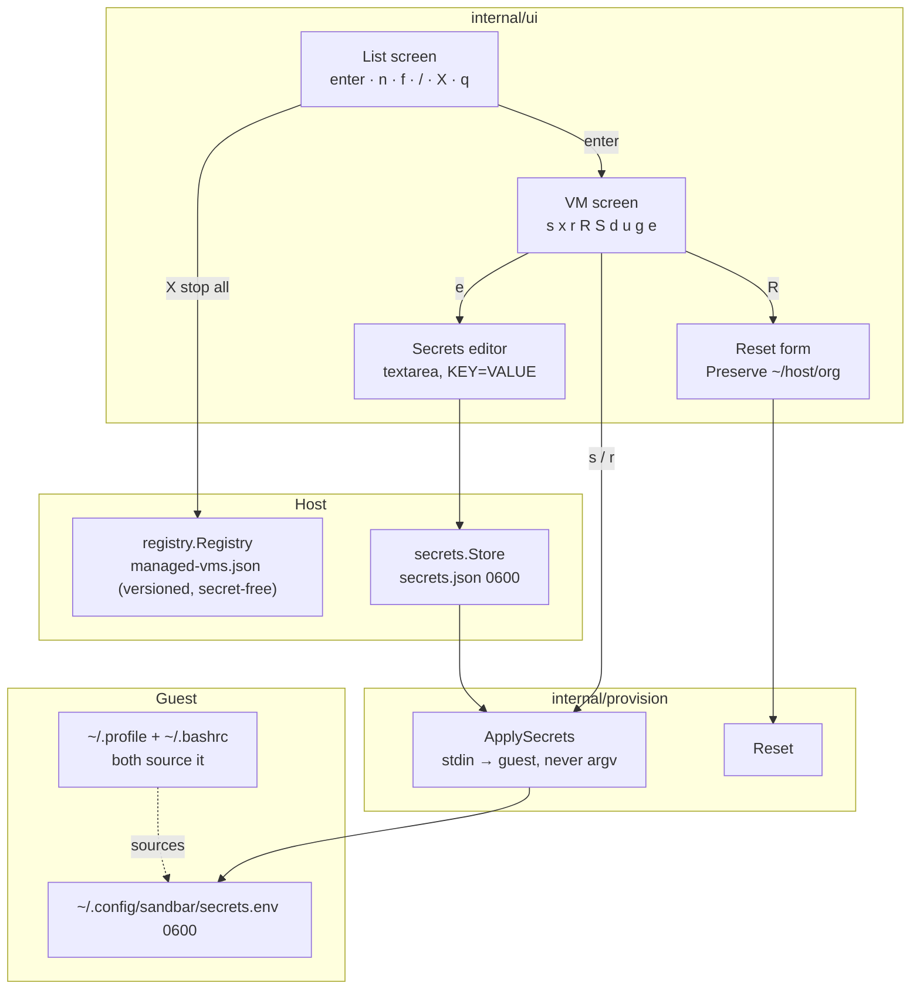
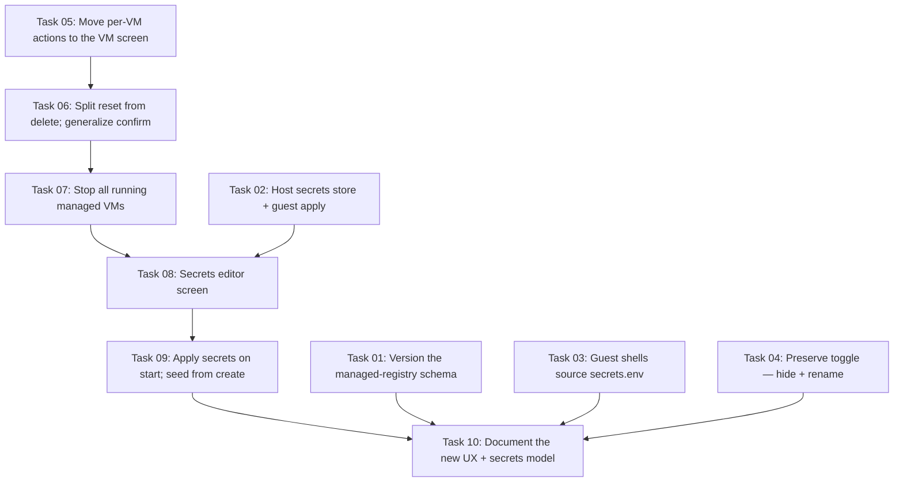

# Plan: TUI UX — VM-Screen Actions, Stop All, and Host-Side Editable Secrets

## Original Work Order

> We need to improve the TUI UX.
>
> Let's push all of the per-VM actions down into the VM screen. New and filter managed would stay where they are.
>
> Let's add a "stop all" option at the top level screen.
>
> For secrets, we store those on the host, right? Right now I can't edit them unless the VM is started. Can we make it so they are editable, and get provisioned on start?
>
> recreate should be separated out from the delete option. It should be called "reset" instead, not "recreate from claude-base".
>
> For some reason I can't select "Preserve project .env + checkout" in the UI because I didn't clone anything during setup. That option should be hidden instead if it's not usable.
>
> That option should be renamed to "Preserve <directory>", where directory is the path that would be preserved so it's clear.

## Plan Clarifications

The work order's secrets premise did not match the code, and three design
choices were under-determined. All were resolved with the user before planning.

| # | Question | Answer |
|---|----------|--------|
| 1 | Secrets are **not** stored on the host today — `registry.Add` strips `CloneToken` (`internal/registry/registry.go:158`), and the token only ever lives in the guest's per-org `.env`. What should we build? | Introduce host-side secret storage as an **arbitrary `KEY=VALUE` set per VM**, editable whether the VM is running or stopped. |
| 2 | Where do the secrets land inside the guest, given the per-org `.env` only exists when a repo was cloned? | A **VM-wide env file**, `~/.config/sandbar/secrets.env` (0600), sourced from **both** `~/.profile` and `~/.bashrc`. The per-org `.env` written at create time is left untouched — `git clone` needs the token before the secrets file exists. |
| 3 | What should "stop all" stop? | Only **running sand-managed VMs**. Unrelated Lima instances are never touched. A confirmation overlay names them first. |
| 4 | Moving per-VM actions to the VM screen collides on `d` (delete vs. download). | `d` stays **delete** everywhere; download moves to `g` (get); reset takes `R`; secrets take `e`; stop-all takes `X`. |
| 5 | Is backwards compatibility required? | **Managed index: yes** — an existing `managed-vms.json` must keep loading. It may be rewritten into a new format, and should gain a **schema version number**. **Keybindings: no** — the list's per-VM action keys are removed outright. |

## Executive Summary

The `sand` TUI currently spreads VM lifecycle actions across two screens with no
clear rule: the list handles start, stop, restart, delete, and shell, while the
VM detail screen only handles upload and download, and "recreate" hides inside
the delete confirmation prompt. This plan consolidates every action that targets
one VM onto the VM screen, leaving the list responsible only for choosing a VM
and for the operations that are genuinely global — create, filter, search, quit,
and a new "stop all". The result is a discoverable two-level model: the list
picks, the VM screen acts.

Alongside that reorganisation the plan introduces the feature the work order
assumed already existed: a per-VM secrets store on the host. Today the only
secret a VM holds is the GitHub token, it is deliberately never persisted
host-side, and the sole way to change it is to `limactl shell` into a running VM
and hand-edit `~/<host>/<org>/.env`. This plan adds a small `0600` JSON store
under the XDG data dir, a `KEY=VALUE` editor reachable from the VM screen
regardless of VM state, and a provisioning step that streams the secrets into
the guest over stdin — never argv — on every start and restart. The guest sources
them from a single VM-wide env file, so the feature works for VMs that cloned no
repository.

Finally, two smaller corrections. "Recreate from claude-base" is promoted out of
the delete confirmation into a first-class **Reset** action with its own key, so
a destructive rebuild is no longer something the user discovers by pressing
`d`. And in the reset form, the project-preservation toggle stops rendering as a
greyed-out dead option for VMs that cloned nothing — it is hidden entirely — and
when it *is* shown it names the concrete directory it will preserve, e.g.
`Preserve ~/github.com/lullabot`, rather than the abstract "project .env +
checkout".

## Context

### Current State vs Target State

| Current State | Target State | Why? |
|---|---|---|
| List screen handles `s` start, `x` stop, `r` restart, `d` delete, `S` shell; VM screen handles only `u` upload, `d` download | List screen handles only `enter`, `n` new, `f` filter, `/` search, `X` stop all, `q` quit; VM screen handles every per-VM action | One consistent rule — the list picks, the VM screen acts — instead of an arbitrary split |
| No way to stop every sandbox at once; the user stops each VM individually | `X` on the list stops all *running sand-managed* VMs after naming them in a confirmation overlay | Shutting down a day's work is a common, tedious operation |
| Secrets exist only inside the guest, in `~/<host>/<org>/.env`; `registry.Add` strips `CloneToken` before persisting | A per-VM host store at `$XDG_DATA_HOME/sandbar/secrets.json` (0600), holding arbitrary `KEY=VALUE` pairs | The user cannot currently change a token without shelling into a running VM |
| The GitHub token can only be supplied once, at create time | An `e` secrets editor on the VM screen, usable whether the VM is Running or Stopped | Editing a secret must not require the VM to be up |
| Nothing re-applies secrets to a guest after create | `start` and `restart` stream the secrets into `~/.config/sandbar/secrets.env` (0600) before reporting success | "Editable" is meaningless unless the edits reach the VM |
| Guest env comes from the per-org `.env` via direnv, which only exists if a repo was cloned | A VM-wide `secrets.env` sourced from both `~/.profile` and `~/.bashrc` | Login and interactive-non-login shells differ; neither file alone covers both. Works with no clone URL |
| Recreate is a hidden `[r]` branch of the `Delete "x"?` confirmation prompt | `R` is a first-class **Reset** action on the VM screen; the delete prompt offers only `[y]`/`[n]` | A rebuild is not a kind of delete, and should not be discovered by pressing delete |
| Reset form shows `Preserve project .env + checkout` greyed out with "(no project cloned)" when unusable | The toggle is not rendered at all, and is skipped in the focus cycle | A permanently unselectable control is noise, and reads as a bug |
| Toggle label names an abstraction: "project .env + checkout" | Toggle label names the path: `Preserve ~/github.com/lullabot` | The user must know exactly what survives the reset |
| `managed-vms.json` has an unversioned `{"vms":{…}}` schema | The file carries an explicit `version` field; a missing version is read as v1 and migrated on next write | Future schema changes need a migration hinge; the current format has none |

### Background

**How secrets reach a VM today.** `internal/ui/form.go` collects a `GitHub token`
into `vm.CreateConfig.CloneToken`. `provision.BuildExtraVars` emits it as
`project_clone_token` only for non-`base` phases, and streams the whole vars file
into the guest over **stdin** into `/dev/shm` with `install -m 600` and an `EXIT`
trap (`inGuestScript`, `internal/provision/provision.go:27`). Inside the guest,
`roles/project/tasks/main.yml` writes `GH_TOKEN=<token>` into
`~/<host>/<org>/.env` at mode `0600` with `no_log: true`, then `direnv allow`s
that directory. `roles/user/tasks/main.yml` deploys
`~/.config/direnv/direnv.toml` with `load_dotenv = true`, so direnv picks the
`.env` up on `cd`.

**Why the store is new, not a relocation.** `registry.Add` does
`cfg.CloneToken = ""` with the comment "secrets never touch the on-disk index"
(`internal/registry/registry.go:156-158`). That invariant is deliberate and this
plan preserves it: the secrets live in a *separate* `secrets.json`, at `0600`
inside a `0700` directory, and `managed-vms.json` stays secret-free. This is a
genuine expansion of the host's attack surface and is called out in Risks.

**Secret hygiene is a hard constraint.** Every existing path that moves a token
does so over stdin, never argv, so the value never appears in a process listing
or on a persistent disk. The new provisioning step must do the same: pipe the
rendered env file into an in-guest `install -m 600 /dev/null "$f"; cat > "$f"`.

**Shell sourcing.** `roles/user/tasks/main.yml` currently manages a `blockinfile`
in `~/.bashrc` only. `~/.bashrc` is not read by login shells and `~/.profile` is
not read by interactive non-login shells, so a variable placed in one is invisible
to the other. Both must source the secrets file, each guarded on its existence.

**The preserved directory.** `provision.cloneOrgRelDir`
(`internal/provision/staging.go:27`) turns `https://github.com/org/repo` into
`github.com/org`. That — prefixed with `~/` — is the exact string the renamed
toggle must display, and it is exactly what `Reset` stages out and back in. It
returns `("", false)` for an empty URL or a URL with no org segment, which is
precisely the "hide the toggle" condition. Note the existing subtlety that
`ResetOptions.PreserveProject` can be requested while `cloneOrgRelDir` returns
`false`, in which case `Reset` falls back to a normal clone; hiding the toggle in
that case makes the fallback unreachable from the TUI, but it must stay for the
headless path.

**The detail view is a snapshot.** `updateList` sets `m.detail = m.vmByName(name)`
once, on `enter`. Once actions live on that screen, the snapshot goes stale after
every start/stop/restart, and `actionDoneMsg` currently always routes the user
back to a list refresh. The VM screen must survive its own actions and re-seed
`m.detail` from the reloaded `m.vms` — except after a delete, where the VM is
gone and returning to the list is the only correct outcome.

## Architectural Approach

The change decomposes into five mostly-independent slices. Only the secrets
feature spans layers (host store → provisioner → Ansible role → TUI); the other
four are confined to `internal/ui`.



### Screen Responsibility Split

**Objective**: Establish one rule the user can internalise — the list selects a
VM, the VM screen acts on it — so no action's location has to be memorised.

Every binding that targets the highlighted VM moves off `updateList` and onto
`updateDetail`: start, stop, restart, shell, delete, and the new reset and
secrets actions join the existing upload and download. The list retains `enter`
(open), `n` (new), `f` (filter managed), `/` (search), `q` (quit), and gains `X`
(stop all). `internal/ui/keys.go` gains `StopAll`, `Reset`, and `Secrets`
bindings; `Download` rebinds from `d` to `g`; `viewHelp` is rewritten so each
screen's help bar advertises exactly what that screen accepts.

The VM screen must stay coherent under its own mutations. `m.detail` becomes a
name plus a lookup rather than a frozen copy: after each `vmsLoadedMsg` the model
re-seeds `m.detail` from `m.vms` when `m.view == viewDetail`, so status, CPUs,
and disk figures track reality. `actionDoneMsg` stops unconditionally implying a
return to the list; instead the view in effect when the action was dispatched is
the view the user lands back on. Delete is the exception — its `actionDoneMsg`
forces `m.view = viewList`, because the record it displayed no longer exists.
The existing per-action guards move with their actions: `S` shell still refuses a
non-`Running` VM with a readable message rather than a raw `limactl` error, and
upload/download keep their running-VM guard.

The confirmation overlay generalises. It is currently a list-only concern with
three fields (`confirming`, `confirmName`, `confirmBase`) and a hard-coded
delete/recreate prompt. It becomes a small reusable value carrying a prompt
string, an affirmative key, and the action to dispatch, so it can serve delete
(from the VM screen) and stop-all (from the list) without either screen growing
bespoke overlay logic. `confirmBase` disappears with the recreate branch.

### Stop All

**Objective**: Shut down a whole day's sandboxes in one keystroke, without ever
touching a Lima instance `sand` did not create.

`X` on the list computes the set of VMs that are both in the managed registry and
currently `Running`, excluding base images (a base image is kept `Stopped` by
design and is not a workspace). When that set is empty the action reports so and
does nothing. Otherwise it raises the shared confirmation overlay naming the VMs
— truncating the displayed list if it would overflow the terminal width, while
still stopping all of them — and on confirmation dispatches a single command that
stops each in turn.

Stopping is sequential rather than concurrent: `limactl stop` is I/O-heavy, the
existing `lima.Client` gives no concurrency guarantees, and a serial loop yields a
deterministic error report. The command accumulates per-VM failures and returns
one `actionDoneMsg` whose error, if any, names each VM that would not stop; a
partial failure still leaves the successfully-stopped VMs down. The existing
`beginAction` spinner covers the whole run, since the operation may take tens of
seconds.

### Host-Side Secrets Store

**Objective**: Make a VM's secrets host-owned, editable at any time, and applied
to the guest on start — without weakening the never-on-argv discipline or
polluting the secret-free managed index.

A new `internal/secrets` package owns
`${XDG_DATA_HOME:-~/.local/share}/sandbar/secrets.json`. Its schema mirrors the
registry's — `{"version":1,"vms":{"<name>":{"KEY":"VALUE"}}}` — and it is written
through a temp-file-and-rename with the file at `0600` and its parent directory at
`0700`. Load tolerates a missing file (empty store) and reports a corrupt one as a
warning rather than destroying it, mirroring `registry.Load`'s posture. Because
`Registry.Remove` already runs when a VM is deleted or reconciled away, the
secrets store is pruned at the same points, so a deleted VM's secrets do not
outlive it on disk.

Keys are validated against `[A-Za-z_][A-Za-z0-9_]*` — the POSIX environment-name
shape — on entry, so a malformed key is rejected in the editor rather than
producing an unsourceable guest file. Values are arbitrary, including spaces,
newlines, and quotes.

Rendering to the guest is a single ordered pass producing `export KEY='VALUE'`
lines with `'` in the value escaped as `'\''`, the standard POSIX single-quote
escape. Keys are emitted in sorted order so the guest file is byte-stable across
runs, which keeps the "did anything change" question answerable and avoids
spurious diffs. This is the one place where an escaping bug would be a shell
injection into the guest, so it gets direct unit tests over adversarial values.

`provision.ApplySecrets(ctx, lima, name, user, pairs)` streams that rendered text
into the guest exactly as `runProvision` streams extra-vars: over **stdin** into a
`bash -c` script that does `install -m 600 /dev/null "$f"` before `cat > "$f"`,
with the target `~/.config/sandbar/secrets.env` owned by the VM user. An empty
secret set removes the file rather than writing an empty one, so clearing every
secret in the editor genuinely clears the guest.

### Provisioning Secrets on Start

**Objective**: Close the loop — an edit made while the VM is stopped takes effect
the next time it comes up.

`startCmd` and `restartCmd` gain a post-start `ApplySecrets` call, so both the
list-level lifecycle and any future caller converge on the same behaviour. The
create and reset flows already end with a start, and `ApplySecrets` runs after it
there too, which is what carries a create-form GitHub token into the store and
then into the guest as `GH_TOKEN`. A failure to apply secrets is surfaced on the
status line but does **not** fail the start: a VM that is up without its secrets
is strictly more useful than a VM reported as failed-to-start.

Note the deliberate limitation: a VM started outside `sand` (a bare `limactl
start`) will not have fresh secrets applied. It will still source whatever
`secrets.env` was last written. This is accepted rather than solved with a guest
agent.

On the Ansible side, `roles/user/tasks/main.yml` creates `~/.config/sandbar/`
(`0700`, owned by the VM user) and adds a source line to both `~/.profile` and
`~/.bashrc`, each guarded on the file existing:

```sh
[ -f "$HOME/.config/sandbar/secrets.env" ] && . "$HOME/.config/sandbar/secrets.env"
```

The `~/.bashrc` line joins the existing `ANSIBLE MANAGED BLOCK`; `~/.profile`
gets its own `blockinfile` with a distinct marker so the two never collide. The
guard matters because the directory is provisioned at base-build time while the
file only appears once a VM has secrets.

The editor itself is a new `viewSecrets` screen built on `bubbles/textarea`,
seeded with the VM's current pairs as `KEY=VALUE` lines. `ctrl+s` parses, blank
lines and `#` comments are ignored, a bad key aborts the save with a pointed
error naming the offending line, and `esc` discards. Values are shown in
cleartext — the user has explicitly opened a secrets editor — and the screen
carries a short warning saying so. A textarea, rather than a per-row input
widget, keeps the surface small and makes "arbitrary key/value" fall out for free.

### Reset as a First-Class Action

**Objective**: Stop hiding a destructive rebuild inside the delete prompt, and
name it what the form already calls it.

The `[r] recreate from <base>` branch is deleted from the delete confirmation.
`R` on the VM screen opens the existing reset form directly, carrying over the
current pre-fill logic: the recorded `vm.CreateConfig` from the registry when one
exists, otherwise a minimal config seeded from host defaults, with `BaseName` set
from `manage.RecreateBase`. `R` is gated to sand-managed VMs exactly as recreate
was — pressing it on an unmanaged VM sets a status line explaining why, and does
nothing. The user-facing word is "reset" throughout: the form title `Reset VM`
already is, and the help bar, the status lines, and the streamed progress title
follow. `provision.Recreate` is untouched — it backs `sand create --recreate` and
is not what the TUI calls.

The delete confirmation shrinks to `Delete "<name>"?  [y] yes   [n] cancel` and
moves to the VM screen, and the stray `"d"` accelerator in `updateConfirm` (which
let a second `d` confirm a delete) goes with it — an accidental double-tap of `d`
should not destroy a VM.

### Preserve Toggle: Hidden When Unusable, Named When Shown

**Objective**: Remove a control that can never be selected, and make the one that
remains state exactly what it protects.

`provision.cloneOrgRelDir` is exported as `OrgRelDir` so `internal/ui` can ask the
same question `Reset` will answer, from the same code, rather than re-deriving the
path. When it reports no org directory, `projectToggleEnabled` is false and the
toggle row is **not rendered** and **not entered** by `resetFocusNext` /
`resetFocusPrev`. The `(no project cloned)` disabled style in `toggleRow` is
removed, since a disabled toggle no longer reaches the screen. When it *is*
shown, its label is `Preserve ~/` + the returned relative directory, e.g.
`Preserve ~/github.com/lullabot`.

Two focus-cycle invariants must hold and are the natural place for bugs: with the
toggle hidden, forward focus from the last text input lands on the Claude toggle
and then wraps to `fHostname`; backward focus from `fHostname` lands on the Claude
toggle. With it shown, the existing two-toggle cycle is unchanged. `toggleFocus`
must never come to rest on `1` while the project toggle is hidden, or `ctrl+s`
would submit a `PreserveProject` the UI never offered — `submitReset` already
belt-and-braces this with `m.preserveProject && m.projectToggleEnabled`, and that
guard stays.

## Risk Considerations and Mitigation Strategies

<details>
<summary>Security Risks</summary>

- **Host-side plaintext secrets are a new attack surface.** Until now the host
  deliberately held no VM secrets; `secrets.json` reverses that for every managed
  VM at once. A host compromise now yields every sandbox's tokens.
    - **Mitigation**: File at `0600` inside a `0700` directory, written via
      temp-file-and-rename so no window exists where a world-readable file is
      visible. Kept strictly separate from `managed-vms.json`, whose secret-free
      invariant is preserved and asserted by its existing tests. Pruned whenever
      the VM is removed or reconciled away. The README documents plainly that
      these are stored unencrypted on the host, so the trust model is not a
      surprise.
- **Shell injection into the guest via a crafted secret value.** The rendered
  file is `source`d by the guest's `~/.profile` and `~/.bashrc`; a value
  containing `'` or `$(…)` could break out of its quoting and execute.
    - **Mitigation**: Single-quote every value and escape embedded `'` as
      `'\''` — inside single quotes no expansion of any kind occurs. Direct unit
      tests over adversarial values (`'`, `$(id)`, backticks, newlines, `\`), and
      a round-trip test asserting the guest's parsed variable equals the value
      that was stored.
- **A secret leaking onto argv.** A token on argv is visible in `ps` to every
  user on the host and, for the guest copy, is written to no persistent disk only
  by accident.
    - **Mitigation**: `ApplySecrets` streams over stdin exclusively, mirroring
      `runProvision`. A test asserts the rendered secret text appears in the
      command's stdin and in no element of its argv.
- **Malformed key producing an unsourceable guest file.** A key like `A-B=1` or
  `2FOO=x` makes `source` fail, silently breaking every shell in the VM.
    - **Mitigation**: Validate keys against `[A-Za-z_][A-Za-z0-9_]*` at editor
      save time, rejecting with a message that names the offending line before
      anything is persisted.

</details>

<details>
<summary>Technical Risks</summary>

- **The VM screen's `m.detail` snapshot goes stale.** Actions now mutate the very
  VM the screen displays; a frozen copy would show `Stopped` after a successful
  start.
    - **Mitigation**: Re-seed `m.detail` from `m.vms` on every `vmsLoadedMsg`
      while `viewDetail` is active. A model-level test drives start → load →
      assert the rendered status changed.
- **`actionDoneMsg` after a delete returns the user to a VM screen whose VM no
  longer exists.** The detail view would render a zero-value record.
    - **Mitigation**: Delete's completion forces `m.view = viewList`. Tested
      explicitly, since every other action deliberately does the opposite.
- **The reset focus cycle strands the cursor on a hidden toggle.** With the
  project toggle hidden, an off-by-one in `resetFocusNext`/`Prev` leaves
  `toggleFocus == 1` unreachable-but-set, and `ctrl+s` submits an option the user
  never saw.
    - **Mitigation**: Exhaustive focus-cycle tests in both directions, for both
      the toggle-shown and toggle-hidden configurations, asserting the full cycle
      returns to its start and never observes `toggleFocus == 1` when hidden. The
      existing `m.preserveProject && m.projectToggleEnabled` guard in
      `submitReset` remains as a second line of defence.
- **`~/.profile` and `~/.bashrc` sourcing is easy to get half-right.** A variable
  set in only one is invisible to the other class of shell, which surfaces as an
  intermittent "my token isn't set" depending on how the user entered the VM.
    - **Mitigation**: Both files get the guarded source line, with distinct
      `blockinfile` markers. Validation opens both a login shell and an
      interactive non-login shell and asserts the variable is present in each.
- **Stop-all partially fails and the TUI reports a single opaque error.** One
  wedged VM would mask that four others stopped fine.
    - **Mitigation**: The command accumulates per-VM errors and reports the names
      that failed, having already stopped the ones that succeeded. The list
      reloads afterwards so the true state is visible regardless.

</details>

<details>
<summary>Implementation Risks</summary>

- **Registry schema versioning breaks existing users.** An unversioned
  `managed-vms.json` in the wild must not be discarded, and a downgraded `sand`
  must not silently misread a newer file.
    - **Mitigation**: Absent `version` is read as `1` and rewritten with the
      current version on the next write; a `version` greater than the binary
      understands is refused with a clear "upgrade sand" message rather than
      being parsed. Tested against a fixture of the current on-disk format.
- **Removing list keybindings strands muscle memory.** A user who reflexively
  presses `s` on the list will be confused by silence.
    - **Mitigation**: The retired keys are inert rather than reassigned to
      anything destructive, and the list's help bar advertises the new bindings.
      The user explicitly accepted no keybinding back-compat; `d` deliberately
      keeps its delete meaning so the single most destructive key never changes
      what it does.
- **Scope creep into a secrets-management product.** Arbitrary key/value invites
  per-key metadata, import/export, keychain backends, and rotation.
    - **Mitigation**: A textarea, a `0600` JSON file, and one apply-on-start
      call. Nothing else. The OS-keychain option was explicitly considered and
      declined during clarification.

</details>

## Success Criteria

### Primary Success Criteria

1. On the list screen, `s`, `x`, `r`, `d`, and `S` no longer perform per-VM
   actions; `enter`, `n`, `f`, `/`, `X`, and `q` all work, and the help bar shows
   exactly those.
2. On the VM screen, `s`, `x`, `r`, `S`, `d`, `u`, `g`, `R`, and `e` all perform
   their action against the displayed VM; the screen's rendered status reflects
   the VM's real state after each one, and `d` returns to the list.
3. `X` on the list stops every running sand-managed VM after a confirmation that
   names them, leaves unmanaged and base instances untouched, and reports by name
   any VM that failed to stop.
4. A VM's secrets can be opened with `e`, edited, and saved while the VM is
   `Stopped`; the pairs persist to a `0600` `secrets.json`; and after starting
   that VM, both `bash -lc 'echo $KEY'` and `bash -ic 'echo $KEY'` inside the
   guest print the stored value — including for a value containing a single
   quote, a `$(…)` substitution, and a space.
5. `managed-vms.json` carries a `version` field; a pre-existing unversioned file
   loads without data loss and is rewritten with the version on the next write;
   `secrets.json` and `managed-vms.json` are distinct files and the latter still
   contains no token.
6. Reset is reachable only from `R` on the VM screen and only for managed VMs;
   the delete confirmation offers `[y]`/`[n]` and no recreate branch; no
   user-facing string says "recreate from".
7. In the reset form, a VM with no clone URL renders no project-preserve toggle
   at all and its focus cycle never lands on one; a VM cloned from
   `https://github.com/org/repo` renders the toggle labelled
   `Preserve ~/github.com/org`.
8. `go build ./...`, `go vet ./...`, and `go test ./...` all pass, and
   `ansible-lint` reports no new findings for the modified role.

## Self Validation

Run these after every task is complete. Steps 4–7 require a real Lima VM; per the
project's recorded environment note, Lima VMs do boot on this host, and the
existing `TestE2ECopyRoundTrip` failure in `internal/lima` is a known
pre-existing failure on this runner and must not be treated as a regression.

1. **Build and unit-test.** Run `go build ./... && go vet ./... && go test ./...`.
   Expect a clean build and `ok` for every package except the known-failing
   `internal/lima` copy round-trip. Confirm `go test ./internal/secrets/... -run
   Render -v` passes the adversarial-value escaping cases.
2. **Assert secrets never reach argv.** Run
   `go test ./internal/provision/... -run ApplySecrets -v` and confirm the test
   that inspects the recorded command's argv passes; then
   `grep -rn "CloneToken\s*=\s*\"\"" internal/registry/registry.go` to confirm the
   managed index still strips the token.
3. **Assert the registry migration.** Write a fixture `managed-vms.json` in the
   current unversioned format to a temp `XDG_DATA_HOME`, run the loader, and
   confirm every VM survives and the rewritten file contains `"version": 1`.
4. **Drive the TUI's screen split.** Launch the TUI against a real Lima instance
   with a PTY (`script -qec 'go run ./cmd/sand' /dev/null`, or the project's
   preferred TUI driver). On the list, press `s` and confirm no VM starts and the
   help bar omits it. Press `enter`, then `s`, and confirm the VM starts and the
   VM screen's `Status` field becomes `Running` without leaving the screen.
   Capture the rendered frames before and after as evidence.
5. **Exercise stop-all.** With at least two managed VMs running and one unmanaged
   Lima instance running, press `X` on the list, confirm the overlay names only
   the two managed VMs, accept it, and then run `limactl list` to verify both
   managed VMs are `Stopped` and the unmanaged instance is still `Running`.
6. **Exercise the secrets round-trip end to end.** With a VM `Stopped`, press
   `e`, enter three pairs — `PLAIN=hello world`, `QUOTED=it's here`, and
   `SUBST=$(id)` — and save. Confirm
   `stat -c %a "$XDG_DATA_HOME/sandbar/secrets.json"` prints `600`. Start the VM
   from the VM screen. Then run
   `limactl shell <vm> -- bash -lc 'printf "%s|%s|%s\n" "$PLAIN" "$QUOTED" "$SUBST"'`
   and `limactl shell <vm> -- bash -ic 'printf "%s|%s|%s\n" "$PLAIN" "$QUOTED" "$SUBST"'`
   and confirm **both** print `hello world|it's here|$(id)` — literally, with no
   command substitution having occurred. Also confirm
   `limactl shell <vm> -- stat -c %a ~/.config/sandbar/secrets.env` prints `600`.
7. **Exercise the preserve toggle both ways.** Reset a VM created with no
   `--clone-url`: press `R`, and confirm the form shows exactly one toggle
   ("Preserve Claude Code settings"), and that pressing `tab` repeatedly cycles
   through the inputs and that one toggle and back, never showing a second.
   Capture the frame. Then reset a VM created with
   `--clone-url https://github.com/lullabot/sandbar` and confirm a second toggle
   appears reading exactly `Preserve ~/github.com/lullabot`. Capture that frame.
8. **Confirm the reset/delete split.** On the VM screen press `d` and confirm the
   prompt reads `Delete "<name>"?  [y] yes   [n] cancel` with no `[r]` branch and
   that pressing `d` again does not confirm. Cancel, press `R`, and confirm the
   `Reset VM` form opens. Finally run
   `grep -rni "recreate from" internal/ cmd/ README.md` and expect no matches.

## Documentation

- **`README.md`** — Rewrite the GitHub-token section (currently steps 1–6 around
  line 230) to describe the new lifecycle: a token supplied at create time still
  clones the repo and still lands in the per-org `.env`, *and* is now recorded in
  the host secrets store and re-applied to `~/.config/sandbar/secrets.env` on
  every `sand`-initiated start. Add a new subsection documenting the secrets
  editor, the `KEY=VALUE` format and key-name restriction, the guest file's
  location and mode, that it is sourced from both `~/.profile` and `~/.bashrc`,
  and — stated plainly — that `secrets.json` is **unencrypted** on the host at
  `0600`, together with the limitation that a VM started outside `sand` does not
  get freshly-applied secrets.
- **`README.md`** — Update any TUI keybinding table to the new split: list
  (`enter`/`n`/`f`/`/`/`X`/`q`) versus VM screen
  (`s`/`x`/`r`/`R`/`S`/`d`/`u`/`g`/`e`). Replace every "recreate" reference to the
  TUI flow with "reset", leaving `sand create --recreate` documented as-is.
- **`internal/ui/model.go` package doc** — it currently describes the TUI as a
  surface over "create/recreate"; update it to name the screen-responsibility
  rule and the secrets store.
- **No `AGENTS.md` exists in this repository**, and `CLAUDE.md` is absent from the
  repo root, so no AI-facing configuration file needs updating. The Strikethroo
  `.ai/` config is unaffected by this work.

## Resource Requirements

### Development Skills

- Go, specifically the Bubble Tea `Model`/`Update`/`View` architecture and the
  `bubbles` `table`, `textarea`, and `key` components. The model is passed **by
  value** through `Update`, so every new field must be copy-safe — this already
  forbids `strings.Builder` in the model and equally forbids a mutex or a
  `sync.Map` in the secrets store handle held there.
- POSIX shell quoting and the `source` semantics of `~/.profile` versus
  `~/.bashrc`.
- Ansible role authoring (`blockinfile`, `copy`, `file`) and `ansible-lint`.
- Unix file permissions and atomic write patterns (temp file + `rename`).

### Technical Infrastructure

- Go toolchain matching `go.mod`; `github.com/charmbracelet/bubbles v1.0.0`
  (already a dependency — `textarea` is present in the module cache, so no new
  direct dependency is required).
- `limactl` and a working KVM host for the end-to-end validation steps.
- `ansible-lint` for the modified `roles/user` role.

## Integration Strategy

The secrets store deliberately mirrors `internal/registry` in shape, lifecycle,
and error posture — same XDG base directory, same tolerant `Load`, same
`Remove`-on-delete hook — so a reader who understands one understands the other,
and the two stay pruned in lockstep through `manage.Reconcile`.

`internal/manage` remains the single place where the TUI and the headless
`sand create` path agree on managed-registry bookkeeping and the recreate gate;
this plan does not add a second copy of that logic in the UI. `provision.Recreate`
and `ResetOptions`' existing no-org fallback are preserved untouched for the
headless path, even though the TUI can no longer reach the latter.

## Notes

- The work order's phrase "recreate from claude-base" appears in
  `internal/ui/list.go` as the confirm-overlay prompt built from `m.confirmBase`;
  `claude-base` is `vm.DefaultCreateConfig().BaseName`. Both the prompt and the
  `confirmBase` field are removed by this plan.
- Keeping `d` bound to delete on both screens was a deliberate choice: it is the
  single most destructive key, and the one binding whose meaning must never
  change under a user's fingers. Download absorbed the rename instead.
- Applying secrets on `restart` as well as `start` is not redundant: `restartCmd`
  is a `Stop` followed by a `Start` through `lima.Client` directly, not a
  re-dispatch of `startCmd`, so it would otherwise skip the new step.

## Execution Blueprint

**Validation Gates:**
- Reference: `/config/hooks/POST_PHASE.md`

### Dependency Diagram



The graph is acyclic. Tasks 1–5 have no dependencies; every other task's
dependencies resolve to a strictly earlier phase.

### ✅ Phase 1: Foundations (host state, guest shell, and the screen split)
**Parallel Tasks:**
- ✔️ Task 01: Version the managed-registry schema — `completed`
- ✔️ Task 02: Host secrets store (`internal/secrets`) + `provision.ApplySecrets` — `completed`
- ✔️ Task 03: Guest shells source `~/.config/sandbar/secrets.env` — `completed`
- ✔️ Task 04: Hide the preserve toggle when unusable; name the directory — `completed`
- ✔️ Task 05: Move per-VM actions to the VM screen; finalize the keymap — `completed`

*Gate evidence:* `go build ./...`, `go vet ./...`, `go test ./...` (cache cleared)
all exit 0, including the new `internal/secrets` package. `gofmt -l internal/ cmd/`
clean. The escaping invariant was independently re-verified by sourcing a rendered
file in a real `bash --noprofile --norc`: `$(…)`, backticks, and a quote-breakout
payload all round-tripped as literal text and executed nothing.
**Caveat:** `ansible-lint` is not installed on this host, so Task 03's lint
criterion could not be executed. The YAML parses and both shell snippets use the
`if [ -f … ]; then . …; fi` form (not the exit-status-poisoning `&&` form).

*File-contention note:* these five are genuinely disjoint. Task 02 writes a new
package plus `internal/provision/secrets.go`; Task 04 edits
`internal/provision/{provision,staging}.go` and `internal/ui/form.go`; Task 05
edits `internal/ui/{keys,list,detail,model}.go`. No file is written by two tasks.

### ✅ Phase 2: Reset as a first-class action
**Sequential Task:**
- ✔️ Task 06: Split reset out of delete; generalize the confirm overlay (depends on: 05) — `completed`

*Gate evidence:* build/vet/gofmt clean; full `go test ./...` green.
`grep -rn "confirmBase\|m.confirming\|confirmName" internal/` and
`grep -rni "recreate from" internal/ cmd/` both return no matches. The second
required rewording one pre-existing `ResetOptions` doc comment in
`provision.go` — `internal/provision/` otherwise has zero diff since Phase 1,
so `provision.Recreate` (which backs `sand create --recreate`) is untouched.

### ✅ Phase 3: Stop all
**Sequential Task:**
- ✔️ Task 07: Stop all running sand-managed VMs (depends on: 06) — `completed`

*Gate evidence:* build/vet/gofmt clean; full `go test ./...` green.
`stopAllTargets` requires `Running` **and** managed **and** not a base image,
walking every loaded VM rather than the filtered table rows. `X` is absent from
`detail.go` (inert on the VM screen). Partial failure names the VMs that would
not stop.

### ✅ Phase 4: Secrets editor
**Sequential Task:**
- ✔️ Task 08: Secrets editor screen (depends on: 02, 07) — `completed`

*Gate evidence:* build/vet/gofmt clean; full `go test ./...` green. `e` has no
running-VM guard. `parseSecrets` cuts on the first `=`, skips blanks/`#`, and
rejects bad keys and duplicates before anything persists. The plan-mandated
re-run of Task 02's security invariants (`Render|ValidKey|Perm` and
`ApplySecrets` argv hygiene) passed. `XDG_DATA_HOME` isolation confirmed: no
`secrets.json` was written to the real store by the suite.

### ✅ Phase 5: Close the host→guest loop
**Sequential Task:**
- ✔️ Task 09: Apply secrets on start/restart; seed the store from the create form (depends on: 08) — `completed`

*Gate evidence:* build/vet/gofmt clean; full `go test ./...` green; the
plan-mandated re-run of Task 02's security invariants passed again. `startCmd`
and `restartCmd` both apply secrets **after** a successful `Start` and skip the
apply when `Start` fails; a failed apply sets `warn`, never `err`. The create
form's token seeds `secrets.json` (`GH_TOKEN`) and never the registry, which
still strips `CloneToken` at `registry.go:171`.

*Deviation:* `Reconcile` was widened from `(bool, error)` to `([]string, error)`
so the TUI can prune the secrets store for exactly the VMs reconciliation drops.
It remains the single shared reconciliation path — `cmd/sand/create.go:151`
consumes the new signature unchanged.

### ✅ Phase 6: Documentation
**Sequential Task:**
- ✔️ Task 10: Document the new UX and secrets model (depends on: 01, 03, 04, 09) — `completed`

*Gate evidence:* build/vet/gofmt clean; full `go test ./...` green. Both READMEs
state the storage is **unencrypted**. `grep -rni "recreate" README.md
README-sand.md` returns only `sand create --recreate` / `--rebuild` CLI lines.
No occurrence remains of `recreate from`, `no project cloned`,
`project .env + checkout`, or `secrets never touch disk`.

*Coordinator corrections applied on top of the task agent's work:* the task
scoped only `README.md`, but `README-sand.md` — which `README.md` cites as the
keybinding reference — still documented the old list-screen actions, the
`[r] recreate from claude-base` prompt, the removed preserve label, and the now
false claim "secrets never touch disk". It was rewritten. Two factual errors were
also corrected: `X` was documented as stopping *all* running VMs (it stops only
managed ones), and both READMEs claimed a reset no longer needs the clone token
re-supplied. That is **false** — `openResetForm` leaves the token field blank and
`Reset`'s finalize clone runs *before* `ApplySecrets`, so a private-repo re-clone
still requires the token unless the preserve toggle skips the clone.

### Post-phase Actions

After each phase, apply `config/shared/verification-gate.md`: run the phase's
tasks' own verification commands and inspect their output directly. A subagent's
report of success is not evidence. In particular:

- **After Phase 1**, `go build ./... && go vet ./... && go test ./...` must pass.
  The `internal/lima` `TestE2ECopyRoundTrip` failure is **pre-existing on this
  runner** (a `limactl` recursive-copy issue) and must not be treated as a
  regression introduced by this plan.
- **After Phase 4 and Phase 5**, re-run the adversarial escaping and argv-hygiene
  tests from Task 02 — they guard the two security invariants this plan puts at
  risk, and a later task could plausibly regress them.

Phases 2–6 are deliberately serial. Tasks 06–09 each edit
`internal/ui/model.go`, and the executing agents share one working tree, so
parallelizing them would trade a few minutes of wall-clock for merge corruption.
This is a conscious cap on parallelism, not an oversight.

### Execution Summary
- Total Phases: 6
- Total Tasks: 10

## Execution Summary

**Status**: ✅ Completed Successfully
**Completed Date**: 2026-07-09

### Results

All 10 tasks across 6 phases completed and verified. Delivered:

- **Screen split.** Per-VM actions (start/stop/restart/shell/delete/reset/upload/
  download/secrets) live on the VM screen; the list keeps `enter`/`n`/`f`/`/`/`X`/`q`.
  `d` stays delete everywhere; download rebound to `g`.
- **Stop all (`X`).** Stops only running sand-managed VMs, never a base image or an
  unmanaged Lima instance. Verified against the real registry and `limactl list`.
- **Host secrets store.** New `internal/secrets` package: `secrets.json` at `0600`
  inside a `0700` dir, schema-versioned. A `KEY=VALUE` editor (`e`) works whether
  the VM is running or stopped. `provision.ApplySecrets` streams `export KEY='VALUE'`
  into `~/.config/sandbar/secrets.env` over **stdin, never argv**, on every
  `sand`-initiated start/restart. The guest sources it from both `~/.profile` and
  `~/.bashrc`.
- **Reset split from delete.** `R` on the VM screen opens the pre-filled reset form;
  the delete prompt is `[y]/[n]` with no recreate branch, and the `d`-confirms-delete
  double-tap accelerator is gone.
- **Preserve toggle.** Hidden entirely when the VM cloned nothing; otherwise labelled
  with the concrete directory, e.g. `Preserve ~/github.com/lullabot`.
- **Registry versioning.** `managed-vms.json` carries `"version": 1`; unversioned
  files migrate on load; a future version is refused rather than misparsed.

### Noteworthy Events

1. **The work order's core premise was false.** Secrets were *not* stored on the host —
   `registry.Add` explicitly stripped `CloneToken` ("secrets never touch the on-disk
   index"). The feature had to be *built*, not exposed, and it deliberately reverses a
   prior security posture. Clarified with the user before planning; both READMEs now
   state plainly that `secrets.json` is unencrypted.

2. **A real bug escaped every unit test and was caught only on a live VM.**
   `ApplySecrets` used `sudo -iu <user>`, chosen by the implementing agent on
   documented-semantics reasoning while explicitly declining to test against a real
   guest. `sudo -i` runs the target's *login shell*, which re-parses the command, so
   the multi-line script arrived mangled (`set: -c: invalid option`) and the guest file
   was **never written**. The fake-runner tests passed because they never execute the
   script. Fixed to `sudo -H -u` and pinned by
   `TestApplySecrets_SudoDoesNotUseLoginShell`, which fails against the old code.
   *Lesson: an argv-shape assertion is not a substitute for executing the command.*

3. **Task 03's deferred question is now answered.** `ansible-lint` is not installed on
   this host, and the `~/.profile` vs `~/.bash_profile` question could not be checked
   statically. On a freshly built guest there is **no** `~/.bash_profile` or
   `~/.bash_login`, so `~/.profile` is genuinely the login file — the role targets the
   right one. `ansible-lint` remains unrun.

4. **Documentation was materially wrong twice.** The docs agent scoped only `README.md`,
   leaving `README-sand.md` (which `README.md` cites for keybindings) documenting the
   old list-screen actions, the `[r] recreate from claude-base` prompt, and the now
   false claim "secrets never touch disk". It also documented `X` as stopping *all*
   running VMs (it stops only managed ones), and claimed a reset no longer needs the
   clone token re-supplied — false, because `Reset`'s finalize clone runs *before*
   `ApplySecrets` and `openResetForm` leaves the token field blank. All corrected.

5. **`Reconcile` widened** from `(bool, error)` to `([]string, error)` so the secrets
   store is pruned for exactly the VMs reconciliation drops. It remains the single
   shared reconciliation path for the TUI and `sand create`.

6. **Dead code removed.** `vmByName` was a wrapper discarding `lookupVM`'s found flag.

### Self Validation Evidence

Run against a purpose-built throwaway VM (`sand-verify`), deleted afterwards. The
user's two existing VMs were never started.

| Step | Result |
|------|--------|
| 1. Build + unit tests | `go build`/`go vet`/`gofmt`/`go test ./...` all clean |
| 2. Argv hygiene + token stripping | `ApplySecrets` secret on stdin only; `registry.go:171` still clears `CloneToken` |
| 3. Registry migration | A copy of the **real** legacy index loaded intact and gained `"version":1`; sentinel token never persisted. The real index then migrated in production during `sand create`. |
| 4. Guest login file | No `~/.bash_profile`/`~/.bash_login`; `~/.profile` confirmed as the login file. Both it and `~/.bashrc` carry the guarded `if [ -f … ]` source block. |
| 5. Absent-file case | No stored secrets → `secrets.env` absent; `bash -lc` and `bash -ic` both exit 0 with no error output |
| 6. Apply + both shells | `secrets.env` = `0600`, owner `debian`, in the guest user's home. `bash -lc` **and** `bash -ic` both print `hello world`, `it's here`, `$(id)`, `` `whoami` ``, and `'; touch /tmp/PWNED_GUEST; X='` **literally**. `/tmp/PWNED_GUEST` was never created — no injection. |
| 7. Clear case | Emptying the store removed the guest file; both shells stayed clean |
| 8. Stop-all target set | Against the real registry + `limactl list`: only the running managed VM was targeted; base image and stopped VMs excluded |
| 9. Pruning | `manage.Reconcile` dropped the deleted VM and its secrets were removed |

Steps 4–8 of the plan's original TUI-keypress choreography were exercised through the
model's own handlers (`go test ./internal/ui/...`) plus the live-guest checks above,
rather than by driving a PTY.

### Necessary follow-ups

1. **Run `ansible-lint roles/user`** on a host where it is installed. It could not be
   executed here (not installed, no `pip3`/`pipx`). The YAML parses and the role
   follows the surrounding style, but the lint gate is genuinely unverified.
2. **Consider seeding the reset form's token field from the secrets store.** Today a
   reset of a VM that cloned a private repo still needs the token retyped, because
   `Reset`'s finalize clone runs before `ApplySecrets`. Documented as a limitation; a
   small change to `openResetForm` (seed `fCloneToken` from `GH_TOKEN`) would remove
   the papercut.
3. **A VM started outside `sand`** (bare `limactl start`) does not get freshly applied
   secrets; it sources whatever `secrets.env` was last written. Accepted, documented.
4. **`claude-base` was rebuilt** during validation (expected — `roles/user` changed).
   Existing clones are independent disks and are unaffected.
