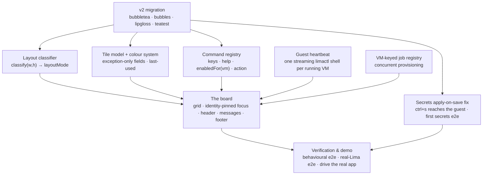
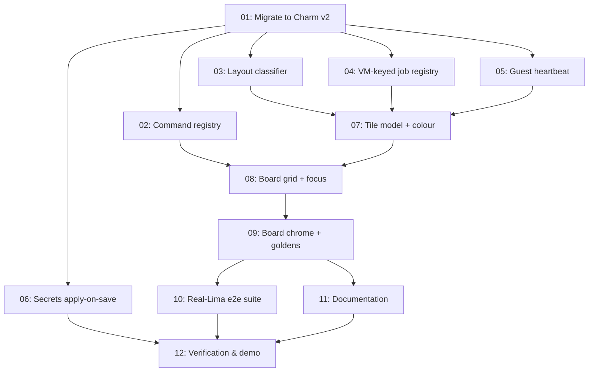

# Plan: A responsive live tile board for the sand TUI

## Original Work Order

> Redesign the `sand` TUI as a responsive tile board (the "Harbormaster" concept from docs/ui-redesign/README.md §5, as refined in discussion — see the refinements section below, which OVERRIDE the doc where they differ).
>
> ## Base branch — IMPORTANT
> This plan MUST be built on top of PR https://github.com/Lullabot/sandbar/pull/27 (branch `feature/11--tui-vm-screen-actions-and-host-secrets`), which is NOT yet merged to main but will be. Branch from that PR head, not from main. That PR already lands, and this plan should reuse rather than reinvent:
> - `internal/ui/hostres_{darwin,linux,unix,other}.go` — host CPU/RAM/disk resource probing
> - `internal/ui/diskusage_{unix,other}.go`, `internal/ui/format.go` (`humanizeBytes`)
> - A per-VM "VM screen" (`viewDetail`) that owns per-VM actions; the list owns global actions
> - `confirmState` — a screen-agnostic confirm overlay
> - `internal/secrets` host-side secrets store + guest apply
> - `internal/lima/runner.go` `Runner` interface with `Output`/`Stream`/`StreamOut`
> - The teatest golden harness at `internal/ui/teatest_test.go`
>
> ## Naming constraint
> The code and the UI must NOT use "Harbormaster" or any nautical/marina theme — no slips, boats, piers, harbour, moored, deck, cargo. Use plain, standard UI vocabulary and whatever the Bubble Tea / Lipgloss / Bubbles ecosystem calls things: tile, board/grid, focus, card, pane, header, footer, status bar, inspector/detail, palette. Package and identifier names should read as ordinary Go UI code.
>
> ## Scale assumption that drives every tradeoff
> 90% of users have 1–3 VMs. Power users top out around 10. Design for 1–3 first; 10 must not fall over. Do NOT build density machinery for 30-VM fleets (no sort-by-many, no elaborate roster paging).
>
> ## The concept, as refined
> Replace the full-screen `view` enum swap with a single persistent surface: a pinned header band (fleet counts + host capacity), a responsive grid of VM tiles, a docked messages/log strip, and a footer command bar. Arrow keys move a focus ring between tiles; single-key verbs target the focused tile; enter zooms the focused tile into the existing VM screen / inspector.
>
> Four refinements agreed in discussion — these are requirements, not suggestions:
>
> 1. **Stable tile order, not state-grouped.** Tiles are sorted alphabetically and STABLE. Do not group running-first on the board: at ≤10 VMs everything is on screen, so grouping saves no scanning, and re-sorting on a state change means pressing `x` (stop) on a focused tile teleports that tile across the board as a side effect of the verb — cursor vandalism at exactly the moment the user may press a second key. State is already carried loudly by colour and glyph. Focus must be pinned to the VM's identity (name), NOT the slot index, so a refresh/add/delete never silently moves the focus ring to a different VM. If a compact roster/list fallback is built, state-grouped sorting is fine THERE (a list you scan, rows with no fixed home).
>
> 2. **Real CPU and memory utilization via a guest-side heartbeat.** Today's `vm.VM` carries only ALLOCATIONS (`CPUs`, `Memory`) plus real disk (`Disk` = qcow2 max, `DiskUsed` = allocated on-disk). Rendering allocation as a utilization bar is dishonest and must not ship. Get real numbers by streaming them from the guest: for each RUNNING VM, open ONE long-lived `limactl shell <name>` (via the existing `lima.Runner.Stream`) running a trivial loop that emits `/proc/stat` + `/proc/meminfo` every N seconds, and parse the stream into a live cpu% and mem used/total. One SSH connection and one goroutine per running VM; at ≤10 VMs the cost is negligible, and it beats a per-tick `limactl shell` spawn (~150–400ms each). Considered and rejected: host-side sampling of the QEMU process tree via `~/.lima/<name>/ha.pid` — it gives a good CPU number but a bad memory number (QEMU RSS is *touched* guest pages; without free-page-reporting it ratchets up to the full allocation and never returns, so it's a high-water mark cosplaying as utilization). Note Lima's guest agent socket (`ga.sock`) is port-forwarding only and will NOT give you metrics. Stopped VMs have NO heartbeat and must show no cpu/mem gauge at all (absent, not zeroed) — that's honest. The heartbeat must be strictly idle-gated: pause it when the board is not the active screen and when the app is idle, so `sand` over SSH/on battery isn't quietly holding N connections open and burning CPU. Verify the process-tree/driver assumptions against a REAL Lima VM (lima 2.1.3 is available in the test VM), don't take them on faith.
>
> 3. **Exception-only fields — drop architecture and base image from the tile by default.** The general rule: a tile shows what DISTINGUISHES this VM from its neighbours right now, not a fixed schema. Architecture is the same for every VM in practice (all clones of one base on one host), so render it ONLY when it differs from the host, as an exception badge. Base image is likewise constant today (everything clones `claude-base`), so hide it on the tile and show it in the inspector — but surface it automatically if/when it varies across the fleet. Implement this as a real "hide a field whose value is uniform across the fleet" rule, not as two hardcoded deletions. This frees two of the tile's six lines.
>
> 4. **`last used` for stopped VMs.** Every tile gets a symmetric, always-populated bottom line: `up 2h14m` when running, `last used 3d ago` when stopped. Source it from the mtime of `~/.lima/<name>/ha.stderr.log` (the hostagent's last write, which lands within seconds of shutdown), with the `disk` file's mtime as a corroborating fallback. This is a cheap `stat` at list time — no new persisted state, and it works for VMs created long before this feature. A VM that has never started has no `ha.stderr.log`, which reads naturally as "never used". This is the field that makes a stopped VM actionable ("last used 6 weeks ago" is how you decide what to delete). If a persistent run-history is built, upgrade to it later; the mtime and the history agree in the common case.
>
> Target tile after the refinements (six lines, mostly live signal — colour indicative, not literal):
>
> ```
> ╭─ sandbox-01 ───────────────╮      ╭─ docs-rfc ─────────────────╮
> │ ● Running          managed │      │ ◌ Stopped          managed │
> │ feat: login form work      │      │ docs: architecture rfc     │
> │ cpu  ▕███░░░░░░░▏ 27%      │      │                            │
> │ mem  ▕█████░░░░░▏ 4.1/8G   │      │ disk ▕█░░░░░░░░░▏ 5/60G    │
> │ disk ▕█░░░░░░░░░▏ 12/100G  │      │ last used 3d ago           │
> │ up 2h14m                   │      │                            │
> ╰────────────────────────────╯      ╰────────────────────────────╯
> ```
>
> Also from the doc, still wanted: the pinned header band with host capacity (an "am I about to over-commit?" answer — PR 27's `hostres` already probes the host), the empty-slot "press n to add a VM" affordance (valuable precisely BECAUSE a 1–3 VM board is mostly empty), the docked messages strip, and non-blocking provisioning — a building VM shows an in-place progress bar on its own tile (`ansible: docker · 7/19`) while the rest of the UI stays live and the user can arrow away and start another VM. That last one requires generalizing today's single `beginStream` reader/output/cancel triple into a VM-keyed concurrent job registry; it is the load-bearing change and the single biggest UX win. Scope it deliberately — if it can't be done well within this plan, say so and split it, but the plan should aim to include it because the demo depends on it.
>
> ## Colour
> The concept doc is silent on colour; this plan must not be. Use tasteful colour to improve legibility and SCANNING — status glyph+colour is the primary channel for "what state is this VM in" (● Running green, ◌ Stopped grey/dim, building animated/amber, ✖ Broken/error red), plus a badge for managed vs external, a bold border on the focused tile, and dim (not absent) chrome. The existing `internal/ui/styles.go` palette (ANSI 256 indices, chosen to degrade gracefully) is the starting point — extend it coherently rather than inventing a second palette. Colour must never be the ONLY carrier of meaning (glyph + text label always accompany it), and the UI must remain readable with `NO_COLOR` / a monochrome terminal.
>
> ## Responsiveness
> Must work well at 80x24 and grow gracefully for larger terminals. Implement the doc's `classify(w, h) → layoutMode` discipline: ONE function per `WindowSizeMsg` picks the layout and sheds the least-essential pane/columns first, replacing the scattered `width-6`/`width-8` magic offsets that exist today. The worst case must be a working, colorized, usable board — NEVER a "terminal too small" wall. At 80x24 expect roughly a single column of tiles or a compact form; at wide sizes, a multi-column grid. Golden tests should pin at least the 80x24 case and one wide case.
>
> ## Testing and confidence — this is a hard requirement, not a nice-to-have
> The last PR shipped a secrets manager that is clearly broken. That must not happen again. This plan will run in a VM WITH ACCESS TO LIMA (limactl 2.1.3), and it may spin up real VMs to test.
>
> - Use and EXTEND the teatest golden-snapshot harness added in `internal/ui/teatest_test.go` — it boots the real Bubble Tea program in a simulated terminal, drives real key events, waits for a screen to render, and snapshots `ansi.Strip(FinalModel().View())` against a golden. Follow its existing conventions (canned `limactl list --format json` via a fake `lima.Runner`; `XDG_DATA_HOME` isolated to a temp dir; behavioural assertions instead of goldens for host-derived screens).
> - Golden snapshots alone are NOT sufficient. That harness's own comment names the failure it exists to catch — "an editor/form that opens unfocused and silently drops input" — and that is exactly the class of bug that shipped anyway. Every interactive surface needs a BEHAVIOURAL end-to-end assertion that drives the real key path and asserts on real model/store state, not just that the screen painted. Specifically: focus routing actually moves focus between tiles; a verb actually reaches the VM under the focus ring (and the RIGHT one); an editor opens focused and typed input lands in the store; a save actually persists.
> - Add REAL end-to-end tests against real Lima VMs (behind a build tag / env guard, in the style of the existing `*_e2e_test.go` files) for the things that can only lie in production: the guest heartbeat stream actually parsing real `/proc/stat` and `/proc/meminfo` from a running VM, the `last used` mtime signal after a real stop, and non-blocking provisioning of a second VM while a first one builds.
> - The plan must include an explicit verification/demo task at the end. The end state of this PR must be DEMOABLE TO A TEAM: someone runs `sand` on a real host with real VMs, creates a VM and watches its tile fill a progress bar without the UI freezing, arrows to another tile and starts it, sees live CPU/mem move, resizes the terminal from wide to 80x24 and the board reflows. I need REAL CONFIDENCE. Do not mark work done on the strength of unit tests alone; drive the real app.
> - Also verify the PR 27 secrets editor still works (or is fixed) under the new board — it is a known-broken surface and the redesign must not paper over it.
>
> ## Reference material
> - `docs/ui-redesign/README.md` — full five-concept doc; §5 is Harbormaster (line ~628), plus "Where sand is today" (line ~33) and the three shared foundations (line ~57: action registry, concurrent job registry, persistent run history).
> - `docs/ui-redesign/concepts.html`, `docs/ui-redesign/images/flameconnect-0.1.0-reference.png` — the visual reference for the "crafted" feel.
> - Current TUI: `internal/ui/` (model.go, list.go, detail.go, keys.go, styles.go, commands.go, progress.go, secrets.go, transfer.go, form.go).
> - `internal/vm/vm.go` — the `VM` struct (Name, Status, CPUs, Memory, Disk, DiskUsed, Dir, Arch).
> - `internal/lima/client.go` — `List()` parses `limactl list --format json`.
> - A note on Bubble Tea v2: floating overlays (zoom, confirm over a dimmed frame) and flicker-free whole-screen repaints want v2's compositor (`PlaceOverlay`) and cell-diffing renderer. There are open Renovate PRs for bubbletea/bubbles/lipgloss v2. Decide explicitly whether this plan takes the v2 migration or ships a v1 skeleton first — don't leave it implicit.
>
> Follow-up from the user: our end goal is a new branch and PR with the plan. We're not going to merge the UI explorations PR.

## Plan Clarifications

| Question | Answer |
| --- | --- |
| Migrate to Bubble Tea / Bubbles / Lipgloss v2 before building the board, or build on v1 first? | **Migrate to v2 first.** The view layer is being rewritten regardless; building it on v1 and redoing it on v2 pays the cost twice. `bubbletea/v2` is stable at v2.0.8 and `x/exp/teatest/v2` exists, so the golden harness survives the migration. |
| Does today's full-screen table list survive in any form (toggle, compact-roster fallback)? | **No — delete it outright.** The board is the only roster surface; `internal/ui/list.go` and its `table.Model` go away. No BC shim, no second render path. The keybinding change under existing users' fingers is an accepted, deliberate break. |
| Is *fixing* PR 27's broken secrets editor in scope, or only characterizing it? | **Fix it in this plan.** The PR's bar is "demoable to a team"; a demo containing a visibly broken secrets surface fails that bar no matter how good the board looks. |
| Is backwards compatibility required anywhere? | **No.** Explicitly confirmed: no BC shim for the old keybindings, no fallback to the old table, no migration path for the removed screens. |
| Is the action registry in scope? (Initially cut on YAGNI grounds, then reinstated.) | **Yes — the minimal version.** The board's footer command bar is inherently state-gated (a stopped VM must not offer Stop), so `enabledFor(vm)` is needed regardless; the only question is whether it lives in one place or two. Today it lives in two, and they already disagree — `viewHelp()` on the VM screen returns every verb unconditionally, so a stopped VM's help bar currently offers `x stop`. The **command palette** that the original exploration bundled with the registry stays **out of scope**. |
| What is the end goal of this work order? | A new branch carrying **this plan document**, opened as its own PR. The `docs/ui-redesign/` explorations branch will **not** be merged. ~~Branched off PR 27's head.~~ **Superseded by Refinement 2 below: PR 27 has merged, so the branch is cut from `main`.** |
| *(Refinement)* The tile mockup's subtitle line (`feat: login form work`) has **no backing data** — no description/label field exists on `vm.VM` or in `registry.entry` (which stores only `Base` and a `vm.CreateConfig`). What feeds it? | **Drop the subtitle line entirely.** VM names in practice are already distinguishing (`sandbar`, `lullabot-sandbar`), so a subtitle would restate the title. No new registry field, no schema change. This frees a tile row. |
| *(Refinement)* Lima reports only `Running` and `Stopped` — `Building` and `Broken` are **not** Lima statuses. A provisioning VM is `Running` to Lima; Ansible is just a process. What does the tile's status line show? | **A derived status: the job registry is consulted first, Lima is the fallback.** A VM with a live provision job renders **Building**; a VM whose last job failed renders **Failed** (sticky, until the user acts); otherwise the Lima status. This makes the job registry a hard dependency of the tile renderer, and it means Building and Failed are honest sand-side states rather than invented Lima ones. |
| *(Refinement)* The plan called the board a "single persistent surface" that "never goes away", but also had `enter` swap to PR 27's full-screen VM screen. Contradiction — which? | **`enter` swaps to PR 27's existing full-screen VM screen.** No new overlay inspector; strictly reuse. The "never goes away" claim was false and is corrected. The v2 migration's justification narrows accordingly — see the component. |
| *(Refinement, auto-resolved)* What feeds the docked messages strip? Today the model carries a single overwritten `m.status` string. | A **bounded, session-only in-memory ring buffer** of timestamped messages, replacing `m.status`. Not persisted. |
| *(Refinement)* If a failed provision turns a tile red, can the user find out **why**? The first draft retained the failed job but gave no way to read its log. | **Yes — the retained run's log is reopenable from the focused tile.** The job registry already holds the buffer (retaining failed jobs is required for the sticky Failed status), so this is one state-gated verb plus the viewport PR 27's progress view already provides. Without it the board is an alarm with no diagnostic: it advertises a failure and withholds the explanation. |
| *(Refinement, auto-resolved)* How does the board stay live? Nothing in the plan specified a refresh. | An **idle-gated refresh tick** re-runs `limactl list` on an interval, on the same gating discipline as the heartbeat and the spinner. |
| *(Refinement, auto-resolved)* At 80×24 a tile column holds only ~2 tiles. What happens with 10 VMs? | The tile grid **scrolls**, in a viewport, with **focus-follows-scroll**. This is the degraded case for a power user at the minimum size and is accepted; it is not a reason to build a compact roster. |
| *(Refinement 2, auto-resolved)* The plan says to branch from PR 27's head, "not from main". Is that still right? | **No — PR 27 is merged.** It landed on `main` on 2026-07-12 (merge commit `966a710`). `main` **is** PR 27's head plus two CI commits, so the base is simply `main`. The `feature/12` branch is currently based on the *pre-rebase* `feature/11` and must be rebased onto `main`. Every "branch from PR 27" instruction in the Original Work Order above is superseded by this row. |
| *(Refinement 2)* The plan carries "fix the broken secrets editor" as a component, but the focus bug it describes was fixed **inside** PR 27 before merge (commit `b10a42c`), with passing behavioural tests. Is the component dead scope? | **No — the editor is still broken, but by a different defect.** `updateSecrets` (`internal/ui/secrets.go:155`) calls `m.sec.SetAll(...)` and returns a `nil` command: **`ctrl+s` never pushes the secret to the guest.** The only callers of `provision.ApplySecrets` are start, restart, and the post-create/reset hook. Editing a secret on a *running* VM writes the host JSON and stops there. The component stays, retargeted at this defect. |
| *(Refinement 2)* How wide is the secrets repair? An audit found four further defects behind the editor. | **The editor path only.** In scope: **(A)** save applies to a running guest, and **(H)** `parseSecrets` splits on the raw line rather than the trimmed one, so a CRLF paste puts a trailing `\r` inside every value. Plus the **first real secrets e2e test** against a live VM — there are currently none. Out of scope, split to a follow-up plan: the shadowed git-credential helper, the scoped `.env` write that clobbers the clone token, and dropped scopes leaving plaintext tokens in the guest. Those are token-safety bugs that deserve their own scrutiny, not a subsection of a UI redesign. See *Notes*. |
| *(Refinement 2)* Deleting `list.go` also deletes the managed-only toggle (`f`) and the name search (`/`). The plan never said what becomes of them. | **The board is *always* filtered to managed VMs — the toggle is deleted, not ported.** `f` and `m.managedOnly` go away; the filter is unconditional. **`/` name search is kept** and ported to the board. |
| *(Refinement 2)* Today's managed-only filter shows managed clones **and base images** (`list.go:55`), hiding only unrelated VMs. Under an always-on filter, does a base image still get a tile? | **No — managed clones only.** `claude-base` gets no tile. The board is "my sandboxes", not "what sand put on your host". Two consequences: the managed/external badge is now **uniform across the fleet by construction**, so the plan's own exception-only-field rule hides it automatically (one less element per tile); and base images become unmanageable from the TUI. That second one is a real regression — mitigated by a header count of what is hidden, so the board does not silently misrepresent the host. See *Risks*. |

## Executive Summary

The `sand` TUI is a single-screen application whose `view` enum swaps the entire
terminal between eight full-screen states. Reading one VM means leaving the list;
provisioning a VM takes the screen hostage for minutes and freezes every key. The
list itself is a seven-column table that answers "what VMs exist" but not "what is
actually happening right now."

This plan replaces that list with a live **tile board**: a pinned header band
carrying fleet counts and host capacity, a responsive grid of VM tiles, a docked
messages strip, and a state-gated footer command bar. Each VM is a card whose every
line carries live signal — a coloured status glyph, real CPU and memory utilization
streamed from inside the guest, a real disk bar, and an uptime or "last used" line
that makes a stopped VM actionable. Focus moves between tiles with the arrow keys;
verbs target the focused tile; `enter` opens PR 27's existing VM screen for it.
Provisioning stops being a modal takeover and becomes a progress bar drawn on the
building VM's own tile while the rest of the board stays live and interactive.

The board shows **sand's own sandboxes and nothing else** — the managed-only view
is unconditional rather than a toggle, and base images and unrelated host VMs get
no tile. A `/` name search is retained.

*(Refined: the board is the app's home surface and the only roster, but it is not
literally always on screen — `enter` still swaps to the full-screen VM screen. An
overlay inspector was considered and cut as unnecessary new surface. See the
clarifications table.)*

The approach is deliberately sized to the real user: **90% of users have 1–3 VMs,
power users have up to 10.** That assumption is load-bearing and it *removes*
work rather than adding it — no density machinery, no compact-roster fallback, no
multi-key sorting, no paging. It also inverts the usual grid tradeoff: a board
that is mostly empty is a liability at thirty VMs and an asset at three, where the
empty space becomes the primary call to action. The two changes that carry the
most user-visible value are the **guest heartbeat** (which replaces gauges that
today would be dishonestly rendering static allocations as live utilization) and
the **concurrent job registry** (which un-freezes the UI during provisioning).
Both are prerequisites for the demo this work must survive.

## Context

### Current State vs Target State

| Current State | Target State | Why? |
| --- | --- | --- |
| `viewList` renders a 7-column `table.Model` that answers "what VMs exist" but not "what is happening" | A live tile board — the app's home surface and only roster; `enter` opens the VM screen for the focused tile | A table row cannot show a build in flight, live utilization, or how stale a stopped VM is |
| A provisioning VM is `Running` to Lima (Ansible is just a process), so the board would render it as an ordinary healthy VM — and a **failed** provision would leave a green "Running" tile | Status is **derived**: the job registry is consulted first (live job → Building; failed job → Failed, sticky), Lima's Running/Stopped is the fallback | Lima reports only `Running` and `Stopped`. Building and Failed are real sand-side states and must come from the job registry, not be invented as Lima ones |
| Ansible output is **ephemeral**: it streams into the progress viewport and is gone the moment you leave the screen. A provision that fails while you look away is unexplainable — you re-run and hope you are watching this time | The job registry **retains the last run per VM, including its log**, and the focused tile can **reopen it** | A red tile the user cannot interrogate is an alarm with no diagnostic. The buffer is already retained for the sticky Failed status; exposing it is one state-gated verb, not a new subsystem |
| `beginStream` flips to a full-screen Ansible log and `m.running` freezes every key for minutes | A VM-keyed job registry; a building VM shows an in-place progress bar on its own tile while the board stays live | Provisioning is the flow a 1–3 VM user spends the most time in, and it is the one that hijacks the screen |
| The board would show `CPUs` and `Memory`, which are **allocations**, in bars that look like utilization | Real cpu% and mem used/total streamed from `/proc/stat` + `/proc/meminfo` inside each running guest | Rendering an allocation as a utilization bar implies telemetry the tool does not have. It must not ship |
| Stopped VMs would show gauges reading zero, or stale allocation bars | Stopped VMs show **no** cpu/mem gauge at all — the field is absent, not zeroed | Absence is honest; a zeroed bar is a claim we cannot support |
| A stopped VM offers no signal about whether it is still wanted | Every tile ends in `up 2h14m` (running) or `last used 3d ago` (stopped) | "Last used 6 weeks ago" is how a user decides what to delete — the only decision they routinely make about a stopped VM |
| Every VM would render `aarch64` and its base image, identically, six times | Fields whose value is **uniform across the fleet** are hidden; they surface automatically when they vary | A tile should show what distinguishes this VM from its neighbours, not a fixed schema. This is what stops a 3-tile board reading like a filled-in form |
| `defaultKeys()` and `viewHelp()` are two hand-maintained parallel lists; `viewHelp()` returns every VM verb **unconditionally**, so a stopped VM's help bar offers `x stop` | One command registry — keys, help text, `enabledFor(vm)`, and action in one place; the keymap, the footer, and the dispatcher all derive from it | The board's footer is per-focused-tile and therefore inherently state-gated. Without one source of truth, the footer and the dispatcher must independently agree about every VM state, and the failure is silent |
| Layout offsets are scattered `width-6` / `width-8` magic numbers | One `classify(w, h) → layoutMode` per `WindowSizeMsg`, shedding the least-essential pane first | The worst case must be a working board at 80×24, never a "terminal too small" wall |
| Tile order would follow VM state (running first) | Stable alphabetical order; focus pinned to VM **identity**, not slot index | Re-sorting on a state change means pressing `x` on a focused tile teleports it across the board *as a side effect of the verb* — at exactly the moment the user may press a second key |
| Bubble Tea v1: no compositor, no cell-diffing renderer | Bubble Tea / Bubbles / Lipgloss **v2** | Overlays (zoom, confirm over a dimmed frame) and flicker-free repaint of a live board are what v2 provides. The view layer is being rewritten anyway — migrate once |
| The roster shows managed clones, base images, **and** (with `f` off) every unrelated Lima VM on the host | The board shows **managed clones only**, always — `f` and `m.managedOnly` are deleted, the filter is unconditional. `/` name search is kept | A base image is a clone source, not a workspace; an unrelated VM is not sand's business. On a board each costs a whole tile rather than one table row, and the dominant 1–3 VM case is exactly where that noise hurts most |
| Saving a secret on a **running** VM writes the host store and **never reaches the guest** — `updateSecrets` returns a `nil` command, and `ApplySecrets` is only called on start/restart/create | `ctrl+s` applies to a running guest as part of the save | Rotating an expired token silently leaves the dead one live in `~/.config/sandbar/secrets.env` and in every open shell. The status line ("they apply on next start") reads as a design note but is the bug |
| The secrets editor has **behavioural tests that pass** — they drive the real key path and assert the host store persists — and the feature is broken anyway | Assertions that reach the **guest**, via the first real-Lima secrets e2e test | The store is not the guest. An assertion that stops at the nearest in-process state proves the code did what it did, not that the feature works |

### Background

**PR #27 has merged. The base is `main`.** The Original Work Order above says to
branch from PR 27's head "not from main", because at the time it was written the PR
was still open. It landed on 2026-07-12 (merge commit `966a710`), so `main` now *is*
PR 27's head plus two CI commits, and the instruction is satisfied by branching from
`main`. One practical consequence: the `feature/12` branch was cut from the
*pre-rebase* `feature/11` and therefore diverges from `main` — **it must be rebased
onto `main` before any work lands.**

PR 27 supplies foundations this plan **reuses rather than reinvents**:

- `internal/ui/hostres_{darwin,linux,unix,other}.go` — host CPU/RAM/disk probing,
  which the header band's capacity readout is built directly on.
- `internal/ui/diskusage_{unix,other}.go` and `internal/ui/format.go`
  (`humanizeBytes`) — the disk bar and every size string on a tile.
- The **VM screen** (`viewDetail`), which already owns every per-VM action. The
  board's `enter`-to-zoom target is this screen; it is not a new surface.
- `confirmState` — a screen-agnostic confirm overlay the board can raise as-is.
- `internal/secrets` — the host-side store and guest apply.
- `internal/lima/runner.go`'s `Runner` interface (`Output` / `Stream` /
  `StreamOut`). `Stream` is the mechanism the guest heartbeat is built on; it
  already exists.
- `internal/ui/teatest_test.go` — the golden harness this plan extends.

**The concept documentation will not be available.** The five-concept exploration
lives on `design/tui-redesign-concepts`, which is **not** being merged. This plan
is therefore written to be self-contained: it restates the design rather than
citing documents that will not exist on `main`. Nothing downstream should depend
on `docs/ui-redesign/`.

**Naming.** The originating concept carried a nautical metaphor. **No code,
identifier, comment, or user-visible string may use it** — no harbour, slip, boat,
pier, moored, deck, or cargo. Use the vocabulary the Charm ecosystem and ordinary
UI work already use: tile, board, grid, focus, card, pane, header, footer, status
bar, inspector, palette.

**Approaches considered and rejected.**

- *Host-side process sampling for cpu/mem* (reading `~/.lima/<name>/ha.pid` and
  walking the QEMU process tree). It yields a good CPU number but a **bad memory
  number**: QEMU's RSS counts guest pages that have been *touched*, and without
  free-page-reporting it ratchets upward toward the full allocation and never
  comes back down. It is a high-water mark wearing the costume of a utilization
  gauge — a different flavour of the same dishonesty as the allocation bars.
  Rejected in favour of guest-side sampling.
- *Lima's guest agent socket* (`ga.sock`) as a metrics source. It handles port
  forwarding only and exposes no metrics. Not viable.
- *A per-tick `limactl shell` spawn per VM.* Each spawn costs roughly 150–400ms
  and a fresh SSH connection. Rejected in favour of one long-lived streaming
  shell per running VM.
- *A compact-roster fallback beside the board.* Called for by the original
  concept as insurance against tile density. At ≤10 VMs the board always fits, so
  the roster buys nothing and costs a second render path, its own goldens, its own
  focus routing, and a standing risk that the two surfaces disagree. Cut on YAGNI
  grounds.
- *Building the board on Bubble Tea v1 and migrating later.* Rejected: it rewrites
  the view layer twice and defers precisely the polish layer (overlays,
  flicker-free repaint) that makes the board feel finished.

**The confidence problem is the real problem, and it is worse than it first looked.**
The story is usually told in one step: PR 27's secrets editor opened *unfocused* and
silently dropped every keystroke, and it did so *past a passing golden test of the
secrets screen* — the exact bug class the harness's own comment says it exists to
catch. The obvious lesson is "goldens are not enough": a golden asserts that a screen
*painted*, never that it *works*.

But that lesson, taken alone, would have been learned and the feature would still be
broken — which is precisely what happened. The focus bug **was** caught before merge
(`b10a42c`), and the fix came with real behavioural tests: `TestSecretsEditorIsFocusedOnOpen`,
`TestSecretsEditorTypeInsertsAndSaves`, `TestSecretsEditorSaveValidPersists`. They
drive the real key path through `Update`, they assert on real store state, they pass —
and **the editor is still broken**, because `ctrl+s` never pushes the secret to the
guest (see the secrets component). The tests assert that the host store persisted.
The user's complaint is that the *VM* did not change. Those are different claims, and
every test in the suite makes the first one.

So the actual lesson is a step further than "write behavioural tests": **the assertion
has to reach the boundary the user cares about.** A test that stops at the nearest
in-process state — the model, the store — proves the code did what the code does, not
that the feature works. This is why this plan does not treat the in-process
behavioural assertion as the finish line: every claim that crosses into a guest, onto
a disk, or across a process boundary needs a real-Lima e2e test that checks the far
side. The heartbeat parse, the `last used` mtime, concurrent provisioning, and the
secrets apply are all in that category, and today **not one of them has an e2e test at
all** — the archived plan-11 task that would have written the secrets e2e was never
built.

## Architectural Approach

The work decomposes into seven components. The v2 migration is a prerequisite for
everything; the command registry, the tile model, and the layout classifier are
prerequisites for the board; the heartbeat and the job registry are independent of
each other and both feed the board's live behaviour.



### Bubble Tea v2 migration

**Objective**: pay the view-layer migration cost exactly once, on a codebase that
is about to be rewritten anyway, and do it as an isolated, verifiable checkpoint
before any redesign work begins.

Move `bubbletea`, `bubbles`, and `lipgloss` to v2, and the test harness to
`github.com/charmbracelet/x/exp/teatest/v2`. This subsumes the three open Renovate
PRs (#22, #23, #24), which should be closed in favour of this work rather than
merged alongside it. `bubbletea/v2` is stable at v2.0.8, and the existence of a v2
teatest means the confidence harness survives — that was the precondition for
choosing this order.

The migration is mechanical and its correctness criterion is exact: the four
existing goldens (`TestTUIListView`, `TestTUIDetailView`, `TestTUIDeleteConfirm`,
`TestTUISecretsPanelEmpty`) are regenerated once, the diff is reviewed to confirm
it is renderer noise rather than a behavioural change, and the full suite is green
**before** a single line of the redesign lands. Doing this first means that when
the board later misbehaves, the migration is not a suspect.

What v2 buys, concretely, is not cosmetic. The **cell-diffing renderer** is what
keeps a board that repaints on every refresh tick — with animated progress bars on
building tiles and moving gauges on running ones — from flickering; this board
redraws far more often than the static table it replaces, so the renderer is
load-bearing rather than a nicety. The **compositor** (`PlaceOverlay`) is how the
confirm overlay draws over a dimmed board without hand-rolled string splicing.

*(Refined: this rationale originally also cited a zoom-inspector overlay. That
surface was cut — `enter` opens PR 27's existing full-screen VM screen instead — so
the compositor's justification now rests on the confirm overlay alone. The
cell-diffing renderer is unaffected and remains the stronger of the two reasons.)*

### The command registry

**Objective**: give the board's state-gated footer a single source of truth, and
delete the duplicated verb-eligibility logic that today lets the help bar and the
key dispatcher disagree in silence.

The board's footer command bar shows the verbs available for the **focused tile**,
which makes it inherently state-dependent: a stopped VM must not offer Stop, a
building VM must not offer Delete, and only a VM with a retained run may offer to
reopen its log. That predicate — `enabledFor(vm)` — has to exist regardless of how
the code is organized. The only real question is whether it exists once or twice.

*(Refined: an earlier draft also listed "an unmanaged VM must not offer Reset" as a
predicate this registry must carry. It no longer needs to: the board is
unconditionally filtered to managed clones, so an unmanaged VM can never be focused.
The gate is enforced by the board's scope rather than by every verb.)*

Today it exists twice, and the two copies already disagree. `internal/ui/keys.go`
carries a flat `defaultKeys()` struct of bindings and a hand-maintained
`viewHelp()` switch that lists a subset per view. On the VM screen, `viewHelp()`
returns Start, Stop, Restart, Reset, Shell, Delete, Upload, Download, and Secrets
**unconditionally, regardless of the VM's state** — so a stopped VM's help bar
currently advertises `x stop`. That is a live bug on the branch this plan builds
on, in precisely the subsystem the board is about to rewrite.

Collapse both into one registry: a list of commands, each carrying its key
binding, its help text, its `enabledFor(vm)` predicate, and its action. The
keymap, the footer command bar, and the key dispatcher are all **derived** from
that one list rather than maintained beside it. State-gated verbs then fall out for
free, and the drift becomes structurally impossible rather than merely discouraged.

Two things are deliberately **not** in this component. The original exploration
bundled the registry with a **fuzzy command palette**; no part of this board needs
one, it is a whole interaction surface with its own tests, and it stays out of
scope. And this is not a general-purpose command framework — it is one list, with
one predicate, sized to the verbs `sand` actually has.

The reason it lands here rather than in a later PR is the same reason the v2
migration goes first: the board rewrites the key routing anyway. Threading verbs
through a registry *while* rewriting them is a fraction of the cost of retrofitting
one afterwards, and retrofitting means touching the same files twice.

This component is also unusually easy to hold to the plan's testing bar: "a stopped
VM offers no Stop verb, and pressing `x` on it does nothing" is a behavioural
assertion over real model state, not a golden that proves a footer painted.

### The layout classifier

**Objective**: make responsiveness a single, testable decision rather than a
scatter of magic offsets, and guarantee that the degraded case is a working board.

One function maps the terminal's dimensions to a layout mode, and every pane
derives its size from that mode's budget. It runs once per `WindowSizeMsg` and
nowhere else. This replaces the `width-6` / `width-8` offsets sprinkled through
the current views, which is both the source of today's layout fragility and the
reason no one can say what `sand` does at an unusual size without running it.

The modes shed the least-essential surface first. At wide sizes: a multi-column
tile grid, the full header band with host capacity, the messages strip, and the
footer. As width and height contract, the grid narrows toward a single scrolling
column of tiles, the header band compacts to counts, and the messages strip is the
first pane to go. **80×24 must be a good experience, not a survivable one** — the
board is still a board, still coloured, still navigable. There is no
"terminal too small" wall at any size; the classifier's contract is that it always
returns a renderable mode.

Two golden snapshots pin the ends of this range: 80×24 and one wide size. They are
the regression net for the offsets this component exists to delete.

### The tile model and the colour system

**Objective**: define what a tile shows and how it is coloured, such that every
line carries live signal and nothing on it is a lie.

A tile is a bordered card whose content is derived, not fixed. Its lines are: a
title (the VM name), a status line (coloured glyph + status word), a cpu gauge and a
mem gauge **only when the VM is running and a heartbeat sample exists**, a disk gauge
(always — this is real data today), and a closing line that reads `up <duration>`
when running and `last used <duration> ago` when stopped. A building tile replaces
its gauges with an in-place progress bar and the current Ansible role and task count.

*(Refined: the status line previously also carried a managed / external badge. The
board is now unconditionally filtered to managed clones, so every tile is managed by
construction, the badge is uniform across the fleet, and the exception-only rule
below hides it with no special case. It is not deleted — it is simply never
exceptional. See the board component.)*

*(Refined: an earlier draft carried a subtitle line, taken from the concept mockup.
It was fiction — no description or label field exists on `vm.VM` or in the registry.
It is cut rather than invented: VM names in practice already distinguish the tiles
(`sandbar`, `lullabot-sandbar`), so a subtitle would restate the title.)*

**Status is derived, not read.** This is the subtlest thing on the tile and the
easiest to get wrong. Lima reports only `Running` and `Stopped` — to Lima, a VM
being provisioned is simply `Running`, because Ansible is just a process inside it.
So the tile's status line is a merge: the **job registry is consulted first** (a VM
with a live provision job renders **Building**, animated, with its progress bar; a
VM whose last job *failed* renders **Failed**, red and sticky until the user acts on
it), and Lima's `Running` / `Stopped` is the fallback. Rendering `vm.Status`
directly would mean a build in flight looks identical to a healthy idle VM — and,
far worse, a **failed provision would leave a reassuring green "Running" tile**.
This makes the job registry a hard dependency of the tile renderer, which it already
was for the progress bar.

Two further rules govern what appears:

*Exception-only fields.* A field whose value is **uniform across the whole fleet**
is hidden. Architecture and base image both fall out of this rule rather than being
individually deleted: today every VM is the host's architecture and every clone
comes from the same base, so both vanish from the tile — but the moment a second
base or a foreign architecture appears, the field surfaces automatically, as a
badge, on the tiles that differ. Implemented as a genuine uniformity test over the
fleet, this is a general rule with two current consequences, and it is what keeps a
three-tile board from reading like a form with the same answer typed into every
row.

*Honest absence.* A stopped VM has no heartbeat, so it renders **no cpu and no mem
gauge at all**. Not a zeroed bar, not a greyed bar — absent. The gauge's presence
is itself information.

The colour system extends the existing `internal/ui/styles.go` palette (ANSI 256
indices, chosen to degrade on limited terminals) rather than introducing a second
one. Status is the primary scanning channel: running reads green, stopped reads
dim grey, building reads amber and animates, failed reads red. (The concept's
`✖ Broken` state is dropped: nothing in Lima or `sand` produces it. **Failed**,
sourced from the job registry, is the real state it was gesturing at.) The focused
tile wears a bold border; chrome is dim rather than absent; the managed/external
badge is a distinct, quieter channel from status. Two constraints are absolute:
**colour is never the only carrier of meaning** — a glyph and a text label always
accompany it, which is also what makes the ANSI-stripped goldens meaningful — and
the UI stays readable under `NO_COLOR` and on a monochrome terminal.

`last used` is sourced from the mtime of `~/.lima/<name>/ha.stderr.log`, the
hostagent's last write, which lands within seconds of the VM's shutdown. The
instance's `disk` file mtime is a corroborating fallback. This is a `stat` at list
time: no new persisted state, no schema change, and it works for VMs created long
before this feature existed. A VM that has never been started has no
`ha.stderr.log` at all, which reads naturally as "never used".

### The board

**Objective**: replace `viewList` with the persistent surface, and get focus
routing right — because focus is where a grid UI is most likely to betray the user.

The board composes the header band (fleet counts, and host capacity from PR 27's
`hostres` — the "am I about to over-commit?" readout), the tile grid, the docked
messages strip, and the footer command bar. `internal/ui/list.go` and its
`table.Model` are **deleted**; the board is the only roster surface. Arrow keys
move a focus ring across the grid in two dimensions; single-key verbs act on the
focused tile; `enter` zooms it into PR 27's existing VM screen.

The footer renders directly from the command registry, filtered by the focused
tile's VM through `enabledFor(vm)` — so it advertises exactly the verbs that will
actually fire, and it changes as the focused VM's state changes.

**The board shows managed clones, and only managed clones.** Today's roster has a
three-way split — managed clones, base images, and unrelated Lima VMs — and an `f`
toggle (`m.managedOnly`) that hides only the third group, leaving base images
visible either way (`internal/ui/list.go:55`). On the board the filter becomes
**unconditional**: `f` and `m.managedOnly` are deleted, and a tile exists if and
only if `reg.IsManaged(name)`. A base image is a clone source, not a workspace, and
an unrelated VM is not sand's business; on a board each would cost a whole tile
rather than one table row, which is worst exactly in the dominant 1–3 VM case the
board is designed for.

This has a pleasing consequence for the tile: **every VM on the board is managed by
construction**, so the managed/external badge is uniform across the fleet — and the
exception-only field rule therefore hides it automatically, with no special case.
The badge falls out of the board's scope rule the same way architecture and base
image fall out of the fleet's uniformity. It reappears on its own if the notion of
an unmanaged tile is ever reintroduced.

It also has a cost, and it is a real one: **base images become invisible and
unmanageable from the TUI**, with no toggle to reveal them. A stale base image is
heavy — the two on the current test host are 2.2GB and 7.2GB — and a board that
silently omits them is telling a partial truth about the host. The mitigation is
one string, not a second surface: **the header band carries a count of what is
hidden** (e.g. `3 sandboxes · 1 base, 2 external hidden`). The board stays a board;
the user is never misled about what is actually on their machine. Base management
remains available through `limactl` and is a candidate for a later CLI verb.

**`/` name search is kept** and ported to the board: a live-typing mode that narrows
the visible tiles, `esc` to clear. It is retained deliberately even though the scale
assumption argues against it — the existing behaviour where a search captures action
keys (`TestSearchCapturesActionKeys`) must be preserved, since single-key verbs and a
typing mode compete for the same keystrokes. Focus stays pinned to VM identity across
a filter change, exactly as it is across a refresh.

One existing semantic must survive the port, and it is subtle enough that today's
code documents it at length (`internal/ui/list.go:84`): **`X` (stop all) means "stop
every managed VM", not "stop what I can currently see"** — an active `/` filter does
not narrow it. That code already excludes base images from its targets, which is the
same rule the board now applies to tiles; the two are finally consistent.

Three mechanics the first draft left unspecified, resolved here:

*The board stays live on a refresh tick.* An interval timer re-runs `limactl list`
and re-renders. It obeys the same idle-gating discipline as the heartbeat and the
spinner — an idle `sand` on a backgrounded terminal must not poll. Without this the
board is a snapshot, and every claim about it being "live" is false.

*The messages strip is a bounded, session-only ring buffer* of timestamped entries,
replacing today's single overwritten `m.status` string. Bounded because it must not
grow without limit in a long-lived session; session-only because persisting it is
the deferred run-history feature, not this one. Job lifecycle events (started,
failed, finished) and action results write to it.

*The grid scrolls, and focus follows scroll.* At 80×24 a single tile column holds
roughly two tiles, so a power user with ten VMs will scroll. The viewport must keep
the focused tile visible, and moving focus past the viewport's edge must scroll
rather than trap the ring. This is the accepted degraded case at the minimum
supported size — it is explicitly **not** a reason to reintroduce the compact
roster.

`enter` opens PR 27's existing full-screen VM screen for the focused tile; `esc`
returns to the board, with focus still on the same VM. There is no overlay
inspector — that surface was considered and cut as unnecessary new work.

Two properties are non-negotiable and they are the reason this component is called
out separately from "render some cards":

*Stable order.* Tiles are sorted alphabetically and the order does not change when
a VM's state changes. Grouping running VMs first is rejected: at ≤10 VMs the whole
fleet is on screen, so grouping saves no scanning, while re-sorting on a state
transition means that pressing `x` on the focused tile makes that tile *jump across
the board as a direct side effect of the verb the user just pressed* — at exactly
the moment they are most likely to press another key. State is already carried
loudly by colour and glyph, which is the channel that is good at it.

*Identity-pinned focus.* Focus tracks the **VM's name**, never the slot index. A
refresh, an addition, or a deletion must never silently slide the focus ring onto a
different VM. This is the difference between a board that is safe to hold a
destructive key on and one that is not.

The empty-slot affordance — a ghost tile reading "press `n` to add a VM" — is
retained precisely *because* a 1–3 VM board is mostly empty. The dominant state of
the target user's board becomes a call to action instead of dead space.

### The guest heartbeat

**Objective**: put real utilization on the tiles, cheaply enough that it can run
continuously, and honestly enough that it can be trusted.

For each **running** VM, open one long-lived `limactl shell` via the `Runner.Stream`
interface PR 27 already provides, running a trivial in-guest loop that emits
`/proc/stat` and `/proc/meminfo` on an interval. Parse the stream into a live cpu
percentage and a mem used/total. The cost is one SSH connection and one goroutine
per running VM — at ≤10 VMs, negligible — and it avoids paying a 150–400ms process
spawn on every sample tick.

The heartbeat is **strictly idle-gated**. It pauses when the board is not the
active screen and when the application is idle, so `sand` left open over SSH or on
battery is not quietly holding N connections open and burning CPU. This extends the
discipline the codebase already applies to its spinner.

The Lima-side assumptions here must be **verified against a real Lima VM**
(limactl 2.1.3 is available in the test environment), not taken on faith. That
includes the behaviour of the streaming shell across a VM stopping underneath it:
the heartbeat must terminate cleanly and the tile must fall back to its stopped
rendering without a stuck gauge or a leaked goroutine.

### The VM-keyed job registry

**Objective**: un-freeze the UI during provisioning. This is the load-bearing
change, and the demo depends on it.

Today a single `beginStream` reader/output/cancel triple can serve exactly one
job, and `m.running` freezes every key while it runs. Generalize it into a registry
keyed by VM name, so several provisions, transfers, or syncs can be in flight
simultaneously while the board stays fully interactive. Each job's progress renders
on its own VM's tile as an in-place bar with the current Ansible role and task
count; the board's other tiles remain live and actionable throughout.

This is the change that produces the signature moment the demo is built around: a
user presses `n`, fills the form, and instead of the screen going dark with a
full-screen Ansible dump, a new tile appears with a building badge and a filling
progress bar — and the user can arrow away and start a *second* VM while the first
one builds.

The registry is also the **source of the tile's Building and Failed statuses**, not
just its progress bar — see the tile model. That makes it a hard dependency of the
tile renderer, and it raises the bar on one behaviour in particular: a **failed job
must be retained**, not discarded, because a job that vanishes on failure leaves the
VM rendering as a healthy green "Running" tile. Failure must be sticky and visible
until the user acts on it.

**The retained run's log is reopenable from its tile.** Today Ansible's output is
ephemeral: it streams into the progress viewport and is gone the moment the user
leaves that screen, so a provision that fails while they are looking away is simply
unexplainable — the only recovery is to re-run it and hope to be watching. Since the
registry must retain the failed job anyway (that is what makes the Failed status
sticky), it is already holding the log buffer. Expose it: a state-gated verb on the
focused tile reopens the last run's output in the viewport PR 27's progress view
already provides.

This is deliberately small — one command-registry entry whose `enabledFor(vm)` is
"this VM has a retained run", plumbed to an existing surface. But it is not
optional, and the reason is a direct consequence of the status work above: having
made a failed provision render as a red tile, a board that then *withholds the
reason* is an alarm with no diagnostic. It advertises a problem and refuses to
explain it, which is a worse experience than not flagging it at all. The scope is
**the last run per VM, in memory**. See *Decision Log* for the three layers of run
history and where the line is drawn.

The scoping judgment, made deliberately: **this belongs in this plan.** It cannot
be deferred without gutting the demo, and the board's tile-level progress rendering
and status derivation have no meaning without it. Cancellation must remain per-job
and correct, and a job whose VM disappears must not leak.

### The secrets apply-on-save fix

**Objective**: make saving a secret actually change the VM, and put the first
end-to-end test in front of the secrets subsystem.

The defect is **not** the focus bug — that one was found and fixed inside PR 27
(`b10a42c`), and it is not what remains broken. The live defect is one layer down:

**`ctrl+s` never reaches the guest.** `updateSecrets` (`internal/ui/secrets.go:155`)
parses the buffer, calls `m.sec.SetAll(...)`, and returns a **`nil` command**. The
only three call sites of `provision.ApplySecrets` are `startCmd`, `restartCmd`, and
`applySecretsCmd` — and `applySecretsCmd` is dispatched only from `provisionDoneMsg`
after a create or reset (`internal/ui/model.go:373`). There is no apply on the save
path and no apply key binding. So editing a secret on a **running** VM writes the
host JSON and stops. The guest keeps the old value until the user happens to restart.

The consequence is worse than a stale display. Rotating an expired `GH_TOKEN` leaves
the dead token live in the guest's `~/.config/sandbar/secrets.env` and in every shell
already sourcing it, while the TUI shows the new one and reports success. The status
line says "secrets saved for X — they apply on next start", which reads like a
considered design note and is in fact a description of the bug.

The fix is small and the shape is already there: batch an apply into the save,
gated on the VM being `Running` — a stopped VM has nothing to apply to, and its
value legitimately lands on next start, which is the behaviour the status line
currently claims for everyone.

Also fixed here, because it is in the same parse path and is a data-corruption bug:
`parseSecrets` splits on the **raw** line rather than the trimmed one
(`internal/ui/secrets.go:128`). Keys are trimmed, values are not — so a buffer pasted
with CRLF line endings puts a trailing `\r` inside every *value*, and `Render`
faithfully single-quotes it into the guest environment.

**This component carries the plan's first secrets e2e test, and that is the point of
it.** There are currently **no e2e tests for secrets at all** — the archived plan-11
task that would have written them was never built, and `grep -i secret` over the two
existing `//go:build limae2e` files returns nothing. This is exactly how a feature
ships with green behavioural tests and a broken end-to-end path: every test asserts
that the host store persisted, and not one asserts that the guest changed. The e2e
test must edit a secret on a **running** VM, save, and then read the value back **from
inside the guest** without restarting it.

*(Refined: this component was originally scoped as "fix the broken secrets editor",
aimed at the focus bug — which was already fixed. Retargeted at the real defect. An
audit of the subsystem behind the editor found four further bugs, deliberately left
out of scope; see* Notes *for the follow-up plan.)*

## Risk Considerations and Mitigation Strategies

<details>
<summary>Technical Risks</summary>

- **The guest heartbeat's Lima assumptions are unverified.** The design rests on a
  long-lived `limactl shell` streaming reliably, and on its clean termination when
  the guest stops underneath it.
    - **Mitigation**: verify against a real Lima VM (limactl 2.1.3) before the tile
      rendering depends on it, and cover the stop-underneath case explicitly in a
      real-Lima e2e test. Treat a leaked goroutine or a stuck gauge as a failure,
      not a cosmetic issue.
- **Heartbeat resource cost on constrained hosts.** N persistent SSH connections
  plus N goroutines, on a laptop, over a remote link.
    - **Mitigation**: strict idle-gating (pause when the board is not active and
      when the app is idle); heartbeats only for *running* VMs; verify the idle
      case draws no measurable CPU.
- **A failed provision renders as a healthy VM.** Lima reports a provisioning VM as
  `Running`, so if the job registry drops a failed job — or if the tile renderer
  falls back to `vm.Status` — a build that died leaves a reassuring green tile and
  the user believes they have a working sandbox. This is the most dangerous
  single failure mode in the plan, because it fails *quietly and reassuringly*.
    - **Mitigation**: status is derived with the job registry consulted first;
      failed jobs are retained and sticky; a real-Lima e2e test deliberately fails a
      provision and asserts the tile renders **Failed**, not Running. This is a
      demo-blocking check, not a nice-to-have.
- **The concurrent job registry introduces the codebase's first real concurrency.**
  Races, leaked jobs, and mis-routed cancellation are the failure modes, and they
  are exactly the kind that pass unit tests and fail demos.
    - **Mitigation**: run the suite under the race detector; cover the
      two-jobs-in-flight case and the job-whose-VM-disappears case explicitly;
      exercise concurrent provisioning against real Lima, not just fakes.
- **The v2 migration hides a behavioural change inside renderer noise.** Regenerated
  goldens make every diff look expected.
    - **Mitigation**: migrate as an isolated checkpoint *before* any redesign work,
      and review the regenerated golden diff specifically for behavioural change
      rather than accepting it wholesale. The suite must be green on v2 with no
      redesign in the tree. There are exactly four goldens (`TestTUIListView`,
      `TestTUIDetailView`, `TestTUIDeleteConfirm`, `TestTUISecretsPanelEmpty`); a
      fifth teatest, `TestTUINewFormAcceptsTyping`, is behavioural and has no golden,
      so a v2 regression there surfaces as a failure rather than a diff to rubber-stamp.
- **The demo host cannot fit two concurrent builds.** The concurrent-provisioning
  validation is the plan's signature moment, and it is the one step that needs real
  capacity. The test host has 16 cores and 15GiB of RAM, while the existing base VM
  is allocated 8 CPUs and 8GiB — two such VMs at once do not fit in RAM.
    - **Mitigation**: create the demo VMs with modest explicit CPU and memory (the
      create form already takes both) rather than the base's defaults. This is a
      demo-setup constraint, not a design constraint, but it will silently ruin the
      validation run if it is discovered at demo time.
</details>

<details>
<summary>Quality and Confidence Risks</summary>

- **The headline risk: shipping another surface that renders correctly and does not
  work.** This has now happened *twice* in the same subsystem, and the second time is
  the instructive one. The secrets editor shipped past a passing **golden** (it opened
  unfocused and dropped every key). That was fixed — and the replacement **behavioural**
  tests, which drive the real key path and assert on real store state, *also* pass while
  the feature remains broken end-to-end, because `ctrl+s` never reaches the guest. Each
  layer of test caught the previous layer's bug and missed the next one.
    - **Mitigation**: goldens are demoted to layout-regression insurance, and the
      behavioural assertion is treated as *necessary but not sufficient*. The
      controlling rule is that **an assertion must reach the boundary the user cares
      about**: if a claim crosses into a guest, onto a disk, or across a process
      boundary, the test checks the far side. In-process assertions prove the code did
      what the code does. No surface is considered done on the strength of either a
      golden or an in-process test alone.
- **Unit tests over fakes cannot catch what only production reveals.** The heartbeat
  parse, the `last used` mtime, concurrent provisioning, and the secrets apply can all
  pass against a canned `Runner` and fail against Lima. Today **none of them has an
  e2e test** — the only two `//go:build limae2e` files cover provisioning and file
  copy, and neither mentions secrets.
    - **Mitigation**: real-Lima e2e tests, build-tagged in the style of the existing
      `*_e2e_test.go` files, spinning up real VMs. Each of the four claims above gets
      one; the secrets e2e reads the value back **from inside the guest** on a VM that
      was never restarted.
- **"Demoable" is asserted rather than demonstrated.**
    - **Mitigation**: an explicit final verification component that drives the real
      application through the real demo script, with the operator observing it. See
      *Self Validation*.
</details>

<details>
<summary>Scope and Design Risks</summary>

- **Scope creep back toward a 30-VM tool.** Sorting modes, paging, a compact roster,
  and density controls all present themselves as reasonable.
    - **Mitigation**: the 1–3 VM assumption is stated as a binding constraint. Each
      of those was considered and cut, with reasons recorded in *Background*. They
      do not get re-litigated during execution without a scope change.
- **The command registry grows into a framework.** It is an abstraction, and the
  PRE_PLAN hook warns specifically against building abstractions where simple
  solutions suffice. The pull will be toward a general command system, a palette,
  and pluggable verbs.
    - **Mitigation**: it is justified narrowly — it *removes* a duplicated
      predicate that already disagrees with itself, rather than anticipating a
      future need. Scope is one list, one `enabledFor(vm)` predicate, and the verbs
      `sand` has today. The fuzzy command palette is explicitly out of scope. If the
      component starts growing plugin points, it has failed.
- **The tile becomes a form.** The failure mode of a card UI is a fixed schema
  rendered identically on every card.
    - **Mitigation**: the exception-only field rule is implemented as a genuine
      fleet-uniformity test, not as two hardcoded deletions, so the property holds
      as the data changes.
- **The nautical metaphor leaks into the code.** It is the concept's origin and it
  is memorable.
    - **Mitigation**: an explicit naming constraint, checked at review: no harbour,
      slip, boat, pier, moored, deck, or cargo in any identifier, comment, or
      user-visible string.
- **Deleting the table list is a hard break for existing users.**
    - **Mitigation**: accepted deliberately, confirmed with the user; no BC shim.
      Documentation is updated to describe the new keys and surface.
- **The always-on managed filter removes an escape hatch.** With `f` deleted, base
  images and unrelated Lima VMs have no tile and **no way to be revealed**. A base
  image is heavy (2.2GB and 7.2GB on the current test host), and a VM that falls out
  of the registry — or a registry that is lost — becomes invisible and unmanageable
  from the TUI, where today toggling `f` would show it. A board that silently omits
  half of what sand put on the host is a quieter version of the dishonesty this plan
  is otherwise built to avoid.
    - **Mitigation**: the header band carries a **count of what is hidden**
      (`3 sandboxes · 1 base, 2 external hidden`) — one string, no second surface, no
      toggle, no second render path. The user is never misled about what is on their
      machine, and the affordance to go look is `limactl`. If hidden VMs turn out to
      need management often, that is a signal for a CLI verb, not for putting the
      toggle back.
- **Scope creep into the secrets subsystem.** An audit found four defects behind the
  editor — a shadowed git-credential helper, a scoped `.env` write that clobbers the
  clone token, dropped scopes leaving plaintext tokens in the guest, and a headless
  create path that never seeds the store. They are real, and two of them destroy or
  leak a credential. The pull to "just fix them while we're here" will be strong.
    - **Mitigation**: they are **out of scope**, split to a follow-up plan (see
      *Notes*). They are token-safety bugs that have nothing to do with the tile board,
      and folding them in would roughly double this plan and bury them. Only the two
      defects **in the editor's own path** — the missing apply on save, and the CRLF
      value corruption — are fixed here.
</details>

## Success Criteria

### Primary Success Criteria

1. **The board replaces the list.** `internal/ui/list.go` and its `table.Model` no
   longer exist. `sand` opens onto the tile board, which is the only roster surface.
2. **The app runs on Bubble Tea v2** (bubbletea, bubbles, lipgloss, and
   `teatest/v2`), with the full suite green and Renovate PRs #22/#23/#24 closed as
   subsumed.
3. **Every gauge on a tile is honest.** Running VMs show cpu% and mem used/total
   sampled from inside the guest; stopped VMs show no cpu/mem gauge at all; no
   allocation is ever rendered as a utilization bar.
4. **A failed provision looks failed, and can be diagnosed.** Tile status is derived
   with the job registry consulted ahead of Lima, so a building VM reads Building and
   a VM whose provision died reads Failed — never a green "Running" tile. The failed
   run's Ansible log is **reopenable from the tile**, so the user can find out *why*
   without re-running the build.
5. **Provisioning does not freeze the UI.** A VM can be created while another is
   building; each shows an in-place progress bar on its own tile; the board stays
   interactive throughout.
6. **The board is usable at 80×24 and grows.** One `classify(w, h)` function drives
   every layout decision; there is no terminal size at which `sand` renders a "too
   small" wall; the grid scrolls with focus-follows-scroll; goldens pin 80×24 and a
   wide size.
7. **Focus is safe.** Focus tracks VM identity, not slot position; tile order is
   stable across state changes; a verb always reaches the VM under the ring.
8. **The footer never lies.** Keys, help text, and verb eligibility derive from one
   command registry. `defaultKeys()` and `viewHelp()` no longer exist as parallel
   hand-maintained lists. The footer offers a verb if and only if pressing its key
   would do something — verified by asserting that a stopped VM offers no Stop and
   that pressing `x` on it is a no-op.
9. **Fields that are uniform across the fleet are hidden**, and surface
   automatically when they vary — verified by exercising the rule, not by observing
   that arch and base image happen to be gone.
10. **A stopped VM shows when it was last used**, sourced from the hostagent log
    mtime, including a sensible "never used" for a VM that was never started.
11. **The board shows managed clones and nothing else.** `f` and `m.managedOnly` no
    longer exist; base images and unrelated Lima VMs get no tile; the header band
    reports how many are hidden. `/` name search works on the board, and `X` still
    stops every managed VM rather than only the ones a filter leaves visible.
12. **Saving a secret changes the VM.** `ctrl+s` on a **running** VM applies to the
    guest without a restart — verified by an e2e test that reads the value back from
    **inside** the guest, and a CRLF-pasted buffer no longer puts a trailing `\r`
    inside every value.
13. **Every claim that crosses a boundary is tested at the far side.** The heartbeat
    parse, the `last used` mtime, concurrent provisioning, and the secrets apply each
    have a real-Lima e2e test — today none of them does. Every interactive surface
    additionally carries an in-process behavioural assertion, not only a golden. The
    suite passes under the race detector.
14. **The result is demoable**, per *Self Validation* below, and the demo has
    actually been run.

## Self Validation

These steps are executed after all tasks are complete. They are not a substitute
for the test suite; they are the evidence that the suite is not lying. Every step
below must be *performed*, with its output or a screenshot captured — none may be
marked satisfied by reasoning about the code.

1. **Run the full suite under the race detector** (`go test -race ./...`) and
   capture the output. Any race is a blocker, not a flake.
2. **Run the real-Lima e2e suite** (build-tagged) against actual VMs on the test
   host, and capture the output. It must cover: the heartbeat parsing real
   `/proc/stat` and `/proc/meminfo` from a running guest; the heartbeat terminating
   cleanly when its VM is stopped underneath it; the `last used` value after a real
   stop; two VMs provisioning concurrently; **a secret edited and saved on a running
   VM, read back from inside the guest without a restart**; and — **deliberately
   failing a provision** and asserting the tile renders **Failed**, not a green
   "Running". Create the VMs with modest CPU and memory: the test host has 15GiB and
   the base VM's default allocation is 8GiB, so two concurrent builds at the default
   will not fit.
3. **Drive the real application** on the test host with real Lima VMs, and capture a
   screenshot at each step:
   a. Launch `sand`. Confirm the board renders one tile per **managed** VM, coloured
      by state, with no architecture line, no base-image line, and no managed badge
      (all three are uniform across the fleet). Confirm `claude-base` has **no tile**,
      and that the header band reports the hidden count (e.g. `1 base hidden`).
      Confirm `f` does nothing — the toggle is gone.
   b. Press `n` and create a VM. Confirm a new tile appears with a building badge
      and an in-place progress bar showing the Ansible role and task count — and
      that **the full-screen Ansible log does not take over the terminal**.
   c. **While that VM is still building**, arrow to another tile and start a
      different VM. Confirm the board stayed responsive to every keypress and that
      both jobs progress independently.
   d. Watch a running VM's cpu and mem gauges for at least one refresh interval and
      confirm the numbers **move**. Generate load inside the guest and confirm the
      cpu gauge responds.
   e. Confirm a stopped VM shows **no** cpu/mem gauge — absent, not zeroed — and
      shows a `last used` line with a plausible value.
   f. Stop a VM whose tile is focused. Confirm the tile does **not** move, the
      focus ring is still on that same VM, and **the footer updates** — the Stop
      verb disappears and Start appears. Press `x` on the now-stopped VM and confirm
      nothing happens.
   g. **Break a provision on purpose** (e.g. point it at an unreachable clone URL).
      Confirm the tile settles into a red **Failed** state and *stays* there — it
      must never fall back to a reassuring green "Running", and the failure must
      still be visible after a refresh tick. Then, **without re-running the build**,
      reopen that run's log from the tile and read the Ansible task that actually
      failed. Navigate away to another tile and back, and confirm the log is still
      reachable.
   h. **On a VM that is RUNNING and stays running**, open the secrets editor, type a
      secret, and save with `ctrl+s`. **Without restarting the VM**, shell in and read
      the value back from the guest's environment. This is the exact step that fails
      on the current code, so it is the one that proves the fix — a save that only
      updates the host store passes every existing test and fails here. Then paste a
      CRLF-terminated buffer and confirm no value carries a trailing `\r`.
   i. Press `/`, type a fragment of one VM's name, and confirm the board narrows to
      the matching tiles and that typed keys do **not** fire verbs. Press `esc` and
      confirm the full board returns with focus still on the same VM. With a filter
      active, press `X` and confirm it stops **every** managed VM, not only the
      visible ones.
   j. Resize the terminal from wide down to exactly 80×24 and back. Confirm the
      board reflows to a single tile column and remains usable, coloured, and
      navigable at every size, with no "terminal too small" state at any point.
   k. At 80×24, with more VMs than fit on screen, arrow past the bottom of the
      viewport. Confirm the grid **scrolls** and the focus ring stays visible rather
      than getting trapped at the edge.
4. **Run `sand` with `NO_COLOR` set** and confirm every status remains
   distinguishable by glyph and text label alone.
5. **Confirm the idle-gating works**: leave `sand` open and idle on the board, and
   verify it draws no measurable CPU and holds no heartbeat connections.
6. **Grep the diff for the forbidden metaphor** (harbour, slip, boat, pier, moored,
   deck, cargo) across identifiers, comments, and user-visible strings. Zero hits.

## Documentation

**Does this plan need to update the documentation or AGENTS.md?** Yes, both.

- **`README.md` / `README-sand.md`** — the TUI's user-facing surface changes
  substantially and its keybindings change in a way that breaks existing muscle
  memory. The screenshots or descriptions of the list view are now wrong. Both need
  to describe the board, its focus model, and the new keys. Any documented claim
  that provisioning blocks the UI is now false.
- **`AGENTS.md`** — must record the architectural facts a future agent would
  otherwise have to rediscover, and the ones it could plausibly get wrong:
  - The project is on Charm **v2** (bubbletea, bubbles, lipgloss) and
    `x/exp/teatest/v2`.
  - The board is the **only** roster surface; there is no table view and no compact
    roster. Do not add one without a scope change.
  - The board shows **managed clones only**, always. Base images and unrelated Lima
    VMs get no tile, and there is **no toggle** — `f` and `m.managedOnly` were
    deleted deliberately. The header band's hidden-count is what keeps this honest;
    do not remove it. `X` (stop all) still means *every managed VM*, not the ones a
    `/` filter leaves visible.
  - Because every tile is managed by construction, the **managed/external badge is
    uniform and therefore hidden by the exception-only rule** — it is not special-cased.
  - The design targets **1–3 VMs**, up to 10. Density features are deliberately
    absent.
  - `CPUs` and `Memory` on `vm.VM` are **allocations, not utilization**. Live
    utilization comes only from the guest heartbeat, and only for running VMs.
    Never render an allocation as a utilization gauge.
  - **Lima reports only `Running` and `Stopped`.** A provisioning VM is `Running` to
    Lima. `Building` and `Failed` are sand-side states derived from the job registry,
    which is consulted *ahead* of `vm.Status` when rendering a tile. Never render
    `vm.Status` directly on a tile — a failed provision would show as green
    "Running".
  - Tile order is **stable**; focus is pinned to VM **identity**. Both are
    deliberate — do not "improve" them into state-grouped sorting.
  - The job registry retains the **last run per VM, in memory, including its log**,
    and that log is reopenable from the tile. Failed jobs are **kept**, not
    discarded — dropping them would make a failed provision render as healthy.
    Run history is **not** persisted to disk and there is no multi-run history; that
    was deliberately left out of scope.
  - Keys, help text, and verb eligibility all derive from **one command registry**.
    Do not reintroduce a hand-maintained help list beside it — that duplication is
    what this replaced, and it had already drifted. There is deliberately **no
    command palette**.
  - **An assertion must reach the boundary the user cares about.** Golden tests prove
    a screen *painted*. In-process behavioural tests prove the model or the store
    changed. Neither proves the *guest* changed. This rule is written in blood: the
    secrets editor shipped past a passing golden (it dropped every keystroke), and
    then its replacement behavioural tests passed while `ctrl+s` still never reached
    the guest. If a claim crosses into a VM, onto a disk, or across a process
    boundary, test the far side.
  - Saving a secret **applies it to a running guest**. Do not "simplify" that back to
    a store-only write — the apply is the feature.
  - The nautical naming prohibition.

## Resource Requirements

### Development Skills

Go; Bubble Tea / Bubbles / Lipgloss (including the v1→v2 migration and v2's
compositor and renderer model); Go concurrency (the job registry and the heartbeat
readers are the first real concurrency in this codebase, and correctness under the
race detector is a success criterion); terminal UI layout and colour, including
degradation to monochrome and `NO_COLOR`; Lima/QEMU operational knowledge
sufficient to reason about guest sampling and hostagent artefacts.

### Technical Infrastructure

- A host with **Lima (limactl 2.1.3)** and enough capacity to run several VMs
  concurrently — the concurrent-provisioning and heartbeat validation cannot be done
  against fakes.
- The `teatest` harness (`x/exp/teatest/v2`) and the existing `*_e2e_test.go`
  build-tag pattern.
- A terminal that can be resized (or driven at fixed sizes) for the responsive
  validation, and one that supports ANSI 256 colour.

### External Dependencies

`github.com/charmbracelet/bubbletea/v2`, `.../bubbles/v2`, `.../lipgloss/v2`, and
`github.com/charmbracelet/x/exp/teatest/v2`. Renovate PRs #22, #23, and #24 are
subsumed by this work and should be closed rather than merged independently.

## Integration Strategy

**Work branches from `main`.** PR #27 merged on 2026-07-12 (`966a710`), so `main`
already carries every foundation this plan reuses. The existing `feature/12` branch
was cut from the *pre-rebase* `feature/11` and diverges from `main`; **rebase it onto
`main` before anything else**, or the first task will be reimplementing work that has
already landed.

The v2 migration lands first as an isolated, green checkpoint so that later failures
cannot be confused with migration fallout. The board, the heartbeat, and the job
registry then build on top of it; the heartbeat and the job registry are independent
of each other and of the board's static rendering, so they can proceed in parallel
once the tile model exists. The secrets fix is independent of all of it and can land
at any point after the migration.

The `docs/ui-redesign/` exploration branch (PR #34, draft) is **not** merged and
nothing here depends on it.

## Notes

- The 1–3 VM scale assumption is the plan's most load-bearing constraint, and it is
  worth restating that it *removes* work: no sorting modes, no paging, no compact
  roster, no density controls. If that assumption is ever revisited, the board's
  design decisions — stable order in particular — should be revisited with it.
- The three "shared foundations" from the original exploration were an action
  registry, a concurrent job registry, and a persistent run history. **Two of the
  three are in scope**: the job registry (required by the board and the demo) and
  the command registry (required by the board's state-gated footer, and already
  overdue — see the component). Only the **persistent run history** is deferred. It
  would let a user re-read a failed Ansible run ten minutes later, which is
  genuinely valuable but is not required by the board or the demo; it would also,
  when built, be a better source for `last used` than the hostagent log mtime — the
  two agree in the common case, so the upgrade is non-breaking.
- The command registry was initially cut from this plan on YAGNI grounds and then
  reinstated on review. Recording why, because the reasoning generalizes: the cut
  was a *scope* argument ("the work order didn't ask for it, and it's a refactor
  rather than a feature") applied to something that a *design* argument required.
  The board's footer is per-focused-tile and therefore state-gated no matter what,
  so `enabledFor(vm)` was going to be written either way — cutting the registry
  didn't remove the logic, it only guaranteed the logic would be written twice.
  YAGNI applies to capabilities you might not need; it does not apply to
  deduplicating a predicate you are definitely going to write.

### Follow-up plan: the secrets subsystem behind the editor

An audit during this refinement found four defects **behind** the editor. They are
deliberately **out of scope here** — they are token-safety bugs with nothing to do
with the tile board, and folding them into a UI redesign would both double this plan
and bury them. They should be their own plan, and two of them are more urgent than
anything on the board.

- **The scoped git-credential helper is shadowed and the feature is a no-op.**
  `roles/user/templates/gitconfig.j2:6` writes an unconditional
  `helper = !/usr/bin/gh auth git-credential` at the *top* of `~/.gitconfig`, and
  `gitCredReconcileScript` appends its managed block *after* every pre-existing line.
  Git stops at the first helper that returns a full credential. With a global
  `GH_TOKEN` present — which the create form always seeds — `gh` answers first for
  github.com and the scope-specific token is never consulted. The entire `b8ed3e1`
  feature does nothing in its most common configuration.
- **A scoped `.env` write silently deletes the clone token.** `roles/project` writes
  `GH_TOKEN` into `~/<host>/<org>/.env`, and `scopeEnvScript`
  (`internal/provision/secrets.go:112`) truncates-and-replaces that same file from the
  store's pairs alone. Add any unrelated scoped secret and the next start drops the
  clone token, breaking direnv-loaded git auth in the project tree. No merge, no
  warning.
- **Dropping a scope leaves a live token in the guest forever.** Removing a `[scope]`
  section removes it from the store, so its `~/<scope>/.env` path becomes unknowable
  and is never purged — while the git-credentials side *is* pruned. The result is a
  half-removed state: helper file gone, plaintext token still on disk in the guest.
- **`sand create --clone-token` never seeds the store.** The store seeding lives only
  in the TUI (`internal/ui/model.go:360`), so the headless path contradicts
  `README.md:246`, which claims the token is recorded in `secrets.json`.

The related `sand secret sync` CLI verb (archived plan-11 task 05, never built) is the
natural home for a manual apply, and would also cover the VM started outside sand via
`limactl`, which never gets an apply at all.

### Decision Log

- **Subtitle line: cut.** The concept mockup showed one (`feat: login form work`),
  but no backing field exists on `vm.VM` or in `registry.entry`. Rather than add a
  registry schema change to serve a mockup, it is cut — VM names in practice already
  distinguish the tiles.
- **Tile status: derived, job registry first.** Lima has no Building or Broken
  status. Building and Failed are sand-side states; `✖ Broken` from the concept is
  dropped as unsourceable.
- **Zoom inspector: cut.** `enter` opens PR 27's existing full-screen VM screen. The
  "board never goes away" framing was aspirational and has been corrected.
- **Run history: two of three layers are in.** "Run history" was originally deferred
  as a single undifferentiated thing, which hid a bad cut. It is really three layers:
  1. *A live per-VM job with its log buffer, in memory* — **IN**. This is the job
     registry, and retaining failed jobs is what makes the Failed status sticky.
  2. *Being able to reopen that retained log from the tile* — **IN**, added on
     review. Nearly free (the registry already holds the buffer; PR 27 already has
     the viewport), and not optional: having made a failed provision render as a red
     tile, a board that withholds the reason is an alarm with no diagnostic.
  3. *Persistence across restarts, and a list of more than one past run per VM* —
     **OUT**. This is the layer that earns the word "persistent", and the one with
     real cost: a storage format, a location, pruning, schema versioning. Nothing in
     the board or the demo needs it.

  When layer 3 is eventually built it would be a better `last used` source than the
  hostagent log mtime — it records the last time the *user did something*, not the
  last time the hostagent wrote a byte. The two agree in the common case, so it is a
  non-breaking upgrade rather than a rework.
- **Base branch: `main`, not PR 27's head.** PR 27 merged mid-plan. The Original Work
  Order's "branch from the PR, not main" instruction is superseded rather than
  violated — `main` *is* that head now.
- **The board is managed-clones-only, with no toggle.** Today's `f` filter shows
  managed clones *and* base images, hiding only unrelated VMs; the board hides both.
  The escape hatch this removes is paid for with a hidden-count in the header, not
  with a toggle — a toggle means two render paths, two sets of goldens, and a board
  that can be in a state the tests do not cover.
- **The managed badge is not deleted — it is never exceptional.** It disappears from
  the tile as a *consequence* of the exception-only rule meeting a fleet that is
  uniformly managed, not as a hardcoded removal. If unmanaged tiles ever return, so
  does the badge, for free. This is the rule working as designed, and it is worth
  noticing that it caught a field the first draft had special-cased by hand.
- **The secrets defect was misidentified in the first draft.** The plan was written to
  fix a focus bug that had already been fixed. The real defect — `ctrl+s` never
  reaching the guest — was found only by tracing the call chain from the save handler
  to `provision.ApplySecrets` and discovering there isn't one. Worth recording as a
  method note: the plan's claim about *what was broken* was inherited from the work
  order and never checked against the code, and it was wrong.

### Change Log

- **2026-07-12 (creation)**: initial plan — v2 migration first, board replaces the
  table list outright, guest heartbeat for honest telemetry, VM-keyed job registry,
  secrets editor fixed, behavioural-over-golden testing discipline.
- **2026-07-12 (refinement)**: added the **command registry** as a seventh component
  after review — it was initially cut on YAGNI grounds, but the board's state-gated
  footer requires `enabledFor(vm)` regardless, and `viewHelp()` today already ships
  the bug it prevents (a stopped VM's help bar offers `x stop`).
- **2026-07-12 (refinement)**: baseline review found three specification defects in
  the tile, all resolved above — the **subtitle line had no data source**, **Building
  and Broken are not Lima statuses** (so a failed provision would have rendered as a
  healthy green "Running" tile — now the plan's top-billed risk), and the
  **"persistent surface" claim contradicted** `enter` swapping to a full screen.
  Also specified three mechanics the first draft left silent: the idle-gated refresh
  tick, the bounded session-only messages buffer, and grid scrolling with
  focus-follows-scroll at 80×24.
- **2026-07-12 (refinement)**: added the **reopenable run log** to the job registry.
  Deferring "run history" wholesale had quietly cut it, leaving the board able to
  turn a tile red on a failed provision but unable to say *why* — an alarm with no
  diagnostic, and a worse demo moment than not flagging the failure at all. The
  deferral note now names the three layers of run history explicitly instead of
  treating them as one thing; only on-disk persistence and multi-run history remain
  out of scope.
- **2026-07-12 (refinement 2 — validated against the codebase)**: checked the plan's
  factual premises against the branch rather than the work order. Three were stale or
  wrong.
  - **PR 27 merged**, so "branch from the PR, not main" is obsolete: the base is
    `main`, and `feature/12` must be **rebased** onto it (it was cut from the
    pre-rebase `feature/11`). *Background* and *Integration Strategy* rewritten.
  - **The secrets component was aimed at the wrong bug.** The focus defect it
    described was fixed inside PR 27 before merge. The editor is still broken, by a
    defect one layer down: **`ctrl+s` never reaches the guest** — `updateSecrets`
    returns a `nil` command, and `ApplySecrets` is only called on start/restart/create.
    Component retargeted; the CRLF value-corruption bug in the same parse path added;
    the first secrets e2e test (there are none today) made the point of the component.
    Four further defects behind the editor were found and deliberately **split to a
    follow-up plan** — see *Notes*.
  - This **sharpened the plan's central testing thesis**, which was too weak. "Goldens
    prove paint, not function" would have been learned and the feature would still be
    broken — because the behavioural tests that replaced the golden *also* pass while
    the guest never changes. The rule is now: **an assertion must reach the boundary
    the user cares about.** Today not one of the plan's boundary-crossing claims —
    heartbeat, `last used`, concurrent provisioning, secrets apply — has an e2e test.
  - **Specified the fate of `f` and `/`**, which the plan had silently deleted along
    with `list.go`. The board is now **always** filtered to managed clones (no toggle,
    and base images get no tile either — today's `f` shows them); `/` is kept. Two
    consequences fell out: the managed badge becomes uniform and is hidden by the
    plan's own exception-only rule rather than by hand, and the lost escape hatch is
    paid for with a hidden-count in the header band rather than a second render path.

## Execution Blueprint

**Validation Gates:**
- Reference: `/config/hooks/POST_PHASE.md`

### Dependency Diagram



No circular dependencies. Every task appears in exactly one phase below.

### ✅ Phase 1: Foundation — the v2 checkpoint
**Parallel Tasks:**
- ✔️ Task 01: Migrate the TUI to Charm v2 (bubbletea, bubbles, lipgloss, teatest) — `completed`

*Lands as an isolated, green checkpoint with no redesign work in the tree, so that when the board later misbehaves the migration is not a suspect.*

### ✅ Phase 2: Independent components
**Parallel Tasks:** *(executed sequentially — see Noteworthy Events: all five touch `internal/ui/model.go`, so concurrent agents would have clobbered each other.)*
- ✔️ Task 02: One command registry — keys, help, `enabledFor(vm)`, action (depends on: 01) — `completed`
- ✔️ Task 03: The layout classifier — `classify(w, h) → layoutMode` (depends on: 01) — `completed`
- ✔️ Task 04: The VM-keyed concurrent job registry (depends on: 01) — `completed`
- ✔️ Task 05: The guest heartbeat (depends on: 01) — `completed`
- ✔️ Task 06: Secrets apply-on-save + CRLF fix + first secrets e2e (depends on: 01) — `completed`

### ✅ Phase 3: The tile
**Parallel Tasks:**
- ✔️ Task 07: The tile model and the colour system (depends on: 03, 04, 05) — `completed`

### ✅ Phase 4: The board
**Parallel Tasks:**
- ✔️ Task 08: The board — grid, identity-pinned focus, managed-only filter, search (depends on: 02, 07) — `completed`

### ✅ Phase 5: Board chrome
**Parallel Tasks:**
- ✔️ Task 09: Header band, messages strip, state-gated footer, refresh tick, goldens (depends on: 08) — `completed`

### Phase 6: Proof at the boundary
**Parallel Tasks:**
- Task 10: The real-Lima e2e suite (depends on: 09)
- Task 11: Update README and AGENTS.md (depends on: 09)

### Phase 7: The gate
**Parallel Tasks:**
- Task 12: Verification and demo — drive the real app, capture the evidence (depends on: 06, 10, 11)

### Post-phase Actions

Per `POST_PHASE.md`: run `go build ./...`, `go vet ./...`, `gofmt -l .`, and `go test ./...` after every phase, then create a conventional commit for the phase. A phase is not complete until those pass on verified evidence — not on a subagent's report.

### Execution Summary
- Total Phases: 7
- Total Tasks: 12
- Status: **Complete** (2026-07-13)

#### Validation gates

`go build ./...`, `go vet ./...`, `gofmt -l .`, `go test -count=1 ./...`, `go test -race -count=1 ./...`,
and `go vet -tags limae2e ./...` — all green on the shipped tree. The real-Lima suite
(`LIMA_E2E=1 go test -tags limae2e -run TestE2E ./...`) passes, including the six boundary-crossing tests
this plan added. Self Validation was executed against the real binary and real Lima VMs, not reasoned about.

#### What the demo gate caught

The plan's premise — that a green suite is not evidence — was vindicated twice more at the final gate:

1. **The screen takeover was still there.** `beginStream` flipped to the full-screen Ansible log for
   *every* caller, so submitting the create form still dropped the user into the dump this plan set out
   to remove. The board, the building badge and the in-place progress bar were all implemented; nobody
   was ever shown them. **Three tests asserted `view == viewProgress` after a provision** — the suite was
   certifying the bug. Fixed in `5e0fb15`: which screen a run lands on is now the caller's decision (a
   build returns to the board, a transfer opens its log), and a new test drives the real `n` → fill →
   `ctrl+s` path and asserts on what the user is looking at. Re-verified by driving the real binary: the
   tile showed `⣯ Building`, a filling bar, and `ansible: base · 2/87`, with `n` still opening the form
   mid-build and `l` opening the streaming log.

2. **`limactl copy --backend=auto` chooses where files land, not just how fast.** Lima's rsync backend
   splats a directory's contents into the destination instead of nesting it, and `auto` prefers rsync
   *whenever the guest has it installed* — so an upload landed in different places on different sandboxes,
   silently. A compensation layer one level up (`transferDest`) cancelled the splat on an rsync guest and
   double-nested every re-upload on any other. Fixed in `b0f2848` by pinning the backend and deleting the
   compensation; `TestE2ECopyRoundTrip`, failing on `main` since before this branch, now passes.

#### Accepted deviations

- **Idle CPU (success criterion 5)** is met in intent, not to the letter. Heartbeats stop as designed:
  after the idle window, zero `limactl shell` processes remain. But the idle board draws **~1.4% of one
  core**, and a control experiment — a 20-line Bubble Tea v2 program with a static view, no `Init` cmd
  and no timers — measured **~1.37%**. The residue is the framework's renderer floor, not this plan's
  gating (sand's own contribution is ~0.06%, i.e. noise). Left as-is and recorded here rather than
  silently claiming "no measurable CPU".
- **Phase 2 was run sequentially, not in parallel.** Tasks 02–06 all touch `internal/ui/model.go`;
  five concurrent agents in one worktree would have corrupted each other's edits. Correctness over
  wall-clock, deliberately.

#### Found, not fixed (out of scope, needs a decision)

- **limactl 2.1.3 fails every instance-enumerating command while another instance is mid-clone.**
  Reproduced deterministically (an empty `~/.lima/<name>/` is enough to make `limactl list` exit 1).
  For the ~40–60s clone window of each build, sand's refresh tick logs `list failed: …` into the messages
  ring and `s`/`x`/`X` bounce with an honest error; `limactl shell` is unaffected, which is why in-flight
  builds keep running and concurrent provisioning still works. Sand behaves honestly throughout — no hang,
  no lie — but the board's headline promise is degraded for the first minute of every build. Worth a
  follow-up: suppress or soften the refresh error and retry lifecycle verbs during a clone.
- **Renovate PRs #22, #23 and #24** (bubbletea/bubbles/lipgloss v2 bumps) are subsumed by task 01's
  migration and should be closed. **Not actioned** — an outward-facing change to a real GitHub repository
  is the user's call, not an agent's.
