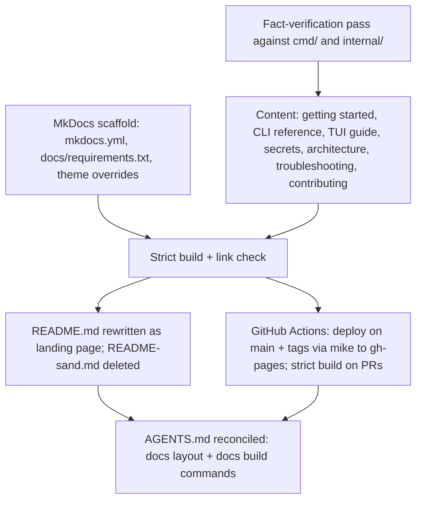
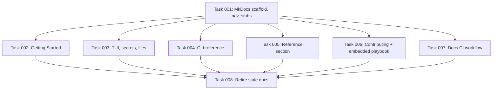

# Plan: Documentation Site and Stale-Doc Cleanup

## Original Work Order

> Create a documentation site following the example of https://github.com/Lullabot/playwright-drupal. As well, clean up any stale docs from when this was just an Ansible playbook, prior to its conversion to a golang app.

## Plan Clarifications

The work order named a concrete reference implementation, which settles the tooling and publishing questions outright. The remaining judgement calls were resolved from the reference repo's own conventions rather than by asking, and are recorded here as explicit assumptions:

| Question | Resolution | Basis |
|---|---|---|
| Which SSG? | MkDocs + Material + mike, run through `uvx` | That is exactly what `playwright-drupal` uses. It also introduces no Node toolchain, which matters: this repo currently has no `package.json` anywhere. |
| Where does the prose live after this? | The docs site is the single source of truth. `README.md` becomes a short landing page that defers to the site. | `playwright-drupal`'s README is a short badges-and-pitch page ending in "For full documentation, visit …". |
| What happens to `README-sand.md`? | Deleted; its content is redistributed into the docs site. | It is 512 lines that overlap `README.md`'s 526 and have already drifted out of sync with it (see Background). Keeping both is what created the drift. |
| Is Ansible itself stale? | **No.** Only the *instruction to run Ansible yourself* is stale. | The playbook is `go:embed`ed into the binary (`playbook_embed.go`) and executed inside the guest. `site.yml`, `roles/`, `ansible.cfg`, `inventory`, and `group_vars/` all stay. |
| Backwards compatibility? | Not required, and not provided. No redirect stubs are left at the old README paths. | Default per PRE_PLAN; nothing external links to `README-sand.md`. |

## Executive Summary

`sandbar` ships a single Go binary, `sand`, that provisions disposable Claude Code development VMs on Lima. Its documentation, however, is still shaped like the Ansible playbook the project used to be: two overlapping top-level READMEs totalling over a thousand lines, one of which opens by calling the project "Ansible playbook to provision a Debian 13 (trixie) VM" and later instructs the reader to `apt install ansible` and run `ansible-playbook` by hand. Nothing about that path is what the product does today, and because the same material is written twice in two files, the two copies have drifted into outright contradictions of each other.

This plan replaces that with a published documentation site built the same way `Lullabot/playwright-drupal` builds theirs — MkDocs with the Material theme, versioned by `mike`, deployed to GitHub Pages from a `gh-pages` branch by a GitHub Actions workflow, with the whole toolchain pinned in `docs/requirements.txt` and invoked through `uvx` so no contributor has to install Python, Node, or MkDocs globally. The site becomes the single source of truth for user-facing prose; `README.md` shrinks to a short landing page that points at it; `README-sand.md` is deleted and its content is folded into the site's pages.

The cleanup is not merely a move. Every claim carried across is re-verified against the code, because the audit found the current docs asserting things the binary does not do — a variable table documenting Ansible-role defaults that `sand` overrides before it ever calls the playbook, a flag described as required that has defaulted for some time, a keybinding written up as `u`/`d` when the code binds `g`/`d`. Content that survives is content that has been checked. The self-serve `ansible-playbook` workflow is removed rather than relocated: it is an unsupported side path presented today with equal billing to the real product, and documenting it invites users onto a road nobody maintains.

## Context

### Current State vs Target State

| Current State | Target State | Why? |
|---|---|---|
| No documentation site; no `docs/` directory | MkDocs Material site under `docs/`, published to GitHub Pages, versioned with `mike` | The explicit ask, and the reference repo's model |
| `README.md` (526 lines) titled "Claude Code Development VM Playbook", opening "Ansible playbook to provision a Debian 13 (trixie) VM…" | Short README: what `sand` is, install, a 30-second quick start, link to the site | The title misidentifies the product; a 526-line README is not a landing page |
| `README-sand.md` (512 lines) covering the same ground in different words | Deleted; content redistributed across the site's pages | Duplication is the root cause of the drift documented below |
| "Other provisioning methods" section instructs `apt install ansible`, `cp group_vars/all.yml.example …`, `ansible-playbook -i inventory site.yml` | Removed. The docs describe only what `sand` does. | This is the stale Ansible-playbook path. It is unsupported, untested end-to-end, and contradicts the README's own "there is nothing else to install — no Ansible" |
| Prose calls the product "the script" (a retired `new-vm.sh`) and "this playbook" | Prose calls the product `sand` | Both names refer to things that are no longer how users interact with the project |
| Ansible variable table documents role defaults (`user_name: claude`, `base_locale: en_CA.UTF-8`, `samba_enabled: true`) | Documented behaviour matches what `sand` actually sends (`--user` defaults to the host user, `en_US.UTF-8`, samba forced off) | The table describes the dead path, so it is wrong about the live one |
| `--git-name`/`--git-email` documented as "required" in one README, as defaulting from host `git config` in the other | Documented once, correctly: they fall back to host `git config` | The two files already disagree; one of them is wrong |
| Download keybinding documented as `u`/`d` in one place, `g`/`d` in two others | Documented once, correctly, as `g` | Same drift, same cause |
| No commands reference; `sand shell` appears in only one README, `--version` in none; 6 of 15 `create` flags documented | Complete CLI reference: every command, every flag, every default | A CLI whose flags are undiscoverable from the docs is a CLI users guess at |
| No single statement of where `sand` keeps host state | One "files and state" reference page: `managed-vms.json`, `secrets.json`, Lima's home, the legacy data-dir migration | Paths are currently scattered across three places in two files with differing wording |
| No troubleshooting page | Troubleshooting page covering the known sharp edges | Every failure mode the audit found is currently undocumented or buried |
| Ansible playbook embedded and run inside the guest; `site.yml`, `roles/`, `ansible.cfg`, `inventory`, `group_vars/` all live | **Unchanged.** No Ansible asset is deleted. | Ansible is load-bearing; only the docs telling users to run it themselves are stale |
| `AGENTS.md` is the de-facto contributor guide, framed for AI agents | Unchanged in role, but reconciled with the new docs layout and the docs build commands | It is accurate today and serves its audience; it just needs to learn about `docs/` |
| No Node/npm anywhere in the repo | Still none — docs toolchain is Python via `uvx` | Introducing a Node toolchain to a Go repo for docs alone is a cost with no return here |

### Background

This project began as an Ansible playbook driven by a `new-vm.sh` bash script. It was rewritten as a Go CLI (`sand`, module `github.com/lullabot/sandbar`) that drives `limactl` as a subprocess and, crucially, still uses the original playbook: the fileset is `go:embed`ed into the binary, extracted at run time, mounted read-only into the guest, and executed there with `--connection=local`. Provisioning is split into a heavy identity-free `base` phase that produces a stopped base image, and a light `finalize` phase run against each `limactl clone` of it. The Ansible `provision_phase` variable is what selects between them.

The distinction matters for this plan, and getting it wrong in either direction would be a mistake. Deleting the playbook would break the product. Continuing to document it as a user-facing entry point misrepresents the product. The correct cut is: Ansible is an implementation detail that contributors should understand and users should never have to touch.

A documentation audit of the current tree found, beyond the framing problems, a set of concrete factual errors that exist *because* the same material is maintained in two files:

- `README.md` states there is "no `group_vars/all.yml` to maintain per VM" in one section and instructs the reader to "copy `group_vars/all.yml.example` to `group_vars/all.yml` and edit" in another.
- `README-sand.md` marks `--git-name`/`--git-email` as required; `README.md` correctly documents them as falling back to host `git config`.
- `README-sand.md` says the file-transfer pane opens on `u`/`d`; the code binds `g` for download, and both `README.md` and another section of `README-sand.md` agree with the code.
- The Ansible variable table gives defaults that `sand` overrides before invoking the playbook, so a reader who trusts it will predict the wrong locale, the wrong user, and the wrong samba state.

A single source of truth is therefore not a stylistic preference here; it is the fix for the class of bug above.

## Architectural Approach

The work divides into an infrastructure track (make a site exist and publish itself) and a content track (write the pages, from verified facts, and delete what they replace). The tracks are independent up to the point where the site's `nav` must name real files, so the scaffolding and the content authoring can proceed in parallel and converge at a strict build.

### Docs Toolchain and Scaffold

**Objective**: Stand up the same toolchain the reference repo uses, pinned and reproducible, without adding a Node dependency to a Go repository.

Mirror `playwright-drupal` closely, because the work order asks for it and because the shape is sound: `mkdocs.yml` at the repository root; `docs/` as `docs_dir`; `site/` as `site_dir`, gitignored; and `docs/requirements.txt` as the single pinned source of truth for the toolchain (`mkdocs`, `mkdocs-material`, `mike`). Every invocation goes through `uvx --with-requirements docs/requirements.txt`, so a contributor needs only `uv` on their machine — no global Python, no virtualenv ritual, no Node.

Diverge from the reference in three deliberate places. First, set `repo_url`, which the reference omits and consequently has no repository link in its header. Second, the reference has *no* docs build gate on pull requests — broken links only surface in their preview environment — so add a `mkdocs build --strict` job on `pull_request`; strict mode is the only quality gate this toolchain offers and it should not be optional. Third, this repo has no `package.json` to hang `docs:dev` / `docs:build` scripts on, and `AGENTS.md` records that there is deliberately no Makefile; so the commands are documented in the contributing page and wired into CI directly rather than invented into a new build-tool dependency.

Navigation is an explicit `nav:` tree in `mkdocs.yml`, not auto-generated — the reference does this, and it keeps ordering intentional. Material's built-in client-side search is sufficient; no external search service.

### Information Architecture

**Objective**: Give every fact exactly one home, so the drift that produced the current contradictions cannot recur.

The section structure follows the reference's shape (a getting-started section, a task-oriented middle, a contributing section) adapted to a CLI product:

- **Home** — what `sand` is, in one screen.
- **Getting Started** — what Lima is and why it's a prerequisite; installation via the Homebrew tap; a first VM; the base-image/clone/finalize model explained once, properly, since it is the concept everything else assumes.
- **Using sand** — the TUI board and its keybindings; the CLI reference (`sand`, `sand create` and all fifteen flags with real defaults, `sand shell`, `sand version`); secrets management; file transfer; reset and delete semantics.
- **Reference** — where `sand` keeps host state (`managed-vms.json`, `secrets.json`, Lima's home, the legacy data-dir migration); the security model; troubleshooting.
- **Contributing** — repository layout, build and test commands, how the embedded Ansible playbook actually works and when a contributor needs to care, the release pipeline, and how to build the docs locally.

The Ansible material lands in Contributing, described as an internal mechanism, and nowhere else. That is the single structural decision that resolves the work order's cleanup half: the content is not deleted (it is true and a contributor needs it), it is *demoted* out of the user-facing path.

### Fact Verification

**Objective**: Ensure nothing false survives the migration.

Content is not copy-pasted from the old READMEs. Every behavioural claim — defaults, flags, keybindings, file paths, what is and is not enabled — is checked against `cmd/sand/`, `internal/`, `site.yml`, and the workflow files before it is written down, and the known-wrong claims enumerated in Background are corrected rather than carried. Where the two old READMEs disagree, the code decides.

### Publishing

**Objective**: The site builds and deploys itself, and a broken link fails CI.

A `docs.yml` workflow modelled on the reference's: `uv` via `astral-sh/setup-uv`, `fetch-depth: 0` so `mike` can rewrite `gh-pages` history, `permissions: contents: write` (mike pushes to the branch itself — this is *not* the OIDC `deploy-pages` flow, so no `pages:`/`id-token:` permissions and no `environment:` block), and a `pages` concurrency group. Push to `main` publishes the `main` version. A release tag publishes that version and moves the `latest` alias, adapted from the reference's `playwright-drupal-*` tag prefix to this repo's release-please `v*` tags. GitHub Pages must be pointed at the `gh-pages` branch once, by hand, in repository settings — an unavoidable manual step that the plan surfaces rather than hides.

### Retiring the Old Docs

**Objective**: Leave exactly one place to look.

`README.md` is rewritten: what `sand` is, the Homebrew install, a minimal quick start, and a link to the site. `README-sand.md` is deleted outright — no redirect stub, no deprecation notice, per the no-backwards-compatibility default. `CHANGELOG.md` is left strictly alone: it is release-please's file, its `new-vm.sh` entries are correct history, and hand-editing it would corrupt the release tooling. `AGENTS.md` keeps its role as the contributor/agent guide and is updated only where the new `docs/` directory and docs build commands change what it says.

## Risk Considerations and Mitigation Strategies

Technical Risks

- **`mike` deploying to `gh-pages` requires the branch and a Pages setting that only a repo admin can create**: the first workflow run creates the branch, but the site 404s until Settings → Pages is switched to "Deploy from a branch → gh-pages / root".
    - **Mitigation**: treat the Pages setting as an explicit, called-out manual follow-up in the execution summary rather than a silent prerequisite. The workflow and the strict build are independently verifiable without it.
- **`mkdocs build --strict` fails on warnings, including any link into a file outside `docs/`**: prose migrated from the READMEs contains relative links (e.g. into `roles/`) that will not resolve inside `docs_dir`.
    - **Mitigation**: the acceptance gate for the content work is a passing strict build, so these surface at authoring time, not in CI. Cross-repo links become absolute GitHub URLs.
- **Pinned toolchain drifts**: the reference keeps `mkdocs`/`mike` current with custom Renovate regex managers.
    - **Mitigation**: `docs/requirements.txt` is a standard pip-requirements file that this repo's existing Renovate config already knows how to manage; pinning the version *inside* the workflow's `uvx` invocation (as the reference does) is deliberately avoided so there is only one place to bump.

Implementation Risks

- **Migrating 1,000+ lines of prose invites carrying its errors along**: the fastest path — copy, paste, reorganise — reproduces every false claim the audit found.
    - **Mitigation**: verification against the code is an acceptance criterion of the content work, not a follow-up. The specific known-wrong claims are enumerated in Background so they can be checked off individually.
- **Over-deleting**: an aggressive reading of "clean up stale Ansible docs" would remove `site.yml`, `roles/`, or the `group_vars` example, breaking provisioning.
    - **Mitigation**: the plan states the boundary explicitly and repeatedly — no Ansible *asset* is touched; only user-facing instructions to run Ansible by hand are removed, and the mechanism is documented for contributors instead.
- **Scope creep into a docs redesign**: the reference has a custom hero template, brand CSS, and a palette-sync script.
    - **Mitigation**: match the reference's *structure and tooling*, which is what was asked for. Theme customisation is limited to what is needed for the site to look intentional rather than to reproduce another organisation's brand.

Content Risks

- **The docs assert behaviour that then changes**: the CLI reference in particular is a snapshot of flags and defaults.
    - **Mitigation**: this is inherent to prose docs and is not solved here; it is bounded by keeping each fact in exactly one place, so a future change has one file to update rather than three.

## Success Criteria

### Primary Success Criteria

1. `uvx --with-requirements docs/requirements.txt mkdocs build --strict` completes with exit code 0 and no warnings, producing `site/index.html` and a page for every entry in the `nav` tree.
2. No file in the repository outside `.ai/`, `.claude/`, `.agents/`, and `CHANGELOG.md` instructs a user to install Ansible or to run `ansible-playbook`; and no prose file refers to the product as "the playbook", "the script", or `new-vm.sh`.
3. Every Ansible asset the binary depends on — `site.yml`, `ansible.cfg`, `inventory`, `roles/`, `group_vars/` — is still present, and `go build ./cmd/sand && go test ./...` still passes.
4. The docs site's CLI reference documents every command and every `sand create` flag, and each documented default matches the value in `cmd/sand/create.go` / `internal/vm/vm.go`.
5. Each of the specific contradictions enumerated in Background (the `group_vars` self-contradiction, `--git-name` "required", the `u`/`d` download key, the variable-table defaults, `samba_enabled: true`) is resolved in favour of what the code does, in exactly one place.
6. `README-sand.md` no longer exists; `README.md` is a landing page that links to the published site.
7. A `docs.yml` GitHub Actions workflow exists that deploys via `mike` on pushes to `main` and on release tags, and a strict docs build runs on pull requests.

## Self Validation

After all tasks complete, execute the following and capture the output of each:

1. Run `uvx --with-requirements docs/requirements.txt mkdocs build --strict` from the repository root. Confirm exit code 0 and that stderr contains no `WARNING`. Confirm `site/index.html` exists.
2. Run `uvx --with-requirements docs/requirements.txt mkdocs serve` in the background, then `curl -sSf http://127.0.0.1:8000/` and `curl -sSf` each top-level nav URL; confirm each returns HTTP 200 and the body contains the expected page `<h1>`. Stop the server.
3. Run `grep -rniE 'ansible-playbook|apt install ansible|new-vm\.sh' --include='*.md' . | grep -vE '^\./(\.ai|\.claude|\.agents)/|CHANGELOG\.md'` and confirm it returns no results.
4. Run `grep -rniE 'this playbook|the script provisions' --include='*.md' README.md docs/ AGENTS.md` and confirm no user-facing prose calls the product a playbook or a script.
5. Confirm the Ansible assets survive: `test -f site.yml && test -f ansible.cfg && test -f inventory && test -d roles && test -d group_vars`, then `go build ./cmd/sand` and `go test ./...`, and confirm both pass.
6. Cross-check the CLI reference against the source: run `go run ./cmd/sand create --help` and diff its flag list and defaults, flag by flag, against the docs' CLI reference page. Every flag present, every default matching.
7. Confirm `README-sand.md` is absent (`test ! -e README-sand.md`) and that `README.md` contains a link to the published site URL.
8. Validate the workflow file parses and its triggers are correct: `uvx --from check-jsonschema check-jsonschema --builtin-schema vendor.github-workflows .github/workflows/docs.yml` (or, failing that, a YAML parse plus manual read of the `on:`, `permissions:`, and `mike` invocations).

## Documentation

This plan *is* a documentation change, so the usual "update the docs" step is the body of the work. The specific meta-documentation obligations are:

- **`AGENTS.md`** must be updated: it currently maps the repository's packages and lists build/test commands, and it will be wrong about both the file layout (new `docs/`, `mkdocs.yml`, deleted `README-sand.md`) and the available commands (docs build/serve via `uvx`) once this lands. It keeps its framing as the agent/contributor guide.
- **`README.md`** is rewritten, not merely edited.
- **`CHANGELOG.md`** is not touched by hand; release-please owns it.
- **`.gitignore`** must learn about `site/`.

## Resource Requirements

### Development Skills

- MkDocs / mkdocs-material configuration and `mike` versioned deploys.
- GitHub Actions workflow authoring, specifically the `gh-pages`-branch publishing model (as distinct from the OIDC Pages deployment model).
- Technical writing for a CLI/TUI product.
- Enough Go reading ability to verify flags, defaults, and keybindings against `cmd/sand/` and `internal/`.

### Technical Infrastructure

- `uv` / `uvx` available locally and in CI (`astral-sh/setup-uv`).
- GitHub Pages enabled on the repository, sourced from the `gh-pages` branch — a one-time manual setting.
- The existing Renovate configuration, which will pick up `docs/requirements.txt` without modification.

## Notes

The reference repository's own gap is worth inheriting deliberately rather than accidentally: it has no docs build check on pull requests, so a broken link reaches `main` and is only caught by a preview environment. This plan adds that check. Conversely, the reference's Tugboat-based PR preview environment is *not* replicated — it depends on infrastructure this project does not have, and the work order asks for a documentation site, not a preview pipeline.

## Execution Blueprint

**Validation Gates:**
- Reference: `/config/hooks/POST_PHASE.md`

### Dependency Diagram

### ✅ Phase 1: Scaffold the site
**Parallel Tasks:**
- ✔️ Task 001 (`completed`): MkDocs + Material + mike scaffold, `mkdocs.yml` with the full nav tree, stub pages, `site/` gitignored — establishes the strict build that gates every later task.

### ✅ Phase 2: Author the content and the publishing pipeline
**Parallel Tasks:**
- ✔️ Task 002 (`completed`): Getting Started — about, installation, first VM, how provisioning works (depends on: 001)
- ✔️ Task 003 (`completed`): Using sand — the TUI board, secrets, files and shells (depends on: 001)
- ✔️ Task 004 (`completed`): CLI reference — every command, every flag, verified against `--help` (depends on: 001)
- ✔️ Task 005 (`completed`): Reference — files and state, security model, troubleshooting (depends on: 001)
- ✔️ Task 006 (`completed`): Contributing — development, the embedded playbook, releases (depends on: 001)
- ✔️ Task 007 (`completed`): `.github/workflows/docs.yml` — mike deploy on main/tags, strict build on PRs (depends on: 001)

### ✅ Phase 3: Retire what the site replaces
**Parallel Tasks:**
- ✔️ Task 008 (`completed`): Rewrite `README.md` as a landing page, delete `README-sand.md`, reconcile `AGENTS.md` (depends on: 002, 003, 004, 005, 006, 007)

### Post-phase Actions
- Per `POST_PHASE.md`: run `gofmt -l .`, `go vet ./...`, `go test ./...` (the Go tree must stay green even though this is a docs plan), plus `mkdocs build --strict`. Commit each phase as a conventional commit.
- Phase 3 additionally runs the stale-doc greps from the plan's Self Validation.

### Execution Summary
- Total Phases: 3
- Total Tasks: 8

### Notes on Task Generation
- **No test tasks were generated.** Under the project's test philosophy ("write a few tests, mostly integration"), this plan adds no custom business logic — it adds prose, a static-site config, and a CI workflow. The verification that matters here is `mkdocs build --strict` (which fails on broken links and bad nav) and the `--help`-diff in task 004, both of which are acceptance criteria rather than test suites. The existing Go test suite must continue to pass, and is checked at every phase gate.
- **Fact-verification is embedded, not separate.** Rather than a distinct "check the docs are accurate" task, every content task carries verification-against-source in its acceptance criteria, because the failure mode being fixed is precisely that prose was copied without being re-checked.
- **Task 008 is `high` effort** despite being editorial: it is the task that deletes things, and the boundary between "stale Ansible instructions" (remove) and "load-bearing Ansible assets" (keep) is the single place this plan can cause real damage.

## Execution Summary

**Status**: ✅ Completed Successfully
**Completed Date**: 2026-07-14

### Results

A 15-page MkDocs Material documentation site now lives under `docs/`, built with the same toolchain as `Lullabot/playwright-drupal` (MkDocs + Material + `mike`, pinned in `docs/requirements.txt`, invoked through `uvx` — no Node toolchain was introduced, and the repo still has no `package.json`). `.github/workflows/docs.yml` deploys it with `mike` to a `gh-pages` branch on pushes to `main` and on `v*` release tags, and runs `mkdocs build --strict` on every pull request — a gate the reference repository does not have.

The stale Ansible-era documentation is gone. `README.md` went from 526 lines titled "Claude Code Development VM Playbook" to 46 lines titled `sandbar` that defer to the site; `README-sand.md` (512 lines) was deleted after its content was verified to have a home on the site. The self-serve `ansible-playbook` path — `apt install ansible`, `cp group_vars/all.yml.example`, `ansible-playbook -i inventory site.yml` — is removed. Ansible itself is untouched and still load-bearing: `site.yml`, `ansible.cfg`, `inventory`, `roles/`, and `group_vars/` are all intact, the playbook is still embedded in the binary, and `go build ./cmd/sand && go test ./...` passes. The mechanism is now documented for contributors at `docs/contributing/ansible-playbook.md` rather than presented to users as a way to drive the product.

Every documented fact was verified against the source rather than copied. That caught and fixed the specific contradictions the plan set out to resolve: the download keybinding is `g` (not the `u`/`d` `README-sand.md` claimed — confirmed at `internal/ui/commandreg.go:235`); `--git-name`/`--git-email` fall back to host `git config` and are not required; the Ansible variable table documenting `user_name: claude`, `en_CA.UTF-8`, and `samba_enabled: true` is gone, because `sand` overrides all three before it ever invokes the playbook. All 16 `sand create` flags are now documented, diffed flag-by-flag against `sand create --help`; previously 6 of them were.

### Noteworthy Events

- **A success criterion was too blunt and was tightened, deliberately.** Primary criterion 2 and Self Validation step 3 called for a repo-wide grep finding *zero* occurrences of `ansible-playbook` outside `.ai/`, `.claude/`, `.agents/`, and `CHANGELOG.md`. As written, that grep also condemns `docs/contributing/ansible-playbook.md` — whose hits are an explicit disclaimer ("this is not an instruction to install Ansible"), a statement that the host never runs Ansible, and a description of the CI syntax-check job — and a pre-existing `AGENTS.md:261` line describing how the progress denominator is derived. All are accurate contributor-facing descriptions of an internal mechanism, not instructions. Deleting them to satisfy a literal regex would have made the documentation worse. The criterion was therefore read as its evident intent — no *instruction* to a user to install or run Ansible — and verified that way. This is recorded rather than quietly redefined.
- **Task 008's gap audit found six things the old READMEs covered that the new site did not**, and they were written into the site *before* the old files were deleted: the `GH_TOKEN` convention and the `includeIf "gitdir:"` git-credential wiring, the reset preserve-toggles, the fact that `sand` provisions no Claude Code credential (you must run `claude` once, and headless token auth is unsupported), what is actually installed in the VM (Docker CE, ddev, cloudflared, `gh`, Node, Go, Python, `uv`, `mkcert`, JDK), the "why `limactl` CLI rather than a Go API" rationale, and the one-time human prerequisites of the release pipeline. Without that audit the deletion would have silently lost real content.
- **`mkdocs serve` mounts the site under `/sandbar/`**, not `/`, because `site_url` carries that path. The first round of validation curls 404'd against `/` until this was understood. Worth knowing before anyone concludes the local preview is broken.
- No task failed and no phase was retried. `gofmt`, `go vet`, and `go test ./...` were green at every phase gate.

### Necessary follow-ups

1. **A human must enable GitHub Pages** — *Settings → Pages → Source: "Deploy from a branch" → `gh-pages` / `/ (root)`*. The workflow creates the branch on its first run, but the site will 404 until this is flipped. This is the one step automation cannot perform, and the site is **not live** until it happens. No deploy has been exercised.
2. **`group_vars/all.yml.example`** is now arguably vestigial: it existed to support the self-serve `ansible-playbook` path that these docs stopped advertising, and nothing in the `sand` flow reads it. It was deliberately **not** deleted, because the plan's boundary was "no Ansible asset is removed" and `site.yml` still supports `provision_phase: full`. Worth a separate decision.
3. The `inventory` file still contains `ansible_host=CHANGE_ME` and is embedded into the binary despite being unused on the `sand` path. Documented as vestigial in `docs/contributing/ansible-playbook.md`; removing it is a separate, code-touching change.
