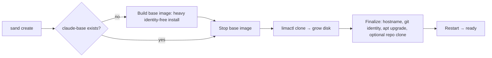

# Getting Started section

## Objective

Write the four Getting Started pages — what `sand` is, how to install it, how to create a first VM, and how the base-image/clone/finalize provisioning model works — with every claim verified against the code rather than copied from the existing READMEs.

## Skills Required

`technical-writing` for the prose; `go` to read `cmd/sand/` and `internal/` well enough to verify what is actually true.

## Acceptance Criteria

- [ ] `docs/getting-started/index.md`, `installation.md`, `first-vm.md`, and `how-it-works.md` are written (no stubs remain).
- [ ] Installation documents the Homebrew tap and names Lima as the prerequisite; it does **not** tell the reader to install Ansible, Go, or to clone the repository.
- [ ] `how-it-works.md` explains the base image → `limactl clone` → finalize → restart model and includes a Mermaid diagram of that flow.
- [ ] The word "playbook" appears on these pages only where it refers to an internal mechanism, never as a name for the product; the words "the script" and `new-vm.sh` do not appear at all.
- [ ] `uvx --with-requirements docs/requirements.txt mkdocs build --strict` exits 0 with no `WARNING`. Paste the output into your completion report.
- [ ] Report, explicitly, which files under `cmd/` and `internal/` you read to verify the defaults you documented.

Use your internal Todo tool to track these and keep on track.

## Technical Requirements

- Verify against source, not against `README.md` / `README-sand.md` — both contain known errors (see Implementation Notes).
- Mermaid renders via the `pymdownx.superfences` custom fence configured in task 1: use a ```mermaid fenced block.

## Input Dependencies

Task 1: the scaffold, the nav tree, and the stub files these pages replace.

## Output Artifacts

Four written pages under `docs/getting-started/`.

## Implementation Notes

<details>
<summary>Detailed implementation guidance</summary>

**Ground truth about the product** (verify each of these yourself before writing it):

- Module `github.com/lullabot/sandbar`, Go 1.25. The binary is **`sand`** (`./cmd/sand`).
- It manages disposable Claude Code development VMs on **Lima**, driving `limactl` as a subprocess.
- Install: Homebrew **formula** (not a cask — deliberately, so it works on macOS *and* Linux): `brew install lullabot/sandbar/sand`, from the tap `lullabot/homebrew-sandbar`. `lima` is a declared dependency of the formula.
- There is nothing else to install. No Ansible, no Go toolchain, no clone of this repository. The Ansible playbook is `go:embed`ed into the binary (see `playbook_embed.go`) and runs *inside the guest*.

**Provisioning model** (`internal/provision/`, `internal/vm/vm.go`, `site.yml`):

- A heavy, identity-free install runs **once** into a stopped **base image** named `claude-base`, built at a 20 GiB virtual-disk floor (`internal/vm/vm.go`).
- Each new VM is a `limactl clone` of that base image, grown to its requested disk size.
- A light **finalize** pass then sets the hostname, writes the git identity, runs `apt upgrade`, and optionally clones a repository — followed by one restart.
- The split is selected by the Ansible `provision_phase` variable (`base` / `finalize` / `full`, see `site.yml`).
- To rebuild the base image from scratch, delete `claude-base` (or use `--rebuild`).

Put the Mermaid diagram of that flow on `how-it-works.md`:



**Page-by-page:**

- `index.md` ("About sand") — what the tool is, who it is for, the one-paragraph pitch, and an honest statement of what it is *not* (it is not a general-purpose VM manager; it is a disposable-dev-VM tool with a specific opinionated stack). Mention that it is the Go successor to what used to be a bash script plus an Ansible playbook **only if** it aids understanding — and if you do, say it once, in the past tense, without instructions.
- `installation.md` — prerequisites (a machine that can run Lima; Lima itself, which Homebrew pulls in), the `brew install` line, and `sand version` as the "did it work?" check.
- `first-vm.md` — the 30-second path. Run `sand` with no arguments to get the TUI board and press `n`, **or** run `sand create` headlessly. Set expectations: the first run builds the base image and takes a while; subsequent VMs clone it and are fast. Then `sand shell NAME` (or `S` on the tile) to get in.
- `how-it-works.md` — the model above, plus why it is built this way (the expensive work is done once and shared; each VM is cheap; identity is applied per-VM at finalize so the base image contains no secrets).

**Known errors in the current READMEs — do not carry these forward:**

- `README.md` says there is "no `group_vars/all.yml` to maintain per VM" in one place and tells you to copy `group_vars/all.yml.example` in another. The first is right for the `sand` path.
- The Ansible variable table documents *role* defaults (`user_name: claude`, `base_locale: en_CA.UTF-8`, `samba_enabled: true`). `sand` overrides these before it calls the playbook — the real defaults are the host username, `en_US.UTF-8`, and samba forced **off** (`internal/provision/vars.go`). Do not reproduce that table.
- The product is called "the script" (a retired `new-vm.sh`) and "this playbook" in several places. It is `sand`.

Leave the full flag list to task 4 (CLI Reference) — link to it rather than duplicating it. **Each fact gets exactly one home**; duplication across pages is what produced the drift this plan is fixing.
</details>
