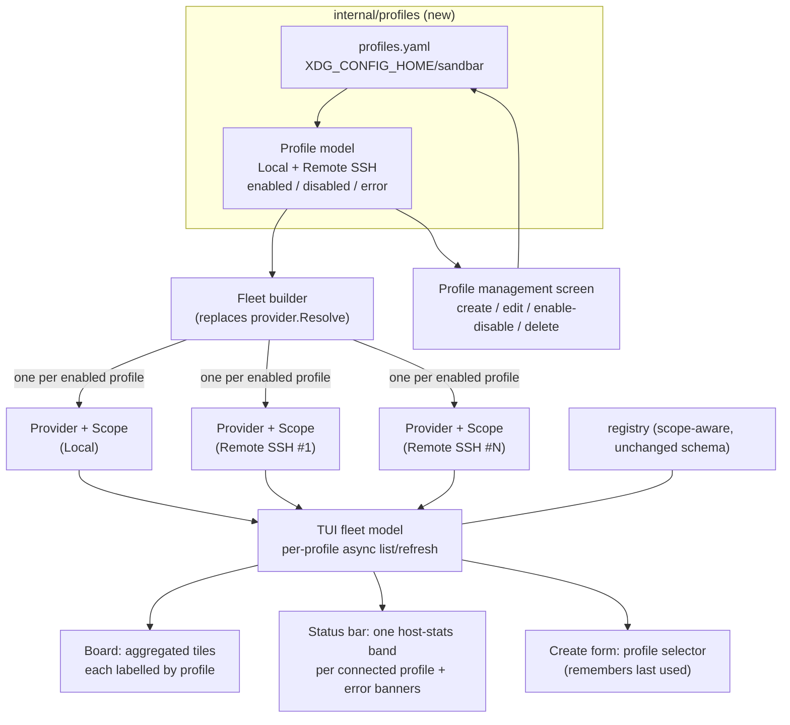
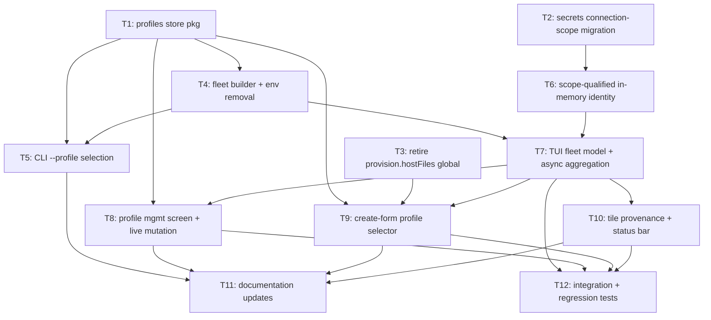

# Plan: Connection Profiles for Multi-Location VM Management

## Original Work Order

> Extend our remote Lima support to support "Connection Profiles". Each profile
> is a configuration for a location to run Sandbar VMs. By default, a local
> profile is created for a local lima instance. Users can add one or more
> "Remote SSH" profiles replacing the existing environment variables. In the TUI
> they can create and manage profiles. Importantly, Sandbar will activate or use
> all configured profiles at once. For example, a user with a remote SSH profile
> will see both local and remote VMs. When creating a VM, you select which
> profile to use when creating the VM. Tiles show what profile a VM is connected
> through.
>
> Profiles may be in states of error, or disabled without deleting them. The UI
> must not hang or lag and treat remote profiles as async operations for general
> UI updates.
>
> The status bar at the top will need to grow for each connected profile. That
> way, they could see server stats for multiple SSH remotes.
>
> Deleting a profile will not change the remote server. Multiple sand clients may
> be configured with the same profile (ie a laptop and a desktop).
>
> Future profile targets include cloud hosting providers, Proxmox, and Orbstack.
>
> Documentation must be updated and tests added.

## Plan Clarifications

| Question | Answer |
| --- | --- |
| How should the existing `SAND_PROVIDER` / `SAND_REMOTE_*` environment variables be handled once profiles exist? | **Remove entirely.** Profiles become the only configuration surface. Acceptable hard BC break because the env-var selection surface is unreleased (added on the `worktree-lima-transport-refactor` branch, not yet cut in a release). |
| When a profile is disabled or in an error state, what happens to its VM tiles on the board? | **Hide the tiles**, and surface that profile's disabled/errored state as a banner in the status bar so the user understands why those VMs are absent. |
| Is the default local profile permanent, or fully deletable like the others? | **Permanent.** It always exists and cannot be deleted, but it can be disabled/enabled and renamed. This guarantees a fallback location always exists. |
| When creating a VM you pick a profile — how should that choice behave across sessions? | **Remember last used.** The create form defaults to the profile the user last created a VM with. |
| Are backwards-compatibility shims required for the on-disk registry / managed-VM index? | No new BC shim is needed for VM ownership: the registry already carries a per-entry `Provider` + `RemoteTarget` scope (schema v2, on the refactor branch), and a profile reduces to exactly that scope. Profiles introduce a **new** config file, so there is no prior format to stay compatible with. |
| _(Refinement)_ What happens when a user disables or deletes a profile that has a background job (build/provision/transfer) in flight on it? | **Block until idle.** Refuse the disable/delete with a message until the in-flight job finishes or is cancelled — reusing the existing jobs-gating pattern that already blocks Delete while a VM builds. No silent cancellation, no half-provisioned VM left behind. |
| _(Refinement, auto-resolved from code)_ Is `provision.SetHostFiles` the only single-provider host-access global to fix? | **No.** There are **two** process-global host-access seams that both assume one provider per process: `provision.hostFiles` (base-image touches during create/reset/cleanup) and `ui.hostFiles` (per-tile disk/up-since sampling). Both must become fleet-aware; see Component 2/3. |
| _(Refinement, auto-resolved from code)_ Can startup keep calling `Preflight()` synchronously per the current entrypoints? | **No.** `main.go` and `create.go` call `p.Preflight()` synchronously and exit on error; a remote preflight is an SSH round-trip. In a fleet this must become **per-profile and asynchronous** — a slow or failing remote preflight yields an error binding, never a blocked startup or fatal exit. |
| _(Refinement, rebase on merged main)_ Across profiles, VM names can collide; how should VM identity work in the TUI's per-VM stores? | **Scope-qualified identity.** A VM is identified by `(scope, name)`, not bare `name`, so `web` can exist both locally and on a remote. The secrets store, heartbeat registry, jobs registry, and the board's focus ring all become scope-aware, and the secrets store gains a connection-scope dimension (a schema migration). This matches the registry's deliberate same-name-across-scope support and prevents reconcile from deleting the wrong VM's secrets. |
| _(Refinement)_ When an enabled Remote SSH profile is unreachable and its binding is in the runtime **error** state, how does it recover? | **Auto-retry with backoff.** The errored profile keeps re-attempting its connect/list on the board's async refresh loop but backs off (e.g. 5s → 30s → 60s, capped) so an unroutable host is not hit every 5s; on success it resets to the normal cadence and its tiles appear with no user action. A manual enable/disable toggle (or edit) forces an immediate retry. Self-healing is preferred over making the user re-toggle after a transient blip. |
| _(Refinement)_ `--profile <name>` and the "last-used profile" default reference a profile, but profiles (including Local) are renameable — how do these references survive a rename? | **Stable internal ID + name.** Each profile carries an immutable `id` generated at creation; the persisted **last-used** pointer is stored by `id` so a rename never resets the create-form default. The user-facing `--profile <name>` flag and the management UI address profiles by their current display **name** (renaming a profile changes what a script must pass, exactly like renaming any resource). The permanent Local profile also has a fixed reserved `id`. |

## Executive Summary

Sandbar's `worktree-lima-transport-refactor` branch introduced a clean
`provider.Provider` seam and a scope-aware registry, but the application still
selects and runs **exactly one** backend per process, chosen from environment
variables at startup. This plan turns that single opt-in remote target into
**Connection Profiles**: named, persisted configurations for *where* Sandbar
runs VMs. A default **Local** profile is always present; users add one or more
**Remote SSH** profiles that replace the environment variables entirely. Crucially,
Sandbar activates **every enabled profile at once** — a user with a local
machine and a remote workstation sees both fleets of VMs on one board, creates a
VM by choosing which profile it lands on, and reads per-profile host stats from a
status bar that grows one band per connected profile.

This approach is chosen because the refactor branch already did the hard,
backend-agnostic work: the registry isolates VM ownership by `Scope`
(`user@host:port`), the SSH transport is self-contained in `SSHHost`, and the TUI
already has an async `connecting`/error interstitial and remote host-capacity
plumbing for a *single* remote. The missing pieces are (1) a persisted, editable,
TUI-managed profile store to replace ad-hoc env vars, and (2) promoting the model
from "one provider + one scope" to a **fleet** of provider/scope pairs whose VM
lists are aggregated and refreshed independently. Reusing the existing per-provider
scope and the existing async message pattern keeps the change faithful to the
architecture rather than bolting on a parallel system.

The outcome: one Sandbar instance manages VMs across multiple machines
simultaneously, degrades gracefully when a remote is unreachable (that profile's
tiles disappear and its status band shows the error, while local tiles stay live
and responsive), and never blocks the UI on a slow SSH hop. Profiles are portable
config that multiple sand clients (a laptop and a desktop) can share, and deleting
a profile only forgets a location locally — it never touches the remote server or
the VMs living there.

## Context

### Current State vs Target State

| Current State | Target State | Why? |
| --- | --- | --- |
| One backend is selected per process from `SAND_PROVIDER` / `SAND_REMOTE_*` env vars at startup (`provider.Resolve`). | A persisted set of named **Connection Profiles** (`profiles.yaml`) defines every location; `Resolve` is replaced by a fleet builder that constructs one provider per **enabled** profile. | Env vars can only express one target and are invisible/awkward to manage; users need multiple named, durable locations they can edit in the TUI. |
| The TUI model holds a single `p provider.Provider` and a single `scope`; the board shows only that one backend's VMs. | The model holds a **fleet** of provider/scope pairs keyed by profile; the board aggregates VMs from all enabled profiles into one roster. | The core requirement is that a user sees *both* local and remote VMs at once, not one or the other. |
| Remote connection is configured only through environment variables (documented in `remote-hosts.md`). | Remote SSH targets are configured as **Remote SSH profiles** through a TUI management screen and/or by hand-editing `profiles.yaml`; the env vars are removed. | Profiles replace env vars as the single, discoverable configuration surface. |
| A single remote's slow SSH handshake is covered by one `connecting`/`connectErr` interstitial that blocks the whole board until the first list lands. | Each profile lists and refreshes **independently and asynchronously**; a slow or unreachable remote never blocks local tiles or the rest of the UI. | The UI must not hang or lag; a fleet of remotes multiplies the chance that one is slow, so per-profile async is mandatory. |
| The header shows one host-capacity band (cpu/mem/disk) for the single active host. | The status bar **grows one host-stats band per connected profile**, plus a banner row for any disabled/errored profile. | Users want at-a-glance server stats for each of several SSH remotes, and a clear reason when a profile's VMs are missing. |
| Tiles identify a VM by name/status only; there is no notion of *where* it runs because there is only ever one location. | Tiles show **which profile** a VM is connected through. | With multiple fleets on one board, provenance (which machine a VM lives on) must be visible per tile. |
| The create form provisions onto the one resolved provider. | The create form has a **profile selector** (defaulting to the last-used profile), and the VM is created on that profile's provider and tagged with its scope. | Creating a VM must let the user choose its location; ownership must be recorded so the fleet stays isolated. |
| Provider selection lives in `provider.Resolve` / `resolveTargetConfig` reading `os.Getenv`. | A new `internal/profiles` package owns the profile model, load/save, and enable/disable/error state; the provider layer builds a fleet from it. | A durable, testable config layer is needed; keeping it separate from `provider` mirrors how `registry` and `secrets` are separate persisted stores. |

### Background

The foundation this plan builds on was delivered by the archived **plan 15**
(`.ai/strikethroo/archive/15--generic-provider-remote-lima-ssh/`), whose design
is authoritative for the seam this work extends. Key facts that shape the approach:

- **`provider.Provider`** (`internal/provider/provider.go`) is a backend-agnostic
  interface covering discovery, power, provisioning, guest transport, attach, and
  host identity/capacity. Local Lima (`local.go`) and remote-Lima-over-SSH
  (`remote.go`) both satisfy it; the remote one is the local provider with the
  host-access seam swapped for an `SSHHost`.
- **Selection is env-only today** (`internal/provider/select.go`): `Resolve()`
  reads `SAND_PROVIDER` / `SAND_REMOTE_*` into a `TargetConfig`, constructs one
  provider, and returns it with the `registry.Scope` that owns its VMs. All three
  entrypoints (`cmd/sand/main.go` TUI, `create.go`, `shell.go`) call `Resolve()`.
  `TargetConfig` is deliberately **secret-free** (identity is a key *path*), which
  is exactly what makes it safe to persist in a profile.
- **The registry is already scope-aware** (`internal/registry/registry.go`,
  schema v2): every entry carries `Provider` + `RemoteTarget`, and
  `AddScoped`/`ReconcileScoped`/`IsManagedInScope`/`ConfigInScope`/`BaseInScope`
  confine operations to one scope. A remote scope key is a stable
  `user@host:port`.
  _**Correction (during execution, 2026-07-15):** this scope-awareness is only
  **defensive** — the on-disk index is `vms map[string]entry` keyed by **bare
  name**, so it stores the scope inside each entry but can hold only **one** entry
  per name. Two same-named VMs across scopes cannot coexist (the second `AddScoped`
  overwrites the first). Delivering same-name coexistence (criterion 9) therefore
  **does** require a registry schema change — re-keying by `(scope, name)` with a
  v2→v3 migration. This is **task 13**, added mid-execution._
- **There is no host-side user config file today.** The only persisted stores are
  `managed-vms.json` (registry, under `$XDG_DATA_HOME/sandbar/`) and the secrets
  store. `gopkg.in/yaml.v3` is already a dependency (used for Lima instance-file
  parsing). Profiles introduce the first user config file, whose natural home is
  `${XDG_CONFIG_HOME:-~/.config}/sandbar/`.
- **The TUI already models async remote I/O**: `internal/ui/commands.go` wraps
  every blocking provider call in a `tea.Cmd` returning a message
  (`vmsLoadedMsg`, `actionDoneMsg`, …); `internal/ui/connecting.go` renders a
  "Connecting to <host>…" interstitial; `internal/ui/header.go` samples host
  capacity off the UI goroutine. These are the patterns per-profile async and
  the multi-band status bar extend.
- **The `providerfake`** (`internal/providerfake/fake.go`) is a func-field double
  for every `Provider` method, and the TUI has a teatest + golden harness
  (`internal/ui/testdata/`). CI enforces a race detector, an **87% coverage
  floor** over `./internal/...`, gremlins mutation, and the rule that **no unit
  test may require a real limactl/ssh target** (real backends only behind the
  `limae2e` build tag).

Two things that were tried and are deliberately *not* the approach here: (1) a
single "active provider" the user switches between — rejected because the work
order requires *all* profiles active simultaneously, not a switcher; (2) storing
SSH credentials in the profile — rejected because the whole seam depends on the
config being secret-free (identity is a key path), preserving the invariant that a
profile is safe to commit/share across clients.

## Architectural Approach

The work divides into five cooperating components. The spine is promoting the
application from a single provider to a **fleet**: a set of
`{profile, provider, scope}` bindings, one per enabled profile, that the TUI
aggregates. Everything else (the config store, the management UI, the create-form
selector, the tile/status-bar surfacing) hangs off that spine.

### Component 1: The Profiles store (`internal/profiles`)

**Objective**: Own the persisted, editable, secret-free profile model that
replaces the environment variables — the single source of truth for every
location Sandbar can run VMs on.

A new package models a **Profile**: an immutable **`id`** (generated at creation,
never changes), a renameable display **name**, a **type** (Local or Remote SSH),
an **enabled** flag, and — for Remote SSH — the connection fields that today live
in `provider.TargetConfig` (host, user, port, identity *path*, remote LIMA_HOME).
The `id`/`name` split (_see the refinement clarification_) is what lets the
**last-used** pointer survive a rename: it is stored by `id`, while the
user-facing `--profile <name>` flag and the management UI address profiles by
their current display name. The permanent Local profile has a fixed reserved
`id`. It persists to `${XDG_CONFIG_HOME:-~/.config}/sandbar/profiles.yaml`
via `yaml.v3`, mirroring the registry's XDG convention and atomic-write
discipline (temp file + rename, corrupt-file quarantine). On first run with no
file (or after env-var removal), the store **seeds a default Local profile** so an
unconfigured sand behaves exactly as it does today — one local fleet, zero setup.

The store is the home for the lifecycle states the work order calls out:
**enabled/disabled** is a persisted flag the user toggles without losing the
config; **error** is a *runtime* state (the profile is enabled but its provider
failed to build or its host is unreachable) that is derived at fleet-build/refresh
time, not persisted. The store also records the **last-used profile** (by its
immutable `id`) for the create form's default. The file is deliberately hand-editable and free of
secrets so it is safe to copy between a laptop and a desktop (the multi-client
requirement) and to keep under version control.

The env-var surface (`SAND_PROVIDER`, `SAND_REMOTE_*`) is **deleted** from
`provider/select.go`; the doc/tests referencing it are removed or repointed at
profiles. `provider.TargetConfig` is retained as the internal, secret-free shape a
Remote SSH profile is converted into when its provider is constructed — the seam
`NewRemoteLima` already consumes.

### Component 2: The Fleet (replacing single-provider resolution)

**Objective**: Construct and own **one provider per enabled profile**, each paired
with the `registry.Scope` that isolates its VMs, so the rest of the app can act on
many backends at once without any backend leaking into another.

`provider.Resolve()` (env → one provider) is replaced by a fleet builder that
reads the profiles store and constructs a `{profile, provider, scope}` binding for
each **enabled** profile. A Local profile builds the local Lima provider
(`NewDefault`) with `registry.LocalScope`; a Remote SSH profile builds
`NewRemoteLima` with the remote scope derived from its target. (The scope is the
registry's `Scope{Provider, RemoteTarget}` pair, where `RemoteTarget` is the
`user@host:port` string produced by `provider.TargetConfig.Scope()` — the profile
converts to a `TargetConfig` and reuses that existing derivation rather than
formatting a scope key itself.) A
profile whose provider **fails to construct** (bad config, preflight failure) is
recorded as an **error** binding rather than aborting the whole fleet — one bad
remote must never stop the local fleet or the other remotes from loading.

**Two single-provider host-access globals must be retired.** The code has two
package-global seams that each carry the comment "one sand process runs exactly
one provider" (_see the auto-resolved clarification_), and a fleet violates that
assumption in two different ways:

- `provision.hostFiles` (`internal/provision/hostaccess.go`) backs the base-image
  touches — overlay read, version stamp, base lock, partial-instance cleanup —
  during **create/reset/cleanup**. These operations target exactly one profile and
  are user-serialized, so this seam can be bound to the operation's profile. The
  preferred fix, though, is to retire the package-global in favour of an explicit
  per-operation host-access argument (threaded from the chosen profile's provider)
  so correctness does not depend on remembering to swap and restore a global; a
  transitional per-operation swap is acceptable only if it is scoped and restored
  around each provisioning call.
- `ui.hostFiles` (`internal/ui/diskusage.go`) backs **per-tile** disk/up-since
  sampling, which runs for VMs from **all** profiles during the *same* render.
  A single global cannot be swapped per-operation here — it must be resolved
  **per tile by the VM's owning profile** (each fleet sub-state carries its own
  host-access seam, and the tile samples through its profile's seam). This is the
  more load-bearing of the two and the main reason the fleet cannot be a naive
  loop over `Resolve()`.

**Preflight becomes per-profile and asynchronous.** Today `cmd/sand/main.go` and
`cmd/sand/create.go` call `p.Preflight()` synchronously and exit on failure — for
a remote provider that is a blocking SSH round-trip. In a fleet the TUI must
launch **without** waiting on any remote preflight: each profile's preflight runs
inside its per-profile connect/refresh `tea.Cmd`, and a failure or timeout marks
that profile an **error binding** (surfaced as a status-bar banner, Component 5)
rather than aborting startup. The local profile's preflight is effectively
instant, so the board is interactive immediately.

The non-TUI entrypoints adapt to the fleet as follows: `sand create` gains a
`--profile <name>` flag (defaulting to the last-used profile, then Local) and acts
on that one profile's provider/scope, preflighting only that profile; an unknown
profile name is a clear error. `sand shell NAME` resolves which profile owns
`NAME` from the registry scope; if `NAME` exists under more than one profile it
errors and lists the candidates, and an explicit `--profile <name>` disambiguates.
Both `create` and `shell` (which likewise calls `p.Preflight()` synchronously
today) still preflight synchronously — but only the **single** profile they act
on, which is the intended behavior for a one-shot CLI command; it is the *TUI's*
fleet preflight that must go async. The CLI surface stays minimal — exactly what
the profile model requires, nothing speculative.

### Component 3: Per-profile asynchronous aggregation in the TUI

**Objective**: Aggregate every enabled profile's VMs into one board while
guaranteeing the UI never hangs on a slow or unreachable remote — the work order's
"must not hang or lag, treat remote profiles as async" requirement.

The TUI model is promoted from `p provider.Provider` + `scope` to a **fleet of
per-profile sub-states**, each holding its own provider, scope, last-known VM
list, host-capacity sample, connection status (connecting / connected / error),
and last error. The board's roster becomes the **union** of every connected
profile's managed VMs. Each profile refreshes on its **own** `tea.Cmd`, so the
existing `listCmd` pattern is fanned out — the local list returns near-instantly
and renders immediately, while each remote's list resolves in the background and
merges its tiles in as it lands. A message carries the **profile identity**
alongside its result so the model routes each async result to the right
sub-state; the existing `vmsLoadedMsg` shape is extended, not replaced by a
parallel mechanism.

An **errored profile self-heals** (_see the refinement clarification_): its
per-profile refresh keeps re-attempting the connect/list so a remote that comes
back reachable recovers with no user action, but a failed remote **backs off**
(e.g. 5s → 30s → 60s, capped) rather than being re-hit on every `refreshInterval`
tick — one dead remote must not generate a connection storm or drag the loop.
On a successful list the profile's cadence resets to the normal
`refreshInterval`; a manual enable/disable toggle or edit (Component 4) forces an
immediate retry. The backoff is per-profile state on the fleet sub-state, so a
healthy local/remote keeps refreshing at the normal cadence while a sick remote
slows its own retries.

The existing single `connecting` interstitial is generalized: rather than a
full-screen block, an as-yet-unconnected or errored profile simply contributes no
tiles and shows its state in the status bar (Component 5), so the board is usable
the instant the *local* fleet lists. The one case that still warrants a
full-surface hint is when **every** enabled profile is still connecting or errored
and there are no tiles yet — the board must show a "connecting to N profiles…"
state rather than the bare "no VMs — press enter to create" invitation, which
would misrepresent an in-flight fleet as an empty one (the same trap the
`vmsLoaded` guard already avoids for the first local list).

Reconciliation, heartbeats, and per-tile disk sampling — all currently keyed to
one scope/host — become **per-profile**: each fleet sub-state carries its own
host-access seam (Component 2), so a remote VM's disk/up-since is sampled on its
own host, its heartbeat runs against its own provider, and its registry entries
are reconciled only under its own scope. Reconcile must never prune a profile's
entries from another profile's listing — the registry's `ReconcileScoped` already
enforces this, so the fleet calls it once per profile with that profile's live
list, and a profile that is disabled or errored is **not** reconciled at all
(its entries stay dormant, not pruned — see the Decision Log).

### Component 4: Profile management and create-time selection UI

**Objective**: Let users create and manage profiles entirely in the TUI, and
choose a VM's location at create time.

A new **profile management screen** (a `view` alongside board/form/secrets) lists
every profile with its type, enabled/error state, and — for Remote SSH — its
target. From it the user can **create** a Remote SSH profile (a form over the
connection fields), **edit** an existing one, **enable/disable** without deleting,
and **delete**. Deleting removes only the local profile entry and its runtime
binding; it explicitly does **not** touch the remote server or the VMs there
(those simply stop appearing once the profile is gone, and reappear if the profile
is re-added). The Local profile is rendered as **permanent** (no delete verb) but
still enable/disable-able and renameable.

**Runtime fleet mutation.** Enabling, disabling, editing, or deleting a profile
takes effect **live**, without restarting sand: the fleet builder is re-run so a
newly-enabled profile spins up its provider binding and begins its async
connect/refresh, while a disabled/deleted profile has its binding torn down
(refresh/heartbeat cmds stopped, tiles removed). Because a disable/delete would
otherwise strand work, it is **gated on that profile being idle** (_see the
refinement clarification_): if a background job — a build/provision or a file
transfer — is in flight on the profile, the action is refused with a message
naming the blocking job, exactly as Delete is already gated while a VM builds.
The user finishes or cancels the job, then retries. Editing a Remote SSH profile's
**connection fields** is likewise treated as a tear-down-and-rebuild of that one
binding and is gated the same way. A pure **rename** (or any metadata-only edit
that leaves the scope binding — the `user@host:port` target — unchanged) is *not*
gated and needs no rebuild: the immutable `id` and the derived scope are
untouched, so tiles, jobs, and the last-used pointer all follow the profile across
the rename.

The **create form** gains a **profile selector** as a first-class field,
defaulting to the **last-used** profile (falling back to Local). The chosen
profile determines which provider provisions the VM and which scope tags it in the
registry; host-scaled defaults (cpu/memory/user, already host-aware from plan 15)
are sampled from the *selected* profile's host. The last-used choice is persisted
(by profile `id`) through the profiles store (Component 1).

### Component 5: Tile provenance and the growing status bar

**Objective**: Make *where* each VM runs visible per tile, and show per-profile
server stats and error banners in a status bar that grows with the fleet.

Each **tile** gains a compact **profile label** so a user scanning a mixed board
can tell a local VM from a remote one at a glance, within the tile's fixed content
budget (the layout already reserves fixed tile line counts, so the label must fit
that budget, not grow it unpredictably).

The **status bar/header** grows from one host-capacity band to **one band per
connected profile**, each showing that profile's host cpu/mem/disk (sampled on
that host, off the UI goroutine, exactly as the single-host sample works today).
A profile that is **disabled** or in **error** contributes a **banner row**
instead of a stats band — naming the profile and the reason (disabled, or the
connection error) so the user understands why its VMs are absent. The header's
existing width/height budgeting must accommodate a variable number of bands
without breaking the board layout at the narrowest supported terminal (80
columns), degrading gracefully (e.g. compacting or truncating bands) when the
fleet is larger than the bar can fully show.

### Component 6: Scope-qualified VM identity across the fleet

**Objective**: Make a VM's identity `(scope, name)` rather than a bare name
everywhere the TUI keys per-VM state, so the same name can exist in two locations
without collision — and, critically, so reconciliation never deletes the wrong
VM's secrets.

The refactor branch made the *registry* scope-aware, but the TUI's other per-VM
stores predate the fleet and still key by bare name: the **secrets store**
(`internal/secrets`, `vms map[name]…`), the **heartbeat registry**
(`internal/ui/heartbeat.go`, `heartbeatRegistry.beats map[string]*heartbeat`), the
**jobs registry** (`internal/ui/jobs.go`, `jobKey{vm, kind}`), and the board's
**focus ring** (`model.focusName`). With two profiles enabled, a VM named `web`
on local and a `web` on a remote would share a heartbeat, share a job slot,
share a focus target, and — worst — share a secrets entry. The registry
deliberately allows this name reuse (its own comment: "two providers can
legitimately reuse the same VM name"), so the fix is to complete the
scope-awareness the branch started, not to forbid the reuse.

The **highest-severity** consequence is in reconciliation. Today the
`vmsLoadedMsg` handler runs `manage.Reconcile(reg, live, scope)` and then
**permanently deletes** each dropped VM's host secrets by bare name
(`model.go`'s "a dropped VM's HOST SECRETS ARE DELETED" reconcile path). Per-profile
in a fleet, dropping a local `web` would delete the secrets for a remote `web` that
is alive and well. There are **two** prune-by-bare-name sites that must both become
scope-qualified: this reconcile path, and the **explicit-delete** path (the delete
action that removes the registry entry and its secrets when the user deletes a VM).
Every reconcile-and-prune must therefore be scope-qualified: a profile's reconcile
considers only its own scope's entries (already true of `ReconcileScoped`) and
prunes only that scope's per-VM state, and the explicit delete prunes only the
targeted VM's `(scope, name)` state.

Concretely: the heartbeat, jobs, and focus keys become composite `(scope, name)`
(or an equivalent stable per-VM handle), and the **secrets store gains a
connection-scope dimension**, which is a schema migration (bump its on-disk
version — currently `schemaVersion = 2` — and read older files as local-scoped:
every VM that exists in a pre-fleet secrets file could only have been local,
exactly mirroring how the registry's v2 migration stamped old entries local).

**Naming caution for task generation:** the secrets store *already* uses the word
"scope" for an unrelated concept — a home-relative **directory scope**
(`secrets.ValidScope`) that namespaces secret paths *within* a VM. The dimension
added here is the **connection scope** (the registry's `Scope{Provider,
RemoteTarget}`, identifying *which host* a VM lives on). These are orthogonal: a
single VM keyed by `(connectionScope, name)` still has its existing directory
scopes inside it. Do not collapse or conflate the two.

Non-managed considerations do not arise because the board's roster is managed
clones only, and only sand-created clones ever carry secrets/jobs/heartbeats.

## Risk Considerations and Mitigation Strategies

Technical Risks

- **Two process-global host-access seams assume one provider.** Both `provision.hostFiles` and `ui.hostFiles` are documented "one sand process runs exactly one provider" globals; a fleet breaks that in two different ways.
    - **Mitigation**: Retire `provision.hostFiles` in favour of a per-operation host-access argument threaded from the targeted profile (create/reset act on exactly one profile). Resolve `ui.hostFiles` **per tile** by the VM's owning profile (each fleet sub-state carries its own seam) — a global swap is impossible here because tiles from all profiles render together. Cover both with tests that sample/provision against two different fake hosts in one process without cross-talk.
- **Synchronous startup preflight would reintroduce the hang the plan forbids.** `main.go`/`create.go` block on `p.Preflight()` and exit on error; a remote preflight is an SSH round-trip.
    - **Mitigation**: Run each profile's preflight inside its per-profile async connect/refresh cmd; a failure/timeout becomes an error binding (status-bar banner), never a blocked or aborted startup. The local profile stays effectively instant. Test with a fake provider whose preflight blocks — the board must still launch and stay interactive.
- **Runtime fleet mutation can strand in-flight work or leak goroutines.** Disabling/deleting/editing a profile live must tear down refresh/heartbeat cmds and remove tiles cleanly.
    - **Mitigation**: Gate disable/delete/edit on the profile being idle (block-until-idle, reusing the jobs-in-flight gate); tear down a binding by cancelling its cmds and dropping its sub-state. Test enable→refresh→disable cycles and a disable attempted while a job is in flight (must be refused).
- **[HIGH — data loss] Bare-name per-VM keys collide across profiles; reconcile could delete the wrong VM's secrets.** Secrets, heartbeats, jobs, and the focus ring key by name; the registry deliberately allows the same name in two scopes, and reconcile permanently deletes a dropped VM's secrets by name.
    - **Mitigation**: Make identity `(scope, name)` across all per-VM stores (Component 6) and scope-qualify every reconcile-and-prune, so dropping a local `web` never touches a remote `web`'s state. Add a regression test that enables two profiles with a same-named VM, deletes it on one, and asserts the other's secrets/heartbeat survive intact.
- **Secrets-store schema migration risk.** Adding a connection-scope dimension to the on-disk secrets store changes its format; a botched migration loses host secrets. Compounded by a **naming collision**: the store already uses "scope" for an unrelated home-relative *directory* scope (`ValidScope`), so an implementer could wire the new dimension into the wrong field.
    - **Mitigation**: Bump the store's schema version (currently `2`) and read pre-migration files as local connection-scoped (every VM in them could only have been local), mirroring the registry's v2 migration; write the new version on first save. Keep the new **connection scope** strictly separate from the existing **directory scope** in both code and naming. Cover with a load-old-file → read-back round-trip test.
- **A slow or unreachable remote could still stall the UI if any refresh is awaited synchronously.** The board must stay live while a remote hangs.
    - **Mitigation**: Every profile's list/refresh/heartbeat/host-sample runs on its own `tea.Cmd` with the profile identity carried in the result message; the model never blocks on a remote, and the local fleet renders independently. Verify with a fake provider that blocks indefinitely for one profile while the board remains interactive.
- **An errored remote retried every 5s could become a connection storm** (repeated SSH handshakes/timeouts against a dead host), wasting resources and cluttering the loop.
    - **Mitigation**: Give each errored profile its own **backoff** (5s → 30s → 60s, capped) held on the fleet sub-state; reset to normal cadence on a successful list, and force an immediate retry on manual enable/disable/edit. Test that a persistently-failing profile's retry interval grows and that a healthy profile's cadence is unaffected.
- **Header/tile layout could break with a variable number of status bands at narrow widths.** The layout budgets are currently sized for one host band and fixed tile lines.
    - **Mitigation**: Define explicit degradation rules (compact/truncate bands, fixed per-tile label budget) and lock them with golden tests at 80×24 and wide, with one, two, and several profiles.
- **VM name collisions across profiles** (the same VM name existing on local and a remote) could route an action to the wrong backend.
    - **Mitigation**: Every action, reconcile, and lookup is scope-qualified (the registry already supports this); `sand shell NAME` disambiguates by scope and reports when a name is ambiguous rather than guessing.

Implementation Risks

- **Removing the env vars is a hard BC break** that also touches `remote_e2e_test.go` (which reads `SAND_REMOTE_*`).
    - **Mitigation**: The break is sanctioned (env surface unreleased). Repoint the E2E test at a profile/`TargetConfig` constructed in-test; remove the env constants and their docs in the same change so nothing dangles.
- **The single-provider assumption is threaded widely through the TUI model** (fields, commands, reconcile, heartbeat, header, form). A partial conversion could leave hidden single-provider paths.
    - **Mitigation**: Make the fleet the model's only VM source (no residual single-`p` field) so any missed path fails to compile rather than silently acting on one backend; lean on the func-field `providerfake` to drive multi-profile model tests.
- **Scope creep toward future providers** (cloud/Proxmox/Orbstack) the work order names but defers.
    - **Mitigation**: Build only Local and Remote SSH profile types now; represent the type as an enum that can grow, but add no code, config, or UI for other types. Document them as future targets only (YAGNI, per PRE_PLAN).

Quality Risks

- **Dropping below the 87% coverage floor** while adding a substantial new package and UI surface.
    - **Mitigation**: Add `internal/profiles` unit tests (load/save/seed/migrate-from-nothing, enable/disable, last-used), fleet-builder tests (mixed enabled/disabled/error), multi-profile model/teatest tests, and updated golden files, so the new code lands above the floor rather than dragging it down.
- **Regressing the zero-config local experience** (an unconfigured user must see exactly today's behavior).
    - **Mitigation**: A first-run with no `profiles.yaml` seeds a single enabled Local profile; a dedicated test asserts the board, header, and create form are behaviorally identical to the pre-profiles single-local path.

## Success Criteria

### Primary Success Criteria

1. With a `profiles.yaml` containing an enabled Local profile and an enabled
   Remote SSH profile, a single `sand` TUI shows **both** the local and the remote
   VMs on one board, each tile labelled with the profile it runs through.
2. The status bar shows **one host-stats band per connected profile**; a disabled
   or unreachable profile shows a **banner** naming it and its state, and its VMs
   are **absent** from the board while the rest of the board stays live.
3. A remote profile whose host is slow or unreachable **never blocks** the UI: the
   local tiles render and remain interactive while that profile resolves or fails
   in the background. An errored profile **self-heals** — it keeps retrying (with
   backoff) and its tiles appear automatically once the host is reachable, with no
   user action.
4. The create form offers a **profile selector** defaulting to the **last-used**
   profile; creating a VM on a chosen profile provisions it on that profile's host
   and records it under that profile's scope, so it appears only under that
   profile.
5. Profiles can be **created, edited, enabled/disabled, and deleted** from within
   the TUI; the default Local profile cannot be deleted but can be disabled.
   **Deleting** a Remote SSH profile removes it locally and does **not** delete or
   alter the remote server or the VMs on it.
6. The `SAND_PROVIDER` / `SAND_REMOTE_*` environment variables are **removed**;
   remote configuration is possible **only** through profiles.
7. `profiles.yaml` is **secret-free** (SSH identity stored as a key path) and can
   be copied to a second machine so a laptop and a desktop drive the same profile.
8. Unconfigured (no `profiles.yaml`) sand seeds a single Local profile and behaves
   **identically** to today's local-only experience.
9. A VM name may exist under **more than one profile** at once (e.g. `web` local
   and `web` remote); each has independent secrets, heartbeat, jobs, and focus,
   and deleting one **never** touches the other's state. A pre-fleet secrets file
   loads intact as local-scoped.
10. All new code is covered by tests; the suite passes with `-race` and the project
    stays at or above its **87% coverage floor**, with **no unit test requiring a
    real limactl or ssh target**.

## Self Validation

After all tasks are complete, an LLM should verify the implementation by
exercising the real system, not just re-running unit tests:

1. **Zero-config parity**: With no `~/.config/sandbar/profiles.yaml`, run `sand`
   (or a teatest-driven model) and confirm the file is seeded with one enabled
   Local profile and that the board/header render exactly as the pre-profiles
   local build. Capture the seeded YAML and a board screenshot/golden.
2. **Two-profile aggregation**: Write a `profiles.yaml` with a Local profile plus
   a Remote SSH profile pointed at a `limae2e` test host (or a fake provider in a
   teatest run), launch the TUI, and confirm tiles from **both** appear, each
   labelled with its profile, and that the status bar shows **two** host-stats
   bands. Screenshot the board.
3. **Unreachable-remote resilience & self-heal**: Add a Remote SSH profile whose
   host is unroutable, launch the TUI, and confirm (a) the local tiles render
   immediately and stay interactive (arrow keys, search) while the remote
   resolves, (b) the remote contributes **no** tiles, and (c) a status-bar banner
   names the profile and its connection error. Capture the board mid-connect. Then
   (via a fake provider that fails N times then succeeds) confirm the errored
   profile's retry interval **backs off** while failing and that its tiles appear
   **automatically** once it succeeds, with no manual toggle.
4. **Create-on-profile**: In the create form, confirm the profile selector is
   present and defaults to the last-used profile; create a small VM on a chosen
   profile, then query `managed-vms.json` and confirm the new entry carries that
   profile's `Provider`/`RemoteTarget` scope and appears only under that profile's
   tiles.
5. **Management lifecycle**: From the management screen, disable the remote
   profile and confirm its tiles vanish and its status band becomes a "disabled"
   banner; re-enable and confirm they return **live** (no restart). Delete the
   remote profile and confirm it disappears from `profiles.yaml` while (against a
   `limae2e` host) the VMs still exist on the remote server (re-add the profile and
   confirm they reappear). Confirm the Local profile offers no delete verb.
   Finally, set a profile as last-used (create a VM on it), then **rename** that
   profile, reopen the create form, and confirm it **still** defaults to that
   profile (last-used tracked the profile across the rename via its immutable
   `id`, not its name).
6. **Block-until-idle gate**: Start a build on the remote profile, then attempt to
   disable/delete that profile while the build is in flight; confirm the action is
   **refused** with a message naming the blocking job, and succeeds once the job
   finishes or is cancelled.
7. **Per-profile tile sampling**: Confirm a remote VM's tile shows a real disk
   gauge and up-since (sampled on the remote host), not "?", proving the per-tile
   host-access seam resolves to the VM's owning profile rather than the local
   filesystem.
8. **Same-name coexistence & secrets isolation**: Enable two profiles, create a
   VM with the **same name** on each, set distinct secrets on both, and confirm
   both tiles render (each labelled by profile) with independent secrets and
   heartbeats. Delete the VM on one profile and confirm the other profile's VM,
   its secrets, and its heartbeat are **untouched**. Separately, load a pre-fleet
   secrets file and confirm it reads back intact as local-scoped.
9. **Env-var removal**: Grep the codebase and docs for `SAND_PROVIDER` /
   `SAND_REMOTE_` and confirm no references remain outside historical
   plan/changelog text; confirm setting those env vars has no effect.
10. **Regression gate**: Run `go test ./... -race` and the coverage check and
    confirm the suite passes at or above the 87% floor.

## Documentation

- **Rewrite `docs/using-sand/remote-hosts.md`** into a profiles-centric page
  ("Connection Profiles"): what a profile is, the Local vs Remote SSH types, the
  `profiles.yaml` location/shape (secret-free, hand-editable, shareable across
  clients), managing profiles in the TUI, enabled/disabled/error states, and how
  all enabled profiles are active at once. Remove the env-var instructions;
  document the removal.
- **Update `mkdocs.yml` nav** if the page is renamed (e.g. "Remote Lima Hosts" →
  "Connection Profiles").
- **Update `docs/using-sand/tui.md`** (the board doc) to describe the per-tile
  profile label, the multi-band status bar and profile banners, the profile
  management screen, and the create-form profile selector.
- **Update `docs/using-sand/cli-reference.md`** for any `sand create` profile
  selection and `sand shell` cross-profile behavior.
- **Update `docs/reference/files-and-state.md`** to document the new
  `profiles.yaml` config file alongside the managed-VM index and secrets store,
  and note the secrets store's new scope dimension (schema bump).
- **Update `docs/using-sand/secrets.md`** if same-name-across-profiles changes how
  secrets are addressed or displayed per VM.
- **Update `README.md`** and **`AGENTS.md`** to describe the fleet/profiles model,
  the removal of the env-var surface, and the per-operation host-access binding
  that replaces the process-global `provision.SetHostFiles` assumption.
- **Update `CHANGELOG.md`** for the feature and the env-var BC break.

## Resource Requirements

### Development Skills

- Go, with comfort in the Charm v2 TUI stack (`charm.land/bubbletea/v2`,
  `bubbles/v2`, `lipgloss/v2`) — model-by-value discipline, `tea.Cmd`/message
  async patterns, and layout budgeting.
- Familiarity with the plan-15 `provider.Provider` seam, the scope-aware
  `registry`, the `SSHHost` host-access seam, and the `providerfake`/teatest/golden
  test harness.
- YAML config persistence with atomic-write and corrupt-file handling (mirroring
  `registry`).

### Technical Infrastructure

- Existing dependencies only: `gopkg.in/yaml.v3` (already present) for the config
  file; the existing Lima/SSH transport for Remote SSH profiles. No new external
  dependency is anticipated.
- The existing CI gates: `go test ./... -race`, the 87% coverage floor, gremlins
  mutation, and the `limae2e`-tagged real-backend tests (for the optional remote
  validation).
- For end-to-end remote validation: an SSH-reachable host with Lima installed
  (the same requirement plan 15's remote E2E already documents), used only behind
  the `limae2e` tag.

## Integration Strategy

The `worktree-lima-transport-refactor` branch has now **merged to `main`**
(its Provider seam, scope-aware registry, and `SSHHost` transport are on `main`),
so this work builds directly on `main`. It migrates **two** on-disk stores to a
`(scope, name)` identity (both v2→v3, pre-migration files read as local-scoped so
existing installs upgrade with zero manual steps): the **secrets** store
(Component 6, task 2) and — _corrected during execution_ — the **registry**
managed-VM index (**task 13**), which was found to be keyed by bare name and thus
unable to hold two same-named VMs across scopes. _(The plan originally assumed the
registry needed no schema change; that assumption was wrong — see the Background
correction and Noteworthy Events.)_ The only new persisted artifact
is `profiles.yaml`, created on demand (seeded with a Local profile). The removal
of the env-var surface is the one intentional break, isolated to
`internal/provider/select.go`, its tests, and the docs.

## Notes

- **Explicitly deferred (YAGNI):** cloud hosting providers, Proxmox, and Orbstack
  profile types. The profile **type** is modeled as an enum that can grow, but no
  code, configuration, or UI for those targets is built now — they are documented
  as future targets only.
- **Secret-free invariant is load-bearing:** it is what lets a profile be
  hand-edited, committed, and shared between clients. Any future field must remain
  a reference (path/handle), never key material — the same contract
  `provider.TargetConfig` and `registry.Scope` already keep.
- **Numbering note:** after the merge, `main`'s archive now holds **three** id-15
  plan directories (`15--documentation-site-and-stale-doc-cleanup`,
  `15--generic-provider-remote-lima-ssh`, `15--install-gitlab-and-drupalorg-clis`)
  — a pre-existing id collision carried in by the merge, independent of this work.
  This plan is id **16**, verified to be the only `id: 16` in the tree (no
  collision), and lives in `plans/16--connection-profiles/`.

### Decision Log

Decisions resolved during refinement (interactive answer or auto-resolved against
the branch code), recorded so downstream task generation does not re-litigate them:

- **Scope is keyed by connection target, not profile name.** A remote profile's
  `registry.Scope` is derived from its `user@host:port` (as it is today), so
  **renaming** a profile never orphans its VMs. Consequence: the **Local** profile
  always maps to the single `registry.LocalScope`, so **only one Local profile may
  exist** (the permanent default). Two enabled Remote SSH profiles pointing at the
  **same** `user@host:port` would resolve to the same scope and show the same VMs;
  profile creation/edit **validates target uniqueness** and rejects a duplicate
  rather than silently double-listing.
- **Deleting/disabling a profile leaves its registry entries dormant, not pruned.**
  There is no live provider to reconcile against, and pruning would be wrong — the
  VMs still exist on the server. Re-adding the profile restores the tiles. This is
  the registry-side expression of "deleting a profile will not change the remote
  server."
- **CLI profile selection** uses a `--profile <name>` flag on `sand create`
  (default: last-used, then Local) and on `sand shell` (only needed to
  disambiguate a name owned by more than one profile). No interactive CLI picker
  is added (YAGNI).
- **Preflight is async and non-fatal per profile** (see Technical Risks); a
  failing remote never blocks or aborts startup.
- **Both host-access globals are retired/fleet-aware** (see Technical Risks); the
  UI seam becomes per-tile, the provision seam becomes per-operation.
- **Errored profiles self-heal with backoff.** An enabled-but-unreachable profile
  keeps retrying on its own async refresh but backs off (5s → 30s → 60s, capped)
  instead of being hammered every `refreshInterval`; success resets the cadence,
  and a manual enable/disable/edit forces an immediate retry. Rejected
  alternatives: (a) re-attempt every 5s — risks a connection storm against a dead
  host; (b) stop retrying until the user re-toggles — makes a transient network
  blip require manual intervention.
- **Profiles carry an immutable `id` distinct from their renameable name.** The
  persisted last-used pointer is stored by `id` (survives a rename); the
  `--profile <name>` flag and management UI use the current display name. The
  permanent Local profile has a fixed reserved `id`. A pure rename is metadata-only
  and not idle-gated (it changes neither the `id` nor the target-derived scope).
  Rejected alternative: name *is* the identity — simpler, but a rename would reset
  the create-form default and silently break any `--profile old-name` reference
  held elsewhere.
- **The secrets store's new "connection scope" is distinct from its existing
  "directory scope."** The store already namespaces secret *paths* within a VM by a
  home-relative directory scope (`ValidScope`); Component 6 adds an orthogonal
  connection scope (`registry.Scope`) keying *which host* a VM lives on. The two
  must not be conflated in the migration.
- **VM identity is `(scope, name)`, not bare name** (Component 6). This preserves
  the registry's deliberate same-name-across-scope support and is the reason the
  secrets store is migrated. The rejected alternative — enforcing globally-unique
  VM names across profiles — was simpler but contradicts that design and forbids a
  VM named the same in two locations.
- **Considered and deferred:** a first-run courtesy that detects leftover
  `SAND_REMOTE_*` env vars and prints a one-line "env vars removed — create a
  profile" hint. Left out to avoid resurrecting the env surface in code; the
  removal is covered by docs and the changelog instead.

### Refinement Change Log

- 2026-07-15: Baseline review against the branch code. Added the block-until-idle
  answer for profile disable/delete with in-flight jobs; corrected the
  single-provider-global claim to cover **both** `provision.hostFiles` and
  `ui.hostFiles` (UI seam now per-tile); made startup **preflight per-profile and
  async**; specified live runtime fleet mutation and its idle gate; specified
  `--profile` CLI flags and `sand shell` disambiguation; added the all-profiles-
  connecting empty-board state; added a Decision Log; and added three Technical
  Risks (dual globals, sync preflight, runtime mutation).
- 2026-07-15: Re-run after rebasing onto merged `main` (the transport refactor is
  now on `main`; code verified unchanged — both host-file globals and the sync
  preflight confirmed present). New finding: the TUI's per-VM stores (secrets,
  heartbeats, jobs, focus) key by **bare name** and collide across profiles, with
  reconcile able to delete the wrong VM's secrets. Added **Component 6:
  scope-qualified VM identity** and the secrets-store schema migration; two new
  Technical Risks (HIGH data-loss on secrets, migration risk); success criterion
  9 and self-validation step 8; Documentation + Integration Strategy updates for
  the secrets schema; and refreshed the numbering note for the post-merge archive.
- 2026-07-15: Third pass — full code re-verification of every plan claim (all
  confirmed TRUE) plus two resolved clarifications. Added **errored-profile
  self-heal with backoff** (Component 3, a new Technical Risk, criterion 3,
  self-validation step 3, Decision Log). Added an **immutable profile `id` vs
  renameable name** model so last-used survives renames and a pure rename is not
  idle-gated (Components 1 & 4, Decision Log, self-validation step 5). Folded in
  code-precision corrections: the secrets store's pre-existing **directory scope
  (`ValidScope`) vs the new connection scope** naming collision (Component 6,
  migration risk, Decision Log); scope is the registry's `{Provider, RemoteTarget}`
  pair (Component 2); **both** bare-name prune sites — reconcile *and* explicit
  delete — must be scope-qualified (Component 6); corrected store field names
  (`jobKey{vm,kind}`, `heartbeatRegistry.beats`); and noted `shell.go` also
  preflights synchronously but, like `create`, only its single acted-on profile.

## Execution Blueprint

**Validation Gates:**
- Reference: `/config/hooks/POST_PHASE.md`

### Dependency Diagram

Verified acyclic; no orphan or circular references.

### ✅ Phase 1: Foundations (no dependencies)
**Parallel Tasks:**
- ✔️ Task 001: Create the `internal/profiles` store package — `completed`
- ✔️ Task 002: Add a connection-scope dimension to the secrets store (schema migration) — `completed`
- ✔️ Task 003: Retire the `provision.hostFiles` process-global into a per-operation argument — `completed`

### ✅ Phase 2: Provider layer & identity prep
**Parallel Tasks:**
- ✔️ Task 004: Replace `provider.Resolve` with a profile-driven fleet builder; remove env vars (depends on: 001) — `completed`
- ✔️ Task 006: Scope-qualify the TUI's in-memory per-VM stores and both prune sites (depends on: 002) — `completed`

### ✅ Phase 3: Fleet spine (run sequentially — shared `cmd/sand/main.go`)
**Tasks:**
- ✔️ Task 007: Promote the TUI model to an async per-profile fleet (depends on: 004, 006) — `completed`
- ✔️ Task 005: Add `--profile` selection to `sand create`/`sand shell` (depends on: 001, 004) — `completed`

### ✅ Phase 4: Profile UI surfaces + registry keying (run sequentially — all touch `internal/ui`)
**Tasks (sequential order: 010 → 013 → 008 → 009):**
- ✔️ Task 010: Tile profile labels and a per-profile status bar with error banners (depends on: 007) — `completed`
- ✔️ Task 013: Re-key the registry by (scope, name) with an on-disk migration (depends on: 007) — `completed` — _added mid-execution; see Noteworthy Events / Decision Log_
- ✔️ Task 008: Profile management screen with live fleet mutation and an idle gate (depends on: 001, 007) — `completed`
- ✔️ Task 009: Add a create-form profile selector targeting the selected profile (depends on: 001, 003, 007, 013) — `completed`

### ✅ Phase 5: Docs & regression gate (parallel — disjoint files)
**Parallel Tasks:**
- ✔️ Task 011: Update all documentation for Connection Profiles and the env-var removal (depends on: 005, 008, 009, 010) — `completed`
- ✔️ Task 012: Fleet-wide integration & regression tests and coverage-floor gate (depends on: 007, 008, 009, 010, 013) — `completed`

### Post-phase Actions
- After each phase run `go build ./...` and `go test ./... -race`; a phase is not complete until the tree compiles and the suite is green (per `POST_PHASE.md`).

### Execution Summary
- Total Phases: 5
- Total Tasks: 12

## Execution Summary

**Status**: ✅ Completed Successfully
**Completed Date**: 2026-07-15

### Results

Connection Profiles shipped across 5 phases / 13 tasks. A single `sand` now
manages VMs across multiple locations at once:

- **`internal/profiles`** — new secret-free profile store (`~/.config/sandbar/profiles.yaml`, YAML, atomic write, corrupt quarantine, seed-one-Local, last-used-by-id, single-Local + duplicate-target validation, immutable id / renameable name).
- **Fleet** — `provider.BuildFleet` constructs one `{profile, provider, scope}` binding per enabled profile; `provider.Resolve` and the `SAND_PROVIDER`/`SAND_REMOTE_*` env surface are removed (E2E-only vars renamed `LIMA_REMOTE_E2E*`).
- **Async fleet TUI** — the model is a fleet of per-profile sub-states; per-member async list/preflight (startup never blocks on a remote), errored-member self-heal with backoff (5s→30s→60s), the `ui.hostFiles` global retired to a per-tile seam, per-member reconcile/heartbeats, and a "Connecting to N profiles…" empty state.
- **Profile UI** — a management screen (`p`: create/edit/enable/disable/delete, live fleet mutation, jobs-registry idle gate, rename ungated) and a create-form profile selector defaulting to last-used.
- **Provenance** — per-tile `[profile]` labels; the status bar grows one host-stats band per connected profile with banner rows for disabled/errored and 80-col degradation.
- **Scope-qualified identity** — every per-VM store keyed by `(scope, name)`: secrets (schema v2→v3), the registry index (schema v2→v3, JSON array — added mid-execution, see below), and the in-memory heartbeat/jobs/focus stores; both prune sites (reconcile + explicit delete) scope-qualified so a same-named VM on another profile is never touched.
- **Docs** — `remote-hosts.md` → `connection-profiles.md` (+ nav), tui/cli/files-and-state/secrets/README/AGENTS/CHANGELOG updated; env-var removal documented.

Final gate (the exact CI command): `go build`/`go vet`/`gofmt` clean, `go test ./... -race` green, coverage **87.4% ≥ 87% floor**. Real-binary check: with the removed env vars set, `sand shell` ignored them, stayed local, and seeded a single-Local `profiles.yaml` (zero-config parity + env-var removal confirmed end-to-end).

### Noteworthy Events

- **[Significant] Registry keying gap found mid-execution → Task 13 added.** The plan (and its refinement) assumed the registry needed "no schema change" because entries already carry a `Scope`. During Phase 3 the registry index was found to be `vms map[string]entry` keyed by **bare name** — scope-aware only *defensively*; it could not hold a local `web` and a remote `web` at once (the second `AddScoped` overwrote the first). This blocked success criterion 9 (same-name coexistence) and the task-2/task-6 scope work would have been incoherent without it. **Decision (user-approved): add the registry migration** — re-key by `(scope, name)`, JSON-array v3 on-disk, v1→v2→v3 migration lifting each legacy entry under its own recorded scope. The plan's Background and Integration Strategy were corrected in place. (The alternative, descoping criterion 9 per YAGNI, was offered and declined.)
- **Two clarifications resolved during refinement, carried into execution:** errored profiles **self-heal with backoff** (not manual re-enable), and profiles carry an **immutable id** distinct from the renameable name so `--profile`/last-used survive a rename.
- **Coverage dipped to 84.6% after the feature landed** (new management-view/profiles code out-ran its per-task tests) and was backfilled to **87.4%** in task 12, chiefly by driving the management screen through real key sequences.
- **Two on-disk migrations** (secrets v3, registry v3), both reading pre-migration files as local-scoped — existing installs upgrade with zero manual steps.
- No phase required a rollback; every phase passed `go test ./... -race` before commit. Phases 3–4 were run **sequentially** (not parallel) because their tasks share `cmd/sand/main.go` / the `internal/ui` package and would have clobbered each other.

### Necessary follow-ups

- **Real-remote (`limae2e`) validation is still pending.** Self-validation steps needing a live SSH+Lima host (two-profile aggregation on a real remote, per-tile remote disk sampling, delete-leaves-remote-server-intact) were validated at the teatest/fake-provider level (the plan's accepted substitute) but not against a real remote. Run the `limae2e`-tagged suite against an SSH-reachable Lima host before release.
- **Minor duplication:** `internal/ui/profilesview.go`'s `buildProfileProvider` duplicates `cmd/sand/resolve.go`'s `providerForProfile` (deliberate, per the repo's import-cycle-avoidance precedent). Consider extracting a shared constructor if a third caller appears.
- **`mkdocs build` not run** (mkdocs not installed in the execution environment); internal links were checked by hand. Verify the docs site builds in CI.
- The `p` (Profiles) keybinding is intentionally omitted from the board footer help (to keep board goldens stable) and documented only on the `?` screen; consider surfacing it in the footer in a follow-up that regenerates those goldens.
