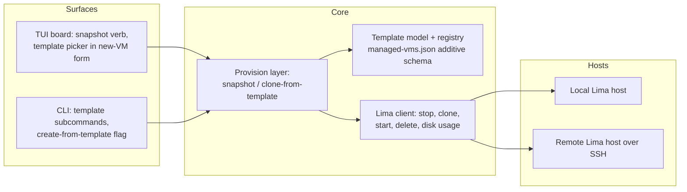
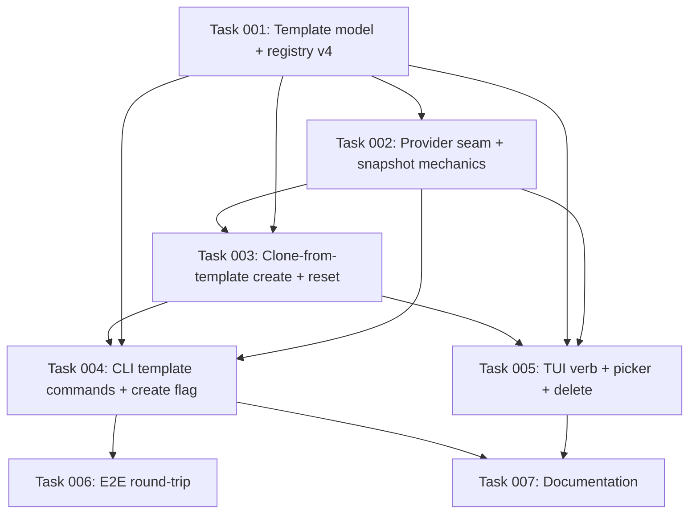

# Plan: Golden VM Templates — Snapshot and Clone

## Original Work Order

> Snapshot a running VM into a reusable "golden template". Let users snapshot a configured, running VM (DB set up, data seeded) into a named template to clone future VMs from.

## Plan Clarifications

| Question | Answer |
| --- | --- |
| Lima can only clone from a stopped disk — is stop → clone → restart acceptable, or is a true live snapshot required? | Stop → clone → restart. The source VM is briefly stopped for the disk copy, then automatically restarted. No live-snapshot machinery. |
| Should templates work on remote Lima profiles too, or local-only? | Local + remote. Templates are per-profile-scoped, like VMs; all host access goes through the existing seams that already work over SSH. |
| Where should the feature surface — TUI, CLI, or both? | Both. TUI gets a per-VM snapshot verb and a template picker in the new-VM form; CLI gets template subcommands and a create flag. |
| Include template listing and deletion, or strictly snapshot + clone-from? | Include list + delete. Templates are full disk copies; users need to see sizes/dates and reclaim space. |
| Is backwards compatibility required for the managed-VMs registry (`managed-vms.json`, schema v3)? | Yes — migrate existing state. Schema changes must be additive; current VMs load unchanged with no manual cleanup. |
| When a clone is made from a template whose embedded-playbook version has gone stale, converge or preserve? | Use the template as-is. Golden-template fidelity is the point: only the per-VM finalize phase runs; staleness is surfaced as info, never auto-converged. |
| Deleting a template that existing VMs were cloned from — block or warn? | Warn and allow by default. Deletion lists the affected VMs and proceeds; those VMs keep running and only a future reset of them would fail. No `--force` gate. _(Refinement 2026-07-17)_ |
| Snapshotting a VM that is already stopped — what power state afterward? | Leave as found. The snapshot restores the source to its pre-snapshot power state: a running VM is restarted, an already-stopped VM stays stopped (and its stop step is skipped). Snapshot never changes the VM's power state. _(Refinement 2026-07-17)_ |

## Executive Summary

This plan adds user-defined **golden templates** to sandbar. A user who has manually configured a VM — database installed, data seeded, services tuned — can snapshot it into a named template, then create any number of future VMs that start from that exact disk state instead of the generic shared base image. This turns hours of one-off setup into a reusable, named artifact.

The approach deliberately generalizes machinery sandbar already trusts: every VM today is created by `limactl clone` from a stopped Lima instance (`sandbar-base`). A template is simply another stopped Lima instance — created by cloning a user's VM rather than by running the base Ansible build — plus a registry record carrying its name, provenance, and version stamps. Creating "from a template" is the existing create flow with the clone source swapped and the base build/staleness convergence skipped. Because all host interaction already flows through the provider/host seams, the feature works identically on local Lima and remote-Lima-over-SSH profiles.

The expected outcome is a small, coherent feature: snapshot a VM to a named template (stop → clone → restart), list templates with size and age, delete them, and create new VMs from them — from both the TUI board and the headless CLI — without breaking any existing on-disk state.

## Context

### Current State vs Target State

| Current State | Target State | Why? |
| --- | --- | --- |
| Every VM is cloned from the single shared `sandbar-base` image; per-VM setup (DB, seed data) must be redone by hand on each new VM | Users can snapshot any managed VM into a named template and clone new VMs from it | Reusing configured state is the core ask; manual re-setup is slow and error-prone |
| No user-facing concept of a template; the only clone source is the internal base image | Templates are first-class, named, per-profile-scoped artifacts with provenance (source VM, creation date, playbook version, toolset) | Users need to identify, trust, and manage what they clone from |
| Disk state under `${LIMA_HOME}` is only inspectable via `limactl` by hand | Template list shows name, size on disk, creation date, and staleness info; delete reclaims the space | Templates are multi-GiB disk copies; invisible ones would silently eat disk |
| `managed-vms.json` (schema v3) records only managed VMs | Registry additionally records templates and template provenance of clones, via an additive, migrated schema | Reset/recreate and the TUI need to know what a VM was cloned from; existing state must keep working |
| TUI verbs cover start/stop/reset/shell/etc.; new-VM form offers only base-derived creation | TUI gains a snapshot-to-template verb and a template picker in the new-VM form; CLI gains template subcommands and a create flag | Both surfaces are first-class in sandbar today; the feature must match |

### Background

- **Existing clone machinery.** `internal/provision` builds `sandbar-base` once (Ansible "base" phase), stops it, and every create is `limactl clone` from that stopped disk, followed by per-VM sizing (`Configure`, grow-only qcow2) and the Ansible "finalize" phase (hostname, git identity, optional repo clone). Base mutation is serialized by a host-side base lock, and a version stamp under `${LIMA_HOME}/_sand/` drives staleness detection. Templates reuse all of this with the clone source inverted: the user's VM becomes the source.
- **Why stop-first.** Lima can only clone an idle disk (the same reason the base is stopped after build). A clean guest shutdown also guarantees the database and seeded data are flushed to disk, which is exactly the state the user wants captured.
- **Remote parity.** All host file/process access goes through the `Runner`/`HostFiles` seams, and fleet bindings pair each provider with a `registry.Scope`. Templates live on the same Lima host as the VMs of their profile; they are per-scope and are never transferred between hosts.
- **Fidelity over freshness.** The shared base auto-converges when the embedded playbook changes. Templates deliberately do not: the captured golden state is the product. Clones from a template skip base staleness handling entirely; the template's recorded playbook version is display-only.

## Architectural Approach

The feature decomposes into a template model layer, two provisioning operations (snapshot, clone-from-template), management operations (list, delete), and the two user surfaces. Everything below the surface layer routes through the existing provider/host seams so local and remote behave identically.

### Template Model and Registry

**Objective**: Give templates identity, provenance, and persistence without breaking existing on-disk state.

A template is represented on the Lima host as a stopped Lima instance with a reserved, prefixed instance name derived from the user's template name — the same representation as the internal base image, so all existing clone/lock/stamp mechanics apply. In the registry (`managed-vms.json`), templates become a new additive record kind carrying: user-facing name, owning scope (profile), source VM name, creation timestamp, embedded-playbook version at snapshot time, toolset key, and the secret-free `CreateConfig` inherited from the source VM. VM entries gain an optional provenance field naming the template they were cloned from. The schema version is bumped with a forward migration that loads v3 files unchanged; no field is removed or repurposed. Template names are validated (lowercase slug rules consistent with VM naming) and must not collide with existing templates, managed VMs, or the reserved base name in the same scope.

### Snapshot Operation

**Objective**: Turn a configured VM into a named template safely and atomically enough to trust.

The provisioning layer gains a snapshot operation: record the source VM's current power state, gracefully stop it if it is running (flushing guest disk state — an already-stopped source skips this step), clone its disk into the template's reserved instance name, **restore the source to its recorded power state** (restart a formerly-running VM; leave a formerly-stopped VM stopped), stamp the template with the playbook version and toolset recorded for the source, and register the template (_snapshot never changes the source's power state — clarification 2026-07-17_). The clone is performed under the same host-side lock discipline the base image uses, extended to cover template mutation, so concurrent creates/snapshots on one host cannot interleave. The known Lima listing race during clones is already handled by the existing retry machinery and applies unchanged. A snapshot into an existing template name is an error directing the user to delete first — no implicit overwrite. Failure handling is explicit: if the clone fails, the partial template instance is cleaned up and the source VM is restored to its recorded power state regardless; a source that was running is never left stopped silently.

### Clone-from-Template Create

**Objective**: Make "create from template" a variant of the existing create flow, not a second flow.

The create path accepts an optional template reference. When present, the base-ensure/staleness/convergence stage is skipped entirely and the clone source is the template's instance; everything downstream is unchanged — per-VM sizing (disk grows from the template's size, never shrinks), start, and the finalize Ansible phase (hostname, git identity, optional repo clone). The new VM's registry entry records the template as its provenance and stores a `CreateConfig` whose base points at the template, so reset/recreate of that VM re-clones from the template rather than from `sandbar-base`. If the referenced template has been deleted, create and reset fail with a clear error naming the missing template. Staleness of the template relative to the current embedded playbook is reported as informational output only.

### Template Management: List and Delete

**Objective**: Make template disk consumption visible and reclaimable.

Listing enumerates templates in scope from the registry, joined with host-side facts fetched through the host seams: disk size on the Lima host, creation date, source VM, toolset, and whether the template's playbook version is stale relative to the current binary. Delete removes the template's Lima instance (and its disk) and its registry record, under the same lock as snapshot. Deleting a template that existing VMs were cloned from is allowed but warns and lists the affected VMs, since their reset provenance will dangle; those VMs keep running and can still be deleted or recreated from the base explicitly. This warn-and-allow behavior is the default with no `--force` gate — the warning is informational, not a block (_clarification 2026-07-17_).

### CLI Surface

**Objective**: Expose snapshot/list/delete/create-from headlessly, consistent with existing command structure.

A new `template` command group in the `sand` binary covers snapshot (source VM + template name), list (per profile, with sizes and staleness info), and delete. `sand create` gains a flag selecting a template as the clone source, mutually exclusive with base-rebuild flags that only make sense for base-derived creates. All commands honor the existing profile selection flag so remote scopes work identically.

### TUI Surface

**Objective**: First-class board integration matching existing verb and form patterns.

The per-VM command registry gains a "snapshot to template" verb, enabled for VMs in states where a clean clone is possible (running or already-stopped); it prompts for a template name and runs the snapshot as a tracked job with progress (stopping if needed → cloning → restoring prior state), consistent with existing long-running verbs. The new-VM form gains a source selector offering the base plus the templates available in the selected profile's scope, showing size/age/staleness info inline. Template rows (or a lightweight template listing view) expose delete with a confirmation that includes the disk size being reclaimed and any dependent VMs. All TUI additions follow the existing job-registry and golden-snapshot-test patterns.

### Remote Parity

**Objective**: The whole feature behaves identically on remote-Lima profiles.

No component above talks to the host directly: stop/clone/start/delete and disk-usage queries go through the Lima client and `Runner`/`HostFiles` seams; registry records are keyed by scope. Snapshot and clone-from-template on a remote profile operate entirely on the remote host — no disk data ever transits to the laptop. The remote e2e suite is extended to cover the snapshot → clone-from → delete round-trip.

## Risk Considerations and Mitigation Strategies

Technical Risks

- **Source VM left stopped after a failed snapshot**: a crash between stop and restart strands a formerly-running VM offline.
    - **Mitigation**: restore the source to its recorded pre-snapshot power state in a deferred/always path regardless of clone outcome; surface any restart failure loudly; snapshot job reports each phase so a stall is visible. A source that was already stopped is deliberately left stopped.
- **Partial template instance on clone failure**: an aborted clone can leave a half-written instance directory that later name-collides.
    - **Mitigation**: clean up the target instance on failure before returning; registry registration happens only after a successful clone and stamp, so the registry never references a broken template.
- **Lima clone/list race (lima#5236)**: listing while another instance is mid-clone can fail.
    - **Mitigation**: reuse the existing race-aware retry handling already in the Lima client; serialize all base/template mutation under the host-side lock.
- **Disk-size semantics**: qcow2 grows but never shrinks; a clone cannot be smaller than its template, and users may request a smaller disk.
    - **Mitigation**: validate requested disk size against the template's size at create time and fail early with a clear message rather than silently ignoring the request.
- **Guest data consistency**: snapshotting without a clean shutdown could capture a torn database state.
    - **Mitigation**: the flow performs a graceful stop (the same mechanism as the existing stop verb) before cloning; the clone source is always an idle disk.

Data and Security Risks

- **Secrets baked into templates**: the source VM may contain a Claude login, git identity, shell history, or seeded credentials; every clone inherits them.
    - **Mitigation**: the finalize phase already rewrites hostname and git identity per clone; document clearly that everything else in the guest disk propagates to clones, and keep templates strictly per-host/per-scope (never exported or transferred).
- **Registry migration**: a schema bump risks corrupting or orphaning existing `managed-vms.json` state.
    - **Mitigation**: additive-only fields, explicit migration from v3 covered by unit tests over real fixture files, and no rewrite of fields existing code depends on.

Implementation Risks

- **Provider interface creep**: the `Provider` interface deliberately excludes base-image internals; templates could tempt a leaky extension.
    - **Mitigation**: follow the base-image precedent — template mechanics live in the provisioning layer behind the same host seams, not in the `Provider` surface, extending it only where the TUI/CLI genuinely need new capability.
- **TUI surface growth**: a new verb, a form selector, and a management view touch the board's most-tested code.
    - **Mitigation**: follow the existing command-registry and job patterns exactly; extend golden snapshot tests alongside each UI change.
- **Remote e2e cost**: the remote suite runs real VMs over SSH and is the most expensive CI path.
    - **Mitigation**: keep the remote template e2e to one round-trip scenario (snapshot → create-from → delete) and rely on the seam-level fakes for breadth.

## Success Criteria

### Primary Success Criteria

1. A user can snapshot a managed VM into a named template; afterwards the source VM is restored to its pre-snapshot power state (a running source is running again; an already-stopped source stays stopped) and the template appears in the template list with its size, creation date, source VM, and playbook-version info — on both local and remote profiles.
2. A user can create a new VM from a named template (via TUI form or CLI flag); the new VM contains the template's guest state (e.g. seeded database present), has its own hostname/git identity, and its registry entry records the template as provenance so reset re-clones from the template.
3. Templates can be listed and deleted from both surfaces; deletion reclaims the disk on the owning host and warns when dependent VMs exist.
4. A pre-existing schema-v3 `managed-vms.json` loads unchanged after the upgrade: existing VMs remain visible and operable with no manual intervention.
5. Snapshot failure paths never leave a formerly-running source VM stopped or a half-built template registered.

## Self Validation

After all tasks are complete, verify against a real local Lima host (and the remote profile where noted):

1. Run the full unit suite and confirm green, including the registry migration tests over a v3 fixture file.
2. Create a VM headlessly, then write a distinctive marker into the guest — e.g. shell in and create a file plus a small SQLite database under the project directory — to stand in for "DB set up, data seeded".
3. Snapshot it via the CLI into a template named `golden-test`. Confirm command output reports stop → clone → restart phases; then verify with the Lima CLI that the source VM is `Running` again and a stopped template instance exists.
4. Run the template list command; confirm `golden-test` appears with a nonzero disk size, today's date, and the source VM's name. Inspect `managed-vms.json` and confirm an additive template record plus untouched pre-existing VM entries.
5. Create a second VM from `golden-test` via the CLI flag. Shell in and confirm the marker file and SQLite data exist, and that the hostname and git identity belong to the new VM, not the source.
6. Reset the templated VM and confirm it comes back with the marker intact (proving reset re-cloned from the template, not the base).
7. Launch the TUI, snapshot a VM through the new verb, and create a VM through the form's template picker; capture screenshots of the verb prompt, the job progress tile, and the picker showing template size/age.
8. Delete `golden-test` via the CLI while the templated VM still exists; confirm the warning lists the dependent VM, the Lima instance directory is gone, and a subsequent reset of the dependent VM fails with the clear missing-template error.
9. On a remote profile (or the remote e2e suite), run the snapshot → create-from → delete round-trip and confirm the template disk only ever existed on the remote host.
10. Simulate a snapshot failure (e.g. interrupt or force a clone error) and confirm a formerly-running source VM is restarted and no template registry entry or instance remains.
11. Snapshot an already-stopped VM and confirm it stays stopped afterward (its power state is unchanged) while the template is still produced correctly.

## Documentation

- Documentation site: a new templates page (concept + how-to for snapshot, create-from, list, delete), plus updates to the files-and-state reference (template instances, registry schema bump, new stamp files) and the create/CLI reference for the new flag and command group.
- TUI key/verb reference updated with the snapshot verb and the new-VM form's template picker.
- README feature list updated to mention golden templates.
- AGENTS.md updated only if the registry schema conventions or lock discipline notes it contains need the template extension reflected.
- Explicit documentation of the secrets-propagation caveat: everything in the source guest disk except per-VM identity carries into clones.

## Resource Requirements

### Development Skills

- Go (provisioning layer, registry, CLI) and Bubble Tea/Lip Gloss (TUI verb, form, golden tests).
- Working knowledge of Lima instance lifecycle (clone semantics, idle-disk requirement, instance directories) and qcow2 disk behavior.
- Familiarity with sandbar's seam architecture (`Runner`/`HostFiles`, provider bindings, scopes) for remote parity.

### Technical Infrastructure

- Local Lima installation for development and the `limae2e`-tagged suite.
- The existing remote-Lima CI environment for the remote round-trip e2e.
- No new external dependencies anticipated.

## Integration Strategy

The feature integrates by extension, not parallel construction: the registry schema is bumped additively; the provisioning layer gains two operations that reuse the base lock, clone client, stamp, and finalize machinery; the CLI adds one command group and one flag; the TUI adds one verb, one form field, and management affordances through the existing command registry and job system. Reset/recreate transparently honors template provenance through the same `CreateConfig` persistence it already uses.

## Notes

- Explicitly out of scope: live/zero-downtime snapshots, template export/import or cross-host transfer, converge-on-clone, and implicit template overwrite.
- Template freshness is intentionally the user's responsibility: the design surfaces staleness but never mutates a template after creation. Re-snapshotting from an updated VM (after deleting the old template name) is the refresh path.

### Refinement Change Log

- 2026-07-17: Generated the task blueprint (7 tasks, 5 phases) and appended the Execution Blueprint section below.
- 2026-07-17: Refined snapshot power-state semantics — the flow now records and **restores** the source's pre-snapshot power state (already-stopped sources skip the stop and stay stopped) rather than unconditionally restarting; propagated the wording through the Snapshot Operation, the "left stopped" technical risk, success criteria 1 & 5, and the TUI verb enablement, and added self-validation step 11. Confirmed template deletion stays **warn-and-allow with no `--force` gate**. Recorded both decisions in the Plan Clarifications table.

## Execution Blueprint

**Validation Gates:**
- Reference: `/config/hooks/POST_PHASE.md`

Tasks are executed as parallel subagents in a single working tree, so tasks that mutate the same Go package are serialized to avoid write conflicts. Tasks 1→2→3 all touch `internal/registry`/`internal/provision` and run one phase at a time; the CLI (task 4) and TUI (task 5) touch disjoint packages and run in parallel, as do the e2e (task 6) and docs (task 7).

### Dependency Diagram

### Phase 1: Data Model Foundation ✅
**Parallel Tasks:**
- ✔️ Task 001: Template data model and registry v4 migration (completed)

### Phase 2: Snapshot Mechanics ✅
**Parallel Tasks:**
- ✔️ Task 002: Provider seam + snapshot/delete/disk mechanics (completed)

### Phase 3: Clone-from-Template ✅
**Parallel Tasks:**
- ✔️ Task 003: Clone-from-template create and template-aware reset (completed)

### Phase 4: User Surfaces ✅
**Parallel Tasks:**
- ✔️ Task 004: CLI `sand template` commands and `sand create --template` (completed)
- ✔️ Task 005: TUI snapshot verb, template picker, and delete (completed)

### Phase 5: Verification and Docs ✅
**Parallel Tasks:**
- ✔️ Task 006: E2E snapshot → clone-from → delete round-trip, local + remote (completed)
- ✔️ Task 007: Documentation of the shipped feature (completed)

### Post-phase Actions
- Run `gofmt -l .` (must be empty), `go vet ./...`, and `go build ./cmd/sand` after each code phase.
- Create a descriptive conventional commit per phase.

### Execution Summary
- Total Phases: 5
- Total Tasks: 7

## Execution Summary

**Status**: ✅ Completed Successfully
**Completed Date**: 2026-07-17

### Results
Golden VM templates shipped end to end across 7 tasks / 5 phases:
- **Data model (registry v4):** `vm.TemplateInstanceName`/`ValidateTemplateName`; `registry.Template` with scoped CRUD (`AddTemplate`, `RemoveTemplateScoped`, `TemplatesInScope`, `TemplateInScope`, `DependentsOfTemplate`), a `TemplateSource` provenance field on managed VMs, and `AddScopedWithTemplate`/`TemplateSourceInScope`. Schema bumped v3→v4 with an additive migration that preserves existing state (verified live: a real v3 file rewrote to v4 with its VM intact).
- **Snapshot mechanics:** `Provisioner.SnapshotTemplate` preserves the source's power state (running→stop/clone/restart; stopped stays stopped), restores on any failure, cleans up partial clones, and stamps the template's playbook version; plus `DeleteTemplate` and `TemplateDiskBytes`. Exposed on the `Provider` interface (local delegates, remote inherits) and the fake.
- **Clone-from-template:** `CreateOptions.TemplateSource` clones from a template instance and skips all base-build/staleness machinery (base path unchanged when unset); reset/recreate of a template-provenanced VM re-clones from the template; missing template fails fast with a named error.
- **Surfaces:** CLI `sand template snapshot|list|delete` + `sand create --template`; TUI `t` snapshot verb (tracked job), new-VM form source selector, template delete confirmation, and template-aware reset.
- **e2e + docs:** `//go:build limae2e` round-trip (snapshot → create-from → delete) for local and remote scopes; new golden-templates docs page, files-and-state schema-v4 update, CLI/TUI reference, README, AGENTS.md.

Final gate: `gofmt -l` clean, `go vet ./...` clean, `go build ./...` clean, full `go test ./... -race` green, aggregate coverage **87.1% ≥ 87%** floor.

### Noteworthy Events
- **Registry provenance-write wiring (task 1 → task 4).** Task 1 deliberately left the write side of `TemplateSource` provenance for "the task that clones from a template." Task 4 added `AddScopedWithTemplate`/`TemplateSourceInScope` to `internal/registry` to close that gap — a justified cross-package addition (not the UI package task 5 was editing), consumed by both surfaces.
- **Two well-reasoned design deviations from the task sketches.** `SnapshotResult` uses `ToolsetKey string` (matching the registry field, reachable cross-package) instead of a `map[string]bool`; and the missing-template existence check uses `Lima.Get` (the only method that returns `ErrNoSuchInstance`) rather than `Status`, avoiding a dead error branch.
- **Concurrent phase-4 execution touched shared registry state.** Tasks 4 and 5 ran in parallel; task 5 consumed task 4's new registry APIs from the shared tree. Verified by a full combined build + race suite after both landed — no conflict.
- **Dead-code cleanup.** Removed the unused non-scoped `RemoveTemplate` wrapper introduced in task 1 (all template deletion is scope-aware) per the execution cleanup gate. The v3→v4 migration is a plan-mandated compatibility requirement, not tech debt.
- **e2e was compile- and skip-verified, not run against live VMs.** `limactl` is installed in this environment but the e2e suite is opt-in (gated on `LIMA_E2E`/`LIMA_REMOTE_E2E`, matching the existing harness) and the sandbox cannot safely boot real VMs. The tagged tests compile, `go vet` clean under the tag, and skip cleanly. Self-Validation steps that need a live VM (snapshot/clone/reset round-trips, screenshots) are therefore exercised by these tests in CI's `lima-e2e` job, not here; the non-VM steps (unit migration test, real-binary `template --help`/`list`, live v3→v4 migration, mutual-exclusion and error-exit checks) were executed and pass.

### Necessary follow-ups
- Run the `limae2e`-tagged round-trip (`LIMA_E2E=1`, and `LIMA_REMOTE_E2E=1` for the remote leg) in the CI `lima-e2e` job to exercise the real-VM Self-Validation steps.
- Optional: capture TUI screenshots of the snapshot verb, form source selector, and delete confirmation for the docs (golden snapshots already cover them in tests).
