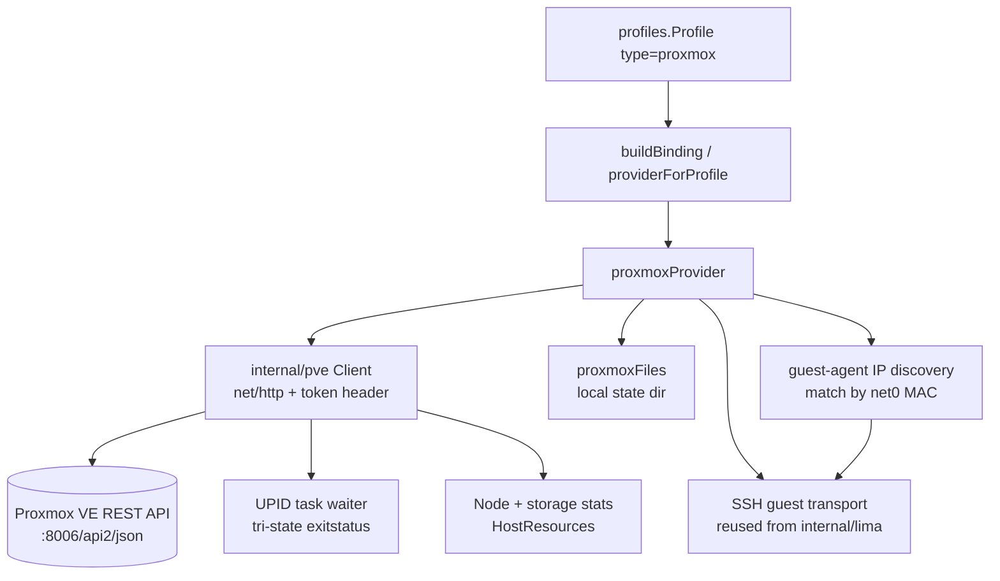
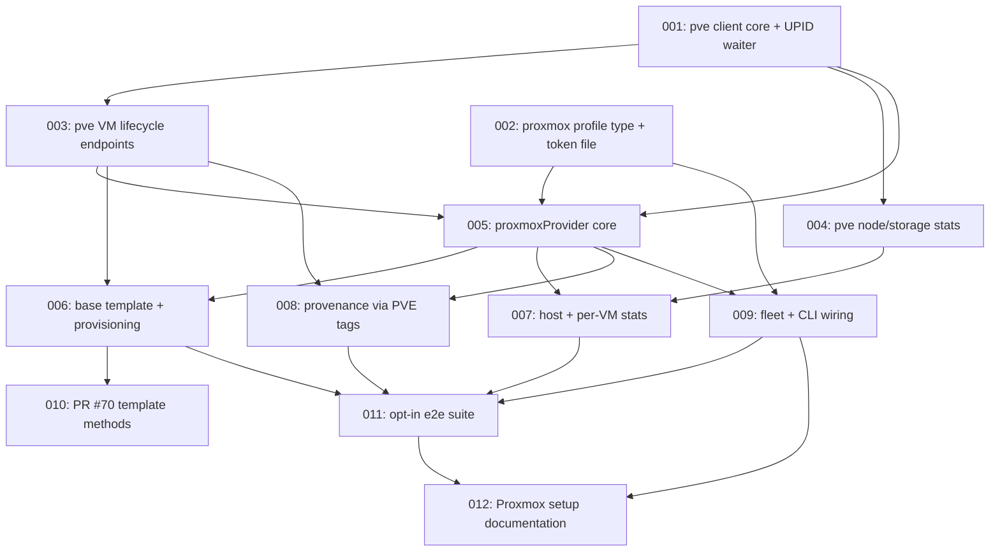

# Plan: Proxmox VE Provider

## Original Work Order

> Add support for using Proxmox's API to run VMs alongside the local and remote
> ssh providers. It should require the minimum API permissions needed to be able
> to run the CRUD workflow, including creating a base VM. Note the pending work
> in https://github.com/Lullabot/sandbar/pull/70 in case it impacts this new
> feature. Our docs need to also detail how to set up Proxmox - a step by step
> guide for creating a dedicated pool for the VMs and an API user or token so
> that Sandbar can't accidentally affect other VMs on the host.
>
> Ideally we can get the host-wide stats from Proxmox's API too for CPU, memory,
> disk use, etc.

## Plan Clarifications

| Question | Answer |
| --- | --- |
| How should the provider reach guest VMs for shell, copy, and provisioning? | **Direct SSH to the VM's IP**, discovered via the qemu-guest-agent API. Reuses the existing SSH transport; requires the machine running `sand` to reach the VM subnet. |
| How should the Proxmox base image be produced? | **`sand` builds it from a cloud image** — download via the storage `download-url` API, create a cloud-init VM, run the existing Ansible playbook over SSH, convert to a PVE template. Mirrors how `sandbar-base` is built today. |
| Is a Proxmox host available for e2e testing? | Yes, but **not runnable in CI**. Tests are opt-in, gated on `PROXMOX_E2E_*` env vars supplying the token. Docs must explain setting up a **separate, isolated pool for automated tests** distinct from the day-to-day pool. |
| How should PR #70 (golden VM templates) be handled? | **Implement template support too.** PVE templates map onto the feature natively; the plan targets the post-#70 `Provider` interface and notes the rebase dependency. |
| Backwards compatibility | **Required and free.** This is purely additive: a new `profiles.Type`, a new provider implementation, and new docs. No existing profile, registry entry, or on-disk schema changes meaning. |

## Executive Summary

Sandbar's `Provider` interface (`internal/provider/provider.go`) was designed as
a backend-agnostic seam and already names Proxmox as an intended future backend.
This plan makes good on that: a third provider that drives VMs through the
Proxmox VE REST API, selected — like the local and remote-SSH providers — by a
connection profile, with no changes to the interface itself.

The approach is deliberately conservative in two ways. First, **no new
dependency**: PVE API-token auth is a single static `Authorization` header with
no CSRF token and no ticket lifecycle, so a hand-rolled `net/http` client is
roughly forty lines. The surveyed Go client libraries are variously unlicensed,
untagged, or drag a Terraform plugin stack behind them, and none of them encode
the PVE semantics that actually matter (see Background) — a library hands you
`int64` fields, it does not tell you which ones lie. Sandbar currently has zero
direct HTTP dependencies and this plan keeps it that way. Second, **the guest
transport is reused, not reinvented**: once a VM's IP is known, `sand` talks to
it over SSH exactly as it already does, so shell, copy, tmux attach, and the
Ansible provisioning pass are unchanged.

The security posture is the centerpiece rather than an afterthought. Every VM
`sand` creates is placed in a dedicated PVE resource pool at creation time, and
the API token is granted a custom role scoped to `/pool/{poolid}`. Proxmox
implements pool ACLs by *projecting* roles onto member VMIDs and storage IDs,
so a VM outside the pool has no projection and access is denied structurally —
there is no wildcard or path traversal that escapes it. Three privileges
(`SDN.Use`, `Sys.AccessNetwork`, `Sys.Audit`) provably cannot be pool-scoped and
must be granted at narrower non-pool paths; the setup guide names them
explicitly rather than papering over the gap with a broad grant.

## Context

### Current State vs Target State

| Current State | Target State | Why? |
| --- | --- | --- |
| Two providers: local Lima, remote Lima over SSH | A third provider driving Proxmox VE over its REST API | The `Provider` seam was built for this; Proxmox is the stated next backend |
| `profiles.Type` is `local` or `remote-ssh` | Adds `proxmox` | Profile type is how a backend is selected; two small switches consume it |
| Profiles are strictly secret-free (`identity_path` is a *path*) | Proxmox profile stores `token_file` — a path to a 0600 file | Preserves the secret-free invariant exactly as `identity_path` does; the token never enters `profiles.yaml` |
| Zero direct HTTP dependencies; only transport is subprocess-over-SSH | A small internal `net/http` PVE client | Token auth needs one header and no CSRF; a dependency to set one header does not earn its keep |
| Base image is a Lima VM built by Ansible, stamped under `_sand/` | A PVE **template** built from a cloud image by the same Ansible playbook | Parity with existing providers; PVE templates are the native clone source |
| Host stats sampled via `nproc`/`/proc/meminfo`/`df` over SSH, or local probes | Sampled from `GET /nodes/{node}/status` and `GET /nodes/{node}/storage` | The API already reports node CPU/memory/disk; no shell account on the PVE node is needed |
| Provenance is a sidecar file in the Lima instance dir | Provenance via PVE VM **tags and description** | `Provenancer`'s doc already anticipates "VM tags/labels, with no redesign" |
| Docs say Proxmox "is not available yet" | A full setup guide: dedicated pool, custom role, API token, ACLs, and a separate isolated test pool | The safety guarantee is only real if the operator can reproduce the scoping exactly |

### Background

The provider seam is genuinely ready. `Provider` is expressed only in `vm.VM`,
`vm.CreateConfig`, `provision.*Options`, strings, and `io` types. Backend
selection is two small switches — `buildBinding` (`internal/provider/fleet.go:76`)
and `providerForProfile` (`cmd/sand/resolve.go:69`) — plus `validate`
(`internal/profiles/store.go:324`). Adding a type touches exactly those three.

Two places are awkward and the plan addresses them head-on rather than
discovering them mid-implementation:

1. **`Provider.HostFiles() lima.HostFiles`** forces every backend to produce a
   Lima-named filesystem seam, including `LimaHome()` and `StagePlaybook()`, and
   `internal/ui` calls it directly. Proxmox has no "the host where limactl runs".
   Resolution: a small local-filesystem implementation rooted at a per-endpoint
   state directory, `StagePlaybook` returning its input unchanged (the playbook
   reaches the guest over SSH, not a bind mount), and `DiskAllocBytes` returning
   `-1` ("cannot be measured", already a supported answer).
2. **Per-VM disk usage.** The UI samples it by reading a qcow2's allocated size
   through `HostFiles`. That has no Proxmox analogue, and PVE's own
   `GET .../status/current` hardcodes QEMU `disk` to `0` — literally
   `$d->{disk} = 0; # no info available`. Resolution: the provider populates
   `vm.VM.DiskUsed` itself from storage content, and the UI's `HostFiles`-based
   sampling degrades to "no reading" rather than reporting a false zero.

The research pass surfaced several PVE semantics that are easy to get wrong and
that this plan treats as explicit requirements, not incidental details:

- **Task `exitstatus` is tri-state.** `OK`, `WARNINGS: n`, or raw error text —
  and `WARNINGS: n` **is success** to Proxmox. Treating it as failure is a real,
  documented bug class: a provider that did so created a VM, dropped it from
  state, and produced a duplicate on the next run.
- **Clone `full` defaults to `!is_template`**, and passing `storage` is a hard
  error for a linked clone. Clone params must be built conditionally.
- **`POST /config` is async** (returns a UPID) while **`PUT /config` is sync** —
  backwards from intuition. `GET /config` returns *pending* state unless
  `current=1`.
- **Resize units**: bare number is bytes, `20G` absolute, `+10G` relative — and
  disk creation uses `storage:32` meaning GiB. Three unit conventions in one
  workflow; normalize to bytes internally.
- **`sshkeys` is URL-unescaped server-side**; spaces must be `%20`, never `+`.
- **Cloud-init does not regenerate on a `PUT /config`** — only on VM start, an
  explicit `PUT .../cloudinit`, or hotplug (which excludes cloudinit by default).
- **`GET /cluster/resources` auto-filters VMs and storage by permission, but
  never hides node names.**
- **PVE 9 removed `VM.Monitor`** and introduced `VM.GuestAgent.*`. Including a
  non-existent privilege makes `pveum role add` reject the whole command.
- **403 responses carry their detail in the HTTP reason phrase, not the body**
  (the body is just `{"data":null}`). A body-only client loses the message
  entirely — which is precisely how a comparable tool ended up hanging forever
  instead of reporting a permission error.

## Architectural Approach

The provider is one new package (`internal/pve`, the API client) plus one new
provider implementation (`internal/provider/proxmox.go`), wired in through the
existing profile plumbing. Nothing on the `Provider` interface changes.

### The PVE API client (`internal/pve`)

**Objective**: a small, typed, dependency-free client that encodes PVE's
semantics so the provider layer never has to.

A `Client` holding a `*http.Client`, a base URL, and the token header. TLS
verification is on by default with an explicit per-profile opt-out and an
optional pinned CA path, since PVE ships a self-signed cert. Every response is
unwrapped from its `{"data": ...}` envelope. Errors carry **both** the body's
`message`/`errors` and the HTTP status *reason phrase*, so a 403's privilege
detail survives.

The UPID task waiter is the client's most important piece: parse the 9-field
UPID (tolerating an 8- or 9-hex-digit `pstart`), poll
`GET /nodes/{node}/tasks/{upid}/status`, and classify `exitstatus` as
success when it is `OK` **or** matches `WARNINGS: \d+`. The waiter tolerates the
transient 400 immediately after dispatch (matched on the `errors.upid` key, not
the status code, which is ambiguous) and the 596/599 proxy artifacts.

### The provider implementation (`internal/provider/proxmox.go`)

**Objective**: satisfy `Provider` by mapping each method onto PVE endpoints.

Discovery uses `GET /cluster/resources?type=vm` filtered to the configured pool
— one round trip for the whole fleet, already permission-filtered by PVE.
`Get`/`Status` hit the per-VM endpoints directly, honouring the interface's
explicit contract that `Get` must not be implemented by scanning `List`. Power
maps to `/status/*`. `Delete` is `DELETE .../{vmid}` with `purge=1`.

Guest transport is the reused SSH path. The provider resolves a VM's IP via
`GET .../agent/network-get-interfaces`, **matching the interface by its MAC
against `net0`** rather than by name (interface naming is not stable, `lo` is
always present, and an up-but-unaddressed NIC omits the `ip-addresses` key
entirely). Resolved IPs are cached per VM and invalidated on power transitions.

Provenance is implemented natively through PVE VM tags plus the description
field, satisfying `Provenancer` without a sidecar file.

### Base template build

**Objective**: reach parity with `sandbar-base` using PVE-native primitives.

Download the cloud image with `POST /nodes/{node}/storage/{storage}/download-url`
using `content=import`, create a cloud-init VM (`scsihw=virtio-scsi-pci`,
`ide2=<storage>:cloudinit`, `agent=1`, `net0` on the configured bridge, serial
console), inject the SSH key with the required `%20` encoding, boot it, wait for
the guest agent, run the existing Ansible playbook over SSH, then convert it with
`POST .../template`. Creation always passes `pool`, which is what makes the new
VM a pool member — and therefore what makes every subsequent permission check
succeed under a pool-scoped token.

Clones use `POST .../clone` with `full=1` and the target `pool`. Because parallel
clones from one template serialize on the template's server-side flock (10s
timeout, unreachable from a token identity), clones from the same source are
serialized client-side with backoff rather than left to fail.

### Templates (PR #70 alignment)

**Objective**: satisfy the post-#70 interface natively.

PVE templates are the same primitive golden templates want. `SnapshotTemplate`
clones the source and converts the clone to a template; `DeleteTemplate` deletes
it; `TemplateDiskBytes` reads the volume size from storage content.

### Host and per-VM stats

**Objective**: fill `HostResources` from the API, with no shell on the node.

`GET /nodes/{node}/status` supplies CPU count (`cpuinfo.cpus`) and memory.
Critically, PVE computes `memused = memtotal - memavailable`, so `used + free`
does **not** equal `total`; `memory.available` is the correct headroom figure.
Disk free/total come from `GET /nodes/{node}/storage/{storage}` for the storage
backing the VMs — the useful denominator — not the node's root filesystem. Any
value the API does not supply is left `0`, which the header already treats as
"unknown" and drops.

### Documentation

**Objective**: make the isolation guarantee reproducible.

A new "Proxmox" page under *Using sand* with copy-pasteable `pveum` commands
covering: creating the pool, creating the custom role with the exact minimum
privilege list, creating the user and a privilege-separated token, and attaching
ACLs at `/pool/{poolid}`, `/storage/{id}`, `/sdn/zones/localnetwork/{bridge}`,
and `/nodes/{node}`. The three privileges that cannot be pool-scoped are called
out with an explanation of what each one grants and why it is unavoidable, so an
operator can make an informed decision rather than trusting a blob of commands.
The page also documents a **second, isolated pool and token for automated
tests**, and `reference/security-model.md` gains the isolation rationale.

## Risk Considerations and Mitigation Strategies

Technical Risks

- **PVE version drift (8.x vs 9.x)**: PVE 9 removed `VM.Monitor` and added
  `VM.GuestAgent.*`. A role built for one version fails on the other.
    - **Mitigation**: target PVE 8.1+ as the floor, never request `VM.Monitor`,
      and have `Preflight` read the version and report a clear error rather than
      failing later with an opaque 403.
- **Permission errors misread as transient**: the canonical failure in comparable
  tools was a 403 swallowed by an agent-readiness retry predicate, hanging
  forever instead of erroring.
    - **Mitigation**: the client classifies 401/403 as permanent and never
      retries them; the agent-wait loop aborts immediately on a permission error
      and surfaces the reason phrase, which is where PVE puts the detail.
- **Task-status misclassification**: treating `WARNINGS: n` as failure causes
  duplicate VMs.
    - **Mitigation**: encoded in the waiter and covered by a direct unit test.
- **Cloud-init silently not regenerating**: a config write alone does not take
  effect.
    - **Mitigation**: always follow a cloud-init write with an explicit
      `PUT .../cloudinit` or a stop/start.
- **VMID allocation races**: `/cluster/nextid` takes no lock and reserves
  nothing; the create call is the atomic operation.
    - **Mitigation**: on a collision, re-ask `nextid` fresh and retry — never
      increment locally, which stalls across occupied ranges.

Implementation Risks

- **PR #70 has not landed and changes the `Provider` interface** (adds
  `DeleteTemplate` and `TemplateDiskBytes`).
    - **Mitigation**: build against today's interface and add the two methods in
      a dedicated final task, so the merge is a small additive change in one file
      regardless of which branch lands first.
- **`HostFiles` has no natural Proxmox meaning**.
    - **Mitigation**: resolved explicitly (see Background) rather than left to
      per-method improvisation.
- **No CI coverage**: e2e cannot run in CI, so regressions can hide.
    - **Mitigation**: a mock PVE HTTP server exercises the client and provider in
      the normal `go test ./...` run, so only genuinely host-dependent behaviour
      relies on the opt-in suite.

Security Risks

- **Token leakage**: a token in `profiles.yaml` would break the secret-free
  invariant and land in any shared config.
    - **Mitigation**: the profile stores `token_file`, a path; the loader
      refuses a file with permissions looser than 0600 and never logs the value.
- **Over-broad grants**: an operator granting `PVEVMAdmin` at `/` would silently
  void the whole isolation guarantee.
    - **Mitigation**: the guide gives the minimum role explicitly, explains the
      three unavoidable non-pool grants, and includes a
      `pveum user permissions` verification step so the operator can confirm the
      resulting scope rather than assume it.

## Success Criteria

### Primary Success Criteria

1. A `proxmox`-type profile can create, list, shell into, reset, and delete a VM
   on a real Proxmox host using a token holding **only** the documented minimum
   privileges — with no privilege added reactively to make a step pass.
2. The same token, pointed at a VM outside its pool, is denied by Proxmox for
   read, power, and delete operations.
3. The board header shows real CPU, memory, and disk figures for the Proxmox
   node, sampled from the API with no shell account on the node.
4. `go test ./...` passes with the new packages covered by mock-server tests, and
   the coverage floor in CI is not lowered.
5. The docs page's `pveum` command sequence, run verbatim on a clean host,
   produces a working token — verified by running the e2e suite against it.

## Self Validation

After all tasks complete, execute these steps and capture the output as evidence:

1. **Build and vet**: `go build ./... && go vet ./...` — expect no output.
2. **Unit + mock coverage**: `go test ./internal/pve/... ./internal/provider/... -race -v`
   — expect all tests pass, including explicit cases for `WARNINGS: n` treated as
   success, a 403's reason phrase surfacing in the error string, and guest-agent
   interface matching by MAC.
3. **Privilege-minimality proof**: run the documented `pveum` sequence on the
   test host, then `pveum user permissions 'sandbar@pve!prov' --output-format json`
   and confirm the returned paths are exactly the pool, the storages, the bridge,
   and the node — with no grant at `/`.
4. **Live CRUD**: with `PROXMOX_E2E=1` and the token env vars set, run
   `go test -tags proxmoxe2e -timeout 45m -run TestE2E ./internal/provider/` and
   confirm a full create → shell → reset → delete cycle passes.
5. **Isolation proof**: create a VM by hand *outside* the pool, then run the e2e
   isolation test that attempts `Get`, `Stop`, and `Delete` against it with the
   sandbar token; confirm each is refused with a 403 and that the VM still exists
   and is still running afterwards.
6. **Stats proof**: run `sand` against the Proxmox profile and capture the board
   header, confirming the CPU/memory/disk clause is populated; cross-check the
   figures against `pvesh get /nodes/{node}/status` on the host.
7. **Docs build**: `mkdocs build --strict` — expect success with the new page in
   the nav and no broken links.

## Documentation

- **New**: `docs/using-sand/proxmox.md` — the step-by-step setup guide (pool,
  role, user, token, ACLs, the three non-pool-scopable privileges, the separate
  test pool, and profile configuration). Added to `mkdocs.yml` nav.
- **Update**: `docs/using-sand/connection-profiles.md` — replace the "Future
  providers" section, which currently states no non-Lima backend is available,
  and document the `proxmox` profile fields.
- **Update**: `docs/reference/security-model.md` — the pool-scoping isolation
  rationale and the token-file handling.
- **Update**: `docs/reference/files-and-state.md` — the per-endpoint Proxmox
  state directory and the token file location.
- **Update**: `AGENTS.md` — note the third provider and the `internal/pve`
  package so future agents do not assume the SSH-only transport model.

## Resource Requirements

### Development Skills

Go (`net/http`, JSON, interfaces, concurrency), the Proxmox VE REST API and its
permission model, SSH/cloud-init provisioning, Ansible, and technical writing.

### Technical Infrastructure

A Proxmox VE 8.1+ host with a storage supporting `images` content and the
`import` content type, a Linux bridge, and network reachability from the machine
running `sand` to the VM subnet. No new Go module dependencies.

## Integration Strategy

Purely additive. A new `profiles.Type` value, a new provider constructor, and
three switch/validation sites updated. Existing local and remote-SSH profiles,
registry entries, and secrets are untouched, and no on-disk schema changes
meaning — so an older `profiles.yaml` keeps working and a `sand` build without a
Proxmox profile behaves identically to today.

## Notes

The plan deliberately does **not** add: a TUI wizard for Proxmox setup, LXC
container support, multi-node scheduling or migration, PVE cluster failover
handling, VNC/SPICE console support (`VM.Console` is therefore excluded from the
role), or a generic credential manager. None was requested, and each would
enlarge the privilege set the work order asks to minimize.

## Execution Blueprint

**Validation Gates:**
- Reference: `/config/hooks/POST_PHASE.md`

### Dependency Diagram

No circular dependencies; every task appears in exactly one phase below.

### ✅ Phase 1: Foundations
**Parallel Tasks:**
- ✔️ Task 001: `internal/pve` HTTP transport, token auth, error shaping, UPID task waiter
- ✔️ Task 002: `proxmox` profile type and secret-free token-file loading

### ✅ Phase 2: API Surface
**Parallel Tasks:**
- ✔️ Task 003: Typed VM lifecycle and guest-agent endpoints (depends on: 001)
- ✔️ Task 004: Node and storage statistics endpoints (depends on: 001)

### ✅ Phase 3: Provider Core
**Parallel Tasks:**
- ✔️ Task 005: `proxmoxProvider` — discovery, power, guest transport, IP discovery, `HostFiles` (depends on: 001, 002, 003)

### ✅ Phase 4: Lifecycle, Stats, Provenance, Wiring
**Parallel Tasks:**
- ✔️ Task 006: Base template build and Create/Recreate/Reset (depends on: 003, 005)
- ✔️ Task 007: `HostResources` and honest per-VM disk usage (depends on: 004, 005)
- ✔️ Task 008: `Provenancer` via PVE tags and description (depends on: 003, 005)
- ✔️ Task 009: Fleet builder and CLI profile wiring (depends on: 002, 005)

### ✅ Phase 5: Templates and End-to-End Verification
**Parallel Tasks:**
- ✔️ Task 010: PR #70 golden-template methods (depends on: 006)
- ✔️ Task 011: Opt-in e2e suite including the pool-isolation proof (depends on: 006, 007, 008, 009)

### ✅ Phase 6: Documentation
**Parallel Tasks:**
- ✔️ Task 012: Proxmox setup guide, nav, security model, files-and-state, AGENTS.md (depends on: 009, 011)

### Post-phase Actions

After each phase, run `go build ./... && go vet ./... && go test ./... -race`
and confirm the coverage floor in `.github/workflows/test.yml` is still met
before proceeding. Phases 5 and 6 additionally require `mkdocs build --strict`.

### Execution Summary
- Total Phases: 6
- Total Tasks: 12

## Execution Summary

**Status**: ✅ Completed Successfully
**Completed Date**: 2026-07-20

### Results

A third VM backend — Proxmox VE over its REST API — was added alongside the
local and remote-Lima providers, satisfying the existing `Provider` (and
`Provenancer`) interface with no interface change. Delivered across 12 tasks in
6 phases:

- `internal/pve`: a dependency-free `net/http` client encoding the PVE semantics
  that matter (tri-state task `exitstatus`, reason-phrase-only 403s, async POST /
  sync PUT config, node/VM stat fields that lie). **No new Go module dependency.**
- `internal/provider/proxmox*.go`: discovery, power, guest transport (SSH to the
  VM IP discovered via the guest agent, matched by `net0` MAC), a base built from
  a cloud image as a PVE template, clone/reset/recreate, host+per-VM stats,
  provenance via PVE tags + a fenced description block, and the PR #70
  golden-template methods (on the concrete type, interface left untouched so
  #70's rebase stays additive).
- Profile wiring: a secret-free `proxmox` profile type whose `token_file` is a
  path (never the token), scoped to a dedicated pool.
- Docs: a full step-by-step Proxmox setup guide (dedicated pool, minimum-privilege
  role, privilege-separated token, the three non-pool-scopable grants named
  explicitly, a verification step, and a separate isolated test pool), plus
  security-model, files-and-state, connection-profiles, and AGENTS.md updates.
- An opt-in, build-tagged (`proxmoxe2e`) e2e suite including an adversarial
  pool-isolation proof.

### Noteworthy Events

- **Session limit interrupted two Phase 5 subagents.** Tasks 010 and 011 were
  finished directly by the orchestrator (template tests written and debugged; the
  full e2e suite authored), which is why they are complete despite the subagent
  failures.
- **Two subagent corrections were accepted as improvements.** The storage-status
  endpoint is `/storage/{id}/status` (not the bare path, which returns config),
  and per-VM disk is indexed by the owning VMID PVE reports directly (not by
  parsing volid strings, whose shape varies by storage plugin). Both are recorded
  in the task files.
- **Coverage floor.** The new backend added substantial orchestration/error-
  handling code; a final commit restored the repo's 87% coverage floor with tests
  that each pin a real correctness property (cleanup-on-failure, stale-base
  rebuild, power-state preservation), not padding. Final coverage: **87.0%**.
- No significant issues otherwise; `go build`, `go vet` (both tag states), the
  full `-race` suite (16 packages), and `mkdocs build --strict` all pass, with
  `go.mod`/`go.sum` unchanged.

### Necessary follow-ups

- **Live validation is the user's to run** against their Proxmox host: the plan's
  Self Validation steps 3–6 (privilege-minimality proof, live CRUD, the isolation
  proof, and stats cross-check) require a real host and the documented
  `PROXMOX_E2E_*` env vars. CI cannot run them; the opt-in suite and the docs'
  verification step are in place for the user to execute.
- **PR #70 (golden templates) rebase**: when it lands, add its three template
  methods to the `Provider` interface — the Proxmox implementations already exist
  in `proxmoxtemplate.go`, so it is a three-line interface addition.
- The repo coverage sits exactly at the 87% floor; a future contributor bumping
  the floor upward should add a little more provisioning-path coverage first.
