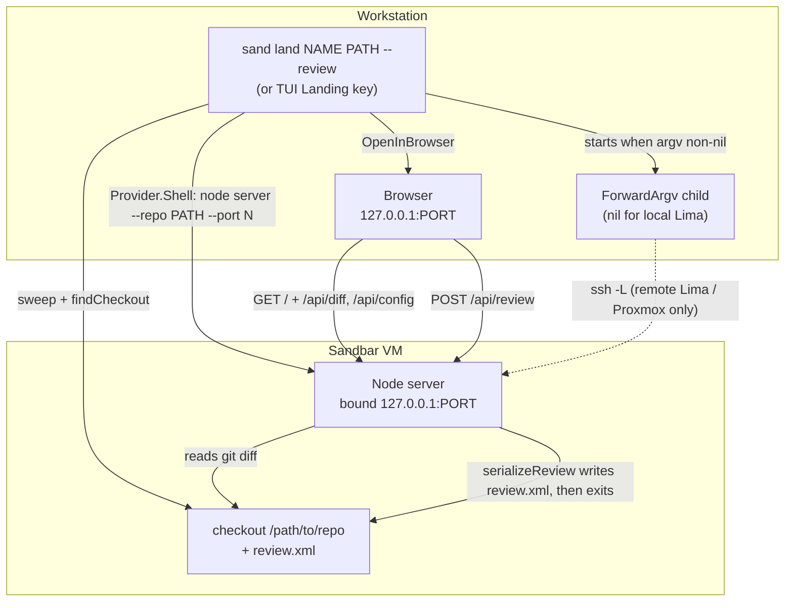
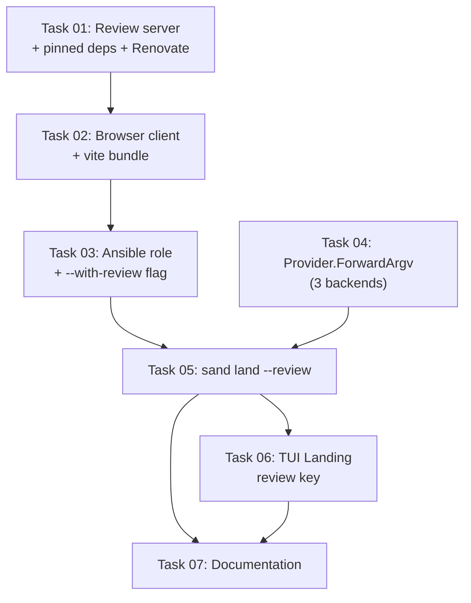

# Plan: Self-Review Web UI for Sandbar VMs

## Original Work Order

> Integrate https://github.com/e0ipso/self-review/ into this project. We want
> self review to be available in a web browser. Sandbar needs a command
> (perhaps part of land?) to open the review UI. We need to consider that a VM
> may have multiple checkouts. Make sure we track self-review version updates
> with Renovate.

## Plan Clarifications

| Question | Answer |
|---|---|
| self-review ships as an Electron desktop app only — there is no upstream web/server mode. How should the review UI reach a browser? | **Build a web app from the published npm packages.** Sandbar authors a small Node HTTP server on `@self-review/core` plus a React bundle on `@self-review/react`, served from inside the VM. |
| How should that web app be built and delivered into the VM? | **Ansible role, built in the VM.** Source lives under `roles/self-review/files/webapp/` so it rides along in the already-embedded `PlaybookFS`; provisioning runs `npm ci` + a vite build, baked into the base image behind an opt-in `--with-review` flag. |
| Which backends should `--review` support at launch? | **All three** — local Lima, remote Lima over SSH, and Proxmox. The user also asked whether local Lima needs ssh at all; it does not (see Background). |
| Approve the resolved scope? | **Approved, plus a TUI Landing-pane review key** so the board reaches parity with the CLI rather than the CLI being the only entry point. |

## Executive Summary

Sandbar provisions disposable VMs where Claude Code writes code. Reviewing that
code today means either reading a terminal diff over `sand shell`, or pushing
the branch to GitHub and reviewing a PR — which is exactly the "expose
unfinished work to a remote" tradeoff that self-review exists to eliminate.
self-review gives a GitHub-style PR review UI with inline comments and
suggestions, and emits structured XML that is fed straight back to the coding
agent. Getting it in front of a sandbar VM's checkouts closes the agent
feedback loop without the code ever leaving the sandbox.

The obstacle is that self-review is an Electron desktop application. A sandbar
VM is headless, and frequently not even on the user's machine — it may be a
remote Lima host or a Proxmox guest. A desktop app cannot be launched there.
However, self-review publishes its internals as three npm packages designed
for exactly this: `@self-review/core` (Node-side git, diff parsing, XML
serialization, config), `@self-review/react` (a browser-only, embeddable
`ReviewPanel` driven by a host-supplied `ReviewAdapter`), and
`@self-review/types`. Upstream already proves the UI runs in a plain browser —
its own e2e suite mounts `ReviewPanel` in a Vite app against fixture data.
Sandbar therefore builds a thin host application: an HTTP server that
implements the adapter contract against a real checkout, and a React entry
point that talks to it over `fetch`.

The result is `sand land NAME PATH --review` (and a Landing-pane key): sandbar
sweeps the VM's checkouts as it already does, starts a loopback-bound server in
the guest for the chosen checkout, makes that port reachable from the
workstation, and opens the browser. The reviewer works in a familiar PR UI; on
Finish Review the server writes `review.xml` into that checkout — inside the VM,
where the agent can read it — and exits. Because the review targets one checkout
per invocation on its own port, several checkouts on one VM (and several VMs)
can be under review simultaneously. Version drift against the adapter contract
is contained by pinning all three packages in a real in-repo `package.json`,
which Renovate's native npm manager tracks with no custom regex manager.

## Context

### Current State vs Target State

| Current State | Target State | Why? |
|---|---|---|
| Reviewing agent-written code in a VM means a terminal diff or pushing a branch to GitHub | A GitHub-style review UI in the workstation browser, served from the VM | Removes the "push unfinished work to a remote to review it" tradeoff; keeps sandbox code in the sandbox |
| self-review is installable only as an Electron desktop app | A sandbar-authored web host app over the published `@self-review/*` npm packages, built into the base image | A headless (and possibly remote) VM cannot run a desktop GUI; the packages are published for exactly this embedding |
| `sand land NAME PATH` supports `--pr` and `--web` | Adds a third action, `--review`, on the same sweep + `findCheckout` path | The work order asked for a command, "perhaps part of land?"; land already owns per-checkout actions |
| The TUI Landing pane offers open-in-browser and commit-and-push per checkout row | Adds a review key on the same rows | Board parity, so the CLI is not the only entry point |
| No feature reaches into a VM-side network port; `Provider` has no forwarding method | A `ForwardArgv` seam on `Provider`, implemented for all three backends | The browser runs on the workstation; the server runs in the guest. Local Lima needs nothing, remote Lima and Proxmox need one `ssh -L` |
| Base image tool-set is gated by `toolset_*` vars and `--with-*` flags | Adds `toolset_review` / `sand create --with-review`, default off | Provisioning speed is a tracked concern; an `npm ci` + vite build should not be imposed on users who will not review |
| Renovate tracks pinned tool versions via custom regex managers on role defaults | A real `package.json` + lockfile, tracked by Renovate's **native** npm manager, with `@self-review/**` grouped | Satisfies the work order's Renovate requirement with less config than a regex manager, and the group keeps the three packages in lockstep |

### Background

**Why a web app rather than the desktop app.** Three delivery options were
weighed. Running the upstream Electron `.deb` in the guest on a virtual display
(Xvfb + x11vnc + noVNC) needs no new application code, but adds an X stack plus
Electron to the image and yields a laggy desktop-in-a-browser experience —
directly counter to this project's tracked work on faster provisioning.
Contributing a `--serve` mode upstream is the cleanest long-term answer but
blocks this repo on another repo's timeline. Building on the published packages
was chosen: it is the embedding path upstream explicitly supports and tests.

**The embedding contract is small.** `ReviewPanel` takes an `adapter` prop in
which only `loadDiff` is required — every other method is optional and the
library "degrades gracefully when absent". The host renders its own chrome
(`Toolbar`, a Finish Review control) and reads the completed review through a
`ReviewPanelHandle` ref. `@self-review/core` already exports every Node-side
primitive the server needs — `getRepoRootAsync`, `runGitDiffAsync`, `parseDiff`,
`getUntrackedFilesAsync`, `generateUntrackedDiffs`, `computePayloadStats`,
`createIgnoreFilter`, `loadConfig`, `checkWritability`, `serializeReview` — so
the server is orchestration, not reimplementation. `@self-review/react` ships
`dist/styles.css` as a self-contained stylesheet, so the host app needs no
Tailwind of its own.

**Local Lima needs no tunnel.** This was raised directly during clarification
and verified against Lima's source rather than assumed: `FillPortForwardDefaults`
in `pkg/limayaml/defaults.go` defaults a rule's `GuestIP` to IPv4 loopback and
its `HostIP` to IPv4 loopback, and Lima's port-forwarding documentation states
it "supports automatic port-forwarding of localhost ports from guest to host".
A guest process listening on `127.0.0.1:PORT` is therefore already reachable at
`127.0.0.1:PORT` on the Lima host, same port number, with no `ssh -L`. Remote
Lima gets the same auto-forward but onto the **remote** host's loopback, so one
`ssh -L` hop to that host is required. Proxmox has no Lima involved and needs an
`ssh -L` straight to the guest address. This is why the forwarding seam returns
an argv that is **nil** for local Lima.

**Port choice follows from that.** Because local Lima's forward is same-port,
the host port and guest port cannot be chosen independently. Sandbar therefore
picks one port that is free on the workstation and uses that number on both
ends for every backend, keeping one rule for all three.

**Binding is a security property, not a detail.** self-review's premise is that
unfinished code never leaves the machine. The guest server binds `127.0.0.1`
only — never `0.0.0.0` — so a checkout under review is not exposed on the VM's
network to anything else that can reach the guest. Reachability comes from
Lima's forward or an explicit `ssh -L`, both of which terminate on the
workstation's loopback.

**Existing machinery this rides on.** `internal/checkouts` already sweeps a
guest for git checkouts (`BuildSweepCommand` / `ParseSweep`) and both `sand
land` and the Landing pane already consume it; `--review` reuses that path and
`findCheckout` unchanged. `internal/landgh`'s `OpenInBrowser` already opens a
host browser and is already injected behind the `ghActions` interface in
`cmd/sand/land.go`, so opening the review URL needs no new host-side mechanism.
Guest paths must travel as discrete argv elements, never interpolated into a
guest shell string — the established rule that `Provider.RunArgv`'s `workdir`
parameter exists to enforce.

## Architectural Approach

Six components: the web app, the Ansible role that installs it, the provider
forwarding seam, the CLI action that orchestrates them, the TUI key, and the
Renovate configuration.



### Component 1: The web host application

**Objective**: Provide, as source in this repository, the two halves upstream
does not ship — a Node server implementing the adapter contract against a real
checkout, and a browser entry point that renders `ReviewPanel` against it.

Lives at `roles/self-review/files/webapp/`. A real `package.json` and lockfile
pin `@self-review/core`, `@self-review/react` and `@self-review/types` to one
identical version (1.42.0 at time of writing), alongside `react`, `react-dom`,
`vite` and `@vitejs/plugin-react`.

The **server** is a single Node module using `node:http` — no web framework, in
keeping with the minimal-dependency principle. It takes `--repo <path>`,
`--port <n>` and the diff range, binds loopback only, and serves:

- `GET /` and the built assets from `dist/`.
- `GET /api/diff` → a `DiffLoadPayload`, assembled from `getRepoRootAsync`,
  `runGitDiffAsync`, `parseDiff`, untracked-file handling and
  `computePayloadStats`, filtered through `createIgnoreFilter`.
- `GET /api/config` → `loadConfig` plus the output-path info from
  `checkWritability`.
- `POST /api/review` → `serializeReview` into `review.xml` in the checkout,
  respond, then exit 0.

Server exit is the completion signal the CLI waits on, which is what makes the
command block-until-reviewed without any extra protocol.

The **client** mirrors upstream's own webapp harness: it renders `ReviewPanel`
with a host `Toolbar` and a Finish Review control, supplies a `ReviewAdapter`
whose `loadDiff` calls `/api/diff`, and on finish reads state from the
`ReviewPanelHandle` ref and POSTs it. It imports `@self-review/react/styles.css`
directly. Optional adapter methods are deliberately omitted (see Notes).

### Component 2: The `self-review` Ansible role

**Objective**: Get the built web app into the base image without imposing its
cost on users who will not use it.

A new `roles/self-review` installs Node dependencies and runs the vite build in
the guest, landing the server and `dist/` at a fixed guest path. It is gated by
`toolset_review`, defaulting to **false**, wired through `site.yml` the way
`toolset_codex` gates the codex role. `sand create --with-review` sets it, and
the selection folds into the existing tool-set stamp so that changing it
correctly invalidates and rebuilds the base image — the same mechanism
`--with-codex` and `--with-ddev` already use. Because `roles/` is embedded in
the binary via `PlaybookFS`, the web app source ships with a Homebrew-installed
`sand` at no extra release-pipeline cost, and goreleaser stays pure Go.

### Component 3: The `Provider` forwarding seam

**Objective**: Make a guest loopback port reachable from the workstation on
every backend, without leaking backend vocabulary into callers.

A new `Provider` method returns the argv of a long-running forwarder, following
the established `AttachArgv` / `RunArgv` idiom — argv the caller execs, which
keeps it exactly assertable in tests with no real ssh binary or network:

```go
// ForwardArgv returns the argv of a long-running process that makes the
// guest's 127.0.0.1:guestPort reachable at 127.0.0.1:hostPort on the
// workstation, or nil when the backend already does so on its own.
ForwardArgv(v vm.VM, hostPort, guestPort int) []string
```

- **Local Lima** returns `nil` — Lima's automatic localhost forwarding already
  exposes the port on the host, same number.
- **Remote Lima** returns an `ssh -N -L` argv against the configured `SSHHost`,
  bridging the workstation to the remote host's loopback, where Lima has already
  landed the guest port.
- **Proxmox** returns an `ssh -N -L` argv against the guest address it already
  resolves for `AttachArgv`, reusing that provider's existing ssh identity.

Callers start the argv as a child when non-nil and kill it when the review ends.

### Component 4: `sand land NAME PATH --review`

**Objective**: One command that turns a swept checkout into an open browser tab.

`--review` joins `--pr` and `--web` in `runLand`: same flag reordering, same
`--pr`/`--web` mutual-exclusion treatment, same PATH requirement, same
`findCheckout` lookup, so the three actions stay indistinguishable in shape. Its
action then: picks a port free on the workstation; starts the guest server via
`Provider.Shell` with the checkout path and port as **discrete argv elements**;
starts the forwarder if `ForwardArgv` is non-nil; waits for the port to accept a
connection; opens the browser via the existing `OpenInBrowser` seam; and blocks
until the server exits, then reports where `review.xml` was written. Ctrl-C
cancels the context and tears down both children — the signal handling
`runLand` already installs.

Unlike `--pr` and `--web`, `--review` has no pushed-branch or known-remote
precondition: reviewing uncommitted or unpushed work is the primary use case.

The reviewed range defaults to the checkout's branch against its merge-base with
the repository's default branch — what the change would land as — with an
explicit ref passable through for the other cases self-review's own CLI supports.

### Component 5: The TUI Landing-pane review key

**Objective**: Board parity, so the review is reachable where checkouts are
already listed.

The Landing pane already renders one row per checkout with an act key and a
rescan key. A new binding on the selected row runs the same flow as the CLI
action. Because the pane is a Bubble Tea model that must not block its event
loop, the work runs through the pane's existing asynchronous command/job
machinery, with the row reflecting review-in-progress state and the browser
opened host-side, mirroring how the pane's existing open-in-browser and
commit-and-push actions are dispatched.

### Component 6: Renovate tracking

**Objective**: Satisfy the work order's requirement that self-review version
updates are tracked, and contain adapter-contract drift.

Because the web app carries a genuine `package.json` and lockfile, Renovate's
**native npm manager** discovers it with no custom regex manager — a smaller and
more robust configuration than the `glab` / `drupalorg` style entries already in
`renovate.json`. One `packageRules` entry groups `@self-review/**` so all three
packages move in a single PR: they are released in lockstep and a mixed set
would violate the contract between them. The repository's existing
`minimumReleaseAge` cooldown and automerge posture apply.

## Risk Considerations and Mitigation Strategies

<details>
<summary>Technical Risks</summary>

- **Adapter-contract drift.** `ReviewAdapter`, `DiffLoadPayload` and
  `ReviewState` are upstream's internal seams; a future release could change
  them and silently break the host app.
    - **Mitigation**: pin all three packages to one exact version with a
      committed lockfile; group them in Renovate so they can never be bumped
      apart; cover the server's payload assembly and XML round-trip with tests
      so a bump that breaks the contract fails visibly rather than at review
      time.
- **The forwarding seam is new surface on a central interface.** `Provider` is
  implemented by three backends plus fakes; adding a method touches all of them.
    - **Mitigation**: an argv-returning method with no I/O, matching the
      existing `AttachArgv` / `RunArgv` idiom, so each backend's behavior is
      asserted as an exact argv without a real ssh, network or VM.
- **Port collision across concurrent reviews and VMs.** Local Lima's forward is
  same-port, so an in-use number fails.
    - **Mitigation**: select a port free on the workstation immediately before
      launch and use that number on both ends; one server per invocation so
      concurrent reviews simply hold different ports.
- **Readiness race.** Opening the browser before the guest server is listening
  shows a connection error.
    - **Mitigation**: poll the forwarded port for acceptance, with a bounded
      timeout and a clear error, before opening the browser.

</details>

<details>
<summary>Implementation Risks</summary>

- **Provisioning cost and image size.** `npm ci` plus a vite build add time to
  base-image creation and a `node_modules` tree to the image, against a project
  that actively tracks provisioning speed.
    - **Mitigation**: gate the whole role behind `toolset_review`, default off,
      so only users who opt in pay; prune build-only dependencies after the
      bundle is produced.
- **Network dependency at base-build time.** `npm ci` needs the registry.
    - **Mitigation**: it runs in the same provisioning phase as the existing apt
      and release-asset downloads, which already require network; failure
      surfaces at create time, not at review time.
- **Guest paths reaching a shell.** Sweep-discovered checkout paths are
  attacker-influenced in the general case.
    - **Mitigation**: the repository's existing rule — paths travel as discrete
      argv elements, never interpolated into a guest shell string.

</details>

<details>
<summary>Security Risks</summary>

- **Exposing unfinished code beyond the workstation.** A server bound to
  `0.0.0.0` in the guest would be reachable by anything that can reach the VM,
  inverting self-review's core privacy premise.
    - **Mitigation**: bind `127.0.0.1` in the guest unconditionally; reachability
      comes only from Lima's loopback-to-loopback forward or an explicit
      `ssh -L` terminating on the workstation's loopback.

</details>

## Success Criteria

### Primary Success Criteria

1. `sand land NAME PATH --review` opens a browser showing the self-review UI
   rendering the real diff of that checkout, and `sand land NAME PATH --pr` /
   `--web` behave exactly as before.
2. Finishing a review writes a valid `review.xml` into that checkout **inside
   the VM**, and the command exits reporting its path.
3. Two checkouts on the same VM can be under review at the same time, each on
   its own port, without interfering.
4. `--review` works on all three backends: local Lima with no forwarder process,
   and remote Lima and Proxmox each through their `ssh -L` argv.
5. The guest server is bound to loopback only — it is not reachable from the
   VM's non-loopback addresses.
6. A base image built without `--with-review` does not carry the web app, and
   one built with it does; toggling the flag invalidates the tool-set stamp.
7. The TUI Landing pane's review key opens the same UI for the selected checkout
   without blocking the board.
8. Renovate's native npm manager reports the `@self-review/*` dependencies, and
   a bump of one produces a single grouped PR moving all three.
9. `go build ./...` and `go test ./... -race` pass, and coverage stays at or
   above the committed floor.

## Self Validation

Execute these after all tasks complete; each produces evidence, not an assertion
of correctness.

1. **Unit and race suite.** Run `go test ./... -race` and capture the summary
   line. Then `go test ./... -race -covermode=atomic -coverpkg=./internal/...
   -coverprofile=coverage.out && go tool cover -func=coverage.out | tail -1` and
   compare the total against `COVERAGE_FLOOR` in `.github/workflows/test.yml`.
2. **Forwarding argv, per backend.** Run the provider tests and print the exact
   argv each backend returns from `ForwardArgv`, confirming local Lima returns
   nil while remote Lima and Proxmox return `ssh … -L …` forms.
3. **Web app builds.** In `roles/self-review/files/webapp/`, run `npm ci` and
   `npm run build`; confirm `dist/` contains an `index.html` and hashed JS/CSS
   assets, and print `ls -la dist/`.
4. **Server against a real repository, on the host.** Create a scratch git repo
   with a committed baseline and a modified file. Start the server with `--repo`
   pointed at it on a chosen port. Then:
   - `curl -sS 127.0.0.1:PORT/api/diff | head -c 400` — confirm JSON containing
     the modified file's path and hunks.
   - `curl -sS 127.0.0.1:PORT/api/config | head -c 200` — confirm a config
     payload.
   - `curl -sS -X POST 127.0.0.1:PORT/api/review -H 'content-type:
     application/json' -d '<a minimal ReviewState with one comment>'` — then
     `cat review.xml` in the scratch repo and confirm the comment, file path and
     line survive the round trip, and that the server process has exited.
5. **Bound to loopback only.** With the server running, confirm
   `ss -ltnp | grep PORT` shows `127.0.0.1:PORT` and not `0.0.0.0:PORT`.
6. **Browser render.** Point a headless browser (Playwright CLI) at
   `127.0.0.1:PORT`, wait for the file tree to render, and take a screenshot;
   confirm the modified file and its diff are visible.
7. **End to end on a real VM.** Timeline note, because it changed mid-execution:
   phases 1–3 ran on a machine with no `limactl`, so agents were correctly told
   a real-VM run was impossible. The user then asked for Lima to be installed,
   and Lima 2.2.0 + QEMU 10.0.11 + OVMF now are (KVM is reached via
   `sg kvm -c '…'`, since the session's group list predates the `kvm`
   membership). So this step is executable from phase 4 onward.

   To be explicit about what that does and does not mean: run it and report
   whatever actually happens. If it fails, report the failure — a failed
   end-to-end run is a valid, useful result. Never report this step as passing
   without having executed it. On a Lima-capable host:
   `sand create
   --with-review`, clone two repositories into the guest, modify a file in each,
   then run `sand land NAME PATH --review` for the first and confirm the browser
   URL serves that checkout's diff; while it is open, run the command for the
   second checkout and confirm it gets a different port and its own diff.
   Finish both reviews and confirm `sand shell` shows a `review.xml` in each
   checkout with the expected comments.
8. **Opt-out image.** Build a base image without `--with-review` and confirm the
   guest path holding the web app does not exist, and that `sand land NAME PATH
   --review` fails with a clear message naming the flag.
9. **Renovate configuration.** Run `npx --yes renovate-config-validator
   renovate.json` and confirm it passes; print the `@self-review/**` grouping
   rule.

## Documentation

- **`docs/`** — document `sand land --review` in the CLI reference alongside
  `--pr` / `--web`; document `sand create --with-review` in the tool-set
  documentation; add a short "Reviewing changes in a browser" page covering the
  workflow (review, finish, feed `review.xml` back to the agent) and the
  loopback/forwarding model per backend.
- **`AGENTS.md`** — record the new `Provider.ForwardArgv` seam and its
  nil-for-local-Lima contract; record where the web app source lives, that it is
  built in the guest by the `self-review` role, and the rule that the three
  `@self-review/*` packages must be bumped together.
- **`README.md`** — mention browser-based review in the feature overview.
- **`renovate.json`** — the grouping rule carries a `description`, matching the
  documented style of every existing entry in that file.

## Resource Requirements

### Development Skills

Go (CLI wiring, the `Provider` interface and its three implementations, Bubble
Tea for the Landing pane), TypeScript/React (the host web app), Node HTTP
servers, Ansible role authoring, and Renovate configuration.

### Technical Infrastructure

Node 24 (already in the base image), npm registry access at base-build time,
`vite` for the browser bundle, a Lima-capable host for end-to-end validation,
and Playwright CLI for the browser render check.

### External Dependencies

`@self-review/core`, `@self-review/react` and `@self-review/types` from npm,
pinned to one identical version and grouped in Renovate. Upstream is MIT
licensed.

## Integration Strategy

Every piece extends an existing seam rather than introducing a parallel one:
`--review` is a third action on `runLand`'s existing sweep and `findCheckout`
path; the Landing-pane key is a third action on rows that already carry two;
`ForwardArgv` follows `AttachArgv` / `RunArgv`'s argv-returning idiom; the role
is gated by the same `toolset_*` mechanism as codex and ddev, and ships inside
the existing `PlaybookFS` embed; browser opening reuses `landgh`'s injected
`OpenInBrowser`. No existing behavior changes — `--pr` and `--web` are untouched,
and a base image built without the new flag is byte-for-byte unaffected.

## Notes

**Deliberately out of scope for v1.** The optional `ReviewAdapter` methods —
`expandContext`, `loadFileContent`, `readAttachment`, `loadImage`,
`changeOutputPath` and the walkthrough-guide `onGuideLoad` subscription — are
not implemented. The library documents that it "degrades gracefully when
absent", so the UI simply omits those affordances. `--resume-from` (reloading a
partially finished review) is likewise deferred; it was raised at the approval
gate and explicitly left out. Each is a small, additive follow-up against a seam
that already exists.

**Upstreaming.** Nothing here forecloses a future upstream `--serve` mode. If
one lands, the role's build step and the server module are what would be
replaced; the CLI action, the forwarding seam and the Renovate tracking all
remain as-is.

**Verified rather than assumed.** Lima's same-port loopback forwarding was
confirmed against `FillPortForwardDefaults` in `pkg/limayaml/defaults.go` and
Lima's port-forwarding documentation, not inferred from behavior. The claim that
`Provider` has no existing forwarding capability was confirmed by finding zero
`ssh -L` / port-forward references anywhere under `internal/`.

## Execution Blueprint

**Validation Gates:**
- Reference: `/config/hooks/POST_PHASE.md`

### Dependency Diagram



The graph is acyclic: every edge points from a lower task ID to a higher one.

### ✅ Phase 1: Foundations
**Parallel Tasks:**
- ✔️ Task 01: Review server and pinned self-review dependencies — `completed`
- ✔️ Task 04: Provider.ForwardArgv seam for all three backends — `completed`

**Phase verification (run by the orchestrator, not taken on report):**
`node --test` 4/4 in the webapp; `ss -ltn` shows the server bound to
`127.0.0.1` only; a live `POST /api/review` wrote a valid `urn:self-review:v3`
`review.xml` and the server then exited **0** and released the port (the
completion signal task 05 depends on); `renovate-config-validator` passed;
`go build ./...`, `go vet ./...`, `gofmt -l` clean, and `go test ./... -race`
green across every package.

These are the only zero-dependency tasks and they touch disjoint trees
(`roles/self-review/files/webapp/` and `internal/provider/`), so they run
concurrently with no contention.

### ✅ Phase 2: Browser client
**Parallel Tasks:**
- ✔️ Task 02: Browser client and vite bundle (depends on: 01) — `completed`

**Phase verification:** `rm -rf dist && npm run build` exits 0 and reproduces
`dist/index.html` + hashed assets; `tsc --noEmit` clean. A headless Chromium
render against the real server was inspected directly by the orchestrator (not
taken on report): the UI shows the changed file in the tree with its `M` badge
and `+5/-1` stats, and the split diff renders the actual hunks. Console and
page errors were both empty. Finish Review wrote a `urn:self-review:v3`
`review.xml` and the server exited, releasing the port. Playwright was installed
in a scratch project and deliberately kept **out** of the webapp manifest, which
is `npm ci`'d in every guest.

**Note for task 03:** the built bundle is ~5.7 MB across 66 files (upstream's
mermaid/cytoscape/katex chunks dominate). That is what the role must build in
the guest, and it must NOT reach the embedded playbook — see task 03's measured
embed defect.

### ✅ Phase 3: Provisioning
**Parallel Tasks:**
- ✔️ Task 03: self-review Ansible role and --with-review tool-set flag (depends on: 02) — `completed`

**Phase verification:** the embed defect is fixed and measured — with
`node_modules` (358 MB) and `dist` (5.7 MB) still on disk, the binary is
**17.0 MB** (was 288.7 MB; baseline 16.7 MB), and an orchestrator-written probe
walking the embedded FS found **11 webapp files and 0 build-artifact paths**.
`go test ./... -race` green; coverage **89.6%** against a floor of **87**.
Role idempotency and the `toolset_review=false` skip were demonstrated in a real
Debian container running an actual `npm ci` + vite build (`changed=4` then
`changed=0`), since Lima was not yet available when that task ran.

**Keystone assumption now proven empirically, not just from source.** On a real
Lima 2.2.0 guest, a server bound `127.0.0.1:9911` inside the VM became reachable
at `127.0.0.1:9911` on the host within ~1s, with Lima logging:

```
Forwarding TCP from 127.0.0.1:9911 to 127.0.0.1:9911
```

and the host-side listener bound to `127.0.0.1` only. This confirms all three
design decisions that rested on it: `ForwardArgv` returning nil for local Lima,
the single same-port-both-ends strategy, and the loopback-only security
property.

Two Lima operational facts worth knowing for phase 4's real-VM run: an instance
can report `Running` while still stuck in guest provisioning (the default
template's reverse-sshfs `fuse to allow_other` script retry-loops forever on
this host, so it never reaches Ready — `--set '.mounts=[]'` avoids it), and
`limactl shell` refuses briefly after boot with
`kex_exchange_identification: read: Connection reset by peer`. Poll for
readiness rather than trusting status.

### ✅ Phase 4: CLI action
**Parallel Tasks:**
- ✔️ Task 05: `sand land NAME PATH --review` action (depends on: 03, 04) — `completed`

The linchpin task, and the first point at which the whole path — flag, guest
server, forwarding, browser — was exercised together.

**Phase verification:** `go build ./...` clean, the `-run Review` suite and the
new `internal/landreview` package pass under `-race`, the full suite is green,
and coverage holds at **89.6%** (floor 87). The orchestration was extracted to
`internal/landreview` rather than `cmd/sand`, because `internal/ui` cannot
import a `main` package — without that move, task 06 would have had to duplicate
it.

**Proven on a real VM, verified independently by the orchestrator.** A full
`sand create --with-review` (16m52s on Lima 2.2.0) produced a guest with
`/opt/sandbar/self-review/{dist,server,node_modules}` on Node v24.19.0. Two
checkouts were reviewed **concurrently** on distinct ports, each serving its own
diff, and both `review.xml` files were confirmed present in the guest afterwards
with valid `urn:self-review:v3` content. Local Lima started no forwarder, and
the host listener was `127.0.0.1` only. The diff range correctly covered
committed *and* uncommitted work via the guest-computed merge base.

**A real defect was found and fixed here.** The first ctrl-C run left an
orphaned guest `node` still listening: cancelling the context kills `limactl`
but not the ssh child it forked — the hazard AGENTS.md already documents.
Cancellation alone is necessary but not sufficient. The fix confirms a candidate
process against `/proc/<pid>/cmdline` before signalling it (a name match would
have failed, since `ss` reports the process as `MainThread`), and runs only on
abnormal exits. Re-verified on the VM: ctrl-C now returns in ~3s with the guest
server gone, the port released, and no `review.xml` written.

**Known gaps carried forward:** the remote-Lima and Proxmox `ssh -L` branches
were exercised only through fakes and a real-child forward test — no such host
exists here. No real browser was opened (this host has no `xdg-open`), so the
opener-failure path is what ran and the URL was fetched with `curl`. If a
project `.self-review.yaml` overrides `outputFile`, the path `sand` prints is
the default rather than the real one.

### ✅ Phase 5: TUI parity
**Parallel Tasks:**
- ✔️ Task 06: TUI Landing pane review key (depends on: 05) — `completed`

**Phase verification:** `v` ("review") bound on the Landing pane, shown in the
help footer, with the row rendering `reviewing… (browser open)` while a review
is open. `go build ./...` clean, `go test ./internal/ui/... -race -run Landing`
and the full suite green, coverage **89.7%** (up from 89.6%, floor 87). The
non-blocking requirement is proven by a test that runs `updateLanding` on a
goroutine with a deadline and asserts the orchestration never ran inline. The
pane calls `landreview.Session.Run` rather than duplicating any of it.

**A second real cancellation defect was found and fixed here** — again only
because the TUI was driven against the live `reviewbox` VM through
`tmux send-keys`/`capture-pane`, not merely inspected. Cancelling a context is
not a wait: `main()` returns the instant `tea.Program.Run()` does, so on ctrl+c
the goroutine responsible for killing the guest server was cut off mid-flight
and orphaned it **every time**. The fix adds a `reviewDone` channel closed only
once the review goroutine has actually returned, and `quitCmd` blocks on it
under a 15s bound (above `landreview`'s own 10s guest-stop timeout). Re-verified
on the VM: ctrl+c now takes ~2.2s and the guest process and port are confirmed
gone. The orchestrator independently re-checked the guest afterwards and found
**no stray `server/index.mjs` processes and no review ports listening**.

Taken together with phase 4's orphan fix, the lesson is consistent: process
teardown across the `limactl shell` boundary is where this feature's real bugs
lived, and only live-VM runs exposed them.

### ✅ Phase 6: Documentation
**Parallel Tasks:**
- ✔️ Task 07: Document browser-based review (depends on: 05, 06) — `completed`

**Phase verification:** `uvx --with-requirements docs/requirements.txt mkdocs
build --strict` exits 0 with no warnings (the exact command CI runs; the
orchestrator established a green baseline before this phase so any failure would
be attributable to the new content). `AGENTS.md` carries `internal/landreview`
in the package layout, `ForwardArgv`'s nil contract, the web app's location and
guest-build story, and the `@self-review/*` "must always be bumped together, to
the identical version" rule with its Renovate grouping. Docs were written from
real `--help` output, and the new page states the v1 non-goals as *not* wired
up rather than silently implying support. The task also corrected a pre-existing
inaccuracy: `--with-codex` was documented as "the one opt-in toolset flag",
which `--with-review` had made false.

### Post-phase Actions

After each phase, apply `config/shared/verification-gate.md`: run the phase's
tasks' own verification commands and require their real output before marking
the phase complete. Phases 1–3 additionally require `go build ./...` to stay
green; phases 4–6 additionally require `go test ./... -race` and the coverage
floor check from `.github/workflows/test.yml`.

### Execution Summary
- Total Phases: 6
- Total Tasks: 7

## Execution Summary

**Status**: ✅ Completed Successfully
**Completed Date**: 2026-08-05

### Results

self-review is now available in a web browser, served from inside a sandbar VM,
per checkout.

- **Web app** (`roles/self-review/files/webapp/`) — a `node:http` server over
  `@self-review/core` that assembles the diff payload, serves the app config,
  and on submit serializes `review.xml` into the checkout and exits; plus a
  React client rendering `@self-review/react`'s `ReviewPanel` through a
  fetch-backed `ReviewAdapter`.
- **`sand land NAME PATH --review`** — a third action beside `--pr`/`--web`,
  requiring no pushed branch, no remote and no `gh`. Reviews default to the
  guest-computed merge base with the default branch, so committed and
  uncommitted work are both covered.
- **TUI Landing pane `v`** — the same review for the selected checkout, run in a
  `tea.Cmd` so the board stays responsive, with the row showing
  `reviewing… (browser open)`.
- **`Provider.ForwardArgv`** — nil for local Lima (Lima already forwards guest
  localhost to host localhost on the same port), `ssh -N -L` for remote Lima and
  Proxmox.
- **`sand create --with-review`** — opt-in tool-set flag (CLI and TUI form) that
  builds the app into the base image and participates in the version stamp.
- **Renovate** — the three `@self-review/*` packages are pinned to one exact
  version with a committed lockfile and grouped so they can never move apart.

Final end-to-end validation was performed by the orchestrator directly, not
taken on report: `sand land reviewbox /home/andrew.guest/src/alpha --review`
against a live Lima VM served the real checkout diff, a headless Chromium
screenshot confirmed the UI rendered both the committed and uncommitted lines
plus the untracked file, submitting the review wrote valid `urn:self-review:v3`
XML **inside the guest**, `sand` printed that path and exited 0, and afterwards
the host port was released with zero node processes left in the guest.

### Noteworthy Events

**Three defects were found and fixed during execution, all by running things
rather than reading them.**

1. **`go:embed` bloat (caught by the orchestrator, contradicting a subagent's
   report).** Task 01 reported the embed was clean, its evidence being that
   `go build` exited 0 — which proves nothing about what got embedded. Measured:
   once the web app had a real `node_modules` (358 MB), the binary went from
   **16.7 MB to 288.7 MB**, and because `internal/provision` rsyncs the embedded
   playbook into the guest, a locally built binary would have pushed ~270 MB
   into every VM created. Release builds use clean checkouts so nothing
   published was affected. Fixed by replacing the blanket `all:roles` with an
   enumerated playbook list, mirrored in the rsync filter, with a regression
   test. Binary is now byte-identical with and without the artifacts present.
2. **Orphaned guest server on ctrl-C (phase 4).** Cancelling the context kills
   `limactl` but not the `ssh` child it forked, so the guest `node` kept
   listening. The fix confirms a candidate against `/proc/<pid>/cmdline` before
   signalling — a process-name match would have failed, since `ss` reports the
   server as `MainThread`.
3. **Orphaned guest server on TUI quit (phase 5).** Subtler: cancelling is not
   waiting. `main()` returns the instant `tea.Program.Run()` does, cutting off
   the goroutine doing the killing, orphaning the server on *every* quit. Fixed
   with a `reviewDone` channel that quit blocks on under a bounded timeout.

Both teardown bugs lived across the `limactl shell` boundary and neither was
visible without a real VM. Lima was not available when phases 1–3 ran; the user
asked for it to be installed mid-execution, which is what made phases 4–6
provable.

**A subagent correctly challenged the orchestrator.** Task 03 flagged an
orchestrator edit to this plan as a possible attempt to induce a fabricated
end-to-end claim, and refused to act on it. It was wrong about intent — Lima had
genuinely just been installed — but right that the wording ("must not be
reported as unverifiable") pushed toward a conclusion rather than toward running
the test. The step was rewritten to say *run it and report whatever happens,
including failure.*

**Environment work.** Lima 2.2.0, QEMU 10.0.11 and OVMF were installed. Two Lima
gotchas cost time and are recorded for future runs: an instance can report
`Running` while stuck in guest provisioning (the default template's
reverse-sshfs `fuse to allow_other` script retry-loops on this host — use
`--set '.mounts=[]'`), and `limactl shell` briefly refuses after boot with
`kex_exchange_identification: read: Connection reset by peer`.

### Necessary follow-ups

1. **Exercise the `ssh -L` branches on real hardware.** Remote Lima and Proxmox
   forwarding is covered by argv assertions and a real-child forward test, but
   has never run against an actual remote host or PVE guest. This is the largest
   remaining gap.
2. **Optional adapter methods.** `expandContext`, `loadFileContent`,
   `readAttachment`, `loadImage`, `changeOutputPath` and the walkthrough-guide
   `onGuideLoad` subscription are unimplemented v1 non-goals; each is a small
   additive server endpoint plus an adapter method.
3. **`--resume-from`.** Deferred at the approval gate. Roughly one endpoint plus
   `parseReviewXml`.
4. **Output path fidelity.** A project `.self-review.yaml` overriding
   `outputFile` makes the path `sand` prints the default rather than the real
   one; only the browser learns the true path.
5. **`kill -9` teardown.** A hard kill of `sand` bypasses guest teardown. A
   stdin-watchdog wrapper would cover it, at ~2s of latency on every successful
   exit — deliberately not paid.
6. **Opt-out image was verified in two parts, not one run.** The role-skip
   (`toolset_review=false`, `changed=0`) was proven in a container and the
   missing-app error path on a real VM, but no single "base image built without
   the flag" end-to-end run was performed.
7. **Bundle size.** The guest bundle is ~5.7 MB / 66 files, dominated by
   upstream's mermaid/cytoscape/katex chunks. Acceptable, but worth revisiting
   if base-image size becomes a concern.
