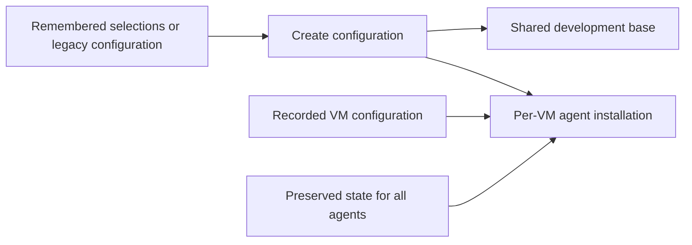
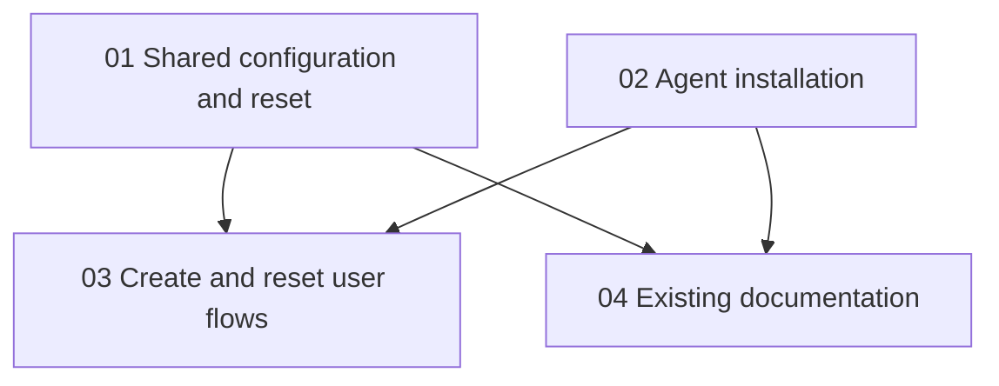

# Plan: Generic Coding Agent Support

## Original Work Order

> In a new worktree, run /st-full-workflow make our coding agent support generic. Since coding agents update all the time, we should move them out of the base image and to when individual VMs are created. The user should be able to select claude code, codex, opencode, and pi as checkboxes. We should remember the user's last selections. Then, when resetting a vm, we should instead of offering to preserve claude code settings only, we should have a single checkbox that preserves the settings and files for any of the 4 harnesses.

## Plan Clarifications

| Question | Answer |
| --- | --- |
| Is configuration migration required? | “We need to migrate configuration.” |

## Executive Summary

Make Claude Code, Codex, OpenCode, and Pi independently selectable per VM. Install selected agents during clone finalization (and standalone full provisioning), leaving the shared base responsible for stable development dependencies. Remember the last submitted selection for subsequent creates, including an explicitly empty selection.

Migrate existing Claude/Codex selections from recorded configurations and legacy base stamps without losing explicit opt-outs. Reset replays the VM's recorded agent selection, with one checkbox preserving all four agents' user state. Cover local Lima, remote Lima, and Proxmox through their existing seams.

## Context

### Current State vs Target State

| Current state | Target state | Why |
| --- | --- | --- |
| Claude and Codex are base tools | Four agents installed per VM | New VMs get current agent releases |
| Create choices inherited from base stamp | Separate persisted last agent selection | Agent choices must not change the shared base |
| Reset preserves only Claude state | One preserve-agent-state checkbox | Equivalent protection for all supported agents |
| Config stores Claude/Codex booleans | Existing values remain readable with new selections added | User explicitly requires migration |

### Background

Existing configurations are stored in the managed registry and provider provenance. Base stamps also encode old agent choices. Creation and reset pass a common CreateConfig through Lima and Proxmox providers. No existing reset preference is persisted; preserve toggles currently default off.

## Architectural Approach

### Agent selections and migration

Keep existing Claude/Codex boolean fields readable, add OpenCode/Pi selections, and distinguish base-tool identity from agent selection. Store last create selections in a small host preference file shared by CLI and TUI. Seed absent preferences from legacy base stamps where available; never interpret a modern agent-free base stamp as the user's request for no agents. Existing VM configurations remain the authority for reset. Explicit flags and form edits win over inherited defaults and late asynchronous reads.

### Installation lifecycle

Run selected agent roles in finalize/full only, using official installation sources. Keep runtimes in the base where appropriate. Remove legacy installed agent artifacts from a converged old base so deselected agents do not leak into future clones. Update both provider paths and standalone provisioning as needed; preserve base locking and host isolation.

### Reset preservation

Use one common list of supported home-relative agent state paths for both provider implementations. Preserve Claude state, Codex state, OpenCode configuration/data/state, and Pi's agent directory, including credentials and sessions. Restore without replacing preserved user settings with generated defaults. Missing optional directories must be harmless. Continue using private temporary archives and existing cleanup behavior.

## Risk Considerations and Mitigation Strategies

Technical Risks

- Legacy base images can retain deselected agents: remove old artifacts during base convergence and verify the cleanup path.
- Agent archives contain credentials: retain private permissions, existing cleanup guarantees, and the reset disclosure.
- A late base lookup can overwrite edits: isolate agent preference migration from ordinary base-tool updates and guard edited selections.
- Optional missing state paths can break reset: exercise staging with absent directories and real archive extraction.

Implementation Risks

- More checkbox rows can hide the form footer: verify focused rows and submission help fit an 80x24 terminal.
- Provider implementations can drift: test both Lima and Proxmox finalize/reset boundaries.
- External installers change: verify official installation and state-directory documentation during implementation.

## Success Criteria

### Primary Success Criteria

1. Create offers independent checkboxes for Claude Code, Codex, OpenCode, and Pi, remembers submitted choices across sessions, and permits none selected.
2. Fresh bases contain no coding agents; selected agents are installed during each VM's creation/reset finalization, independent of the base tool key.
3. Existing configuration and legacy choices migrate without losing explicit false values or overwriting newer preferences.
4. Reset retains the VM's selections and one checkbox preserves settings, credentials, sessions, and other user state for all four agents.
5. Headless create, TUI, and all provider paths agree; meaningful tests pass and current documentation describes the new behavior.

## Self Validation

- Exercise the create/reset forms through terminal integration tests at 80x24, toggle agent selections, reopen the form from persisted preferences, and inspect updated snapshots including footer visibility.
- Use temporary on-disk fixtures containing legacy base stamps and VM configuration; load/migrate/save/reload and inspect resulting JSON plus generated finalize variables.
- Stage and restore marker files and mode-0600 credentials for all four agents through the actual archive commands against a temporary guest-home fixture; verify bytes and modes and behavior with missing paths.
- Run Ansible syntax and phase task-list checks for base/finalize with all selections enabled and disabled; inspect installer gating and legacy cleanup. Run a disposable real VM if the environment has a usable provider; otherwise record that boundary as untested without claiming live installation success.
- Run go vet, the Go race suite with internal coverage, formatting checks, and the strict documentation build.

## Documentation

Update existing create/reset, tooling, state, and provisioning documentation where behavior changes. Update AGENTS.md's product description and lifecycle guidance. No new documentation system is needed.

## Resource Requirements

### Development Skills

Go domain modeling and migration, Bubble Tea UI, Ansible provisioning, integration testing.

### Technical Infrastructure

Existing Go, Ansible, MkDocs/uv tooling; official agent installation documentation. Implementation occurs on feat/generic-coding-agents in /home/andrew/github.com/Lullabot/sandbar-generic-agents.

## Execution Blueprint

**Validation Gates:** .ai/strikethroo/config/hooks/POST_PHASE.md and config/shared/verification-gate.md.

### Dependency Diagram

### ✅ Phase 1: Shared configuration and installation
**Status:** completed
**Parallel Tasks:**
- ✔️ Task 01: Separate agent configuration and migrate reset state — completed
- ✔️ Task 02: Install selected agents during VM finalization — completed

### ✅ Phase 2: User flows and documentation
**Status:** completed
**Parallel Tasks:**
- ✔️ Task 03: Wire remembered agent checkboxes into create and reset (depends on: 01, 02) — completed
- ✔️ Task 04: Update existing documentation for generic agents (depends on: 01, 02) — completed

### Post-phase Actions

Independently verify each phase, update statuses, and create a conventional commit. Run the full verification and self-validation before archival.

### Execution Summary
- Total Phases: 2
- Total Tasks: 4

### Execution Environment

The workflow's Claude model labels and st-worker agents are unavailable in this Codex harness. General-purpose agents inherit the session model and reasoning effort as the supported fallback; rubric tiers remain recorded in task metadata. No limactl is currently on PATH; live-VM verification availability will be checked before final validation.

### Phase 1 verification

Parent independently ran the core Go suite with `-count=1` (vm, agentprefs, provision, provider, registry): all pass. Ansible syntax passes; the actual Ansible fixture suite passed all three tests in 58.569s (phase selection, preserved settings/installer refresh, base cleanup/bashrc migration). Formatting and diff whitespace checks pass. A temporary-prefix npm installation of the two new agents succeeded; isolated version commands returned OpenCode 1.18.32 and Pi 0.87.0. This does not establish real-VM boot/provisioning behavior.

### Phase 2 verification

Parent independently ran the complete Go suite with `-race -covermode=atomic -coverpkg=./internal/... -count=1`: all packages pass, with 90.3% internal coverage (CI floor raised from 87% to 90%). Fresh `go vet ./...`, `go build ./cmd/sand`, `gofmt -l .`, and `git diff --check` pass. The limae2e-tagged suite compiles with `-run '^$'`; no live VM was started. The strict MkDocs build passes. Ansible syntax and all three actual Ansible fixture tests pass (78.805s); the preserved-settings test additionally verifies private mode 0600 survives role reapplication. Reviewed create/reset/error snapshots fit 80x24. The new terminal persistence/reset and async generation tests pass five repeated race-enabled runs. Added CI checks cover all four executables in clones, no agent executables in the base, and remembered selections on the next create.

## Execution Summary

**Status**: ✅ Completed Successfully
**Completed Date**: 2026-09-21

### Results

Claude Code, Codex, OpenCode, and Pi are independent per-VM selections with shared CLI/TUI preferences, including an explicitly empty selection. Selected agents install current releases during full/finalize provisioning, not base creation. Legacy base-agent installs are removed during base convergence. Existing Claude/Codex configuration migrates without losing false values. Reset replays recorded VM choices and one checkbox preserves the state of all four agents through private archives. Updated documentation, real Ansible fixtures, terminal/provider-boundary tests, and CI smoke checks cover the new behavior. Implementation commits: `c548448` and `5b1adc3`.

### Noteworthy Events

- Official installation verification found Pi's package had moved to `@earendil-works/pi-coding-agent`; the old package is deprecated. Temporary-prefix installation/version checks succeeded for OpenCode and Pi; temporary downloads were removed afterward.
- A regression test exposed Proxmox's template-generation suffix in old base stamps masking the final tool name. The parser now separates that metadata, preserving Codex-only migration.
- Server maintenance restarted the app and changed sandbox permissions. Worktree and commits remained intact. The parent resumed verification and completed a worker's blocked final patch after full access was restored; no work was lost.
- Reviewed snapshots keep create/reset help and warnings visible at 80x24. Preserved settings retain their bytes and mode 0600.
- Final Go race coverage is 90.3%; the CI floor is now 90%. The original main worktree remains clean.

### Necessary follow-ups

Run the added Lima CI smoke checks on a PR or an explicitly requested workflow dispatch. This environment has no usable Lima/QEMU installation, so real VM boot, installation, and reset were not exercised locally; the tagged e2e tests only compiled. No branch was pushed and no PR or external CI run was created by this workflow.
