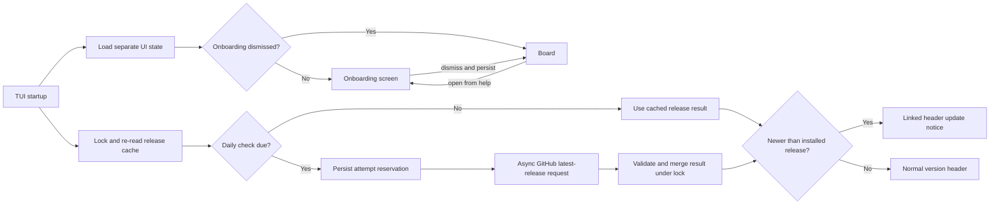
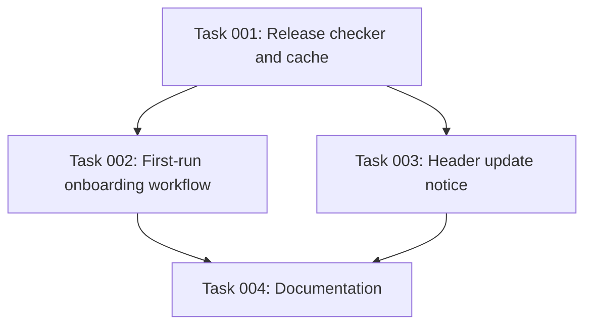

# Plan: First-run onboarding and release update notices

## Original Work Order

> [$st-create-plan](/home/andrew/github.com/Lullabot/sandbar/.agents/skills/st-create-plan/SKILL.md) Implement a first-run onboarding workflow for new users. It is OK that it triggers for existing users. It should:
>
> - Explain that we use tmux and how to detach sessions to keep a CLI tool running.
> - Detect if the user is using Warp, and warn them about sand and Claude Code compatibility issues.
> - Have a link to [https://github.com/Lullabot/sandbar/issues/new](https://github.com/Lullabot/sandbar/issues/new) for getting help.
> - Link to the release notes for whatever the current release is.
> - Let's also add a new release checker that checks once per day. If there's a new release, to the right of the version number in the header we should show `(Update available!)` that is a link to the new release notes.
>
> I'm open to other onboarding suggestions I've missed.
>
> As appropriate, our commits should Refs: issues #88, #150, and #228.

## Plan Clarifications

| Question | Answer | Source |
| --- | --- | --- |
| How should first-run onboarding appear? | As a dedicated dismissible TUI screen before the board. | User-confirmed during plan creation. |
| Should onboarding be available after its first dismissal? | Yes, it must be reopenable from the TUI help screen. | User-confirmed during plan creation. |
| Must existing persisted state remain backward compatible? | Yes. Existing profile, registry, and secrets formats must continue to load unchanged; onboarding and update-check state must be separate. | User-confirmed during plan creation. |
| How should links work in the terminal? | Render terminal-native clickable hyperlinks and also provide keyboard actions that open the same targets in the workstation's default browser. | User-confirmed during plan creation. |
| If a daily release request fails, does that attempt consume the 24-hour window? | Yes. Stay quiet, retain the last valid cached release, and wait until the next daily window rather than retrying on every launch. | User-confirmed during refinement on 2026-09-28. |
| Is the refined scope approved? | Yes. | User-confirmed during refinement on 2026-09-28. |

## Executive Summary

This plan adds a dedicated first-run onboarding screen to the Sand TUI. The screen introduces Sand's persistent tmux shell model, explains the detach gesture that leaves a CLI tool running, points users to support and the installed release's notes, and conditionally warns when the host terminal is Warp. Dismissal is durable but the screen remains available from the existing help surface. Because the new marker will not exist on current installations, existing users will see onboarding once, as explicitly permitted by the work order.

It also adds a non-blocking daily release check against the Sandbar GitHub repository. A newer stable release is surfaced beside the version in the full board header as `(Update available!)`, linked to that release's notes. Every check attempt, including a failed one, consumes the 24-hour window; failures remain silent and preserve the last valid release result. Network and cache failures must not delay startup or displace normal TUI errors. The design reuses Sand's current version resolver, browser-opening seam, Bubble Tea command/message flow, OSC 8 hyperlink support, responsive layout rules, and isolated-state testing conventions rather than introducing a second UI or networking framework.

## Context

### Current State vs Target State

| Current State | Target State | Why? |
| --- | --- | --- |
| The TUI opens directly on the board and assumes users understand Lima, persistent guest shells, and tmux. | A dedicated, dismissible onboarding screen appears until acknowledged and can later be reopened from help. | New users need the operating model before they start long-running agent or CLI work. |
| Tmux detach guidance exists in detailed documentation and a contextual shell hint, but is not part of initial setup. | Onboarding explains that guest shells run in tmux and clearly names the configured detach sequence, `C-a d`, as the way to leave work running. | Users must learn the survival mechanism before closing a shell or terminal. |
| Sand does not identify Warp during startup. | Host-terminal environment detection conditionally displays a Warp-specific compatibility warning covering Sand and Claude Code. | Warp users should know about the compatibility risk before relying on the workflow. |
| Support and release information live outside the startup experience. | Onboarding exposes the GitHub new-issue URL and release notes for the installed release as visible hyperlinks and keyboard browser actions. | Users should have an immediate path to help and release-specific context. |
| The header shows the running build version but does not check for newer releases. | Sand checks at most once per day and appends a linked `(Update available!)` notice when a newer stable release exists. | Users otherwise have no in-product signal that fixes or features are available. |
| Existing persisted stores have no onboarding or release-cache fields. | New UI state is isolated from profiles, managed VM registry, secrets, and checkout state. | Existing files must remain backward compatible and unrelated schemas must not change. |

### Background

Issues #88 and #150 ask for clearer tmux guidance and better onboarding for users unfamiliar with Lima or tmux. Issue #228 specifically asks for a first-time introduction that explains tmux, terminal settings, and where to get help. The current documentation already establishes `C-a d` as Sand's guest tmux detach sequence and explains why detached sessions survive terminal closure, so onboarding should summarize and link into that established behavior rather than create a different mental model.

The header's full title row currently renders `sand` at the left and `buildVersion` at the right, dropping the version entirely in compact mode when space is constrained. `internal/version` already resolves release tags versus source-build revisions, while GoReleaser publishes tags such as `v0.12.0` to GitHub Releases. The release checker therefore needs to distinguish comparable released versions from `dev`, commit hashes, and dirty source builds. Update discovery must remain advisory: there is no installer, forced upgrade, or background mutation of the binary in scope.

The TUI already carries a fakeable host-browser action through `landgh.Client.OpenInBrowser`, and its output sanitizer intentionally preserves OSC 8 hyperlinks. Those seams should support onboarding and release-note navigation without launching real browsers in tests. Warp publishes `TERM_PROGRAM=WarpTerminal` as its terminal-identification convention, so detection does not need a speculative terminal fingerprint. All filesystem tests must isolate `XDG_STATE_HOME` and `XDG_CACHE_HOME` in addition to the existing `XDG_DATA_HOME` and `LIMA_HOME` safeguards where applicable.

## Architectural Approach

### Dedicated onboarding surface

**Objective**: Teach the minimum concepts needed to use Sand safely without delaying or cluttering the board after acknowledgement.

Add an onboarding view to the existing root model and view dispatcher. It opens before the board when the durable acknowledgement is absent, including on upgrades from versions that predate the marker. Its content must explain that Sand attaches shells to a persistent tmux session, that `C-a d` detaches while leaving Claude Code or another CLI process running, and that returning to the shell reattaches to the same session. It must display the support and release-note URLs as OSC 8 hyperlinks and advertise collision-free keyboard actions that invoke the existing fakeable workstation browser opener.

Detect Warp only when the Sand host process has `TERM_PROGRAM=WarpTerminal`, behind a small deterministic function that tests can drive without depending on the developer's terminal. When Warp is detected, add a visually distinct warning about known Sand and Claude Code compatibility issues and advise using another terminal when those issues affect the workflow. Do not infer Warp from generic `TERM` values, show the warning in other terminals, attempt to reconfigure Warp, or probe guest environments.

Dismissal writes a separate, secret-free `${XDG_STATE_HOME:-~/.local/state}/sandbar/onboarding.json` record atomically and returns to the board. A failed write should be reported through the normal TUI warning path while still allowing the user to continue; because acknowledgement was not persisted, a later run may show onboarding again. Deleting the record deliberately makes onboarding appear again and has no effect on any VM or existing store.

The existing help screen must expose the same onboarding view through a binding defined once and rendered from that binding. Track the onboarding view's origin explicitly: `esc` from a help-opened screen returns to help without rewriting acknowledgement, while the first-run dismissal persists acknowledgement and enters the board. Background startup commands may continue while onboarding is visible. Onboarding must follow the project's responsive height budgets, keep escape behavior consistent with child screens, and never make `q` a child-screen quit shortcut.

### Version-aware links and release comparison

**Objective**: Produce correct release-note targets and determine whether an update is meaningful for the running binary.

Centralize GitHub release URL construction and version normalization around the build identity already passed from `cmd/sand` to `ui.SetVersion`. A released version such as `0.12.0` or `v0.12.0` maps to the repository's matching tag notes. Source identities such as `dev`, abbreviated revisions, and `-dirty` builds are not semantically comparable and must not produce a false update notice; their onboarding release link should fall back to the repository's releases page rather than inventing a tag URL.

Compare stable semantic releases by numeric major, minor, and patch components after normalizing the optional `v` prefix. Reject malformed, draft, and prerelease data from update eligibility. A newer release means strictly greater than the installed stable release; equal or older results clear any stale update indication. Keep this logic dependency-free and independently testable rather than adding a module solely for three-component stable releases.

All rendered and opened release URLs must be constructed from the fixed `https://github.com/Lullabot/sandbar` base plus a validated stable tag, or accepted only after validating the GitHub response URL's HTTPS scheme, host, and repository release-path prefix. Do not place an unvalidated API string into an OSC 8 target or browser command.

### Daily release checker and cache

**Objective**: Discover published updates without blocking startup or making a network request on every run.

Introduce a small release-check component using the standard HTTP client against GitHub's latest published release endpoint. Persist it at `${XDG_CACHE_HOME:-~/.cache}/sandbar/release-check.json`, separately from all existing stores, with only the last-attempt timestamp and last validated release tag/notes URL needed by the UI. Treat the cache as advisory and recoverable: missing or malformed data becomes an empty cache, while a valid prior release result can still be used if a refresh fails. Deleting it merely permits a new check on the next TUI launch.

At startup, read the cache locally and fold any valid cached release into the initial model. Run due-check/reservation work from a Bubble Tea startup command rather than blocking model construction: acquire a cache-file lock without an unbounded wait, re-read under the lock, and atomically persist the new attempt timestamp before releasing the lock or starting the request. This must be a cross-process reservation, not a stale read followed by a later write. If another process already reserved the window, skip the request and use its cached state. Because this network check is optional, failure to acquire the lock or persist the reservation must fail closed by skipping the request, not fail open and risk duplicate requests. This requires an acquired/not-acquired lock result or equivalent narrow addition rather than blindly using `statelock.Acquire`, whose intentional fail-open contract is correct for registry/secrets writes but wrong for optional rate limiting.

When due, schedule the timeout-bounded request as a Bubble Tea command alongside the existing per-profile startup commands so connection, onboarding, and board rendering are never held behind GitHub. A completion re-acquires the cache lock, re-reads, and merges the validated result without rolling back a newer reservation. Successful and failed attempts both keep the reservation timestamp. HTTP errors, rate limits, timeouts, malformed responses, and offline operation remain silent, retain the last valid cached release, and wait until the next 24-hour window. Inject the clock, HTTP client/endpoint, lock result, and cache path for deterministic tests; do not run update checks for non-TUI commands because the feature's only output is the TUI header.

### Header notice and navigation

**Objective**: Surface a newer release in the existing version location without violating the board's width and height contracts.

Extend the full title row's right-hand version clause to append ` (Update available!)` only when the release result is newer than a comparable installed version. Wrap the update text in an OSC 8 link to the new release's notes, measure visible width with ANSI-aware helpers, and treat the version plus notice as one right-hand unit when calculating the gap. At ordinary supported width (including 80 columns), the full version and update notice must fit. If a narrower title row cannot fit the whole right-hand unit with at least one separating cell, drop the update suffix first and retain the existing version when it fits; drop the version only under the existing last-resort rule. Compact mode continues to omit version and update text because host status has priority there.

Provide a documented keyboard route from the help/onboarding UI to open the available update notes through the default browser. The header itself remains informational and does not become a focusable board cell, preserving the board's identity-pinned focus and single command-registry model for VM verbs.

### Verification and documentation alignment

**Objective**: Prove persistence, terminal-specific branching, daily throttling, browser actions, and responsive rendering at the boundaries users depend on.

Add unit coverage for UI-state loading/saving, exact Warp detection, semantic version parsing/comparison, release URL construction and rejection, daily cache eligibility, cross-process reservation, failed-attempt throttling, response validation, offline/cache fallback, and HTTP timeouts. Add model-level behavioral tests for first-run routing, dismissal persistence, origin-aware help reopening, browser commands, background startup while onboarding is visible, and asynchronous release messages. Extend TUI golden coverage for ordinary onboarding, Warp onboarding, update-present full headers, notice-only width shedding, compact layouts, and ANSI-stripped hyperlink content, while keeping all host state and browser/network actions faked.

Documentation should describe first-run onboarding, how to reopen it, daily update checking, the header notice, and the new persisted state/cache paths. Existing tmux documentation remains authoritative and should be linked rather than duplicated at length. AGENTS.md must be updated with the new onboarding/view invariant, daily release-check behavior, header degradation rule, state isolation requirement, and relevant testing seam so future changes do not accidentally block startup or reintroduce network activity into rendering.

## Risk Considerations and Mitigation Strategies

Technical Risks

- **Startup blocked by GitHub**: A DNS, TLS, rate-limit, or GitHub outage could make the TUI feel hung.
    - **Mitigation**: Perform only a local cache read during construction; run a timeout-bounded request asynchronously through Bubble Tea and never gate board/profile initialization on it.
- **Incorrect version ordering**: Lexical comparison would misorder versions such as `0.9.0` and `0.10.0`, while source builds are not comparable releases.
    - **Mitigation**: Normalize and numerically compare stable semantic triples only; exclude development, dirty, draft, prerelease, and malformed versions from update eligibility.
- **Terminal detection false positives**: Generic `TERM` values can be inherited across terminals and SSH boundaries.
    - **Mitigation**: Match Warp's documented `TERM_PROGRAM=WarpTerminal` value in a pure, narrowly scoped detector and cover positive and negative combinations in tests.
- **Broken terminal layout or escape sequences**: Adding link escape codes and update text can corrupt width calculations or overflow a narrow title row.
    - **Mitigation**: Use ANSI-aware width/truncation helpers, retain the compact-header policy, test minimum widths, and verify stripped and raw render output.
- **Cache races or corruption**: Multiple Sand processes may launch together, read the same stale timestamp, and each issue the supposedly daily request.
    - **Mitigation**: Reserve the attempt under a cross-process lock before networking, fail closed when that optional reservation cannot be persisted, merge completions under the lock, and keep reads tolerant and the cache disposable.

Implementation Risks

- **Onboarding traps users before the board**: A child screen without reliable dismissal or browser-failure handling would block normal use.
    - **Mitigation**: Always provide an explicit keyboard dismissal independent of links, treat browser opening as best effort, and test complete key-driven navigation into and out of the screen.
- **Existing users lose state**: Folding UI metadata into an established schema could make older data unreadable or overwrite unrelated records.
    - **Mitigation**: Store onboarding acknowledgement and release metadata separately, preserve all current schemas, and test startup against existing files.
- **Daily check becomes noisy**: Offline users could receive an error or retry on every launch.
    - **Mitigation**: Count failed attempts against the same persisted 24-hour window, retain valid cached data, and keep transient release-check failures out of the activity log.
- **Help and keyboard guidance drift**: A shortcut shown on onboarding/help could stop matching the key that dispatches it.
    - **Mitigation**: Define bindings once in the shared keymap or screen-local binding and derive rendered help from those bindings.

## Success Criteria

### Primary Success Criteria

1. With no onboarding acknowledgement, launching the TUI displays a dedicated onboarding screen before the board; dismissing it persists the acknowledgement and later launches open directly on the board.
2. The onboarding screen accurately explains Sand's persistent tmux session and `C-a d` detach behavior, offers support and installed-release-note hyperlinks, and can open both targets with keyboard actions.
3. Warp host-terminal detection shows the Sand/Claude Code compatibility warning only for Warp environments and does not affect other terminals.
4. The help screen can reopen onboarding after dismissal, and returning from the reopened screen preserves normal child-screen navigation semantics.
5. Existing profiles, managed VM registry, secrets, and checkout data load unchanged; their schemas and behavior are not modified by onboarding or update checks.
6. Sand reserves the persisted release-check timestamp before networking and makes no more than one GitHub release request per 24-hour window across sequential or concurrent TUI launches when the cache reservation can be persisted; if it cannot, Sand skips the optional request.
7. A newer stable GitHub release causes the full header to render a linked `(Update available!)` immediately to the right of the installed version, targeting that new release's notes; equal, older, prerelease, malformed, or incomparable builds do not show it.
8. Release checking and browser opening are non-blocking and failure-tolerant: offline, timeout, rate-limit, corrupt-cache, unwritable-cache, lock-failure, and missing-browser cases do not prevent onboarding dismissal, board use, or provider startup; failed checks stay silent and are not retried until the next daily window.
9. Header/onboarding rendering remains within the established width and height budgets at supported terminal sizes, including compact mode, and hyperlink control sequences do not distort visible-width calculations.
10. Unit, model-behavior, and TUI golden tests cover the new state, routing, terminal detection, release checking, links, and responsive presentation, while the full Go and strict documentation suites pass.
11. Implementation commits that address this work include appropriate `Refs: #88`, `Refs: #150`, and `Refs: #228` trailers.

## Self Validation

1. Launch Sand with isolated empty XDG data/config/state/cache directories in a pseudo-terminal, capture the first rendered screen, and verify that onboarding appears before the board with the tmux detach instructions, support link, and release-notes link.
2. Drive the onboarding dismissal key, exit Sand, relaunch with the same isolated directories, and verify that the board appears directly; open help and use its onboarding action to verify the screen remains reachable and returns correctly.
3. Repeat the isolated launch with Warp's recognized host environment indicator set, capture the rendered screen, and verify the compatibility warning is present; repeat without the indicator and verify it is absent.
4. Replace the browser opener with a recording test executable or fake, activate each onboarding/help browser shortcut, and verify the exact support, installed-release, and newer-release URLs reach the opener without launching a real browser.
5. Serve controlled GitHub-style release JSON from a local HTTP test server, start a released build identity lower than that response, and verify the full board header renders `(Update available!)` with an OSC 8 target matching the returned release notes URL.
6. Relaunch against the same cache within 24 hours while counting local-server requests and verify no second request occurs; start two TUI models concurrently against an overdue cache and verify the reservation permits exactly one request; advance the injected clock beyond 24 hours and verify exactly one new request occurs.
7. Exercise equal, older, prerelease, malformed, development, commit-hash, timeout, HTTP error, corrupt-cache, unwritable-cache, and lock-failure cases. Inspect the rendered header and persisted cache to confirm no false notice or blocked startup, and verify a failed HTTP attempt is not retried before 24 hours.
8. Render onboarding and update-aware boards at 80x24 plus narrow/short boundary sizes, inspect ANSI-stripped output and line widths, and confirm the footer, board tiles, header priorities, and dismissal controls remain visible according to existing layout rules.
9. Seed representative current `profiles.yaml`, managed registry, secrets, and checkout files in isolated host state, run the onboarding/update flow, and byte-compare or reload those stores to confirm they were not migrated, rewritten, or lost.
10. Run `gofmt -l .`, `go vet ./...`, `go test ./...`, and `uvx --with-requirements docs/requirements.txt mkdocs build --strict`; verify formatting output is empty and all checks pass.

## Documentation

Update `docs/using-sand/tui.md` with the first-run screen, reopening route, Warp warning, link/browser behavior, and update indicator. Cross-link the existing `docs/using-sand/files-and-shells.md` explanation instead of duplicating its detailed tmux material. Update `docs/reference/files-and-state.md` with `${XDG_STATE_HOME:-~/.local/state}/sandbar/onboarding.json`, `${XDG_CACHE_HOME:-~/.cache}/sandbar/release-check.json`, their lock file, contents, deletion effects, and XDG fallbacks. Add a concise Warp/browser-opening subsection to `docs/reference/troubleshooting.md` so the onboarding warning has a durable help target.

Update `AGENTS.md` because this feature creates durable architectural invariants: onboarding is a child screen but may precede the board, it remains reopenable from help, release checks are daily/cache-backed/asynchronous, development builds are not comparable releases, and the full header must degrade honestly under width pressure. Record the state-isolation and fake browser/HTTP requirements for tests.

## Resource Requirements

### Development Skills

- Go state persistence with atomic, tolerant file handling and XDG path conventions.
- Bubble Tea v2 model/update/view architecture, key bindings, commands, messages, and responsive Lip Gloss rendering.
- HTTP client design with bounded timeouts, test servers, cache throttling, and graceful offline behavior.
- Terminal escape sequences, OSC 8 hyperlinks, and ANSI-aware visible-width calculations.
- Semantic release normalization and comparison without confusing source-build identities for releases.
- Teatest behavioral driving and ANSI-stripped golden snapshot review.
- MkDocs Material documentation maintenance and strict-link validation.

### Technical Infrastructure

- Existing Go standard library HTTP, JSON, filesystem, and time packages; no new module dependency is required.
- GitHub Releases API and canonical repository release/tag URLs.
- Existing `internal/version`, TUI keymap/layout, `landgh` browser opener, atomic-write conventions, and a narrow acquired/not-acquired state-lock extension for optional daily-check reservation.
- Existing Go unit/integration suite, Bubble Tea teatest harness, and MkDocs strict build command.

## Integration Strategy

Keep release discovery behind a small package boundary that returns plain release metadata to the TUI; the UI owns only scheduling the command, folding its message into model state, and rendering/navigation. Keep onboarding acknowledgement in XDG state and advisory release metadata in XDG cache so either can be deleted or corrupted without changing the other feature's behavior. Feed the already-resolved build version from `cmd/sand` into both release-link and comparison logic, avoiding a second build-identity source. Keep all networking in the TUI startup path; `sand version` and other headless commands remain offline and unchanged.

Land the change with repository-standard formatting, unit/model/golden coverage, strict docs verification, and manual inspection of regenerated golden diffs. Implementation commits should use the requested issue references where their contents apply: tmux education (`Refs: #88`), general first-use onboarding (`Refs: #150`), and setup introduction/help/terminal guidance (`Refs: #228`).

## Notes

- The latest repository release at plan creation is `v0.12.0`; the implementation must derive links from the running build and GitHub response rather than hard-code that version.
- Out of scope: automatic installation or binary replacement, forced upgrades, telemetry, a configurable release channel, prerelease notifications, Warp reconfiguration, generalized terminal compatibility detection, CLI onboarding outside the TUI, and changes to VM/provider lifecycle behavior.

### Refinement review findings

| Section | Issue | Severity | Proposed fix and resolution |
| --- | --- | --- | --- |
| Daily release checker and cache | A read-then-write throttle could let concurrent TUI processes each make the daily request. | High | Reserve the attempt under a cross-process acquired/not-acquired lock before networking, persist first, and fail closed when reservation is unavailable. Added to architecture, risks, criteria, and validation. |
| Daily release checker and cache | The plan did not say whether failures should retry on every launch. | High | User confirmed that failed attempts stay silent and consume the 24-hour window while preserving the last valid result. |
| Dedicated onboarding surface / cache | “Separate state” did not assign durable acknowledgement and disposable network metadata to concrete XDG locations. | Medium | Use XDG state for `onboarding.json` and XDG cache for `release-check.json`; document deletion semantics and test isolation. |
| Dedicated onboarding surface | Reopening from help needs an origin-aware return path, while first-run dismissal needs to persist and enter the board. | Medium | Track the origin explicitly and derive the help/action text from one binding. |
| Version-aware links | API-provided URL text could reach OSC 8 or the browser without an explicit trust boundary. | Medium | Construct URLs from a fixed repository base and validated stable tag, or strictly validate the returned HTTPS GitHub release URL. |
| Header notice | “Honest degradation” did not say whether the installed version or update suffix survives first at narrow widths. | Medium | Require the full notice at 80 columns, then shed the update suffix before the installed version; compact mode remains unchanged. |
| Warp detection | “Host environment indicators” was too vague to implement consistently. | Medium | Match Warp's documented exact `TERM_PROGRAM=WarpTerminal` convention and reject generic heuristics. |
| Integration scope | It was unclear whether every headless command would perform the network check. | Low | Keep update checking in TUI startup only; headless commands remain offline and unchanged. |

### Refinement change log

- 2026-09-28: Recorded that failed release checks stay quiet and consume the 24-hour window; specified XDG state/cache ownership, exact Warp detection, origin-aware onboarding navigation, validated release URLs, concurrency-safe daily reservations, width-shedding priority, headless-command boundaries, and expanded boundary validation. No tasks or blueprint existed, so no model/effort tiers required review.

## Execution Blueprint

**Validation Gates:**
- Reference: `/config/hooks/POST_PHASE.md`

### Dependency Diagram

### ✅ Phase 1: Release foundation
**Parallel Tasks:**
- ✔️ Task 001: Implement the release checker and cache — `completed`

### ✅ Phase 2: TUI workflows
**Parallel Tasks:**
- ✔️ Task 002: Implement the first-run onboarding workflow — `completed` (depends on: 001)
- ✔️ Task 003: Integrate the daily check and header update notice — `completed` (depends on: 001)

### ✅ Phase 3: Documentation and maintainership guidance
**Parallel Tasks:**
- ✔️ Task 004: Document onboarding and release updates — `completed` (depends on: 002, 003)

### Post-phase Actions

- Run the phase-specific `POST_PHASE.md` validation gate before advancing.
- Keep implementation commits scoped to their phase and include the requested issue references where applicable.

### Execution Summary
- Total Phases: 3
- Total Tasks: 4

## Execution Summary

**Status**: ✅ Completed Successfully
**Completed Date**: 2026-09-28

### Results

- Added a dependency-free, cache-backed daily release checker with stable semantic-version comparison, trusted release-note URLs, silent failure handling, and a strict cross-process reservation lock.
- Added a dedicated first-run onboarding screen that teaches the persistent tmux workflow and `C-a d`, conditionally warns exact `TERM_PROGRAM=WarpTerminal` users, links to support and current release notes, persists dismissal in XDG state, and remains reopenable from help.
- Integrated asynchronous cached/update results into the TUI without blocking provider startup, including a linked `(Update available!)` header notice whose narrow layout sheds the notice before the installed version.
- Documented onboarding, Warp/browser guidance, the daily release cache, persisted paths, and maintainership invariants in the user documentation and `AGENTS.md`.
- Added unit, behavioral, pseudo-terminal golden, concurrency, response-validation, navigation, and layout coverage for the new workflows.
- Verified with `gofmt -l .`, `go vet ./...`, the full race-enabled Go suite with the repository's 90.8% internal coverage floor, focused release/onboarding tests, and `mkdocs build --strict`.

### Noteworthy Events

- The approved plan had no tasks or execution blueprint, so the required task-generation stage created four tasks across three dependency-ordered phases before execution.
- The blueprint validator documents a `taskManagerRoot` field while its shipped script accepts `strikethrooRoot`; execution used the script's supported field.
- The branch helper was intentionally skipped because the worktree was on a detached `HEAD`, not `main` or `master`.
- The two independent Phase 2 UI tasks were executed concurrently and coordinated around their shared model/key/view files before the phase commit.
- Independent documentation review found and corrected one width-shedding description so it matches the implemented header behavior.
- The first full coverage run reported 90.7%, below the committed 90.8% floor. Focused edge-case tests were added; the repeated full race-and-coverage run passed at 90.8% without lowering the gate.
- MkDocs completed successfully in strict mode while emitting Material for MkDocs' upstream informational warning about MkDocs 2.0.

### Necessary follow-ups

- None required.
