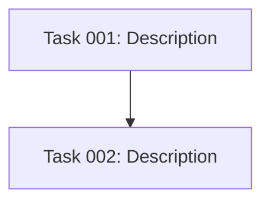

# POST_TASK_GENERATION_ALL Hook

After all tasks have been generated, perform these three steps:

## 1. Review Task Complexity

For each generated task, do a quick sanity check:

- **Too complex?** If a task spans 3+ technologies or requires 3+ skills, split it.
- **Too vague?** If acceptance criteria are unclear, sharpen them.
- **Too trivial?** If two tasks could be one without adding complexity, merge them.

Target: every task should be completable with 1-2 skills and have clear acceptance criteria.

## 2. Assign Model and Effort

Read `.ai/strikethroo/config/shared/model-effort-rubric.md`. For **every** task,
determine the right-sized `model` and `effort` and write both into the task's
YAML frontmatter (they are required fields in `TASK_TEMPLATE.md`).

For each task:

1. Judge its profile from the Objective, `skills`, Technical Requirements, and
   `complexity_score` (if present), then pick the matching row of the rubric's
   assignment table.
2. Apply the rubric guardrails — especially the **risk floor** (security, data
   migration, auth, money, concurrency, or verification-gate tasks never go
   below `sonnet` + `high`) and **default to `sonnet` + `medium`** when unsure.
3. Set `model` (`haiku` | `sonnet` | `opus`) and `effort`
   (`low` | `medium` | `high` | `xhigh`) in the frontmatter. Never leave either
   unset.

Bias toward the cheapest tier that can plausibly complete the task correctly —
cost is a first-class constraint. Reserve `opus`/`xhigh` for tasks that
genuinely need the reasoning.

## 3. Update Plan with Blueprint

After finalizing tasks, append to the plan document:

### Dependency Diagram

If tasks have dependencies, add a Mermaid graph:

Verify there are no circular dependencies.

### Execution Phases

Group tasks into phases:
- **Phase 1**: Tasks with no dependencies (run in parallel)
- **Phase N**: Tasks whose dependencies are all in earlier phases

Use the template in `.ai/strikethroo/config/templates/BLUEPRINT_TEMPLATE.md` for structure.

Before finalizing, verify:
- Every task is in exactly one phase
- No task runs before its dependencies complete
- Phase 1 has only zero-dependency tasks
