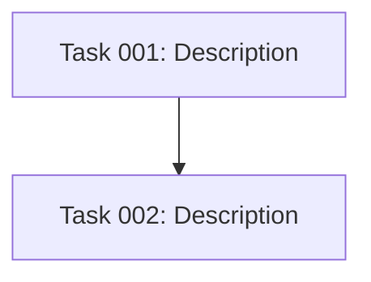

# POST_TASK_GENERATION_ALL Hook

After all tasks have been generated, perform these three steps:

## 1. Review Task Complexity

For each generated task, do a quick sanity check:

- **Too complex?** If a task spans 3+ technologies or requires 3+ skills, split it.
- **Too vague?** If acceptance criteria are unclear, sharpen them.
- **Too trivial?** If two tasks could be one without adding complexity, merge them.

Target: every task should be completable with 1-2 skills and have clear acceptance criteria.

## 2. Assign Model and Effort

Read `.ai/strikethroo/config/shared/model-effort-rubric.md`. For **every** task,
determine the right-sized provider models and effort and write them into the
task's YAML frontmatter (they are required fields in `TASK_TEMPLATE.md`).

For each task:

1. Judge its profile from the Objective, `skills`, Technical Requirements, and
   `complexity_score` (if present), then pick the matching row of the rubric's
   assignment table.
2. Apply the rubric guardrails — especially the **risk floor** (security, data
   migration, auth, money, concurrency, or verification-gate tasks never go
   below `claude-opus-5-5` / `gpt-6-sol` + `high`) and **default to
   `claude-sonnet-5` / `gpt-6-sol` + `medium`** when unsure.
3. Set both `models.anthropic` (`claude-haiku-4-5` | `claude-sonnet-5` |
   `claude-opus-5-5`) and `models.openai` (`gpt-6-luna` | `gpt-6-sol`), plus
   `effort` (`low` | `medium` | `high` | `xhigh`). Never leave any unset.
   Never use Fable, Astra, or deprecated models; never assign `high` or
   `xhigh` effort to an economy model.

Bias toward the least costly model that can plausibly complete the task
correctly. Upgrade the model before increasing effort; do not compensate for
an underpowered model with more effort.

## 3. Update Plan with Blueprint

After finalizing tasks, append to the plan document:

### Dependency Diagram

If tasks have dependencies, add a Mermaid graph:

```mermaid
graph TD
    001[Task 001: Description] --> 002[Task 002: Description]
```

Verify there are no circular dependencies.

### Execution Phases

Group tasks into phases:
- **Phase 1**: Tasks with no dependencies (run in parallel)
- **Phase N**: Tasks whose dependencies are all in earlier phases

Use the template in `.ai/strikethroo/config/templates/BLUEPRINT_TEMPLATE.md` for structure.

Before finalizing, verify:
- Every task is in exactly one phase
- No task runs before its dependencies complete
- Phase 1 has only zero-dependency tasks
