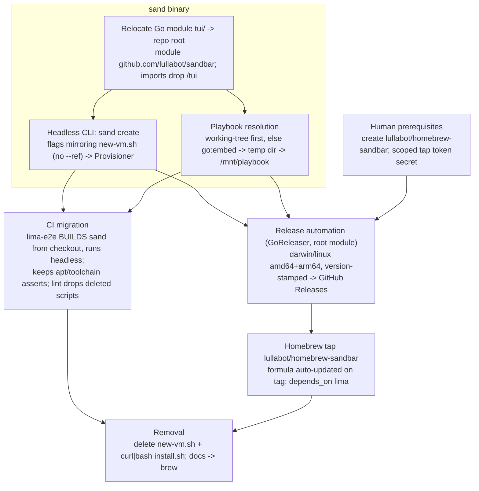

# Plan: Retire `new-vm.sh`, Distribute `sand` via a Homebrew Tap

## Original Work Order

> ITEM 6 — Remove the bash script (scripts/new-vm.sh) once the TUI has it all. Currently new-vm.sh is the entry point for curl|bash (install.sh), Homebrew, and the CI lima-e2e job, and it has a full non-interactive flag set (--name, --yes, --git-name, --cpus, --memory, --disk, --recreate, --rebuild, etc.). The TUI is interactive-only and must run from a checkout. Removal is blocked on closing this parity gap (a headless/non-interactive mode + an install/bootstrap path that doesn't require Go, + migrating CI off new-vm.sh).

## Plan Clarifications

| Question | Answer |
|----------|--------|
| How should a Go-free user install the tool once `new-vm.sh` is gone? | **A Homebrew tap** (`lullabot/homebrew-sandbar`) distributing the prebuilt `sand` binary. There is no existing Homebrew formula today — only `install.sh` + `new-vm.sh`. |
| What is the end state for the bash script? | A **headless `sand` mode + released binaries**, CI migrated to the binary, then **`scripts/new-vm.sh` and the curl|bash `install.sh` are removed**. |
| Dependencies? | Builds on **Plan 06** (name `sandbar`, binary `sand`, org `lullabot`). The headless mode also requires the binary to obtain the playbook **without a checkout**. |
| `go:embed` is the preferred way to obtain the playbook without a checkout, but the playbook lives at the **repo root — above** the `tui/` Go module, and `go:embed` cannot reference files outside its module (no `..`). How is this resolved? | **Embed by relocating the Go module from `tui/` to the repo root.** The module path becomes `github.com/lullabot/sandbar` (dropping the `/tui` suffix) so `//go:embed site.yml roles group_vars …` reaches the playbook directly — a clean, copy-free embed with no build-time sync step. *(Considered and rejected: build-time copy of the playbook into `tui/`, and clone-to-cache.)* |
| Which `sand` does the migrated `lima-e2e` job run? | **Build `sand` from the checkout** (`go build -o sand ./cmd/sand`) and run it headless, so every PR e2e-tests its own code **and** its playbook/role edits before any release exists. It does **not** `brew install` the released binary in the gating job. |
| When `sand` headless runs inside a checkout, where does the playbook come from? | **Working-tree first, embedded fallback.** Three-tier resolution: if run from a git checkout containing `site.yml`, provision from the live working tree (today's behaviour — playbook edits take effect without rebuilding); otherwise materialise the **embedded** playbook to a temp dir and mount that. Preserves the dev loop and lets CI build-from-checkout exercise PR playbook changes. |
| What replaces the curl|bash `install.sh`? | **Nothing — delete it.** `brew install lullabot/sandbar/sand` is the sole documented install path (YAGNI). The `--ref` flag drops out with it (see headless flag surface). |

## Executive Summary

`scripts/new-vm.sh` is currently the only non-interactive, Go-free entry point: `install.sh` (curl|bash) execs it, and the CI `lima-e2e` job drives it with its full flag set. The TUI, by contrast, is interactive-only and must run from a repository checkout. Retiring the bash script therefore requires closing three gaps first: the `sand` binary needs (1) a **headless, non-interactive provisioning mode** (`sand create`) that mirrors `new-vm.sh`'s flags, and (2) a way to **obtain the playbook without a checkout**; plus (3) an **easy, Go-free install** to replace curl|bash.

The checkout-free playbook is solved by **embedding the playbook into the binary**. Because `go:embed` cannot reach files above its own module and the playbook lives at the repo root (above today's `tui/` module), the chosen mechanism is to **relocate the Go module from `tui/` to the repo root** — the module path becomes `github.com/lullabot/sandbar` and `//go:embed site.yml roles group_vars …` references the playbook directly. Playbook resolution becomes **working-tree-first with an embedded fallback**: run from a checkout, `sand` provisions from the live working tree (preserving the edit-and-test dev loop); run from a Homebrew install with no checkout, it materialises the embedded copy to a temp dir and mounts that. This keeps the binary and playbook in lockstep per release without a separate clone or sync step.

The chosen distribution is a **Homebrew tap** built with **GoReleaser**: tagging a release cross-compiles `sand` for macOS/Linux (amd64/arm64), stamps the version, publishes binaries to GitHub Releases, and updates the formula in `lullabot/homebrew-sandbar` (declaring `depends_on "lima"`) so users run `brew install lullabot/sandbar/sand`. CI then migrates: the `lima-e2e` job **builds `sand` from the checkout** and provisions with it (reproducing the existing apt-keyring and toolchain assertions), and the lint job stops shellchecking the soon-to-be-deleted scripts. Once green, `scripts/new-vm.sh` and the curl|bash `install.sh` are deleted and the docs switch to `brew`.

This consolidates two parallel implementations (a 22 KB bash provisioner and the Go provisioner) down to one Go codebase, removing the drift risk between them while keeping every capability `new-vm.sh` offered. It depends on Plan 06, **alters Plan 06's module-path target** (repo-root, not `…/sandbar/tui`), and shares CI edits with Plan 08, so those touchpoints are sequenced explicitly.

## Context

### Current State vs Target State

| Current State | Target State | Why? |
|---------------|--------------|------|
| Non-interactive provisioning lives only in `new-vm.sh` (flags: `--name`, `--yes`, `--git-name/-email`, `--cpus/--memory/--disk`, `--clone-url/--clone-token`, `--recreate`, `--rebuild`, `--base-name`, …) | A headless `sand create` mode covering the same flags (minus `--ref`, which is moot under embed) | CI and scripted users need non-interactive provisioning without the TUI |
| Go module rooted at `tui/` (`github.com/lullabot/sandbar/tui` after Plan 06) | **Go module relocated to the repo root** (`github.com/lullabot/sandbar`); `cmd/sand`, `internal/…`, `go.mod` move up; imports drop the `/tui` segment | `go:embed` can only reach files inside its module — the playbook sits above `tui/`, so the module must contain it |
| The binary requires a repo checkout (`LocatePlaybook` resolves the git toplevel) | Working-tree-first with an **embedded** playbook fallback (`//go:embed site.yml roles group_vars …`, materialised to a temp dir) | A Homebrew-installed binary has no checkout to mount; a checkout still wins so edits take effect live |
| Install = `curl … install.sh | bash` (clones repo, execs `new-vm.sh`) | Install = `brew install lullabot/sandbar/sand`; `install.sh` deleted | A Go-free, one-command install on macOS + Linux |
| CI `lima-e2e` runs `new-vm.sh --yes …`; lint shellchecks `install.sh scripts/new-vm.sh` | CI `lima-e2e` **builds `sand` from the checkout** and runs it headless; lint no longer references the deleted scripts | Exercise the real entry point, and keep PR-level e2e coverage of playbook/role edits |
| Two provisioners maintained (bash + Go) | One (Go) | Eliminate drift and duplicated logic |

### Background

- **`new-vm.sh` flag surface** is the parity checklist (from its `usage()`): `--name`, `--hostname`, `--user`, `--git-name`, `--git-email`, `--cpus`, `--memory`, `--disk`, `--locale`, `--domain`, `--docker-proxy-host`, `--clone-url`, `--clone-token`, `--recreate`, `--rebuild`, `--base-name`, `-y/--yes`. **`--ref` is deliberately omitted** from the headless surface: it only chose which git ref the clone-to-cache install pinned, and the playbook is now embedded (baked to the binary's version), so there is no ref to select. The headless mode is largely a CLI front-end over code that already exists (`provision.Provisioner` + `vm.CreateConfig` + the managed registry).
- **Playbook acquisition is the crux, now resolved.** The provisioner runs the playbook *inside the guest* by `rsync`ing from `/mnt/playbook` (a host directory Lima mounts read-only — see `RenderBaseOverlay` in `internal/provision/overlay.go`). Today that host directory is the git toplevel (`LocatePlaybook` in `internal/provision/playbook.go`, which `git rev-parse --show-toplevel`s and checks for `site.yml`). A checkout-free binary must supply the playbook itself. Because **`go:embed` cannot reference files outside its module or use `..`**, and the playbook (`site.yml`, `roles/`, `group_vars/`, `ansible.cfg`, `inventory`) lives at the repo root *above* the `tui/` module, embedding required moving the module to the repo root (chosen) rather than a build-time copy. The TODO already in `playbook.go` (clone-to-cache) is therefore retired in favour of embed.
- **Playbook resolution is working-tree-first.** `LocatePlaybook` becomes three-tier: (1) if run inside a git checkout containing `site.yml`, return the working tree (so uncommitted playbook edits provision the VM, exactly as today and as `new-vm.sh --rebuild` assumes); (2) otherwise write the embedded fileset to a private temp dir and return that. The read-only mount, in-guest `rsync`, and vars-over-stdin secret handling are unchanged. *(Clarification: working-tree-first + embedded fallback.)*
- **CI does more than run the script**: `lima-e2e` asserts the apt keyrings are `_apt`-readable and smoke-tests the toolchain (`docker`, `gh`, `node`). The migrated job (build `sand` from the checkout → `sand create --yes …`) must reproduce the same guest result so those assertions keep passing. Because it builds-from-checkout and resolution is working-tree-first, the job exercises the **working-tree** playbook — i.e. PR edits to `roles/`/`site.yml` are tested. The **embedded-fallback** path that brew users get is not directly exercised by this job (same files, materialised); it is validated at release time (accepted residual — see Risks). *(Clarifications: build-from-checkout; working-tree-first.)*
- **The lint job references the doomed scripts.** `.github/workflows/test.yml` runs `shellcheck install.sh scripts/new-vm.sh`. Deleting those files means that step must be updated (drop them) in the same change, or CI breaks.
- **There is no Homebrew formula yet** — only `install.sh`. "Homebrew" appears only in comments/docs. So this introduces the tap rather than migrating an existing formula. The formula must declare `depends_on "lima"` since `sand` shells out to `limactl` at runtime (the TUI's startup preflight already requires it).
- **Two human prerequisites** gate the release/tap, mirroring Plan 06's org-transfer framing: (a) create the empty `lullabot/homebrew-sandbar` tap repo (its availability is confirmed by Plan 06 but it must be *created*); (b) provision a scoped `HOMEBREW_TAP_GITHUB_TOKEN` Actions secret with push access to that tap repo, for GoReleaser's Homebrew publisher. The implementing agent wires GoReleaser/CI to consume these; it does not create org repos or mint tokens.
- **Dependencies and cross-plan interactions:**
    - **Plan 06** (the `sand`/`sandbar`/`lullabot` rename) lands first. **This plan supersedes Plan 06's module-path target**: Plan 06 sets `github.com/lullabot/sandbar/tui`; this plan moves the module to the repo root → `github.com/lullabot/sandbar`, a second import rewrite (dropping `/tui`). To avoid doing the import rewrite twice, coordinate: either fold the repo-root relocation into Plan 06's single rename pass, or treat Plan 06's `…/tui` path as interim. Plan 06's index-migration logic lives in `registry.go` (TUI-side) and survives; its *interim* clone-cache cleanup lived in `install.sh`/`new-vm.sh`, which this plan deletes — fine, because embed removes the clone cache entirely (no `CACHE_DIR` clone remains).
    - **Plan 08** (CI test coverage) adds a `go test ./...` job for the module. After relocation, that job's working directory is the **repo root**, not `tui/`. Plan 08 "inherits whatever is current"; flag the path so the go-test/coverage jobs and this plan's binary-based e2e land consistently in the one `test.yml`.
    - Independent of **Plan 09**.

## Architectural Approach

### Go module relocation (`tui/` → repo root)

**Objective:** Make `go:embed` able to reach the playbook by putting the module and the playbook in the same tree.

Move `go.mod`/`go.sum`, `cmd/sand`, and `internal/…` from `tui/` up to the repo root, change the module path to `github.com/lullabot/sandbar`, and rewrite every import to drop the `/tui` segment. The Go toolchain makes this verifiable: a clean `go build ./cmd/sand` and a green `go test ./...` prove no import was missed. `tui/README.md` moves to the repo root (or `docs/`) and is updated. This is sequenced against Plan 06 (see Background) to avoid a double import rewrite.

### Checkout-free playbook acquisition (embed)

**Objective:** Make the binary self-sufficient when installed via Homebrew, with no repo on disk — while keeping the working-tree dev loop.

Embed the playbook fileset with `//go:embed site.yml ansible.cfg inventory roles group_vars` (use the `all:` prefix where a directory may contain dot/underscore files, e.g. `all:roles`). Rework `LocatePlaybook` into three-tier resolution: **(1)** git toplevel contains `site.yml` → return the working tree; **(2)** else write the embedded fileset to a private temp dir and return that path. Either way the existing read-only `/mnt/playbook` mount, in-guest `rsync -a --delete`, `ansible-playbook … --connection=local`, and vars-over-stdin-into-tmpfs are preserved. Embedding keeps the playbook and binary in lockstep per release at negligible size cost (small YAML + roles).

### Headless (non-interactive) CLI mode

**Objective:** Let `sand` provision a VM with no TUI and no prompts, matching `new-vm.sh`.

Add a `sand create` subcommand (bare `sand` stays the TUI) that accepts the `new-vm.sh` flags enumerated in Background (minus `--ref`) and drives the existing `provision.Provisioner` create / recreate (`--recreate`) / rebuild (`--rebuild`) flows, streaming progress to stdout instead of the Bubble Tea panes. It reuses `vm.CreateConfig`, the validation rules, and the managed registry, so behaviour (including secret-over-stdin hygiene and the managed-VM recreate gate) matches the interactive path. The `new-vm.sh` `usage()` flag list is the explicit parity checklist.

### Release automation and the Homebrew tap

**Objective:** Ship `sand` as a one-command install on macOS and Linux.

Add a root-level `.goreleaser.yaml` and a tag-triggered release workflow. GoReleaser builds `main: ./cmd/sand`, `binary: sand`, for darwin/linux × amd64/arm64 with `CGO_ENABLED=0` (the deps are pure Go), stamps the version via ldflags (`-X main.version=…`), attaches artifacts to GitHub Releases, and — via its Homebrew publisher using the scoped `HOMEBREW_TAP_GITHUB_TOKEN` — updates the formula in `lullabot/homebrew-sandbar` with `depends_on "lima"`, so `brew install lullabot/sandbar/sand` works. The tap repo and the token are human prerequisites (Background). Validate on a pre-release tag before the first real release.

### CI migration and removal

**Objective:** Prove the binary covers the script, then delete the script.

Repoint `lima-e2e` to **build `sand` from the checkout** (`go build -o sand ./cmd/sand`) and run `./sand create --yes --name claude-ci --git-name "CI Bot" --git-email ci@example.com --cpus 2 --memory 6GiB --disk 30GiB`, retaining the `_apt`-keyring-readable and toolchain smoke-test assertions and the on-failure log tail (the `/var/log/sand-{provision,finalize}.log` paths Plan 06 renamed). Update the lint job so it no longer shellchecks the deleted scripts (keep the `ansible-playbook … --syntax-check`). Once green, remove `scripts/new-vm.sh` and the curl|bash `install.sh`, and update the README quick-start and the relocated `tui/README` "relationship to new-vm.sh" to the `brew` story.

## Risk Considerations and Mitigation Strategies

Technical Risks

- **Module relocation breaks imports or the embed pattern** (a missed `/tui` import, or `go:embed` silently excluding dot/underscore files under `roles/`).
    - **Mitigation**: the Go build + `go test ./...` catch every import; use `//go:embed all:roles` so nothing is dropped; assert the embedded fileset materialises and provisions in the migrated `lima-e2e` (it covers the working-tree path; add a unit test that the embedded FS contains `site.yml`).
- **Headless parity gaps** (a flag, default, or re-run hint the bash script had).
    - **Mitigation**: treat `new-vm.sh`'s `usage()` as the checklist; the migrated `lima-e2e` job asserts an equivalent provisioned guest. Record `--ref`'s deliberate omission so it is not mistaken for a gap.
- **The embedded-fallback path is not exercised by the gating CI job** (which builds-from-checkout and so uses the working tree).
    - **Mitigation**: the embedded files are byte-identical to the working tree; cover materialisation with a unit test, and validate the real embedded path on the pre-release tag (and optionally a later periodic `brew install` smoke test). Accepted residual.
- **Reproducing the exact guest result** (e.g. the apt-keyring umask fix) under the new path.
    - **Mitigation**: keep the same in-guest script / vars-over-stdin mechanism; retain the CI assertions that originally caught that bug.

Implementation Risks

- **Homebrew tap + GoReleaser credentials/scopes** (a token that can push to the tap repo) and the tap repo not existing yet.
    - **Mitigation**: treat both as human prerequisites (create `lullabot/homebrew-sandbar`; provision a scoped `HOMEBREW_TAP_GITHUB_TOKEN`); validate on a pre-release tag before the first release.
- **Double import rewrite / churn with Plan 06** (06 sets `…/sandbar/tui`, this plan moves to `…/sandbar`).
    - **Mitigation**: coordinate — fold the repo-root relocation into Plan 06's rename pass, or treat 06's `/tui` path as interim; do the import rewrite once.
- **Losing curl|bash users who don't use Homebrew.**
    - **Mitigation**: `brew` runs on macOS and Linux; document the switch in the README. (Decision: no bash bootstrap is retained.)
- **CI workflow edited by two plans** (07 and 08), plus the go-test job's working dir changing to the repo root.
    - **Mitigation**: change `test.yml` once, landing the go-test/coverage jobs (Plan 08) and the binary-based e2e (this plan) together, with the root-module path reflected in both.

## Success Criteria

### Primary Success Criteria

1. `sand create --yes --name … --git-name … --cpus … --memory … --disk …` performs a complete non-interactive create with **no checkout present** (using the embedded playbook); run from a checkout, it provisions from the working tree.
2. The Go module is relocated to the repo root (`github.com/lullabot/sandbar`); `go build ./cmd/sand` produces `sand`, `go test ./...` passes, and the playbook is embedded via `go:embed` (a test asserts the embedded FS contains `site.yml`).
3. `brew install lullabot/sandbar/sand` installs a working binary (formula `depends_on "lima"`) on macOS and Linux, and pushing a release tag runs GoReleaser to publish darwin/linux amd64+arm64 artifacts and auto-update the tap formula.
4. CI `lima-e2e` **builds `sand` from the checkout** and provisions with it (not `new-vm.sh`), still passing the `_apt`-keyring-readable and toolchain smoke-test assertions; the lint job no longer references the deleted scripts.
5. `scripts/new-vm.sh` and the curl|bash `install.sh` are removed, the docs install via `brew`, and no references to the deleted scripts remain.

## Documentation

- **README.md** — quick-start rewritten around `brew install lullabot/sandbar/sand`; remove curl|bash instructions and any `install.sh` references.
- **tui/README.md** (relocated to the repo root / `docs/`) — rewrite the "Relationship to new-vm.sh" section; document `sand create` (the headless mode), the working-tree-first/embedded-fallback playbook resolution, and the new build path (`go build ./cmd/sand` from the repo root).
- **Release/tap docs** — how releases are cut (tag → GoReleaser), how the tap is maintained, and the human prerequisites (tap repo + `HOMEBREW_TAP_GITHUB_TOKEN`).

## Resource Requirements

### Development Skills

- Go (CLI/subcommand front-end over the existing provisioner; module relocation + import rewrite; `go:embed`), GoReleaser configuration, and Homebrew tap mechanics.
- GitHub Actions for the release workflow and the migrated `lima-e2e` job.

### Technical Infrastructure

- A `lullabot/homebrew-sandbar` tap repo and a scoped release token (`HOMEBREW_TAP_GITHUB_TOKEN`), GoReleaser, and a Lima-capable CI runner (the existing `lima-vm/lima-actions` setup) for the binary-based e2e.

## Integration Strategy

Depends on **Plan 06** for the name, binary, and org — and **changes Plan 06's module-path outcome**: where 06 targets `github.com/lullabot/sandbar/tui`, this plan relocates the module to the repo root (`github.com/lullabot/sandbar`) so the playbook can be embedded. Coordinate the two so the import path is rewritten once (fold the relocation into 06's pass, or treat `/tui` as interim). Shares `.github/workflows/test.yml` with **Plan 08**, whose `go test ./...` job now runs from the repo root; land the e2e migration here and the go-test/coverage jobs there together to avoid conflicting edits. Independent of **Plan 09**.

## Notes

- Keep the in-guest secret hygiene (Ansible vars streamed over stdin into tmpfs, never argv) in the headless path — it is part of the security posture, not just an implementation detail.
- `sand create` is the headless subcommand; bare `sand` remains the interactive TUI.

### Decision Log

- **Playbook acquisition = embed via module relocation.** `go:embed` cannot reach the repo-root playbook from the `tui/` module (no `..`), so the Go module moves to the repo root (`github.com/lullabot/sandbar`) and embeds `site.yml`/`roles`/`group_vars`/`ansible.cfg`/`inventory` directly. Rejected: build-time copy of the playbook into `tui/` (extra sync + staleness risk) and clone-to-cache (provision-time network, ref-pinning, retains a cache dir).
- **Playbook resolution = working-tree-first, embedded fallback.** Preserves the dev loop (uncommitted playbook edits provision the VM) and lets CI build-from-checkout exercise PR playbook changes; the embedded copy is the no-checkout (brew) path.
- **CI gating job = build `sand` from the checkout** (not `brew install`), so PR-level playbook/role edits stay e2e-tested. The embedded path is validated at release (accepted residual).
- **`install.sh` deleted; brew-only.** No bash bootstrap retained. `--ref` drops from the headless surface (the playbook is embedded, so there is no ref to pin).
- **Human prerequisites:** create `lullabot/homebrew-sandbar`; provision a scoped `HOMEBREW_TAP_GITHUB_TOKEN` Actions secret with push to the tap. (Mirrors Plan 06's human-prerequisite framing.)
- **CLI shape:** `sand create` subcommand for headless; bare `sand` is the TUI.

### Change Log

- 2026-06-30: Refinement session. (1) Resolved the `go:embed`-vs-clone crux: chose **embed via relocating the Go module from `tui/` to the repo root** (`go:embed` can't reach the parent-dir playbook), and added a dedicated module-relocation stage. (2) Set playbook resolution to **working-tree-first with an embedded fallback**, reworking `LocatePlaybook` into three tiers. (3) Fixed the **CI** migration to **build `sand` from the checkout** (exercises PR playbook edits) and to **drop the lint job's shellcheck** of the deleted scripts. (4) **Deleted `install.sh` outright** (brew-only) and removed `--ref` from the headless surface; settled `sand create` as the subcommand. (5) Added **human prerequisites** (tap repo + scoped release token), **version stamping**, **`depends_on "lima"`**, and **GoReleaser root-module config**. (6) Flagged cross-plan interactions: this plan **supersedes Plan 06's module-path target** (`…/sandbar` not `…/sandbar/tui`) — coordinate to avoid a double import rewrite — and **changes Plan 08's go-test working dir** to the repo root. Updated the frontmatter summary, Clarifications, Current/Target table, mermaid diagram, component sections, Risks, and Success Criteria accordingly.
