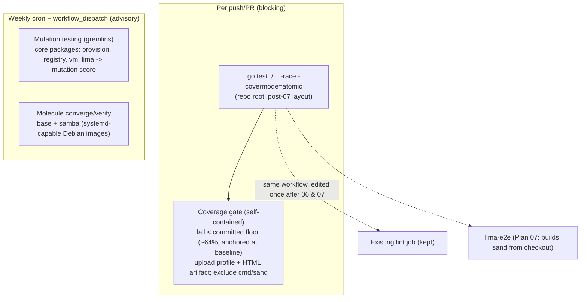

# Plan: CI Test Coverage — Go Tests, Coverage Gate, Mutation Testing, Ansible Role Tests

## Original Work Order

> ITEM 7 — Unit tests / code coverage / mutation testing. The TUI has substantial Go *_test.go coverage but CI (.github/workflows/test.yml) does NOT run go test — it only does shellcheck, ansible syntax-check, and a Lima e2e run via new-vm.sh. Want: wire Go tests into CI, coverage reporting, and evaluate mutation testing (e.g. gremlins for Go); possibly Ansible role tests.

## Plan Clarifications

| Question | Answer |
|----------|--------|
| What should the testing plan cover? | **All four**: (1) run the Go tests in CI, (2) coverage reporting **plus an enforced gate**, (3) **mutation testing** for the Go code (e.g. gremlins), and (4) **Ansible role tests** (e.g. molecule) beyond the current syntax-check. |
| When does this plan land relative to Plans 06 (rename) and 07 (module relocation to repo root)? | **Land 08 last — after 06 and 07.** The go-test job therefore runs `go test ./...` from the **repo root** against module `github.com/lullabot/sandbar`, and excludes `cmd/sand` (the `main` glue) from coverage. The workflow is written **once** against the final layout, avoiding the double rework that landing first would cause (06 renames the module/cmd dir; 07 moves the module up from `tui/`). |
| Which roles get molecule scenarios in v1, given the systemd-in-Docker friction? | **`base` + `samba`**, using **systemd-capable images**. `samba` is behaviour-verifiable (share + config + service) and ties to Plan 09; `base` is foundational. The remaining roles (`dev-tools`, `claude-code`, `project`, `user`) are **documented as follow-up**, not built now. |
| How is coverage reported and the gate enforced/"ratcheted"? | **Self-contained, manual floor.** Coverage is computed in-workflow and the job **fails under a static threshold committed in the repo**, anchored at the **measured baseline (~64%)**; the coverage profile + HTML report are uploaded as a **build artifact**. The floor is **bumped manually in PRs** as coverage rises. **No third-party coverage service** (no external account/token; nothing leaves CI). Auto-committing the baseline from CI was rejected (needs write perms + commit machinery — YAGNI). |
| What cadence do the heavier mutation and molecule jobs run on? | **Scheduled (weekly cron) + `workflow_dispatch`**, so PRs stay fast (only the go-test+coverage job blocks). gremlins runs on the **core packages** (`provision`, `registry`, `vm`, `lima`) and is **advisory/non-blocking** initially. |

## Executive Summary

The TUI carries a substantial Go test suite (`*_test.go` across `lima`, `provision`, `registry`, `ui`, and `vm`), but CI never runs it: `.github/workflows/test.yml` only shellchecks the bash, syntax-checks the playbook, and runs a real-VM `lima-e2e` provision. So a regression in the Go orchestration can reach `main` with the unit tests entirely unexecuted in CI. This plan closes that gap and then strengthens the signal beyond mere pass/fail. The suite currently passes cleanly under `-race`, and the **measured baseline coverage is 64.5%** (65.3% excluding the `cmd` `main` package), so the gate starts immediately green.

Four layers are added: a fast **Go test job** (`go test ./... -race -covermode=atomic`) on every push/PR; a **self-contained coverage gate** that fails below a static threshold committed in the repo (anchored at the ~64% baseline) and uploads the profile/HTML as an artifact — no external coverage service; **mutation testing** (gremlins) as a separate, *scheduled + manually dispatchable*, advisory signal over the core packages that measures how effective the tests actually are rather than just which lines they touch; and **molecule converge/verify tests for the `base` and `samba` roles** (systemd-capable images), going beyond today's syntax-check. The fast Go job guards every change; the heavier mutation and molecule jobs run weekly (and on demand) so they add confidence without slowing the inner loop.

This plan is sequenced to **land after Plans 06 and 07**: Plan 06 renames the module/binary to `sandbar`/`sand`, and Plan 07 relocates the Go module from `tui/` to the **repo root** (`github.com/lullabot/sandbar`). Landing last means the go-test/coverage jobs are written **once** against the final repo-root layout — `go test ./...` from the root, `cmd/sand` excluded from coverage — instead of being churned twice. The shared `test.yml` already carries Plan 07's binary-based `lima-e2e`; this plan adds its jobs alongside it. The result: the existing tests finally protect `main`, coverage is visible and can only ratchet up, mutation testing reveals weak assertions, and role behaviour (not just YAML validity) is exercised.

## Context

### Current State vs Target State

| Current State | Target State | Why? |
|---------------|--------------|------|
| Go unit tests exist but run only locally | `go test ./... -race -covermode=atomic` runs in CI on every push/PR (from the repo root, post-07 layout); failures block merge | Regressions in the Go provisioner/registry/UI currently reach `main` unguarded |
| No coverage measurement | Coverage measured and reported per run (profile + HTML artifact) and **gated by a static, repo-committed floor** anchored at the measured baseline; bumped manually as it rises | Make coverage visible and monotonically improving, without a third-party service |
| Measured baseline unknown / unrecorded | Baseline recorded: **64.5% total, 65.3% excluding `cmd`**; floor set just under it so the gate starts green | The gate must be immediately green to avoid blocking unrelated work |
| Test effectiveness unknown | Mutation testing (gremlins) reports a mutation score on the **core packages** (`provision`, `registry`, `vm`, `lima`), advisory, weekly + on-demand | Line coverage alone can hide weak/missing assertions |
| Ansible validated by syntax-check only | Molecule converge/verify for **`base` and `samba`** (systemd-capable images), weekly + on-demand; other roles documented as follow-up | Catch role behaviour regressions, not just YAML validity |
| `test.yml` has `lint` + `lima-e2e` only | Same workflow gains a fast `go-test` (blocking) job and two scheduled jobs (`mutation`, `molecule`), composed with Plan 07's binary-based `lima-e2e` | One coherent workflow, edited once |

### Background

- **`test.yml` today** has two jobs: `lint` (shellcheck + `ansible-playbook --syntax-check`) and `lima-e2e` (a full real-VM provision via `new-vm.sh`, the slow job). There is no Go job at all. Plan 07 repoints `lima-e2e` to build the `sand` binary from the checkout; this plan adds its jobs alongside that.
- **The Go module** lives under `tui/` today (`github.com/deviantintegral/claude-code-ansible/tui`, go 1.24). **After Plan 07 it moves to the repo root** as `github.com/lullabot/sandbar`. Because **this plan lands last** (see Clarifications), all CI commands target the repo-root layout: `go test ./...` runs from the root, and `cmd/sand` (the `main` glue, ~0% coverage) is excluded from the coverage denominator.
- **Measured baseline (verified during refinement):** `go test ./internal/... -race -covermode=atomic` passes with no race findings. Per-package coverage: `lima` 76.1%, `registry` 73.5%, `provision` 69.3%, `ui` 61.9%, `vm` 57.9%; `cmd/claude-vm` 0.0%. **Total 64.5%; 65.3% excluding the `cmd` main package.** The committed floor is therefore set at a stable value just under the baseline (e.g. **64%**) so the gate is green from day one and ratchets upward by manual edits.
- **The real-Lima tests are already tag-gated.** `tui/internal/provision/lima_e2e_test.go` carries `//go:build limae2e`, so the default `go test ./...` excludes them automatically — the fast job needs no special exclusion flag. (Those real-VM mechanics remain covered by the separate `lima-e2e` job.)
- **Coverage exclusion mechanism:** measure coverage over the meaningful packages only — run with `-coverpkg=./internal/...` (or measure `./internal/...` and/or filter the `cmd/sand` lines out of the profile before computing the total) so the untested `main` glue doesn't drag or distort the number. `-covermode=atomic` is required because the job runs with `-race`.
- **Mutation testing is inherently slow** (it recompiles and reruns tests per mutant), so it lives in a **separate scheduled job** (weekly cron + `workflow_dispatch`) scoped to the **core packages** (`provision`, `registry`, `vm`, `lima`; `ui` — the Bubble Tea view layer — is out of the initial core scope). It is **advisory**, not a merge gate, at first.
- **Molecule needs Docker, and `base`/`samba` manage services via systemd**, which constrains container images. v1 uses **systemd-enabled Debian images** (matching the project's Debian target) so the services actually start; the scenario does a `converge` (with an idempotence re-run) and a `verify` that asserts the role's key outcomes (for `samba`: the share is configured and `smbd` is enabled/active; for `base`: its foundational packages/config land). The job runs **weekly + on demand**, not per-PR. Roles that can't be fully converged in a container are documented rather than forced.
- **Coordination / sequencing:**
    - **Plan 06** renames the module path and the `cmd` dir (`cmd/claude-vm` → `cmd/sand`).
    - **Plan 07** relocates the module from `tui/` to the repo root and repoints `lima-e2e` to a checkout-built `sand`. This plan **lands after both**, so the go-test/coverage jobs are authored once against `github.com/lullabot/sandbar` at the repo root and compose with Plan 07's `lima-e2e` in the one `test.yml`.
    - Independent of **Plan 09** (it will inherit whatever roles/tests exist; `samba` molecule here and Plan 09's writable-share work are complementary).

## Architectural Approach

### Go unit tests in CI

**Objective:** Make the existing suite actually guard `main`.

Add a blocking `go-test` job that runs `go test ./... -race -covermode=atomic` for the module on every push and PR, with Go module/build caching for speed. Because this plan lands after Plan 07, the job's working directory is the **repo root** and the module is `github.com/lullabot/sandbar`. The `limae2e`-tagged real-VM tests are excluded automatically by the default build constraints. This is the essential, fast guard and the foundation the other three layers build on.

### Coverage reporting and gate (self-contained)

**Objective:** Make coverage visible and monotonically improving — without a third-party service.

Collect a coverage profile from the test run (over `./internal/...`, excluding the `cmd/sand` `main` glue), upload the raw profile and a generated HTML report as a **build artifact**, and **fail the job when the total drops below a static threshold committed in the repo**. The floor is anchored at the **measured baseline (~64%)** so the gate is immediately green, and is **bumped manually in PRs** as coverage improves ("ratchet by manual edit"). No external coverage account, token, or upload is involved — everything stays inside the workflow. *(Clarification: self-contained, manual floor; auto-committing the baseline from CI was rejected as unnecessary machinery.)*

### Mutation testing

**Objective:** Measure how good the tests are, not just how much code they touch.

Wire up Go mutation testing (gremlins) as a **separate job triggered by a weekly `schedule` and `workflow_dispatch`** (not on every PR), scoped to the **core packages** (`provision`, `registry`, `vm`, `lima`). It reports a mutation score and surviving mutants as an **advisory** signal — non-blocking initially so it informs test improvements without destabilising the merge gate — with documentation on running it locally. *(Clarification: scheduled + manual; core packages; advisory.)*

### Ansible role tests (molecule)

**Objective:** Exercise role behaviour beyond syntax validity.

Add molecule scenarios for **`base` and `samba`** (converge + an idempotence re-run + verify), run in a **scheduled + manually dispatchable** CI job with Docker, while keeping the existing `--syntax-check` in the lint job. Both roles manage systemd services, so the scenario uses a **systemd-enabled Debian image** so services actually start; `verify` asserts the concrete outcomes (e.g. `samba`'s share/config and `smbd` active; `base`'s foundational setup). The remaining roles (`dev-tools`, `claude-code`, `project`, `user`) are **documented as follow-up** rather than built now. *(Clarification: base + samba, systemd images, others deferred.)*

## Risk Considerations and Mitigation Strategies

Technical Risks

- **Slow or flaky CI** from `-race`, mutation runs, and molecule.
    - **Mitigation**: keep only the unit+coverage job fast and blocking; run mutation and molecule on a **weekly schedule + manual dispatch** (never per-PR), with Go and Docker layer caching. `-race` is already clean on the current suite (verified).
- **Systemd-in-Docker friction** for the service-managing `base`/`samba` roles under molecule.
    - **Mitigation**: use **systemd-enabled Debian images** matching the project target; assert services via `verify`; document any step that can't be containerised. Scope v1 to `base` + `samba` so the friction is bounded.
- **Mutation tooling maturity** (gremlins false positives/timeouts).
    - **Mitigation**: treat the mutation score as **advisory, not a gate**; scope it to the four core packages first; cap runtime via the scheduled cadence.

Implementation Risks

- **Coverage gate causes friction** if set too high.
    - **Mitigation**: anchor the floor at the **measured baseline (~64%)** with a small margin so it starts green; exclude the `cmd/sand` `main` glue from the denominator; ratchet by manual PR edits only.
- **Workflow edited by multiple plans** (07 migrates `lima-e2e`; this adds jobs).
    - **Mitigation**: **land this plan last** so `test.yml` is edited once against the final repo-root layout; the new jobs compose with Plan 07's binary-based `lima-e2e` without re-churning paths.
- **Stale paths/module references** if 06/07 slip and this lands earlier than assumed.
    - **Mitigation**: the plan's commands assume the repo-root module (post-07). If sequencing changes, the only edits are the job's working directory and the coverage exclusion path — flagged here so they're caught, not guessed.

## Success Criteria

### Primary Success Criteria

1. Every push/PR runs `go test ./... -race -covermode=atomic` for the module (from the repo root, post-07 layout), and a failure blocks merge.
2. Coverage is measured and reported on each run (profile + HTML uploaded as a build artifact), with a **self-contained gate that fails below a repo-committed floor** anchored at the measured baseline (~64%, `cmd/sand` excluded) and bumped manually as coverage rises — **no external coverage service**.
3. A **scheduled (weekly) + manually dispatchable** mutation-testing job (gremlins) runs on the core packages (`provision`, `registry`, `vm`, `lima`) and reports a mutation score, advisory/non-blocking, with documented local usage.
4. **Molecule converge/verify scenarios for `base` and `samba`** exist and run in a scheduled + manually dispatchable CI job (systemd-capable images), alongside the retained syntax-check; the deferred roles are documented as follow-up.

## Documentation

- **README (relocated post-07; was `tui/README.md`)** — a testing section: how to run unit tests, coverage (and where to find the artifact / how the floor is set), and mutation testing locally.
- **Role/test docs** — how to run the `base`/`samba` molecule scenarios; the systemd-image requirement; and a note listing the roles deferred to follow-up.
- **CONTRIBUTING (or equivalent)** — the coverage-floor expectation for new code and how/when the floor is bumped.

## Resource Requirements

### Development Skills

- Go testing/coverage tooling and gremlins; GitHub Actions (caching, scheduled `cron`/`workflow_dispatch` jobs, artifact upload); molecule + Docker with systemd-enabled images and Ansible role testing.

### Technical Infrastructure

- GitHub Actions runners with Docker (molecule) and Go. **No external coverage service** is required (self-contained gate + artifact). No new third-party accounts or tokens.

## Integration Strategy

This plan **lands after Plans 06 and 07**. Plan 06 renames the module/binary; Plan 07 relocates the Go module from `tui/` to the repo root (`github.com/lullabot/sandbar`) and repoints `lima-e2e` to a checkout-built `sand`. Landing last lets the go-test/coverage/mutation/molecule jobs be written **once** against the final repo-root layout and compose with Plan 07's `lima-e2e` in the single `.github/workflows/test.yml`. Independent of **Plan 09**, whose `samba` writable-share work is complementary to the `samba` molecule scenario added here.

## Notes

- The fast `go test -race` job is the highest-value, lowest-cost piece and the immediate win; the coverage gate, mutation testing, and molecule layer additional confidence on top of it.
- Keep the existing `lima-e2e` job — unit tests and role tests do not replace the real-VM end-to-end signal.

### Decision Log

- **Sequencing: land 08 last (after 06 & 07).** The go-test/coverage jobs target the **repo-root** module `github.com/lullabot/sandbar` (post-07), run `go test ./...` from the root, and exclude `cmd/sand` from coverage. Rejected: landing first (would churn the go-test job ~twice as 06 renames and 07 relocates).
- **Coverage = self-contained, manual floor.** In-workflow gate against a repo-committed threshold anchored at the **measured ~64% baseline** (65.3% excluding `cmd`); profile + HTML uploaded as an artifact; floor bumped manually in PRs. Rejected: an external service (Codecov/Coveralls — extra account/token, data leaves CI) and CI auto-committing the baseline (extra write perms + commit machinery).
- **Mutation = gremlins, scheduled + manual, advisory, core packages.** Weekly `cron` + `workflow_dispatch` over `provision`, `registry`, `vm`, `lima`; non-blocking initially. `ui` excluded from the initial core scope.
- **Molecule = `base` + `samba`, systemd-capable images, scheduled + manual.** Other roles (`dev-tools`, `claude-code`, `project`, `user`) documented as follow-up.
- **Measured baseline (verified at refinement):** suite passes under `-race` with no race findings; total coverage 64.5% (65.3% excluding `cmd`); per-package lima 76.1 / registry 73.5 / provision 69.3 / ui 61.9 / vm 57.9 / cmd 0.0.

### Change Log

- 2026-06-30: Refinement session. (1) **Pinned sequencing**: this plan lands **after 06 & 07**, so the go-test/coverage jobs target the **repo-root** module (`github.com/lullabot/sandbar`), run `go test ./...` from the root, and exclude `cmd/sand` — written once, no double rework. (2) **Recorded the measured baseline** (64.5% total / 65.3% excl. `cmd`; `-race` clean; per-package numbers) and anchored the coverage floor at ~64%. (3) **Resolved coverage reporting** to **self-contained, manual floor** (repo-committed threshold + artifact, no external service, no auto-commit). (4) **Named the molecule scope** as `base` + `samba` with **systemd-capable images**, deferring the other roles. (5) **Set heavy-job cadence** to **weekly schedule + `workflow_dispatch`** for both gremlins (advisory, core packages) and molecule. (6) Added the coverage-exclusion mechanism (`-coverpkg=./internal/...` / profile filtering), confirmed the `limae2e` tag auto-excludes real-VM tests, and added a Decision Log. Updated the frontmatter summary, Clarifications, Current/Target table, mermaid diagram, component sections, Risks, Success Criteria, Documentation, and Integration Strategy accordingly.
</content>
</invoke>
