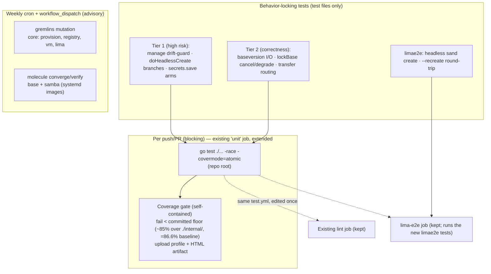
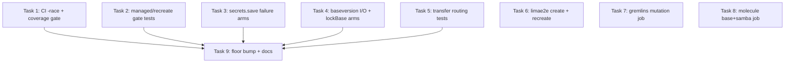

# Plan: Test Coverage Hardening — Go Tests, Coverage Gate, Mutation Testing, Behavior-Locking Tests, Ansible Role Tests

## Original Work Order

> ITEM 7 — Unit tests / code coverage / mutation testing. The TUI has substantial Go *_test.go coverage but CI (.github/workflows/test.yml) does NOT run go test — it only does shellcheck, ansible syntax-check, and a Lima e2e run via new-vm.sh. Want: wire Go tests into CI, coverage reporting, and evaluate mutation testing (e.g. gremlins for Go); possibly Ansible role tests.

_Refinement (2026-07-14): a follow-up test-coverage evaluation, run against the stable app immediately before a planned significant refactor/expansion, expanded the intent of this plan. The CI-infrastructure goals above stand, but the evaluation found the higher-value work is **authoring the specific tests that lock in known-working behavior so the refactor cannot silently break it** — behavior that is currently uncovered in exactly the places where a regression would be destructive or silent. That test-authoring is now the core of this plan; the CI wiring is the scaffolding that runs and measures it._

## Plan Clarifications

| Question | Answer |
|----------|--------|
| What should the testing plan cover? | **All four**: (1) run the Go tests in CI, (2) coverage reporting **plus an enforced gate**, (3) **mutation testing** for the Go code (e.g. gremlins), and (4) **Ansible role tests** (e.g. molecule) beyond the current syntax-check. |
| When does this plan land relative to Plans 06 (rename) and 07 (module relocation to repo root)? | **Originally: land 08 last, after 06 and 07.** _(Refinement 2026-07-14: 06 and 07 are now COMPLETE — the module is at the repo root as `github.com/lullabot/sandbar`, and a `unit` job already runs `go test ./...`. The sequencing constraint is satisfied; framing updated from "lands after" to "06/07 are done".)_ |
| Which roles get molecule scenarios in v1, given the systemd-in-Docker friction? | **`base` + `samba`**, using **systemd-capable images**. `samba` is behaviour-verifiable (share + config + service) and ties to Plan 09; `base` is foundational. The remaining roles (`dev-tools`, `claude-code`, `project`, `user`) are **documented as follow-up**, not built now. |
| How is coverage reported and the gate enforced/"ratcheted"? | **Self-contained, manual floor.** Coverage is computed in-workflow and the job **fails under a static threshold committed in the repo**; the coverage profile + HTML report are uploaded as a **build artifact**. The floor is **bumped manually in PRs** as coverage rises. **No third-party coverage service.** _(Refinement 2026-07-14: floor re-anchored from the stale ~64% to just under the current **gated** baseline — **~85%**, measured over `./internal/...` which totals **86.6%**; the all-package total incl. the `cmd/sand` main-glue is **82.7%**.)_ |
| _(Red-team 2026-07-14)_ Which coverage number does the floor refer to, given 82.7% all-package vs a higher internal-only number? | The gate measures **`./internal/...` only** (`-coverpkg=./internal/...`), which totals **86.6%**; the floor sits just under that (**~85%**). The all-package 82.7% is quoted for context only and is *not* the gated denominator. Anchoring the floor at ~80% (as the prior draft did) would have left ~6 points of slack against the real denominator. |
| _(Red-team 2026-07-14)_ Is the molecule/Ansible role-testing scope-creep vs the Go-behavior-lock goal? | **Evaluated and retained by decision.** It is orthogonal to the Go refactor but was plan 08's original committed scope (work-order item 7) and ties to Plan 09; kept in 08 rather than split out or dropped. |
| What cadence do the heavier mutation and molecule jobs run on? | **Scheduled (weekly cron) + `workflow_dispatch`**, so PRs stay fast (only the go-test+coverage job blocks). gremlins runs on the **core packages** (`provision`, `registry`, `vm`, `lima`) and is **advisory/non-blocking** initially. |
| _(Refinement 2026-07-14)_ Should this plan also author the missing behavior-locking tests, or only wire CI? | **Author them.** Add Tier-1 (high, destructive/security-risk) and Tier-2 (medium, correctness-risk) unit tests plus two limae2e e2e tests, prioritised by risk. This is the point of the exercise: freeze known-working behavior before the refactor. |
| _(Refinement 2026-07-14)_ May the new tests touch production/app code? | **No.** Test/CI-only — no production code edits. Where a failure arm is genuinely unreachable without adding a code seam (candidate: `secrets.save`), the plan **flags it as a follow-up** rather than refactoring app code under this plan. |
| _(Refinement 2026-07-14)_ Are the low-priority "easy win" tests in scope? | **No — skip them.** `internal/vm` pure funcs (`EffectiveHostname`, `ParseCPUs`), the `runCreate`/`parseCreateFlags` extraction (would touch app code), and the cosmetic `version.String` branches are explicitly out of scope. |
| _(Refinement 2026-07-14)_ Overlap with existing pending work? | This plan (08) already owns the CI + mutation infrastructure and was still unexecuted; rather than duplicate it in a new plan, the behavior-locking test-authoring was **folded into 08** and its stale baseline refreshed. |

## Executive Summary

The app is stable and about to undergo a significant refactor and expansion. The goal of this plan is to **lock in known-working behavior so the refactor cannot silently break it**, and to make CI enforce that lock on every change. The Go suite is already strong — **82.7% total coverage (86.6% over the gated `./internal/...` packages)**, a clean `lima.Runner` interface seam every test injects at, a three-tier TUI strategy (direct `Update()`, teatest goldens, a render-sweep robustness net), real `limae2e`-gated end-to-end tests, and the base-image concurrency races already pinned by genuine concurrent tests. The suite passes cleanly under `-race`. The gaps are concentrated and, in a handful of places, dangerous: code paths that are destructive or security-sensitive if they regress silently, yet carry no test.

This plan has two halves. **(1) Finish the CI wiring.** A `unit` job now exists and runs `go test ./...`, but without `-race` and without any coverage measurement — so the recent race-fix release cycles are unguarded in CI and coverage can silently erode during the refactor. This plan adds `-race` and a **self-contained coverage gate** (a static, repo-committed floor anchored just under the gated ~86.6% `./internal/...` baseline (≈85%), plus profile/HTML artifacts, no third-party service) to that job; adds a **scheduled + manually dispatchable gremlins mutation job** over the core packages (`provision`, `registry`, `vm`, `lima`) as an advisory signal; and adds **molecule converge/verify scenarios for the `base` and `samba` roles** (systemd-capable images), also scheduled + on demand. **(2) Author the missing behavior-locking tests** — the new core of the plan — targeting exactly the uncovered high-risk paths: the `manage` drift-guard (0% today) that stops `--recreate` from clone-replacing an unmanaged VM; the headless-create destructive branches (`--rebuild`, `--recreate` refusal); the `secrets` atomic-write failure arms that guarantee no world-readable window; the base-version staleness file I/O that decides whether playbook updates reach VMs; the lock degrade/cancel arms; and the transfer-routing paths that guard the documented wrong-VM bug — plus two `limae2e` e2e tests (a headless `sand create` and a `--recreate` round-trip).

Two hard constraints shape the work. **These are test/CI-only changes — no production code is edited**; where a failure arm cannot be reached without a code seam, the plan flags it as a follow-up rather than refactoring app code now. And the **low-priority easy wins are explicitly out of scope**. Plans 06 (rename) and 07 (module-to-repo-root) are complete, so all CI commands target the repo-root module `github.com/lullabot/sandbar` and this plan edits the single `test.yml` once. The result: the highest-risk behavior is frozen by tests before the refactor starts, CI runs those tests with the race detector and a coverage floor that can only ratchet up, mutation testing reveals weak assertions, and role behaviour (not just YAML validity) is exercised.

## Context

### Current State vs Target State

| Current State | Target State | Why? |
|---------------|--------------|------|
| A `unit` job runs `go vet` + `go test ./...` on every push/PR, but **without `-race`** | The `unit` job runs `go test ./... -race -covermode=atomic`; failures block merge | The last two release cycles were race fixes; the suite is `-race`-clean today but CI does not enforce it, so a reintroduced race reaches `main` unguarded |
| No coverage measurement at all | Coverage measured and reported per run (profile + HTML artifact) and **gated by a static, repo-committed floor** (~85%, measured over `./internal/...` which totals 86.6%), bumped manually as it rises | Make coverage visible and monotonically improving through the refactor, without a third-party service |
| Measured baseline stale (~64% recorded 2026-06) | Baseline refreshed: **82.7% all-package / 86.6% over `./internal/...`** (the gated denominator); floor set just under the gated number (~85%) so the gate starts green | The gate must be immediately green; the recorded number must match reality |
| `internal/manage` at **0%** — the drift-guard is untested | `Reconcile`, `RecreateBase`, `RecordSuccess` unit-tested, incl. the `--recreate` refusal gate | If `RecreateBase` regresses, `sand create --recreate` clone-replaces an **unmanaged** VM — silent, destructive |
| `doHeadlessCreate` `--recreate` refusal (unmanaged VM) untested (cmd/sand 16.3%) | The `--recreate` **refusal** branch covered via `stubProvisioner` | The refusal gate must not regress; the `--rebuild` base-delete was refactored away in 0.4.0 and its pass-down is already tested |
| `secrets.save` failure arms uncovered (chmod, temp→rename cleanup) | Failure/cleanup arms covered via filesystem-state fault injection | These are the atomicity + no-world-readable-window guarantees for on-disk secrets |
| base-version file I/O at **0%** (tests stub the fns) | Round-trip test through the **real** `read/writeBaseVersion` + `baseVersionPath` in a temp `LIMA_HOME` | This staleness stamp decides whether playbook updates reach VMs; the real path derivation is never exercised |
| `lockBase` cancel/degrade arms uncovered (~64%) | ctx-cancel-while-waiting and the three "proceed unserialized" degrade paths covered | Guards ctrl+c-while-queued and read-only-home behavior; the race itself is already covered |
| `transfer.go` routing uncovered (`updateBrowse` 0%, `updateDest` ~25%) | Upload-vs-download target-VM branch and Esc→`ClearSelection` arm covered via `Update()` | Guards the documented wrong-VM bug and an un-escapable dest prompt |
| Test effectiveness unknown | gremlins mutation score on the **core packages**, advisory, weekly + on-demand | Line coverage alone can hide weak/missing assertions |
| Real-VM behavior only informally checked by the `lima-e2e` shell steps | Two `limae2e` Go e2e tests: headless `sand create` outcome, and a `--recreate` round-trip proving the managed-gate holds against a real registry | Formalise the cross-process claims into asserted tests |
| Ansible validated by syntax-check only | Molecule converge/verify for **`base` and `samba`** (systemd images), weekly + on-demand | Catch role behaviour regressions, not just YAML validity |
| Constraint: none stated | **Test/CI-only; no production code edits.** Unreachable arms flagged, not refactored | Freeze behavior without perturbing the code the refactor will touch |

### Background

- **`test.yml` today** (post-06/07) has three jobs: `lint` (`ansible-playbook --syntax-check`), `unit` (`go vet ./...` then `go test ./...` — **no `-race`, no coverage**), and `lima-e2e` (builds `sand` from the checkout and runs `sand create` end-to-end on a Lima VM, with keyring/linger/toolchain assertions). The original work order's description ("CI does NOT run go test … via new-vm.sh") is now **stale**: the `unit` job exists and `new-vm.sh` was retired by Plan 07. So the "Go tests in CI" work reduces to **adding `-race` + a coverage gate to the existing `unit` job**, not creating it.
- **The Go module** is at the **repo root** as `github.com/lullabot/sandbar` (go 1.25). Plans 06 (rename) and 07 (module relocation, `lima-e2e` repointed to a checkout-built `sand`) are **complete**, so all CI commands target that layout: `go test ./...` from the root, `cmd/sand` (the `main` glue, 5.2%) excluded from the coverage denominator.
- **Measured baseline (verified during this refinement, 2026-07-14):** `go test ./... -race` passes with **no race findings**. **Total coverage: 82.7% all-package; 86.6% over `./internal/...`** — the latter is the **gated denominator** (the untested `cmd/sand` `main` glue is excluded via `-coverpkg=./internal/...` so it doesn't distort the number). Per-package (0.4.0): `cmd/sand` 16.3% (was 5.2% at 0.3.0; 0.4.0 added the rebuild/recreate pass-down tests), `internal/browse` 80.7%, `internal/lima` 84.9%, `internal/manage` **0.0%**, `internal/provision` 73.4%, `internal/registry` 78.7%, `internal/secrets` 78.8%, `internal/ui` 88.5%, `internal/version` 55.6%, `internal/vm` 48.3%. The committed floor is set just under the **gated 86.6% baseline (≈85%)** and ratchets upward by manual edits — including after the new tests below land.
- **What is already well-covered (do not re-do):** the `lima.Runner` seam and per-package fakes; the TUI's direct-`Update()` + teatest-golden + `render_sweep` layers; the base-image concurrency races (`provision_test.go:877`, `:934`) via a stateful `baseRaceRunner`; and the `limae2e` e2e tier (real `limactl copy` round-trips, disk-grow, stage round-trip, concurrent provisions, secrets reaching the guest).
- **The high-risk gaps this plan fills** (from the evaluation), by tier:
    - **Tier 1 — silent destructive/security risk:** `internal/manage` (0%), `doHeadlessCreate` destructive branches (~31%), `secrets.save` failure arms.
    - **Tier 2 — correctness risk, non-destructive:** base-version file I/O (0%), `lockBase` cancel/degrade arms (~64%), `transfer.go` routing (0% / ~25%).
    - **E2E:** headless `sand create`, `--recreate` round-trip (both `limae2e`-gated).
- **Out of scope (low priority, per Clarifications):** `internal/vm` pure funcs (`EffectiveHostname`, `ParseCPUs`), the `runCreate`/`parseCreateFlags` extraction (would touch app code), and the cosmetic `version.String` dirty/dev branches.
- **The real-Lima tests are tag-gated.** Existing and new `//go:build limae2e` tests are excluded from the default `go test ./...`, so the fast `unit` job needs no special exclusion flag; the real-VM mechanics stay in the `lima-e2e` job.
- **Mutation testing is inherently slow** (recompiles/reruns per mutant), so it lives in a **separate scheduled job** (weekly cron + `workflow_dispatch`) scoped to the core packages; `ui` (the Bubble Tea view layer) is out of the initial core scope. Advisory, not a merge gate, initially.
- **Molecule needs Docker, and `base`/`samba` manage services via systemd**, so v1 uses **systemd-enabled Debian images**; the scenario does `converge` (+ idempotence re-run) and `verify` of key outcomes. Weekly + on demand, not per-PR.
- **Sequencing:** 06/07 are done, so there is no cross-plan ordering constraint left. The behavior-locking tests touch code already present in the tree (`transfer.go` from Plan 10, `secrets` from Plan 11, `manage`/`create.go`), so those plans are landed and no new dependency is introduced.

## Architectural Approach

The plan is test/CI-only. Two halves: **finish the CI wiring** (fast blocking guard + advisory scheduled jobs) and **author the behavior-locking tests** the CI then runs. No production code is edited; an unreachable failure arm is flagged, not refactored.

### Behavior-locking tests — Tier 1 (high priority)

**Objective:** Freeze the behavior whose silent regression would be destructive or a security leak, before the refactor touches it. All test-only.

- **`internal/manage` (0% → covered).** Unit-test the drift-guard that keeps the TUI and headless `sand create` from diverging on what makes a VM "managed"/recreate-able. Cover `Reconcile` (drops entries whose VM vanished from the live list, returns the dropped names), `RecordSuccess` (records a `CreateConfig` so a later recreate reproduces it), and — most important — `RecreateBase`: it must return `ok=false` for an **unmanaged** VM (the gate that stops `--recreate` from clone-replacing an arbitrary instance) and, for a managed VM, return the recorded base or the default base name when none was recorded. Pure functions over a `registry` + a `[]vm.VM`; no seam needed.
- **`doHeadlessCreate` `--recreate` refusal (cmd/sand at 16.3%).** _(Re-scoped for 0.4.0.)_ In 0.4.0 the `--rebuild` base-delete was **refactored out of `doHeadlessCreate`** — the base is now destroyed inside the provisioner under the base lock (the doc comment names the exact race this closes), and `--rebuild`/`--recreate` are passed down as `provision.CreateOptions{Rebuild}` and are **already tested** (`TestHeadlessCreatePassesRebuildDownToTheProvisioner`, `TestHeadlessRecreatePassesRebuildDownToTheProvisioner`). The remaining gap is the **`--recreate` refusal when the target is not sand-managed** (`doHeadlessCreate` returns the "not a sand-managed VM — recreate refused" error). Using the existing `stubProvisioner` seam, assert the refusal error is returned and that **no provision is attempted** — the integration-level twin of the `RecreateBase` gate.
- **`secrets.save` failure arms.** Cover the atomicity/permission guarantees currently exercised only on the happy path: the `os.Chmod(dir, 0o700)` failure arm and the temp-file `Write`/`Sync`/`Close`/`Rename` cleanup-and-return arms (`internal/secrets/secrets.go:348`, `:364-381`), which guarantee secrets are never written through a world-readable window or left partially written. **Prefer filesystem-state fault injection** (e.g. a read-only parent dir, a pre-existing directory where the temp/target file is expected) to drive these arms without a code seam. **If an arm is genuinely unreachable without adding a seam to production code, flag it as a follow-up** in the plan/PR rather than editing app code under this plan.

### Behavior-locking tests — Tier 2 (medium priority)

**Objective:** Cover the correctness-sensitive but non-destructive paths that the refactor could break without a crash.

- **base-version file I/O (0% → covered).** Existing tests swap `readBaseVersionFn`/`writeBaseVersionFn`, so the **real** `readBaseVersion` (`baseversion.go:195`), `writeBaseVersion` (`:237`, which in 0.4.0 also records a `builtAt time.Time`), and `baseVersionPath` — the `LIMA_HOME`/`~/.lima` derivation of the staleness stamp — never run. Add a **round-trip test through the real functions** in a temp `LIMA_HOME`: write a version, read it back, and assert the path lands where staleness detection expects. This stamp decides whether playbook updates actually reach VMs (wrong ⇒ rebuild loop, or updates never propagate).
- **`lockBase` cancel/degrade arms (~64% → covered).** The contended flock path is already hit by the race tests; this fills the rest: **ctx-cancellation while waiting** (`baselock.go:109`, the ctrl+c-while-queued behavior the file exists to provide) and the three **"lock unavailable → proceed unserialized"** degrade paths (`MkdirAll` failure, `OpenFile` failure, non-`EWOULDBLOCK` flock error), each of which must return a no-op release and let the create proceed rather than erroring on a read-only home.
- **`transfer.go` routing (`updateBrowse` 0%, `updateDest` ~25% → covered).** Via direct `Update()` calls (matching the package's style): the upload-vs-download **target-VM selection branch** (`transfer.go:80`, which must target `m.transferVM` — the documented wrong-VM bug), and the **Esc→`ClearSelection`** arm (`:101`) that prevents a still-set selection from bouncing the user straight back into the dest prompt.

### End-to-end tests (limae2e-gated)

**Objective:** Formalise the cross-process claims the `lima-e2e` job checks informally into asserted Go tests.

- A **headless `sand create` e2e** that shells the built `sand` binary and asserts on the outcome (the VM is created and recorded managed), under the `limae2e` build tag alongside the existing e2e tests.
- A **`--recreate` round-trip e2e** proving the managed-gate holds against a **real registry**: a sand-created VM can be recreated, and `--recreate` is refused for a VM sand did not create.

### CI wiring — extend the existing `unit` job (blocking)

**Objective:** Make CI enforce the lock on every change.

Extend the existing blocking `unit` job to run `go test ./... -race -covermode=atomic` (from the repo root) with Go module/build caching. `-covermode=atomic` is required under `-race`. The `limae2e`-tagged tests (existing and new) are excluded automatically by build constraints, so the fast job stays fast.

### CI wiring — coverage gate (self-contained)

**Objective:** Make coverage visible and monotonically improving through the refactor — without a third-party service.

Collect a coverage profile over `./internal/...` (excluding the `cmd/sand` `main` glue via `-coverpkg=./internal/...` or by filtering the profile), upload the raw profile + a generated HTML report as a **build artifact**, and **fail the job when the total drops below a static threshold committed in the repo**. The floor is anchored just under the **gated ~86.6% `./internal/...` baseline** (≈85%, refreshed from the stale ~64%) so the gate is immediately green, and is **bumped manually in PRs** as coverage rises — including after the Tier-1/Tier-2 tests land. No external account, token, or upload.

### CI wiring — mutation testing (gremlins)

**Objective:** Measure how good the tests are, not just how much code they touch.

A **separate job on a weekly `schedule` + `workflow_dispatch`** (not per-PR), scoped to the core packages (`provision`, `registry`, `vm`, `lima`). Reports a mutation score and surviving mutants as an **advisory** signal — non-blocking initially — with documented local usage. `ui` is out of the initial core scope (mutating the ~7k-line Bubble Tea view layer against goldens yields mostly equivalent/timeout mutants for little signal).

### CI wiring — Ansible role tests (molecule)

**Objective:** Exercise role behaviour beyond syntax validity.

Molecule scenarios for **`base` and `samba`** (converge + idempotence re-run + verify) in a **scheduled + manually dispatchable** Docker job, keeping the existing `--syntax-check` in `lint`. Both roles manage systemd services, so the scenario uses a **systemd-enabled Debian image**; `verify` asserts concrete outcomes (e.g. `samba`'s share/config and `smbd` active; `base`'s foundational setup). The remaining roles (`dev-tools`, `claude-code`, `project`, `user`) are **documented as follow-up**.

## Risk Considerations and Mitigation Strategies

Technical Risks

- **Slow or flaky CI** from `-race`, mutation runs, and molecule.
    - **Mitigation**: keep only the unit+coverage job fast and blocking; run mutation and molecule on a **weekly schedule + manual dispatch** (never per-PR), with Go and Docker layer caching. `-race` is already clean on the current suite (verified 2026-07-14).
- **A `secrets.save` failure arm is unreachable without a code seam** — the no-app-code constraint could block covering it.
    - **Mitigation**: drive the arms via **filesystem-state fault injection** (read-only dir, pre-existing path collisions) first. If an arm still can't be reached, **flag it as a follow-up** in the PR (a candidate production-code seam for the upcoming refactor) rather than editing app code now. Coverage of that one arm is not worth violating the constraint.
- **New `limae2e` e2e tests add real-VM cost/flake.**
    - **Mitigation**: keep them behind the `limae2e` tag and the existing `lima-e2e` job; reuse the established e2e teardown discipline; assert on stable outcomes (managed-registry state, refusal errors), not timing.
- **Systemd-in-Docker friction** for the service-managing `base`/`samba` roles under molecule.
    - **Mitigation**: use **systemd-enabled Debian images** matching the project target; assert services via `verify`; document any step that can't be containerised. Scope v1 to `base` + `samba`.
- **Mutation tooling maturity** (gremlins false positives/timeouts).
    - **Mitigation**: treat the score as **advisory, not a gate**; scope it to the four core packages first; cap runtime via the scheduled cadence.

Implementation Risks

- **Coverage gate causes friction** if set too high, or the refactor temporarily dips coverage.
    - **Mitigation**: anchor the floor just under the **gated ~86.6% `./internal/...` baseline** (≈85%) so it starts green; ratchet by manual PR edits only; a temporary dip during the refactor is handled by a deliberate, reviewed floor edit rather than an auto-gate.
- **Tests over-fit to current implementation**, making the very refactor they protect harder.
    - **Mitigation**: assert on **observable behavior/outcomes** (managed state, refusal errors, on-disk file mode/atomicity, staleness-path round-trip, routed target VM), not on internal call sequences, so they survive an internal refactor that preserves behavior.
- **Accidental production-code edits** under a test-only plan.
    - **Mitigation**: the no-app-code constraint is a **primary success criterion and a PR review gate**; the only permitted non-test edits are CI/workflow, `.gremlins`/molecule config, and documentation.

Quality / Refactor-Handoff Risks

- **Timing-based concurrency tests** (`buildDelay: 150ms`, `time.Sleep`) may be silently weakened by the refactor.
    - **Mitigation**: recorded as guidance (see Notes → Style Cautions) — if the provisioning concurrency model is touched, convert these to channel/barrier-based determinism. Not a task in this plan.
- **Global-var test seams** (`hostMemBytesFn`, `playbookVersionFn`, `buildVersion`) + heavy `t.Setenv` mean the suite is deliberately serial.
    - **Mitigation**: recorded as guidance — new tests must **not** add `t.Parallel()` to tests touching those seams; introducing parallelism is out of scope and a shared-mutable-state hazard.

## Success Criteria

### Primary Success Criteria

1. The existing `unit` job runs `go test ./... -race -covermode=atomic` (repo root); a failure blocks merge.
2. Coverage is measured and reported per run (profile + HTML artifact), with a **self-contained gate** that fails below a repo-committed floor anchored just under the **gated ~86.6% `./internal/...` baseline** (≈85%), bumped manually — **no external coverage service**.
3. **Tier-1 behavior-locking tests exist and pass:** `internal/manage` (`Reconcile`/`RecreateBase`/`RecordSuccess`, incl. the unmanaged-VM `--recreate` refusal), the `doHeadlessCreate` `--recreate`-refusal branch (the `--rebuild`/`--recreate` pass-down is already covered in 0.4.0), and `secrets.save` failure/cleanup arms (or any unreachable arm explicitly flagged as a follow-up).
4. **Tier-2 behavior-locking tests exist and pass:** base-version real-I/O round-trip in a temp `LIMA_HOME`, `lockBase` ctx-cancel + the three degrade paths, and `transfer.go` `updateBrowse`/`updateDest` routing (target-VM branch + Esc→`ClearSelection`).
5. **Two `limae2e` e2e tests exist:** a headless `sand create` outcome test and a `--recreate` round-trip proving the managed-gate holds against a real registry.
6. A **scheduled (weekly) + manually dispatchable** gremlins job runs on the core packages (`provision`, `registry`, `vm`, `lima`), advisory/non-blocking, with documented local usage.
7. **Molecule converge/verify scenarios for `base` and `samba`** run in a scheduled + manually dispatchable CI job (systemd-capable images), alongside the retained syntax-check; deferred roles documented.
8. **No production/app code was modified** — the diff is limited to test files, CI/workflow, mutation/molecule config, and documentation. Coverage measurably rises above the ~86.6% gated baseline once the new tests land (floor bumped accordingly).

## Self Validation

After all tasks are complete, execute these concrete checks:

1. **Race + full suite (local):** run `go test ./... -race -covermode=atomic` from the repo root; confirm it passes with no race findings, and that `internal/manage` is no longer at 0% (`go test ./internal/manage/ -cover`).
2. **Coverage floor:** run the exact coverage command the CI job uses (`-coverpkg=./internal/...`), confirm the printed total is above the committed floor, and confirm the profile + HTML artifact are produced. Then temporarily lower the floor value (or weaken a test) locally to confirm the gate **fails** below threshold (prove the gate bites), and restore.
3. **Tier-1 gate proof — manage:** with a temporary local edit that makes `RecreateBase` return `ok=true` for an unmanaged VM, confirm the new `internal/manage` test **fails**; revert. This proves the destructive-gate test actually guards the gate.
4. **Tier-1 gate proof — headless create:** run the `cmd/sand` tests and confirm the `--recreate`-refusal test asserts both the refusal error and that no provision was attempted. (The `--rebuild`/`--recreate` pass-down is already covered by 0.4.0's `TestHeadless*PassesRebuildDownToTheProvisioner`; the `--rebuild` base-delete was refactored away.)
5. **Tier-1 secrets atomicity:** run the `secrets` tests and confirm the failure-arm tests assert the target file is never left world-readable and never partially written; if any arm was flagged unreachable, confirm the flag/follow-up note is present in the PR and no app code was touched.
6. **Tier-2 base-version:** run the `provision` test in a temp `LIMA_HOME` and confirm the stamp file is written at the path `baseVersionPath` derives and reads back identically.
7. **Tier-2 lock + transfer:** confirm the `lockBase` tests cover ctx-cancel and all three degrade paths (grep the test for each arm), and that the `transfer` tests drive `updateBrowse`/`updateDest` and assert the routed target VM and the cleared selection.
8. **E2E (gated):** with Lima available, run `go test -tags limae2e ./...` for the two new e2e tests (or trigger the `lima-e2e` job) and confirm the headless-create and `--recreate` round-trip assertions pass.
9. **CI shape:** inspect `.github/workflows/test.yml` and confirm: the `unit` job carries `-race` + the coverage gate; the gremlins and molecule jobs are `schedule` + `workflow_dispatch` only (not per-PR); the `lint` and `lima-e2e` jobs are retained.
10. **No-app-code proof:** run `git diff --name-only` against the base branch and confirm every changed path is a `_test.go` file, a CI/workflow file, mutation/molecule config, or documentation — no production `.go` source is modified.
11. **Mutation smoke:** dispatch the gremlins job (or run locally on one core package) and confirm it produces a mutation score without erroring.
12. **Molecule smoke:** dispatch the molecule job (or run locally) for `samba` and confirm `converge` is idempotent and `verify` asserts `smbd` active and the share configured.

## Documentation

- **README (repo root)** — a testing section: how to run unit tests, `-race`, coverage (and where to find the artifact / how the floor is set and bumped), and mutation testing locally.
- **AGENTS.md** — record the **test/CI-only, no-app-code** convention for this work, the coverage-floor expectation for new code, the `limae2e` tag for real-VM tests, and the two style cautions (timing-based concurrency tests; no `t.Parallel()` on global-seam tests) so future agents preserve them through the refactor.
- **Role/test docs** — how to run the `base`/`samba` molecule scenarios; the systemd-image requirement; the roles deferred to follow-up.
- **CONTRIBUTING (or equivalent)** — the coverage-floor expectation and how/when the floor is bumped.

_POST_PLAN question — "does this plan need to update documentation / AGENTS.md?": **Yes.** AGENTS.md should record the no-app-code test convention, the coverage-floor and `limae2e` conventions, and the two style cautions; README/CONTRIBUTING gain the testing/coverage sections above._

## Resource Requirements

### Development Skills

- Go testing/coverage tooling (table-driven stdlib tests, filesystem fault injection, `t.Setenv`, build tags), bubbletea `Update()`-level testing, and gremlins; GitHub Actions (caching, scheduled `cron`/`workflow_dispatch` jobs, artifact upload); molecule + Docker with systemd-enabled images and Ansible role testing.

### Technical Infrastructure

- GitHub Actions runners with Docker (molecule) and Go; Lima for the `limae2e` job. **No external coverage service** (self-contained gate + artifact). No new third-party accounts or tokens.

## Integration Strategy

Plans 06 (rename) and 07 (module-to-repo-root, `lima-e2e` repointed to a checkout-built `sand`) are **complete**, so the go-test/coverage/mutation/molecule work targets the final repo-root module `github.com/lullabot/sandbar` and edits the single `.github/workflows/test.yml` once, composing with the retained `lima-e2e` job. The new `limae2e` e2e tests run inside that existing job. Independent of **Plan 09**, whose `samba` writable-share work is complementary to the `samba` molecule scenario. The behavior-locking tests deliberately assert on observable outcomes so they survive — and protect — the upcoming refactor rather than obstruct it.

## Notes

- The behavior-locking Tier-1 tests are the highest-value pieces: they freeze destructive/security-sensitive behavior (the `--recreate` managed-gate, secrets atomicity) that is uncovered today and about to be refactored. The `-race` + coverage-gate wiring is the cheapest and makes that lock enforceable on every change.
- Keep the existing `lima-e2e` job — unit and role tests do not replace the real-VM end-to-end signal; the new e2e tests strengthen it.

### Style Cautions (guidance for test authors and the refactor — not tasks)

- **Concurrency tests are timing-based** (`buildDelay: 150ms`, `time.Sleep`). If the provisioning concurrency model is touched during the refactor, prefer converting them to channel/barrier-based determinism so they can't silently stop catching the race.
- **No `t.Parallel()` anywhere**, deliberately: heavy `t.Setenv` plus package-level function-var swapping (`hostMemBytesFn`, `playbookVersionFn`, `buildVersion`) makes the global seams a shared-mutable-state hazard. New tests must not add `t.Parallel()` to tests that touch those seams.

### Decision Log

- **Scope = CI wiring + behavior-locking test authoring; low-priority easy wins excluded.** _(Refinement 2026-07-14.)_ Rejected: a bare CI-only plan (would leave the high-risk paths uncovered before the refactor); including the Tier-3 easy wins (`vm` pure funcs, `parseCreateFlags` extraction, `version.String` — the extraction would touch app code and the user deprioritised them).
- **Test/CI-only — no production code edits.** _(Refinement 2026-07-14.)_ Unreachable failure arms (candidate: `secrets.save`) are **flagged as follow-ups**, not fixed by editing app code under this plan. Rationale: don't perturb the code the refactor will rewrite; keep the diff auditable as behavior-preserving.
- **Folded into plan 08 rather than a new plan.** _(Refinement 2026-07-14.)_ Plan 08 already owned the CI + gremlins infrastructure and was unexecuted; a new plan would have duplicated it. Rejected: a standalone new plan (duplication) and superseding/retiring 08.
- **Coverage floor re-anchored to just under the gated `./internal/...` baseline (~85%; gated total 86.6%, all-package 82.7%; was ~64%).** _(Corrected in the red-team pass — the prior draft's ~80% was set against the wrong denominator.)_ Self-contained, manual floor; profile + HTML artifact; no external service; no CI auto-commit. Bumped after the new tests land.
- **Molecule/Ansible role-testing retained in plan 08** _(red-team 2026-07-14)_ — evaluated as orthogonal to the Go-behavior-lock goal but kept as originally committed (work-order item 7, ties to Plan 09). Rejected: splitting it to a follow-up plan; dropping it.
- **Sequencing constraint retired.** 06/07 are complete; the CI commands target the repo-root module and the single `test.yml`. The touched code (`transfer.go`, `secrets`, `manage`) is already in-tree (Plans 10/11 landed), so no new dependency.
- **Mutation = gremlins, scheduled + manual, advisory, core packages** (`provision`, `registry`, `vm`, `lima`); `ui` excluded from the initial core scope.
- **Molecule = `base` + `samba`, systemd-capable images, scheduled + manual.** Other roles documented as follow-up.

### Change Log

- 2026-06-30: Initial refinement. Pinned sequencing (land after 06/07, repo-root module), recorded the then-baseline (64.5% total / 65.3% excl. `cmd`; `-race` clean), resolved coverage to a self-contained manual floor + artifact, named the molecule scope (`base` + `samba`, systemd images), set heavy-job cadence to weekly + `workflow_dispatch`, and added the Decision Log.
- 2026-07-14: Refinement session (test-coverage evaluation ahead of a significant refactor). (1) **Refreshed the baseline** with current per-package numbers, and re-anchored the coverage floor from the stale ~64%. (2) **Corrected now-stale premises**: a `unit` job already runs `go test ./...` (so the go-test work is *adding `-race` + the gate*, not creating the job); `new-vm.sh` retired; 06/07 complete. (3) **Added the core new body of work — behavior-locking test authoring** (Tier-1: `manage`, `doHeadlessCreate` branches, `secrets.save` arms; Tier-2: base-version I/O, `lockBase` cancel/degrade, `transfer` routing; plus two `limae2e` e2e tests), with new architecture sections, Current/Target rows, Risks, and Success Criteria. (4) **Recorded the hard `test/CI-only, no-app-code` constraint** (unreachable arms flagged, not refactored) as a primary success criterion and review gate. (5) **Excluded the low-priority easy wins** explicitly. (6) **Added the required Self Validation section** (was missing) and the AGENTS.md documentation answer. (7) **Recorded style cautions** (timing-based concurrency tests; no `t.Parallel()` on global-seam tests) as refactor-handoff guidance. Updated the frontmatter summary, title, Clarifications, Executive Summary, Background, mermaid diagram, and Decision Log accordingly.
- 2026-07-14: Red-team / QA pass. (1) **Verified every cited code anchor against the checkout at v0.4.0** — `secrets.go` save/chmod/rename (338/348/378), `baselock.go` ctx-cancel (99) + degrade paths (66/70/85), `transfer.go` (83/104), `create.go` `doHeadlessCreate`/refusal (176/188), `provision_test.go` concurrency tests (877/934), `baseversion.go` (61/74/85) — all present and correct. (2) **Fixed a coverage-denominator defect**: the prior draft anchored the floor at ~80% but the gate measures `./internal/...` only, which totals **86.6%** (all-package 82.7%) — floor corrected to ≈85% and every number in the plan made consistent about which denominator it refers to. (3) **Evaluated the molecule/Ansible scope** against the Go-behavior-lock goal and **retained it by decision** (original committed scope; ties to Plan 09). (4) Recorded both red-team decisions in Clarifications and the Decision Log. No other changes — the plan was otherwise sound.
- 2026-07-15: Re-baseline to **v0.4.0** ahead of execution (the evaluation and plan were built against the user's local 0.3.0 checkout; origin/main — the PR base — is one release ahead at 0.4.0). (1) **Dropped the obsolete `--rebuild` base-delete test item**: 0.4.0 refactored the base delete out of `doHeadlessCreate` into the provisioner under the base lock, and the `--rebuild`/`--recreate` pass-down (`CreateOptions{Rebuild}`) is **already tested**. The remaining `cmd/sand` gap is narrowed to the **`--recreate` refusal for an unmanaged VM**. (2) **Refreshed anchors for 0.4.0**: `baseversion.go` reworked (`readBaseVersion`→195, `writeBaseVersion`→237 now takes `builtAt time.Time`), `baselock.go` ctx-cancel→109, `transfer.go` →80/101; `cmd/sand` coverage 5.2%→16.3%. (3) Confirmed still-open gaps against 0.4.0: `internal/manage` still 0% (no test file), `--recreate` refusal untested, plus `secrets.save` arms, baseversion round-trip, `lockBase` cancel/degrade, `transfer` routing, the two e2e tests, and all CI wiring. Coverage totals (82.7% all-package / 86.6% gated) were already measured on 0.4.0.

## Execution Blueprint

**Validation Gates:**
- Reference: `/config/hooks/POST_PHASE.md`

### ✅ Phase 1: Author tests + wire CI (all parallel, no dependencies)
**Parallel Tasks:**
- ✔️ Task 1: CI — add `-race` + self-contained coverage gate to the `unit` job *(completed)*
- ✔️ Task 2: Tier-1 — managed/recreate gate tests (`internal/manage` + `cmd/sand` refusal) *(completed — manage 0%→100%)*
- ✔️ Task 3: Tier-1 — `secrets.save` failure/cleanup arms *(completed — save 48%→59%; temp-write arms flagged as follow-up)*
- ✔️ Task 4: Tier-2 — base-version I/O round-trip + `lockBase` cancel/degrade arms *(completed — lockBase 64%→88%; 3rd flock arm flagged as follow-up)*
- ✔️ Task 5: Tier-2 — `transfer.go` routing (`updateBrowse`/`updateDest`) *(completed — updateBrowse 0%→90%, updateDest 25%→63%)*
- ✔️ Task 6: E2E — `limae2e` headless create + `--recreate` round-trip *(completed — compiles/skips)*
- ✔️ Task 7: CI — scheduled gremlins mutation job (advisory, core packages) *(completed)*
- ✔️ Task 8: CI — scheduled molecule converge/verify for `base` + `samba` *(completed — samba idempotence known-issue flagged as follow-up)*

### Phase 2: Finalize (after the coverage-raising tasks)
**Parallel Tasks:**
- Task 9: Bump the coverage floor + document testing conventions (depends on: 1, 2, 3, 4, 5)

### Post-phase Actions
- After Phase 1: run `go test ./... -race -covermode=atomic -coverpkg=./internal/...` and confirm green under the initial floor; confirm no production `.go` files changed (`git diff --name-only` shows only `*_test.go`, workflow, molecule/gremlins config, docs).
- After Phase 2: confirm the bumped floor still passes and README/AGENTS.md carry the new conventions.

### Execution Summary
- Total Phases: 2
- Total Tasks: 9
