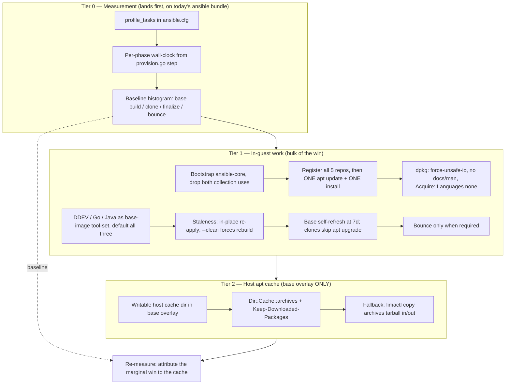

# Plan: Faster Base VM Provisioning (Tiers 0–2)

## Original Work Order

> Speed up sandbar base VM provisioning — implement Tiers 0, 1, and 2 from the analysis (Tier 3, publishing a golden image, is explicitly OUT of scope for this plan).
>
> Context on the current flow: `sand` (Go) drives limactl + an embedded Ansible playbook. `BuildBase` creates a `claude-base` Lima instance from the Debian 13 template, a Lima `mode: dependency` script installs `ansible` + `rsync`, then the playbook runs in-guest with `--connection=local` under `provision_phase=base`. The base is stopped and cloned per VM; each clone runs `provision_phase=finalize` (hostname, git identity, `apt upgrade dist`, optional repo clone) and is then bounced (stop+start). Base staleness is stamped from git HEAD plus a `-dirty` suffix, so ANY local playbook edit deletes and rebuilds the base from raw Debian.
>
> Diagnosis: on a gigabit connection the bottleneck is dpkg/unpack and serialized apt work, not download bandwidth.
> - Debian's `ansible` package is 17.7 MB download but ~200 MB installed (thousands of small collection files). Only two things from the bundle are used: `community.general.locale_gen` (roles/base/tasks/main.yml:29) and `ansible.posix.authorized_key` (roles/user/tasks/main.yml:65). `ansible-core` is 1.3 MB / 8.2 MB.
> - Seven separate apt update+install passes (3 in roles/base, 4 in roles/dev-tools), each adding a repo then refreshing all sources: NodeSource, Docker, ddev, cloudflared, GitHub CLI.
> - `base_packages` (roles/base/defaults/main.yml) includes `golang` and `default-jdk-headless` — metapackages pulling ~500–700 MB installed between them.
>
> Scope to plan:
>
> TIER 0 — Measurement (do first; everything else is a hypothesis until the histogram exists):
> - Enable `profile_tasks` in ansible.cfg so per-task timings are visible.
> - Emit per-phase wall-clock durations from provision.go's `step()` so base-build / clone / finalize / bounce costs are attributable.
>
> TIER 1 — No new infrastructure, expected bulk of the win:
> - Bootstrap `ansible-core` instead of `ansible` in the Lima dependency script (internal/provision/overlay.go); replace `community.general.locale_gen` with a `locale-gen` command task and `ansible.posix.authorized_key` with `lineinfile` so no collections are needed.
> - Consolidate: register all five apt repos + keyrings first, then a single `apt-get update` and a single install of all packages — one dpkg transaction instead of seven.
> - dpkg tuning for the base phase: `force-unsafe-io`, `path-exclude` for docs/man, `Acquire::Languages "none"`.
> - Make `golang` and `default-jdk-headless` opt-in via a var rather than unconditional defaults.
> - Make in-place base re-apply the default when the playbook is dirty/changed (Ansible is idempotent, so only the delta runs); keep destroy-and-rebuild behind an explicit `--clean` flag, and always clean in CI. This collapses the playbook-dev inner loop from a full from-scratch rebuild to under a minute.
> - Cheap trims: skip the finalize bounce unless actually required (e.g. /var/run/reboot-required); gate finalize's `apt upgrade dist` on the base being older than N days instead of running it on every clone.
>
> TIER 2 — Host-side apt cache, base build ONLY:
> - Security rationale to preserve in the plan: the "no writable host mount" invariant protects WORK VMs (where Claude runs unsupervised, and where deleting the VM must provably remove everything it produced). The base builder is a trusted, identity-free, throwaway machine running only our own playbook, and clones never inherit the mount because it lives in the base overlay only. Public .deb files on the host are not an exfiltration channel.
> - Mechanism: in the base overlay only, mount a host cache dir writable, point `Dir::Cache::archives` at it via an apt.conf.d fragment, and set `Binary::apt::APT::Keep-Downloaded-Packages "true"`. Do NOT use apt-cacher-ng (five of the repos are HTTPS, needing remap rules plus a host daemon).
> - Fallback if sshfs/virtiofs ownership semantics prove painful (macOS reverse-sshfs is the risk): `limactl copy` the archives tarball out after a successful build and push it back in before the next one — same win, no mount semantics.
> - Sequence Tier 2 after Tier 1 so its actual marginal benefit is measurable rather than assumed.
>
> Cross-cutting requirements: the existing lima-e2e CI job must keep passing (including its assertion that apt keyrings are readable by the `_apt` sandbox user); the playbook fileset rsync filter in internal/provision/provision.go mirrors the go:embed directives in playbook_embed.go and the two must stay in step; secrets must continue to go over stdin, never argv.

## Plan Clarifications

| Question | Answer |
| --- | --- |
| `golang` and `default-jdk-headless` become opt-in — how should the new var default? | Users should be able to choose one or more of DDEV, golang, and Java; we provision based on those settings. |
| Optional tools are chosen per VM, but every VM clones from ONE shared `claude-base`. Where do selected tools get installed? | The tool-set configures the **base image**, not the clone. Still one base image, but its contents differ per user — "a user who doesn't care about Java never worries about it." |
| What is the default tool-set when no tool flags are given? | **All three** (DDEV, Go, Java) — current behavior. No BC break; the win is opt-out. |
| In-place re-apply can't undo a removed task or a de-selected tool. How should staleness be resolved? | **In-place re-apply is the default**, with `--clean` as the destroy-and-rebuild escape hatch (CI always uses clean). Residue from a shrunk tool-set is accepted until `--clean`. |
| Finalize's `apt upgrade dist` runs on every clone; gating on base age alone still makes every clone pay when the base is old. Which shape? | **Refresh the base, skip in clones**: when the base is older than N days (N=7), run the upgrade once on the base; clones then skip `apt upgrade` entirely. |
| Is backwards compatibility required? | Yes for the tool-set (defaults to all three, matching today's VM contents). Behavioral changes to base staleness handling (in-place re-apply as default) and to where `apt upgrade` runs are accepted and intentional. |

## Executive Summary

Base VM provisioning is slow even on a gigabit link because the cost is not bandwidth — it is dpkg unpack time, serialized apt transactions, and a base-rebuild policy that throws away the entire machine whenever the playbook changes. This plan attacks all three without introducing any new infrastructure or published artifacts: it first makes the cost *visible* (Tier 0), then removes the largest known sources of unpack and repetition (Tier 1), then adds a host-side apt archive cache scoped strictly to the base build (Tier 2).

The approach was chosen over shipping pre-provisioned images (deliberately deferred as Tier 3, out of scope here) because the measurable bottleneck is work performed *inside* the guest, and because every improvement here also compounds with a golden image later: a leaner, single-transaction, cache-backed playbook is exactly what a published image would want to run on top of. Sequencing matters and is part of the plan — Tier 0 lands before Tier 1 so the histogram exists before the optimizations, and Tier 2 lands after Tier 1 so its marginal benefit is measured against an already-fast build rather than credited with someone else's win.

Expected outcomes: the Ansible bootstrap drops from ~200 MB installed to ~8 MB; seven apt update+install passes collapse into one; dpkg stops fsyncing and stops unpacking documentation; DDEV/Go/Java become a base-image tool-set that a user who does not need them never pays for; and the playbook-development inner loop stops being a from-scratch rebuild, becoming an idempotent in-place delta re-apply measured in seconds rather than minutes. Package downloads survive base rebuilds in a host cache, so a rebuild is CPU-bound rather than network-bound.

## Context

### Current State vs Target State

| Current State | Target State | Why? |
| --- | --- | --- |
| No timing data: the build is a wall of streamed output with no attribution | `profile_tasks` on in `ansible.cfg`; `provision.go` prints per-phase wall-clock (base build, clone, finalize, bounce) | Every optimization below is a hypothesis until the histogram exists; measurement is also how Tier 2's marginal value gets judged |
| Lima dependency script installs Debian's `ansible` (17.7 MB download, ~200 MB installed as thousands of small collection files) | Dependency script installs `ansible-core` (1.3 MB / 8.2 MB); playbook uses zero collections | ~190 MB of small-file unpacking with fsync is removed from the critical path before the playbook even starts |
| `community.general.locale_gen` and `ansible.posix.authorized_key` are the only two collection uses | `locale-gen` command task and a `lineinfile` on `~/.ssh/authorized_keys` | These two tasks are the sole reason the fat `ansible` bundle is needed; removing them unblocks `ansible-core` |
| Seven apt update+install passes (3 in `roles/base`, 4 in `roles/dev-tools`), each adding a repo then refreshing all sources | All keyrings and repos registered first; a single `apt-get update`; a single install transaction | Seven index refreshes and seven serialized dpkg runs become one; apt parallelizes downloads across the whole package set |
| dpkg runs with default fsync, unpacks docs/man, apt fetches translations | `force-unsafe-io`, `path-exclude` for `/usr/share/doc` and `/usr/share/man`, `Acquire::Languages "none"` (base phase) | Fsync-per-file and man-db/doc churn are a large share of dpkg wall-clock on a virtio disk; the base is a disposable builder where unsafe-io is an acceptable trade |
| `golang` and `default-jdk-headless` are unconditional `base_packages`; DDEV is unconditional in `dev-tools` | DDEV, Go, and Java form a configurable **base-image tool-set**, defaulting to all three | ~500–700 MB installed between Go and Java alone. Users who do not need a runtime should not pay for it — but defaulting to all three keeps existing VMs byte-for-byte equivalent (no BC break) |
| Any playbook change (git HEAD or dirty tree) deletes the base and rebuilds it from raw Debian | Staleness triggers an **in-place re-apply** of the playbook onto the existing base; `sand create --clean` forces destroy-and-rebuild; CI always builds clean | Ansible is idempotent — a playbook edit needs only its delta applied. This turns the playbook-development inner loop from a full rebuild into a short converge |
| Every clone runs `apt upgrade dist` in finalize | When the base is older than 7 days, the upgrade runs once **on the base**; clones skip `apt upgrade` entirely | The upgrade cost is paid once and amortized across every VM cloned from that base, instead of being re-paid per clone forever |
| Every clone is bounced (stop + start) unconditionally after finalize | The bounce happens only when actually required (e.g. `/var/run/reboot-required`, pending group membership) | A stop+start is tens of seconds of pure latency on the common path where nothing needs a reboot |
| Packages are re-downloaded from the network on every base rebuild | Host-side apt archive cache, mounted writable into the **base overlay only** (`Dir::Cache::archives` + `Keep-Downloaded-Packages "true"`) | A base rebuild becomes CPU-bound rather than network-bound; clones never inherit the mount, so the security invariant is untouched |

### Background

**The measured cost model.** On a fast connection the build spends its time in the guest, not on the wire. Verified figures: Debian's `ansible` is 17.7 MB download / 200.7 MB installed, versus `ansible-core` at 1.3 MB / 8.2 MB. `golang` and `default-jdk-headless` are metapackages whose real payload (`golang-1.24`, the JDK) is several hundred megabytes installed. `grep -c update_cache` over the roles confirms three apt passes in `roles/base` and four in `roles/dev-tools`.

**Why `profile_tasks` needs care after the `ansible-core` swap.** `profile_tasks` is a callback plugin shipped in the `ansible.posix` collection, not in `ansible-core` (verified: it is absent from `ansible/plugins/callback/` and present in `ansible_collections/ansible/posix/plugins/callback/`). Tier 0 therefore lands *while the fat `ansible` bundle is still installed* and works immediately. After Tier 1 swaps to `ansible-core`, profiling must become an opt-in mode that provisions the `ansible.posix` collection on demand; the default fast path stays collection-free. This ordering constraint is deliberate and must be preserved.

**The security invariant, and why the Tier 2 mount does not violate it.** `overlay.go` documents that these VMs run Claude unsupervised, that there is no writable host mount, and that deleting a VM therefore provably removes everything it produced. That invariant protects **work VMs**. The base builder is a different kind of machine: it is identity-free, it runs only our own playbook, no user code and no agent ever executes on it, and it is a disposable build artifact. The apt cache mount lives in the base overlay only, so clones — the machines the invariant is about — never inherit it. The data crossing the boundary is public `.deb` files, which is not an exfiltration channel. This distinction is the crux of Tier 2 and must be written into the code comments, not just this plan.

**Rejected alternative for Tier 2: apt-cacher-ng.** Five of the repositories (NodeSource, Docker, ddev, Cloudflare, GitHub CLI) are HTTPS, which a caching proxy cannot cache without remap rules plus a host-side daemon. The archives cache achieves the same result with no daemon and no repo rewriting.

**Accepted trade-off of in-place re-apply.** Ansible converges only what its tasks assert. It will not uninstall a package whose task was deleted, nor remove a tool the user de-selected from the base tool-set. Shrinking the tool-set therefore leaves residue on the base until `--clean` is used. This was explicitly accepted; `sand` must *tell* the user when the selection shrinks rather than silently leaving stale software installed.

## Architectural Approach

The work divides into three stages that must land in order. Tier 0 is instrumentation and is independently shippable. Tier 1 is the bulk of the win and is where behavior changes. Tier 2 is an additive cache whose value is judged against the Tier 1 baseline.

### Stage 1 — Tier 0: Make the cost visible

**Objective**: Produce an attributable timing breakdown before any optimization, so that Tier 1 and Tier 2 are validated against evidence rather than expectation.

Two independent instruments. Inside the guest, enable the `profile_tasks` callback via `ansible.cfg` so every task's duration and a sorted top-N summary print at the end of each playbook run. This is available today because the fat `ansible` bundle (which vendors `ansible.posix`) is still what the Lima dependency script installs — which is precisely why this stage must land before the `ansible-core` swap.

Outside the guest, `provision.go`'s `step()` already announces each lifecycle stage; extend the provisioner to record and print wall-clock for each: base image creation (Lima boot + dependency script), base playbook run, base stop, clone, clone start, finalize playbook run, and the bounce. These are the segments that Tier 1 targets, so each must be separately attributable. Timing output goes to the same streamed writer the phases already use.

The deliverable of this stage is a recorded baseline for both a cold base build and a warm clone-only create, captured on real hardware, to be compared against after each subsequent stage.

### Stage 2 — Tier 1a: Slim the bootstrap and remove the collection dependency

**Objective**: Delete ~190 MB of small-file unpacking from the critical path by installing `ansible-core` instead of the `ansible` bundle.

The Lima `mode: dependency` script in `internal/provision/overlay.go` installs `ansible` and `rsync`. Swapping to `ansible-core` is only safe once the playbook stops referencing collection content. Two call sites exist. `community.general.locale_gen` becomes a task that ensures the locale is uncommented in `/etc/locale.gen` and runs `locale-gen`, with the appropriate `creates`/changed-when discipline so it stays idempotent. `ansible.posix.authorized_key` becomes a `lineinfile` (or equivalent) managing `~/.ssh/authorized_keys`; note this task is already skipped in the Lima flow (it only fires when `user_github_keys_url` is set for non-Lima/remote-host deploys), so its blast radius is limited to that deployment path and it must keep working there.

Because `profile_tasks` ships in `ansible.posix` and not in core, this stage must also preserve the ability to profile: introduce an explicit profiling mode that installs the `ansible.posix` collection into the guest on demand (via `ansible-galaxy`) and enables the callback, leaving the default path collection-free. The existing dependency script's fast-exit check (skip apt work when the tools are already present) must be updated so it recognizes the new tool-set rather than short-circuiting on a stale condition.

### Stage 3 — Tier 1b: Collapse seven apt passes into one transaction

**Objective**: Turn seven serialized repo-add → update → install cycles into a single index refresh and a single dpkg transaction.

The five third-party repositories (NodeSource, Docker, ddev, Cloudflare, GitHub CLI) each currently follow a fetch-key → dearmor → write-sources → `apt` with `update_cache: true` pattern, spread across `roles/base` and `roles/dev-tools`. Restructure so that *all* keyring and sources-list material is written first, then exactly one `apt-get update` runs, then one `apt` install task takes the full package list — Debian base packages, `nodejs`, the Docker set, and whichever optional tools the base tool-set selected.

Two constraints bound this restructuring. First, the CI assertion that apt keyrings remain readable by the `_apt` sandbox user must keep passing — the keyring file modes are load-bearing, and this is a regression the project has already been bitten by. Second, the role boundaries (`base` provides the OS/runtime layer, `dev-tools` the tooling layer) should survive the change in spirit even as the apt work is consolidated; the consolidation is about transactions, not about collapsing the roles into one.

### Stage 4 — Tier 1c: dpkg and apt tuning for the base phase

**Objective**: Remove fsync-per-file, documentation unpacking, and translation index fetching from the base build.

Write apt/dpkg configuration fragments during the base phase: `force-unsafe-io` in `/etc/dpkg/dpkg.cfg.d/`, `path-exclude` rules for `/usr/share/doc` and `/usr/share/man` (with the necessary `path-include` for copyright files if licence hygiene requires it), and `Acquire::Languages "none"` in `/etc/apt/apt.conf.d/`. These apply to the base builder, which is a disposable artifact — the risk profile of `force-unsafe-io` (corruption on an unclean power loss mid-install) is acceptable precisely because a corrupted base is discarded and rebuilt rather than recovered.

An explicit decision this stage must record: whether these fragments persist into cloned VMs or are removed at the end of the base phase. Persisting them keeps the finalize-phase and any user-initiated `apt install` fast; removing them restores stock Debian durability semantics for the machine the user actually works in. The default should be to keep the doc/man exclusions and language setting (they are safe and beneficial) but to drop `force-unsafe-io` before the image is used as a clone source, so that user VMs retain normal write durability.

### Stage 5 — Tier 1d: A configurable base-image tool-set

**Objective**: Let a user who does not need DDEV, Go, or Java stop paying for them — without changing what an existing user's VM contains by default.

DDEV, `golang`, and `default-jdk-headless` become a tool-set that configures the **base image**, not the individual clone. There remains exactly one base image per user; its contents simply differ by that user's selection. The selection is exposed on `sand create` (and its TUI form) and defaults to all three, so a user who passes no flags gets today's VM contents exactly — no backwards-compatibility break.

The selection must participate in base staleness: the base version stamp (`baseversion.go`) currently records the playbook's git version, and it must additionally record the tool-set, so that changing the selection marks the base stale and triggers a re-apply. Because Ansible cannot converge a *removal*, a shrinking selection is the one case in-place re-apply cannot satisfy: `sand` must detect that the new selection is a strict subset of the stamped one and tell the user plainly that the de-selected tools remain installed until they run `sand create --clean`. Silently leaving stale software installed is not acceptable; a clear message is.

### Stage 6 — Tier 1e: In-place base re-apply, with `--clean` as the escape hatch

**Objective**: Collapse the playbook-development inner loop from a from-scratch rebuild into an idempotent delta converge.

Today `ensureBaseStopped` compares the stamped playbook version (git HEAD, plus a `-dirty` suffix when the tree is dirty) against the current one and, on mismatch, deletes the base entirely and rebuilds it from the Debian cloud image. Since a working-tree edit always reads as dirty, every playbook iteration pays the full build.

The new default: on staleness, start the existing base, re-run the base-phase playbook against it (the same in-guest script, same stdin-fed vars, same rsync of the playbook fileset), re-stamp it, and stop it again. Ansible's idempotence means an unrelated edit converges in seconds. A new `--clean` flag on `sand create` (and the corresponding TUI affordance) forces the current destroy-and-rebuild path, and CI always uses it so that the e2e job continues to exercise a true cold build. The absent-base case is unchanged: it still builds from scratch.

The re-apply path must not weaken any existing guarantee — vars still travel over stdin and never argv, the playbook fileset rsync filter stays in step with the `go:embed` directives in `playbook_embed.go`, and a failed re-apply must leave the base in a state that is either usable or unambiguously stale (never silently half-converged with a fresh stamp).

### Stage 7 — Tier 1f: Base self-refresh and conditional bounce

**Objective**: Stop paying the same `apt upgrade` on every clone, and stop paying an unconditional reboot.

Freshness moves from the clone to the base. The base gains a build timestamp; when it exceeds an age threshold (7 days, configurable), the base is started and upgraded once — reusing the in-place re-apply machinery from Stage 6 — and re-stamped. Clones then skip `apt upgrade dist` entirely, because the image they came from is known-fresh. The upgrade cost is thereby paid once and amortized across every VM cloned from that base, instead of being re-paid by each clone forever.

Separately, the unconditional stop+start after finalize becomes conditional. The bounce exists for two reasons: a kernel/library upgrade may want a reboot, and the user's new `docker` group membership must take effect in the first interactive shell. With the upgrade gone from finalize, the first reason mostly evaporates and can be detected (`/var/run/reboot-required`); the second is a property of how the first shell is started and must be verified to still hold before the bounce is dropped. If group membership genuinely requires the restart, that constraint stays and the bounce is skipped only when it can be shown to be unnecessary.

### Stage 8 — Tier 2: Host apt archive cache, base build only

**Objective**: Make a base rebuild CPU-bound rather than network-bound, without touching the security invariant that protects work VMs.

In the base overlay only (`RenderBaseOverlay` in `internal/provision/overlay.go`), add a writable mount of a host cache directory (under the user's cache dir, e.g. an apt-archives directory owned by `sand`). During the base phase, write an `/etc/apt/apt.conf.d/` fragment pointing `Dir::Cache::archives` at the mount and setting `Binary::apt::APT::Keep-Downloaded-Packages "true"` so apt retains rather than deletes the `.deb` files it fetches. Subsequent base builds and re-applies find the packages already present and skip the download.

The clone path must not inherit the mount. The overlay used for clones is derived from the base instance's Lima configuration, so this stage must explicitly verify — with a test — that a cloned VM has no writable host mount, because that is the invariant the whole design rests on. The code comment in `overlay.go` that documents the no-writable-mount rule must be updated to explain the base-builder exception and why it is sound: the base is identity-free, runs only our own playbook, executes no user or agent code, and carries only public `.deb` files.

The known risk is host mount semantics: Lima's default on macOS is reverse-sshfs, and apt requires a `partial/` subdirectory with `_apt`-compatible ownership plus working rename/lock behavior. If that proves painful in practice, the documented fallback is to avoid mount semantics entirely — after a successful base build, `limactl copy` an archives tarball out to the host cache, and push it back in before the next build. Same win, no permission surface. The choice between them is an empirical one to be settled during implementation, on both macOS and Linux hosts.

Finally, this stage is where the Tier 0 instrumentation earns its keep: re-measure against the Tier 1 baseline and record what the cache actually bought. If the marginal win is negligible because Tier 1 already removed the network from the critical path, that is a legitimate finding and should be recorded rather than papered over.

## Risk Considerations and Mitigation Strategies

Technical Risks

- **`profile_tasks` disappears with `ansible-core`**: the callback lives in the `ansible.posix` collection, not core, so the Tier 1 bootstrap swap would silently remove the Tier 0 instrument.
    - **Mitigation**: land Tier 0 first (while the fat bundle is still installed), and make post-swap profiling an explicit opt-in mode that provisions `ansible.posix` on demand; keep the default path collection-free.
- **`locale_gen` / `authorized_key` replacements are not faithful**: hand-rolled equivalents can be non-idempotent (reporting changed on every run) or subtly wrong (wrong file mode, wrong ownership).
    - **Mitigation**: assert idempotence explicitly — a second consecutive playbook run must report zero changed tasks for these tasks; keep the `authorized_key` replacement exercised on the non-Lima path it actually serves.
- **apt keyring permissions regress under consolidation**: reshuffling key/repo tasks is exactly the change that previously produced root-only keyrings unreadable by the `_apt` sandbox user.
    - **Mitigation**: the existing CI assertion must be kept and must run against the consolidated path; treat it as the acceptance test for Stage 3.
- **`force-unsafe-io` weakens durability for user VMs** if the fragment leaks into clones.
    - **Mitigation**: scope it to the base builder and remove it before the base becomes a clone source; keep only the doc/man exclusions and language setting in the image.
- **Reverse-sshfs/virtiofs ownership breaks apt's archive cache** on macOS hosts (the `partial/` directory, `_apt` ownership, rename/lock semantics).
    - **Mitigation**: the pre-approved fallback is the `limactl copy` tarball approach, which has no mount semantics at all; decide empirically on both macOS and Linux rather than by assumption.
- **A stale-but-fresh-stamped base**: a failed or partial in-place re-apply that still re-stamps would silently poison every subsequent clone.
    - **Mitigation**: stamp only on a fully successful re-apply; on failure, leave the old stamp (or clear it) so the next create retries rather than cloning a half-converged base.

Implementation Risks

- **In-place re-apply cannot uninstall**: a deleted task or a de-selected tool leaves residue, so a base can drift from what the playbook describes.
    - **Mitigation**: accepted by decision, but not silently — detect a shrinking tool-set and tell the user to run `sand create --clean`; CI always builds clean so the cold path stays exercised.
- **Dropping the finalize bounce breaks the first interactive shell** (docker group membership, hostname).
    - **Mitigation**: verify the group-membership behavior empirically before removing the unconditional bounce; if it genuinely depends on the restart, keep the bounce for that reason and skip it only when demonstrably unnecessary.
- **Base self-refresh introduces a surprise slow create**: a user creating a VM from an 8-day-old base suddenly pays a base upgrade.
    - **Mitigation**: announce it clearly via `step()` (the phase banners exist for exactly this), and keep the threshold configurable.
- **The embed/rsync filter drifts**: new playbook files (e.g. a callback-plugin directory) must be added to both `playbook_embed.go` and the rsync filter in `provision.go` or the guest silently gets a different tree.
    - **Mitigation**: any new top-level playbook path added by this work must update both, and be covered by a test that the two sets agree.
- **Scope creep into Tier 3**: the golden-image idea is adjacent and tempting.
    - **Mitigation**: explicitly out of scope; nothing in this plan may publish, host, or download a prebuilt image.

Quality / Validation Risks

- **Improvements are claimed rather than measured**: without before/after numbers, Tier 2 in particular could be credited with Tier 1's win.
    - **Mitigation**: the Tier 0 baseline is a deliverable, and re-measurement after Tier 1 and again after Tier 2 is part of Self Validation. A negligible Tier 2 win must be reported as such.
- **The lima-e2e job's runtime or disk footprint changes** (clone doubles the qcow2 footprint; the job already frees runner disk).
    - **Mitigation**: keep CI on the `--clean` path and confirm the job still fits its disk budget after the tool-set and cache changes.

## Success Criteria

### Primary Success Criteria

1. **Timing is attributable**: a `sand create` run prints per-phase wall-clock (base image creation, base playbook, base stop, clone, start, finalize, bounce) and, when profiling is enabled, a per-task Ansible profile. A recorded baseline exists for both a cold base build and a warm clone-only create.
2. **The bootstrap is lean**: the Lima dependency script installs `ansible-core`, the playbook references no collection content on the default path, and a fresh base build no longer unpacks the ~200 MB `ansible` bundle.
3. **One apt transaction**: a cold base build performs exactly one `apt-get update` and one package-install transaction covering Debian base packages, Node.js, Docker, and the selected optional tools — verifiable from the profiled task list.
4. **The tool-set is configurable and backwards compatible**: `sand create` with no tool flags produces a VM containing DDEV, Go, and Java exactly as today; de-selecting a tool measurably reduces base build time and produces a base without it.
5. **The inner loop is fast**: with the base already built, editing the playbook and re-running `sand create` re-applies in place — no Debian image re-download, no from-scratch rebuild — and completes in a small fraction of the cold-build time. `sand create --clean` still performs a full destroy-and-rebuild.
6. **Clones stop re-paying the upgrade**: a clone taken from a fresh (<7-day-old) base runs no `apt upgrade dist`; a base older than the threshold is upgraded once, in place, and re-stamped.
7. **The security invariant holds**: a cloned work VM has no writable host mount. The apt cache mount exists only on the base builder, and this is enforced by a test, not just by convention.
8. **The base build is no longer network-bound on rebuild**: with a warm host apt cache, a `--clean` base rebuild re-downloads no (or negligibly few) `.deb` files, and the measured delta against the Tier 1 baseline is recorded — whatever its size.
9. **CI stays green**: the lima-e2e job passes, including the `_apt`-readable keyring assertion, on the `--clean` path.

## Self Validation

After all tasks are complete, an LLM must execute the following and capture the evidence:

1. **Baseline and after-numbers.** Run `sand create --clean --name sand-perf-cold` and capture the printed per-phase durations and the Ansible task profile. Record cold-build wall-clock. Repeat after each tier's tasks land; produce a before/after table attributing the change to each tier. If the Tier 2 delta is negligible, say so explicitly.
2. **Prove the bootstrap slimmed.** In a freshly built base VM, run `limactl shell <base> -- dpkg -l ansible ansible-core` and confirm `ansible-core` is installed and the `ansible` bundle is not. Run `limactl shell <base> -- du -sh /usr/lib/python3/dist-packages/ansible_collections 2>/dev/null || echo "no collections"` and confirm the collections tree is absent (or present only in explicit profiling mode).
3. **Prove one apt transaction.** From the profiled task output of a cold build, confirm exactly one `apt-get update`-bearing task and one package-install task ran during the base phase; grep the run's task list for the count of apt tasks and show it.
4. **Prove idempotence.** Run the base-phase playbook a second time against the same base and confirm the play recap reports `changed=0` — in particular for the replaced `locale-gen` and `authorized_keys` tasks.
5. **Prove the inner loop.** With a built base, make a trivial edit to a playbook file (making the tree dirty), run `sand create --name sand-perf-warm`, and confirm from the streamed output that the base was **re-applied in place** (no Debian image download, no base deletion) and that total time is a small fraction of the cold build. Then run `sand create --clean --name sand-perf-clean` and confirm the base was destroyed and rebuilt.
6. **Prove the tool-set.** Create a VM with Java de-selected; run `limactl shell <vm> -- bash -lc 'command -v java || echo "java absent"'` and confirm absence, and confirm the base build time dropped versus the all-three default. Then re-select Java and confirm `sand` reports the base as stale and converges it. Finally, de-select a tool and confirm `sand` prints the "run `--clean` to remove de-selected tools" warning rather than silently leaving it installed.
7. **Prove clones skip the upgrade.** Clone from a fresh base and confirm from the finalize task profile that no `apt upgrade`/`dist-upgrade` task ran. Then artificially age the base stamp beyond the threshold, create again, and confirm the upgrade ran once on the **base** (not on the clone) and the stamp was refreshed.
8. **Prove the security invariant.** For a cloned work VM, run `limactl shell <vm> -- mount | grep -Ei 'virtiofs|9p|sshfs|/mnt'` and confirm no writable host mount is present; confirm `limactl list --format json` / the instance's `lima.yaml` shows no writable mount for the clone while the base has exactly one (the apt cache). Confirm the automated test asserting this exists and passes.
9. **Prove the cache works.** With a warm host cache, run a `--clean` base rebuild and confirm from apt's output that packages were retrieved from the local archive rather than downloaded (e.g. no `Get:` lines for previously-fetched `.deb` files, or a near-zero "Need to get" figure), and that the host cache directory is populated (`ls` it, show its size).
10. **Prove CI parity.** Run the repository's test suite (`go vet`, `go test ./...`, the Ansible syntax check) and confirm green; confirm the lima-e2e workflow still asserts `_apt`-readable keyrings and that the assertion passes against the consolidated apt path.

## Documentation

- **README.md**: document the base-image tool-set (how to select DDEV / Go / Java, and that the default is all three), the new `--clean` flag and when to use it (notably after de-selecting a tool), and the base self-refresh behavior so users understand why an occasional create is slower.
- **README-sand.md**: update the base-image lifecycle description — base staleness now re-applies in place rather than rebuilding, and the base carries a build timestamp used for the 7-day refresh.
- **AGENTS.md**: yes, this needs an update. Record the base-builder-versus-work-VM distinction explicitly, so future agents do not "fix" the apt cache mount by deleting it as an apparent violation of the no-writable-mount rule, and do not add a writable mount to the clone path believing the precedent generalizes. Also record that `playbook_embed.go`'s `go:embed` set and the rsync filter in `internal/provision/provision.go` must be kept in step.
- **Code comments**: the `overlayHeader` comment in `internal/provision/overlay.go` currently states there is no writable host mount. It must be amended to state the exception and its justification, at the site where the mount is added.
- **Profiling**: document how to turn on the profiling mode (and that it provisions `ansible.posix` on demand), so the measurement instrument remains usable after the `ansible-core` swap.

## Resource Requirements

### Development Skills

- Go (the `sand` CLI: `internal/provision`, `internal/lima`, `internal/vm`, `cmd/sand`), including its table-driven tests and the fake `limactl` Runner used to keep tests from spawning real binaries.
- Ansible role authoring with a strong grip on idempotence, `when:`-gated phases (`base` / `finalize` / `full`), and writing collection-free equivalents of collection modules.
- Debian packaging internals: apt sources/keyrings, `dpkg.cfg.d` and `apt.conf.d` fragments, `Dir::Cache::archives`, the `_apt` sandbox user's permission requirements.
- Lima: overlay/template YAML, instance cloning, mount types (reverse-sshfs vs virtiofs) and their ownership semantics on macOS versus Linux.

### Technical Infrastructure

- A working Lima + QEMU/KVM host to exercise real base builds and clones; ideally both a Linux host and a macOS host, since the Tier 2 mount decision hinges on macOS reverse-sshfs behavior.
- The existing GitHub Actions `lima-e2e` job (KVM-enabled runner, Lima cache) as the cold-path regression gate.
- Enough disk for a base plus clones (cloning doubles the qcow2 footprint on non-CoW filesystems — the CI job already accounts for this).

## Integration Strategy

The three tiers land in order and each is independently shippable. Tier 0 changes no behavior and can merge on its own. Tier 1's stages are sequenced so that the collection-removal precedes the `ansible-core` swap (otherwise the playbook breaks), and the tool-set work precedes the staleness work (because the stamp must learn about the tool-set before in-place re-apply can reason about it). Tier 2 is additive and reversible: removing the mount restores the previous behavior with no other change.

Every stage keeps the existing contracts intact: extra-vars travel over stdin and never argv; the guest playbook tree comes from the rsync filter that mirrors `playbook_embed.go`; the working-tree-over-embedded playbook resolution order is unchanged; and the lima-e2e job continues to exercise a true cold build via `--clean`.

## Notes

- **Tier 3 (publishing a pre-provisioned golden image) is explicitly out of scope.** Nothing here should download, host, or publish a prebuilt image. The work in this plan is nonetheless the right precursor: a leaner, single-transaction, cache-backed playbook is exactly what a published image would run on top of, and the Tier 0 instrumentation is what would justify Tier 3 later.
- The diagnosis that motivated this plan is that **the bottleneck is dpkg and serialized apt work, not bandwidth**. If the Tier 0 histogram contradicts that — for example if Lima boot or the Debian image download dominates — the ordering of Tier 1's stages should be revisited before proceeding, rather than pressing ahead with optimizations the data does not support.
