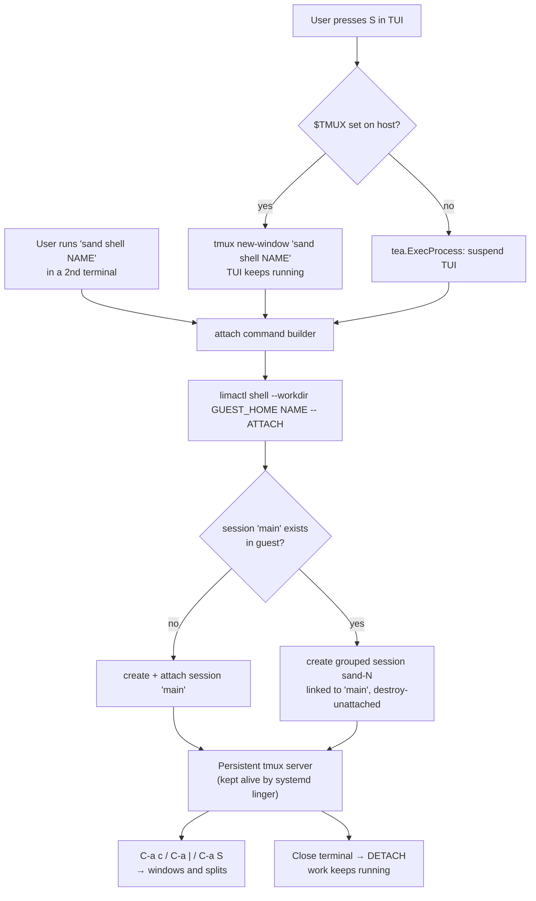

# Plan: tmux-backed multi-shell access to sand VMs

## Original Work Order

> Make it easier for users to spawn multiple shells / windows into a sand VM. Today the TUI's `S` key execs a bare `limactl shell <name>` via tea.ExecProcess (internal/ui/commands.go:177) — one exclusive, blocking shell, and there is no `sand shell` subcommand (cmd/sand/main.go has a hand-rolled switch with only `create`/`version`), so a second terminal has no sand-level way in. Meanwhile the guest is ALREADY provisioned for multi-window work and the Go side never uses it: tmux is installed (roles/base/defaults/main.yml:30), a tuned ~/.tmux.conf is deployed (roles/user/templates/tmux.conf.j2 — C-a prefix, mouse, splits, 50k scrollback), roles/user/templates/ssh_rc.j2 + tmux set-environment keep SSH agent forwarding working across re-attach, and commit a13b2b0 enabled systemd linger specifically so a detached tmux server survives logout. Nothing ever starts tmux automatically.
>
> Proposed scope, roughly in priority order:
> 1. Make `S` attach to a persistent guest tmux session (`limactl shell <name> -- tmux new-session -A -s main`) instead of a bare login shell — gives native new-windows/splits AND makes sessions survive TUI resume, terminal close, and laptop sleep. Design decisions to settle in the plan: default vs opt-in (it changes what C-a does under the user's fingers); and how later attachers get INDEPENDENT windows rather than a mirrored session (grouped sessions: `tmux new-session -t main -s <unique>`; note same-session attach clamps size to the smallest client).
> 2. Add a `sand shell <name>` subcommand (new case in the main.go switch + stdlib FlagSet; no cobra in this repo) so a second terminal tab has a real entrypoint. Bonus: `sand shell <name> -- <cmd>` for one-off guest exec.
> 3. Optional power-user path: if the TUI detects it is running inside host tmux ($TMUX set), `S` can `tmux new-window sand shell <name>` to open a real new host window WITHOUT suspending the TUI.
> 4. Surface Lima's per-instance ssh.config (~/.lima/<name>/ssh.config) on the VM detail screen — the code already parses it (internal/ui/transfer.go:188) — so users can plug VS Code Remote-SSH / any terminal in. More useful than a copy-paste limactl string.
>
> Also fix while in there: shellCmd passes no --workdir, so limactl's injected `cd <host-cwd>` can greet the user with a spurious `bash: cd: ... No such file or directory` on the first line (this pitfall is already documented in internal/lima/client.go:170-177).
>
> Explicitly OUT of scope: having sand spawn a host terminal emulator itself (iTerm/Terminal.app/gnome-terminal/wezterm/kitty detection) — permanent bug-report surface.
>
> Note a Bubble Tea program owns exactly one terminal, so tea.ExecProcess is inherently exclusive — multi-window MUST come from a multiplexer or a second host terminal, not from the TUI hosting shells itself.

## Plan Clarifications

| Question | Answer |
| --- | --- |
| Which of the four proposed items should this plan cover? | Items 1, 2, and 3 (tmux attach, `sand shell` subcommand, host-`$TMUX` new-window path), plus the `--workdir` fix. Item 4 (surfacing `ssh.config` on the detail screen) is **out of scope** — it is a tool-integration feature, not a multi-shell one. |
| Should `S` attach to tmux by default, or is a bare login shell still the default? | **tmux by default.** Every user gets persistence and windows without going looking for them. |
| When a second terminal attaches to a VM that already has a client attached, what does it get? | A **grouped session** — shared window set, independent current-window, no size clamping. Not a mirrored session, and not a fully isolated one. |
| Is backwards compatibility required for the current bare-shell behavior of `S`? | **No — clean break.** No `--no-tmux` escape hatch. `sand` is a pre-1.0 tool for disposable VMs, so the blast radius is small. The behavior change is documented in the README and CHANGELOG. |
| Include `sand shell <name> -- <cmd>` for one-off guest exec? | **No.** Not required by the multi-window goal; excluded under the PRE_PLAN YAGNI rule. |

## Executive Summary

`sand` gives a user exactly one way into a VM: the `S` key on the TUI's VM
screen, which suspends the whole TUI and hands the terminal to a single
`limactl shell <name>`. That shell is exclusive (a Bubble Tea program owns one
terminal, and `tea.ExecProcess` blocks until the child exits), it is
non-persistent (closing it ends the session and anything running in it), and it
is unreachable from any second terminal because `sand` exposes no shell
subcommand at all. A user who wants two windows into a VM today has no
supported path.

The fix does not require building a multiplexer, a terminal manager, or a
session broker, because the guest is *already provisioned* to solve this and the
Go side simply never uses it. Every VM has tmux installed, a tuned `~/.tmux.conf`
deployed, SSH-agent forwarding wired to survive re-attach, and — as of commit
`a13b2b0` — systemd linger enabled with a commit message that says, in as many
words, that it exists so a detached tmux server survives logout. The guest is
waiting for a client that never arrives. This plan makes `sand` that client.

The approach is therefore deliberately small: point sand's shell entrypoints at
a persistent guest tmux session instead of a bare login shell, and add a
`sand shell <name>` subcommand so a second terminal tab has somewhere to go.
Multiple windows then come free from tmux itself (`C-a c`, `C-a |`, `C-a S` —
all already bound in the shipped config), and a second host terminal gets a
*grouped* session so the two terminals share windows without mirroring or
clamping each other. The headline benefit is not actually the windows: it is
that a long-running Claude Code job in a sand VM now survives the TUI resuming,
the terminal closing, and the laptop sleeping.

## Context

### Current State vs Target State

| Current State | Target State | Why? |
| --- | --- | --- |
| `S` execs a bare `limactl shell <name>`; closing it ends the session and kills what was running | `S` attaches to a persistent guest tmux session; closing the terminal detaches, leaving work running | A disposable VM is where long Claude Code jobs run. Losing them to a closed lid is the single worst failure this tool has. |
| One shell at a time; `tea.ExecProcess` blocks the whole TUI until it exits | Windows and splits inside the attached session, via the already-shipped tmux bindings | This is the user's actual request: multiple windows. |
| A second terminal has no `sand`-level entrypoint — the only way in is to know and type `limactl shell claude` | `sand shell <name>` attaches from any terminal | A copy-paste `limactl` string is not a feature; a subcommand is. |
| A second attach would mirror the first (same current window, display clamped to the smallest client) | A second attach creates a *grouped* session: same windows, independent current-window, no clamping | Mirrored clients make a second terminal useless for a second window — it would defeat the whole purpose. |
| Guest tmux is installed, configured, agent-forwarding-aware, and linger-protected — and nothing ever starts it | sand starts and attaches it | The capability is already paid for. Not using it is pure waste. |
| The TUI must suspend itself to give you a shell, even when the host is itself running tmux | When `$TMUX` is set, `S` opens a new *host* tmux window and the TUI keeps running | The TUI is genuinely useful to keep visible next to a shell. Where the host can do that for free, take it. |
| `limactl` injects `cd <host-cwd>` into the guest login shell, so `S` can open with `bash: cd: … No such file or directory` | `--workdir` is passed explicitly, so the shell opens clean in the guest home | It is a visible papercut on the first line of every single shell, and the repo already documents the pitfall in `internal/lima/client.go:170-177`. |

### Background

Three facts constrain the design and are worth stating plainly, because each one
closes off an approach that would otherwise look attractive.

**A Bubble Tea program owns exactly one terminal.** `tea.ExecProcess` tears down
input handling, leaves the alt-screen, hands the real `os.Stdin`/`os.Stdout` to
one child, and blocks. There is no supported way for the TUI to host two
concurrent interactive shells, and building a PTY-multiplexing pane inside the
TUI would mean writing a terminal emulator. Multi-window access must therefore
come from a multiplexer in the guest or from a second host terminal — it cannot
come from the TUI hosting shells itself.

**Spawning a host terminal emulator is off the table.** Detecting and launching
iTerm vs Terminal.app vs gnome-terminal vs wezterm vs kitty vs Windows Terminal
is an unbounded compatibility surface and a permanent source of bug reports. The
one exception this plan takes is host tmux — because when `$TMUX` is set we are
not guessing at anything: the multiplexer is already there, and `tmux new-window`
is a stable, single, portable command.

**The guest work is already done.** `roles/base/defaults/main.yml` installs
tmux; `roles/user/templates/tmux.conf.j2` deploys a config with a `C-a` prefix,
mouse mode, 50k scrollback and window/split bindings;
`roles/user/templates/ssh_rc.j2` symlinks the live SSH agent socket to a stable
path, paired with tmux's `set-environment -g SSH_AUTH_SOCK`, specifically so
agent forwarding still works after a re-attach; and `loginctl enable-linger`
keeps the user manager (and thus a detached tmux server) alive after the last
login session drains. This plan should add **no new Ansible work** beyond what is
needed to make attachment reliable — the provisioning side is essentially
complete and the deficit is entirely on the Go side.

## Architectural Approach

The work is a thin client layer over guest tmux, expressed as one shared
attach-command builder used by three call sites (the TUI key, the new
subcommand, and the host-tmux fast path). The builder is the only place that
knows tmux exists; everything else calls it.

### Component 1: The guest attach command

**Objective**: Produce a single, correct command string that attaches a caller
to the VM's persistent tmux session with the right sharing semantics, so no
call site has to reason about tmux.

The semantics chosen in clarification are: the first client creates and attaches
a canonical session (name it `main`); every subsequent client creates a *grouped*
session linked to it. A grouped session shares the window set with `main` — the
same windows, the same running processes — but tracks its own current window and
is not size-clamped against the other clients. That is precisely the "two
terminals, two different windows, same VM" behavior the user asked for, and it is
the reason a plain `tmux new-session -A -s main` is **not** sufficient: two
clients attached to one session are mirrored, follow each other's window
switches, and clamp the display to the smallest attached client.

The decision procedure ("does `main` exist yet?") must run **in the guest**, not
on the host, because the host cannot see the guest's tmux server without a round
trip that would race anyway. The attach command is therefore a small guest-side
shell expression that branches on `tmux has-session -t main` and either creates
`main` or creates a uniquely-named grouped session against it. Two details this
component owns:

- **Grouped-session cleanup.** Grouped sessions are per-client and would
  otherwise accumulate as orphans every time a second terminal detaches. The
  grouped session must be created with `destroy-unattached` set on *itself* so it
  evaporates when its client leaves, while `main` — which must survive detach,
  that being the entire point — keeps the default. Getting this backwards would
  either leak sessions forever or destroy the user's work on detach, so it is
  called out explicitly.
- **Unique naming.** The grouped session needs a name that cannot collide with a
  concurrent attach. Deriving it in the guest (e.g. from tmux's own session list
  or the PID of the attaching shell) is safer than having the host guess a
  counter, since two `sand shell` invocations can race.

Where this expression lives — inlined in the Go builder, or deployed to the guest
as a tiny helper script by the `user` role — is an implementation choice for task
generation. A guest-side helper keeps the Go code free of embedded shell and puts
the tmux policy next to the tmux config that already ships; an inlined string
avoids touching Ansible at all and keeps the change in one language. The
trade-off should be made once, in one place, and both call sites must use the
result.

### Component 2: `sand shell <name>` subcommand

**Objective**: Give a second terminal a real, discoverable entrypoint, so
"open another window" is a command a user can type rather than a `limactl`
incantation they must know.

`cmd/sand/main.go` dispatches on a hand-rolled `switch os.Args[1]` with cases for
`create` and `version`; subcommand flags use the stdlib `flag.NewFlagSet` (there
is no cobra, urfave, or pflag in `go.mod`, and this plan adds none). `shell`
becomes a third case following the exact shape of the existing `create` case,
delegating to a `runShell` function alongside `runCreate` in `cmd/sand/`.

The subcommand takes the instance name as a positional argument, resolves the
guest home, builds the attach command from Component 1, and execs it with the
real TTY attached. Because there is no TUI to suspend in this path, it should
hand off the process directly rather than going through Bubble Tea. Two
behaviors it must get right, both of which are error paths the TUI already
handles and the CLI must not regress:

- A VM that is not running must produce a clear, actionable message rather than a
  raw `limactl` error — `internal/ui/detail.go:36-46` already sets this precedent
  by guarding on `Status != "Running"` and telling the user to start it.
- An unknown or non-sand instance name must fail cleanly.

The usage string in the existing `default:` case of the switch — which today
lists only `sand` and `sand create ...` — must gain the new subcommand, since
that string is the tool's only discovery surface for someone who typed something
wrong.

### Component 3: TUI integration and the host-tmux fast path

**Objective**: Make `S` do the best available thing given the host's terminal,
without the TUI ever trying to host two shells itself.

`shellCmd` in `internal/ui/commands.go:172-183` is the single existing exec site.
It gains two changes. First, it builds the guest attach command (Component 1)
rather than a bare `limactl shell <name>`, and passes `--workdir` explicitly (see
Component 4). Second, it branches on whether the *host* is running tmux:

- **`$TMUX` unset (the common case).** Behavior is as today: `tea.ExecProcess`
  suspends the TUI, hands over the terminal, and resumes when the user detaches
  or exits. The difference is that detaching now leaves the guest session — and
  its work — alive, so the resumed TUI is no longer a signal that the user's job
  died with the shell.
- **`$TMUX` set.** The TUI runs `tmux new-window sand shell <name>` on the
  *host* and does **not** suspend. The user gets a genuine new host window, the
  TUI stays running in its own window, and both can be flipped between with the
  host's own tmux bindings. This is a short-lived, non-interactive host command,
  not a `tea.ExecProcess` hand-off, so it should not disturb the alt-screen at
  all. It also means `sand shell` must be resolvable on `PATH` from the host —
  if `sand` was invoked by an absolute path outside `PATH`, the new window's
  command must use that same resolved path rather than the bare word `sand`.

The status-line copy set at `internal/ui/detail.go:44` ("opening a shell in … —
the TUI resumes when you exit") is now wrong on both branches and must be
rewritten per branch: the suspend branch resumes on *detach or exit*, and the
host-tmux branch does not suspend at all.

### Component 4: The `--workdir` papercut

**Objective**: Stop every shell from potentially opening with a shell error on
its first line.

`limactl shell` injects a `cd <host-cwd>` into the guest login shell, so when the
host's current directory does not exist in the guest the user is greeted with
`bash: cd: … No such file or directory`. This repo already knows about this
pitfall — `internal/lima/client.go:170-177` documents it at length as the reason
`ShellOut` keeps stderr separate — but the interactive path never applied the
lesson. `limactl shell` accepts a `--workdir` flag (verified against the
installed `limactl`), and the guest home is already resolvable: `guestHome` in
`internal/ui/transfer.go:188` reads it from Lima's per-instance `ssh.config`
with fallbacks. Passing that as `--workdir` fixes the papercut. Note this matters
more, not less, after this plan: tmux inherits the working directory of the
process that creates the session, and the shipped `tmux.conf` binds new windows
and splits to `-c "#{pane_current_path}"` — so a bad starting directory would
propagate into every window the user subsequently opens.

## Risk Considerations and Mitigation Strategies

Technical Risks

- **`limactl shell <name> <command>` may not allocate a PTY.** tmux refuses to
  run without a terminal (`open terminal failed: not a terminal`), so if Lima
  does not pass `-t` to ssh when a command argument is supplied, the entire
  approach fails at the first call. This is the single highest-risk unknown in
  the plan and everything else depends on it.
    - **Mitigation**: Verify against a real VM *before* building anything else —
      this must be the first executable step of the work, not a late integration
      test. If Lima does not allocate a PTY, the fallback is to bypass `limactl
      shell` for the interactive path and invoke `ssh -t` directly against Lima's
      per-instance `ssh.config` (`~/.lima/<name>/ssh.config`), which the codebase
      already reads and which puts the `-t` flag under our control. The fallback
      is known-viable, so the risk is to the implementation shape, not to the
      feasibility of the feature.
- **Grouped-session semantics are easy to get subtly wrong**, and the two failure
  modes are asymmetric: setting `destroy-unattached` on `main` would destroy the
  user's long-running work the moment they detach — the exact disaster this plan
  exists to prevent — while omitting it on the grouped sessions merely leaks
  orphan sessions.
    - **Mitigation**: Treat "detach from a second terminal, confirm `main` and its
      running process survive" as a mandatory validation step with an explicit
      assertion, not an eyeball check. Assert on the guest's `tmux list-sessions`
      output directly.
- **Racing attaches could collide on a grouped session name** if two terminals
  run `sand shell` simultaneously.
    - **Mitigation**: Derive the unique suffix inside the guest at attach time
      rather than computing it on the host, so the name is chosen atomically with
      respect to the tmux server that owns it.
- **`sand` may not be on `PATH`** when the TUI shells out to `tmux new-window
  sand shell <name>` on the host.
    - **Mitigation**: Resolve the running binary's own path and use it explicitly
      in the new-window command rather than emitting the bare word `sand`.

Implementation Risks

- **No test may require a real `limactl`** (AGENTS.md states this as a hard
  rule), yet the core of this change is precisely what gets exec'd — and the
  existing `shellCmd` deliberately bypasses the `lima.Runner` seam that makes
  everything else testable, because an interactive session needs the real TTY.
    - **Mitigation**: Split the change so the *command construction* is a pure,
      directly unit-testable function (instance name + guest home → argv), and
      keep the untestable part down to the `exec.Command`/`tea.ExecProcess` call
      that consumes it. Assert on the argv, not on the exec. Real-VM behavior is
      covered by the existing `limae2e` build-tagged tests, which are the correct
      home for the PTY verification above.
- **TUI golden snapshots will drift.** The status-line copy on the VM screen
  changes, and `internal/ui/testdata/*.golden` snapshots are ANSI-stripped
  renders of the view.
    - **Mitigation**: Expected and cheap — regenerate with `go test ./internal/ui
      -run TestTUI -update` and eyeball the diff, as AGENTS.md already directs.
      The diff is the review artifact for the copy change.
- **The two entrypoints can drift**, exactly as `sand create` and the TUI create
  path could — a failure mode AGENTS.md explicitly warns about ("keep them from
  drifting — both go through the same `provision`/`registry` seams by design").
    - **Mitigation**: Honor the same discipline: one shared attach-command builder
      is the seam, and both the TUI and `sand shell` must call it. Neither may
      construct a tmux command of its own.

User-Experience Risks

- **`S` becomes a breaking behavior change with no escape hatch** (an explicit,
  accepted decision, not an oversight). The tmux prefix `C-a` is now live in
  every sand shell, and `C-a` is "move to start of line" in readline — a user who
  does not know they are in tmux will find that key mysteriously broken.
    - **Mitigation**: Documentation is the whole mitigation here, so it must be
      good: the README must state plainly that `S` lands you in tmux, that the
      prefix is `C-a`, that `C-a c` opens a window and `C-a d` detaches, and that
      closing the terminal no longer ends the session. The CHANGELOG must call it
      out as a behavior change. If this proves too sharp in practice, adding a
      `--no-tmux` flag later is a small, purely additive change — nothing in this
      design forecloses it.
- **Users may not realize work is still running** after they detach, and could
  accumulate forgotten sessions or be surprised by a VM that will not go idle.
    - **Mitigation**: Out of scope to solve in the UI, but the VM screen already
      shows VM status; note the possibility in the docs so the behavior is at
      least discoverable rather than mysterious.

## Success Criteria

### Primary Success Criteria

1. Pressing `S` on a running VM's screen lands the user inside a tmux session in
   the guest, with the shipped `~/.tmux.conf` active (verified by the `C-a`
   prefix responding and the status bar being present).
2. From that session, `C-a c` opens a second window and `C-a |` splits a pane —
   i.e. the user can have multiple shells in one VM without a second terminal.
3. Detaching (`C-a d`) or closing the terminal outright leaves a process started
   in that session **still running** in the guest; re-attaching finds it alive.
4. `sand shell <name>` run from a second, independent host terminal attaches to
   the same VM, sees the same window set as the first client, and can view a
   *different* window than the first client without either terminal being
   size-clamped or forced to follow the other's window switches.
5. When the TUI is run from inside a host tmux session, `S` opens a new *host*
   tmux window containing the guest session, and the TUI remains running and
   visible in its original window rather than suspending.
6. No shell opened by any of the above paths prints `bash: cd: … No such file or
   directory` (or any other error) on its first line, regardless of the host
   directory `sand` was invoked from.
7. `sand` with a bad subcommand prints a usage string that lists `shell`.
8. `go build ./cmd/sand`, `gofmt -l .` (empty), `go vet ./...`, and `go test
   ./...` all pass, with no test requiring a real `limactl`.

## Self Validation

These steps require a real VM and must be executed against one; the unit tests
alone cannot demonstrate any of the criteria above.

1. **Verify the PTY assumption first, before trusting anything else.** Run
   `limactl shell <vm> tmux new-session -A -s probe` against a running sand VM
   from a real terminal and confirm it attaches rather than failing with `open
   terminal failed: not a terminal`. If it fails, the `ssh -t` fallback described
   in the risks section is in play and the rest of this validation must be re-run
   against that implementation.
2. **Confirm the attach and the config.** Start the TUI, press `enter` on a
   running VM, press `S`. Confirm a tmux status bar is visible. Press `C-a c` and
   confirm a second window appears in the status bar; press `C-a |` and confirm a
   vertical split. This demonstrates criteria 1 and 2.
3. **Prove persistence, which is the headline claim.** In the attached session,
   start a marker process that would not survive its shell dying — e.g. `sh -c
   'sleep 600'` with a distinguishable argument. Detach with `C-a d`, then quit
   the TUI entirely, then close the terminal window. Open a fresh terminal and run
   `limactl shell <vm> pgrep -af 'sleep 600'` and confirm the process is still
   listed. Re-attach with `sand shell <vm>` and confirm the window is still there.
   This demonstrates criterion 3.
4. **Prove grouped-session independence with an assertion, not a glance.** With
   one terminal attached, run `sand shell <vm>` in a second terminal. In the
   second, switch to a different window (`C-a 2`) and confirm the *first*
   terminal does not follow. Confirm neither terminal's display is clamped when
   the two host terminals are different sizes. Then run `limactl shell <vm> tmux
   list-sessions` and confirm exactly two sessions exist and that they are grouped
   (same window set). This demonstrates criterion 4.
5. **Prove grouped-session cleanup does not eat the user's work.** Detach the
   second terminal. Run `limactl shell <vm> tmux list-sessions` and assert that the
   grouped `sand-N` session is **gone** and that `main` is **still present** and
   still holds the marker process from step 3. This is the asymmetric-risk check
   from the risks section and must be asserted explicitly.
6. **Exercise the host-tmux path.** From inside a host tmux session, launch the
   TUI, select a running VM, and press `S`. Confirm a new *host* tmux window
   opens with the guest session in it, and that switching back to the original
   host window shows the TUI still running and responsive (not suspended, not
   corrupted).
7. **Confirm the workdir fix.** From a host directory that does not exist in the
   guest (e.g. a temp dir), run `sand shell <vm>` and confirm the first line of
   output is the shell/tmux, with no `bash: cd:` error. This demonstrates
   criterion 6.
8. **Confirm the error paths.** Run `sand shell` against a *stopped* VM and
   confirm a clear "must be running" message rather than a raw `limactl` error;
   run it against a nonexistent instance name and confirm a clean failure. Run
   `sand bogus` and confirm the usage string now lists `shell`.
9. **Confirm the build gates.** Run `go build ./cmd/sand`, `gofmt -l .` (must be
   empty), `go vet ./...`, and `go test ./...`. Regenerate the TUI goldens with
   `go test ./internal/ui -run TestTUI -update` and review the diff to confirm the
   only changes are the intended status-line copy.

## Documentation

Yes — this plan requires documentation updates, and because the change is a
deliberate breaking change to a key the user's fingers already know, the docs are
load-bearing rather than incidental.

- **`README-sand.md`** — the VM-screen keybinding table (`S` → "Open an
  interactive shell in the VM") and the prose at lines 138-139 ("Pressing `S`
  suspends the TUI and hands your terminal to `limactl shell <name>`; the TUI
  resumes when you exit the shell") are both now wrong and must be rewritten to
  describe the tmux attach, the persistence semantics, and the host-`$TMUX`
  branch. The tmux essentials must be stated for users who have never used it:
  prefix is `C-a`, `C-a c` for a new window, `C-a |` / `C-a S` for splits, `C-a d`
  to detach, and — most importantly — that closing the terminal no longer ends the
  session. A `sand shell` section is needed alongside the existing "Headless mode
  (`sand create`)" section, documenting it as the way to get a second terminal
  into a VM.
- **`README.md`** — already mentions guest tmux around lines 238-239; check that
  it does not contradict the new behavior.
- **`AGENTS.md`** — the "Go package layout" and entrypoint notes state that there
  is a headless `sand create` path and a TUI path and that they must not drift.
  That note should be extended to name `sand shell` as a third entrypoint and to
  record the shared attach-command builder as the seam that keeps it from drifting
  from the TUI's `S`, matching the existing `provision`/`registry` convention.
- **`CHANGELOG.md`** — release-please generates it from commits, so the breaking
  behavior change must be reflected in the commit message convention rather than
  hand-edited into the file.

## Resource Requirements

### Development Skills

- Go: stdlib `flag`/`FlagSet` subcommand wiring, `os/exec`, and the existing
  hand-rolled dispatch in `cmd/sand/main.go` (no CLI framework is present or to be
  added).
- Bubble Tea: `tea.ExecProcess` semantics, alt-screen handling, and the
  `teatest` golden-snapshot workflow in `internal/ui`.
- tmux: session vs grouped-session semantics, `destroy-unattached`, client
  attach/detach behavior, and size-clamping between clients on a shared session.
  This is the least common expertise on the list and the place a subtle bug is
  most likely to hide.
- Lima: `limactl shell` flags (`--workdir`), and the per-instance `ssh.config`
  that the fallback path would rely on.

### Technical Infrastructure

- A working `limactl` and a KVM-capable host, for the real-VM validation and the
  `limae2e`-tagged tests. The PTY question in particular cannot be answered
  without one.
- A host tmux, to exercise the `$TMUX` branch.
- The existing test stack: `charmbracelet/x/exp/teatest`, the fake `lima.Runner`
  used throughout `internal/*_test.go`, and the `limae2e` build tag.

## Notes

- The single most important non-obvious property of this design is that **`main`
  must never carry `destroy-unattached` and every grouped session must**. Reversing
  those two lines silently converts this feature from "your work survives a closed
  laptop" into "your work dies when you look away", with no error message. It is
  called out in the architecture, the risks, and the validation on purpose.
- The provisioning side is deliberately near-untouched. If a task in this plan
  starts growing new Ansible roles, that is a signal the design has drifted —
  the guest is already correct, and the deficit is in the Go client.
- Deferred, and explicitly not built here: surfacing Lima's `ssh.config` on the
  VM detail screen (for VS Code Remote-SSH and other tools), `sand shell <name> --
  <cmd>` for one-off guest exec, and any `--no-tmux` escape hatch. None of the
  three is foreclosed by this design; each is a small additive change if wanted
  later.
