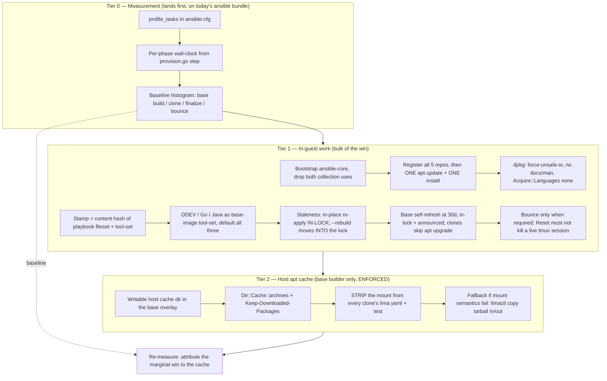
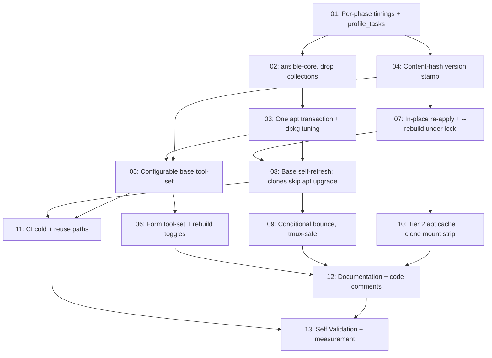

# Plan: Faster Base VM Provisioning (Tiers 0–2)

## Original Work Order

> Speed up sandbar base VM provisioning — implement Tiers 0, 1, and 2 from the analysis (Tier 3, publishing a golden image, is explicitly OUT of scope for this plan).
>
> Context on the current flow: `sand` (Go) drives limactl + an embedded Ansible playbook. `BuildBase` creates a `claude-base` Lima instance from the Debian 13 template, a Lima `mode: dependency` script installs `ansible` + `rsync`, then the playbook runs in-guest with `--connection=local` under `provision_phase=base`. The base is stopped and cloned per VM; each clone runs `provision_phase=finalize` (hostname, git identity, `apt upgrade dist`, optional repo clone) and is then bounced (stop+start). Base staleness is stamped from git HEAD plus a `-dirty` suffix, so ANY local playbook edit deletes and rebuilds the base from raw Debian.
>
> Diagnosis: on a gigabit connection the bottleneck is dpkg/unpack and serialized apt work, not download bandwidth.
> - Debian's `ansible` package is 17.7 MB download but ~200 MB installed (thousands of small collection files). Only two things from the bundle are used: `community.general.locale_gen` (roles/base/tasks/main.yml:29) and `ansible.posix.authorized_key` (roles/user/tasks/main.yml:65). `ansible-core` is 1.3 MB / 8.2 MB.
> - Seven separate apt update+install passes (3 in roles/base, 4 in roles/dev-tools), each adding a repo then refreshing all sources: NodeSource, Docker, ddev, cloudflared, GitHub CLI.
> - `base_packages` (roles/base/defaults/main.yml) includes `golang` and `default-jdk-headless` — metapackages pulling ~500–700 MB installed between them.
>
> Scope to plan:
>
> TIER 0 — Measurement (do first; everything else is a hypothesis until the histogram exists):
> - Enable `profile_tasks` in ansible.cfg so per-task timings are visible.
> - Emit per-phase wall-clock durations from provision.go's `step()` so base-build / clone / finalize / bounce costs are attributable.
>
> TIER 1 — No new infrastructure, expected bulk of the win:
> - Bootstrap `ansible-core` instead of `ansible` in the Lima dependency script (internal/provision/overlay.go); replace `community.general.locale_gen` with a `locale-gen` command task and `ansible.posix.authorized_key` with `lineinfile` so no collections are needed.
> - Consolidate: register all five apt repos + keyrings first, then a single `apt-get update` and a single install of all packages — one dpkg transaction instead of seven.
> - dpkg tuning for the base phase: `force-unsafe-io`, `path-exclude` for docs/man, `Acquire::Languages "none"`.
> - Make `golang` and `default-jdk-headless` opt-in via a var rather than unconditional defaults.
> - Make in-place base re-apply the default when the playbook is dirty/changed (Ansible is idempotent, so only the delta runs); keep destroy-and-rebuild behind an explicit `--clean` flag, and always clean in CI. This collapses the playbook-dev inner loop from a full from-scratch rebuild to under a minute.
> - Cheap trims: skip the finalize bounce unless actually required (e.g. /var/run/reboot-required); gate finalize's `apt upgrade dist` on the base being older than N days instead of running it on every clone.
>
> TIER 2 — Host-side apt cache, base build ONLY:
> - Security rationale to preserve in the plan: the "no writable host mount" invariant protects WORK VMs (where Claude runs unsupervised, and where deleting the VM must provably remove everything it produced). The base builder is a trusted, identity-free, throwaway machine running only our own playbook, and clones never inherit the mount because it lives in the base overlay only. Public .deb files on the host are not an exfiltration channel.
> - Mechanism: in the base overlay only, mount a host cache dir writable, point `Dir::Cache::archives` at it via an apt.conf.d fragment, and set `Binary::apt::APT::Keep-Downloaded-Packages "true"`. Do NOT use apt-cacher-ng (five of the repos are HTTPS, needing remap rules plus a host daemon).
> - Fallback if sshfs/virtiofs ownership semantics prove painful (macOS reverse-sshfs is the risk): `limactl copy` the archives tarball out after a successful build and push it back in before the next one — same win, no mount semantics.
> - Sequence Tier 2 after Tier 1 so its actual marginal benefit is measurable rather than assumed.
>
> Cross-cutting requirements: the existing lima-e2e CI job must keep passing (including its assertion that apt keyrings are readable by the `_apt` sandbox user); the playbook fileset rsync filter in internal/provision/provision.go mirrors the go:embed directives in playbook_embed.go and the two must stay in step; secrets must continue to go over stdin, never argv.

## Plan Clarifications

| Question | Answer |
| --- | --- |
| `golang` and `default-jdk-headless` become opt-in — how should the new var default? | Users should be able to choose one or more of DDEV, golang, and Java; we provision based on those settings. |
| Optional tools are chosen per VM, but every VM clones from ONE shared `claude-base`. Where do selected tools get installed? | The tool-set configures the **base image**, not the clone. Still one base image, but its contents differ per user — "a user who doesn't care about Java never worries about it." |
| What is the default tool-set when no tool flags are given? | **All three** (DDEV, Go, Java) — current behavior. No BC break; the win is opt-out. |
| In-place re-apply can't undo a removed task or a de-selected tool. How should staleness be resolved? | **In-place re-apply is the default**, with `--clean` as the destroy-and-rebuild escape hatch (CI always uses clean). Residue from a shrunk tool-set is accepted until then. *(Refined: the escape hatch is the **existing** `--rebuild` flag — no new `--clean` flag is added. See below.)* |
| Finalize's `apt upgrade dist` runs on every clone; gating on base age alone still makes every clone pay when the base is old. Which shape? | **Refresh the base, skip in clones**: when the base is older than N days (N=7), run the upgrade once on the base; clones then skip `apt upgrade` entirely. *(Refined: **N=30**, and the refresh blocks and announces under the base lock. See below.)* |
| Is backwards compatibility required? | Yes for the tool-set (defaults to all three, matching today's VM contents). Behavioral changes to base staleness handling (in-place re-apply as default) and to where `apt upgrade` runs are accepted and intentional. |
| *(Refinement, 2026-07-13)* Where should the tool-set be configured, given it is base-wide but `sand create` is per-VM? | **Create flags plus form toggles** — `--with-ddev` / `--with-go` / `--with-java` on `sand create`, and toggles in the create form following the existing reset-mode toggle pattern. The form must **state plainly that changing them re-converges (or rebuilds) the shared base image**, so the base-wide blast radius is never a surprise. |
| *(Refinement, 2026-07-13)* The base lock is held across base prep **and** the clone, so a self-refresh runs inside it — the user waits, and concurrent creates queue behind them. How should the refresh behave? | **Block and announce.** The create that finds an over-age base refreshes it in-lock and says so via `step()`. Concurrent creates already queue behind a rebuild today, so this is no worse than the status quo, and it is race-free. |
| *(Refinement, 2026-07-13)* Is the 7-day refresh threshold right? | **No — use 30 days.** |
| *(Refinement, auto-resolved from the codebase)* Does `--clean` need to be added? | **No.** `cmd/sand/create.go:83` already ships `--rebuild` — *"Delete and rebuild the base image first, then create"* — which is exactly the specified escape hatch. Adding `--clean` would be a synonym and is scope creep (PRE_PLAN/YAGNI). The plan uses the existing **`--rebuild`** throughout; the user's `--clean` wording in the decisions above refers to this behavior, not to a new flag. |
| *(Refinement 2, 2026-07-13)* **Clones DO inherit the base's mounts** — `limactl clone` copies the base's whole instance dir including `lima.yaml`, and the only post-clone edit is cpus/memory/disk. Tier 2's writable apt-cache mount would therefore land on every work VM, contradicting the plan's stated security argument. Given bandwidth is also *not* the diagnosed bottleneck, does Tier 2 survive? | **Yes — Tier 2 ships unconditionally, with a clone-side strip.** Keep the writable mount in the base overlay, and **explicitly remove it from the clone's `lima.yaml`** by extending the post-clone `limactl edit --set`. A test asserts no clone carries a writable mount. The plan's previous claim that "clones never inherit the mount" is **false and is deleted**; the invariant is now *enforced*, not merely *assumed*. |
| *(Refinement 2, 2026-07-13)* The base stamp is git-HEAD-plus-`-dirty`, and it is **inert outside a git checkout** (`baseStale` returns false on a git error; `BuildBase` cannot stamp). Stages 6–8 (the tool-set, in-place re-apply, and the 30-day refresh) all depend on that stamp — a released-binary user toggling `--with-java` would get no effect whatsoever. | **Replace the stamp with a content hash of the playbook fileset + the tool-set selection.** This works for git checkouts *and* released binaries, makes the `-dirty` suffix unnecessary, stops unrelated git commits from forcing spurious rebuilds, and makes the tool-set participate in staleness natively. It fixes three defects with one change. |
| *(Refinement 2, 2026-07-13)* `--rebuild` deletes the base **outside** the base lock (`cmd/sand/create.go:177-183`, before the provisioner takes the flock) — the exact delete-while-another-create-is-cloning race `baselock.go` was written to close. The plan leans on `--rebuild` as its escape hatch. Fix here or defer? | **Fix it in this plan.** Push the rebuild *intent* down into `ensureBaseStopped` (which already runs under the lock) rather than deleting in the CLI layer. This plan is already rewriting that function; leaving the escape hatch racy would directly undercut the concurrency success criterion. |
| *(Refinement 2, 2026-07-13)* The bounce's docker-group rationale turns out to be **already void** (the group is added in the *base* phase, so it is baked into the image before a clone ever boots). Main's new tmux feature also means `Reset`'s unconditional bounce would destroy a user's live tmux session. What happens to the bounce? | **Create: bounce only when actually required** (`/var/run/reboot-required`), after verifying the hostname change does not need it. **Reset: make its bounce conditional too, and do not silently destroy a live tmux session** — warn or refuse rather than killing the user's running work. |
| *(Refinement 2, 2026-07-13)* The tool toggles live in the create *form*, but `--rebuild` — required to actually remove a de-selected tool — exists **only** as a headless CLI flag. A TUI user would be told to run a command the TUI cannot reach. | **Add a "Rebuild base image" toggle to the form**, mapping to the existing `--rebuild`. The plan already generalizes the form's toggle list (today hard-coded to the two `preserve*` booleans in reset mode), so this is one more entry — and the shrink advisory can then point at something the user can actually act on. |

## Executive Summary

Base VM provisioning is slow even on a gigabit link because the cost is not bandwidth — it is dpkg unpack time, serialized apt transactions, and a base-rebuild policy that throws away the entire machine whenever the playbook changes. This plan attacks all three without introducing any new infrastructure or published artifacts: it first makes the cost *visible* (Tier 0), then removes the largest known sources of unpack and repetition (Tier 1), then adds a host-side apt archive cache scoped strictly to the base build (Tier 2).

The approach was chosen over shipping pre-provisioned images (deliberately deferred as Tier 3, out of scope here) because the measurable bottleneck is work performed *inside* the guest, and because every improvement here also compounds with a golden image later: a leaner, single-transaction, cache-backed playbook is exactly what a published image would want to run on top of. Sequencing matters and is part of the plan — Tier 0 lands before Tier 1 so the histogram exists before the optimizations, and Tier 2 lands after Tier 1 so its marginal benefit is measured against an already-fast build rather than credited with someone else's win.

Expected outcomes: the Ansible bootstrap drops from ~200 MB installed to ~8 MB; six base-phase apt update+install passes collapse into one; dpkg stops fsyncing and stops unpacking documentation; DDEV/Go/Java become a base-image tool-set that a user who does not need them never pays for; and the playbook-development inner loop stops being a from-scratch rebuild, becoming an idempotent in-place delta re-apply measured in seconds rather than minutes. Package downloads survive base rebuilds in a host cache, so a rebuild is CPU-bound rather than network-bound.

Two structural defects surfaced during refinement and are repaired as part of this work, because the plan's own design rests on them. First, the base version stamp is a git-HEAD hash and is **inert outside a git checkout** — for a released binary the base is never rebuilt and never stamped, which would make the tool-set silently inoperative for exactly the users who install `sand` rather than clone it. It is replaced by a content hash of the playbook fileset plus the tool-set selection, which works everywhere, removes the `-dirty` hack, and stops unrelated commits from forcing spurious rebuilds. Second, **clones inherit the base's `lima.yaml` mounts** — so Tier 2's cache mount does not stay on the base by itself, as originally assumed; it must be actively stripped from each clone, and a test must enforce that. The security invariant is now enforced rather than assumed.

## Context

### Current State vs Target State

| Current State | Target State | Why? |
| --- | --- | --- |
| No timing data: the build is a wall of streamed output with no attribution | `profile_tasks` on in `ansible.cfg`; `provision.go` prints per-phase wall-clock (base build, clone, finalize, bounce) | Every optimization below is a hypothesis until the histogram exists; measurement is also how Tier 2's marginal value gets judged |
| Lima dependency script installs Debian's `ansible` (17.7 MB download, ~200 MB installed as thousands of small collection files) | Dependency script installs `ansible-core` (1.3 MB / 8.2 MB); playbook uses zero collections | ~190 MB of small-file unpacking with fsync is removed from the critical path before the playbook even starts |
| `community.general.locale_gen` and `ansible.posix.authorized_key` are the only two collection uses | `locale-gen` command task and a `lineinfile` on `~/.ssh/authorized_keys` | These two tasks are the sole reason the fat `ansible` bundle is needed; removing them unblocks `ansible-core` |
| **Six** apt `update_cache` passes in the base phase (2 in `roles/base` — base packages, Node.js; 4 in `roles/dev-tools` — Docker, ddev, cloudflared, gh), each adding a repo then refreshing all sources. A 7th (`apt upgrade dist`) runs in finalize | All keyrings and repos registered first; a single `apt-get update`; a single install transaction | Six index refreshes and six serialized dpkg runs become one; apt parallelizes downloads across the whole package set |
| dpkg runs with default fsync, unpacks docs/man, apt fetches translations | `force-unsafe-io`, `path-exclude` for `/usr/share/doc` and `/usr/share/man`, `Acquire::Languages "none"` (base phase) | Fsync-per-file and man-db/doc churn are a large share of dpkg wall-clock on a virtio disk; the base is a disposable builder where unsafe-io is an acceptable trade |
| `golang` and `default-jdk-headless` are unconditional `base_packages`; DDEV is unconditional in `dev-tools` | DDEV, Go, and Java form a configurable **base-image tool-set**, defaulting to all three | ~500–700 MB installed between Go and Java alone. Users who do not need a runtime should not pay for it — but defaulting to all three keeps existing VMs byte-for-byte equivalent (no BC break) |
| The base stamp is `git rev-parse HEAD` plus a `-dirty` suffix. Outside a git checkout the lookup errors, `baseStale` returns **false**, and `BuildBase` cannot stamp at all | The stamp is a **content hash of the playbook fileset plus the tool-set selection** | Today a released/Homebrew binary *never* rebuilds its base and never writes a stamp — so the tool-set would be silently inoperative for exactly those users. A content hash also removes the `-dirty` hack and stops an unrelated commit (which changed no playbook file) from forcing a spurious rebuild |
| Any playbook change (git HEAD or dirty tree) deletes the base and rebuilds it from raw Debian (inside the base lock, in `ensureBaseStopped`) | Staleness triggers an **in-place re-apply** of the playbook onto the existing base, still inside that lock; `sand create --rebuild` forces destroy-and-rebuild; CI always rebuilds | Ansible is idempotent — a playbook edit needs only its delta applied. This turns the playbook-development inner loop from a full rebuild into a short converge, and *shortens* the lock's critical section rather than lengthening it |
| `--rebuild` deletes the base in the CLI layer (`cmd/sand/create.go:177-183`), **before** the provisioner takes the base lock | The rebuild *intent* is passed down into `ensureBaseStopped` and acted on **under the lock** | As written, `--rebuild` can delete a base that another create is concurrently cloning from — precisely the race `baselock.go` exists to close. The plan's escape hatch must not itself be the hole |
| Every clone runs `apt upgrade dist` in finalize | When the base is older than **30 days**, the upgrade runs once **on the base** (in-lock, announced); clones skip `apt upgrade` entirely | The upgrade cost is paid once and amortized across every VM cloned from that base, instead of being re-paid per clone forever |
| Provision output went to a terminal; timing data did not exist | Per-phase timings are plain writes into the retained per-job log (`internal/ui/jobs.go` `job.output`, reopenable with `l`), plus a compact end-of-run summary; headless writes to `os.Stdout` | The TUI now streams a build onto its tile rather than seizing the terminal. Timing lines must land where they are actually readable, and must not be `==> `-prefixed (see Background) |
| Every clone is bounced (stop + start) unconditionally after finalize, and `Reset` bounces too | The bounce happens only when actually required (`/var/run/reboot-required`). `Reset`'s bounce becomes conditional and must not silently destroy a live tmux session | A stop+start is tens of seconds of pure latency on the common path where nothing needs a reboot. The bounce's stated docker-group rationale is **already void** (see Background), and once `apt upgrade` leaves finalize the kernel/libs rationale goes with it |
| Packages are re-downloaded from the network on every base rebuild | Host-side apt archive cache mounted writable in the base overlay (`Dir::Cache::archives` + `Keep-Downloaded-Packages "true"`), **and explicitly stripped from every clone's `lima.yaml`**, enforced by a test | A base rebuild becomes CPU-bound rather than network-bound. Clones **do** inherit the base's mounts (`limactl clone` copies its whole instance dir), so the invariant that work VMs carry no writable host mount must be *enforced* by removing the mount, not assumed |

### Background

**The measured cost model.** On a fast connection the build spends its time in the guest, not on the wire. Verified figures: Debian's `ansible` is 17.7 MB download / 200.7 MB installed, versus `ansible-core` at 1.3 MB / 8.2 MB. `golang` and `default-jdk-headless` are metapackages whose real payload (`golang-1.24`, the JDK) is several hundred megabytes installed. `grep -c update_cache` over the roles confirms three apt passes in `roles/base` and four in `roles/dev-tools`.

**Why `profile_tasks` needs care after the `ansible-core` swap.** `profile_tasks` is a callback plugin shipped in the `ansible.posix` collection, not in `ansible-core` (verified: it is absent from `ansible/plugins/callback/` and present in `ansible_collections/ansible/posix/plugins/callback/`). Tier 0 therefore lands *while the fat `ansible` bundle is still installed* and works immediately. After Tier 1 swaps to `ansible-core`, profiling must become an opt-in mode that provisions the `ansible.posix` collection on demand; the default fast path stays collection-free. This ordering constraint is deliberate and must be preserved.

**The security invariant, what Tier 2 does to it, and the assumption that turned out to be false.** `overlay.go` documents that these VMs run Claude unsupervised, that there is no writable host mount, and that deleting a VM therefore provably removes everything it produced. That invariant protects **work VMs**. The base builder is a different kind of machine: it is identity-free, it runs only our own playbook, no user code and no agent ever executes on it, and it is a disposable build artifact. The data crossing the boundary is public `.deb` files, which is not an exfiltration channel. So a writable cache mount *on the base builder* is sound.

What is **not** sound is the mechanism the plan originally assumed would keep it there. The first draft asserted that "clones never inherit the mount because it lives in the base overlay only." **This is false.** There is exactly one overlay renderer (`RenderBaseOverlay`); `limactl clone base name` copies the base's entire instance directory *including its `lima.yaml`*, and the only post-clone configuration write is `limactl edit --set '.cpus=… | .memory=… | .disk=…'` (`internal/lima/client.go:139`, `:146-149`). Mounts are therefore inherited by every clone — and this is not a theoretical reading of the code, it is *load-bearing today*: the finalize phase rsyncs from `/mnt/playbook` **inside the clone**, which only works because the clone inherited the base's read-only playbook mount.

The consequence for Tier 2 is direct: adding a writable mount to the base overlay would put a writable host mount on **every work VM** — the exact thing the invariant forbids, on the exact machines it exists to protect. Tier 2 therefore must **actively strip** the cache mount from each clone's `lima.yaml` (an extension of the existing post-clone `limactl edit --set`), and a test must assert that no clone carries a writable mount. The invariant becomes *enforced* rather than *assumed*, which is the only form of it worth having.

**The bounce's docker-group rationale is already void.** The plan's original text said the unconditional stop+start after finalize might be needed so the user's new `docker` group membership takes effect in the first interactive shell, and that this "must be verified." It has been: the group add lives in `roles/dev-tools/tasks/main.yml:49-53`, and the whole `dev-tools` role is gated `when: provision_phase != 'finalize'` (`site.yml:22-23`). The group is therefore written during the **base** build and baked into the image; a clone's `/etc/group` already contains it before the clone first boots, and every `limactl shell` is a fresh login with a fresh `initgroups()`. Finalize never touches groups. The bounce's own code comment (`provision.go:209-211`) does not claim docker either — it cites the finalize `apt upgrade` (new kernel/libs) and the hostname change. Since this plan *removes* `apt upgrade` from finalize, the only surviving rationale is the hostname, which must be checked before the bounce is dropped.

**tmux is now load-bearing, and it changes what a bounce costs.** Main has since gained a persistent-tmux shell (`internal/lima/attach.go`): both `sand shell` and the TUI's `S` verb attach to a long-lived `main` session that survives disconnects, kept alive by `loginctl enable-linger` (`roles/user/tasks/main.yml:28-33`, asserted in CI). Three consequences. (a) `tmux` and `ncurses-term` in `base_packages` are now load-bearing — the tool-set work must not slim them away, and `~/.tmux.conf` and the linger enablement are base-phase-only tasks that must stay in whatever "base" becomes. (b) The tmux **server** is started lazily on first attach, i.e. *after* provisioning — so it does not cache stale pre-finalize credentials today, and no `tmux.service` user unit may be introduced that would start it at boot and make it do so. (c) A bounce of a **running** VM now destroys the user's persistent session and everything running in it. `Reset` bounces unconditionally (`provision.go:437-444`) and would do exactly that, so its bounce must become conditional too — this is a hazard main introduced, which this plan is the right place to close.

**Rejected alternative for Tier 2: apt-cacher-ng.** Five of the repositories (NodeSource, Docker, ddev, Cloudflare, GitHub CLI) are HTTPS, which a caching proxy cannot cache without remap rules plus a host-side daemon. The archives cache achieves the same result with no daemon and no repo rewriting.

**Accepted trade-off of in-place re-apply.** Ansible converges only what its tasks assert. It will not uninstall a package whose task was deleted, nor remove a tool the user de-selected from the base tool-set. Shrinking the tool-set therefore leaves residue on the base until `--rebuild` is used. This was explicitly accepted; `sand` must *tell* the user when the selection shrinks rather than silently leaving stale software installed.

### Facts re-verified against current main (2026-07-13 refinements)

The branch has since been rebased again, onto **`ae49566`** (which brought `release 0.3.0` and the persistent-tmux shell feature, plan 14). The provisioning surface this plan targets — `internal/provision/*`, `internal/ui/ansible.go`, `internal/ui/jobs.go`, `internal/ui/form.go` — was **not touched** by those commits (`git diff --stat 3dc3f0b..007a8ed` over those paths is empty), so everything below still stands. What the tmux work *does* change is the cost and safety of the bounce, covered in Background above.

The notes below were written against the earlier rebase onto `e8701de`. Every cost claim was re-checked and still holds: `roles/`, `site.yml`, and `ansible.cfg` are untouched by the intervening commits, so the seven apt passes (three in `roles/base`, four in `roles/dev-tools`), the two collection uses, the unconditional `golang` / `default-jdk-headless` in `roles/base/defaults/main.yml`, the Lima dependency script installing the full `ansible` package (`internal/provision/overlay.go`), and the git-HEAD-plus-`-dirty` staleness stamp (`internal/provision/baseversion.go`) are all unchanged. What *did* change is the machinery around them, and three changes bear directly on this plan:

**1. The base image now has a lock, and it covers the clone too.** `internal/provision/baselock.go` takes an exclusive `flock` on `<base-version-stamp>.lock`; `prepareBaseAndClone` (`internal/provision/provision.go`) holds it across **both** `ensureBaseStopped` (which decides to build, rebuild, or merely stop the base) **and** the subsequent clone — because the stale-base path can otherwise delete a base while another create is cloning from it. Two consequences for this plan. First, in-place re-apply (Stage 7) and the base self-refresh (Stage 8) both mutate the base, so both belong *inside* that lock and are covered automatically by living in `ensureBaseStopped` — no new locking is needed, and none may be added. Second, every freshness/staleness decision must be *read after* the lock is acquired, never cached before it: a waiter that blocked for minutes behind someone else's rebuild must re-read the stamp, or it will redundantly re-run a refresh that just happened. This is the double-checked-locking discipline `ensureBaseStopped` already follows, and Stages 7 and 8 must not break it. (Refinement note: `--rebuild`'s destroy is the one base mutation that does *not* currently obey this, which Stage 7 fixes.)

**2. The TUI is a tile board, and a build streams onto its tile rather than seizing the terminal.** The create form (`internal/ui/form.go`) survives and is still the interactive surface, reached with `n` from the board. Output flows through an `io.Pipe` per job into `internal/ui/jobs.go`, where each job keeps an **unbounded, retained `strings.Builder`** (`job.output`) — the full stream, viewable on the progress screen and reopenable afterwards with `l`. The tile itself shows only two rows (a progress bar and one status line) fed by `internal/ui/ansible.go`, a line parser that recognizes exactly four prefixes: `TASK [`, `RUNNING HANDLER [`, `==> `, and `SAND_ANSIBLE_TASK_TOTAL=`. Everything else is discarded *by the parser* while still landing in the log.

**3. Therefore `step()` is the wrong vehicle for timing lines.** `step()` emits the `==> ` banner, and `internal/ui/ansible.go` treats a `==> ` line as a progress **reset** — it clears role/task/index/total. Per-phase timing lines emitted through `step()` would blank the tile's progress bar mid-run. Timings must be plain writes to the same `io.Writer` (landing in the retained log, and on `os.Stdout` for `sand create`), with a compact summary at the end of the run.

**4. `--clean` already exists under another name.** `cmd/sand/create.go:83` ships `--rebuild` ("Delete and rebuild the base image first, then create"), alongside `--recreate` (which targets the clone, not the base). The escape hatch this plan needs is already there; the plan uses it rather than adding a synonym.

The second refinement pass turned up four more facts, three of which change the design (they are the subject of the new clarifications above):

**5. Clones inherit the base's `lima.yaml`, mounts included.** Covered in full in Background. This falsifies Tier 2's original security argument and forces an explicit clone-side mount strip plus a test.

**6. The version stamp is inert outside a git checkout.** `baseStale` (`provision.go:302-307`) treats a `playbookVersionFn` error — which is what a non-git playbook dir produces — as **not stale**, deliberately ("better to reuse the base than to rebuild it on every create"), and `BuildBase` cannot write a stamp without a version. For a released binary, then, the base is never rebuilt and the stamp file is never written. Every mechanism this plan builds on the stamp (in-place re-apply, the 30-day refresh, tool-set staleness) would be dead code for those users. Hence the move to a content hash of the playbook fileset — which is *also* strictly better in a git checkout, because it invalidates on the thing that actually matters (playbook content) rather than on `HEAD` moving for unrelated reasons.

**7. `--rebuild` deletes the base outside the lock.** `doHeadlessCreate` (`cmd/sand/create.go:177-183`) calls `ld.Delete(cfg.BaseName, true)` before it ever calls the provisioner, and the flock is only taken inside `prepareBaseAndClone` (`provision.go:244`). So `--rebuild` can delete a base while another create is cloning from it — the very race `baselock.go:19-20` documents itself as closing. Fixed in this plan by pushing the rebuild intent into `ensureBaseStopped`.

**8. CI does not use `--rebuild` today**, contrary to what the first draft of this plan asserted. `.github/workflows/test.yml:99-104` runs a plain `sand create`; the base is cold only because the runner is ephemeral. That is fine today, but once base *reuse* becomes the default path, CI would still exercise only the cold build and would never touch the in-place re-apply. CI must therefore be made explicit: pass `--rebuild` to keep the cold path honest, **and** add a second create that exercises the re-apply/reuse path, which no test covers today. (Also noted for cleanup: the workflow's post-run step dumps `/var/log/sand-provision.log` and `/var/log/sand-finalize.log`, which nothing in the codebase ever writes — it is a `|| true` no-op.)

## Architectural Approach

The work divides into three stages that must land in order. Tier 0 is instrumentation and is independently shippable. Tier 1 is the bulk of the win and is where behavior changes. Tier 2 is an additive cache whose value is judged against the Tier 1 baseline.

### Stage 1 — Tier 0: Make the cost visible

**Objective**: Produce an attributable timing breakdown before any optimization, so that Tier 1 and Tier 2 are validated against evidence rather than expectation.

Two independent instruments. Inside the guest, enable the `profile_tasks` callback via `ansible.cfg` so every task's duration and a sorted top-N summary print at the end of each playbook run. This is available today because the fat `ansible` bundle (which vendors `ansible.posix`) is still what the Lima dependency script installs — which is precisely why this stage must land before the `ansible-core` swap.

Outside the guest, `provision.go`'s `step()` already announces each lifecycle stage; extend the provisioner to record wall-clock for each: base image creation (Lima boot + dependency script), base playbook run, base stop, clone, clone start, finalize playbook run, and the bounce. These are the segments that Tier 1 targets, so each must be separately attributable.

*Where the timings must land (see Background, points 2–3).* The provisioner writes to an `io.Writer` that, in the TUI, is a per-job pipe whose bytes are retained in full in `job.output` and rendered on the progress/log screen (`l`); in the headless path it is `os.Stdout`. Timing lines must therefore be **plain writes**, not `step()` calls: `step()` emits the `==> ` banner that `internal/ui/ansible.go` treats as a progress *reset*, so routing timings through it would blank the tile's progress bar mid-run. Emit each phase's duration as an ordinary line, and close the run with a compact summary block (phase → duration) so the numbers survive in one readable place rather than being scattered through thousands of lines of Ansible output.

The deliverable of this stage is a recorded baseline for both a cold base build and a warm clone-only create, captured on real hardware, to be compared against after each subsequent stage.

### Stage 2 — Tier 1a: Slim the bootstrap and remove the collection dependency

**Objective**: Delete ~190 MB of small-file unpacking from the critical path by installing `ansible-core` instead of the `ansible` bundle.

The Lima `mode: dependency` script in `internal/provision/overlay.go` installs `ansible` and `rsync`. Swapping to `ansible-core` is only safe once the playbook stops referencing collection content. Two call sites exist. `community.general.locale_gen` becomes a task that ensures the locale is uncommented in `/etc/locale.gen` and runs `locale-gen`, with the appropriate `creates`/changed-when discipline so it stays idempotent. `ansible.posix.authorized_key` becomes a `lineinfile` (or equivalent) managing `~/.ssh/authorized_keys`; note this task is already skipped in the Lima flow (it only fires when `user_github_keys_url` is set for non-Lima/remote-host deploys), so its blast radius is limited to that deployment path and it must keep working there.

Because `profile_tasks` ships in `ansible.posix` and not in core, this stage must also preserve the ability to profile: introduce an explicit profiling mode that installs the `ansible.posix` collection into the guest on demand (via `ansible-galaxy`) and enables the callback, leaving the default path collection-free. The existing dependency script's fast-exit check (skip apt work when the tools are already present) must be updated so it recognizes the new tool-set rather than short-circuiting on a stale condition.

### Stage 3 — Tier 1b: Collapse six base-phase apt passes into one transaction

**Objective**: Turn six serialized repo-add → update → install cycles into a single index refresh and a single dpkg transaction.

The base phase currently performs **six** `update_cache: true` passes: `Install base packages` and `Install Node.js` in `roles/base`, and Docker, ddev, cloudflared and GitHub CLI in `roles/dev-tools`. (A seventh, `apt upgrade dist`, runs only in finalize and is dealt with in Stage 8. An eighth in `roles/samba` never fires, since `samba_enabled` is false for Lima.) The five third-party repositories (NodeSource, Docker, ddev, Cloudflare, GitHub CLI) each follow a fetch-key → dearmor → write-sources → `apt` with `update_cache: true` pattern. Restructure so that *all* keyring and sources-list material is written first, then exactly one `apt-get update` runs, then one `apt` install task takes the full package list — Debian base packages, `nodejs`, the Docker set, and whichever optional tools the base tool-set selected.

Three constraints bound this restructuring. First, **the repo-registration tasks need `curl` and `gnupg`** (for `gpg --dearmor`) to exist *before* the single install pass, and today they are supplied incidentally by `Install base packages` running first. The clean way to reach "exactly one apt transaction in the playbook" is to have the Lima `mode: dependency` script — which already runs its own `apt-get update && apt-get install` before Ansible ever starts — provide `curl`, `gnupg` and `ca-certificates` alongside `ansible-core` and `rsync`. Without that, two passes are structurally unavoidable, and Success Criterion 3 must be read as "one pass *in the playbook*".

Second, the CI assertion that apt keyrings remain readable by the `_apt` sandbox user must keep passing — the keyring file modes are load-bearing, and this is a regression the project has already been bitten by. Third, the role boundaries (`base` provides the OS/runtime layer, `dev-tools` the tooling layer) should survive the change in spirit even as the apt work is consolidated; the consolidation is about transactions, not about collapsing the roles into one.

### Stage 4 — Tier 1c: dpkg and apt tuning for the base phase

**Objective**: Remove fsync-per-file, documentation unpacking, and translation index fetching from the base build.

Write apt/dpkg configuration fragments during the base phase: `force-unsafe-io` in `/etc/dpkg/dpkg.cfg.d/`, `path-exclude` rules for `/usr/share/doc` and `/usr/share/man` (with the necessary `path-include` for copyright files if licence hygiene requires it), and `Acquire::Languages "none"` in `/etc/apt/apt.conf.d/`. These apply to the base builder, which is a disposable artifact — the risk profile of `force-unsafe-io` (corruption on an unclean power loss mid-install) is acceptable precisely because a corrupted base is discarded and rebuilt rather than recovered.

An explicit decision this stage must record: whether these fragments persist into cloned VMs or are removed at the end of the base phase. Persisting them keeps the finalize-phase and any user-initiated `apt install` fast; removing them restores stock Debian durability semantics for the machine the user actually works in. The default should be to keep the doc/man exclusions and language setting (they are safe and beneficial) but to drop `force-unsafe-io` before the image is used as a clone source, so that user VMs retain normal write durability.

### Stage 5 — Tier 1d: Re-base the version stamp on playbook content

**Objective**: Give the base a staleness signal that actually works, because every stage after this one is built on it.

`baseversion.go` currently stamps `git rev-parse HEAD` plus a `-dirty` suffix. This has three defects, and the third is disqualifying. It forces a rebuild when `HEAD` moves for reasons that touched no playbook file. The `-dirty` suffix means *any* working-tree edit anywhere in the repo reads as a new version. And outside a git checkout the lookup errors, at which point `baseStale` deliberately returns **false** (`provision.go:302-307`) and `BuildBase` cannot stamp at all — so for a released or Homebrew-installed `sand`, the base is never rebuilt and no stamp is ever written. Stages 6, 7 and 8 all key off that stamp; on a released binary they would be dead code, and a user toggling `--with-java` would see no effect whatsoever.

Replace the stamped value with a **content hash of the playbook fileset plus the tool-set selection**. The fileset is already precisely defined and already has a drift test: the `go:embed` set in `playbook_embed.go` and the rsync filter in `provision.go` are asserted equal by `TestGuestSyncCopiesOnlyThePlaybook`. Hash that same set — the bytes that actually reach the guest — and append the resolved tool-set. This single change fixes all three defects: it works identically in a git checkout and an embedded binary, it invalidates on playbook *content* rather than on commit identity, it renders `-dirty` unnecessary, and it makes the tool-set participate in staleness natively rather than needing a second bolted-on stamp field.

Two disciplines carry over. The version must be computed from the same source the guest will actually receive (working-tree playbook when present, embedded FS otherwise — the existing resolution order is unchanged), or the stamp will describe a tree the base was not built from. And a stamp is still written **only on a fully successful build or re-apply**, never speculatively.

### Stage 6 — Tier 1e: A configurable base-image tool-set

**Objective**: Let a user who does not need DDEV, Go, or Java stop paying for them — without changing what an existing user's VM contains by default.

DDEV, `golang`, and `default-jdk-headless` become a tool-set that configures the **base image**, not the individual clone. There remains exactly one base image per user; its contents simply differ by that user's selection. The selection is exposed as flags on `sand create` (`--with-ddev` / `--with-go` / `--with-java`) and as toggles in the create form, and defaults to all three, so a user who passes no flags gets today's VM contents exactly — no backwards-compatibility break.

*Surfaces (per the refinement clarifications).* Three concrete integration points exist and should be used rather than invented:

- **The form already has a toggle idiom, but only in reset mode.** `internal/ui/form.go` renders `[x] Label` rows (`toggleRow`) with a `toggleFocus` cursor that walks past the text inputs, and flips them on space/enter — but the handling is hard-coded to the two named `preserve*` booleans and is wired only into the reset path; create-mode key handling walks the text inputs alone. Adding tool toggles therefore means generalizing that to a toggle list and giving create mode the same focus path. Because the form is data-driven off three parallel index-ordered slices (field indices, labels, per-field help), the text-input side needs no new machinery.
- **The form must say what the toggles do.** These toggles configure the *shared base*, not just the VM being created — flipping one re-converges (or, when a tool is removed, requires rebuilding) the base image every future VM is cloned from. The per-field help text must state that plainly, so a base-wide effect is never a surprise from a per-VM screen.
- **The form also needs a "Rebuild base image" toggle** (per the refinement clarifications). De-selecting a tool requires `--rebuild` to actually remove it, and `--rebuild` exists today *only* as a headless CLI flag — so a TUI user would be told to run a command the TUI cannot reach. Since the toggle list is being generalized anyway, adding one more entry that maps to the existing `--rebuild` closes the hole, and lets the shrink advisory point at something the user can act on in place.
- **`vm.CreateConfig` is persisted and replayed.** The registry snapshots `CreateConfig` and Reset replays it, so tool-set booleans added there are captured for free. `provision.BuildExtraVars` (`internal/provision/vars.go`) is where they become Ansible vars, and it already has the precedent of a conditionally-emitted boolean (the Docker registry-proxy pair). Note that adding a form field today means editing **four** parallel index-ordered slices (`fieldLabels`, `fieldInfo`, the `seeds` slice in `newInputs`, and the index const block) plus `buildConfig` and `openResetForm` — the toggles avoid most of that, but the plumbing is worth knowing before estimating.

The selection participates in base staleness via the content-hash stamp from Stage 5, so changing the selection marks the base stale and triggers a re-apply for free. Because Ansible cannot converge a *removal*, a shrinking selection is the one case in-place re-apply cannot satisfy: `sand` must detect that the new selection is a strict subset of the stamped one and tell the user plainly that the de-selected tools remain installed until the base is rebuilt — pointing at the form's rebuild toggle, or `sand create --rebuild` headlessly. Silently leaving stale software installed is not acceptable; a clear message is.

Finally, the tool-set work must not slim away packages that are now load-bearing elsewhere: `tmux` and `ncurses-term` in `base_packages` are required by main's persistent-shell feature, and `~/.tmux.conf` plus `loginctl enable-linger` are base-phase-only tasks that must remain in whatever "base" becomes (CI hard-asserts `Linger=yes`).

### Stage 7 — Tier 1e: In-place base re-apply, with `--rebuild` as the escape hatch

**Objective**: Collapse the playbook-development inner loop from a from-scratch rebuild into an idempotent delta converge.

Today `ensureBaseStopped` compares the stamped playbook version (git HEAD, plus a `-dirty` suffix when the tree is dirty) against the current one and, on mismatch, deletes the base entirely and rebuilds it from the Debian cloud image. Since a working-tree edit always reads as dirty, every playbook iteration pays the full build.

The new default: on staleness, start the existing base, re-run the base-phase playbook against it (the same in-guest script, same stdin-fed vars, same rsync of the playbook fileset), re-stamp it, and stop it again. Ansible's idempotence means an unrelated edit converges in seconds. The **existing** `--rebuild` flag on `sand create` forces the destroy-and-rebuild path; no new flag is needed. The absent-base case is unchanged: it still builds from scratch.

*Locking, and the `--rebuild` race this stage must close (see Background, points 1 and 7).* The re-apply happens inside `ensureBaseStopped`, whose caller `prepareBaseAndClone` holds the exclusive base lock across base preparation *and* the clone — so the re-apply is serialized against every other create for free, and **no new locking may be introduced**.

But `--rebuild` does **not** currently enjoy that protection. It deletes the base in the CLI layer (`cmd/sand/create.go:177-183`), *before* the provisioner is ever called and therefore before the flock is taken — so it can delete a base another create is mid-clone from, which is exactly the race `baselock.go` was written to close. This stage must fix it: pass the rebuild *intent* down to `ensureBaseStopped` (which already owns the build/rebuild/stop decision, under the lock) instead of performing the delete outside. The plan's escape hatch must not itself be the hole in the plan's concurrency story.

Two further disciplines must survive: every staleness decision is read *after* the lock is taken (a create that waited minutes behind another rebuild must re-read the stamp rather than act on a pre-lock reading), and the lock is released on context cancellation so a cancelled build does not wedge every other create. Note the direction of travel is favourable: replacing a from-scratch rebuild with a delta converge **shortens** the critical section that other creates queue behind.

The re-apply path must not weaken any existing guarantee — vars still travel over stdin and never argv, the playbook fileset rsync filter stays in step with the `go:embed` directives in `playbook_embed.go`, and a failed re-apply must leave the base in a state that is either usable or unambiguously stale (never silently half-converged with a fresh stamp; stamp only on full success, so the next create retries).

### Stage 8 — Tier 1f: Base self-refresh and conditional bounce

**Objective**: Stop paying the same `apt upgrade` on every clone, and stop paying an unconditional reboot.

Freshness moves from the clone to the base. The base gains a **build timestamp** — a field the stamp does not carry today in any form, so it must be added alongside the content hash from Stage 5. When it exceeds an age threshold (**30 days**, configurable), the base is started and upgraded once — reusing the in-place re-apply machinery from Stage 7 — and re-stamped. Clones then skip `apt upgrade dist` entirely, because the image they came from is known-fresh. The upgrade cost is thereby paid once and amortized across every VM cloned from that base, instead of being re-paid by each clone forever.

*Behavior under the lock (decided in refinement).* The refresh runs **inside the base lock**, like every other base mutation, and the create that trips it **blocks and announces** — `step()` says the base is being refreshed, so the wait is explained rather than mysterious. Concurrent creates queue behind it, which is exactly what they already do behind a rebuild today, so this is no worse than the status quo and it avoids the lock-upgrade semantics a "refresh in the background while others clone" design would demand. The age check, like the staleness check, must be re-read *after* the lock is acquired: a create that waited behind someone else's refresh must observe the fresh timestamp and skip its own, or every queued create would redundantly re-upgrade.

*The bounce, and what refinement established about it.* The first draft of this plan said the unconditional stop+start after finalize existed for two reasons — a kernel/library upgrade may want a reboot, and the user's new `docker` group membership must take effect in the first interactive shell — and that the second "must be verified." It has been verified, and **it is void**: the `docker` group is added by `roles/dev-tools`, which is gated `!= 'finalize'`, so membership is written during the *base* build and baked into the image. A clone's `/etc/group` already carries it before the clone first boots, and every `limactl shell` is a fresh login with a fresh `initgroups()`. The bounce's own code comment never claimed docker either — it cites the finalize `apt upgrade` and the hostname change.

Since this stage removes `apt upgrade` from finalize, the kernel/libs reason goes with it, and the **only** surviving rationale is the hostname change — which must be checked (a `hostnamectl` change does not require a reboot; what needs confirming is whether anything in the first shell depends on the restart to observe it). Subject to that check, the create bounce is dropped and replaced by a `/var/run/reboot-required` test.

*`Reset`'s bounce is now a hazard, and this plan is the right place to close it.* `Reset` also bounces unconditionally (`provision.go:437-444`). Since main added the persistent-tmux shell, a stop+start of a **running** VM destroys the user's `main` tmux session and everything running inside it — the precise disaster the tmux feature exists to prevent. `Reset`'s bounce must therefore become conditional too, and must not silently kill a live session: detect one and warn (or refuse) rather than bouncing through it. Note the inverse also holds and must be reasoned about, not ignored: a long-lived tmux server freezes its supplementary groups and environment at fork time, so if a *re-apply against a running VM* ever changes group membership or environment, panes will not observe it without a restart. That tension is why the choice must be explicit rather than "always bounce" or "never bounce."

### Stage 9 — Tier 2: Host apt archive cache, base builder only — enforced, not assumed

**Objective**: Make a base rebuild CPU-bound rather than network-bound, while *actively enforcing* the security invariant that protects work VMs.

In the base overlay (`RenderBaseOverlay` in `internal/provision/overlay.go`), add a writable mount of a host cache directory (under the user's cache dir, e.g. an apt-archives directory owned by `sand`). During the base phase, write an `/etc/apt/apt.conf.d/` fragment pointing `Dir::Cache::archives` at the mount and setting `Binary::apt::APT::Keep-Downloaded-Packages "true"` so apt retains rather than deletes the `.deb` files it fetches. Subsequent base builds and re-applies find the packages already present and skip the download.

**The clone must have the mount removed — it does not simply fail to inherit it.** This is the correction that most changes this stage, and it invalidates the first draft's central claim. There is exactly one overlay renderer; `limactl clone` copies the base's whole instance directory *including `lima.yaml`*, and the only post-clone write is `limactl edit --set '.cpus=… | .memory=… | .disk=…'` (`internal/lima/client.go:139`, `:146-149`). Mounts are therefore **inherited by every clone** — demonstrably so, since finalize's rsync from `/mnt/playbook` inside the clone works only because of it. Left alone, Tier 2 would put a writable host mount on every work VM: the exact thing the invariant forbids, on the exact machines it exists to protect.

So this stage must extend the post-clone `limactl edit --set` to **strip the cache mount** from the clone's `lima.yaml` (while preserving the read-only playbook mount, which the clone still needs), and must add a test asserting that no clone carries a writable mount. The `overlayHeader` comment in `overlay.go` — which today states flatly that there is no writable host mount — must be amended *at the site where the mount is added* to state the exception, why it is sound for the base builder (identity-free, runs only our own playbook, executes no user or agent code, carries only public `.deb` files), and that the clone path strips it. Without that comment, a future reader will encounter a writable mount that contradicts the file's own header and "fix" it in one of two wrong directions.

The known risk is host mount semantics: Lima's default on macOS is reverse-sshfs, and apt requires a `partial/` subdirectory with `_apt`-compatible ownership plus working rename/lock behavior. If that proves painful in practice, the documented fallback is to avoid mount semantics entirely — after a successful base build, `limactl copy` an archives tarball out to the host cache, and push it back in before the next build. Same win, no permission surface, and no mount to strip. The choice between them is an empirical one to be settled during implementation, on both macOS and Linux hosts. Note that the fallback's copy cost is not free on a fast link, which is precisely why Stage 1's measurement is what settles it.

Finally, this stage is where the Tier 0 instrumentation earns its keep: re-measure against the Tier 1 baseline and record what the cache actually bought. Because the plan's own diagnosis is that bandwidth is *not* the bottleneck on a fast connection, a negligible Tier 2 win is a genuinely possible outcome — and it must be reported as such rather than papered over.

## Risk Considerations and Mitigation Strategies

Technical Risks

- **`profile_tasks` disappears with `ansible-core`**: the callback lives in the `ansible.posix` collection, not core, so the Tier 1 bootstrap swap would silently remove the Tier 0 instrument.
    - **Mitigation**: land Tier 0 first (while the fat bundle is still installed), and make post-swap profiling an explicit opt-in mode that provisions `ansible.posix` on demand; keep the default path collection-free.
- **`locale_gen` / `authorized_key` replacements are not faithful**: hand-rolled equivalents can be non-idempotent (reporting changed on every run) or subtly wrong (wrong file mode, wrong ownership).
    - **Mitigation**: assert idempotence explicitly — a second consecutive playbook run must report zero changed tasks for these tasks; keep the `authorized_key` replacement exercised on the non-Lima path it actually serves.
- **apt keyring permissions regress under consolidation**: reshuffling key/repo tasks is exactly the change that previously produced root-only keyrings unreadable by the `_apt` sandbox user.
    - **Mitigation**: the existing CI assertion must be kept and must run against the consolidated path; treat it as the acceptance test for Stage 3.
- **`force-unsafe-io` weakens durability for user VMs** if the fragment leaks into clones.
    - **Mitigation**: scope it to the base builder and remove it before the base becomes a clone source; keep only the doc/man exclusions and language setting in the image.
- **Reverse-sshfs/virtiofs ownership breaks apt's archive cache** on macOS hosts (the `partial/` directory, `_apt` ownership, rename/lock semantics).
    - **Mitigation**: the pre-approved fallback is the `limactl copy` tarball approach, which has no mount semantics at all; decide empirically on both macOS and Linux rather than by assumption.
- **A stale-but-fresh-stamped base**: a failed or partial in-place re-apply that still re-stamps would silently poison every subsequent clone.
    - **Mitigation**: stamp only on a fully successful re-apply; on failure, leave the old stamp (or clear it) so the next create retries rather than cloning a half-converged base.
- **The Tier 2 mount lands on every work VM.** Clones inherit the base's `lima.yaml` wholesale, so a writable mount added to the base overlay is *not* confined to the base — it is copied onto every machine Claude runs unsupervised on. This is the single most serious defect refinement found, and it was hidden behind a plausible-sounding but false assumption.
    - **Mitigation**: strip the mount from the clone's `lima.yaml` in the post-clone `limactl edit --set`, and assert its absence with a test — the invariant is enforced, not assumed. Amend the `overlayHeader` comment at the mount site so the exception (and the strip) is discoverable by the next reader. If mount semantics prove painful anyway, the `limactl copy` tarball fallback removes the surface entirely.
- **The content-hash stamp changes what "stale" means.** Moving off git HEAD is a behavioural change: a base built by the old scheme carries a stamp the new scheme cannot parse, and a hash that covers the wrong fileset would either never invalidate (silently serving a stale base) or always invalidate (rebuilding on every create).
    - **Mitigation**: an unparseable/foreign stamp must count as **stale** (the existing empty-stamp path already does this, so a one-time re-converge on upgrade is the natural outcome). Hash exactly the fileset the drift test already pins — the `go:embed` set that equals the rsync filter — so the hash cannot silently cover a different tree than the guest receives.

Implementation Risks

- **In-place re-apply cannot uninstall**: a deleted task or a de-selected tool leaves residue, so a base can drift from what the playbook describes.
    - **Mitigation**: accepted by decision, but not silently — detect a shrinking tool-set and tell the user to run `sand create --rebuild`; CI always rebuilds so the cold path stays exercised.
- **A long base mutation now blocks every other create** (the lock spans base prep *and* the clone): a self-refresh, or a slow re-apply, makes concurrent creates wait.
    - **Mitigation**: this is the status quo for rebuilds, and re-apply is *shorter* than the rebuild it replaces; announce the wait via `step()` (baselock.go already tells a waiter it is waiting), keep the lock released on context cancellation, and re-read the staleness/age decision after acquiring the lock so queued creates don't each redo the work.
- **A pre-lock freshness reading goes stale while waiting**: a create that computes "base is old" before blocking for minutes would refresh a base someone else just refreshed.
    - **Mitigation**: all staleness and age decisions are read inside `ensureBaseStopped`, i.e. after the lock is held — the discipline the current code already follows; Stages 7 and 8 must not hoist those reads out of it.
- **Tool toggles are a base-wide setting on a per-VM screen**: a user flips Java off while creating VM #2 and unknowingly re-converges the base every future VM clones from.
    - **Mitigation**: the create form's per-field help must state the base-wide effect explicitly, and the shrink case must print the `--rebuild` advisory rather than silently diverging.
- **Dropping the finalize bounce breaks the first interactive shell.** The docker-group half of this risk is now **retired**: the group is added in the base phase and baked into the image, so a clone has it before first boot and every `limactl shell` is a fresh login. The hostname half remains unverified.
    - **Mitigation**: verify only the hostname dependency before removing the unconditional bounce, and keep a `/var/run/reboot-required` check as the residual trigger.
- **`Reset`'s unconditional bounce destroys a live tmux session.** Main's persistent-shell feature means a stop+start of a *running* VM kills the user's `main` session and everything in it — the exact outcome that feature exists to prevent. `Reset` bounces unconditionally today.
    - **Mitigation**: make `Reset`'s bounce conditional and detect a live session — warn or refuse rather than bouncing through it. Conversely, do not assume "never bounce" is safe either: a long-lived tmux server freezes its supplementary groups and environment at fork time, so a re-apply that changes group membership on a running VM would not be observed by existing panes. The decision must be explicit.
- **`--rebuild` deletes the base outside the lock**, so the plan's own escape hatch can delete a base another create is mid-clone from.
    - **Mitigation**: push the rebuild intent into `ensureBaseStopped`, under the lock, rather than deleting in the CLI layer (Stage 7). Cover it with the concurrency validation step.
- **CI would stop exercising the paths this plan creates.** The workflow runs a plain `sand create` on an ephemeral runner — it never passes `--rebuild`, and with base reuse becoming the default it would never touch the in-place re-apply path at all.
    - **Mitigation**: make CI explicit — pass `--rebuild` to keep the cold build honest, and add a second create that exercises reuse/re-apply, which nothing covers today.
- **Base self-refresh introduces a surprise slow create**: a user creating a VM from a month-old base suddenly pays a base upgrade (and blocks others behind the lock).
    - **Mitigation**: announce it clearly via `step()` (the phase banners exist for exactly this — and they *are* the right vehicle here, unlike timing lines); the 30-day threshold makes it rare, and it stays configurable.
- **Timing output disappears into the tile**: the tile renders only a progress bar and one status line, and its parser discards everything that is not one of four known prefixes.
    - **Mitigation**: timings are plain writes into the retained job log (`l`) plus an end-of-run summary; they are deliberately *not* `==> ` banners, which the parser treats as a progress reset.
- **The embed/rsync filter drifts**: new playbook files (e.g. a callback-plugin directory) must be added to both `playbook_embed.go` and the rsync filter in `provision.go` or the guest silently gets a different tree.
    - **Mitigation**: any new top-level playbook path added by this work must update both, and be covered by a test that the two sets agree.
- **Scope creep into Tier 3**: the golden-image idea is adjacent and tempting.
    - **Mitigation**: explicitly out of scope; nothing in this plan may publish, host, or download a prebuilt image.

Quality / Validation Risks

- **Improvements are claimed rather than measured**: without before/after numbers, Tier 2 in particular could be credited with Tier 1's win.
    - **Mitigation**: the Tier 0 baseline is a deliverable, and re-measurement after Tier 1 and again after Tier 2 is part of Self Validation. A negligible Tier 2 win must be reported as such.
- **The lima-e2e job's runtime or disk footprint changes** (clone doubles the qcow2 footprint; the job already frees runner disk).
    - **Mitigation**: keep CI on the `--rebuild` path and confirm the job still fits its disk budget after the tool-set and cache changes.

## Success Criteria

### Primary Success Criteria

1. **Timing is attributable**: a `sand create` run emits per-phase wall-clock (base image creation, base playbook, base stop, clone, start, finalize, bounce) plus an end-of-run summary — visible on `os.Stdout` headlessly and in the retained job log (`l`) in the TUI, without disturbing the tile's progress bar — and, when profiling is enabled, a per-task Ansible profile. A recorded baseline exists for both a cold base build and a warm clone-only create.
2. **The bootstrap is lean**: the Lima dependency script installs `ansible-core`, the playbook references no collection content on the default path, and a fresh base build no longer unpacks the ~200 MB `ansible` bundle.
3. **One apt transaction**: a cold base build performs exactly one `apt-get update` and one package-install transaction *within the playbook*, covering Debian base packages, Node.js, Docker, and the selected optional tools — verifiable from the profiled task list. (The Lima dependency script's own pre-Ansible apt call is separate and supplies `curl`/`gnupg`/`ca-certificates` so the repo-registration tasks can run before that single install.)
4. **Staleness works everywhere**: the base stamp is a content hash of the playbook fileset plus the tool-set. It is written and honoured **outside a git checkout** (embedded/released binary), it does *not* change when an unrelated commit moves `HEAD` without touching a playbook file, and it *does* change when the tool-set selection changes. A base carrying an old-format (git-hash) stamp is treated as stale and converges once.
5. **The tool-set is configurable and backwards compatible**: `sand create` with no tool flags produces a VM containing DDEV, Go, and Java exactly as today; de-selecting a tool measurably reduces base build time and produces a base without it. `tmux` and `ncurses-term` survive every selection (the persistent-shell feature depends on them).
6. **The inner loop is fast**: with the base already built, editing the playbook and re-running `sand create` re-applies in place — no Debian image re-download, no from-scratch rebuild — and completes in a small fraction of the cold-build time. `sand create --rebuild` still performs a full destroy-and-rebuild, and the TUI can reach that same behaviour via the form's rebuild toggle.
7. **Clones stop re-paying the upgrade**: a clone taken from a fresh (<30-day-old) base runs no `apt upgrade dist`; a base older than the threshold is upgraded once, in place, announced, and re-stamped.
8. **The bounce is conditional and tmux-safe**: a create whose VM does not need a reboot performs no stop+start. `Reset` does not silently destroy a live tmux session.
9. **Concurrency is unbroken**: base re-apply, self-refresh **and `--rebuild`'s destroy** all happen inside the existing base lock, no new lock is introduced, and two concurrent creates cannot have one delete or mutate the base the other is cloning from. A create that waits behind another's refresh does not redundantly re-refresh.
10. **The security invariant is enforced, not assumed**: a cloned work VM has **no writable host mount**, proven by a test that survives the fact that clones inherit the base's `lima.yaml`. The apt cache mount exists on the base builder and is stripped from every clone.
11. **The base build is no longer network-bound on rebuild**: with a warm host apt cache, a `--rebuild` base rebuild re-downloads no (or negligibly few) `.deb` files, and the measured delta against the Tier 1 baseline is recorded — whatever its size, including "negligible".
12. **CI stays green and covers both paths**: the lima-e2e job passes, including the `_apt`-readable keyring assertion, on an explicit `--rebuild` cold build **and** on a second create that exercises base reuse / in-place re-apply.

## Self Validation

After all tasks are complete, an LLM must execute the following and capture the evidence:

1. **Baseline and after-numbers.** Run `sand create --rebuild --name sand-perf-cold` and capture the per-phase durations and end-of-run summary and the Ansible task profile. Record cold-build wall-clock. Repeat after each tier's tasks land; produce a before/after table attributing the change to each tier. If the Tier 2 delta is negligible, say so explicitly.
2. **Prove the bootstrap slimmed.** In a freshly built base VM, run `limactl shell <base> -- dpkg -l ansible ansible-core` and confirm `ansible-core` is installed and the `ansible` bundle is not. Run `limactl shell <base> -- du -sh /usr/lib/python3/dist-packages/ansible_collections 2>/dev/null || echo "no collections"` and confirm the collections tree is absent (or present only in explicit profiling mode).
3. **Prove one apt transaction.** From the profiled task output of a cold build, confirm exactly one `apt-get update`-bearing task and one package-install task ran during the base phase; grep the run's task list for the count of apt tasks and show it.
4. **Prove idempotence.** Run the base-phase playbook a second time against the same base and confirm the play recap reports `changed=0` — in particular for the replaced `locale-gen` and `authorized_keys` tasks.
5. **Prove the inner loop.** With a built base, make a trivial edit to a playbook file (making the tree dirty), run `sand create --name sand-perf-warm`, and confirm from the streamed output that the base was **re-applied in place** (no Debian image download, no base deletion) and that total time is a small fraction of the cold build. Then run `sand create --rebuild --name sand-perf-clean` and confirm the base was destroyed and rebuilt.
6. **Prove the tool-set.** Create a VM with Java de-selected; run `limactl shell <vm> -- bash -lc 'command -v java || echo "java absent"'` and confirm absence, and confirm the base build time dropped versus the all-three default. Then re-select Java and confirm `sand` reports the base as stale and converges it. Finally, de-select a tool and confirm `sand` prints the shrink advisory (pointing at the rebuild toggle / `--rebuild`) rather than silently leaving it installed. Confirm `tmux` is still present in the VM under every selection, and that `sand shell` still attaches.
7. **Prove clones skip the upgrade.** Clone from a fresh base and confirm from the finalize task profile that no `apt upgrade`/`dist-upgrade` task ran. Then artificially age the base stamp beyond the threshold, create again, and confirm the upgrade ran once on the **base** (not on the clone) and the stamp was refreshed.
8. **Prove the security invariant — against the inheritance, not around it.** For a cloned work VM, run `limactl shell <vm> -- mount | grep -Ei 'virtiofs|9p|sshfs|/mnt'` and confirm no *writable* host mount is present (the read-only playbook mount is expected and required). Then read the clone's `lima.yaml` directly and confirm the apt-cache mount entry is **absent** while the base's `lima.yaml` still has it — this is the check that matters, because clones inherit the base's config wholesale and the mount is removed only by an explicit strip. Confirm the automated test asserting this exists and passes, and confirm it would fail if the strip were removed (delete the strip locally, watch it go red, restore it).
9. **Prove the stamp works outside git.** Build a base from a playbook directory that is **not** a git checkout (or with the embedded FS), and confirm a stamp file is written, that a subsequent create with an unchanged playbook does *not* rebuild, and that changing a playbook file *does* trigger an in-place re-apply. Then confirm the inverse property in a git checkout: commit an unrelated change that touches no playbook file, run `sand create`, and confirm the base is **not** considered stale.
10. **Prove the bounce is conditional and tmux-safe.** Create a VM that needs no reboot and confirm from the timing summary that **no** stop+start occurred (and that the phase's cost is gone from the total). Then attach with `sand shell`, start something long-running in the tmux session, detach, run `sand` `Reset` against that VM, and confirm the session is **not** silently destroyed — `sand` either preserves it or warns/refuses. Finally, touch `/var/run/reboot-required` in a VM and confirm a bounce *does* happen when it is genuinely required.
11. **Prove the cache works.** With a warm host cache, run a `--rebuild` base rebuild and confirm from apt's output that packages were retrieved from the local archive rather than downloaded (e.g. no `Get:` lines for previously-fetched `.deb` files, or a near-zero "Need to get" figure), and that the host cache directory is populated (`ls` it, show its size).
12. **Prove CI parity.** Run the repository's test suite (`go vet`, `go test ./...`, the Ansible syntax check) and confirm green; confirm the lima-e2e workflow still asserts `_apt`-readable keyrings, that the assertion passes against the consolidated apt path, and that the workflow now exercises **both** an explicit `--rebuild` cold build and a base-reuse/re-apply create.
13. **Prove the timings are actually visible.** In the TUI, start a create, let it run, then press `l` to reopen the job log and confirm the per-phase durations and the end-of-run summary are present and readable in the retained output. While the build runs, confirm the tile's progress bar still advances (i.e. the timing lines did not reset it) — this is the concrete regression the `==> ` parser behavior would cause. Headlessly, run `sand create` and confirm the same summary appears on stdout.
14. **Prove concurrency is safe, including `--rebuild`.** With a stale or over-age base, start two `sand create` runs concurrently. Confirm from their output that one takes the base lock and does the re-apply/refresh while the other reports waiting; that the waiter, once it acquires the lock, observes the now-fresh stamp and does **not** redo the work; and that no base deletion occurs while the other create is cloning. Repeat with one of them passing `--rebuild` — the destroy must now happen *under the lock*, so it must not delete the base the other create is mid-clone from. Then cancel a create mid-re-apply (ctrl+c / context cancel) and confirm the lock is released and a subsequent create proceeds rather than hanging.

## Documentation

- **README.md**: document the base-image tool-set (how to select DDEV / Go / Java, and that the default is all three), the `--rebuild` flag and the form's rebuild toggle and when they are needed (notably after de-selecting a tool), and the base self-refresh behavior so users understand why an occasional create is slower.
- **README-sand.md**: update the base-image lifecycle description — base staleness now re-applies in place rather than rebuilding, staleness is keyed on playbook *content* plus the tool-set (not the git commit), and the base carries a build timestamp used for the 30-day refresh.
- **AGENTS.md**: yes, this needs an update. Record four things. (a) **Clones inherit the base's `lima.yaml`, mounts included** — this is the single most surprising fact in the provisioning code, it is what makes the read-only playbook mount work in the clone, and it is what makes the apt-cache mount dangerous. Any writable mount added to the base *must* be stripped from the clone, and the strip is guarded by a test. Future agents must neither "fix" the base's cache mount by deleting it as an apparent violation of the no-writable-mount rule, nor add a writable mount to the clone path believing the base's precedent generalizes. (b) That `playbook_embed.go`'s `go:embed` set and the rsync filter in `internal/provision/provision.go` must be kept in step — and that the base version stamp now hashes exactly that fileset, so the drift test guards the stamp too. (c) That every base mutation — build, rebuild, re-apply, refresh, **and `--rebuild`'s destroy** — belongs inside the base lock held by `prepareBaseAndClone`, and that staleness/age decisions must be read *after* the lock is acquired: the property that makes concurrent creates safe, and the easiest one to regress. (d) That the `docker` group is granted in the **base** phase, so finalize does not need a bounce to make it effective — a correction to the folklore that motivated the unconditional bounce.
- **Code comment in `internal/ui/ansible.go`** (or the timing code that feeds it): note that `==> ` lines reset tile progress, which is why per-phase timings are plain writes rather than `step()` banners. Without that note, a later change "tidying" the timings into `step()` calls would silently break the tile's progress bar.
- **Code comments**: the `overlayHeader` comment in `internal/provision/overlay.go` currently states there is no writable host mount. It must be amended to state the exception and its justification, at the site where the mount is added.
- **Profiling**: document how to turn on the profiling mode (and that it provisions `ansible.posix` on demand), so the measurement instrument remains usable after the `ansible-core` swap.

## Resource Requirements

### Development Skills

- Go (the `sand` CLI: `internal/provision`, `internal/lima`, `internal/vm`, `cmd/sand`), including its table-driven tests and the fake `limactl` Runner used to keep tests from spawning real binaries.
- Ansible role authoring with a strong grip on idempotence, `when:`-gated phases (`base` / `finalize` / `full`), and writing collection-free equivalents of collection modules.
- Debian packaging internals: apt sources/keyrings, `dpkg.cfg.d` and `apt.conf.d` fragments, `Dir::Cache::archives`, the `_apt` sandbox user's permission requirements.
- Lima: overlay/template YAML, instance cloning, mount types (reverse-sshfs vs virtiofs) and their ownership semantics on macOS versus Linux.

### Technical Infrastructure

- A working Lima + QEMU/KVM host to exercise real base builds and clones; ideally both a Linux host and a macOS host, since the Tier 2 mount decision hinges on macOS reverse-sshfs behavior.
- The existing GitHub Actions `lima-e2e` job (KVM-enabled runner, Lima cache) as the cold-path regression gate.
- Enough disk for a base plus clones (cloning doubles the qcow2 footprint on non-CoW filesystems — the CI job already accounts for this).

## Integration Strategy

The three tiers land in order and each is independently shippable. Tier 0 changes no behavior and can merge on its own.

Tier 1's stages are sequenced by hard dependency, not preference. The collection-removal precedes the `ansible-core` swap (otherwise the playbook breaks). The **stamp rework (Stage 5) precedes both the tool-set (Stage 6) and the staleness work (Stages 7–8)**, because those stages all key off the stamp and, on a released binary, would be inert without it — this is the ordering the refinement changed, and it is the reason a new stage was inserted rather than the stamp being folded into the tool-set work. The bounce work (Stage 8) depends on `apt upgrade` having already left finalize, since that is what retires the bounce's last real justification.

Tier 2 is additive and reversible — removing the mount restores the previous behavior with no other change — but it is *not* self-contained: it ships together with the clone-side mount strip and the test that enforces it. Those are not optional hardening to be deferred; without them Tier 2 puts a writable host mount on every work VM. Tier 2 must not merge without them.

Every stage keeps the existing contracts intact: extra-vars travel over stdin and never argv; the guest playbook tree comes from the rsync filter that mirrors `playbook_embed.go` (and now also backs the version stamp); the working-tree-over-embedded playbook resolution order is unchanged; and the lima-e2e job is made to exercise a true cold build via an explicit `--rebuild`, plus a second create covering the reuse/re-apply path that base reuse makes the new default.

## Notes

- **Tier 3 (publishing a pre-provisioned golden image) is explicitly out of scope.** Nothing here should download, host, or publish a prebuilt image. The work in this plan is nonetheless the right precursor: a leaner, single-transaction, cache-backed playbook is exactly what a published image would run on top of, and the Tier 0 instrumentation is what would justify Tier 3 later.
- The diagnosis that motivated this plan is that **the bottleneck is dpkg and serialized apt work, not bandwidth**. If the Tier 0 histogram contradicts that — for example if Lima boot or the Debian image download dominates — the ordering of Tier 1's stages should be revisited before proceeding, rather than pressing ahead with optimizations the data does not support.

## Execution Blueprint

**Validation Gates:**
- Reference: `/config/hooks/POST_PHASE.md`

### Dependency Diagram

Verified acyclic. Every task appears in exactly one phase below, and no task runs before its dependencies.

### ✅ Phase 1: Measurement first
**Parallel Tasks:**
- ✔️ Task 01: Per-phase wall-clock timings + `profile_tasks` (no dependencies) — `completed`

*Gate: this phase must land before any optimization. It is also the last moment `profile_tasks` works for free — the next phase removes the collection bundle that vendors it.*

### ✅ Phase 2: Independent foundations
**Parallel Tasks:**
- ✔️ Task 02: `ansible-core` bootstrap, drop both collection uses (depends on: 01) — `completed`
- ✔️ Task 04: Content-hash version stamp (depends on: 01) — `completed`

### ✅ Phase 3: Build on the foundations
**Parallel Tasks:**
- ✔️ Task 03: Collapse six apt passes into one; dpkg tuning (depends on: 02) — `completed`
- ✔️ Task 07: In-place base re-apply + move `--rebuild`'s destroy under the lock (depends on: 04) — `completed`

### ✅ Phase 4: Tool-set, freshness, cache
**Parallel Tasks:**
- ✔️ Task 05: Configurable base-image tool-set (depends on: 03, 04) — `completed`
- ✔️ Task 08: Base self-refresh at 30d; clones skip `apt upgrade` (depends on: 07, 03) — `completed`
- ✔️ Task 10: Tier 2 apt cache + **clone-side strip** (depends on: 07) — `completed` (shipped via the pre-approved `limactl copy` fallback, not a mount — see Noteworthy Events)

### ✅ Phase 5: Surfaces and gates
**Parallel Tasks:**
- ✔️ Task 06: Form tool-set toggles + "Rebuild base image" toggle (depends on: 05) — `completed`
- ✔️ Task 09: Conditional bounce; tmux-safe `Reset` (depends on: 08) — `completed`
- ✔️ Task 11: CI covers the cold `--rebuild` build **and** the reuse path (depends on: 08, 05) — `completed` (live CI run pending)

### ✅ Phase 6: Documentation
**Parallel Tasks:**
- ✔️ Task 12: README / README-sand / AGENTS + load-bearing code comments (depends on: 06, 09, 10) — `completed`

*Runs late by design: several tasks have empirical decision points (does the macOS mount work, or did Tier 2 fall back to the tarball? does the hostname actually need a bounce?). Document what shipped, not what was planned.*

### Phase 7: Prove it
**Parallel Tasks:**
- Task 13: Execute the plan's Self Validation; record before/after numbers (depends on: 11, 12)

### Post-phase Actions

- After Phase 1: capture the cold-build and warm-create baseline. Every later claim is measured against it.
- After Phase 3: the concurrency tests from task 07 are the gate — no phase 4 work merges on a racy base lock.
- After Phase 4: task 10's clone-strip test must be shown to **fail** when the strip is removed. An assert-only-green security test is not a control.
- After Phase 7: if Tier 2's marginal win is negligible, record that finding rather than papering over it.

### Execution Summary
- Total Phases: 7
- Total Tasks: 13

### Refinement change log

- **2026-07-13 (second pass)** — Rebased onto `origin/main` (`ae49566`, which brought release 0.3.0 and the persistent-tmux shell). The provisioning surface this plan targets was untouched by those commits, so every cost claim still holds — but pressure-testing the plan against the code turned up **three defects in the plan itself**, two of them load-bearing:
    - **Tier 2's security argument was false.** The plan claimed "clones never inherit the mount because it lives in the base overlay only." They *do* inherit it: `limactl clone` copies the base's entire instance dir including `lima.yaml`, and the only post-clone write is cpus/memory/disk. This is provable from existing behaviour — finalize's rsync from `/mnt/playbook` *inside the clone* works only because the mount was inherited. Left as written, Tier 2 would have put a writable host mount on every work VM. **Resolution: Tier 2 ships, but must actively strip the cache mount from each clone's `lima.yaml`, enforced by a test.** The invariant is now enforced rather than assumed.
    - **The version stamp is inert outside a git checkout.** `baseStale` returns *not stale* when `git rev-parse` fails, and `BuildBase` cannot stamp — so on a released binary the base is never rebuilt and no stamp is ever written, which would have made the tool-set (and Stages 7–8) silently dead code for those users. **Resolution: a new Stage 5 replaces the stamp with a content hash of the playbook fileset + the tool-set** — which also removes the `-dirty` hack and stops unrelated commits forcing spurious rebuilds. Stages renumbered accordingly (the old 5–8 are now 6–9).
    - **`--rebuild` deletes the base outside the base lock** (`cmd/sand/create.go:177-183`), i.e. the plan's own escape hatch could delete a base another create was mid-clone from — the exact race `baselock.go` exists to close. **Resolution: fixed in this plan**, by pushing the rebuild intent into `ensureBaseStopped` under the lock.
    - **The bounce's docker-group rationale is void, and `Reset`'s bounce is now a hazard.** The `docker` group is added in the *base* phase (dev-tools is skipped in finalize), so it is baked into the image before a clone boots — the bounce never needed to exist for it. With `apt upgrade` also leaving finalize, only the hostname rationale survives. Separately, main's tmux feature means `Reset`'s unconditional bounce would destroy a user's live session. **Resolution: the create bounce is dropped (subject to a hostname check) and `Reset`'s becomes conditional and tmux-aware.**
    - **A TUI-only user could not reach the escape hatch.** The tool toggles live in the create form, but `--rebuild` was headless-only. **Resolution: a "Rebuild base image" toggle joins the form's (already-being-generalized) toggle list.**
    - **Factual corrections.** It is **six** base-phase apt passes (2 in `roles/base`, 4 in `roles/dev-tools`) plus one in finalize — not "seven, 3+4". CI does **not** use `--rebuild` today, contrary to the first draft's assertion; it must be made to, *and* gain a reuse/re-apply create, since base reuse is about to become the default path and nothing covers it. The single-apt-transaction goal also requires the Lima dependency script to supply `curl`/`gnupg`/`ca-certificates`, or two passes are structurally unavoidable. `tmux` and `ncurses-term` are now load-bearing base packages. Fixed a duplicate success-criterion number.
- **2026-07-13 (first pass)** — Refined against `origin/main` (`e8701de`) after rebasing the branch. Changes:
    - **Re-verified every cost claim.** `roles/`, `site.yml`, and `ansible.cfg` are untouched by the intervening commits, so the seven apt passes, the two collection uses, the unconditional `golang`/`default-jdk-headless`, the full-`ansible` dependency script, and the git-HEAD-plus-`-dirty` stamp all still hold as written.
    - **Base lock (new on main).** `baselock.go` + `prepareBaseAndClone` hold an exclusive lock across base preparation *and* the clone. Stages 6 and 7 now state that base re-apply and self-refresh live inside that lock (no new locking), that decisions must be read after acquiring it, and that in-place re-apply *shortens* the critical section a rebuild used to hold. Added matching risks and a concurrency success criterion and validation step.
    - **Refresh threshold 7 → 30 days**, and the refresh **blocks and announces** under the lock (decided in refinement).
    - **`--clean` dropped as a new flag.** `cmd/sand/create.go:83` already ships `--rebuild` with exactly these semantics; the plan now uses it throughout. Adding a synonym would have been scope creep.
    - **TUI rewrite (new on main).** The create form survives and is still the interactive surface; the tool-set becomes create flags plus form toggles that follow the existing reset-mode toggle idiom (today hard-coded to the two `preserve*` booleans and wired only into reset — generalizing it is part of the work). The form must state that the toggles re-converge the shared base.
    - **Timing output re-routed.** A build now streams onto its tile, and `internal/ui/ansible.go` treats a `==> ` banner as a progress *reset*. Tier 0's timings must therefore be plain writes into the retained job log (`l`) plus an end-of-run summary — **not** `step()` calls, which would blank the tile's progress bar mid-run.
    - Scope decisions from plan creation (tool-set configures the base and defaults to all three; in-place re-apply by default; clones skip `apt upgrade`; Tier 2 mounts in the base overlay only; Tier 3 out of scope) are unchanged. *(The "base overlay only" item was **superseded by the second pass above**: clones DO inherit the base's mounts, so the mount must be explicitly stripped from each clone.)*
