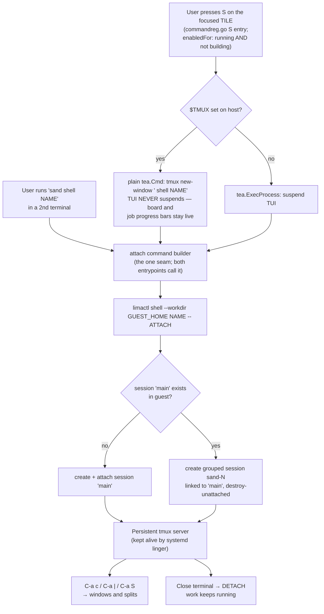

# Plan: tmux-backed multi-shell access to sand VMs

## Original Work Order

> Make it easier for users to spawn multiple shells / windows into a sand VM. Today the TUI's `S` key execs a bare `limactl shell <name>` via tea.ExecProcess (internal/ui/commands.go:177) — one exclusive, blocking shell, and there is no `sand shell` subcommand (cmd/sand/main.go has a hand-rolled switch with only `create`/`version`), so a second terminal has no sand-level way in. Meanwhile the guest is ALREADY provisioned for multi-window work and the Go side never uses it: tmux is installed (roles/base/defaults/main.yml:30), a tuned ~/.tmux.conf is deployed (roles/user/templates/tmux.conf.j2 — C-a prefix, mouse, splits, 50k scrollback), roles/user/templates/ssh_rc.j2 + tmux set-environment keep SSH agent forwarding working across re-attach, and commit a13b2b0 enabled systemd linger specifically so a detached tmux server survives logout. Nothing ever starts tmux automatically.
>
> Proposed scope, roughly in priority order:
> 1. Make `S` attach to a persistent guest tmux session (`limactl shell <name> -- tmux new-session -A -s main`) instead of a bare login shell — gives native new-windows/splits AND makes sessions survive TUI resume, terminal close, and laptop sleep. Design decisions to settle in the plan: default vs opt-in (it changes what C-a does under the user's fingers); and how later attachers get INDEPENDENT windows rather than a mirrored session (grouped sessions: `tmux new-session -t main -s <unique>`; note same-session attach clamps size to the smallest client).
> 2. Add a `sand shell <name>` subcommand (new case in the main.go switch + stdlib FlagSet; no cobra in this repo) so a second terminal tab has a real entrypoint. Bonus: `sand shell <name> -- <cmd>` for one-off guest exec.
> 3. Optional power-user path: if the TUI detects it is running inside host tmux ($TMUX set), `S` can `tmux new-window sand shell <name>` to open a real new host window WITHOUT suspending the TUI.
> 4. Surface Lima's per-instance ssh.config (~/.lima/<name>/ssh.config) on the VM detail screen — the code already parses it (internal/ui/transfer.go:188) — so users can plug VS Code Remote-SSH / any terminal in. More useful than a copy-paste limactl string.
>
> Also fix while in there: shellCmd passes no --workdir, so limactl's injected `cd <host-cwd>` can greet the user with a spurious `bash: cd: ... No such file or directory` on the first line (this pitfall is already documented in internal/lima/client.go:170-177).
>
> Explicitly OUT of scope: having sand spawn a host terminal emulator itself (iTerm/Terminal.app/gnome-terminal/wezterm/kitty detection) — permanent bug-report surface.
>
> Note a Bubble Tea program owns exactly one terminal, so tea.ExecProcess is inherently exclusive — multi-window MUST come from a multiplexer or a second host terminal, not from the TUI hosting shells itself.

## Plan Clarifications

| Question | Answer |
| --- | --- |
| Which of the four proposed items should this plan cover? | Items 1, 2, and 3 (tmux attach, `sand shell` subcommand, host-`$TMUX` new-window path), plus the `--workdir` fix. Item 4 (surfacing `ssh.config` on the detail screen) is **out of scope** — it is a tool-integration feature, not a multi-shell one. |
| Should `S` attach to tmux by default, or is a bare login shell still the default? | **tmux by default.** Every user gets persistence and windows without going looking for them. |
| When a second terminal attaches to a VM that already has a client attached, what does it get? | A **grouped session** — shared window set, independent current-window, no size clamping. Not a mirrored session, and not a fully isolated one. |
| Is backwards compatibility required for the current bare-shell behavior of `S`? | **No — clean break.** No `--no-tmux` escape hatch. `sand` is a pre-1.0 tool for disposable VMs, so the blast radius is small. The behavior change is documented in the README and CHANGELOG. |
| Include `sand shell <name> -- <cmd>` for one-off guest exec? | **No.** Not required by the multi-window goal; excluded under the PRE_PLAN YAGNI rule. |

### Refinement pass — 2026-07-13

The plan was authored against a tree that `main` has since moved 24 commits past, and
was rebased onto `e8701de`. The TUI was restructured in the interim (the VM screen was
deleted and a command registry and job registry were added), so the questions below were
resolved against the **current** code rather than re-asked. Source is marked per row.

| Question | Answer | Source |
| --- | --- | --- |
| Does the `S` keybinding still exist after the VM screen was deleted? | **Yes — it moved.** `S` is now one entry in the per-VM command registry at `internal/ui/commandreg.go:165-179`, not a key handler on a screen. The registry entry carries the binding, its help label, an `about` sentence, an `enabledFor` guard, and the action. The plan's Component 3 is re-anchored to this entry. | auto-resolved (codebase) |
| How does a user invoke a per-VM verb now? | **Straight from the board**, on the tile under the focus ring. There is no VM screen to open first — `commandreg.go` states this explicitly: *"Every verb fires on THE TILE UNDER THE RING… There is no VM screen to open first — it was deleted, because the tile already showed everything it did."* | auto-resolved (codebase) |
| Where did the "must be running" guard go (formerly `detail.go:36-46`)? | Into the registry entry's `enabledFor`: `notBuilding(m, v) && v.Status == limaRunning`. The guard is now *declarative* and drives the footer/help rendering as well as dispatch, so a disabled verb is not merely inert — it is not advertised. | auto-resolved (codebase) |
| Should this plan add a **new** registry verb for tmux, or modify the existing `S`? | **Modify the existing `S` entry.** `commandreg.go` carries an explicit scope note — *"This file stays narrow on purpose: it is exactly the verbs sand has today, nothing more. It is not a fuzzy command palette or a general plugin framework"* — and the user's decision was tmux-by-default with no escape hatch, so there is no second verb to add. This also satisfies the PRE_PLAN YAGNI rule. | auto-resolved (codebase + prior decision) |
| Does the host-`$TMUX` fast path change the `enabledFor` gate (since that branch no longer suspends the TUI)? | **No — the gate stays exactly as it is.** One of its two stated rationales (a suspended terminal swallowing a streaming build) does weaken on the non-suspending branch, but the other does not: pressing `S` on a VM a reset is about to force-delete still drops the user into a session that dies under them. Keeping one gate for both branches is also simpler than a per-branch predicate. Recorded as a deliberate non-change so a later reader does not "fix" it. | assumption (conservative; rationale recorded) |
| Are `guestHome` and the `limactl` `cd` pitfall comment still where the plan cited them? | **Both exist, both moved.** `guestHome` is now `internal/ui/transfer.go:238` (plan said 188); the `cd <host-cwd>` comment is now `internal/lima/client.go:206` (plan said 170-177). Citations updated throughout. | auto-resolved (codebase) |

## Executive Summary

`sand` gives a user exactly one way into a VM: the `S` key on the TUI's VM
screen, which suspends the whole TUI and hands the terminal to a single
`limactl shell <name>`. That shell is exclusive (a Bubble Tea program owns one
terminal, and `tea.ExecProcess` blocks until the child exits), it is
non-persistent (closing it ends the session and anything running in it), and it
is unreachable from any second terminal because `sand` exposes no shell
subcommand at all. A user who wants two windows into a VM today has no
supported path.

The fix does not require building a multiplexer, a terminal manager, or a
session broker, because the guest is *already provisioned* to solve this and the
Go side simply never uses it. Every VM has tmux installed, a tuned `~/.tmux.conf`
deployed, SSH-agent forwarding wired to survive re-attach, and — as of commit
`a13b2b0` — systemd linger enabled with a commit message that says, in as many
words, that it exists so a detached tmux server survives logout. The guest is
waiting for a client that never arrives. This plan makes `sand` that client.

The approach is therefore deliberately small: point sand's shell entrypoints at
a persistent guest tmux session instead of a bare login shell, and add a
`sand shell <name>` subcommand so a second terminal tab has somewhere to go.
Multiple windows then come free from tmux itself (`C-a c`, `C-a |`, `C-a S` —
all already bound in the shipped config), and a second host terminal gets a
*grouped* session so the two terminals share windows without mirroring or
clamping each other. The headline benefit is not actually the windows: it is
that a long-running Claude Code job in a sand VM now survives the TUI resuming,
the terminal closing, and the laptop sleeping.

## Context

### Current State vs Target State

| Current State | Target State | Why? |
| --- | --- | --- |
| The `S` verb (`internal/ui/commandreg.go:165-179`) execs a bare `limactl shell <name>`; closing it ends the session and kills what was running | `S` attaches to a persistent guest tmux session; closing the terminal detaches, leaving work running | A disposable VM is where long Claude Code jobs run. Losing them to a closed lid is the single worst failure this tool has. |
| One shell at a time; `tea.ExecProcess` blocks the whole TUI until it exits | Windows and splits inside the attached session, via the already-shipped tmux bindings | This is the user's actual request: multiple windows. |
| A second terminal has no `sand`-level entrypoint — the only way in is to know and type `limactl shell claude` | `sand shell <name>` attaches from any terminal | A copy-paste `limactl` string is not a feature; a subcommand is. |
| A second attach would mirror the first (same current window, display clamped to the smallest client) | A second attach creates a *grouped* session: same windows, independent current-window, no clamping | Mirrored clients make a second terminal useless for a second window — it would defeat the whole purpose. |
| Guest tmux is installed, configured, agent-forwarding-aware, and linger-protected — and nothing ever starts it | sand starts and attaches it | The capability is already paid for. Not using it is pure waste. |
| The TUI must suspend itself to give you a shell, even when the host is itself running tmux | When `$TMUX` is set, `S` opens a new *host* tmux window and the TUI keeps running | The TUI is genuinely useful to keep visible next to a shell. Where the host can do that for free, take it. |
| Suspending the TUI now blanks a **live board** with N concurrent jobs streaming into it (`internal/ui/jobs.go`), and `commandreg.go:167-173` says so in as many words: a build the user "can no longer see streams into a suspended terminal" | The host-`$TMUX` branch does not suspend at all, so the board stays live and visible beside the shell | The job registry landed *after* this plan was written and makes suspension strictly more costly than it was. The fast path is now a correctness improvement, not just a convenience. |
| `limactl` injects `cd <host-cwd>` into the guest login shell, so `S` can open with `bash: cd: … No such file or directory` | `--workdir` is passed explicitly, so the shell opens clean in the guest home | It is a visible papercut on the first line of every single shell, and the repo already documents the pitfall in `internal/lima/client.go:206`. |
| The `S` entry's `about` text and status message both promise "sand steps aside until you exit it" / "the TUI resumes when you exit" | Copy describes detach-vs-exit, persistence, and (on the fast path) no suspension at all | The current copy becomes actively false on both branches. It is user-facing and shown in the `?` screen and the log line. |

### Background

Three facts constrain the design and are worth stating plainly, because each one
closes off an approach that would otherwise look attractive.

**A Bubble Tea program owns exactly one terminal.** `tea.ExecProcess` tears down
input handling, leaves the alt-screen, hands the real `os.Stdin`/`os.Stdout` to
one child, and blocks. There is no supported way for the TUI to host two
concurrent interactive shells, and building a PTY-multiplexing pane inside the
TUI would mean writing a terminal emulator. Multi-window access must therefore
come from a multiplexer in the guest or from a second host terminal — it cannot
come from the TUI hosting shells itself.

**The TUI this plan targets is not the one it was written against.** The plan's
first draft described a per-VM "VM screen" (`internal/ui/detail.go`) that owned the
`S` key. That screen has since been **deleted**: verbs now fire directly on the
focused tile of a board, and every per-VM verb — start, stop, restart, reset,
shell, delete, upload, download, secrets — is a single entry in one command
registry (`internal/ui/commandreg.go`), from which both the dispatcher and the
help footer derive. Two consequences shape the work. First, this plan **modifies an
existing registry entry rather than adding a screen or a key**; `commandreg.go`
carries an explicit note that it "stays narrow on purpose… not a fuzzy command
palette or a general plugin framework", and nothing here needs it to grow.
Second, the guard that used to be an imperative `if Status != "Running"` check is
now a declarative `enabledFor` predicate that also decides whether the verb is
*advertised* in the footer — so getting it right is a rendering concern, not just
a dispatch one.

**Suspending the TUI is more expensive than it used to be.** The job registry
(`internal/ui/jobs.go`) is described in its own header as "sand's only concurrent
subsystem": several provisions and transfers can now be in flight while the board
stays live and a building VM renders a progress bar on its tile. The `S` entry's
comment already names the hazard this creates — pressing shell "on a VM a reset is
about to force-delete drops the user into a session that dies under them, while the
build they can no longer see streams into a suspended terminal." This is precisely
why the host-`$TMUX` branch matters more now than when it was first proposed: on
that branch the TUI never suspends, so the board and its progress bars stay on
screen next to the shell.

**Spawning a host terminal emulator is off the table.** Detecting and launching
iTerm vs Terminal.app vs gnome-terminal vs wezterm vs kitty vs Windows Terminal
is an unbounded compatibility surface and a permanent source of bug reports. The
one exception this plan takes is host tmux — because when `$TMUX` is set we are
not guessing at anything: the multiplexer is already there, and `tmux new-window`
is a stable, single, portable command.

**The guest work is already done.** `roles/base/defaults/main.yml` installs
tmux; `roles/user/templates/tmux.conf.j2` deploys a config with a `C-a` prefix,
mouse mode, 50k scrollback and window/split bindings;
`roles/user/templates/ssh_rc.j2` symlinks the live SSH agent socket to a stable
path, paired with tmux's `set-environment -g SSH_AUTH_SOCK`, specifically so
agent forwarding still works after a re-attach; and `loginctl enable-linger`
keeps the user manager (and thus a detached tmux server) alive after the last
login session drains. This plan should add **no new Ansible work** beyond what is
needed to make attachment reliable — the provisioning side is essentially
complete and the deficit is entirely on the Go side.

## Architectural Approach

The work is a thin client layer over guest tmux, expressed as one shared
attach-command builder used by three call sites (the TUI key, the new
subcommand, and the host-tmux fast path). The builder is the only place that
knows tmux exists; everything else calls it.

### Component 1: The guest attach command

**Objective**: Produce a single, correct command string that attaches a caller
to the VM's persistent tmux session with the right sharing semantics, so no
call site has to reason about tmux.

The semantics chosen in clarification are: the first client creates and attaches
a canonical session (name it `main`); every subsequent client creates a *grouped*
session linked to it. A grouped session shares the window set with `main` — the
same windows, the same running processes — but tracks its own current window and
is not size-clamped against the other clients. That is precisely the "two
terminals, two different windows, same VM" behavior the user asked for, and it is
the reason a plain `tmux new-session -A -s main` is **not** sufficient: two
clients attached to one session are mirrored, follow each other's window
switches, and clamp the display to the smallest attached client.

The decision procedure ("does `main` exist yet?") must run **in the guest**, not
on the host, because the host cannot see the guest's tmux server without a round
trip that would race anyway. The attach command is therefore a small guest-side
shell expression that branches on `tmux has-session -t main` and either creates
`main` or creates a uniquely-named grouped session against it. Two details this
component owns:

- **Grouped-session cleanup.** Grouped sessions are per-client and would
  otherwise accumulate as orphans every time a second terminal detaches. The
  grouped session must be created with `destroy-unattached` set on *itself* so it
  evaporates when its client leaves, while `main` — which must survive detach,
  that being the entire point — keeps the default. Getting this backwards would
  either leak sessions forever or destroy the user's work on detach, so it is
  called out explicitly.
- **Unique naming.** The grouped session needs a name that cannot collide with a
  concurrent attach. Deriving it in the guest (e.g. from tmux's own session list
  or the PID of the attaching shell) is safer than having the host guess a
  counter, since two `sand shell` invocations can race.

Where this expression lives — inlined in the Go builder, or deployed to the guest
as a tiny helper script by the `user` role — is an implementation choice for task
generation. A guest-side helper keeps the Go code free of embedded shell and puts
the tmux policy next to the tmux config that already ships; an inlined string
avoids touching Ansible at all and keeps the change in one language. The
trade-off should be made once, in one place, and both call sites must use the
result.

### Component 2: `sand shell <name>` subcommand

**Objective**: Give a second terminal a real, discoverable entrypoint, so
"open another window" is a command a user can type rather than a `limactl`
incantation they must know.

`cmd/sand/main.go` dispatches on a hand-rolled `switch os.Args[1]` with cases for
`create` and `version`; subcommand flags use the stdlib `flag.NewFlagSet` (there
is no cobra, urfave, or pflag in `go.mod`, and this plan adds none). `shell`
becomes a third case following the exact shape of the existing `create` case,
delegating to a `runShell` function alongside `runCreate` in `cmd/sand/`.

The subcommand takes the instance name as a positional argument, resolves the
guest home, builds the attach command from Component 1, and execs it with the
real TTY attached. Because there is no TUI to suspend in this path, it should
hand off the process directly rather than going through Bubble Tea. Two
behaviors it must get right, both of which are error paths the TUI already
handles and the CLI must not regress:

- A VM that is not running must produce a clear, actionable message rather than a
  raw `limactl` error — the TUI already sets this precedent via the `S` entry's
  `enabledFor` guard (`internal/ui/commandreg.go:174`), which withholds the verb
  from a VM that is not running. The CLI has no footer to withhold it from, so it
  must say so in words.
- An unknown or non-sand instance name must fail cleanly.

The usage string in the existing `default:` case of the switch — which today
lists only `sand` and `sand create ...` — must gain the new subcommand, since
that string is the tool's only discovery surface for someone who typed something
wrong.

### Component 3: The `S` registry verb and the host-tmux fast path

**Objective**: Make `S` do the best available thing given the host's terminal,
without the TUI ever trying to host two shells itself.

*Re-anchored in the 2026-07-13 refinement: this component originally described a
`detail.go` key handler on a VM screen that no longer exists. See the Plan
Clarifications refinement table.*

The work touches exactly two places, and adds no new verb, key, or screen.

**`shellCmd` (`internal/ui/commands.go:210-219`)** is the single exec site and
keeps that role. It gains two changes. First, it builds the guest attach command
(Component 1) instead of a bare `limactl shell <name>`, and passes `--workdir`
explicitly (Component 4). Second, it branches on whether the *host* is running
tmux:

- **`$TMUX` unset (the common case).** Mechanically as today: `tea.ExecProcess`
  suspends the TUI, hands over the terminal, and resumes when the user detaches or
  exits. What changes is the meaning of that resume — detaching now leaves the
  guest session and its work alive, so a resumed TUI no longer implies the user's
  job died with the shell.
- **`$TMUX` set.** The TUI runs `tmux new-window <sand> shell <name>` on the
  *host* and does **not** suspend. The user gets a real new host window; the TUI
  stays live in its own window, still rendering the board and any in-flight job
  progress bars. This is a short-lived, non-interactive host command, not a
  `tea.ExecProcess` hand-off, so it must not disturb the alt-screen. One
  correctness detail: `sand` may not be on `PATH` (it can be invoked by an
  absolute path, or via `go run`), so the new-window command must use the running
  binary's own resolved path, not the bare word `sand`.

**The `S` entry in the command registry (`internal/ui/commandreg.go:165-179`)**
gains no new fields and keeps its key. Three of its four members change or are
deliberately held constant:

- `binding` — **unchanged.** Still `S`, still labelled `shell` in the footer.
  Holding the two-word footer label constant is worth a moment's thought, because
  it is what keeps the board golden snapshots stable (see Risks).
- `about` — **rewritten.** It currently reads "Open an interactive shell in the
  guest. sand steps aside until you exit it," which becomes false: sand does not
  step aside on the fast path, and "exit" is no longer the normal way out. This is
  the sentence a user reads in the `?` screen (`internal/ui/help.go`), so it is
  the natural place to teach the one thing they must know — that the session
  persists, and `C-a d` detaches.
- `enabledFor` — **unchanged, deliberately.** It stays
  `notBuilding(m, v) && v.Status == limaRunning`. The refinement considered
  relaxing it on the non-suspending branch and rejected that: the gate's second
  rationale (a reset force-deleting the VM out from under a live session) is
  unaffected by whether the TUI suspended, and one predicate for both branches is
  simpler than two. Recorded so a later reader does not "fix" it.
- `action` — **rewritten** to pick the branch and to set the log message. The
  current copy (`m.logMsg("opening a shell in " + v.Name + " — the TUI resumes when
  you exit")`, via `internal/ui/messages.go:38`) is wrong on both branches and
  needs per-branch text: the suspend branch resumes on *detach or exit*, and the
  fast path does not suspend at all.

### Component 4: The `--workdir` papercut

**Objective**: Stop every shell from potentially opening with a shell error on
its first line.

`limactl shell` injects a `cd <host-cwd>` into the guest login shell, so when the
host's current directory does not exist in the guest the user is greeted with
`bash: cd: … No such file or directory`. This repo already knows about this
pitfall — `internal/lima/client.go:206` documents it at length as the reason
`ShellOut` keeps stderr separate — but the interactive path never applied the
lesson. `limactl shell` accepts a `--workdir` flag (verified against the
installed `limactl`), and the guest home is already resolvable: `guestHome` in
`internal/ui/transfer.go:238` reads it from Lima's generated `cloud-config.yaml`.
Note the guest home is `/home/<user>.guest`, **not** `/home/<user>`, so it cannot
be reconstructed from the username — and there is a second, unrelated `guestHome`
in `internal/provision/staging.go:67`, so cite the package. Passing the right one
as `--workdir` fixes the papercut. Note this matters
more, not less, after this plan: tmux inherits the working directory of the
process that creates the session, and the shipped `tmux.conf` binds new windows
and splits to `-c "#{pane_current_path}"` — so a bad starting directory would
propagate into every window the user subsequently opens.

## Risk Considerations and Mitigation Strategies

Technical Risks

- **`limactl shell <name> <command>` may not allocate a PTY.** tmux refuses to
  run without a terminal (`open terminal failed: not a terminal`), so if Lima
  does not pass `-t` to ssh when a command argument is supplied, the entire
  approach fails at the first call. This is the single highest-risk unknown in
  the plan and everything else depends on it.
    - **Mitigation**: Verify against a real VM *before* building anything else —
      this must be the first executable step of the work, not a late integration
      test. If Lima does not allocate a PTY, the fallback is to bypass `limactl
      shell` for the interactive path and invoke `ssh -t` directly against Lima's
      per-instance `ssh.config` (`~/.lima/<name>/ssh.config`), which the codebase
      already reads and which puts the `-t` flag under our control. The fallback
      is known-viable, so the risk is to the implementation shape, not to the
      feasibility of the feature.
- **Grouped-session semantics are easy to get subtly wrong**, and the two failure
  modes are asymmetric: setting `destroy-unattached` on `main` would destroy the
  user's long-running work the moment they detach — the exact disaster this plan
  exists to prevent — while omitting it on the grouped sessions merely leaks
  orphan sessions.
    - **Mitigation**: Treat "detach from a second terminal, confirm `main` and its
      running process survive" as a mandatory validation step with an explicit
      assertion, not an eyeball check. Assert on the guest's `tmux list-sessions`
      output directly.
- **Racing attaches could collide on a grouped session name** if two terminals
  run `sand shell` simultaneously.
    - **Mitigation**: Derive the unique suffix inside the guest at attach time
      rather than computing it on the host, so the name is chosen atomically with
      respect to the tmux server that owns it.
- **`sand` may not be on `PATH`** when the TUI shells out to `tmux new-window
  sand shell <name>` on the host.
    - **Mitigation**: Resolve the running binary's own path and use it explicitly
      in the new-window command rather than emitting the bare word `sand`.

Implementation Risks

- **No test may require a real `limactl`** (AGENTS.md states this as a hard
  rule), yet the core of this change is precisely what gets exec'd — and the
  existing `shellCmd` deliberately bypasses the `lima.Runner` seam that makes
  everything else testable, because an interactive session needs the real TTY.
    - **Mitigation**: Split the change so the *command construction* is a pure,
      directly unit-testable function (instance name + guest home → argv), and
      keep the untestable part down to the `exec.Command`/`tea.ExecProcess` call
      that consumes it. Assert on the argv, not on the exec. Real-VM behavior is
      covered by the existing `limae2e` build-tagged tests, which are the correct
      home for the PTY verification above.
- **The host-tmux branch is not the same *kind* of `tea.Cmd`** as the suspend
  branch, and conflating them will break the fast path. `tea.ExecProcess`
  suspends the entire program and is single-shot; `tmux new-window` on the host is
  fire-and-forget and returns immediately. The former is the wrong wrapper for the
  latter — using it would suspend the TUI to run a command that needed no
  suspension, defeating the whole point of the branch.
    - **Mitigation**: Branch on `os.Getenv("TMUX")` and return an ordinary
      `tea.Cmd` (a plain `exec.Command(...).Run()` folded into an `actionDoneMsg`)
      on the fast path, reserving `tea.ExecProcess` for the suspend path. The
      registry's `action func(m *model, v vm.VM) tea.Cmd` signature already
      accommodates both — no registry change is needed to support this.
- **The heartbeat already holds a long-lived `limactl shell` per running VM**
  (`internal/ui/heartbeat.go`), streaming guest CPU/memory samples via
  `ShellStreamOut`, and it keeps running *underneath* a suspended TUI. A design
  that now also starts a guest tmux **server** must not fight it — for resources,
  for the SSH connection budget, or through the heartbeat's own cooldown/retry
  logic. This subsystem did not exist when the plan was first written.
    - **Mitigation**: The attach is a distinct `limactl shell` invocation with its
      own TTY and does not route through the heartbeat's `Runner`, so they should
      not collide by construction — but this must be *observed*, not assumed:
      during validation, confirm the tile's live CPU/memory gauges still update
      for a VM that has an attached tmux session, and that detaching does not
      wedge or orphan the heartbeat's stream.
- **TUI golden snapshots may drift — but should not, and that is the signal.**
  The board goldens (`TestTUIBoardGolden80x24`, `TestTUIBoardGoldenWide`) render
  the footer, which is *derived from the command registry*, so their last two rows
  are the verb list. The 80x24 footer already wraps onto two lines and is clipped
  centrally, so an added verb could push a binding off-screen entirely.
    - **Mitigation**: This plan adds **no** registry entry and does not change the
      `S` binding's two-word footer label, so the board goldens should be
      **unchanged**. If they do change, that is evidence the implementation added or
      relabelled a verb it was not supposed to — treat a golden diff as a review
      failure to investigate, not a snapshot to bless. The `about` sentence and the
      log-line copy are *not* snapshotted (there is no `?`-screen golden), so
      rewriting them is free.
- **Three registry invariants are enforced by existing tests** and must keep
  passing: `TestBoardHelpAndDispatchAgree` (the footer and the dispatcher derive
  from one list and may not disagree), `TestHelpScreenDescribesEveryVerb` (a verb
  with no `about` sentence fails the build), and
  `TestBoardVerbsFireOnlyWhenEnabledForTheFocusedVM`.
    - **Mitigation**: Rewriting `about` rather than deleting it keeps the second
      green; leaving `enabledFor` alone keeps the first and third green. The `?`
      screen's closing sentence (`internal/ui/help.go:132-135`) also promises that
      "a stopped VM offers no shell" — which stays true only because the guard is
      being kept.
- **The two entrypoints can drift**, exactly as `sand create` and the TUI create
  path could — a failure mode AGENTS.md explicitly warns about ("keep them from
  drifting — both go through the same `provision`/`registry` seams by design").
    - **Mitigation**: Honor the same discipline: one shared attach-command builder
      is the seam, and both the TUI and `sand shell` must call it. Neither may
      construct a tmux command of its own.
- **`guestHome` is an ambiguous name in this repo.** There are two: the one this
  plan means (`internal/ui/transfer.go:238`, which reads Lima's generated
  `cloud-config.yaml` — note the guest home is `/home/<user>.guest`, *not*
  `/home/<user>`, so it cannot be reconstructed from the username) and an unrelated
  one in `internal/provision/staging.go:67` that shells out to `getent passwd`.
    - **Mitigation**: Always cite the package. Picking the wrong one would put
      `--workdir` at a path that does not exist — reintroducing the exact `cd`
      error this plan sets out to fix.

User-Experience Risks

- **`S` becomes a breaking behavior change with no escape hatch** (an explicit,
  accepted decision, not an oversight). The tmux prefix `C-a` is now live in
  every sand shell, and `C-a` is "move to start of line" in readline — a user who
  does not know they are in tmux will find that key mysteriously broken.
    - **Mitigation**: Documentation is the whole mitigation here, so it must be
      good: the README must state plainly that `S` lands you in tmux, that the
      prefix is `C-a`, that `C-a c` opens a window and `C-a d` detaches, and that
      closing the terminal no longer ends the session. The CHANGELOG must call it
      out as a behavior change. If this proves too sharp in practice, adding a
      `--no-tmux` flag later is a small, purely additive change — nothing in this
      design forecloses it.
- **Users may not realize work is still running** after they detach, and could
  accumulate forgotten sessions or be surprised by a VM that will not go idle.
    - **Mitigation**: Out of scope to solve in the UI, but each VM's tile already
      shows its status and live gauges — a VM busy with detached work will not look
      idle. Note the behavior in the docs so it is discoverable rather than
      mysterious.

## Success Criteria

### Primary Success Criteria

1. Pressing `S` on a running VM's **tile** (the one under the board's focus ring —
   there is no VM screen to open first) lands the user inside a tmux session in
   the guest, with the shipped `~/.tmux.conf` active (verified by the `C-a`
   prefix responding and the status bar being present).
2. From that session, `C-a c` opens a second window and `C-a |` splits a pane —
   i.e. the user can have multiple shells in one VM without a second terminal.
3. Detaching (`C-a d`) or closing the terminal outright leaves a process started
   in that session **still running** in the guest; re-attaching finds it alive.
4. `sand shell <name>` run from a second, independent host terminal attaches to
   the same VM, sees the same window set as the first client, and can view a
   *different* window than the first client without either terminal being
   size-clamped or forced to follow the other's window switches.
5. When the TUI is run from inside a host tmux session, `S` opens a new *host*
   tmux window containing the guest session, and the TUI remains running and
   visible in its original window rather than suspending.
6. No shell opened by any of the above paths prints `bash: cd: … No such file or
   directory` (or any other error) on its first line, regardless of the host
   directory `sand` was invoked from.
7. `sand` with a bad subcommand prints a usage string that lists `shell`.
8. The board's live CPU/memory gauges keep updating for a VM that has an attached
   tmux session — i.e. the new guest tmux server does not disturb the heartbeat's
   own long-lived `limactl shell` stream.
9. The `S` verb is still gated exactly as before: it is absent from the footer for
   a stopped or building VM, and pressing it on one does nothing. The `?` screen's
   promise that "a stopped VM offers no shell" remains true.
10. `go build ./cmd/sand`, `gofmt -l .` (empty), `go vet ./...`, and `go test
   ./...` all pass, with no test requiring a real `limactl`. The board golden
   snapshots are **unchanged** — a diff there means a verb was added or relabelled,
   which this plan does not do.

## Self Validation

These steps require a real VM and must be executed against one; the unit tests
alone cannot demonstrate any of the criteria above.

1. **Verify the PTY assumption first, before trusting anything else.** Run
   `limactl shell <vm> tmux new-session -A -s probe` against a running sand VM
   from a real terminal and confirm it attaches rather than failing with `open
   terminal failed: not a terminal`. If it fails, the `ssh -t` fallback described
   in the risks section is in play and the rest of this validation must be re-run
   against that implementation.
2. **Confirm the attach and the config.** Start the TUI, move the focus ring onto
   a running VM's tile with the arrow keys (do *not* press `enter` — on a VM tile
   it is deliberately a no-op now), and press `S`. Confirm a tmux status bar is
   visible. Press `C-a c` and confirm a second window appears in the status bar;
   press `C-a |` and confirm a vertical split. This demonstrates criteria 1 and 2.
3. **Prove persistence, which is the headline claim.** In the attached session,
   start a marker process that would not survive its shell dying — e.g. `sh -c
   'sleep 600'` with a distinguishable argument. Detach with `C-a d`, then quit
   the TUI entirely, then close the terminal window. Open a fresh terminal and run
   `limactl shell <vm> pgrep -af 'sleep 600'` and confirm the process is still
   listed. Re-attach with `sand shell <vm>` and confirm the window is still there.
   This demonstrates criterion 3.
4. **Prove grouped-session independence with an assertion, not a glance.** With
   one terminal attached, run `sand shell <vm>` in a second terminal. In the
   second, switch to a different window (`C-a 2`) and confirm the *first*
   terminal does not follow. Confirm neither terminal's display is clamped when
   the two host terminals are different sizes. Then run `limactl shell <vm> tmux
   list-sessions` and confirm exactly two sessions exist and that they are grouped
   (same window set). This demonstrates criterion 4.
5. **Prove grouped-session cleanup does not eat the user's work.** Detach the
   second terminal. Run `limactl shell <vm> tmux list-sessions` and assert that the
   grouped `sand-N` session is **gone** and that `main` is **still present** and
   still holds the marker process from step 3. This is the asymmetric-risk check
   from the risks section and must be asserted explicitly.
6. **Exercise the host-tmux path.** From inside a host tmux session, launch the
   TUI, focus a running VM's tile, and press `S`. Confirm a new *host* tmux window
   opens with the guest session in it, and that switching back to the original
   host window shows the TUI still running and responsive (not suspended, not
   corrupted). Then do it again **while a VM is mid-build**, and confirm the
   build's progress bar on its tile keeps animating in the TUI window while the
   shell is open in the other — this is the concrete payoff of not suspending, and
   the failure mode `commandreg.go` warns about.
6b. **Confirm the heartbeat survives an attach.** With a tmux session attached to a
   running VM, watch that VM's tile for ~30s and confirm its CPU and memory gauges
   still update. Detach, and confirm they keep updating. This demonstrates
   criterion 8 — the guest tmux server must not disturb the heartbeat's own
   long-lived `limactl shell`.
7. **Confirm the workdir fix.** From a host directory that does not exist in the
   guest (e.g. a temp dir), run `sand shell <vm>` and confirm the first line of
   output is the shell/tmux, with no `bash: cd:` error. This demonstrates
   criterion 6.
8. **Confirm the error paths.** In the TUI, focus a *stopped* VM and confirm `S`
   is absent from the footer and does nothing when pressed (the `enabledFor` gate);
   confirm the same for a VM mid-build. From the CLI, run `sand shell` against a
   stopped VM and confirm a clear "must be running" message rather than a raw
   `limactl` error; run it against a nonexistent instance name and confirm a clean
   failure. Run `sand bogus` and confirm the usage string now lists `shell`.
9. **Confirm the build gates.** Run `go build ./cmd/sand`, `gofmt -l .` (must be
   empty), `go vet ./...`, and `go test ./...`. Then run `go test ./internal/ui`
   **without** `-update` and confirm the board goldens still pass: they should be
   unchanged, because this plan adds no registry verb and does not relabel the `S`
   binding. If a golden fails, do **not** reflexively regenerate it — investigate
   what the implementation added to the footer that it should not have.

## Documentation

Yes — this plan requires documentation updates, and because the change is a
deliberate breaking change to a key the user's fingers already know, the docs are
load-bearing rather than incidental.

- **`README-sand.md`** — the board keybinding table at **line 167** (`S` → "Open an
  interactive shell in the VM (offered while it's running)") and the prose at
  **lines 175-176** ("Pressing `S` suspends the TUI and hands your terminal to
  `limactl shell <name>`; the TUI resumes when you exit the shell") are both now
  wrong and must be rewritten to describe the tmux attach, the persistence
  semantics, and the host-`$TMUX` branch. (Line numbers refreshed in the
  2026-07-13 refinement; the README has already been updated for the tile board —
  line 153 correctly says there is "no VM screen to open first" — so only the shell
  copy is stale.) The tmux essentials must be stated for users who have never used
  it: prefix is `C-a`, `C-a c` for a new window, `C-a |` / `C-a S` for splits,
  `C-a d` to detach, and — most importantly — that closing the terminal no longer
  ends the session. A `sand shell` section is needed alongside the existing
  "Headless mode (`sand create`)" section, documenting it as the way to get a
  second terminal into a VM.
- **`internal/ui/help.go`** — the `?` screen renders each registry verb's `about`
  sentence, so the rewritten `S` sentence *is* user-facing documentation and should
  be treated as such, not as a code comment. Its closing sentence already promises
  "a stopped VM offers no shell"; confirm that remains accurate.
- **`README.md`** — already mentions guest tmux around lines 238-239; check that
  it does not contradict the new behavior.
- **`AGENTS.md`** — the "Go package layout" and entrypoint notes state that there
  is a headless `sand create` path and a TUI path and that they must not drift.
  That note should be extended to name `sand shell` as a third entrypoint and to
  record the shared attach-command builder as the seam that keeps it from drifting
  from the TUI's `S`, matching the existing `provision`/`registry` convention.
- **`CHANGELOG.md`** — release-please generates it from commits, so the breaking
  behavior change must be reflected in the commit message convention rather than
  hand-edited into the file.

## Resource Requirements

### Development Skills

- Go: stdlib `flag`/`FlagSet` subcommand wiring, `os/exec`, and the existing
  hand-rolled dispatch in `cmd/sand/main.go` (no CLI framework is present or to be
  added).
- Bubble Tea: `tea.ExecProcess` semantics, alt-screen handling, and the
  `teatest` golden-snapshot workflow in `internal/ui`.
- tmux: session vs grouped-session semantics, `destroy-unattached`, client
  attach/detach behavior, and size-clamping between clients on a shared session.
  This is the least common expertise on the list and the place a subtle bug is
  most likely to hide.
- Lima: `limactl shell` flags (`--workdir`), and the per-instance `ssh.config`
  that the fallback path would rely on.

### Technical Infrastructure

- A working `limactl` and a KVM-capable host, for the real-VM validation and the
  `limae2e`-tagged tests. The PTY question in particular cannot be answered
  without one.
- A host tmux, to exercise the `$TMUX` branch.
- The existing test stack: `charmbracelet/x/exp/teatest`, the fake `lima.Runner`
  used throughout `internal/*_test.go`, and the `limae2e` build tag.

## Notes

- The single most important non-obvious property of this design is that **`main`
  must never carry `destroy-unattached` and every grouped session must**. Reversing
  those two lines silently converts this feature from "your work survives a closed
  laptop" into "your work dies when you look away", with no error message. It is
  called out in the architecture, the risks, and the validation on purpose.
- The provisioning side is deliberately near-untouched. If a task in this plan
  starts growing new Ansible roles, that is a signal the design has drifted —
  the guest is already correct, and the deficit is in the Go client.
- Deferred, and explicitly not built here: surfacing Lima's `ssh.config` for
  VS Code Remote-SSH and other tools (originally scoped as "on the VM detail
  screen" — a screen that no longer exists, so if this is ever revived it would
  have to land on the tile or the `?` screen), `sand shell <name> -- <cmd>` for
  one-off guest exec, and any `--no-tmux` escape hatch. None of the three is
  foreclosed by this design; each is a small additive change if wanted later.
- This plan **adds no verb, no key, and no screen.** It rewrites the `action` and
  `about` of one existing registry entry, changes what `shellCmd` execs, and adds
  one CLI subcommand. If an implementation task finds itself adding a `vmCommand`,
  it has drifted — `commandreg.go` asks to stay narrow, and the user's decision
  (tmux by default, no escape hatch) means there is no second verb to add.

### Change Log

- **2026-07-13 — renumbered.** Plan was created as ID 12, which collided with the
  archived `12--tui-tile-board` and would have collided again with the unmerged
  `13--faster-base-vm-provisioning` (invisible to `get-next-plan-id.cjs` because it
  lives on an unmerged branch). Renumbered to **14**: directory, filename, and
  frontmatter `id`.
- **2026-07-13 — rebased and re-anchored onto `origin/main` (`e8701de`).** The plan
  was authored against a tree 24 commits stale. The refinement re-pointed it at the
  current architecture:
    - **The VM screen is gone.** `internal/ui/detail.go` was deleted ("the tile
      carries the core count"); there is no per-VM screen, and `enter` on a VM tile
      is now an explicit no-op. Every verb fires on the focused tile of the board.
    - **`S` survived but moved** into the new per-VM command registry
      (`internal/ui/commandreg.go:165-179`), which now owns its binding, help text,
      `about` sentence, `enabledFor` guard, and action. Component 3 was rewritten
      around modifying that entry rather than a key handler on a screen. The old
      imperative "must be running" check became the declarative `enabledFor`
      predicate, which also drives whether the verb is *advertised* in the footer.
    - **A job registry appeared** (`internal/ui/jobs.go`), making N concurrent
      provisions stream into a live board. This makes suspending the TUI strictly
      more costly than when the plan was written, and promotes the host-`$TMUX`
      branch from a convenience to a correctness improvement. Added to Context.
    - **New risk: the heartbeat** (`internal/ui/heartbeat.go`) already holds a
      long-lived `limactl shell` per running VM and keeps streaming under a
      suspended TUI. Added a risk and a validation step (6b / criterion 8).
    - **New risk: the fast path is a different kind of `tea.Cmd`.** `tmux
      new-window` is fire-and-forget and must *not* be wrapped in
      `tea.ExecProcess`, or it would suspend the TUI for no reason and defeat its
      own purpose.
    - **Golden-snapshot risk inverted.** The board goldens render the
      registry-derived footer, so the correct expectation is now that they are
      **unchanged**; a diff is a signal the implementation wrongly added or
      relabelled a verb, not a snapshot to bless.
    - **Citations refreshed.** `guestHome` → `internal/ui/transfer.go:238` (was
      cited as 188; note an unrelated same-named function exists at
      `internal/provision/staging.go:67`). The `limactl` `cd <host-cwd>` pitfall
      comment → `internal/lima/client.go:206` (was cited as 170-177). `shellCmd` →
      `internal/ui/commands.go:210-219`. README shell copy → lines 167 and 175-176.
    - **No user-facing decision was re-litigated.** tmux-by-default, no `--no-tmux`
      escape hatch, grouped sessions for later attaches, and the two hazards (the
      PTY question and the `destroy-unattached` asymmetry) all carry forward intact.
