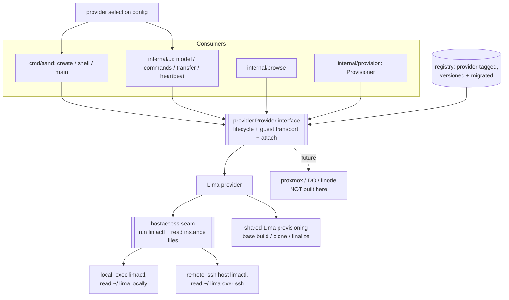
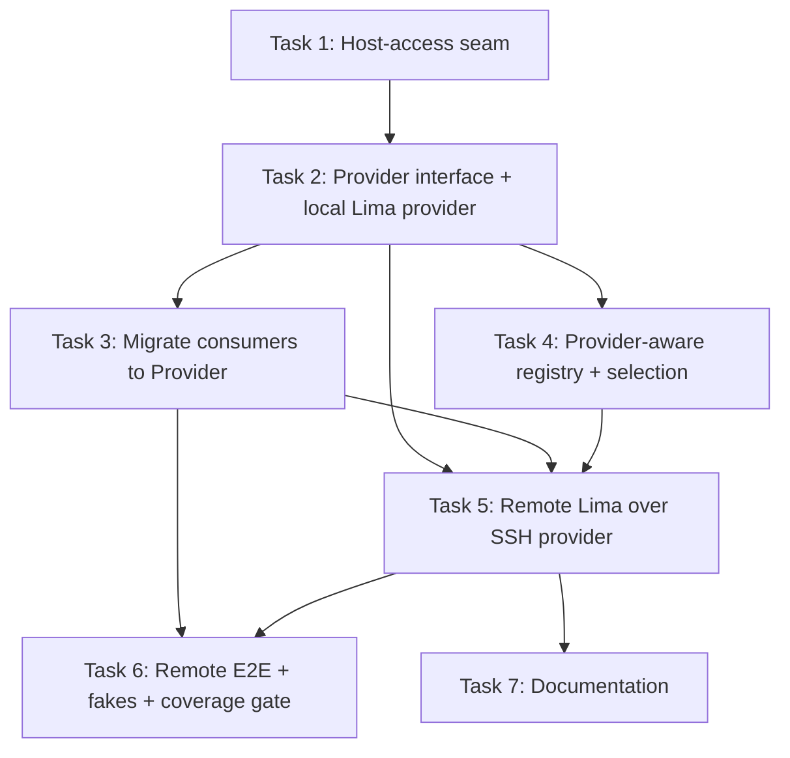

# Plan: Generic Provider Abstraction with Remote Lima over SSH

## Original Work Order

> refactor all Lima management so it that it has a generic transport (or choose a
> name) so it can work with different providers. First target is remote lima over
> ssh. Future targets are proxmox and digital ocean and linode.
>
> We should also build on top of the testing improvements in the unpushed
> worktree-refine-plan-08-tests branch

## Plan Clarifications

| Question | Answer |
|----------|--------|
| How far should this work order go on the remote-Lima target? | Build the generic Provider seam **and** a fully working remote-Lima-over-SSH provider (guest exec, file copy, tmux attach, and provisioning all work end to end). Local Lima stays the default. Proxmox / DigitalOcean / Linode remain future work — not built here. |
| What should the generic seam abstract? | The **full VM lifecycle** (list / status / start / stop / delete / create / reset) *and* the guest transport (exec / copy / interactive shell attach). Lima becomes one implementation of that interface; a second interface splits out the parts that genuinely differ between "local Lima" and "remote Lima". |
| What is the abstraction called? | **`Provider`** (package `internal/provider`). Concrete backends are the Lima provider and the remote-Lima provider. |
| What must stay backwards-compatible? | Local-Lima behaviour, its CLI, and the interactive experience must be preserved. Internal APIs and the on-disk managed-VM registry schema **may change**, with a one-time migration for existing entries. New provider selection is opt-in; an unconfigured `sand` behaves exactly as it does today. |

## Executive Summary

`sand` today funnels every VM operation through one concrete type, `*lima.Client`,
which shells out to the `limactl` binary on the local host. That client, the
Ansible provisioner built on top of it, the Bubble Tea TUI, the file browser, and
the three `cmd/sand` entrypoints all hold Lima by its concrete pointer, and Lima's
on-host artifacts (the `~/.lima/<name>/` instance files, `limactl shell`, the
`<vm>:<path>` scp form) leak out past the client into a dozen call sites. The tool
is single-backend by construction, and even a *remote* Lima — the same `limactl`,
just running on another machine over SSH — is unreachable today.

This plan introduces a `Provider` interface that owns the whole VM lifecycle plus
the guest transport, moves every consumer onto that interface, and pushes the
Lima-format leakage back behind it. It then ships two concrete providers: the
existing **local Lima** (refactored, behaviourally unchanged and the default) and
a new **remote Lima over SSH** that runs `limactl` on a remote host, reads that
host's instance files over SSH, and attaches an interactive tmux shell across the
extra hop. The provisioner's base-image / clone / finalize machinery — which is
common to both Lima providers because both drive `limactl` — is preserved and
becomes the Lima providers' shared provisioning strategy.

The chosen approach is deliberately *provider-shaped rather than transport-shaped*:
proxmox, DigitalOcean, and Linode do not use `limactl` at all, so the only seam
that lets them plug in later is one that abstracts the entire lifecycle, not just
"run a command in the guest". Building that seam now, and proving it against two
real backends that share most of their code, is what makes the future targets an
additive change instead of a second rewrite — while stopping short of building any
of those future providers today.

## Context

### Current State vs Target State

| Current State | Target State | Why? |
|---------------|--------------|------|
| Every consumer holds a concrete `*lima.Client`; there is no VM-lifecycle interface, only the subprocess-level `lima.Runner`. | Consumers depend on a `provider.Provider` interface; `*lima.Client` becomes one implementation detail behind it. | A concrete type cannot be swapped for a different backend; the work order requires multiple backends. |
| `limactl` is invoked only on the local host (`execRunner` hardcodes the local binary). | `limactl` can be invoked locally *or* on a remote host over SSH, selected by configuration. | "First target is remote lima over ssh." |
| Lima's host-side files (`ssh.config`, `cloud-config.yaml`, `lima.yaml`, the version stamp, the base lock, disk-usage / up-since sampling) are read directly off the local filesystem. | Those reads go through a host-access seam that is local for local Lima and SSH for remote Lima. | For remote Lima the instance files live on the *remote* host; reading them locally returns nothing. |
| `AttachArgv` emits a literal `limactl shell …`; the interactive shell bypasses the client entirely. | The interactive attach argv is produced by the provider: `limactl shell …` locally, `ssh -t <host> limactl shell …` remotely. | An interactive tmux session must work across the SSH hop without losing the existing session semantics. |
| File copy uses `limactl copy <src> <vm>:<dst>` with the local path assumed reachable by `limactl`. | The provider resolves copy against wherever `limactl` runs, staging host↔remote as needed. | `limactl copy` on a remote host cannot see the laptop's files; a naïve copy silently transfers nothing. |
| The managed-VM registry records one flat namespace of names with no notion of which backend owns them. | The registry records the owning provider (and remote target identity) per VM, with a versioned migration of existing entries to "local Lima". | A remote host's VM list must not be reconciled against, or collide with, the local list. |
| Tests fake `lima.Runner` and build a real `*lima.Client`; a Provisioner over a fake runner is the standard seam. | Tests fake the `Provider` (and the host-access seam) directly; the local-Lima provider keeps its runner-level fakes. | A lifecycle interface gives cleaner, backend-agnostic fakes and lets the remote provider be tested without a remote host. |
| CI runs `go test` with `-race`, an 87% coverage floor over `./internal/...`, `limae2e` real-VM E2E, and weekly gremlins/molecule jobs (inherited from the refine-plan-08-tests branch this plan is anchored on). | The same gates stay green: the refactor is race-clean, holds the coverage floor, and the remote provider gains E2E coverage analogous to the existing `create_e2e_test.go`. | The user asked to build on those testing improvements; they are the guardrail the refactor must satisfy, not optional. |

### Background

- This plan is anchored on the `worktree-refine-plan-08-tests` branch (tip
  `4be7a41`), which sits on top of the `0.4.0` release and adds **only test / CI /
  docs** — no production Go source. That branch's `-race` run, its 87% coverage
  floor gate over `./internal/...`, its `limae2e` E2E harness
  (`cmd/sand/create_e2e_test.go`), its gremlins mutation config, and its molecule
  role scenarios are the safety net this refactor is executed against. The
  behaviour-locking tests it added (`manage`, `baselock`, `secrets`, `transfer`)
  pin current behaviour so the refactor can be proven non-regressive.
- The `lima` package is unusually well-documented, and several of its comments
  encode hard-won, non-obvious invariants that the refactor must carry forward
  verbatim, not re-derive: the `limactl list` clone/delete race
  (`ErrListRacedInstanceDir`, lima#5236) and the `Get`-one-instance workaround;
  the `WaitDelay` reaping of the orphaned SSH grandchild on context cancel; the
  `--backend=scp` pin that determines *where* copied files land; the
  `Configure` writable-mount strip that keeps work VMs mountless; and the entire
  tmux attach expression (`destroy-unattached` on the grouped session only). These
  are the parts most likely to break silently under a transport change.
- Provisioning is the deepest Lima coupling: the base-image build, `limactl clone`,
  the Lima overlay YAML, `Configure`'s qcow2 grow, the apt-cache seed/harvest via
  `limactl copy`, the base lock, and the version stamp under `~/.lima`. This is
  *shared* between local and remote Lima (both drive `limactl`), so it is preserved
  as the Lima providers' provisioning strategy rather than genericised — the future
  non-Lima providers will bring their own, entirely different, lifecycle
  implementations of the same `Provider` interface.
- Two remote-only hazards have no analogue in the local path and drive much of the
  risk: (1) `limactl copy` and every instance-file read execute *on the remote
  host*, so host↔guest file transfer becomes a two-stage path (local ↔ remote host
  ↔ guest); (2) the interactive attach nests a PTY (`ssh -t` → `limactl shell` →
  guest `bash` → `tmux`), and the existing session semantics must survive that
  nesting.

## Architectural Approach

The refactor is a bottom-up seam introduction: define the interface, move Lima
behind it unchanged, split out the host-access layer that local and remote Lima
differ on, then add the remote implementation and the configuration/registry
plumbing that selects and tracks it. Every step keeps the suite green so the
local-Lima path is provably unbroken throughout.

### Component 1 — The `Provider` interface and the consumer migration

**Objective**: Give every consumer a single backend-agnostic dependency so the
concrete Lima type is no longer wired throughout the app.

Define `provider.Provider` covering the operations the consumers actually use,
grouped as: discovery (list / get / status), power (start / stop / delete and
their streaming variants), provisioning lifecycle (create / reset / recreate),
guest transport (exec merged, exec-stdout-only, exec-with-captured-stderr, copy),
and interactive attach (produce the argv, since the caller execs it against a real
TTY). The interface surface is derived directly from the current `*lima.Client`
method set plus the free `provision` functions and the `AttachArgv`/`GuestPath`
helpers, so it is a faithful envelope of today's usage rather than a speculative
API. Consumers — `provision.Provisioner`, `internal/ui` (model, commands,
transfer, heartbeat, commandreg), `internal/browse`, and the three `cmd/sand`
entrypoints — switch from `*lima.Client` to the interface. The existing narrow
seams already in place (`ui.guestShell`, `browse.DirLister`, `cmd/sand.vmGetter`,
`cmd/sand.headlessProvisioner`) are preserved and expressed as subsets of, or
adapters over, the new interface so their tests keep working.

The Lima-format helpers that currently leak (`GuestPath`, `AttachArgv`,
`GuestHome`/`GuestUser`) become provider responsibilities or provider-produced
values, so no consumer constructs a Lima-shaped path or command by hand.

### Component 2 — The local Lima provider (behaviour-preserving refactor)

**Objective**: Re-home today's Lima behaviour behind the interface with no
observable change, as the default backend.

The current `lima.Client` logic is retained wholesale and adapted to satisfy
`Provider`. The provisioner's base-build/clone/finalize orchestration
(`internal/provision`) becomes the Lima provider's provisioning strategy: the
`Provider.Create`/`Reset`/`Recreate` operations delegate to it. All the invariant-
bearing behaviour enumerated in Background is carried across unchanged, and its
tests (including the golden TUI snapshots and the `limae2e` create/recreate E2E)
must continue to pass without modification beyond the mechanical type swap. This
component is where the coverage floor is defended: the refactor must not strand
existing tests behind a changed constructor without an equivalent seam.

### Component 3 — The host-access seam (local vs SSH)

**Objective**: Isolate the *only* things that actually differ between local and
remote Lima — where `limactl` runs and where its instance files live — into one
swappable layer, so the remote provider reuses all of Component 2's `limactl`
logic rather than duplicating it.

Generalise today's `lima.Runner` (which already abstracts subprocess execution but
hardcodes the local binary) into a host-access abstraction with two responsibilities:
(a) run a `limactl` invocation — locally via `exec`, or remotely via `ssh <host>
limactl …`; and (b) read a named instance file / stat a path — locally off the
filesystem, or remotely over SSH. Every current direct filesystem touch of Lima
state moves onto this seam: the `ssh.config`/`cloud-config.yaml` guest-identity
reads, the `lima.yaml` base-overlay parse, the version stamp and base lock under
`~/.lima`, the partial-instance cleanup, and the disk-usage / up-since / last-used
sampling. The local implementation is today's behaviour; the SSH implementation is
new. This seam is the linchpin: it is what makes "remote Lima" mostly a
configuration of "Lima", and it is where the `WaitDelay` orphan-reaping and the
`limactl list` race handling must be preserved across the added SSH process.

### Component 4 — The remote Lima over SSH provider

**Objective**: A fully working second backend that drives `limactl` on a remote
host and delivers the same create / manage / shell / copy experience.

Built as the Lima provider (Components 2–3) configured with the SSH host-access
implementation, plus the two remote-only concerns that need real design, not just
a transport swap:

- **Interactive attach across the hop**: the attach argv becomes `ssh -t <host>
  limactl shell …` wrapping the existing guest tmux expression. The nested-PTY
  path and the session semantics (grouped sessions, `destroy-unattached` on the
  grouped session only, the exact-match `=main` target) must be validated on a
  real remote host, because these are exactly the behaviours the local attach
  comments warn are silently fatal if disturbed.
- **File copy across the hop**: because `limactl copy` runs on the remote host, a
  host↔guest transfer is resolved as a two-stage path (local ↔ remote host ↔
  guest), preserving the `--backend=scp` placement contract at the guest end. The
  provisioner's apt-cache seed/harvest, the reset stage-out/stage-in tar streams,
  and the TUI file transfer all route through the provider's copy so they work
  remotely without each caller re-learning the topology.

### Component 5 — Provider selection, configuration, and registry

**Objective**: Let a user choose a backend without disturbing the default, and
track which backend owns each managed VM.

Add opt-in configuration (flags / environment, and a small config surface for the
remote target: host, user, port, identity, and the remote `LIMA_HOME`) that
selects the provider at the three `cmd/sand` construction sites and the TUI. An
unconfigured `sand` resolves to the local Lima provider and behaves exactly as
today. The managed-VM registry gains a provider dimension per entry so a remote
host's instances are reconciled and listed against the right backend and never
collide with local names; the schema version is bumped and existing entries are
migrated once to the local-Lima provider (preserving the existing atomic-write and
corrupt-file-quarantine behaviour). `internal/manage`'s shared reconcile/record
bookkeeping is updated to be provider-aware so the headless and TUI paths stay in
lockstep.

### Component 6 — Testing, documentation, and the coverage gate

**Objective**: Prove the refactor is non-regressive and the remote provider works,
under the inherited CI gates.

Backend-agnostic fakes for `Provider` and the host-access seam drive the consumer
tests; the local provider keeps its runner-level fakes. The remote provider gets
E2E coverage analogous to `cmd/sand/create_e2e_test.go`, gated behind a build tag
in the family of the existing `limae2e` gate, exercisable against a loopback SSH
target so it can run on the dev box. The suite stays `-race`-clean and at or above
the 87% coverage floor. AGENTS.md and the READMEs are updated to describe the
`Provider` model, the local/remote selection, and the new seam conventions, since
the current docs describe a Lima-only architecture down to the package level.

## Risk Considerations and Mitigation Strategies

Technical Risks

- **Silent loss of an encoded Lima invariant during the type swap.** The `lima`
  package's comments document behaviours that fail silently (the list race, the
  scp placement pin, the writable-mount strip, `destroy-unattached` targeting,
  `WaitDelay` orphan reaping).
    - **Mitigation**: Treat those comments and their tests as part of the
      contract; carry them onto the new seams unchanged; keep the behaviour-locking
      tests from plan 08 green as the regression tripwire; verify the copy/attach
      behaviours on a real VM, not just via unit fakes.
- **Nested-PTY interactive attach over SSH misbehaves** (garbled TTY, broken
  resize, or — the dangerous case — a session-semantics change that destroys
  `main` on detach).
    - **Mitigation**: Validate on a real remote host early; assert the grouped-
      session / `destroy-unattached` invariants the same way the local attach tests
      do; keep the guest tmux expression byte-for-byte identical so only the
      transport prefix differs.
- **Remote file copy transfers nothing or lands files in the wrong place**,
  because `limactl copy` runs on the remote host and the `--backend=scp` placement
  contract is subtle.
    - **Mitigation**: Route all copy through the provider so the two-stage topology
      lives in one place; preserve the scp backend pin; add an E2E that copies a
      known file to a remote guest and asserts its landing path.

Implementation Risks

- **Scope creep toward the future providers.** The lifecycle interface invites
  building proxmox/DO/linode scaffolding the work order defers.
    - **Mitigation**: Build exactly two providers (local + remote Lima). The
      interface is justified by the two real backends that share it, not by the
      future ones; no stub providers, no speculative config.
- **The coverage floor blocks the merge** because new SSH paths are awkward to
  unit-test.
    - **Mitigation**: The host-access seam is designed to be fakeable so SSH code
      paths are exercised without a remote host; E2E covers the genuinely
      integration-only behaviours; the floor is defended per-component, not left to
      the end.
- **Registry migration corrupts or discards existing managed-VM records.**
    - **Mitigation**: Version-bump with a one-time, copy-before-replace migration
      that reuses the existing atomic-write and `.corrupt` quarantine paths; a
      pre-migration file must round-trip to a local-Lima-tagged post-migration file
      in tests.

Integration Risks

- **Drift between the three entrypoints** (headless create, TUI, `sand shell`)
  now that each must select and construct a provider.
    - **Mitigation**: Centralise provider construction/selection so all three go
      through one path, mirroring the existing "don't let the create/TUI/shell
      paths drift" convention in AGENTS.md.

## Success Criteria

### Primary Success Criteria

1. No consumer (`cmd/sand`, `internal/ui`, `internal/browse`,
   `internal/provision`) depends on the concrete `*lima.Client`; all depend on the
   `provider.Provider` interface, and `go build ./...` / `go vet ./...` are clean.
2. An unconfigured `sand` uses local Lima and reproduces today's behaviour: the
   full existing suite (unit + `teatest` goldens + `limae2e` create/recreate)
   passes unchanged beyond mechanical type substitution.
3. With a remote target configured, `sand` creates, lists, starts, stops, resets,
   copies files to, and opens an interactive tmux shell on a VM whose `limactl`
   runs on a remote host over SSH — demonstrated end to end against a real remote.
4. The managed-VM registry is provider-aware, existing files migrate cleanly to
   local Lima on first load, and local/remote instances never cross-contaminate a
   listing or reconcile.
5. CI stays green: `go test ./... -race` passes and coverage over `./internal/...`
   remains at or above the 87% floor; a remote-provider E2E exists in the
   `limae2e`-style gated family.

## Self Validation

After all tasks are complete, an executing agent must verify — with observable
evidence, not by assertion:

1. **Interface migration is real**: run `grep -rn '\*lima\.Client' cmd internal
   --include='*.go' | grep -v '_test.go'` and confirm no consumer package (outside
   the Lima provider's own implementation) holds the concrete pointer. Run
   `go build ./...` and `go vet ./...` and show clean output.
2. **Local path unchanged**: run `go test ./... -race` and show it passing; run
   `go test -tags limae2e -run E2E ./cmd/sand/` on this KVM-capable dev box and
   show the create/recreate E2E passing against local Lima.
3. **Coverage floor held**: run the coverage command from `.github/workflows/
   test.yml` (`go test ./... -race -covermode=atomic -coverpkg=./internal/...
   -coverprofile=coverage.out` then `go tool cover -func`) and show the total at or
   above 87%.
4. **Remote provider works end to end**: against a real remote Lima host (or a
   loopback SSH target), create a VM, `sand shell` into it and confirm the tmux
   `main` session is created and *survives detach*, copy a known file into the
   guest and `limactl shell … cat` it back to prove placement, then list/stop/
   delete it — capturing the terminal output of each step. Confirm on the same run
   that a local `limactl list` and the remote list do not show each other's
   instances.
5. **Registry migration**: craft a pre-migration `managed-vms.json` (no provider
   field), load it through the new code, and show the on-disk file rewritten with
   every entry tagged as the local Lima provider and the version bumped.
6. **Attach invariants**: run the attach-argv unit tests and show the assertion
   that `destroy-unattached` is set on the grouped session and never on `main`
   passing for both the local (`limactl shell`) and remote (`ssh -t … limactl
   shell`) argv forms.

## Documentation

- **AGENTS.md**: rewrite the "Go package layout" and testing conventions to
  describe the `provider.Provider` model, the local/remote-Lima providers, the
  host-access seam, and the new fake conventions. The current text names `lima` as
  "typed wrapper over the `limactl` CLI" and instructs tests to fake `lima.Runner`
  and build a `*lima.Client`; that guidance changes.
- **README.md / README-sand.md**: document provider selection and how to configure
  and use a remote-Lima-over-SSH target, alongside the existing local quick-start.
- Code comments: preserve the invariant-documenting comments in the `lima` code as
  they move behind the new seams; add comments on the host-access seam and the
  remote copy/attach topology explaining the two remote-only hazards.

## Resource Requirements

### Development Skills

- Go interface design and large-scale, behaviour-preserving refactoring across
  packages.
- Deep familiarity with Lima / `limactl` semantics (clone-from-base, overlay YAML,
  instance files, `limactl copy`/`shell`).
- SSH mechanics: non-interactive command execution, `-t` PTY allocation, nested
  PTY behaviour, and remote file staging.
- Bubble Tea TUI testing (`teatest` goldens) and Go table/fake-driven testing under
  `-race` and a coverage gate.

### Technical Infrastructure

- A KVM-capable host with Lima for `limae2e` runs (this dev box qualifies).
- A reachable remote Lima host — or a loopback/containerised SSH target — for the
  remote-provider E2E.
- The inherited CI gates from the `worktree-refine-plan-08-tests` anchor: `-race`,
  the 87% coverage floor over `./internal/...`, gremlins, and molecule.

## Integration Strategy

The work integrates by preserving every existing seam and convention rather than
replacing them: the three-entrypoint no-drift rule, the single tmux-aware attach
builder, the create/TUI shared `provision`/`registry` paths, and the runner-level
fakes all survive, now expressed in terms of `Provider`. The branch is anchored on
`worktree-refine-plan-08-tests` so the test infrastructure is present from the
first commit and every change is validated against it.

## Notes

- Explicitly **out of scope**: any proxmox, DigitalOcean, or Linode provider
  implementation or scaffolding. The `Provider` interface is shaped so they can be
  added later as pure additions, but none is built, stubbed, or configured here.
- The `vm.VM.Dir` field and Lima's status/size strings remain in the domain model;
  for the remote provider `Dir` is a remote path used only through the host-access
  seam. A fuller de-Lima-ing of the domain model is deferred until a genuinely
  non-Lima provider needs it — building it now would be YAGNI.

## Execution Blueprint

**Validation Gates:**
- Reference: `.ai/strikethroo/config/hooks/POST_PHASE.md`
- Every phase must leave `go build ./...`, `go vet ./...`, and `go test ./... -race` green, and must not drop coverage over `./internal/...` below the 87% floor.

### Dependency Diagram

No circular dependencies.

### ✅ Phase 1: Foundation — host-access seam
**Parallel Tasks:**
- ✔️ Task 1 (completed): Generalize the Runner into a local/remote-capable host-access seam and relocate every `~/.lima` filesystem touch behind it (local impl only).

### ✅ Phase 2: Foundation — the Provider interface
**Parallel Tasks:**
- ✔️ Task 2 (completed): Define `provider.Provider` and the local Lima provider over the seam (depends on: 1).

### ✅ Phase 3: Migration
**Parallel Tasks:**
- ✔️ Task 3 (completed): Migrate all consumers from `*lima.Client` to `provider.Provider` and centralise construction (depends on: 2).
- ✔️ Task 4 (completed): Provider-aware registry with versioned migration + provider selection config (depends on: 2).

### ✅ Phase 4: Remote provider
**Parallel Tasks:**
- ✔️ Task 5 (completed): Remote Lima over SSH provider — SSH host-access impl, nested-PTY attach, two-stage copy (depends on: 2, 3, 4).

### ✅ Phase 5: Verification & documentation
**Parallel Tasks:**
- ✔️ Task 6 (completed): Remote-provider E2E, backend-agnostic fakes, and the `-race`/87%-coverage gate (depends on: 3, 5).
- ✔️ Task 7 (completed): Document the Provider model and remote-Lima usage in AGENTS.md/READMEs (depends on: 5).

### Post-phase Actions
Apply `.ai/strikethroo/config/hooks/POST_PHASE.md` after each phase: confirm the build/vet/race/coverage gates above with real command output before advancing. Do not accept a task's self-report as proof.

### Execution Summary
- Total Phases: 5
- Total Tasks: 7
