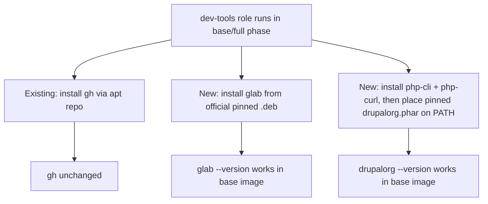
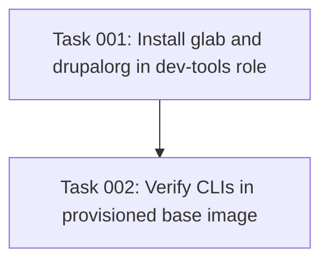

# Plan: Install the GitLab and Drupal.org CLIs in the Base Image

## Original Work Order
> Install the gitlab and drupal.org CLIs as a part of the base image (like with the GitHub CLI)

## Plan Clarifications

No blocking clarification was requested from the user; the request maps
unambiguously onto the existing GitHub-CLI provisioning pattern. The following
interpretation decisions were made and are recorded here for transparency. Any
one of them can be revised without changing the shape of the plan.

| Question | Resolution | Rationale |
| --- | --- | --- |
| What is "the gitlab CLI"? | `glab`, the official GitLab CLI (`gitlab-org/cli`). | Only official GitLab command-line client; direct analog to `gh`. |
| What is "the drupal.org CLI"? | `drupalorg` from `mglaman/drupalorg-cli` — "A command line tool for interfacing with Drupal.org". | It is the tool literally described as the Drupal.org CLI, and it pairs naturally with `glab`: Drupal contribution now flows through GitLab merge requests on `git.drupalcode.org`, which `drupalorg` orchestrates. |
| Where does "base image" mean? | The `dev-tools` Ansible role (`roles/dev-tools/tasks/main.yml`), which runs in the `base` and `full` provisioning phases and is skipped in `finalize`. | This is exactly where `gh` is installed, so both new CLIs are baked into the cloned base image, not re-installed per VM. |
| Is a PHP runtime in scope? | Yes — `php-cli` + `php-curl` are installed as a prerequisite for `drupalorg`. | `drupalorg` ships as a PHAR that requires PHP 8.1+ with cURL; the base image currently has no host PHP. Installing it is a necessary dependency of the requested tool, not scope creep. |
| Backwards compatibility required? | No. | Purely additive change; no existing behavior, interface, or file is altered or removed. Confirmed additive-only. |

## Executive Summary

The base image that every Sandbar VM is cloned from already ships the GitHub CLI
(`gh`), installed by the `dev-tools` Ansible role during the `base` provisioning
phase. This plan extends that same role to also install the **GitLab CLI
(`glab`)** and the **Drupal.org CLI (`drupalorg`)**, so both are baked into the
base image and available in every cloned VM with zero per-VM cost — exactly the
way `gh` is today.

The two tools ship differently, so each follows the closest faithful analog of
the existing idiom. GitLab does **not** publish an official APT repository for
`glab` (unlike GitHub's for `gh`), so `glab` is installed from GitLab's official
signed `.deb` release asset via `apt`, with the version pinned in role defaults —
mirroring the version-pinning pattern the project already uses for NodeSource.
`drupalorg` ships as a PHP PHAR, so it is installed by placing a pinned PHAR on
`PATH` and installing its PHP runtime prerequisite (`php-cli`, `php-curl`) — the
same "vendor installer that isn't an apt repo" category the role already handles
for `uv`.

The result: `glab --version` and `drupalorg --version` both succeed in a freshly
provisioned base image, the change is purely additive, reproducible (all versions
pinned), and architecture-correct for both amd64 and arm64 guests.

## Context

### Current State vs Target State

| Current State | Target State | Why? |
| --- | --- | --- |
| The base image ships `gh` (GitHub CLI) but no GitLab CLI. | The base image also ships `glab`, the official GitLab CLI. | Contributors work with GitLab-hosted repositories (including `git.drupalcode.org`) and need a first-class CLI. |
| The base image has no Drupal.org CLI. | The base image ships `drupalorg` (`mglaman/drupalorg-cli`). | The requested Drupal.org contribution workflow (issues, branches, merge requests) is driven from this CLI. |
| No PHP runtime is installed on the VM host. | `php-cli` + `php-curl` (PHP 8.4 on Debian trixie) are installed on the host. | `drupalorg` is a PHAR that requires PHP 8.1+ with cURL to run at all. |
| Both new CLIs are absent from every cloned VM. | Both CLIs are present in every cloned VM for free, baked into the clone source. | The `dev-tools` role runs only in the `base`/`full` phases, so installing there costs nothing per clone. |

### Background

Provisioning is done entirely by an Ansible playbook (`site.yml`) driven by the
Go `sand` orchestrator; there is no Dockerfile or cloud-init. The playbook is
phase-gated by a `provision_phase` variable:

- `base` — heavy, identity-free setup baked into the clone source (base image).
- `finalize` — light per-clone work (skips `dev-tools`).
- `full` — everything in one pass.

`roles/dev-tools/tasks/main.yml` runs in `base` and `full` but is skipped in
`finalize`, so anything installed there lands in the base image and is inherited
by every clone. This is where `gh` lives (lines 103–127) and where `glab` and
`drupalorg` belong.

**Distribution facts that shape the approach (verified against upstream):**

- **`glab`**: GitLab's official CLI. GitLab does *not* host an apt repository for
  it; the officially supported Linux paths are Homebrew or the prebuilt release
  binaries/packages. Official signed `.deb` assets are published per release at
  `https://gitlab.com/gitlab-org/cli/-/releases/v{VERSION}/downloads/glab_{VERSION}_linux_{ARCH}.deb`
  (e.g. `v1.108.0`, `_linux_amd64.deb` / `_linux_arm64.deb`). Installing the
  vendor's own `.deb` via `apt` keeps the install vendor-official and
  apt-managed, and is the closest faithful analog to the `gh` apt-repo idiom
  without pulling in an unofficial third-party repository (e.g. WakeMeOps),
  which the project's "minimal, trusted dependencies" convention discourages.
- **`drupalorg`**: `mglaman/drupalorg-cli`, distributed as `drupalorg.phar` at
  `https://github.com/mglaman/drupalorg-cli/releases/download/{VERSION}/drupalorg.phar`
  (e.g. `0.10.3`). Requires **PHP 8.1+ with cURL** (Debian trixie's `php-cli`
  metapackage provides PHP 8.4) and `git` (already present via `base_packages`).
  The composer install path is deprecated upstream; the PHAR is the standard
  method.

Both new CLIs are architecture-sensitive in different ways: the `glab` `.deb`
asset name embeds the Debian arch (`amd64`/`arm64`), so provisioning must map the
guest's `ansible_architecture` (`x86_64`/`aarch64`) to the correct asset. The
`drupalorg` PHAR is architecture-independent (it runs on the installed PHP), so
no mapping is needed there.

## Architectural Approach

The whole change is confined to the `dev-tools` role, adding two new install
blocks after the existing `gh` block and two new pinned-version defaults. No Go
code, no playbook phase logic, and no other role changes are required, because
`dev-tools` already runs in precisely the phase that produces the base image.

### Component 1: GitLab CLI (`glab`) via official pinned `.deb`
**Objective**: Install `glab` in the base image using GitLab's own signed release
package, versioned and architecture-correct.

Approach: add a pinned `glab` version to `roles/dev-tools/defaults/main.yml`
(mirroring the existing NodeSource version-pin convention). In
`roles/dev-tools/tasks/main.yml`, after the `gh` block, map the guest
architecture (`ansible_architecture`: `x86_64` → `amd64`, `aarch64` → `arm64`)
to the Debian arch used in the asset name, download the official
`glab_{version}_linux_{arch}.deb` to a temp path with `ansible.builtin.get_url`,
and install it with `ansible.builtin.apt` using the local-`deb` install form so
apt resolves any dependencies. Guard against unsupported architectures with a
clear failure. Installing a specific version file is naturally idempotent when
paired with a check that the installed `glab` already matches the pinned version
(or by relying on apt's package-state reporting).

### Component 2: Drupal.org CLI (`drupalorg`) via pinned PHAR + PHP runtime
**Objective**: Install `drupalorg` in the base image, including the PHP runtime
it needs to execute.

Approach: add a pinned `drupalorg` version to
`roles/dev-tools/defaults/main.yml`. In `roles/dev-tools/tasks/main.yml`, after
the `glab` block: (1) install `php-cli` and `php-curl` via
`ansible.builtin.apt`; (2) download the pinned
`drupalorg.phar` to `/usr/local/bin/drupalorg` with `ansible.builtin.get_url`,
owner `root`, mode `0755` (executable, on `PATH`). The PHAR is
architecture-independent, so no arch mapping is needed. `git` is already
installed via `base_packages`, satisfying the tool's other runtime dependency.

### Component 3: Documentation
**Objective**: Keep human- and agent-facing docs accurate about what the base
image ships.

If the repository documents the pre-installed tooling (e.g. a README or AGENTS.md
listing `gh` among the baked-in CLIs), add `glab` and `drupalorg` to that list so
the documentation matches reality. If no such enumerated list exists, no doc
change is required — this component is conditional on finding an existing,
now-incomplete list.

## Risk Considerations and Mitigation Strategies

Technical Risks

- **No official apt repository for `glab`**: unlike `gh`, GitLab ships no apt
  repo, so a pure "add-repo + apt install latest" mirror is impossible.
    - **Mitigation**: install the vendor's official signed `.deb` release asset
      via apt with a pinned version. Vendor-official, apt-managed, reproducible.
- **Architecture mismatch for the `glab` `.deb`**: the asset name embeds the
  Debian arch; a hardcoded `amd64` would break arm64 (Apple Silicon) guests.
    - **Mitigation**: map `ansible_architecture` to the Debian arch and fail
      loudly on any unsupported architecture rather than downloading a wrong or
      nonexistent asset.
- **`drupalorg` needs a PHP runtime not currently on the host**: without PHP the
  PHAR cannot run.
    - **Mitigation**: install `php-cli` + `php-curl` (PHP 8.4 on trixie, ≥ the
      required 8.1) as an explicit prerequisite in the same block.
- **Floating "latest" versions harm base-image reproducibility**: base images are
  version-stamped and drift-checked, so a moving install target undermines
  determinism.
    - **Mitigation**: pin both tool versions in role defaults; upgrades become a
      deliberate one-line change.

Implementation Risks

- **Scope creep**: temptation to add `glab`/`drupalorg` shell completions, auth
  config, aliases, or wrapper commands.
    - **Mitigation**: install the binaries only. The work order asks for
      installation "like with the GitHub CLI", and `gh` is installed without any
      of those extras.
- **Breaking existing provisioning**: an error in the role would fail every base
  build.
    - **Mitigation**: additive blocks only, placed after the working `gh` block;
      verify a full `dev-tools` provisioning run still succeeds end to end.

## Success Criteria

### Primary Success Criteria
1. After a base-image provisioning run, `glab --version` succeeds inside the VM
   and reports the pinned version.
2. After a base-image provisioning run, `drupalorg --version` (or `drupalorg
   list`) succeeds inside the VM, proving both the PHAR and its PHP runtime are
   present and working.
3. The `gh` install and all other existing `dev-tools` behavior are unchanged; a
   full provisioning run of the role completes without error.
4. Both tool versions are pinned in `roles/dev-tools/defaults/main.yml`, and the
   `glab` install resolves the correct asset for both amd64 and arm64 guests.

## Self Validation

Execute these concrete steps after implementation:

1. **Static/syntax check**: run `ansible-playbook --syntax-check site.yml` (and,
   if available, `ansible-lint roles/dev-tools`) and confirm no errors are
   introduced by the new tasks.
2. **Defaults present**: `grep -E 'glab|drupalorg' roles/dev-tools/defaults/main.yml`
   and confirm both pinned version variables exist.
3. **Task wiring present**: `grep -nE 'glab|drupalorg|php-cli' roles/dev-tools/tasks/main.yml`
   and confirm both install blocks exist after the `gh` block.
4. **End-to-end provisioning** (authoritative): provision a base image (e.g. via
   the project's base-build path or by running the `dev-tools` role in the
   `base`/`full` phase against a VM), then open a shell in the resulting VM and run:
   - `glab --version` → prints the pinned `glab` version, exit 0.
   - `drupalorg --version` (or `drupalorg list`) → prints version / command list,
     exit 0.
   - `gh --version` → still works, exit 0 (regression check).
   - `php --version` → reports PHP ≥ 8.1, exit 0.
   Capture the terminal output of these commands as evidence.

If the full end-to-end provisioning cannot be run in the execution environment,
record that explicitly and fall back to the strongest available evidence:
`ansible-playbook --syntax-check` plus a dry inspection that the download URLs
resolve (e.g. an HTTP `HEAD`/reachability check against the pinned `glab` `.deb`
and `drupalorg.phar` URLs), and clearly flag that live in-VM verification is
pending.

## Documentation

Search for any existing enumeration of pre-installed base-image tooling that
lists `gh` (e.g. `README.md`, `AGENTS.md`, or role/docs comments). If such a
list exists, add `glab` and `drupalorg` to it. If none exists, no documentation
change is required.

## Resource Requirements

### Development Skills
- Ansible role authoring (tasks, defaults, `get_url`/`apt` modules, fact-based
  architecture mapping).

### Technical Infrastructure
- The existing Ansible provisioning stack and a way to exercise the `dev-tools`
  role against a Debian trixie VM for end-to-end verification.
- Network access from the guest to `gitlab.com` (glab `.deb`), `github.com`
  (`drupalorg.phar`), and the Debian apt mirrors (`php-cli`, `php-curl`).

## Notes

- The change is intentionally confined to the `dev-tools` role; no Go
  orchestration, phase logic, or other roles need to change, because
  `dev-tools` already runs in exactly the base-image phase.
- Versions to pin at implementation time reflect the current upstream latest:
  `glab` `v1.108.0` and `drupalorg` `0.10.3`. These are starting points; the
  executor should confirm they are still current and adjust the pinned defaults
  if newer releases exist.

## Execution Blueprint

**Validation Gates:**
- Reference: `/config/hooks/POST_PHASE.md`

### Dependency Diagram

No circular dependencies.

### ✅ Phase 1: Implement the base-image CLI installs
**Parallel Tasks:**
- ✔️ Task 001 (completed): Extend the `dev-tools` role to install `glab` (pinned official `.deb`, arch-mapped) and `drupalorg` (PHP runtime + pinned PHAR), plus any conditional docs update. (no dependencies)

### Phase 2: Verify in a provisioned base image
**Parallel Tasks:**
- Task 002: Provision a base image / VM and confirm `glab`, `drupalorg`, `php`, and `gh` all work in-VM. (depends on: 001)

### Post-phase Actions
- Run `ansible-playbook --syntax-check site.yml`; commit each phase as a conventional commit.

### Execution Summary
- Total Phases: 2
- Total Tasks: 2
