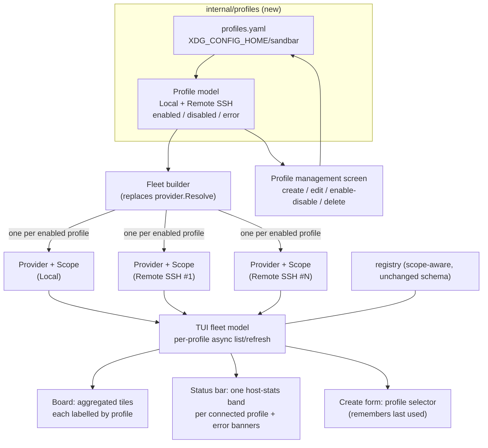

# Plan: Connection Profiles for Multi-Location VM Management

## Original Work Order

> Extend our remote Lima support to support "Connection Profiles". Each profile
> is a configuration for a location to run Sandbar VMs. By default, a local
> profile is created for a local lima instance. Users can add one or more
> "Remote SSH" profiles replacing the existing environment variables. In the TUI
> they can create and manage profiles. Importantly, Sandbar will activate or use
> all configured profiles at once. For example, a user with a remote SSH profile
> will see both local and remote VMs. When creating a VM, you select which
> profile to use when creating the VM. Tiles show what profile a VM is connected
> through.
>
> Profiles may be in states of error, or disabled without deleting them. The UI
> must not hang or lag and treat remote profiles as async operations for general
> UI updates.
>
> The status bar at the top will need to grow for each connected profile. That
> way, they could see server stats for multiple SSH remotes.
>
> Deleting a profile will not change the remote server. Multiple sand clients may
> be configured with the same profile (ie a laptop and a desktop).
>
> Future profile targets include cloud hosting providers, Proxmox, and Orbstack.
>
> Documentation must be updated and tests added.

## Plan Clarifications

| Question | Answer |
| --- | --- |
| How should the existing `SAND_PROVIDER` / `SAND_REMOTE_*` environment variables be handled once profiles exist? | **Remove entirely.** Profiles become the only configuration surface. Acceptable hard BC break because the env-var selection surface is unreleased (added on the `worktree-lima-transport-refactor` branch, not yet cut in a release). |
| When a profile is disabled or in an error state, what happens to its VM tiles on the board? | **Hide the tiles**, and surface that profile's disabled/errored state as a banner in the status bar so the user understands why those VMs are absent. |
| Is the default local profile permanent, or fully deletable like the others? | **Permanent.** It always exists and cannot be deleted, but it can be disabled/enabled and renamed. This guarantees a fallback location always exists. |
| When creating a VM you pick a profile — how should that choice behave across sessions? | **Remember last used.** The create form defaults to the profile the user last created a VM with. |
| Are backwards-compatibility shims required for the on-disk registry / managed-VM index? | No new BC shim is needed for VM ownership: the registry already carries a per-entry `Provider` + `RemoteTarget` scope (schema v2, on the refactor branch), and a profile reduces to exactly that scope. Profiles introduce a **new** config file, so there is no prior format to stay compatible with. |

## Executive Summary

Sandbar's `worktree-lima-transport-refactor` branch introduced a clean
`provider.Provider` seam and a scope-aware registry, but the application still
selects and runs **exactly one** backend per process, chosen from environment
variables at startup. This plan turns that single opt-in remote target into
**Connection Profiles**: named, persisted configurations for *where* Sandbar
runs VMs. A default **Local** profile is always present; users add one or more
**Remote SSH** profiles that replace the environment variables entirely. Crucially,
Sandbar activates **every enabled profile at once** — a user with a local
machine and a remote workstation sees both fleets of VMs on one board, creates a
VM by choosing which profile it lands on, and reads per-profile host stats from a
status bar that grows one band per connected profile.

This approach is chosen because the refactor branch already did the hard,
backend-agnostic work: the registry isolates VM ownership by `Scope`
(`user@host:port`), the SSH transport is self-contained in `SSHHost`, and the TUI
already has an async `connecting`/error interstitial and remote host-capacity
plumbing for a *single* remote. The missing pieces are (1) a persisted, editable,
TUI-managed profile store to replace ad-hoc env vars, and (2) promoting the model
from "one provider + one scope" to a **fleet** of provider/scope pairs whose VM
lists are aggregated and refreshed independently. Reusing the existing per-provider
scope and the existing async message pattern keeps the change faithful to the
architecture rather than bolting on a parallel system.

The outcome: one Sandbar instance manages VMs across multiple machines
simultaneously, degrades gracefully when a remote is unreachable (that profile's
tiles disappear and its status band shows the error, while local tiles stay live
and responsive), and never blocks the UI on a slow SSH hop. Profiles are portable
config that multiple sand clients (a laptop and a desktop) can share, and deleting
a profile only forgets a location locally — it never touches the remote server or
the VMs living there.

## Context

### Current State vs Target State

| Current State | Target State | Why? |
| --- | --- | --- |
| One backend is selected per process from `SAND_PROVIDER` / `SAND_REMOTE_*` env vars at startup (`provider.Resolve`). | A persisted set of named **Connection Profiles** (`profiles.yaml`) defines every location; `Resolve` is replaced by a fleet builder that constructs one provider per **enabled** profile. | Env vars can only express one target and are invisible/awkward to manage; users need multiple named, durable locations they can edit in the TUI. |
| The TUI model holds a single `p provider.Provider` and a single `scope`; the board shows only that one backend's VMs. | The model holds a **fleet** of provider/scope pairs keyed by profile; the board aggregates VMs from all enabled profiles into one roster. | The core requirement is that a user sees *both* local and remote VMs at once, not one or the other. |
| Remote connection is configured only through environment variables (documented in `remote-hosts.md`). | Remote SSH targets are configured as **Remote SSH profiles** through a TUI management screen and/or by hand-editing `profiles.yaml`; the env vars are removed. | Profiles replace env vars as the single, discoverable configuration surface. |
| A single remote's slow SSH handshake is covered by one `connecting`/`connectErr` interstitial that blocks the whole board until the first list lands. | Each profile lists and refreshes **independently and asynchronously**; a slow or unreachable remote never blocks local tiles or the rest of the UI. | The UI must not hang or lag; a fleet of remotes multiplies the chance that one is slow, so per-profile async is mandatory. |
| The header shows one host-capacity band (cpu/mem/disk) for the single active host. | The status bar **grows one host-stats band per connected profile**, plus a banner row for any disabled/errored profile. | Users want at-a-glance server stats for each of several SSH remotes, and a clear reason when a profile's VMs are missing. |
| Tiles identify a VM by name/status only; there is no notion of *where* it runs because there is only ever one location. | Tiles show **which profile** a VM is connected through. | With multiple fleets on one board, provenance (which machine a VM lives on) must be visible per tile. |
| The create form provisions onto the one resolved provider. | The create form has a **profile selector** (defaulting to the last-used profile), and the VM is created on that profile's provider and tagged with its scope. | Creating a VM must let the user choose its location; ownership must be recorded so the fleet stays isolated. |
| Provider selection lives in `provider.Resolve` / `resolveTargetConfig` reading `os.Getenv`. | A new `internal/profiles` package owns the profile model, load/save, and enable/disable/error state; the provider layer builds a fleet from it. | A durable, testable config layer is needed; keeping it separate from `provider` mirrors how `registry` and `secrets` are separate persisted stores. |

### Background

The foundation this plan builds on was delivered by the archived **plan 15**
(`.ai/strikethroo/archive/15--generic-provider-remote-lima-ssh/`), whose design
is authoritative for the seam this work extends. Key facts that shape the approach:

- **`provider.Provider`** (`internal/provider/provider.go`) is a backend-agnostic
  interface covering discovery, power, provisioning, guest transport, attach, and
  host identity/capacity. Local Lima (`local.go`) and remote-Lima-over-SSH
  (`remote.go`) both satisfy it; the remote one is the local provider with the
  host-access seam swapped for an `SSHHost`.
- **Selection is env-only today** (`internal/provider/select.go`): `Resolve()`
  reads `SAND_PROVIDER` / `SAND_REMOTE_*` into a `TargetConfig`, constructs one
  provider, and returns it with the `registry.Scope` that owns its VMs. All three
  entrypoints (`cmd/sand/main.go` TUI, `create.go`, `shell.go`) call `Resolve()`.
  `TargetConfig` is deliberately **secret-free** (identity is a key *path*), which
  is exactly what makes it safe to persist in a profile.
- **The registry is already scope-aware** (`internal/registry/registry.go`,
  schema v2): every entry carries `Provider` + `RemoteTarget`, and
  `AddScoped`/`ReconcileScoped`/`IsManagedInScope`/`ConfigInScope`/`BaseInScope`
  confine operations to one scope. A remote scope key is a stable
  `user@host:port`. This means multi-fleet VM ownership needs **no** registry
  schema change — a profile maps onto an existing scope.
- **There is no host-side user config file today.** The only persisted stores are
  `managed-vms.json` (registry, under `$XDG_DATA_HOME/sandbar/`) and the secrets
  store. `gopkg.in/yaml.v3` is already a dependency (used for Lima instance-file
  parsing). Profiles introduce the first user config file, whose natural home is
  `${XDG_CONFIG_HOME:-~/.config}/sandbar/`.
- **The TUI already models async remote I/O**: `internal/ui/commands.go` wraps
  every blocking provider call in a `tea.Cmd` returning a message
  (`vmsLoadedMsg`, `actionDoneMsg`, …); `internal/ui/connecting.go` renders a
  "Connecting to <host>…" interstitial; `internal/ui/header.go` samples host
  capacity off the UI goroutine. These are the patterns per-profile async and
  the multi-band status bar extend.
- **The `providerfake`** (`internal/providerfake/fake.go`) is a func-field double
  for every `Provider` method, and the TUI has a teatest + golden harness
  (`internal/ui/testdata/`). CI enforces a race detector, an **87% coverage
  floor** over `./internal/...`, gremlins mutation, and the rule that **no unit
  test may require a real limactl/ssh target** (real backends only behind the
  `limae2e` build tag).

Two things that were tried and are deliberately *not* the approach here: (1) a
single "active provider" the user switches between — rejected because the work
order requires *all* profiles active simultaneously, not a switcher; (2) storing
SSH credentials in the profile — rejected because the whole seam depends on the
config being secret-free (identity is a key path), preserving the invariant that a
profile is safe to commit/share across clients.

## Architectural Approach

The work divides into five cooperating components. The spine is promoting the
application from a single provider to a **fleet**: a set of
`{profile, provider, scope}` bindings, one per enabled profile, that the TUI
aggregates. Everything else (the config store, the management UI, the create-form
selector, the tile/status-bar surfacing) hangs off that spine.

### Component 1: The Profiles store (`internal/profiles`)

**Objective**: Own the persisted, editable, secret-free profile model that
replaces the environment variables — the single source of truth for every
location Sandbar can run VMs on.

A new package models a **Profile**: a stable identity/name, a **type** (Local or
Remote SSH), an **enabled** flag, and — for Remote SSH — the connection fields
that today live in `provider.TargetConfig` (host, user, port, identity *path*,
remote LIMA_HOME). It persists to `${XDG_CONFIG_HOME:-~/.config}/sandbar/profiles.yaml`
via `yaml.v3`, mirroring the registry's XDG convention and atomic-write
discipline (temp file + rename, corrupt-file quarantine). On first run with no
file (or after env-var removal), the store **seeds a default Local profile** so an
unconfigured sand behaves exactly as it does today — one local fleet, zero setup.

The store is the home for the lifecycle states the work order calls out:
**enabled/disabled** is a persisted flag the user toggles without losing the
config; **error** is a *runtime* state (the profile is enabled but its provider
failed to build or its host is unreachable) that is derived at fleet-build/refresh
time, not persisted. The store also records the **last-used profile** for the
create form's default. The file is deliberately hand-editable and free of
secrets so it is safe to copy between a laptop and a desktop (the multi-client
requirement) and to keep under version control.

The env-var surface (`SAND_PROVIDER`, `SAND_REMOTE_*`) is **deleted** from
`provider/select.go`; the doc/tests referencing it are removed or repointed at
profiles. `provider.TargetConfig` is retained as the internal, secret-free shape a
Remote SSH profile is converted into when its provider is constructed — the seam
`NewRemoteLima` already consumes.

### Component 2: The Fleet (replacing single-provider resolution)

**Objective**: Construct and own **one provider per enabled profile**, each paired
with the `registry.Scope` that isolates its VMs, so the rest of the app can act on
many backends at once without any backend leaking into another.

`provider.Resolve()` (env → one provider) is replaced by a fleet builder that
reads the profiles store and constructs a `{profile, provider, scope}` binding for
each **enabled** profile. A Local profile builds the local Lima provider
(`NewDefault`) with `registry.LocalScope`; a Remote SSH profile builds
`NewRemoteLima` with the remote scope derived from its `user@host:port`. A
profile whose provider **fails to construct** (bad config, preflight failure) is
recorded as an **error** binding rather than aborting the whole fleet — one bad
remote must never stop the local fleet or the other remotes from loading.

A subtlety this component must resolve carefully: the remote provider currently
calls `provision.SetHostFiles(host)` on construction, a **package-global** seam
that assumed a single provider per process. With a fleet, the base-image
provisioning host-access seam can no longer be a process-global keyed to "the one
remote". The plan's approach is to bind host-access **per operation to the
profile the operation targets** (create/reset always happen on exactly one chosen
profile), so provisioning reads/writes base-image files on the correct host. This
is the single most load-bearing internal change and the main reason the fleet
cannot be a naive loop over `Resolve()`.

The non-TUI entrypoints adapt to the fleet as follows: `sand create` gains a way
to name the target profile (defaulting to Local) and acts on that one profile's
provider/scope; `sand shell NAME` resolves which profile owns `NAME` (by scope in
the registry, disambiguating if a name exists on more than one) and attaches
through it. The CLI surface stays minimal — exactly what the profile model
requires, nothing speculative.

### Component 3: Per-profile asynchronous aggregation in the TUI

**Objective**: Aggregate every enabled profile's VMs into one board while
guaranteeing the UI never hangs on a slow or unreachable remote — the work order's
"must not hang or lag, treat remote profiles as async" requirement.

The TUI model is promoted from `p provider.Provider` + `scope` to a **fleet of
per-profile sub-states**, each holding its own provider, scope, last-known VM
list, host-capacity sample, connection status (connecting / connected / error),
and last error. The board's roster becomes the **union** of every connected
profile's managed VMs. Each profile refreshes on its **own** `tea.Cmd`, so the
existing `listCmd` pattern is fanned out — the local list returns near-instantly
and renders immediately, while each remote's list resolves in the background and
merges its tiles in as it lands. A message carries the **profile identity**
alongside its result so the model routes each async result to the right
sub-state; the existing `vmsLoadedMsg` shape is extended, not replaced by a
parallel mechanism.

The existing single `connecting` interstitial is generalized: rather than a
full-screen block, an as-yet-unconnected or errored profile simply contributes no
tiles and shows its state in the status bar (Component 5), so the board is usable
the instant the *local* fleet lists. Reconciliation, heartbeats, and per-tile disk
sampling — all currently keyed to one scope/host — become per-profile so a remote
VM's stats are sampled on its own host and its registry entries are reconciled
under its own scope.

### Component 4: Profile management and create-time selection UI

**Objective**: Let users create and manage profiles entirely in the TUI, and
choose a VM's location at create time.

A new **profile management screen** (a `view` alongside board/form/secrets) lists
every profile with its type, enabled/error state, and — for Remote SSH — its
target. From it the user can **create** a Remote SSH profile (a form over the
connection fields), **edit** an existing one, **enable/disable** without deleting,
and **delete**. Deleting removes only the local profile entry and its runtime
binding; it explicitly does **not** touch the remote server or the VMs there
(those simply stop appearing once the profile is gone, and reappear if the profile
is re-added). The Local profile is rendered as **permanent** (no delete verb) but
still enable/disable-able and renameable.

The **create form** gains a **profile selector** as a first-class field,
defaulting to the **last-used** profile (falling back to Local). The chosen
profile determines which provider provisions the VM and which scope tags it in the
registry; host-scaled defaults (cpu/memory/user, already host-aware from plan 15)
are sampled from the *selected* profile's host. Selecting the last-used profile is
persisted through the profiles store (Component 1).

### Component 5: Tile provenance and the growing status bar

**Objective**: Make *where* each VM runs visible per tile, and show per-profile
server stats and error banners in a status bar that grows with the fleet.

Each **tile** gains a compact **profile label** so a user scanning a mixed board
can tell a local VM from a remote one at a glance, within the tile's fixed content
budget (the layout already reserves fixed tile line counts, so the label must fit
that budget, not grow it unpredictably).

The **status bar/header** grows from one host-capacity band to **one band per
connected profile**, each showing that profile's host cpu/mem/disk (sampled on
that host, off the UI goroutine, exactly as the single-host sample works today).
A profile that is **disabled** or in **error** contributes a **banner row**
instead of a stats band — naming the profile and the reason (disabled, or the
connection error) so the user understands why its VMs are absent. The header's
existing width/height budgeting must accommodate a variable number of bands
without breaking the board layout at the narrowest supported terminal (80
columns), degrading gracefully (e.g. compacting or truncating bands) when the
fleet is larger than the bar can fully show.

## Risk Considerations and Mitigation Strategies

Technical Risks

- **The process-global provisioning host-access seam (`provision.SetHostFiles`) assumes one provider.** A fleet with multiple remotes cannot point a single global at "the remote".
    - **Mitigation**: Bind host-access to the profile a create/reset operation targets, resolved at operation time (each provisioning op acts on exactly one profile). Treat this as the highest-risk change and cover it with tests that provision against two different fake hosts in one process without cross-talk.
- **A slow or unreachable remote could still stall the UI if any refresh is awaited synchronously.** The board must stay live while a remote hangs.
    - **Mitigation**: Every profile's list/refresh/heartbeat/host-sample runs on its own `tea.Cmd` with the profile identity carried in the result message; the model never blocks on a remote, and the local fleet renders independently. Verify with a fake provider that blocks indefinitely for one profile while the board remains interactive.
- **Header/tile layout could break with a variable number of status bands at narrow widths.** The layout budgets are currently sized for one host band and fixed tile lines.
    - **Mitigation**: Define explicit degradation rules (compact/truncate bands, fixed per-tile label budget) and lock them with golden tests at 80×24 and wide, with one, two, and several profiles.
- **VM name collisions across profiles** (the same VM name existing on local and a remote) could route an action to the wrong backend.
    - **Mitigation**: Every action, reconcile, and lookup is scope-qualified (the registry already supports this); `sand shell NAME` disambiguates by scope and reports when a name is ambiguous rather than guessing.

Implementation Risks

- **Removing the env vars is a hard BC break** that also touches `remote_e2e_test.go` (which reads `SAND_REMOTE_*`).
    - **Mitigation**: The break is sanctioned (env surface unreleased). Repoint the E2E test at a profile/`TargetConfig` constructed in-test; remove the env constants and their docs in the same change so nothing dangles.
- **The single-provider assumption is threaded widely through the TUI model** (fields, commands, reconcile, heartbeat, header, form). A partial conversion could leave hidden single-provider paths.
    - **Mitigation**: Make the fleet the model's only VM source (no residual single-`p` field) so any missed path fails to compile rather than silently acting on one backend; lean on the func-field `providerfake` to drive multi-profile model tests.
- **Scope creep toward future providers** (cloud/Proxmox/Orbstack) the work order names but defers.
    - **Mitigation**: Build only Local and Remote SSH profile types now; represent the type as an enum that can grow, but add no code, config, or UI for other types. Document them as future targets only (YAGNI, per PRE_PLAN).

Quality Risks

- **Dropping below the 87% coverage floor** while adding a substantial new package and UI surface.
    - **Mitigation**: Add `internal/profiles` unit tests (load/save/seed/migrate-from-nothing, enable/disable, last-used), fleet-builder tests (mixed enabled/disabled/error), multi-profile model/teatest tests, and updated golden files, so the new code lands above the floor rather than dragging it down.
- **Regressing the zero-config local experience** (an unconfigured user must see exactly today's behavior).
    - **Mitigation**: A first-run with no `profiles.yaml` seeds a single enabled Local profile; a dedicated test asserts the board, header, and create form are behaviorally identical to the pre-profiles single-local path.

## Success Criteria

### Primary Success Criteria

1. With a `profiles.yaml` containing an enabled Local profile and an enabled
   Remote SSH profile, a single `sand` TUI shows **both** the local and the remote
   VMs on one board, each tile labelled with the profile it runs through.
2. The status bar shows **one host-stats band per connected profile**; a disabled
   or unreachable profile shows a **banner** naming it and its state, and its VMs
   are **absent** from the board while the rest of the board stays live.
3. A remote profile whose host is slow or unreachable **never blocks** the UI: the
   local tiles render and remain interactive while that profile resolves or fails
   in the background.
4. The create form offers a **profile selector** defaulting to the **last-used**
   profile; creating a VM on a chosen profile provisions it on that profile's host
   and records it under that profile's scope, so it appears only under that
   profile.
5. Profiles can be **created, edited, enabled/disabled, and deleted** from within
   the TUI; the default Local profile cannot be deleted but can be disabled.
   **Deleting** a Remote SSH profile removes it locally and does **not** delete or
   alter the remote server or the VMs on it.
6. The `SAND_PROVIDER` / `SAND_REMOTE_*` environment variables are **removed**;
   remote configuration is possible **only** through profiles.
7. `profiles.yaml` is **secret-free** (SSH identity stored as a key path) and can
   be copied to a second machine so a laptop and a desktop drive the same profile.
8. Unconfigured (no `profiles.yaml`) sand seeds a single Local profile and behaves
   **identically** to today's local-only experience.
9. All new code is covered by tests; the suite passes with `-race` and the project
   stays at or above its **87% coverage floor**, with **no unit test requiring a
   real limactl or ssh target**.

## Self Validation

After all tasks are complete, an LLM should verify the implementation by
exercising the real system, not just re-running unit tests:

1. **Zero-config parity**: With no `~/.config/sandbar/profiles.yaml`, run `sand`
   (or a teatest-driven model) and confirm the file is seeded with one enabled
   Local profile and that the board/header render exactly as the pre-profiles
   local build. Capture the seeded YAML and a board screenshot/golden.
2. **Two-profile aggregation**: Write a `profiles.yaml` with a Local profile plus
   a Remote SSH profile pointed at a `limae2e` test host (or a fake provider in a
   teatest run), launch the TUI, and confirm tiles from **both** appear, each
   labelled with its profile, and that the status bar shows **two** host-stats
   bands. Screenshot the board.
3. **Unreachable-remote resilience**: Add a Remote SSH profile whose host is
   unroutable, launch the TUI, and confirm (a) the local tiles render immediately
   and stay interactive (arrow keys, search) while the remote resolves, (b) the
   remote contributes **no** tiles, and (c) a status-bar banner names the profile
   and its connection error. Capture the board mid-connect.
4. **Create-on-profile**: In the create form, confirm the profile selector is
   present and defaults to the last-used profile; create a small VM on a chosen
   profile, then query `managed-vms.json` and confirm the new entry carries that
   profile's `Provider`/`RemoteTarget` scope and appears only under that profile's
   tiles.
5. **Management lifecycle**: From the management screen, disable the remote
   profile and confirm its tiles vanish and its status band becomes a "disabled"
   banner; re-enable and confirm they return. Delete the remote profile and
   confirm it disappears from `profiles.yaml` while (against a `limae2e` host) the
   VMs still exist on the remote server (re-add the profile and confirm they
   reappear). Confirm the Local profile offers no delete verb.
6. **Env-var removal**: Grep the codebase and docs for `SAND_PROVIDER` /
   `SAND_REMOTE_` and confirm no references remain outside historical
   plan/changelog text; confirm setting those env vars has no effect.
7. **Regression gate**: Run `go test ./... -race` and the coverage check and
   confirm the suite passes at or above the 87% floor.

## Documentation

- **Rewrite `docs/using-sand/remote-hosts.md`** into a profiles-centric page
  ("Connection Profiles"): what a profile is, the Local vs Remote SSH types, the
  `profiles.yaml` location/shape (secret-free, hand-editable, shareable across
  clients), managing profiles in the TUI, enabled/disabled/error states, and how
  all enabled profiles are active at once. Remove the env-var instructions;
  document the removal.
- **Update `mkdocs.yml` nav** if the page is renamed (e.g. "Remote Lima Hosts" →
  "Connection Profiles").
- **Update `docs/using-sand/tui.md`** (the board doc) to describe the per-tile
  profile label, the multi-band status bar and profile banners, the profile
  management screen, and the create-form profile selector.
- **Update `docs/using-sand/cli-reference.md`** for any `sand create` profile
  selection and `sand shell` cross-profile behavior.
- **Update `docs/reference/files-and-state.md`** to document the new
  `profiles.yaml` config file alongside the managed-VM index and secrets store.
- **Update `README.md`** and **`AGENTS.md`** to describe the fleet/profiles model,
  the removal of the env-var surface, and the per-operation host-access binding
  that replaces the process-global `provision.SetHostFiles` assumption.
- **Update `CHANGELOG.md`** for the feature and the env-var BC break.

## Resource Requirements

### Development Skills

- Go, with comfort in the Charm v2 TUI stack (`charm.land/bubbletea/v2`,
  `bubbles/v2`, `lipgloss/v2`) — model-by-value discipline, `tea.Cmd`/message
  async patterns, and layout budgeting.
- Familiarity with the plan-15 `provider.Provider` seam, the scope-aware
  `registry`, the `SSHHost` host-access seam, and the `providerfake`/teatest/golden
  test harness.
- YAML config persistence with atomic-write and corrupt-file handling (mirroring
  `registry`).

### Technical Infrastructure

- Existing dependencies only: `gopkg.in/yaml.v3` (already present) for the config
  file; the existing Lima/SSH transport for Remote SSH profiles. No new external
  dependency is anticipated.
- The existing CI gates: `go test ./... -race`, the 87% coverage floor, gremlins
  mutation, and the `limae2e`-tagged real-backend tests (for the optional remote
  validation).
- For end-to-end remote validation: an SSH-reachable host with Lima installed
  (the same requirement plan 15's remote E2E already documents), used only behind
  the `limae2e` tag.

## Integration Strategy

This work extends the `worktree-lima-transport-refactor` branch and should be
built on top of it (or on `main` after that branch merges). It changes no registry
schema — a profile reduces to the existing `registry.Scope` — so managed-VM
indexes written by the refactor branch are read unchanged. The only new persisted
artifact is `profiles.yaml`, which is created on demand (seeded with a Local
profile) so existing installs upgrade with zero manual steps. The removal of the
env-var surface is the one intentional break and is isolated to
`internal/provider/select.go`, its tests, and the docs.

## Notes

- **Explicitly deferred (YAGNI):** cloud hosting providers, Proxmox, and Orbstack
  profile types. The profile **type** is modeled as an enum that can grow, but no
  code, configuration, or UI for those targets is built now — they are documented
  as future targets only.
- **Secret-free invariant is load-bearing:** it is what lets a profile be
  hand-edited, committed, and shared between clients. Any future field must remain
  a reference (path/handle), never key material — the same contract
  `provider.TargetConfig` and `registry.Scope` already keep.
- **Numbering note:** the `worktree-lima-transport-refactor` branch archives its
  own plan under id 15 (`15--generic-provider-remote-lima-ssh`), which differs
  from `main`'s archived plan 15; this plan is id **16** and does not collide, but
  the branch's plan-15 slug collision with main is a pre-existing merge
  consideration for the branch owner.
