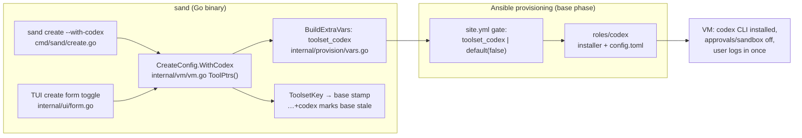
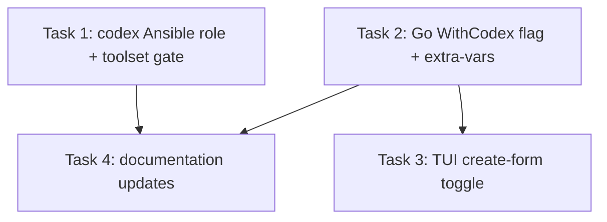

# Plan: OpenAI Codex as an Optional Toolset Tool

## Original Work Order

> Add support for installing OpenAI Codex as an optional tool. If possible, it should be configured to enable remote control or phone notifications like we do with Claude Code.

## Plan Clarifications

| Question | Answer |
| --- | --- |
| Codex CLI cannot do Claude-style phone remote control (that needs the Codex desktop app on macOS/Windows — not available on a headless Linux VM). Phone notifications are only achievable via Codex's `notify` hook pushing to a third-party service like ntfy, which needs user-supplied config. How should the plan handle the "if possible, remote control or phone notifications" clause? | Plain install, document the limits. No notification wiring; docs explain that remote control / phone notifications aren't available from the Codex CLI. |
| Should Codex be selected by default in the toolset (the existing four tools all default ON)? | Default OFF, opt-in via `sand create --with-codex`. Unconfigured creates are unchanged and existing base images stay valid. |
| Should the Codex install get the same friction-free treatment as Claude Code (approvals/sandbox bypassed inside the ephemeral VM), or stay stock? | Match Claude's setup: provision `~/.codex/config.toml` with approvals and sandboxing bypassed, documented in the security model alongside Claude's. |
| Is backwards compatibility required anywhere for this change? | No BC work needed. Default-OFF means no observable change for existing users; the existing stamp machinery already tolerates unknown tool names. |
| Where does the official installer put the binary, and what does it need? *(auto-resolved during refinement: verified by downloading and inspecting `chatgpt.com/codex/install.sh`)* | Default destination is `$HOME/.local/bin/codex` (a symlink to a versioned install; `CODEX_INSTALL_DIR` overrides). Linux x86_64 and aarch64 are served as static musl builds, so there is no glibc coupling. It needs only `sh`, `curl`, and `tar`+gzip; it appends its own PATH line to a shell profile and self-checks with `codex --version`. |
| Does molecule cover the new role? *(auto-resolved during refinement: verified against `molecule/`)* | No — molecule has `base` and `samba` scenarios only, and no scenario exercises the network curl-pipe installer roles (claude-code has no molecule coverage either). Codex role verification belongs to the Go test suite and the real-VM self-validation, not molecule. |
| Do the docs currently document the toolset toggles or `--with-*` flags anywhere? *(auto-resolved during refinement: verified by searching `docs/`)* | No — `tui.md` documents only the reset preserve-toggles, and `cli-reference.md`'s help dump predates all toolset flags. The docs work in this plan is therefore additive and definitive, not conditional. |

## Executive Summary

This plan adds the OpenAI Codex CLI as the fifth entry in sandbar's configurable base-image tool-set, and the first one that defaults to off. A user who wants Codex passes `--with-codex` to `sand create` (or ticks the new checkbox in the TUI create form); everyone else's VMs, base images, and toolset stamps are untouched. The implementation follows the repository's documented extension recipe exactly — a new Ansible role gated from `site.yml`, a `toolset_codex` selection variable, a `WithCodex` field registered in `CreateConfig.ToolPtrs()`, a CLI flag, and a TUI toggle — so the base-image staleness detection, stamp adoption, and shrink-warning machinery all pick the new tool up without modification.

Inside the VM, Codex is configured the way Claude Code already is: no credential is provisioned (the user signs in interactively with their ChatGPT account once), and approvals and sandboxing are switched off in a provisioned `~/.codex/config.toml`, which is appropriate for the same reason Claude's permission prompts are skipped — the VM is ephemeral, isolated, and disposable. This keeps one coherent security story instead of two.

The work order's "remote control or phone notifications" clause resolves to documentation rather than configuration: OpenAI's phone remote control requires the Codex desktop app on macOS or Windows with QR device pairing and is explicitly unavailable from the Codex CLI, so a headless Linux VM cannot offer it. Rather than bolt on a third-party push service, the docs will state the limitation plainly next to the section that explains how Claude Code's remote control works, so users can make an informed choice of agent.

## Context

### Current State vs Target State

| Current State | Target State | Why? |
| --- | --- | --- |
| The configurable tool-set is claude, ddev, go, java — all default ON | A fifth tool, `codex`, exists and defaults OFF | The work order asks for Codex as an optional tool; opt-in keeps existing bases valid and unchanged |
| `sand create` has `--with-claude/--with-ddev/--with-go/--with-java`; the TUI create form has four matching toggles | `--with-codex` and a matching TUI toggle exist | The tool-set is user-selectable at create time; Codex must be selectable through both entrypoints |
| Only Claude Code is installed as an agent CLI, via `roles/claude-code` | A `codex` role installs the Codex CLI via OpenAI's official installer when selected | Users who prefer Codex can provision it without hand-installing it in every VM |
| Claude Code runs friction-free (`skipDangerousModePermissionPrompt`, remote control at startup) with the rationale documented in the security model | Codex runs friction-free too (`approval_policy = "never"`, `sandbox_mode = "danger-full-access"` in a provisioned `~/.codex/config.toml`), with the same documented rationale | One coherent security story; agent prompts add no safety in a disposable, isolated VM |
| Docs describe Claude Code's remote control and phone notifications as a headline capability | Docs additionally state that Codex has no CLI-reachable remote control or phone notifications, and how Codex login works on a headless VM | Sets accurate expectations; the work order's "if possible" clause resolves to "not possible from the CLI" |

### Background

Sandbar (`sand`) provisions disposable Claude Code development VMs on Lima from a single Go binary that embeds an Ansible playbook. Tool selection is a first-class, well-documented extension point:

- `site.yml` gates the `claude-code` role on `toolset_claude | default(true)` and skips it in the `finalize` phase (heavy installs belong to the shared base image).
- `roles/base/defaults/main.yml` is the single home for the `toolset_*` selection defaults, with a comment explaining why they live together.
- `internal/vm/vm.go` declares `CreateConfig.ToolPtrs()` as "the ONE place the tool names live": the toolset stamp key (`ToolsetKey`), stamp adoption (`ApplyToolset`), and `sand create`'s adopt-what-the-base-has flag logic all iterate it generically. Its comment states the recipe: "Adding a tool means adding a field, a line here, and its flag; nothing else has to learn the name."
- `internal/provision/vars.go` (`BuildExtraVars`) forwards the selections to Ansible as extra-vars for the base phase only.
- `internal/ui/form.go` renders the toolset toggles in the TUI create form.
- The base image's version stamp embeds the toolset key, so enabling Codex on an existing base marks it stale and converges the addition in place; the shrink-warning machinery (`parseToolset`, `shrunkTools`) warns when a de-selection cannot be converged away. Unknown tool names in a stamp degrade to "not selected" in older binaries, which is why no compatibility work is needed.

Verified facts about OpenAI Codex that shape this plan (checked against OpenAI's current docs, July 2026):

- Install is a standalone official installer at `https://chatgpt.com/codex/install.sh` (curl-piped shell, macOS and Linux; the URL 302-redirects to the latest GitHub release asset) — the same shape as Claude Code's `https://claude.ai/install.sh`, so the role can mirror `roles/claude-code` task-for-task. Verified against the current script: it installs a symlink at `$HOME/.local/bin/codex`, serves Linux x86_64 and aarch64 as static musl builds (no glibc coupling), requires only `sh`/`curl`/`tar`+gzip (all in the base image), appends its own PATH line to a shell profile, and self-verifies with `codex --version` before exiting.
- Authentication is an interactive ChatGPT sign-in; sandbar's existing policy of provisioning no credential and having the user log in once inside the VM carries over directly. The login flow opens a browser callback on a localhost port, so headless sign-in needs the upstream-documented workaround (SSH port forwarding or copying an existing auth file); the docs must cover this.
- Phone remote control ("Codex Remote") pairs the ChatGPT mobile app with the Codex **desktop app** on macOS/Windows via QR codes. OpenAI's docs state setup and device control are not available from the Codex CLI or IDE extension — so it is structurally impossible on a headless Linux VM, not merely unimplemented here.
- The CLI's only notification mechanisms are a `notify` hook (external program invoked with a JSON payload on `agent-turn-complete` / `approval-requested`) and terminal-level TUI notifications. Reaching a phone would require routing the hook through a third-party push service; the clarification decision was to not do this.
- Codex reads `~/.codex/config.toml`; `approval_policy = "never"` and `sandbox_mode = "danger-full-access"` are the equivalents of Claude's skipped permission prompts. (Codex's own sandbox is redundant inside a VM that exists to be the sandbox.)

## Architectural Approach

The change follows the existing five-surface recipe for a toolset tool; no new abstractions are introduced. The only deliberate deviation from the four existing tools is the default value (OFF), which the machinery already supports — `ToolsetKey` renders only enabled tools, so a default-OFF tool leaves every existing stamp byte-identical.

### Ansible: `codex` role and playbook gate

**Objective**: Install and configure the Codex CLI on the base image when selected, mirroring the `claude-code` role so the two agent roles stay structurally parallel.

A new `roles/codex` follows `roles/claude-code`'s task sequence: resolve the user's home via getent, create `~/.codex`, deploy `config.toml` from a template, run the official installer (`curl -fsSL https://chatgpt.com/codex/install.sh | sh`) as the VM user with a `creates:` guard on the verified install destination `{{ user_home }}/.local/bin/codex`, and ensure `~/.local/bin` is on the PATH with the same idempotent `lineinfile` pattern the claude-code role uses. The PATH task is duplicated rather than shared because Codex can be selected with Claude de-selected; the role must be self-sufficient. (The installer also appends its own PATH export to a shell profile; the role's `lineinfile` regexp pattern is idempotent against that, and keeping the explicit task makes PATH a provisioned guarantee rather than an installer side effect.)

The provisioned `config.toml` sets `approval_policy = "never"` and `sandbox_mode = "danger-full-access"` — the Codex equivalents of Claude's `skipDangerousModePermissionPrompt` — per the clarified decision to match Claude's friction-free treatment. No credential, `notify` hook, or remote-control configuration is provisioned.

`site.yml` gains a `codex` role entry gated on `toolset_codex | default(false) | bool` and `provision_phase != 'finalize'`, directly parallel to the claude-code entry. `toolset_codex: false` joins its siblings in `roles/base/defaults/main.yml` with a comment noting it is the first opt-in selection (and the existing "All four default true" comment is updated). Like `toolset_claude`, it installs no apt packages, so `toolset_packages` is untouched.

### Go: CreateConfig, CLI flag, and extra-vars

**Objective**: Make the selection expressible and durable — flag in, stamp out — by registering the tool in the one place the names live.

`CreateConfig` gains a `WithCodex bool` field; `DefaultCreateConfig` leaves it false (documented as the deliberate deviation from the all-on siblings); `ToolPtrs()` gains the `"codex"` entry. That single registration is what makes `ToolsetKey` (stamp key), `ApplyToolset` (stamp adoption), the create-time adopt-unless-explicit flag logic, and the shrink-warning advisory all work for Codex with no further changes — the plan explicitly relies on this documented invariant rather than touching those call sites.

`cmd/sand/create.go` registers `--with-codex` alongside the other four toolset flags with help text following their pattern, defaulting from `cfg.WithCodex`. `internal/provision/vars.go` emits `toolset_codex` with the other toolset vars for the base/full phases (and continues to omit them for finalize).

### TUI: create-form toggle

**Objective**: Keep the TUI and headless CLI equivalent, as they are for the existing four tools.

`internal/ui/form.go` gains an "Install OpenAI Codex" toggle in the toolset list, wired to a `toolCodex` model field with the same base-wide help text treatment, initialized from the (possibly base-adopted) `CreateConfig` and written back on submit exactly as the Claude toggle is. Reset mode's "preserve Claude Code settings" toggle is intentionally not extended to Codex — preservation is out of scope (see Notes).

### Documentation and security-model updates

**Objective**: Set accurate expectations — how to select and log in to Codex, and precisely why Claude-style remote control does not carry over.

- **Available Tools**: list the Codex CLI as opt-in (`--with-codex` / TUI toggle), in contrast to the default-on tools.
- **First VM / logging in**: a "Logging into Codex" passage parallel to the Claude one — no credential is provisioned; run `codex` once and sign in with a ChatGPT account; include the headless-login caveat (browser callback on a localhost port) and the upstream-documented workaround.
- **Security model**: add Codex to the friction-free rationale — approvals and sandboxing are off deliberately because the VM itself is the sandbox — alongside the existing Claude bullet points, and note that no Codex credential is provisioned.
- **Remote control expectations**: where the docs describe Claude Code's remote-control notifications, state that Codex offers no CLI-reachable equivalent (desktop-app-only pairing), so users choosing Codex should not expect phone notifications from the VM.
- **CLI reference**: the `sand create --help` dump in the CLI reference predates the toolset flags entirely; regenerate it so all five `--with-*` flags appear (fixing the four missing ones is a one-command regeneration, not scope creep).

## Risk Considerations and Mitigation Strategies

Technical Risks

- **Installer drift**: OpenAI's installer URL, install destination, or auth flow may change (the docs host already moved once; the installer URL redirects to the latest GitHub release asset, so its contents change with every Codex release).
    - **Mitigation**: pin behavior to the official `chatgpt.com/codex/install.sh` entrypoint only; guard idempotence with `creates:` on the verified destination (`~/.local/bin/codex`); the real-VM self-validation below catches destination drift.
- **Config schema drift**: `approval_policy` / `sandbox_mode` names could change in a future Codex release.
    - **Mitigation**: values are confined to one template file; self-validation runs `codex --version` and starts `codex` against the provisioned config to confirm it parses cleanly.
- **Headless login friction**: the ChatGPT sign-in callback targets localhost, which is awkward inside a VM.
    - **Mitigation**: documentation-first — the docs describe the upstream-supported headless flow; sandbar deliberately provisions no credential (same policy as Claude).

Implementation Risks

- **Stamp/adoption regressions**: mis-registering the tool could perturb toolset stamps for users who never asked for Codex.
    - **Mitigation**: default OFF means `ToolsetKey` output is unchanged unless Codex is enabled; extend the existing table-driven tests (`vars_test.go`, `vm_test.go`, `baseversion` tests) to prove both the unchanged-default and enabled cases.
- **Role divergence**: the codex role silently drifting from the claude-code role's conventions (phase gating, become-user, ownership).
    - **Mitigation**: the role is written as a structural mirror of `roles/claude-code`; review compares them side by side.

Expectation Risks

- **Users expect Claude-parity remote control from Codex** because the work order framing suggested it.
    - **Mitigation**: the docs state the desktop-app-only limitation explicitly, adjacent to the Claude remote-control description, so the difference is discoverable at the moment of choosing.

## Success Criteria

### Primary Success Criteria

1. `sand create --with-codex` provisions a VM whose base image contains the Codex CLI on the PATH of the VM user, with `~/.codex/config.toml` present, owned by that user, and containing the approvals/sandbox-off settings; running `codex` reaches its ChatGPT sign-in prompt.
2. An unconfigured `sand create` (and the TUI form with the toggle left off) produces a base image without Codex, and its toolset stamp is byte-identical to what the previous release produces — existing bases are not marked stale.
3. Enabling `--with-codex` against an existing base marks it stale and converges Codex onto it in place; subsequently de-selecting it triggers the existing shrink advisory naming `codex`.
4. The TUI create form shows the Codex toggle, and its selection round-trips into the provisioned VM.
5. `go test ./...` passes with new coverage for the codex wiring, and the docs build (mkdocs) succeeds with the new content.

## Self Validation

After all tasks are complete, verify on a real host with Lima:

1. Run `sand create --with-codex --name codex-check` headlessly. When it completes, run `sand shell codex-check` (or `limactl shell`) and execute: `command -v codex` (expect a path under the VM user's PATH), `codex --version` (expect a version string), and `cat ~/.codex/config.toml` (expect `approval_policy = "never"` and `sandbox_mode = "danger-full-access"`, file owned by the VM user).
2. In the same shell, run `codex` interactively for a few seconds and confirm it starts and presents its sign-in flow rather than erroring on the provisioned config; exit without authenticating.
3. On the host, inspect the base stamp file for `sandbar-base` and confirm its toolset suffix now contains `codex` (e.g. `…:claude+codex+ddev+go+java`).
4. Delete the check VM, then run a plain `sand create --name default-check` with no toolset flags against a fresh base (or `--rebuild`): confirm the stamp suffix omits `codex` and `command -v codex` inside the VM finds nothing.
5. Run `sand` (TUI), open the create form, and confirm the "Install OpenAI Codex" toggle renders, defaults off, and toggles; capture the form state visually if a screenshot harness is available.
6. Run `go test ./... -race` and build the docs site locally; confirm the Available Tools and Security Model pages render the new Codex sections by opening the built pages.

## Documentation

- `docs/getting-started/available-tools.md`: add the Codex CLI as an opt-in tool with its selection mechanism.
- `docs/getting-started/first-vm.md`: "Logging into Codex" passage (interactive ChatGPT sign-in, no provisioned credential, headless-login caveat and workaround), plus the remote-control expectation note adjacent to the existing Claude remote-control section.
- `docs/reference/security-model.md`: Codex bullets mirroring Claude's — approvals/sandbox off deliberately, no credential provisioned.
- `docs/using-sand/cli-reference.md`: document `--with-codex` and regenerate the stale `sand create --help` dump so all `--with-*` flags appear.
- `docs/using-sand/tui.md`: no change — verified it documents only the reset preserve-toggles, not the create-form toolset toggles, so there is nothing to extend (documenting the create form itself would be new scope).
- `CHANGELOG.md` is release-please-managed; the feature lands via conventional commit messages, not manual edits.
- `AGENTS.md`: no change — verified it references `roles/` only generically and enumerates no tool list.

## Resource Requirements

### Development Skills

- Ansible role authoring (existing repo conventions: getent/home-fact pattern, template deployment, become-user installer runs, phase gating).
- Go development in this codebase (flag wiring, table-driven tests, the toolset stamp machinery) and Bubble Tea-style TUI form conventions in `internal/ui`.
- MkDocs documentation editing.

### Technical Infrastructure

- Network access to `chatgpt.com` from the VM during provisioning (same class of dependency as the existing `claude.ai` installer fetch).
- A Lima + KVM capable host for the e2e self-validation steps; the standard `go test ./...` suite for everything else. (Molecule is deliberately not extended: its scenarios cover `base` and `samba` only, and no network curl-pipe installer role — claude-code included — is exercised there.)
- A ChatGPT account is **not** required for validation — sign-in is only reached, not completed.

## Integration Strategy

The change rides entirely on existing integration points: the toolset extra-vars flow (`BuildExtraVars` → `site.yml` gates), the base-image stamp lifecycle (staleness, in-place convergence, shrink advisory), and the base/finalize phase split (Codex installs in the base phase only, like Claude). No new host-side state, secrets, or files are introduced; `~/.codex` lives entirely inside the VM and is destroyed with it.

## Notes

- Reset mode's "preserve Claude Code settings" is deliberately **not** extended to Codex logins in this plan — it was not requested, and preservation copies credentials out of the VM, which deserves its own security consideration if ever wanted.
- No `notify` hook, ntfy/push integration, or TUI-notification configuration is provisioned, per the clarification decision; if OpenAI later ships CLI-reachable remote control, enabling it would be a new work order.
- `toolset_codex` is the first default-false selection; the comment block in `roles/base/defaults/main.yml` (which currently says "All four default true") must be reworded as part of the change so the one-home-for-selections rule stays accurate.

### Change Log

- 2026-07-16: Refinement pass. Verified the official installer by inspection and baked in its facts (destination `~/.local/bin/codex`, static musl builds for both Linux arches, `sh`/`curl`/`tar` only, self-adds a PATH profile line, self-checks `codex --version`), replacing the "confirm during implementation" placeholder in the role design and the `creates:` guard. Softened an unverified "fails loudly on unknown keys" claim into a concrete parse-check validation step. Corrected the resource notes to state molecule is deliberately not extended (no installer role has molecule coverage). Made the `tui.md` and `AGENTS.md` documentation items definitive (both verified: no change needed). Recorded all four verifications as auto-resolved entries in Plan Clarifications.
- 2026-07-16: Task generation. Decomposed into 4 tasks (ansible role/gate, Go wiring, TUI toggle, docs) with tests folded into the implementation tasks; appended the Execution Blueprint below.

## Execution Blueprint

**Validation Gates:**
- Reference: `/config/hooks/POST_PHASE.md`

### Dependency Diagram

### ✅ Phase 1: Provisioning and CLI wiring
**Parallel Tasks:**
- ✔️ Task 1: Create the codex Ansible role and gate it as an opt-in toolset selection — `completed`
- ✔️ Task 2: Wire WithCodex through CreateConfig, the --with-codex flag, and Ansible extra-vars — `completed`

### Phase 2: TUI and documentation
**Parallel Tasks:**
- Task 3: Add the "Install OpenAI Codex" toggle to the TUI create form (depends on: 2)
- Task 4: Document Codex — available tools, login, security model, CLI reference (depends on: 1, 2)

### Post-phase Actions

- After each phase: run the full Go test suite (`go test ./...`) and, for Phase 1, `ansible-playbook site.yml --syntax-check`; apply the verification gate before marking the phase complete.

### Execution Summary
- Total Phases: 2
- Total Tasks: 4
