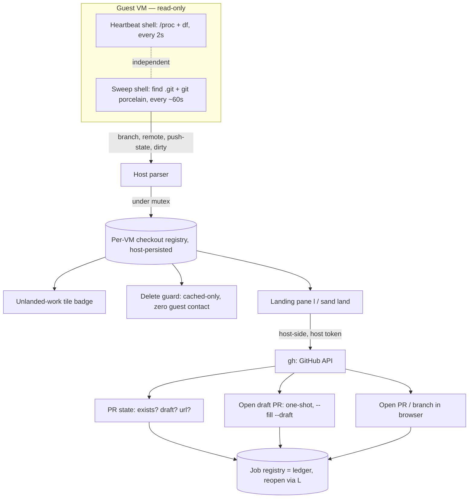

# Plan: The "land" Flow — From VM Branch to Pull Request, Without the Web UI

## Original Work Order

> Create a plan for sandbar's "land" feature — deliberate guest→host work
> extraction, converting the no-host-mount design into an auditable boundary.
> Full converged design is in project memory (sandbar-land-feature-design.md).
> Summary of decisions already made with the user:
>
> - Name: "land" (sand land CLI, Landing pane, "unlanded work" badge).
>   Keybinding: `l` = land, existing log verb rebinds to `L` (enter already
>   routes to log mid-build via enterTarget).
> - Phase 1 (shippable core): per-VM checkout registry — discovery via periodic
>   `find ~ -name .git` sweep piggybacked on the existing heartbeat stream (~60s
>   cadence, NOT fsnotify, no guest daemon); worktrees (.git files) are
>   first-class rows grouped under parent repo; caps (depth, ~50 checkouts,
>   per-repo timeout, logged truncation). Registry host-persisted per VM: (path,
>   kind, parent, branch, upstream, ahead/behind, dirty, last-seen). Powers the
>   tile badge and a ZERO-GUEST-CONTACT delete guard (delete must never exec into
>   the guest — aligns with delete-if-compromised; guard reads only cached
>   registry, stale-labeled for stopped VMs).
> - Phase 2: Landing pane with independent, state-gated verbs (mirroring
>   vmCommands enabledFor idiom): push (ahead>0 or no upstream), open PR alone
>   (branch already on remote), push+PR combo, export bundle/patch over existing
>   download path, view diff. Exec via bash -lc in guest (GH_TOKEN wiring
>   exists). gh adapter first; glab (gitlab/drupal.org) later. Lazy "PR already
>   exists" check at pane-open. All actions log through the job registry (ledger,
>   reopenable via L).
> - Hard no: auto-push on destroy (user decision, contradicts
>   delete-if-compromised).
>
> The plan should likely scope Phase 1 as the deliverable with Phase 2 as a
> clearly-bounded follow-up (or structure both if the framework prefers one plan
> with phases).

**Note:** the work order captured the *original* design. Through refinement
(see Plan Clarifications) the feature was deliberately narrowed: **land no longer
moves code to the host at all.** It is a pull/merge-request cockpit. The guest
side is read-only detection; every *action* is a host-side GitHub API call using
the workstation's own `gh` credential. Local code extraction (bundle, patch,
guest-side push exec) was removed.

## Plan Clarifications

| Question | Answer |
| --- | --- |
| Cover only Phase 1, or the full feature including the Landing pane? | Both phases, one plan. |
| Backwards compatibility for the `l`→log / `L` rebinding? | Clean break. `l` = land, `L` = log immediately; docs and the `?` keys screen updated; no transitional behavior. |
| Which forge adapters are in scope? | `gh` only (GitHub). GitLab/drupal.org detection still shows state, but the one-key MR action (`glab`) is a later follow-up. |
| When does the repo sweep run? | Always, at slow cadence (~60s), for every running VM — so the badge and delete guard are accurate with no user action. |
| Auto-push on destroy? | Hard no. It contradicts the "delete the VM if you think it's compromised" strategy. Excluded. |
| How does the sweep avoid stalling the live CPU/mem gauges? *(refinement)* | The sweep runs in its **own** long-lived `limactl shell` + goroutine, a sibling of the stats heartbeat, not injected into the heartbeat's sequential loop. One extra SSH connection per running VM; the heartbeat's own cost reasoning (fine at 1–10 VMs) applies. |
| How does headless `sand land NAME` discover checkouts without a running TUI/registry? *(refinement)* | It runs a **one-shot sweep** itself (no persisted registry needed) then acts host-side. Detection and PR logic are shared code both the pane and CLI call. |
| Is land a code-extraction tool? *(pivot)* | **No.** Bundle/patch export and any guest→host code copy are removed. `u`/`g` (upload/download) remain, reframed for **non-executable data** (SQL dumps in, test screenshots/videos out) — never code. Code reaches the host only through the user's normal `gh pr checkout`/pull *after* reviewing the PR on GitHub. |
| Where do land's actions run, and with which token? *(pivot)* | **Host-side, with the workstation's `gh` token.** Opening a PR is a metadata API call against a branch already on GitHub — no code touches the host. This also sidesteps the deliberately least-privilege *guest* token, which often lacks `pull_requests: write`. The guest pushes (guest token, in the shell/agent); the host opens the PR (host token). |
| PR creation: form or one-shot? *(pivot)* | **One-shot draft.** Title/body auto-filled from the pushed branch's commits, base = repo default branch, `--draft`. The user refines on GitHub, where they were headed anyway. No in-TUI form. |

## Executive Summary

sandbar's defining tradeoff is that it never mounts host directories into a
guest: a VM is a sealed box whose entire disk vanishes on `limactl delete`,
which is what makes cleanup provable. The friction that buys is getting *results*
out. The canonical way results leave a VM is already the safe one — the agent (or
the user, in the shell) **pushes a branch to GitHub**, where GitHub's web UI is a
review surface on which nothing auto-executes. What's missing is only the last
mile: noticing that a branch has been pushed and turning it into a pull request
without a detour to the browser. This plan builds exactly that and nothing more.

The feature is a **pull-request cockpit** for the board, built on one foundation.
The foundation is a **per-VM checkout registry**: a slow-cadence repository sweep
— a sibling of the existing guest heartbeat, on its own connection so it never
stalls the live gauges — discovers every git checkout (and worktree) under the
guest home and records, per checkout, its branch, remote, push state, and dirty
state on the host. That registry is the *bridge* that ties a VM tile to a GitHub
branch. It powers an **unlanded-work badge** (a branch pushed but not yet in a PR
is actionable; a branch with unpushed/uncommitted work is at-risk) and a **delete
guard** that — reading only cached host data, never touching the guest — warns
before you delete a VM whose work exists nowhere but inside it. On top sits the
**Landing pane** (`l`): for a branch that's been pushed, one keystroke opens a
**draft pull request**, and for one that already has a PR it jumps you to it. The
same logic backs a headless `sand land NAME`.

The decisive design choice is that **land moves decisions, not code.** Its only
guest interaction is the read-only sweep; every *action* is a host-side GitHub
API call (`gh`, with your workstation credential) against branches that already
live on GitHub. No bundle, no patch, no guest→host code copy. This resolves the
"landed code auto-executes when I open it in my IDE" hazard by construction — the
only bytes crossing to your host are PR metadata; the code arrives later, through
review, by your own hand. It also cleanly splits the two credentials already in
play: the least-privilege **guest** token pushes; your broad **host** token opens
the PR — each doing exactly the job it's scoped for.

## Context

### Current State vs Target State

| Current State | Target State | Why? |
| --- | --- | --- |
| A pushed VM branch becomes a PR only by leaving the board for the GitHub web UI. | `l` on the tile opens a draft PR from the board; if a PR already exists, it jumps you there. | Close the last-mile gap in the canonical push-to-GitHub workflow without a browser detour. |
| The board shows CPU/mem/disk but nothing about *work* inside a VM. | Tiles carry an "unlanded work" badge: a branch pushed-but-PR-less (actionable) or with unpushed/uncommitted work (at-risk). | You cannot see, at a glance, which VMs hold work that isn't yet a PR — or work that would vanish on delete. |
| `d` (delete) removes the VM with a generic confirmation; unpushed work is silent data loss. | Delete confirmation names work that lives *only* in the VM, read from cached host data, never touching the guest. | Convert the isolation tradeoff into a safety feature without weakening delete-if-compromised. |
| sand knows only about the single create-time clone; other repos/worktrees are invisible. | A per-VM registry discovers *all* git checkouts and worktrees under the guest home. | Real VMs accumulate many repos and worktrees; a single-repo assumption is wrong. |
| `l` reopens the last build/transfer log. | `l` opens the Landing pane; `L` reopens the log. | "land" earns the prime key; log-reopen is rare/forensic and `enter` already routes to it mid-build. |
| `u`/`g` are described loosely as file copy. | `u`/`g` are for **non-executable data** (SQL dumps in; screenshots/videos/artifacts out) — explicitly *not* a code path. | Keep an easy code-exfil path from existing by accident; code leaves only via push→PR→review. |

### Background

Key existing machinery this plan builds on (verified in the codebase):

- **Heartbeat** (`internal/ui/heartbeat.go`): one long-lived `limactl shell` per
  running VM runs a **single sequential** guest loop — `while true; do cat
  /proc/stat /proc/meminfo; df -kP /; echo delim; sleep 2; done` — and the host
  parses the stream. Because that loop is sequential, any heavy command injected
  into it would block the 2s stats cadence and freeze the gauges. The sweep
  therefore runs as its **own** long-lived shell and goroutine (same pattern, own
  connection, own parser, ~60s sleep). The heartbeat's doc comment prizes a
  *deliberately dumb* guest side ("a clever guest script is a thing that breaks
  on a distro nobody tested"); the sweep honors that — a plain `find` + a handful
  of read-only `git` porcelain reads, no bespoke guest program. Both shells feed
  the model as messages recorded under a mutex in a pointer-held registry (Bubble
  Tea passes the model by value); the sweep reuses the heartbeat's hard-won
  `waitDelay`/orphaned-ssh handling.
- **Job registry / logs** (`internal/ui/jobs.go`, `commandreg.go` `log` verb):
  runs are streamed into a viewport and *retained*, so a finished/failed run can
  be reopened. Each land PR action is modeled as a job so it streams live and
  persists as a ledger entry, reopenable via `L`.
- **Two credentials, two jobs** (`internal/provision/gitcred.go`, secrets docs):
  the **guest** token — a create-time clone token in the per-org
  `~/<host>/<org>/.env`, re-applied to `~/.config/sandbar/secrets.env` each start
  — is deliberately least-privilege and often carries no `pull_requests: write`.
  It is enough to **push**. The **host** token is the user's own workstation `gh`
  auth. land uses the *host* token for PR actions; the guest token's only role
  (pushing) happens in the shell/agent, not in land.
- **Per-VM verbs** (`internal/ui/commandreg.go` `vmCommands`, `enterTarget`):
  each verb has an `enabledFor` gate; `enter` routes to the one obvious verb for
  a tile's state. The land verb adopts the same `enabledFor` idiom, gated by
  registry + PR state.
- **Provider delete** (`internal/provider/provider.go` `Delete(name, force)`):
  the delete path. The guard wraps the *confirmation*, not the delete call, and
  adds zero guest interaction.
- **CLI dispatch** (`cmd/sand/main.go`): a simple switch routes `create`/`shell`
  to `runCreate`/`runShell` via a single-profile resolve. `sand land` slots in
  the same way.

The no-host-mount stance is documented in `docs/reference/security-model.md`
(Samba forced off, no host-home share); land is the intentional, audited
counterpart — and, because it moves only PR metadata, it never reintroduces a
code path onto the host.

## Architectural Approach

Three layers over one foundation. The **sweep** (guest, read-only) is the bridge
that maps a VM to its GitHub branches. The **registry** (host, cached) is the
spine every consumer reads. The **badge** and **delete guard** are pure registry
readers that never touch the guest. The **Landing pane / CLI** reads the registry
to decide what's actionable, then acts entirely **host-side via `gh`** — no guest
execution on any action, and no code copied to the host, ever.



### Component 1 — The checkout registry and detection sweep

**Objective**: Establish the single source of truth that maps *this VM* to its
GitHub branches, gathered read-only from the guest, without a guest daemon.

A **second** long-lived `limactl shell` per running VM (a sibling of the stats
heartbeat, own connection and goroutine so it never blocks the 2s gauges) runs a
bounded discovery loop at ~60s: `find` from the guest home for `.git` entries,
matching both directories (normal checkouts) and files (worktree pointers),
pruning noise directories (`node_modules`, caches) and honoring a depth cap and a
total-checkout cap (~50). For each checkout it reads a fixed set of
`git --no-optional-locks` porcelain values — current branch; the branch's
configured **remote and upstream** (read, not assumed to be `origin`), parsed to
`(forge host, org/repo)`; **push state** (has upstream and `rev-list --count`
ahead==0 ⇒ pushed and current; ahead>0 ⇒ unpushed commits); and dirty-file count
(`status --porcelain`). Everything is read-only and each repo's reads are wrapped
in `timeout` so one pathological repo cannot stall the sweep. When caps truncate
the result, that fact is emitted and surfaced, not silently dropped.

The host parses the sweep shell's stream (its own delimiter, distinct from the
stats stream) into a **per-VM checkout registry**: pointer-held, mutex-guarded,
updated only from the parser goroutine via a message applied in `Update` (the
concurrency contract the heartbeat established). Each row carries: path, kind
(repo | worktree), parent repo (for worktrees), branch, forge+org/repo, push
state, ahead/behind, dirty count, and a last-seen timestamp. It is
**host-persisted per VM** — as a single JSON file under sand's state dir
(`${XDG_DATA_HOME:-~/.local/share}/sandbar/`, sibling to `secrets.json`, mode
`0600`, atomic rewrite, single writer = the TUI sweep) — so the badge and delete
guard have data even when the VM is stopped, with last-seen driving a "stale"
label. Entries are keyed by profile connection + VM name, matching the secrets
store's connection-scoping so a same-named VM on two profiles never collides.

### Component 2 — The unlanded-work badge

**Objective**: Show, at a glance, which VMs hold work that isn't yet a PR — and
which hold work that exists nowhere but the VM.

The tile renderer gains a small badge derived purely from the registry, with two
distinct meanings aggregated across the VM's checkouts:

- **Actionable** — a branch **pushed but with no open PR**: the thing land can
  act on. Rendered in the status bands' existing amber `⚠` warn vocabulary
  (`internal/ui/header.go` and the band styles), the same "worth your attention"
  cue already established — not a new visual language.
- **At-risk** — **unpushed commits and/or uncommitted changes**: work that lives
  only inside the VM (an `↑N` / dirty marker). This is what the delete guard keys
  on.

It follows the heartbeat/gauge philosophy: it shows only what the registry
actually observed; a VM whose registry is empty or stale shows nothing (or a
clearly stale indicator), never a fabricated state. It must fit the existing tile
layout and status bands, and degrade cleanly on a never-swept VM. PR-existence
(the "no open PR" half) comes from the lazy host-side check in Component 4;
until that resolves, the badge reflects push/dirty state alone.

### Component 3 — The delete guard (zero guest contact)

**Objective**: Prevent silent loss of VM-only work at delete time *without ever
executing inside the guest*, preserving the delete-if-compromised invariant.

The `d` confirmation dialog is extended: when the target VM's cached registry
shows work that exists only in the VM, the confirmation names it, distinguishing
the two categories honestly — e.g. "3 unpushed commits + uncommitted changes
(only in this VM — lost on delete); 1 branch pushed without a PR (safe on
GitHub)." For a stopped VM it labels the data as of its last-seen time. This is a
**hard boundary**: the guard reads only the host-persisted registry and issues
**no** `limactl shell`, no guest exec, nothing that touches the instance —
deleting a VM you believe is compromised must remain a pure, guest-untouched
`limactl delete`. The guard is informational only; it never blocks and never
auto-lands. Delete's existing semantics (removes disk and host-stored secrets,
irreversible, `force` skips prompts) are unchanged; only the confirmation copy
gains the warning.

### Component 4 — The Landing pane (a pull-request cockpit)

**Objective**: Turn a pushed VM branch into a draft PR from the board, host-side,
without the web UI — and jump to the PR once it exists.

`l` on a focused, running VM opens the **Landing pane**, listing the VM's
checkouts (worktrees grouped under their parent) with each one's branch and
state. On pane open, a **lazy host-side check** resolves PR state for each
pushed branch — `gh pr list -R <org/repo> --head <branch> --json
number,url,state,isDraft`, using the **workstation's** `gh` token. Each checkout
then falls into one obvious state with one obvious action (the `enabledFor`
idiom):

| Registry + gh say | Pane row | Action (key) |
| --- | --- | --- |
| branch pushed, **no** PR | "pushed · no PR" (amber) | **Open draft PR** |
| branch pushed, PR #N open | "PR #N (draft)" + status | **Open in browser** (`gh pr view --web`) |
| unpushed commits / dirty | "↑N unpushed" (at-risk) | none — *push in the shell first* |
| no remote at all | "local only" | none |

**Open draft PR is one-shot** (per clarification): title and body auto-filled
from the pushed branch's commits, base = the repo's default branch, `--draft`.
The reliable host-side mechanism is `gh` with the workstation token and **no
local checkout** — `gh pr create -R <org/repo> --head <branch> --base <default>
--fill --draft` where gh supports it headlessly, falling back to a direct
`gh api --method POST /repos/<org/repo>/pulls` with title/body read from the
branch's head commit via `gh api` (the exact invocation is a task-time detail to
pin against gh's headless behavior; both are pure API calls). All inputs
(branch, title, body) pass as **arguments, never shell-interpolated**, so an
attacker-chosen branch name cannot inject — it can only become PR text, which no
more executes than any PR description.

**land performs no guest execution on any action and copies no code to the host.**
Opening a PR references a branch already on GitHub; the only bytes crossing to
the host are PR metadata. This is the core security property. Pushing is *not* a
land verb — it stays in the shell/agent (guest token, where the code is); land
lights up only once the branch is on GitHub. Each gh action runs as a **job**, so
its output streams live and is retained as a **ledger** entry reopenable with `L`.

Forge scope is **`gh`/GitHub only**. A GitLab/drupal.org checkout is still
detected and its state shown, but the one-key MR action (`glab`, host token) is a
deferred follow-up; those rows offer "open in browser" at most.

### Component 5 — Keybinding, CLI, and documentation surface

**Objective**: Rebind cleanly, give CLI parity, and document the boundary.

`l` is rebound to land; the existing **log** verb moves to `L` (clean break; the
`?` keys screen, tile footer, and docs update together). `enterTarget`'s
building→log routing continues to reach log via its id, unaffected by the key
change.

`sand land NAME` gives headless parity, mirroring the `create`/`shell`
single-profile dispatch. It does its **own one-shot sweep** (read-only, guest) to
find checkouts and branches, then acts host-side via `gh`:

```
sand land NAME                 # list checkouts + branch/push/PR state
sand land NAME <path> --pr     # open a one-shot draft PR for that checkout's pushed branch
sand land NAME <path> --web    # open the branch's PR (or the branch) in a browser
```

Documentation updates cover the TUI keybinding tables (`docs/using-sand/tui.md`),
a "Landing" section (the pane, its states, the ledger), `sand land` in the CLI
reference, the `u`/`g` reframe (data, not code) in files-and-shells, and a
`docs/reference/security-model.md` note framing land as the audited counterpart
to the no-host-mount boundary — specifically that **land moves PR metadata, not
code**, so importing landed work never auto-executes on the host, and that code
reaches the host only via the user's own reviewed `gh pr checkout`/pull.

## Risk Considerations and Mitigation Strategies

<details>
<summary>Technical Risks</summary>

- **Sweep cost on large or numerous guest filesystems**: an unbounded `find` +
  per-repo git reads could spike guest I/O or hang.
    - **Mitigation**: prune noise paths, cap depth and total checkouts (~50), wrap
      each repo's reads in `timeout`, run at ~60s. The sweep runs in its **own
      shell/goroutine**, so even a slow sweep cannot stall the 2s stats gauges.
      Surface truncation instead of hiding it.
- **Second long-lived shell per VM**: one more SSH connection + goroutine per VM.
    - **Mitigation**: the heartbeat's own cost analysis already covers this
      (negligible at 1–10 VMs); the sweep reuses its `waitDelay`/orphaned-ssh
      teardown so it leaks nothing on cancel or VM stop.
- **`gh pr create` headless behavior**: gh may resist creating a PR without a
  local git context even with `--head`/`-R`.
    - **Mitigation**: prefer the deterministic `gh api POST /pulls` path (title/
      body from the branch head commit via `gh api`); verify the exact invocation
      at task time against a real remote. Both are pure API, no local checkout.
- **Concurrency corruption of the registry**: Bubble Tea passes the model by
  value.
    - **Mitigation**: mirror the heartbeat contract — pointer-held, mutex-guarded,
      updates only via messages in `Update`, readers take value copies. `-race`.
- **Stale/empty registry for stopped VMs**: badge/guard could imply live truth.
    - **Mitigation**: host-persist with last-seen; render a stale/as-of label
      whenever the VM isn't being swept; never fabricate a state.
</details>

<details>
<summary>Security Risks</summary>

- **Delete guard drifting into guest contact**: a "smarter" guard that refreshed
  state at delete time would execute in a possibly-compromised VM.
    - **Mitigation**: hard rule in code and tests — the guard reads only the
      host-persisted registry, no guest I/O; delete stays a pure `limactl delete`.
      No auto-land, ever.
- **Reintroducing a code path to the host**: the whole hazard land was reshaped
  to avoid.
    - **Mitigation**: land actions are GitHub API calls only; no bundle, patch, or
      guest→host code copy. `u`/`g` are documented as data-only. Code reaches the
      host solely via the user's own reviewed pull. Enforced by there being no
      code-copy action in the land surface (grep/review).
- **Command injection via attacker-chosen branch names into host `gh`**: land
  runs `gh` on the host with the user's token.
    - **Mitigation**: pass branch/title/body as exec arguments, never through a
      shell string; branch names become PR text, not commands. Host `gh` is only
      ever invoked for read (`pr list`) and PR-create/-view — never anything that
      executes repo content.
- **Overclaiming the boundary**: a token-bearing VM can still push anywhere
  itself.
    - **Mitigation**: docs state the provable claim precisely — land controls what
      metadata reaches the host and records it in the ledger; it does not and
      cannot stop a guest from using its own push token.
</details>

<details>
<summary>Implementation Risks</summary>

- **`l`→`L` rebinding: missed references** across code, footer, keys screen, docs.
    - **Mitigation**: one atomic change touching every reference; verify the `?`
      screen and footer render the new mapping.
- **Scope creep** back into bundle/patch/push-verb/glab/auto-land/fsnotify.
    - **Mitigation**: explicit boundaries below; treat any of these as out of
      scope for this plan.
</details>

## Success Criteria

### Primary Success Criteria

1. A running VM with multiple checkouts and a worktree shows each in the registry;
   a branch with unpushed/uncommitted work drives an at-risk badge within one
   sweep cadence, and a pushed-but-PR-less branch drives an actionable amber
   badge.
2. Pressing `d` shows a confirmation that names VM-only work, distinguishing
   "lost on delete" (unpushed/uncommitted) from "safe on GitHub" (pushed, no PR);
   a stopped VM shows it labeled as last-seen; and — verified by observation — the
   delete flow issues **no** guest command.
3. Pressing `l` opens the Landing pane; each pushed branch resolves to a correct
   PR state via the **host** `gh` token; `sand land NAME` lists the same
   headlessly. Log-reopen now responds to `L`; the `?` screen and footer reflect
   the mapping.
4. For a pushed branch with no PR, **Open draft PR** (pane and `sand land NAME
   <path> --pr`) creates a **draft** PR whose title/body are filled from the
   branch's commits, against the repo default base — with **no local checkout and
   no code on the host** — and the action is a reopenable ledger entry (`L`). For
   a branch that already has a PR, the action opens it in the browser instead.
5. A GitLab/drupal.org checkout is detected and its state shown, but offers no
   one-key MR action (deferred), confirming the gh-only action scope.
6. Review confirms land has **no** code-copy/bundle/guest-exec action path, and
   delete performs no landing and no guest contact.

## Self Validation

After all tasks are complete, verify against a real Lima VM (`limae2e`), not just
unit tests, with the host's `gh` authenticated:

1. `sand create` a VM cloning a small GitHub repo with a `GH_TOKEN`; `sand shell`
   in and, on a new branch, make a commit and **push it** (guest token); make a
   second local commit you do *not* push, plus an uncommitted edit; and `git
   worktree add` a worktree. On the board, confirm (screenshot) the tile shows the
   actionable amber badge (pushed-no-PR) and the at-risk marker (unpushed/dirty)
   within one sweep cadence, and the Landing pane (`l`) lists the repo and
   worktree with correct branch/push/PR state.
2. Press `d`; capture the confirmation and confirm it names the unpushed+dirty
   work as "lost on delete" and the pushed branch as "safe on GitHub." With
   host-side tracing on the delete path, confirm **no** `limactl shell`/guest
   command runs during delete. Stop the VM, press `d`, confirm a last-seen label.
3. From the pane, **Open draft PR** on the pushed branch; confirm via `gh pr view`
   that a **draft** PR exists with a commit-derived title, and confirm (host FS +
   process trace) that **no repository code was written to the host** and no local
   clone was created. Reopen the action via `L` and confirm the ledger retained it.
   Repeat via `sand land NAME <path> --pr` and confirm an identical result; run
   `--web` and confirm it targets the PR.
4. Re-open the pane on the branch that now has a PR; confirm the action becomes
   "open in browser," not a duplicate create.
5. Confirm the `?` keys screen and tile footer show `l` = land and `L` = log.
6. `go test ./... -race` passes (incl. registry concurrency tests); a repo grep
   confirms no bundle/patch/guest-exec/code-copy path exists in the land surface
   and no delete-time guest contact.

## Documentation

This plan updates documentation:

- `docs/using-sand/tui.md` — keybindings (`l` = land, `L` = log); the
  unlanded-work badge (actionable vs at-risk); the delete-guard warning.
- `docs/using-sand/files-and-shells.md` — a "Landing" section (pane states,
  one-shot draft PR, ledger); and the **`u`/`g` reframe: data, not code** (SQL
  dumps in; screenshots/videos/artifacts out).
- `docs/using-sand/cli-reference.md` — `sand land` and its `--pr`/`--web` flags.
- `docs/reference/security-model.md` — land as the audited counterpart to the
  no-host-mount boundary: **it moves PR metadata, not code**, so landed work never
  auto-executes on the host; the two-token split (guest pushes, host opens PR);
  and that code reaches the host only via the user's own reviewed pull.
- `AGENTS.md` — the checkout-registry/sweep addition, the zero-guest-contact
  delete invariant, and the "land never copies code to the host" invariant, so
  future changes don't erode them.

## Resource Requirements

### Development Skills

- Go and the Bubble Tea (v2) model/update/message architecture, incl. the
  by-value model and mutex/pointer concurrency contract.
- Lima/`limactl` guest interaction and the existing heartbeat streaming design.
- Read-only git porcelain (`rev-list`, `status --porcelain`, `--no-optional-locks`,
  reading a branch's configured remote/upstream) for detection.
- `gh` CLI **on the host**: `pr list`/`pr view`, and headless PR creation via
  `gh pr create --fill --draft` and/or `gh api POST /pulls`.

### Technical Infrastructure

- Existing: heartbeat channel, job/log registry, provider delete API, CLI
  dispatch — reused, not replaced.
- The workstation's `gh` authentication (host token) for PR actions.
- A `limae2e`-capable host (Lima + KVM) plus a real GitHub repo for end-to-end
  validation.

## Integration Strategy

Every component extends an existing subsystem: the sweep mirrors the heartbeat,
the registry follows the sample-state concurrency pattern, the badge extends tile
rendering, the guard extends the delete confirmation, and the pane/CLI reuse the
job registry and the `create`/`shell` dispatch. The only new external dependency
is the **host** `gh` for PR actions. The `l`→`L` rebind is the only breaking
change and is contained to the keybinding surface.

## Notes

- **Hard boundaries (do not cross):** land never copies code to the host and
  performs no guest execution on any action (guest interaction is the read-only
  sweep only); no auto-push on destroy; the delete guard never contacts the
  guest; no fsnotify or guest daemon; `gh`/GitHub only for the PR action.
- **`u`/`g` are data, not code:** SQL dumps in, test artifacts out — never a code
  extraction path.
- **Deferred follow-ups (out of scope here):** a `glab` MR action for
  GitLab/drupal.org (host token, same shape); any local-artifact/export path (was
  bundle/patch — cut); a push verb inside land; a title/body edit form; richer
  landing history beyond the job-registry ledger.
- **Design of record:** converged decisions live in the user's project memory
  `sandbar-land-feature-design.md`; this plan supersedes it as the authoritative
  artifact for execution.

### Decision Log

| Decision | Rationale |
| --- | --- |
| **land is a PR/MR cockpit, not a code-extraction tool.** Bundle, patch, and any guest→host code copy removed. | The canonical, safe way work leaves a VM is push→GitHub, where review happens off-host and nothing auto-executes. A local-code path re-creates the "open it in an IDE and it runs" hazard that push avoids. |
| **All land actions run host-side via the workstation `gh` token.** Guest interaction is the read-only sweep only. | Opening a PR is a metadata call against a branch already on GitHub — no code touches the host. It also sidesteps the least-privilege *guest* token, which often lacks `pull_requests: write`. Guest pushes; host opens the PR. |
| **Open PR is one-shot draft** (commit-filled title/body, default base, `--draft`); no in-TUI form. | Least friction; the user refines on GitHub, where they were going anyway. |
| **`u`/`g` reframed as data-only** (dumps in, artifacts out). | Keeps an accidental code-exfil path from existing; code leaves only via push→PR→review. |
| Sweep runs in its **own** `limactl shell` + goroutine, not inside the heartbeat loop. | The heartbeat's guest side is a single sequential loop; injecting the sweep would freeze the 2s gauges. A sibling shell keeps gauges live at negligible cost. |
| `sand land NAME` does its **own one-shot sweep**; detection + PR logic shared with the pane. | A headless CLI has no running TUI registry; a one-shot sweep makes it self-contained behind one shared implementation. |
| Registry persists as JSON beside `secrets.json`, atomic, single writer. | Reuses sand's state-dir conventions and `0600` posture; single-writer + read-only CLI avoids a locking protocol. |
| Badge reuses the amber `⚠` band vocabulary. | Consistency: unlanded work is the same "worth your attention" class the bands already express. |

### Change Log

- 2026-07-17 (creation): initial PRD — registry + badge + delete guard + Landing
  pane with push/PR/bundle/diff verbs.
- 2026-07-17 (refinement): sweep moved to its own shell/goroutine; `sand land`
  one-shot-sweep + flags; verb set trimmed to push/PR/bundle/diff; registry
  persistence, amber badge, configured-remote push, bounded diff, bundle cleanup.
- 2026-07-17 (**pivot**): reframed land from code extraction to a **PR/MR
  cockpit**. Removed bundle, patch, the push verb, and every guest→host code
  path. All actions now **host-side `gh` with the workstation token**; guest
  interaction is read-only detection only. "Open PR" is one-shot **draft**
  (commit-filled). Badge split into actionable (pushed-no-PR) vs at-risk
  (unpushed/dirty); delete guard distinguishes "lost on delete" from "safe on
  GitHub." `u`/`g` documented as **data, not code**. gh/GitHub-only for the PR
  action; glab deferred.
