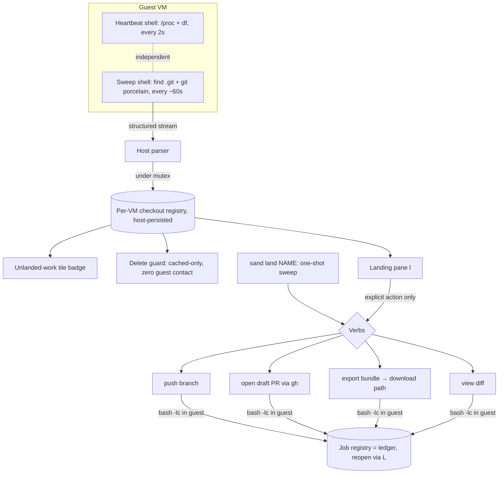

# Plan: The "land" Flow — Deliberate Work Extraction from Disposable VMs

## Original Work Order

> Create a plan for sandbar's "land" feature — deliberate guest→host work
> extraction, converting the no-host-mount design into an auditable boundary.
> Full converged design is in project memory (sandbar-land-feature-design.md).
> Summary of decisions already made with the user:
>
> - Name: "land" (sand land CLI, Landing pane, "unlanded work" badge).
>   Keybinding: `l` = land, existing log verb rebinds to `L` (enter already
>   routes to log mid-build via enterTarget).
> - Phase 1 (shippable core): per-VM checkout registry — discovery via periodic
>   `find ~ -name .git` sweep piggybacked on the existing heartbeat stream (~60s
>   cadence, NOT fsnotify, no guest daemon); worktrees (.git files) are
>   first-class rows grouped under parent repo; caps (depth, ~50 checkouts,
>   per-repo timeout, logged truncation). Registry host-persisted per VM: (path,
>   kind, parent, branch, upstream, ahead/behind, dirty, last-seen). Powers the
>   tile badge and a ZERO-GUEST-CONTACT delete guard (delete must never exec into
>   the guest — aligns with delete-if-compromised; guard reads only cached
>   registry, stale-labeled for stopped VMs).
> - Phase 2: Landing pane with independent, state-gated verbs (mirroring
>   vmCommands enabledFor idiom): push (ahead>0 or no upstream), open PR alone
>   (branch already on remote), push+PR combo, export bundle/patch over existing
>   download path, view diff. Exec via bash -lc in guest (GH_TOKEN wiring
>   exists). gh adapter first; glab (gitlab/drupal.org) later. Lazy "PR already
>   exists" check at pane-open. All actions log through the job registry (ledger,
>   reopenable via L).
> - Hard no: auto-push on destroy (user decision, contradicts
>   delete-if-compromised).
>
> The plan should likely scope Phase 1 as the deliverable with Phase 2 as a
> clearly-bounded follow-up (or structure both if the framework prefers one plan
> with phases).

## Plan Clarifications

| Question | Answer |
| --- | --- |
| Cover only Phase 1, or the full feature including the Landing pane? | Both phases, one plan. |
| Backwards compatibility for the `l`→log / `L` rebinding? | Clean break. `l` = land, `L` = log immediately; docs and the `?` keys screen updated; no transitional behavior. |
| Which forge adapters for "open PR/MR" are in scope? | `gh` only. GitLab/drupal.org checkouts still get push, bundle export, and diff — one-key MR (glab) is a later follow-up. |
| When does the repo sweep run? | Always, at slow cadence (~60s), for every running VM — so the badge and delete guard are accurate with no user action. |
| Auto-push on destroy? | Hard no. It contradicts the "delete the VM if you think it's compromised" strategy. Excluded. |
| How does the sweep avoid stalling the live CPU/mem gauges? *(refinement)* | The sweep runs in its **own** long-lived `limactl shell` + goroutine, a sibling of the stats heartbeat, not injected into the heartbeat's sequential loop. One extra SSH connection per running VM; the heartbeat's own cost reasoning (fine at 1–10 VMs) applies. |
| How does headless `sand land NAME` discover checkouts without a running TUI/registry? *(refinement)* | It runs a **one-shot sweep** itself (no persisted registry needed) and takes verb flags: `--list`, and `<path> --push` / `--pr` / `--bundle DEST` / `--diff`. Discovery and verb logic are shared code both the pane and CLI call. |
| Which export formats and combo verbs? *(refinement)* | **Bundle only**; `format-patch` dropped (YAGNI). The **push+PR combo dropped** — push then PR is two keystrokes. Final verb set: push, open PR, export bundle, view diff. |

## Executive Summary

sandbar's defining tradeoff is that it never mounts host directories into a
guest: a VM is a sealed box whose entire disk vanishes on `limactl delete`,
which is what makes cleanup provable. The cost of that guarantee is that work
does not flow out for free — a competitor's live-mount design has no seam here,
but sandbar does. This plan turns that seam into a feature: a deliberate,
audited **"land"** flow (as in landing a catch) that makes guest→host extraction
the one conscious, recorded act by which anything leaves a VM. The security
story sharpens from "nothing leaks" to the stronger, provable "nothing reaches
your machine except what you consciously landed, and there is a ledger of it."

The feature has two layers built on one foundation. The foundation is a **per-VM
checkout registry**: a slow-cadence repository sweep — a sibling of the existing
guest heartbeat, using the same proven single-long-lived-shell pattern but on its
own connection so it never stalls the live gauges — discovers every git checkout
(and worktree) under the guest home, records each one's branch and
unpushed/uncommitted state on the host, and keeps it fresh while the VM runs.
That registry powers an **unlanded-work badge** on the tile and a **delete guard**
that warns "this VM has work you never landed" — a guard that, by hard
requirement, reads only cached host-side data and never executes anything inside
the guest, preserving the "delete a suspect VM without touching it" invariant.
On top of the registry sits the **Landing pane** (`l`), a host-side surface with
independent, state-gated verbs — push a branch, open a draft PR, export a git
bundle, view a diff — each firing into the guest over the existing
provisioning/transfer machinery and each recorded in the job registry as a
reopenable ledger entry. The same discovery-and-verb logic backs a headless
`sand land NAME` for shell-centric users.

This approach was chosen because nearly every primitive already exists in the
codebase: the heartbeat gives a guest telemetry channel, the job registry gives
streamed-and-retained run logs, the file-transfer path gives guest→host copy, and
the `GH_TOKEN` credential wiring already authenticates `git`/`gh` inside the
guest. "land" is largely disciplined assembly of these into one intentional
boundary, not new plumbing — which keeps the risk low and the security posture
unchanged.

## Context

### Current State vs Target State

| Current State | Target State | Why? |
| --- | --- | --- |
| Getting work out of a VM means attaching a shell (`S`) and running git by hand, or `g`-downloading raw files. | A first-class "land" flow (`l` / `sand land NAME`) with push, PR, bundle export, and diff verbs. | Extraction is sandbar's one friction point; make it excellent instead of incidental. |
| The board shows CPU/mem/disk but nothing about *work* inside a VM. | Tiles carry an "unlanded work" badge (unpushed commits / uncommitted changes). | The user cannot see, at a glance, which VMs hold work that would be lost on delete. |
| `d` (delete) removes the VM and disk with a generic confirmation; unpushed work is silent data loss. | Delete confirmation names unlanded work per checkout, read from cached host data, never touching the guest. | Convert the isolation tradeoff into a safety feature without weakening delete-if-compromised. |
| sand knows only about the single create-time clone; other repos/worktrees the user or agent checked out are invisible. | A per-VM registry discovers *all* git checkouts and worktrees under the guest home, forge-agnostic. | Real VMs accumulate many repos (GitHub, GitLab, drupal.org) and worktrees; a single-repo assumption is wrong. |
| `l` reopens the last build/transfer log. | `l` opens the Landing pane; `L` reopens the log. | "land" earns the prime key; log-reopen is rare/forensic and `enter` already routes to it mid-build. |
| Guest telemetry is one heartbeat shell sampling `/proc` stats and disk. | A **second** long-lived shell per running VM sweeps for checkouts at ~60s and streams their state, independent of the stats shell. | A guest-side telemetry pattern already exists and is trusted; a sibling shell reuses it without stalling the 2s stats gauges or adding a daemon. |

### Background

Key existing machinery this plan builds on (verified in the codebase):

- **Heartbeat** (`internal/ui/heartbeat.go`): one long-lived `limactl shell` per
  running VM runs a **single sequential** guest loop — `while true; do cat
  /proc/stat /proc/meminfo; df -kP /; echo delim; sleep 2; done` — and the host
  parses the stream. Because that loop is sequential, any heavy command injected
  into it would block the 2s stats cadence and freeze the gauges. The sweep
  therefore runs as its **own** long-lived shell and goroutine (same pattern, own
  connection, own parser, ~60s sleep), not inside the heartbeat loop. The
  heartbeat's doc comment prizes a *deliberately dumb* guest side ("a clever
  guest script is a thing that breaks on a distro nobody tested"); the sweep
  honors that too — a plain `find` + a handful of `git` porcelain reads, no
  bespoke guest program. Both shells feed the model as messages recorded under a
  mutex in a pointer-held registry (Bubble Tea passes the model by value) — the
  checkout data follows the identical concurrency contract, and the sweep shell
  reuses the heartbeat's hard-won `waitDelay`/orphaned-ssh handling.
- **Job registry / logs** (`internal/ui/jobs.go`, `commandreg.go` `log` verb):
  build and transfer runs are streamed into a viewport and *retained*, so `l`
  can reopen a finished or failed run. Landing actions are modeled as jobs so
  they stream live and persist as the ledger.
- **File transfer** (`internal/browse`, `startTransfer`, `u`/`g` verbs): the
  guest→host copy path that already works across remote fleet profiles. Bundle
  and patch export land the artifact on the host through this path.
- **Credential wiring** (`internal/provision/gitcred.go`, secrets docs): a
  create-time clone token is written to the per-org `~/<host>/<org>/.env`
  (direnv-approved) and re-applied to `~/.config/sandbar/secrets.env` on every
  start (sourced by `~/.profile` and `~/.bashrc`). So `git push` authenticates
  from cwd-in-scope via the credential helper, and `gh` sees `GH_TOKEN` in a
  login shell — no interactive auth needed for guest-side landing exec.
- **Per-VM verbs** (`internal/ui/commandreg.go` `vmCommands`, `enterTarget`):
  each verb has an `enabledFor` gate; `enter` routes to the one obvious verb for
  a tile's state (building→log, running→shell, else→start). Landing verbs adopt
  the same `enabledFor` idiom, gated by registry state.
- **Provider delete** (`internal/provider/provider.go` `Delete(name, force)`):
  the delete path. The guard wraps the *confirmation*, not the delete call, and
  adds zero guest interaction.

The no-host-mount stance is documented in `docs/reference/security-model.md`
(Samba forced off, no host-home share); "land" is the intentional,
audited counterpart to that boundary and should be documented alongside it.

## Architectural Approach

The work divides into a **foundation** (the registry and its guest-side sweep),
two **registry consumers** (badge, delete guard), the **Landing pane** with its
verbs, and the **key/CLI/documentation** surface. The registry is the spine:
badge, guard, and pane all read it; only the sweep writes it. The Landing verbs
are the only components that execute inside the guest, and they do so exclusively
on explicit user action — never on the sweep, never on delete.



### Component 1 — The checkout registry and heartbeat sweep

**Objective**: Establish the single source of truth about work inside each VM,
gathered from the guest's own filesystem, without adding a guest daemon.

A **second** long-lived `limactl shell` per running VM (a sibling of the stats
heartbeat, on its own connection and goroutine so it never blocks the 2s gauges)
runs a bounded discovery loop at ~60s: `find` from the guest home for `.git`
entries, matching both directories (normal checkouts) and files (worktree
pointers), pruning noise directories (`node_modules`, caches) and honoring a
depth cap and a total-checkout cap (~50). For each discovered checkout it reads a
fixed set of `git --no-optional-locks` porcelain values — current branch, the
branch's configured remote and upstream (read, not assumed to be `origin`),
ahead/behind counts (`rev-list --count`), and dirty-file count (`status
--porcelain`) — each wrapped in a per-repo `timeout` so one pathological repo
cannot stall the sweep. The guest side stays dumb: plain `find` and `git`, no
bespoke script. When the caps truncate the result, that fact is emitted and
surfaced (logged, and reflected in the pane) rather than silently dropping
checkouts.

The host parses the sweep shell's stream (its own delimiter, distinct from the
stats stream) and records it into a **per-VM checkout registry** that lives
beside the existing sample state: pointer-held, mutex-guarded, updated only from
the parser goroutine via a message applied in `Update` (the same concurrency
contract the heartbeat established). Each row carries: path, kind (repo |
worktree), parent
repo (for worktrees), branch, upstream, ahead/behind, dirty count, and a
last-seen timestamp. The registry is **host-persisted per VM** so the badge and,
critically, the delete guard have data to show even when the VM is stopped and
the heartbeat is silent — with last-seen driving a "stale" label in that case.
Registry entries are keyed consistently with how the rest of sand keys per-VM
state (by profile connection + VM name), matching the secrets store's
connection-scoping so a same-named VM on two profiles never collides. It persists
as a single JSON file under sand's existing state dir
(`${XDG_DATA_HOME:-~/.local/share}/sandbar/`, sibling to `secrets.json`, mode
`0600`), rewritten atomically after each sweep; a stale file from a prior run is
simply the last-seen snapshot until the first fresh sweep replaces it. Concurrent
readers (a `sand land` CLI invocation while the TUI runs) only read the file;
the TUI's sweep is the sole writer.

### Component 2 — The unlanded-work badge

**Objective**: Make "this VM holds work you haven't landed" visible at a glance
on the board, honestly.

The tile renderer gains a small badge derived purely from the registry:
unpushed-commit and uncommitted-change indicators (e.g. an `↑N` ahead marker and
a dirty marker), aggregated across the VM's checkouts. It reuses the status
bands' existing warn vocabulary — the amber `⚠` styling introduced with the
low-host bands (`internal/ui/header.go` and the status-band styles) — so
unlanded work reads as the same "worth your attention" cue already established,
not a new visual language. It follows the heartbeat/gauge philosophy: it shows
only what the registry actually observed, and a VM whose registry is empty or
stale shows nothing (or a clearly stale indicator), never a fabricated state. The
badge must fit the existing tile layout and status bands without disrupting them,
and degrade cleanly on a VM that has never been swept.

### Component 3 — The delete guard (zero guest contact)

**Objective**: Prevent silent loss of unlanded work at delete time *without ever
executing inside the guest*, preserving the delete-if-compromised invariant.

The `d` confirmation dialog is extended: when the target VM's cached registry
shows unlanded work, the confirmation names it ("2 checkouts with unpushed work,
1 with uncommitted changes"), and for a stopped VM labels the data as of its
last-seen time. This is a **hard boundary**: the guard reads only the
host-persisted registry and issues **no** `limactl shell`, no guest exec, nothing
that touches the instance — deleting a VM you believe is compromised must remain
a pure, guest-untouched `limactl delete`. The guard is informational only; it
never blocks or auto-lands. Delete's existing semantics (removes disk and
host-stored secrets, irreversible, `force` skips prompts) are unchanged; only the
human-facing confirmation copy gains the warning.

### Component 4 — The Landing pane and its verbs

**Objective**: Provide the host-side surface where a user deliberately lands work,
with independent verbs gated by real state, each recorded in the ledger.

`l` on a focused, running VM opens the **Landing pane**, listing the VM's
discovered checkouts (worktrees grouped under their parent) with each one's
branch and unlanded state from the registry. Per checkout it offers independent,
**state-gated** verbs following the `vmCommands` `enabledFor` idiom:

- **View diff** — always available when commits/changes exist; runs the diff in
  the guest and streams it into the viewport like a build log. Large diffs are
  bounded the way the log viewport already bounds build output (scrollback cap),
  so a huge diff cannot exhaust host memory.
- **Push branch** — offered when the branch is ahead or has no upstream. Pushes
  to the branch's **configured remote** (read during the sweep, not assumed to be
  `origin`); a checkout with no remote at all does not offer push. Independent of
  opening a PR.
- **Open PR** — offered when the branch already exists on the remote, regardless
  of who pushed it (agent, manual shell git, or a prior land push). Uses the
  `gh` adapter (`gh pr create --draft --fill`).
- **Export bundle** — always available when history exists; runs `git bundle
  create` in the guest (preserves full history and binaries — the canonical
  sneakernet format), writing to a temp path under the guest's XDG runtime/tmp,
  then lands the artifact on the host via the existing download/transfer path and
  removes the guest temp file afterward. `format-patch` is **out of scope** (see
  Clarifications).

The **push+PR combo verb is intentionally omitted** (YAGNI): push then open-PR is
two keystrokes, and the independent verbs compose. All guest execution goes
through `bash -lc` so the login shell sources `secrets.env` and `gh` sees
`GH_TOKEN`; plain `git push` authenticates via the existing credential helper
from the checkout's directory. Every verb runs as a **job** so its output streams
live and is retained as a **ledger** entry, reopenable with `L`. A **lazy** check
at pane-open (a single `gh pr view --json` per remote-present branch) lets the
pane show "PR #N already open" instead of offering a duplicate; this check is
polish, not correctness (`gh pr create` already errors cleanly on an existing
PR). Forge scope is **`gh` only**: GitLab/drupal.org checkouts still get push,
bundle export, and diff; the one-key MR adapter (`glab`) is explicitly deferred.

The discovery and the four verbs are factored into shared code (not a heavyweight
"engine" abstraction — just reusable functions over a `(scope, name, checkout
path)` tuple) that **two** front ends call: the TUI Landing pane, and a headless
`sand land NAME` subcommand. The CLI does its **own one-shot sweep** (no
dependency on the TUI's persisted registry) and exposes the verbs as flags,
mirroring the `create`/`shell` single-profile dispatch (`resolveSingle`):

```
sand land NAME                       # list discovered checkouts + their state
sand land NAME <path> --push
sand land NAME <path> --pr
sand land NAME <path> --bundle DEST
sand land NAME <path> --diff
```

### Component 5 — Keybinding, CLI, and documentation surface

**Objective**: Rebind cleanly and document the new boundary as part of the
security story.

`l` is rebound to land; the existing **log** verb moves to `L`. This is a clean
break (no transitional behavior): the `?` keys screen, the tile footer's
advertised verbs, and the docs are updated together. `enterTarget`'s
building→log routing continues to reach log via its id, unaffected by the key
change. Documentation updates cover the TUI keybinding tables
(`docs/using-sand/tui.md`), a Landing/"land" section under files-and-shells,
`sand land` in the CLI reference, and a note in `docs/reference/security-model.md`
framing land as the audited counterpart to the no-host-mount boundary — including
that a zero-credential VM (created without a clone token) makes the landing
ledger the *only* egress to the host.

## Risk Considerations and Mitigation Strategies

<details>
<summary>Technical Risks</summary>

- **Sweep cost on large or numerous guest filesystems**: an unbounded `find` +
  per-repo git reads could spike guest I/O or hang.
    - **Mitigation**: prune known-noise paths, cap depth and total checkouts
      (~50), wrap each repo's git reads in `timeout`, and run at ~60s. Crucially,
      the sweep runs in its **own shell/goroutine**, so even a slow sweep cannot
      stall the 2s stats gauges. Surface truncation instead of hiding it.
- **Second long-lived shell per VM**: the sweep adds one more SSH connection and
  goroutine per running VM on top of the heartbeat's.
    - **Mitigation**: the heartbeat's own cost analysis already covers this — one
      SSH connection + goroutine per VM is negligible at 1–10 VMs (sand's scale).
      The sweep reuses the heartbeat's `waitDelay`/orphaned-ssh teardown so it
      leaks nothing on cancel or VM stop.
- **Guest-side fragility across distros**: bespoke sweep logic could break on an
  untested guest, exactly the failure mode the heartbeat comment warns about.
    - **Mitigation**: keep the guest side to plain `find` and `git` porcelain
      with `--no-optional-locks`; no custom program, no assumptions beyond POSIX
      shell + git.
- **Concurrency corruption of the registry**: Bubble Tea passes the model by
  value; naive mutable state would be lost or raced.
    - **Mitigation**: mirror the heartbeat's exact contract — pointer-held,
      mutex-guarded registry, updates only via messages applied in `Update`,
      readers take value copies. Cover with `-race`.
- **Stale/empty registry for stopped VMs**: badge and guard could imply live
  truth from old data.
    - **Mitigation**: host-persist with a last-seen timestamp; render a "stale"
      / as-of label whenever the VM is not currently being swept; never
      fabricate a state for a never-swept VM.
</details>

<details>
<summary>Security Risks</summary>

- **Delete guard drifting into guest contact**: a "smarter" guard that refreshes
  state at delete time would execute in a possibly-compromised VM, breaking the
  core invariant.
    - **Mitigation**: hard rule enforced in code and tests — the guard reads only
      the host-persisted registry and performs no guest I/O; delete remains a
      pure `limactl delete`. No auto-land, ever.
- **Token exposure via landing exec**: guest-side git/gh runs use real
  credentials.
    - **Mitigation**: reuse the existing streamed-secrets model (values never on
      the command line, files mode 0600); landing adds no new secret path, only
      invokes tooling the guest already has wired.
- **Overclaiming the boundary**: "nothing leaks" is false — a token-bearing VM
  can push anywhere itself.
    - **Mitigation**: docs state the provable claim precisely (guest→host is what
      sand controls; the ledger records what reached the host) and call out the
      zero-credential-VM configuration as the maximal case.
</details>

<details>
<summary>Implementation Risks</summary>

- **`l`→`L` rebinding confusion / missed references**: the key is referenced in
  code, footer, keys screen, and docs.
    - **Mitigation**: treat the rebind as one atomic change touching every
      reference; verify the `?` screen and footer render the new mapping; update
      all keybinding docs in the same change.
- **Scope creep into glab / auto-land / fsnotify**: adjacent ideas explicitly
  ruled out.
    - **Mitigation**: plan boundaries are explicit — gh only, no auto-push on
      destroy, no fsnotify/guest daemon. Treat any of these as out of scope.
</details>

## Success Criteria

### Primary Success Criteria

1. A running VM with a checked-out repo that has unpushed commits and/or
   uncommitted changes shows an unlanded-work badge on its tile, derived from the
   heartbeat sweep, within one sweep cadence — and multiple repos and worktrees
   under the guest home are each discovered and represented.
2. Pressing `d` on such a VM shows a delete confirmation that names the unlanded
   work, and — verified by observation — the delete flow issues no `limactl
   shell`/guest command; a stopped VM shows the same warning labeled as
   last-seen data.
3. Pressing `l` opens the Landing pane listing the VM's checkouts with
   per-checkout state; `sand land NAME` lists the same checkouts headlessly via a
   one-shot sweep; log-reopen now responds to `L`, and the `?` keys screen and
   tile footer reflect the new mapping.
4. On a branch with unpushed commits: **push** publishes the branch to its
   configured remote; on a branch already on the remote: **open PR** creates a
   draft PR via `gh`; **export bundle** produces a valid `.bundle` on the host via
   the download path; **view diff** streams the diff. Each verb works from both
   the pane and `sand land NAME <path> --push/--pr/--bundle/--diff`, appears in
   the job registry/ledger, and is reopenable with `L`.
5. A GitLab/drupal.org checkout still offers push, bundle export, and diff (no MR
   verb), confirming the forge-agnostic verbs work without the gh adapter.
6. No auto-push-on-destroy path exists anywhere; `grep`/review confirms delete
   performs no landing, and the delete confirmation issues no guest command.

## Self Validation

After all tasks are complete, an LLM should verify against a real Lima VM (the
`limae2e` environment), not just unit tests:

1. `sand create` a VM cloning a small repo with a `GH_TOKEN`; `sand shell` in and
   make a commit without pushing plus an uncommitted edit; additionally `git
   clone` a second repo and `git worktree add` a worktree. Return to the board
   and confirm (screenshot) the tile shows an unlanded-work badge within one
   sweep cadence, and that the Landing pane (`l`) lists both repos and the
   worktree with correct branch/ahead/dirty state.
2. Press `d` and capture the confirmation text; confirm it names the unlanded
   work. With host-side command logging/tracing on the delete path, confirm no
   `limactl shell` or guest exec is issued during delete. Stop the VM, press `d`
   again, and confirm the warning renders with a last-seen/stale label.
3. From the pane, run **push** on the unpushed branch and confirm the branch
   appears on the remote (`git ls-remote` or `gh`); run **open PR** and confirm a
   draft PR exists (`gh pr view`); run **export bundle** and confirm a valid
   `.bundle` is on the host (`git bundle verify`) and that no bundle temp file is
   left in the guest; run **view diff** and confirm the diff renders. Reopen each
   via `L` and confirm the ledger retained the run. Then repeat push/PR/bundle/diff
   through `sand land NAME <path> --...` and confirm identical results headlessly.
4. Confirm the `?` keys screen and the tile footer show `l` = land and `L` = log.
5. On a GitLab/drupal.org checkout in the same VM, confirm push/bundle/diff are
   offered and the PR/MR verb is absent.
6. `go test ./... -race` passes, including new registry concurrency tests, and a
   repo grep confirms no delete-time landing/guest-exec path exists.

## Documentation

This plan updates documentation:

- `docs/using-sand/tui.md` — keybinding tables: `l` = land, `L` = log; describe
  the unlanded-work badge and the delete-guard warning.
- `docs/using-sand/files-and-shells.md` (or a new sibling) — a "Landing" section
  explaining the pane, its verbs, and the ledger.
- `docs/using-sand/cli-reference.md` — the `sand land` subcommand and flags.
- `docs/reference/security-model.md` — land as the audited counterpart to the
  no-host-mount boundary; the precise provable claim; the zero-credential-VM
  case.
- `AGENTS.md` — note the checkout-registry/heartbeat-sweep addition and the
  zero-guest-contact delete invariant so future changes don't erode it.

## Resource Requirements

### Development Skills

- Go and the Bubble Tea (v2) model/update/message architecture, including its
  by-value model and mutex/pointer concurrency contract.
- Lima/`limactl` guest interaction and the existing heartbeat streaming design.
- git plumbing/porcelain (`rev-list`, `status --porcelain`, `bundle`,
  `--no-optional-locks`, reading a branch's configured remote/upstream) and `gh`
  CLI PR creation.
- The project's existing browse/transfer and job-registry subsystems.

### Technical Infrastructure

- Existing: heartbeat channel, job/log registry, file-transfer path, `GH_TOKEN`
  credential wiring, provider delete API — all reused, not replaced.
- A `limae2e`-capable host (Lima + KVM) for end-to-end validation.
- `git` and `gh` in the guest toolchain (already provisioned).

## Integration Strategy

Every component extends an existing subsystem rather than introducing a parallel
one: the sweep rides the heartbeat, the registry follows the sample-state
concurrency pattern, the badge extends tile rendering, the guard extends the
delete confirmation, the pane and its verbs reuse the job registry and transfer
path, and credentials reuse the secrets/gitcred wiring. The `l`→`L` rebind is the
only breaking change and is contained to the keybinding surface.

## Notes

- **Hard boundaries (do not cross):** no auto-push on destroy; the delete guard
  never contacts the guest; no fsnotify or guest daemon; `gh` only (no `glab` in
  this plan).
- **Deferred follow-ups (out of scope here):** a `glab` MR adapter for
  GitLab/drupal.org; `format-patch` export; a push+PR combo verb; any richer
  landing history UI beyond the job-registry ledger.
- **Design of record:** the converged decisions are captured in the user's
  project memory `sandbar-land-feature-design.md`; this plan supersedes it as the
  authoritative artifact for execution.

### Decision Log

| Decision | Rationale |
| --- | --- |
| Sweep runs in its **own** `limactl shell` + goroutine, not inside the heartbeat loop. | The heartbeat's guest side is a single sequential loop; injecting the sweep would freeze the 2s CPU/mem gauges. A sibling shell (same proven pattern, own connection) keeps gauges live. One extra SSH connection/VM is negligible at sand's scale. |
| `sand land NAME` does its **own one-shot sweep**; discovery + verbs are shared functions. | A headless CLI has no running TUI registry to read. A one-shot sweep makes the CLI self-contained and keeps one implementation of discovery/verbs behind both front ends. |
| **Bundle-only** export; no `format-patch`; **no** push+PR combo verb. | YAGNI. Bundle preserves full history/binaries and is the canonical offline-transfer format; push-then-PR is two keystrokes. Both cut features are recorded as deferred, not forbidden. |
| Registry persists as JSON beside `secrets.json`, atomic rewrite, single writer. | Reuses sand's existing state-dir conventions and `0600` posture; single-writer (the TUI sweep) with read-only CLI access avoids a locking protocol. |
| Badge reuses the amber `⚠` warn vocabulary from the status bands. | Consistency: unlanded work is a "worth your attention" cue, the same class the bands already express — not a new visual language. |

### Change Log

- 2026-07-17 (refinement): Moved the repo sweep off the heartbeat loop into its
  own `limactl shell`/goroutine to prevent gauge stalls. Defined `sand land`'s
  one-shot-sweep + flag interface and the shared discovery/verb factoring.
  Trimmed the verb set to push / open PR / export bundle / view diff (dropped
  `format-patch` and the push+PR combo as YAGNI). Specified registry persistence
  (JSON beside `secrets.json`, atomic, single-writer). Pinned the badge to the
  existing amber `⚠` band vocabulary. Made push use the branch's configured
  remote rather than assuming `origin`, bounded the diff viewport, and specified
  guest-side bundle temp-path cleanup.
