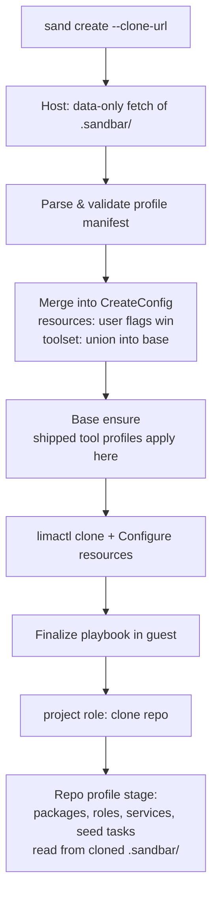

# Plan: Repo-Checked-In Provisioning Profiles

## Original Work Order

> Add Repo-checked-in provisioning profiles
>
> A .sandbar/ directory checked into the repo that declares the extra Ansible roles, packages, services, seed steps, resources, and toolset that repo needs. Commit it, and every teammate's VM is byte-identical and reproducible.
>
> Move the existing optional dev tools to these provisioning profiles shipped with Sandbar. That way they serve as examples.

## Plan Clarifications

| # | Question | Answer |
|---|----------|--------|
| 1 | What happens to the existing `--with-claude/--with-ddev/--with-go/--with-java` CLI flags and the matching TUI create-form toggles? | **Keep as shorthands.** The flags and toggles stay, but become thin aliases that enable the corresponding shipped provisioning profile — one mechanism underneath, two surfaces on top. |
| 2 | Where should profile contents (packages, roles, services) be applied — the shared base image or the per-VM clone? | **Two-tier.** Shipped tool profiles keep installing into the shared base image (fast clones preserved, toolset stamp stays); repo-checked-in profiles apply per-clone during the finalize phase only. |
| 3 | Should Sandbar gate repo-supplied Ansible (run as root in the guest) on user consent? | **No gate.** The VM is the sandbox; cloning a repo already implies running its code in the guest. Profiles apply automatically with no prompt. |
| 4 | What exactly are the "seed steps" a repo profile declares? | **Ansible tasks/playbook.** The repo ships an Ansible tasks file that Sandbar includes during finalize, after the project clone — full Ansible power rather than a plain command list. |
| 5 | Scope approval | Approved, including the stated design defaults: host-side data-only fetch of `.sandbar/` before VM create; explicit user flags/TUI values override profile-declared resources; documentation disambiguates "provisioning profiles" from the existing "connection profiles". |

## Executive Summary

This plan introduces **repo-checked-in provisioning profiles**: a `.sandbar/` directory committed to a project repository that declares everything that repo's development VM needs beyond the stock Sandbar base — extra Ansible roles, apt packages, systemd services, seed steps (a repo-supplied Ansible tasks file run after the clone), VM resources (CPUs, memory, disk), and the required toolset. When a teammate runs `sand create` against that repository, Sandbar discovers the profile automatically and applies it, so every member of the team gets the same reproducible VM configuration from a single committed source of truth.

The approach follows a two-tier execution model that respects Sandbar's existing base/clone architecture. Shipped tool profiles (the current optional toolset: `claude`, `ddev`, `go`, `java`) continue to install into the shared base image, keeping clones fast and the base-version stamping semantics intact. Repo profiles apply per-clone during the finalize phase, after the project role clones the repository into the guest — so repo-specific content never churns the shared base. On the host side, Sandbar performs a data-only fetch of `.sandbar/` before creating the VM so that resource declarations can be applied at configure time; all execution of repo-supplied Ansible happens inside the guest, preserving the security model in which repository code never runs on the host.

The second half of the work order restructures the existing optional dev tools into provisioning profiles **shipped with Sandbar**. Each shipped profile is expressed in the same declarative format that repo authors use, so the shipped set doubles as living, tested reference examples. The `--with-*` CLI flags and TUI toggles are preserved as shorthands that enable the corresponding shipped profile, so no existing workflow breaks.

## Context

### Current State vs Target State

| Current State | Target State | Why? |
|---------------|--------------|------|
| Per-repo VM needs (packages, services, setup steps) are undeclared; each developer configures their VM by hand after creation | A committed `.sandbar/` directory declares the repo's provisioning needs and Sandbar applies it automatically | Team-wide reproducibility from a single committed source of truth |
| Optional tools are hard-coded: `when:`-gated roles in `site.yml`, `toolset_*` vars, `ToolPtrs()` in `internal/vm/vm.go` | Optional tools are expressed as shipped provisioning profiles in a shared declarative format | One mechanism for optional provisioning; shipped profiles serve as documented examples for repo authors |
| Tool selection surface is CLI flags (`--with-*`) and TUI toggles only | Flags/toggles remain as shorthands over shipped profiles; repos can additionally declare a required toolset | Backwards-compatible UX while the repo becomes able to state its own needs |
| Nothing project-specific runs after the guest clones the repo (the `project` role stops at clone + direnv setup) | Repo-declared packages, roles, services, and seed tasks run in finalize after the clone | Projects need dependency install, service enablement, and bootstrap steps to reach a working state |
| VM resources (CPUs/memory/disk) are chosen per-create by the user with global defaults | Repo profile can declare resource defaults; explicit user flags/TUI values still win | Repos with known heavy workloads (e.g. large test suites) get right-sized VMs by default |
| No per-repo configuration file concept exists anywhere in the codebase | A new host-side loader parses `.sandbar/` as strict, data-only configuration | Foundation for the feature; keeps repo content as data on the host, execution in the guest |

### Background

- **Architecture constraints discovered during analysis.** Sandbar builds one shared base image per connection profile, stamps it with `v2:<playbook-hash>:<toolset>`, and clones it for each VM. The toolset is a property of the base with union-only merge semantics (`mergeToolsetVersion`). Repo-specific content therefore cannot ride the base without churning it for every repo — hence the two-tier decision (clarification #2).
- **The embedded playbook triple-pin.** The Ansible fileset is `go:embed`ded, rsynced into the guest by an allowlist filter, and content-hashed for the base stamp; the three lists are pinned together by `TestGuestSyncCopiesOnlyThePlaybook`. Repo-supplied roles must **not** flow through this fileset — they are read from the cloned repository inside the guest instead.
- **Timing constraint for resources.** The repo is cloned inside the guest during finalize, *after* the VM is created and started, but `lima.Client.Configure` applies CPUs/memory/disk *before* first start. Declared resources therefore require host-side knowledge of the profile before creation — hence the host-side data-only fetch (clarification #5).
- **Terminology collisions.** "Profiles" already means *connection profiles* (`~/.config/sandbar/profiles.yaml`), and "seed" already refers to apt-cache and secrets seeding internally. This feature consistently uses the term **provisioning profile**, and documentation must disambiguate.
- **On "byte-identical".** Apt package versions are not pinned by Sandbar, so two VMs created at different times can differ at the byte level. The honest guarantee this plan delivers is *configuration-identical and reproducible*: the same committed profile always yields the same declared configuration. The plan does not introduce package version pinning (not requested).

## Architectural Approach

The feature is built as five cooperating components. Data flows host → guest: the host parses `.sandbar/` strictly as data and merges it into the create configuration; the guest executes all repo-supplied Ansible during finalize, after the project clone.

### Profile Schema and Host-Side Loader

**Objective**: Define the declarative format of `.sandbar/` and parse it safely on the host, establishing the single source of truth for what a repo may declare.

A new internal Go package (working name `internal/provprofile`, deliberately distinct from `internal/profiles` which holds connection profiles) defines the manifest schema and loader. The `.sandbar/` directory contains a manifest file (YAML) plus optional Ansible content. The manifest declares:

| Field group | Contents | Applied |
|-------------|----------|---------|
| `packages` | apt package names to install in the clone | Guest, finalize |
| `services` | systemd units to enable/start in the clone | Guest, finalize |
| `roles` | names of Ansible roles shipped in `.sandbar/roles/` to include | Guest, finalize |
| `seed` | path to a repo-supplied Ansible tasks file (default location under `.sandbar/`) run after clone/packages/roles | Guest, finalize |
| `resources` | default CPUs, memory, disk for VMs of this repo | Host, at `Configure`, before first start |
| `toolset` | required shipped tool profiles (e.g. claude, ddev, go, java) | Base, via existing union semantics |

Parsing is strict: unknown keys are errors, values are validated (package-name shape, unit-name shape, resource formats reuse the existing CreateConfig validation), and input size is bounded. The host never templates or executes any profile content — it is configuration data only. Malformed profiles fail the create with a clear message rather than being silently ignored.

### Host-Side Discovery and Config Merge

**Objective**: Get the profile's host-relevant facts (resources, toolset, presence) before the VM exists, and record them so recreates are reproducible.

At create time, when a clone URL is present, Sandbar performs a minimal data-only fetch of the repository's `.sandbar/` directory using the already-known clone URL and clone token (shallow/sparse fetch; the token already flows through `CreateConfig`). Absence of `.sandbar/` is the normal case and silently yields stock behavior. Fetch *errors* (auth, network) are surfaced with a choice to proceed without the profile, since the guest-side clone may still succeed later.

Merge precedence: profile-declared resources become the defaults for the create; values the user set explicitly (CLI flags, TUI fields) override them. The declared toolset merges into the base's toolset exactly as the `--with-*` flags do today (union, base-staleness rules unchanged). The resolved configuration — including the fact that a repo profile was applied — is recorded in the managed-VM registry (`config` field) so `Reset`/`Recreate` reproduce it.

### Guest-Side Finalize Stage

**Objective**: Execute the repo profile inside the guest, after the project clone, without disturbing the embedded-playbook invariants or the shared base stamp.

`site.yml` gains a new stage, gated on a `repo_profile_enabled`-style variable emitted by `BuildExtraVars` in the finalize phase only. Ordered after the `project` role (which performs the clone), the stage:

1. Locates `.sandbar/` inside the cloned checkout and re-validates the manifest guest-side (defense in depth; the guest copy is authoritative for guest execution).
2. Installs declared apt packages in a single transaction, mirroring the base role's install conventions (`install_recommends: false`).
3. Includes each declared role from the repo's `.sandbar/roles/` directory by extending the Ansible roles path to the cloned checkout — repo roles are read in place and never enter the embedded fileset, the rsync allowlist, or the playbook content hash.
4. Enables/starts declared systemd services.
5. Includes the repo's seed tasks file last, when dependencies are in place. Repo-supplied Ansible runs with the play's privileges (root), with `become_user` available to authors for user-level steps — consistent with the no-gate trust decision.

Because all of this is finalize-phase and per-clone, the shared base's `PlaybookVersion` and staleness behavior are untouched by any repo-specific content. The stage is also naturally re-run by `Recreate` and `Reset`, so repo authors must write idempotent tasks — a documented requirement, consistent with Ansible norms.

### Shipped Provisioning Profiles (Toolset Restructuring)

**Objective**: Re-express the existing optional dev tools as provisioning profiles bundled with Sandbar, so they act as reference examples while preserving current behavior and performance.

The four optional tools (`claude`, `ddev`, `go`, `java`) are restructured into named shipped profiles living in a dedicated directory of the Sandbar repository (embedded alongside the playbook). Each shipped profile uses the same manifest format as repo profiles, plus an internal marker that designates it base-phase — the tier distinction from clarification #2. The existing role content is reorganized so each shipped profile maps cleanly onto it: the `claude-code` role and the `toolset_*`-conditional fragments of `roles/base` / `roles/dev-tools` become the implementation backing the corresponding profile.

Behavior is preserved: shipped tool profiles still install into the shared base, still participate in `ToolsetKey()` stamping and union-merge staleness, and still default to enabled. The `--with-*` flags and TUI toggles remain and now resolve to enabling/disabling the shipped profile of the same name; the `BaseToolset()`-seeded defaults in the create form continue to work. Since the shipped profiles are embedded playbook content, their files *do* participate in the embed/rsync/hash triple-pin, and all three lists are updated together under the existing guard test.

Documentation presents the shipped profiles as the canonical examples for repo authors: same format, real, tested.

### Wiring, Compatibility, and Verification Surface

**Objective**: Thread the feature through the existing seams — extra-vars, registry, CLI/TUI — and extend the test layers that pin those seams.

`BuildExtraVars` is the single choke point for new guest-facing variables and gains the repo-profile variables (finalize phase only). The managed-VM registry schema carries the resolved profile facts. CLI (`create`) and TUI create-form changes are limited to the shorthand rewiring — no new flags or form fields are added beyond what the clarified scope requires. Repos without `.sandbar/` must produce byte-for-byte identical extra-vars and behavior to today.

The existing verification layers are extended rather than replaced: seam tests for the loader/merge/extra-vars (`vars_test.go` conventions, toolset-pinning tests updated for the restructured defaults), `ansible-playbook --syntax-check` in lint, molecule coverage for the new stage where feasible, and the `limae2e` end-to-end path gains a fixture repository with a committed `.sandbar/` profile exercising packages, services, roles, seed tasks, and resources.

## Risk Considerations and Mitigation Strategies

Technical Risks

- **Embedded-playbook triple-pin breakage**: new shipped-profile files and the new finalize stage touch the embed list, rsync allowlist, and content hash, which must change in lockstep.
    - **Mitigation**: repo-profile content is read from the cloned checkout and never enters the fileset; shipped-profile files are added to all three lists together, with `TestGuestSyncCopiesOnlyThePlaybook` and the base-stamp tests as the guard rails.
- **Unintended base churn**: if any repo-specific value leaked into the base-phase extra-vars or playbook hash, every repo would invalidate every teammate's shared base.
    - **Mitigation**: repo-profile variables are emitted for the finalize phase only; a seam test asserts base-phase extra-vars are identical with and without a repo profile.
- **Host parses repo-controlled YAML**: the data-only fetch means untrusted bytes reach a host-side parser.
    - **Mitigation**: strict schema (unknown keys rejected), shape validation for every field, bounded input size, no templating or execution host-side; guest re-validates before executing.
- **Toolset restructuring regressions**: the union-merge staleness logic (`mergeToolsetVersion`, `BaseToolset`, `ToolsetKey`) is subtle and load-bearing.
    - **Mitigation**: shipped profiles keep the existing stamp format and semantics unchanged; the existing baseversion and toolset-packages pin tests are updated deliberately, not deleted.

Implementation Risks

- **Host-side fetch fragility**: sparse/shallow fetching `.sandbar/` needs credentials, network, and a reachable remote at create time.
    - **Mitigation**: reuse the clone URL/token already in `CreateConfig`; treat "no `.sandbar/`" as the silent normal case and only surface real fetch errors, with an explicit proceed-without-profile path.
- **Non-idempotent or destructive repo Ansible**: seed tasks re-run on `Reset`/`Recreate` and run as root with no trust gate (per clarifications #3 and #4).
    - **Mitigation**: document the idempotency requirement and the root/`become_user` execution contract prominently in the repo-author docs; shipped example profiles model correct idempotent style.
- **Terminology confusion**: "provisioning profiles" vs the existing "connection profiles"; a new package near `internal/profiles`.
    - **Mitigation**: distinct package name (`internal/provprofile`), consistent "provisioning profile" phrasing everywhere, and an explicit disambiguation note in the docs.

Quality Risks

- **E2E coverage gap**: the full path (fetch → merge → clone → finalize stage) only proves out on a real VM.
    - **Mitigation**: extend the `limae2e` suite with a fixture repo containing a committed `.sandbar/`; assert on guest state (installed package, enabled unit, seed marker, applied resources).
- **"Byte-identical" overpromise**: users may read the work order's phrase literally while apt versions drift.
    - **Mitigation**: documentation states the actual guarantee — identical declared configuration, reproducible provisioning — and this plan's Notes section records that package pinning is out of scope.

## Success Criteria

### Primary Success Criteria

1. A repository containing a committed `.sandbar/` profile, created via `sand create --clone-url`, yields a VM where every declared item is observably applied: apt packages installed, systemd services enabled and running, repo roles executed, seed tasks completed, and VM resources matching the declaration (with explicit user flags taking precedence).
2. The four optional dev tools exist as shipped provisioning profiles in the same declarative format, still installing into the shared base with unchanged staleness/stamping behavior, and the `--with-*` flags and TUI toggles keep working as shorthands with their current defaults.
3. Repositories without `.sandbar/` behave exactly as today — identical extra-vars, identical base stamp, no new prompts or failures.
4. All existing test layers pass (unit with race + coverage floor, ansible syntax lint, molecule, lima e2e), and new coverage exists for the profile loader, config merge, finalize stage, and end-to-end fixture-repo path.

## Self Validation

Concrete steps to execute after all tasks are complete:

1. **Fixture repo end-to-end (real VM)**: Create a local git fixture repository containing a `.sandbar/` profile that declares one apt package not in the base (e.g. `cowsay`), one systemd service, one custom role, a seed tasks file that writes a marker file into the project directory, and `resources` requesting a non-default CPU count. Run the `limae2e`-tagged suite (`LIMA_E2E=1`) or drive `sand create --clone-url <fixture>` directly, then verify inside the guest via `limactl shell`: `dpkg -l <package>` shows it installed, `systemctl is-enabled <service>` reports enabled, the seed marker file exists in the project tree, and `nproc` reports the declared CPU count.
2. **Precedence check**: Re-create the fixture VM passing an explicit `--cpus` value different from the profile's declaration and confirm the explicit flag wins (`nproc` in the guest).
3. **No-profile regression check**: Create a VM from a repo without `.sandbar/` and diff the generated extra-vars (via the seam tests and, on the real VM, guest state) against pre-change expectations — no new variables in the base phase, no behavior change.
4. **Shorthand check**: Run `sand create --with-go=false ...` and verify in the guest that the Go toolchain is absent while default-on tools are present; confirm the base version stamp still renders the `v2:<hash>:<toolset>` form with the expected toolset key.
5. **Static and unit layers**: Run `go test ./... -race` and `ansible-playbook -i inventory --syntax-check site.yml`; both must pass. Confirm the guard test for the embed/rsync/hash triple-pin passes.
6. **Docs check**: Open the new repo-profile documentation page and confirm it documents the manifest schema, the two-tier model, the idempotency/root execution contract, and links to the shipped profiles as examples.

## Documentation

- **New page** under `docs/using-sand/` documenting repo-checked-in provisioning profiles: the `.sandbar/` layout, manifest schema, two-tier execution model, resource precedence, idempotency and root-execution contract, and the shipped profiles as worked examples.
- **`docs/getting-started/available-tools.md`**: describe the optional tools as shipped provisioning profiles and how to toggle them.
- **`docs/getting-started/how-it-works.md`**: extend the base/clone/finalize explanation (and mermaid diagram) with the repo-profile stage.
- **`docs/contributing/ansible-playbook.md`**: document the new finalize stage, the shipped-profile directory, and the rule that repo content never enters the embedded fileset.
- **`docs/reference/files-and-state.md`**: add `.sandbar/` (in-repo) and any new host/guest paths.
- **`docs/using-sand/cli-reference.md`** and **`connection-profiles.md`**: note the flag-shorthand behavior and add the provisioning-vs-connection profile disambiguation.
- **`docs/reference/security-model.md`**: record the no-gate trust decision — repo profiles execute automatically in the guest, and the host treats profile content strictly as data.
- **`AGENTS.md`**: update if the playbook layout or test-layer instructions change materially.

## Resource Requirements

### Development Skills

- Go (CLI plumbing, embed/fileset invariants, Bubble Tea TUI form wiring)
- Ansible (role composition, variable gating, idempotent task authoring, molecule)
- Git internals for the host-side sparse/shallow data-only fetch
- Lima/limactl behavior for resource configuration and e2e testing

### Technical Infrastructure

- Existing repo toolchain: Go, ansible-core, molecule, Lima with KVM access for `limae2e` runs
- A local git fixture repository with a committed `.sandbar/` profile for end-to-end validation
- CI: existing `unit`, `lint`, `lima-e2e`, `remote-lima-e2e`, and molecule jobs extended, no new infrastructure

## Integration Strategy

The feature integrates through existing seams only: `vm.CreateConfig` (new profile-derived fields), `provision.BuildExtraVars` (finalize-phase variables), `site.yml` (one new gated stage), `lima.Client.Configure` (unchanged, fed merged resources), the managed-VM registry (records resolved profile facts for `Reset`/`Recreate`), and the CLI/TUI create surfaces (shorthand rewiring). Remote connection profiles work unchanged: the host-side fetch happens where `sand` runs, and all guest execution flows through the existing provisioning path, so local and remote Lima behave identically.

## Notes

- Package version pinning (true byte-identical images) is explicitly out of scope; the delivered guarantee is identical declared configuration. Revisit only if requested.
- The union-only semantics of the shared base are unchanged: disabling a shipped tool profile does not uninstall it from an existing base (`shrunkTools` warning behavior preserved).
- The manifest format should stay minimal per the scope-control guidelines — exactly the six declaration groups from the work order (roles, packages, services, seed, resources, toolset), no conditional logic, no per-OS switches, no profile inheritance.
