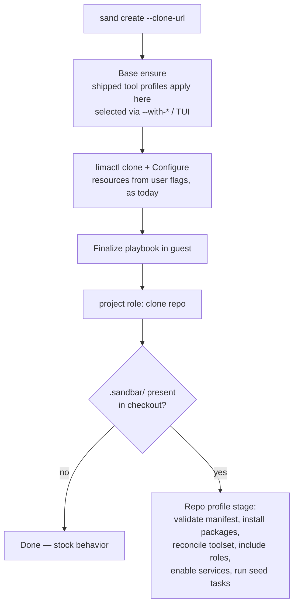

# Plan: Repo-Checked-In Provisioning Profiles

## Original Work Order

> Add Repo-checked-in provisioning profiles
>
> A .sandbar/ directory checked into the repo that declares the extra Ansible roles, packages, services, seed steps, resources, and toolset that repo needs. Commit it, and every teammate's VM is byte-identical and reproducible.
>
> Move the existing optional dev tools to these provisioning profiles shipped with Sandbar. That way they serve as examples.

## Plan Clarifications

| # | Question | Answer |
|---|----------|--------|
| 1 | What happens to the existing `--with-claude/--with-ddev/--with-go/--with-java` CLI flags and the matching TUI create-form toggles? | **Keep as shorthands.** The flags and toggles stay, but become thin aliases that enable the corresponding shipped provisioning profile — one mechanism underneath, two surfaces on top. |
| 2 | Where should profile contents (packages, roles, services) be applied — the shared base image or the per-VM clone? | **Two-tier.** Shipped tool profiles keep installing into the shared base image (fast clones preserved, toolset stamp stays); repo-checked-in profiles apply per-clone during the finalize phase only. |
| 3 | Should Sandbar gate repo-supplied Ansible (run as root in the guest) on user consent? | **No gate.** The VM is the sandbox; cloning a repo already implies running its code in the guest. Profiles apply automatically with no prompt. |
| 4 | What exactly are the "seed steps" a repo profile declares? | **Ansible tasks/playbook.** The repo ships an Ansible tasks file that Sandbar includes during finalize, after the project clone — full Ansible power rather than a plain command list. |
| 5 | Scope approval | Approved, including the stated design defaults: host-side data-only fetch of `.sandbar/` before VM create; explicit user flags/TUI values override profile-declared resources; documentation disambiguates "provisioning profiles" from the existing "connection profiles". *The fetch and resource defaults are superseded by #6.* |
| 6 | Refinement (2026-07-16, user directive) | **Remove `resources` and the host-side data fetch.** Resources are host-specific ("I only have 16GB of RAM"), not repo-specific, so the manifest no longer declares them — and with resources gone, nothing needs the profile before VM start, so the profile is discovered and applied entirely guest-side. |
| 7 | With guest-only discovery, the profile is first seen after clone — too late to influence the shared base. What does the repo's `toolset` declaration become? | **Install per-clone.** The declaration stays. During finalize, a declared tool already present in the base is a no-op; a missing one is installed into that clone (shipped profiles are manifests, reusable at either tier). The base is never touched by repo profiles. |
| 8 | Related initiative (2026-07-16, user-provided context) | **Golden Templates** are being added on another branch: a user can make a template of a repo's VM after per-repo provisioning has run. Informational for this plan — see Notes for the composition considerations. |
| 9 | Refinement (2026-07-16, CI adequacy review) | **Tighten test placement.** (a) The full-path e2e uses a checked-in fixture served as a local git remote (`git://localhost/...`), because the current create e2e never clones and the `project` role parses the clone URL as `scheme://host/org/repo` (a raw `file://` path breaks host/org derivation). (b) Manifest validation is a standalone, unit-testable validator invoked in-guest, so the malformed-manifest negative path is a fast **per-PR** guard rather than depending on the weekly molecule job. (c) The stage's per-PR blocking guard is `lima-e2e`; molecule is supplementary/weekly. |

## Executive Summary

This plan introduces **repo-checked-in provisioning profiles**: a `.sandbar/` directory committed to a project repository that declares everything that repo's development VM needs beyond the stock Sandbar base — extra Ansible roles, apt packages, systemd services, seed steps (a repo-supplied Ansible tasks file run after the clone), and the required toolset. When a teammate runs `sand create` against that repository, Sandbar discovers the profile automatically and applies it, so every member of the team gets the same reproducible VM configuration from a single committed source of truth.

The design is entirely guest-side. The profile is discovered inside the guest after the `project` role clones the repository during the finalize phase; no repository content is ever fetched to, parsed on, or executed by the host. This keeps the base/clone architecture untouched: shipped tool profiles (the current optional toolset: `claude`, `ddev`, `go`, `java`) continue to install into the shared base image when selected via flags/TUI, while everything a repo profile declares applies per-clone in finalize. A repo-declared toolset is reconciled per-clone — tools already in the base are a no-op, missing ones are installed into that clone — so repo-specific content never churns the shared base.

The second half of the work order restructures the existing optional dev tools into provisioning profiles **shipped with Sandbar**. Each shipped profile is expressed in the same declarative format that repo authors use, so the shipped set doubles as living, tested reference examples. The `--with-*` CLI flags and TUI toggles are preserved as shorthands that enable the corresponding shipped profile, so no existing workflow breaks.

## Context

### Current State vs Target State

| Current State | Target State | Why? |
|---------------|--------------|------|
| Per-repo VM needs (packages, services, setup steps) are undeclared; each developer configures their VM by hand after creation | A committed `.sandbar/` directory declares the repo's provisioning needs and Sandbar applies it automatically | Team-wide reproducibility from a single committed source of truth |
| Optional tools are hard-coded: `when:`-gated roles in `site.yml`, `toolset_*` vars, `ToolPtrs()` in `internal/vm/vm.go` | Optional tools are expressed as shipped provisioning profiles in a shared declarative format | One mechanism for optional provisioning; shipped profiles serve as documented examples for repo authors |
| Tool selection surface is CLI flags (`--with-*`) and TUI toggles only | Flags/toggles remain as shorthands over shipped profiles; repos can additionally declare a required toolset, reconciled per-clone | Backwards-compatible UX while the repo becomes able to state its own needs |
| Nothing project-specific runs after the guest clones the repo (the `project` role stops at clone + direnv setup) | Repo-declared packages, roles, services, toolset tools, and seed tasks run in finalize after the clone | Projects need dependency install, service enablement, and bootstrap steps to reach a working state |
| No per-repo configuration file concept exists anywhere in the codebase | `.sandbar/` is discovered and validated inside the guest during finalize, strictly as declarative configuration | Foundation for the feature; repository content stays entirely out of the host |

### Background

- **Architecture constraints discovered during analysis.** Sandbar builds one shared base image per connection profile, stamps it with `v2:<playbook-hash>:<toolset>`, and clones it for each VM. The toolset is a property of the base with union-only merge semantics (`mergeToolsetVersion`). Repo-specific content therefore cannot ride the base without churning it for every repo — hence the two-tier decision (clarification #2) and the per-clone toolset reconciliation (clarification #7).
- **The embedded playbook triple-pin.** The Ansible fileset is `go:embed`ded, rsynced into the guest by an allowlist filter, and content-hashed for the base stamp; the three lists are pinned together by `TestGuestSyncCopiesOnlyThePlaybook`. Repo-supplied roles must **not** flow through this fileset — they are read from the cloned repository inside the guest instead.
- **Why no `resources` and no host-side fetch.** An earlier draft let the manifest declare VM resources (CPUs/memory/disk), which forced a host-side data fetch of `.sandbar/` before the VM existed. Refinement #6 removed both: resource sizing is host-specific (available RAM varies per developer machine), and once resources are gone nothing in the profile is needed before first start, so discovery moves entirely into the guest. Resources remain what they are today — per-create user choices via flags/TUI.
- **Terminology collisions.** "Profiles" already means *connection profiles* (`~/.config/sandbar/profiles.yaml`), and "seed" already refers to apt-cache and secrets seeding internally. This feature consistently uses the term **provisioning profile**, and documentation must disambiguate.
- **On "byte-identical".** Apt package versions are not pinned by Sandbar, so two VMs created at different times can differ at the byte level. The honest guarantee this plan delivers is *configuration-identical and reproducible*: the same committed profile always yields the same declared configuration. The plan does not introduce package version pinning (not requested).

## Architectural Approach

The feature is built as four cooperating components, all downstream of the existing create flow. The host is unchanged except for the flag-shorthand rewiring: the profile is discovered, validated, and executed inside the guest during finalize, after the project clone.

### Profile Schema and Guest-Side Validation

**Objective**: Define the declarative format of `.sandbar/` and validate it strictly inside the guest, establishing the single source of truth for what a repo may declare.

The `.sandbar/` directory contains a manifest file (YAML) plus optional Ansible content. The manifest declares exactly five groups:

| Field group | Contents |
|-------------|----------|
| `packages` | apt package names to install in the clone |
| `services` | systemd units to enable/start in the clone |
| `roles` | names of Ansible roles shipped in `.sandbar/roles/` to include |
| `seed` | path to a repo-supplied Ansible tasks file (default location under `.sandbar/`) run last |
| `toolset` | required shipped tool profiles (e.g. claude, ddev, go, java), reconciled per-clone |

Validation happens at the start of the repo-profile finalize stage, in-guest: unknown keys are errors, values are shape-checked (package-name shape, unit-name shape, known toolset names), and a malformed manifest fails finalize with a clear message rather than being silently ignored. The host never reads, templates, or executes any profile content — the repository's only path into the system is the clone inside the guest.

To keep this the fast, per-PR guard for the most common authoring mistake (a typo'd key), validation is implemented as a **small standalone validator shipped in the playbook** — a self-contained script the finalize stage invokes against the cloned `.sandbar/` manifest — rather than as inline Jinja. Because it is a discrete artifact with a defined input (a manifest file) and output (exit code + message), its logic is exercised directly in a fast CI job by running it against a corpus of good and deliberately-malformed sample manifests, with no VM required. This does not reintroduce a host-side loader: in production the validator only ever runs inside the guest against the cloned checkout; the corpus test simply runs the same artifact against static fixtures on the runner.

### Guest-Side Finalize Stage

**Objective**: Execute the repo profile inside the guest, after the project clone, without disturbing the embedded-playbook invariants or the shared base stamp.

`site.yml` gains a new stage ordered after the `project` role (which performs the clone). The stage is gated on the presence of the manifest in the cloned checkout — repos without `.sandbar/` take the stock path with no new variables, prompts, or behavior changes. When present, the stage:

1. Validates the manifest (previous component).
2. Installs declared apt packages in a single transaction, mirroring the base role's install conventions (`install_recommends: false`).
3. Reconciles the declared toolset: for each declared tool, applies the corresponding shipped profile per-clone — a no-op where the base already provides it, a per-clone install where it does not (clarification #7). The shared base and its `v2:<hash>:<toolset>` stamp are never modified by a repo profile.
4. Includes each declared role from the repo's `.sandbar/roles/` directory by extending the Ansible roles path to the cloned checkout — repo roles are read in place and never enter the embedded fileset, the rsync allowlist, or the playbook content hash.
5. Enables/starts declared systemd services.
6. Includes the repo's seed tasks file last, when dependencies are in place. Repo-supplied Ansible runs with the play's privileges (root), with `become_user` available to authors for user-level steps — consistent with the no-gate trust decision.

Because all of this is finalize-phase and per-clone, the shared base's `PlaybookVersion` and staleness behavior are untouched by any repo-specific content. The stage re-runs naturally on `Recreate` and `Reset` — which is also what makes the applied profile reproducible without any host-side record — so repo authors must write idempotent tasks, a documented requirement consistent with Ansible norms.

### Shipped Provisioning Profiles (Toolset Restructuring)

**Objective**: Re-express the existing optional dev tools as provisioning profiles bundled with Sandbar, so they act as reference examples while preserving current behavior and performance.

The four optional tools (`claude`, `ddev`, `go`, `java`) are restructured into named shipped profiles living in a dedicated directory of the Sandbar repository (embedded alongside the playbook). Each shipped profile uses the same manifest format as repo profiles. The existing role content is reorganized so each shipped profile maps cleanly onto it: the `claude-code` role and the `toolset_*`-conditional fragments of `roles/base` / `roles/dev-tools` become the implementation backing the corresponding profile.

Shipped profiles must be applicable at **either tier**: at base phase when selected via flags/TUI (today's behavior — fast clones, `ToolsetKey()` stamping and union-merge staleness unchanged, defaults still enabled), and per-clone at finalize when a repo profile declares them (clarification #7). That dual use makes idempotent, phase-agnostic role design a hard requirement — e.g. ddev's apt-repository registration must work in both phases.

The `--with-*` flags and TUI toggles remain and now resolve to enabling/disabling the shipped profile of the same name; the `BaseToolset()`-seeded defaults in the create form continue to work. Since the shipped profiles are embedded playbook content, their files *do* participate in the embed/rsync/hash triple-pin, and all three lists are updated together under the existing guard test.

Documentation presents the shipped profiles as the canonical examples for repo authors: same format, real, tested.

### Wiring, Compatibility, and Verification Surface

**Objective**: Thread the feature through the existing seams — `site.yml`, CLI/TUI — and extend the test layers that pin those seams.

Host-side changes are limited to the shorthand rewiring in CLI (`create`) and the TUI create form — no new flags, form fields, extra-vars, or registry fields are added. `BuildExtraVars` output for repos without `.sandbar/` is byte-for-byte identical to today, and the repo-profile stage keys off the cloned checkout rather than any host-provided variable.

The existing verification layers are extended rather than replaced, and each new test is deliberately placed against a real CI job with its per-PR vs. advisory status made explicit:

| New coverage | Test target | CI job | Per-PR? |
|---|---|---|---|
| Extra-vars byte-identical for no-profile repos; restructured toolset defaults | Go seam tests (`vars_test.go`, `toolset_packages_test.go` conventions) | `unit` | ✅ blocking |
| Manifest validation — accepts the good corpus, rejects each malformed sample with a clear message | Run the standalone validator artifact against static good/bad manifest fixtures | `unit` (or `lint`) — no VM | ✅ blocking |
| Playbook still syntactically valid with the new stage and shipped profiles | `ansible-playbook --syntax-check` | `lint` | ✅ blocking |
| Embed/rsync/hash triple-pin holds after shipped-profile files are added | `TestGuestSyncCopiesOnlyThePlaybook` + base-stamp tests | `unit` | ✅ blocking |
| **Full path**: `sand create --clone-url <fixture>` → clone → discovery → stage applies packages/services/roles/toolset-reconciliation/seed | `limae2e` fixture-repo e2e (see below) | `lima-e2e` | ✅ blocking (runs per-PR, not just weekly) |
| Profile stage against a staged checkout (finer-grained assertions on individual declaration groups) | molecule scenario | `molecule` | ⚠️ **weekly + dispatch only, non-blocking** — supplementary depth, not the PR gate |

The finalize stage's authoritative per-PR guard is therefore `lima-e2e`; molecule adds depth on the weekly cadence but is explicitly not relied upon to block regressions.

**Fixture mechanism for the full-path e2e.** The current `cmd/sand` e2e performs a headless create without cloning, so the clone-URL path is new machinery for this suite. The `project` role parses `project_clone_url` strictly as `scheme://host/org/repo` (`roles/project/tasks/main.yml`) to derive the guest directory layout, so a raw `file:///path` clone URL does not fit. The fixture is instead a directory checked into the sandbar repo under a test-fixtures path, containing a committed `.sandbar/` profile that exercises one non-base apt package, one systemd service, one custom role, one shipped toolset tool absent from the base, and a seed tasks file that writes a marker into the project tree. At test time the e2e initializes a bare repo from that fixture and publishes it as a **local git remote** — `git daemon` over `git://localhost/<org>/<repo>` (or git-http-backend) — whose URL matches the `project` role's expected shape; using `localhost` rather than `github.com` also keeps the fixture off the token-injection branch. That served URL is passed as `--clone-url`.

## Risk Considerations and Mitigation Strategies

Technical Risks

- **Embedded-playbook triple-pin breakage**: new shipped-profile files and the new finalize stage touch the embed list, rsync allowlist, and content hash, which must change in lockstep.
    - **Mitigation**: repo-profile content is read from the cloned checkout and never enters the fileset; shipped-profile files are added to all three lists together, with `TestGuestSyncCopiesOnlyThePlaybook` and the base-stamp tests as the guard rails.
- **Unintended base churn**: if any repo-specific value leaked into the base-phase extra-vars or playbook hash, every repo would invalidate every teammate's shared base.
    - **Mitigation**: the host emits no repo-profile variables at all; a seam test asserts extra-vars are unchanged from today in both phases, and the repo-profile stage is reachable only from the finalize play after the clone.
- **Toolset restructuring regressions**: the union-merge staleness logic (`mergeToolsetVersion`, `BaseToolset`, `ToolsetKey`) is subtle and load-bearing.
    - **Mitigation**: shipped profiles keep the existing stamp format and semantics unchanged for the base tier; the existing baseversion and toolset-packages pin tests are updated deliberately, not deleted.
- **Dual-tier shipped roles**: roles written for the base phase may assume base-build context (apt cache seeding, root layout) and misbehave when applied per-clone in finalize.
    - **Mitigation**: phase-agnostic, idempotent role design is an explicit requirement of the restructuring; the e2e fixture exercises a shipped tool at the finalize tier (declared by the repo, absent from the base).

Implementation Risks

- **Non-idempotent or destructive repo Ansible**: seed tasks re-run on `Reset`/`Recreate` and run as root with no trust gate (per clarifications #3 and #4).
    - **Mitigation**: document the idempotency requirement and the root/`become_user` execution contract prominently in the repo-author docs; shipped example profiles model correct idempotent style.
- **Terminology confusion**: "provisioning profiles" vs the existing "connection profiles".
    - **Mitigation**: consistent "provisioning profile" phrasing everywhere, and an explicit disambiguation note in the docs.
- **Per-clone install cost**: repos declaring large toolsets or package lists make first finalize slower for every teammate, without the base image's amortization.
    - **Mitigation**: document the trade-off (base tier via flags for team-wide heavy tools, repo tier for repo-specific needs); finalize already streams progress so slow steps are visible.

Quality Risks

- **E2E coverage gap**: the full path (clone → discovery → validation → apply) only proves out on a real VM.
    - **Mitigation**: extend the per-PR `lima-e2e` suite with the checked-in fixture repo served as a local git remote (see Verification Surface); assert on guest state (installed package, enabled unit, reconciled tool, seed marker). Fast per-PR jobs cover the pieces that don't need a VM (validator corpus, extra-vars seam, triple-pin), so the VM-only surface is minimized rather than the sole guard.
- **Advisory-layer misplacement**: relying on molecule (weekly, non-blocking) to guard the new finalize stage would leave PRs unprotected.
    - **Mitigation**: the stage's blocking guard is `lima-e2e` (per-PR); molecule is documented as supplementary depth only. The placement table in the Verification Surface records each test's job and per-PR status explicitly.
- **"Byte-identical" overpromise**: users may read the work order's phrase literally while apt versions drift.
    - **Mitigation**: documentation states the actual guarantee — identical declared configuration, reproducible provisioning — and this plan's Notes section records that package pinning is out of scope.

## Success Criteria

### Primary Success Criteria

1. A repository containing a committed `.sandbar/` profile, created via `sand create --clone-url`, yields a VM where every declared item is observably applied: apt packages installed, systemd services enabled and running, repo roles executed, declared toolset tools present (installed per-clone when absent from the base), and seed tasks completed.
2. The four optional dev tools exist as shipped provisioning profiles in the same declarative format, still installing into the shared base with unchanged staleness/stamping behavior when selected via flags/TUI, and the `--with-*` flags and TUI toggles keep working as shorthands with their current defaults.
3. Repositories without `.sandbar/` behave exactly as today — identical extra-vars, identical base stamp, no new prompts or failures — and no repository content is ever read or executed on the host.
4. All existing test layers pass (unit with race + coverage floor, ansible syntax lint, molecule, lima e2e), and new coverage exists at the right cadence: **per-PR blocking** — validator good/bad corpus, no-profile extra-vars seam, triple-pin guard, restructured toolset defaults (`unit`/`lint`), and the full fixture-repo `create --clone-url` path (`lima-e2e`); **weekly supplementary** — the molecule stage scenario. No new behavior relies solely on the weekly, non-blocking molecule job to catch regressions.

## Self Validation

Concrete steps to execute after all tasks are complete:

1. **Fixture repo end-to-end (real VM)**: Using the checked-in fixture (a `.sandbar/` profile declaring one apt package not in the base, e.g. `cowsay`; one systemd service; one custom role; one shipped toolset tool; and a seed tasks file that writes a marker into the project directory), served as a local git remote (`git daemon` over `git://localhost/<org>/<repo>`), run the `limae2e`-tagged suite (`LIMA_E2E=1`) or drive `sand create --clone-url <served-fixture-url>` directly. Then verify inside the guest via `limactl shell`: `dpkg -l <package>` shows it installed, `systemctl is-enabled <service>` reports enabled, the role's effect is present, and the seed marker file exists in the project tree.
2. **Toolset reconciliation check**: Create the fixture VM with `--with-go=false` while the fixture's `.sandbar/` declares `go` in its toolset; verify the Go toolchain is present in the clone (`go version` in the guest) while the base version stamp still renders the flag-driven toolset key without `go` — proving per-clone install without base churn.
3. **No-profile regression check**: Create a VM from a repo without `.sandbar/` and diff the generated extra-vars (via the seam tests and, on the real VM, guest state) against pre-change expectations — no new variables in either phase, no behavior change.
4. **Shorthand check**: Run `sand create --with-java=false ...` on a profile-less repo and verify in the guest that the JDK is absent while default-on tools are present; confirm the base version stamp still renders the `v2:<hash>:<toolset>` form with the expected toolset key.
5. **Validator corpus (per-PR, no VM)**: Run the standalone validator against the fixture corpus of valid and deliberately-malformed manifests; confirm every valid sample passes and each malformed sample fails with a clear message naming the offending key/field. This is the fast per-PR guard for the most common authoring error and must not require a VM.
6. **Malformed-manifest end-to-end (real VM)**: Point the served fixture's manifest at an unknown key and re-create; verify finalize aborts with the validator's clear message rather than silently skipping — confirming the guest-side invocation wiring, not just the validator logic.
7. **Static and unit layers**: Run `go test ./... -race` and `ansible-playbook -i inventory --syntax-check site.yml`; both must pass. Confirm the guard test for the embed/rsync/hash triple-pin passes.
8. **Docs check**: Open the new repo-profile documentation page and confirm it documents the manifest schema, the two-tier model, the per-clone toolset reconciliation, the idempotency/root execution contract, and links to the shipped profiles as examples.

## Documentation

- **New page** under `docs/using-sand/` documenting repo-checked-in provisioning profiles: the `.sandbar/` layout, manifest schema (five declaration groups), guest-only discovery, the two-tier execution model and per-clone toolset reconciliation, idempotency and root-execution contract, and the shipped profiles as worked examples.
- **`docs/getting-started/available-tools.md`**: describe the optional tools as shipped provisioning profiles and how to toggle them.
- **`docs/getting-started/how-it-works.md`**: extend the base/clone/finalize explanation (and mermaid diagram) with the repo-profile stage.
- **`docs/contributing/ansible-playbook.md`**: document the new finalize stage, the shipped-profile directory, and the rule that repo content never enters the embedded fileset.
- **`docs/reference/files-and-state.md`**: add `.sandbar/` (in-repo; read only inside the guest — no new host paths).
- **`docs/using-sand/cli-reference.md`** and **`connection-profiles.md`**: note the flag-shorthand behavior and add the provisioning-vs-connection profile disambiguation.
- **`docs/reference/security-model.md`**: record the trust decisions — repo profiles execute automatically in the guest with no consent gate, and repository content never reaches the host in any form.
- **`AGENTS.md`**: update if the playbook layout or test-layer instructions change materially.

## Resource Requirements

### Development Skills

- Go (CLI/TUI shorthand rewiring, embed/fileset invariants)
- Ansible (role composition, variable gating, idempotent phase-agnostic role authoring, in-play validation, molecule)
- Lima/limactl behavior for e2e testing

### Technical Infrastructure

- Existing repo toolchain: Go, ansible-core, molecule, Lima with KVM access for `limae2e` runs
- A local git fixture repository with a committed `.sandbar/` profile for end-to-end validation
- CI: existing `unit`, `lint`, `lima-e2e`, `remote-lima-e2e`, and molecule jobs extended, no new infrastructure

## Integration Strategy

The feature integrates through existing seams only: `site.yml` gains one new gated stage in the finalize play, and the CLI/TUI create surfaces get the shorthand rewiring. `vm.CreateConfig`, `provision.BuildExtraVars`, `lima.Client.Configure`, and the managed-VM registry are behaviorally unchanged. Remote connection profiles work unchanged by construction: everything profile-related happens inside the guest via the existing provisioning path, so local and remote Lima behave identically, and `Reset`/`Recreate` reproduce the profile simply by re-running finalize.

## Notes

- Package version pinning (true byte-identical images) is explicitly out of scope; the delivered guarantee is identical declared configuration. Revisit only if requested.
- The union-only semantics of the shared base are unchanged: disabling a shipped tool profile does not uninstall it from an existing base (`shrunkTools` warning behavior preserved).
- The manifest format should stay minimal per the scope-control guidelines — exactly the five declaration groups (roles, packages, services, seed, toolset), no conditional logic, no per-OS switches, no profile inheritance.
- VM resources (CPUs/memory/disk) are deliberately **not** part of the manifest: they are host-specific choices that stay on the existing flags/TUI surface (refinement #6).
- **Golden Templates (related initiative, clarification #8)**: a parallel branch adds the ability to template a repo's VM after per-repo provisioning. This plan's design composes with it by construction — the profile stage is guest-side, idempotent, and keyed off the cloned checkout, so a template captures the applied profile, and re-running finalize on a template-derived VM is a no-op when the committed profile is unchanged and converges the VM when it has drifted. No coordination work is scoped here; whichever branch lands second should add an e2e assertion for that convergence.

### Change Log

- 2026-07-16: Refinement — removed the `resources` declaration group and the host-side data fetch; the profile is now discovered, validated, and applied entirely guest-side after the clone. Repo-declared toolset tools are reconciled per-clone in finalize (no-op if in base, installed into the clone otherwise). Host-side loader package, extra-vars additions, and registry changes dropped; architecture reduced from five components to four (clarifications #6–#7).
- 2026-07-16: Refinement (CI adequacy) — added an explicit test-placement table (job + per-PR status) to the Verification Surface; specified the full-path e2e fixture mechanism (checked-in fixture served as a local `git://localhost/...` remote, chosen around the `project` role's `scheme://host/org/repo` URL parsing); made manifest validation a standalone unit-testable validator so the malformed-manifest negative path is a per-PR guard; recorded that `lima-e2e` (not the weekly molecule job) is the finalize stage's blocking guard. Self Validation split into per-PR validator-corpus and VM-level malformed-manifest checks (clarification #9).
