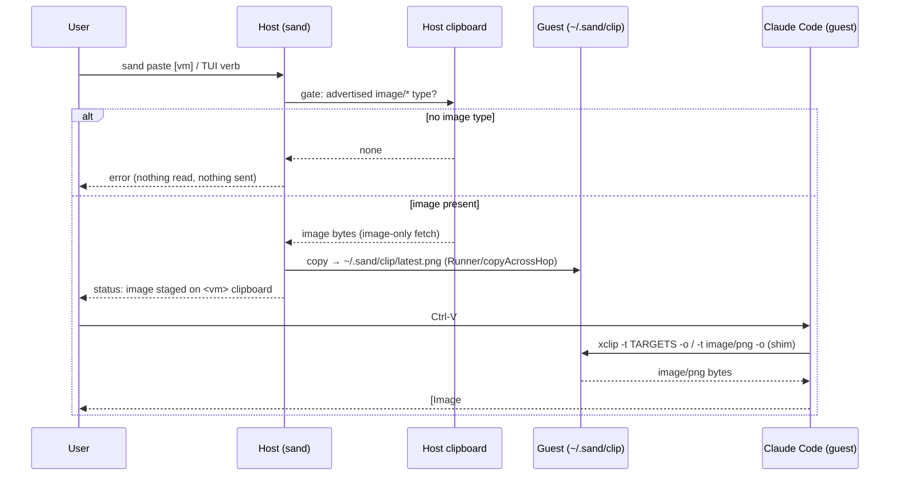

# Plan: `sand paste` — Native Ctrl-V Image Paste Into Guest Agent Sessions

## Original Work Order

> claude code has support for pressing ctrl-v to paste an image, even in the
> terminal. It doesn't detect an image from my host. Is this an ssh problem, a
> terminal / tmux problem, a sand problem? Can we fix and support this? I don't
> even know how it's possible ctrl-v can work that way.
>
> Reading passwords is a real issue I want to avoid. Let's add a "sand paste"
> option - note it also needs to work with the TUI. But, I think this needs more
> refinement. When you paste, where does the image go? How do you easily get it
> into your re-attached agent sessions?
>
> Is there any way we could enable a clipboard inside of the VM? What would be a
> good workflow would be you select "paste" in sand, paste the content, and then
> you can press ctrl-v in claude.

## Plan Clarifications

| # | Question | Resolution |
|---|----------|------------|
| 1 | Is a live host↔guest clipboard bridge acceptable? | **No.** A standing bridge lets any guest process read the host clipboard, which routinely holds passwords. Rejected in favor of a host-initiated, one-shot, image-only command. |
| 2 | Is the design *truly* image-only on every platform? | Only if made explicit. macOS (`«class PNGf»` coercion) and Windows (`GetImage()` returns null) are image-or-nothing by construction; **Linux is not** — a bare typed `xclip`/`wl-paste` fetch is not a hard refusal on a text-only clipboard. Resolution: the host read MUST gate on an advertised `image/*` type first and fetch bytes only then; no image type ⇒ hard error, zero fetch. |
| 3 | How does the pasted image reach the agent — inject a path into tmux, or a real guest clipboard? | Enable a **clipboard inside the guest** so Ctrl-V works natively. Chosen over tmux path-injection; this also removes any need to touch tmux. |
| 4 | Real headless clipboard (Xvfb + xclip) or a shim? | **Shim (Option B).** Ship guest `xclip`/`wl-paste` shims that serve the sand-managed image file. No daemon, negligible image cost, and image-only by construction. Xvfb was rejected as heavier (standing X server per VM, larger base image). |
| 5 | Retention policy for stored pastes? | **Moot.** A clipboard holds one item; `sand paste` overwrites a single-slot file each time, so there is nothing to accumulate or prune. |
| 6 | Backwards compatibility? | Not applicable — purely additive (new command, new TUI verb, new guest files). No BC break. |

Open (defaulted, revisitable — flagged per the work order, not blocking):

| # | Decision | Default chosen | Alternative |
|---|----------|----------------|-------------|
| A | TUI keybinding for the paste verb | `v` | `i` (image) |
| B | Board behavior after a TUI paste | Stay on board, show status-line result | Chain straight into attach |

## Executive Summary

Claude Code's Ctrl-V image paste works by shelling out to a **local** clipboard
reader (`xclip`/`wl-paste` on Linux, `osascript «class PNGf»` on macOS,
PowerShell `GetImage()` on Windows/WSL) on the machine Claude Code runs on.
Inside a sand guest there is no display server and no clipboard tool, so Ctrl-V
finds nothing. This plan adds `sand paste` (a CLI command and a TUI tile verb)
that makes native Ctrl-V work while categorically refusing to expose host
clipboard **text** — the passwords a naive clipboard bridge would leak.

The flow: the user copies an image on the host, triggers `sand paste` (CLI
`sand paste [vm]` or the TUI verb), and presses Ctrl-V inside Claude Code in the
guest — where it renders as a normal `[Image #N]` attachment. Under the hood,
`sand paste` reads the host clipboard **image-only** (gating on an advertised
`image/*` type before ever fetching bytes), copies the image into the guest at a
single-slot path via sand's existing copy plumbing, and relies on a pair of
lightweight guest **shims** named `xclip` and `wl-paste` to serve that image to
Claude Code's own paste probe. There is no live bridge, no display server, and
no daemon.

This approach was chosen because it delivers the native Ctrl-V gesture the user
asked for with the strongest security posture available: nothing auto-syncs from
the host, the host read is one-shot and structurally image-only, and the guest
"clipboard" can only ever contain an image the user explicitly pasted. It reuses
sand's per-platform seam pattern (host clipboard read) and its Runner/copy
plumbing (guest delivery), so it works identically for local and remote-host
VMs, and it touches neither tmux nor the attach path.

## Context

### Current State vs Target State

| Current State | Target State | Why? |
|---------------|--------------|------|
| Ctrl-V in Claude Code inside a guest finds no clipboard tool and no display server; image paste silently does nothing. | `sand paste` loads a host-clipboard image onto a shimmed guest clipboard; Ctrl-V in Claude renders `[Image #N]`. | Restore the paste gesture users expect, inside the sandbox. |
| The only way to get an image to a guest agent is a manual file copy plus typing the path. | One action (`v` in the TUI or `sand paste`) then a native Ctrl-V. | Remove friction; match muscle memory. |
| A host↔guest clipboard bridge would expose all host clipboard content (including passwords) to every guest process. | Host clipboard is read one-shot, image-only, on explicit user action; text can never transit. | Eliminate the credential-leak surface that made a bridge unacceptable. |
| No guest clipboard exists (headless: no `DISPLAY`, no `xclip`/`wl-paste`). | Guest ships `xclip`/`wl-paste` shims that serve a sand-managed image file. | Give Claude Code's native paste probe something to read without a display server. |
| sand knows about tmux in exactly one place (`internal/lima/attach.go`). | Unchanged — paste delivery uses a guest clipboard, not tmux injection. | Keep tmux knowledge centralized; avoid a second tmux touchpoint. |

### Background

**How Ctrl-V can work in a terminal at all.** The keypress sends one byte down
the TTY; Claude Code intercepts it and spawns a clipboard-reader subprocess on
its own host. The image never traverses the terminal. Verified against the
installed Claude Code build: the Linux probe is
`xclip -selection clipboard -t TARGETS -o | grep -E "image/(png|jpeg|jpg|gif|webp|bmp)" || wl-paste -l | grep -E …`
to detect, then `xclip -selection clipboard -t image/png -o` (falling back to
`wl-paste --type image/png`) to fetch; macOS uses `osascript … «class PNGf»`;
Windows/WSL uses PowerShell `[Clipboard]::GetImage()`.

**Why not SSH X11 forwarding or a socket bridge.** Both would forward the whole
host clipboard, text included. The threat that killed the bridge is concrete:
password managers put secrets on the clipboard, and a bridged guest process
could read them at will. The design must therefore be host-initiated and
image-only.

**Why the guest is headless.** The guest has no `DISPLAY`/`WAYLAND_DISPLAY` and
no clipboard binaries, so Claude Code's probe finds nothing today. The shim
supplies real binaries on `PATH` that Claude Code invokes unmodified — it does
not patch or depend on Claude Code's internals beyond the standard `xclip` CLI
contract.

**Relevant repo facts that constrain the implementation.**
- The image must be read off the *host* clipboard by sand; a terminal never
  delivers image bytes when pasting into it, so sand cannot receive an image
  "through" its TUI.
- Host clipboard reading is inherently per-platform and belongs behind a small
  build-tagged seam, mirroring the existing `internal/ui/hostres_*.go`
  (darwin/linux/other) pattern.
- Guest file delivery must go through sand's Runner/copy plumbing
  (`internal/lima` `Client.Copy` → `copyAcrossHop` in `sshhost.go`) so a
  remote-host VM's two-stage hop is handled and no test requires a real
  `limactl` (per `AGENTS.md`).
- TUI verbs live in `internal/ui/commandreg.go` as key bindings with
  `enabledFor` guards (the same shape as `S` shell, `u` upload, `g` download);
  long actions run as async jobs surfaced on the status line
  (`internal/ui/jobs.go`).
- CLI commands live under `cmd/sand/` (`shell.go` is the closest sibling) and
  resolve their target VM/profile through `cmd/sand/resolve.go`.
- The guest shim scripts are provisioned via an Ansible role (`roles/claude-code`
  or `roles/dev-tools`), the same mechanism that installs the agent tooling.

## Architectural Approach

The feature is four cooperating pieces: a **host clipboard-read seam**
(image-only), a **guest delivery** step (single-slot copy through existing
plumbing), a **guest shim pair** (provisioned `xclip`/`wl-paste`), and the two
**entrypoints** (CLI command + TUI verb) that orchestrate the first two. Only the
host-read seam and the shim are genuinely new surface; delivery and orchestration
reuse established sand patterns.

### Host Clipboard-Read Seam (image-only)
**Objective**: Read an image off the host clipboard on demand, and make it
structurally impossible to read text.

A build-tagged seam (`darwin` / `linux` / other, mirroring `hostres_*.go`)
exposes one operation: "return the current clipboard image bytes, or a sentinel
meaning *no image*." Each platform implements it with the same probes Claude Code
uses, but the contract is **gate-then-fetch**: first confirm an `image/*`
representation is advertised (`osascript` coercion on macOS is itself the gate;
`xclip -t TARGETS -o` / `wl-paste -l` on Linux; `GetImage() == null` check on
Windows/WSL), and only then fetch the bytes. A clipboard with no image type
yields the *no image* sentinel and **zero bytes are fetched** — there is no code
path that returns non-image content. This is the load-bearing security property
and must be covered by tests that assert a text-only clipboard produces the
sentinel, never bytes.

### Guest Delivery (single-slot copy)
**Objective**: Place the image where the guest shim can serve it, working
identically for local and remote-host VMs.

The image bytes are written to a single-slot guest path (`~/.sand/clip/latest.png`)
through sand's existing copy path (`Client.Copy` → `copyAcrossHop`), so the
remote two-stage hop and all quoting/escaping are inherited unchanged. Single-slot
overwrite mirrors real clipboard semantics (one item) and eliminates any
retention/pruning concern. The parent directory is created if absent. No tmux and
no attach interaction occur here.

### Guest Shim Pair (`xclip` / `wl-paste`)
**Objective**: Give Claude Code's native paste probe a clipboard to read, with no
display server or daemon.

Two small scripts named `xclip` and `wl-paste`, provisioned onto the guest `PATH`
ahead of any real binary, answer exactly the probes Claude Code issues:
- Target/type listing (`-t TARGETS -o`, `wl-paste -l`): advertise `image/png`
  **iff** the single-slot file exists; otherwise behave like an empty clipboard
  (clean exit, no output), so Ctrl-V with nothing staged correctly reports "no
  image."
- Image fetch (`-t image/png -o`, `--type image/png`): stream the file's bytes.
- Any non-image target (e.g. `text/plain`): behave as empty. The shim has **no**
  text-serving path — image-only by construction, independent of the host seam.

The shims are permissive about *which* `image/*` target is requested (serve the
staged PNG for any image target) so a future Claude Code tweak to its target list
does not break paste. Claude Code tries `xclip` first and only falls back to
`wl-paste`, so the `xclip` shim carries the common case; the `wl-paste` shim is
belt-and-suspenders. This is the only maintenance coupling in the design, and it
is to the decades-stable `xclip` CLI contract, not to Claude Code's private
behavior.

### Entrypoints (CLI command + TUI verb)
**Objective**: One host action that runs read → deliver, for both headless and
TUI users.

- **CLI `sand paste [vm]`**: resolves its target VM/profile through the existing
  `cmd/sand/resolve.go` (no arg ⇒ the single running VM; ambiguity is a clear
  error listing candidates), runs the host read and guest delivery, and reports a
  concise result (staged, or a specific reason nothing was — no image on
  clipboard, VM not running). Requires a running VM, the same guard as
  `sand shell`.
- **TUI verb** (default key `v`): registered in `internal/ui/commandreg.go` beside
  `u`/`g`/`S` with an `enabledFor` guard restricting it to running VMs. It runs
  the same read+deliver as an async action and surfaces the outcome on the status
  line (e.g. `staged image on <vm> — press S then Ctrl-V`), staying on the board
  by default (decision B). It acts on the VM the command registry hands it, never
  on an implicit `m.detail`, consistent with the transfer verbs.

## Risk Considerations and Mitigation Strategies

Security Risks

- **Host clipboard text (passwords) leaking to the guest**: the entire motivation.
    - **Mitigation**: gate-then-fetch host read that returns a *no image* sentinel
      and fetches zero bytes when no `image/*` type is advertised; a guest shim
      with no text-serving path at all. Two independent image-only layers. Tests
      assert a text-only clipboard yields no bytes on every platform.
- **A guest process reading the staged image**: any guest process can read
  `~/.sand/clip/latest.png`.
    - **Mitigation**: accepted and bounded — the file only ever contains an image
      the user explicitly pasted, never host clipboard history and never host
      text; it is no more exposed than any other file the user copies in. Nothing
      auto-syncs from the host.

Technical Risks

- **Linux clipboard read is not image-only by default**: a bare typed
  `xclip`/`wl-paste` fetch is not a hard refusal on a text-only clipboard.
    - **Mitigation**: make the advertised-`image/*`-type gate an explicit,
      tested precondition; never issue a typed fetch on an un-gated clipboard.
- **Per-platform host clipboard probes are brittle across OS/tool versions**.
    - **Mitigation**: isolate behind the build-tagged seam; degrade to a clear
      "no image found" error rather than a crash or a wrong fetch; document the
      probe per platform.
- **Shim coupling to Claude Code's paste command shape**: a future Claude Code
  change to its target list could bypass the shim.
    - **Mitigation**: shims are permissive (serve the staged image for any
      `image/*` target) and cover both `xclip` and `wl-paste`; the coupling is to
      the standard `xclip` CLI, not Claude Code internals. Documented as the known
      maintenance point.

Integration Risks

- **Remote-host VMs**: guest delivery must survive the two-stage hop.
    - **Mitigation**: reuse `Client.Copy`/`copyAcrossHop`; add no new transport.
- **Wrong-VM action from the TUI**: a verb firing on the focused tile must target
  that tile's VM.
    - **Mitigation**: take the VM from the command registry argument, mirroring the
      transfer verbs; never read `m.detail`.
- **Shim shadowing a real tool**: placing `xclip`/`wl-paste` on `PATH` could mask
  a genuinely-installed clipboard tool.
    - **Mitigation**: the guest is headless with no such tools today; the shim is
      the intended provider. Provision deterministically via the role and document
      it.

## Success Criteria

### Primary Success Criteria
1. On a running local VM, copying an image on the host, invoking `sand paste`,
   and pressing Ctrl-V inside Claude Code in the guest yields an `[Image #N]`
   attachment matching the copied image.
2. The TUI paste verb performs the same staging and reports its outcome on the
   status line, enabled only for running VMs.
3. With **text** (not an image) on the host clipboard, both entrypoints report
   "no image found" and provably fetch/transfer zero clipboard bytes — verified
   on macOS and Linux.
4. The same paste flow succeeds against a **remote-host** VM (delivery over the
   two-stage hop).
5. Ctrl-V in the guest with nothing staged is a correct no-op ("no image"),
   because the shim advertises no image type when the single-slot file is absent.
6. No new code references tmux; `internal/lima/attach.go` remains the sole tmux
   touchpoint. Tests do not require a real `limactl`.

## Self Validation

After all tasks are complete, an implementer should verify by:

1. Start a local VM, attach, and launch Claude Code. From a second host terminal,
   copy a known PNG to the host clipboard, run `sand paste <vm>`, then in the
   attached Claude Code press Ctrl-V; confirm the `[Image #N]` chip appears and
   the image is the one copied. Capture the terminal output as evidence.
2. Put plain text (a fake password string) on the host clipboard, run
   `sand paste <vm>`, and confirm it reports "no image found" and stages nothing
   (`ls ~/.sand/clip/` in the guest shows no new/updated file, or the prior slot
   is untouched). Repeat on macOS and Linux hosts.
3. In the TUI, focus a running VM's tile, press the paste verb, and confirm the
   status line reports the staged result; press it on a stopped VM and confirm the
   verb is disabled/absent.
4. With the single-slot file absent, press Ctrl-V in guest Claude Code and confirm
   it reports no image (shim advertises nothing).
5. Repeat step 1 against a remote-host VM and confirm the image arrives over the
   hop.
6. `grep -rn tmux internal/` shows no new matches outside `attach.go`; run the
   package tests and confirm none spins up a real `limactl`.

## Documentation

- Update user-facing docs (README / `docs/`) with the `sand paste` command, the
  TUI verb and its key, and the copy-image → `sand paste` → Ctrl-V workflow,
  explicitly stating it is image-only and never transmits clipboard text.
- Note the guest shim and single-slot path in the provisioning role's
  documentation so the headless-clipboard mechanism is discoverable.
- Update `AGENTS.md` / relevant AI-facing notes if the new host-read seam or shim
  introduces conventions future changes must respect (e.g. "the paste path is
  image-only by contract; do not add a text fallback").

## Resource Requirements

### Development Skills
- Go (CLI command + Bubble Tea TUI verb wiring).
- Cross-platform clipboard internals (macOS `osascript`/pasteboard, Linux
  X11/Wayland selections, Windows/WSL PowerShell clipboard).
- Ansible role authoring for guest provisioning.
- Shell scripting for the guest shims.

### Technical Infrastructure
- Existing `internal/lima` Runner/copy plumbing and `internal/ui` command
  registry + jobs subsystem.
- The build-tagged platform-seam pattern (`hostres_*.go`).
- A running local Lima VM and, for one validation, a remote-host target.

## Integration Strategy

The feature slots into existing seams without new transports: host reads sit in a
new build-tagged package mirroring `hostres_*.go`; guest delivery reuses
`Client.Copy`/`copyAcrossHop`; the CLI command joins `cmd/sand/` and resolves via
`resolve.go`; the TUI verb joins `commandreg.go` and runs through the jobs
subsystem. The guest shim ships via an existing provisioning role. tmux/attach are
untouched.

## Notes

- Purely additive; no backwards-compatibility surface.
- Two cosmetic decisions are defaulted and flagged (keybinding `v`; stay-on-board
  after paste) and can be flipped during task generation without reshaping the
  plan.
- The single-slot design intentionally omits paste history and retention; if a
  multi-item guest clipboard is ever wanted, it is a separate future work order
  (YAGNI).
