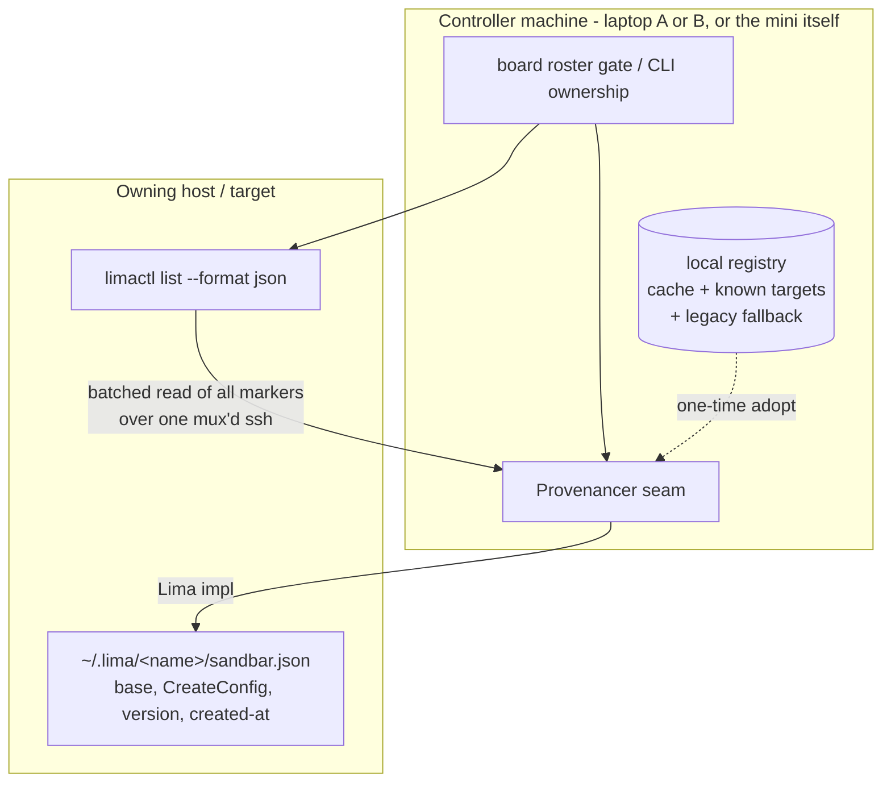

# Plan: Target-Attached VM Provenance

## Original Work Order

> Move VM managed-ness / provenance from the per-controller registry
> (~/.local/share/sandbar/managed-vms.json) to per-instance, target-attached
> metadata, so multiple controllers (e.g. two laptops) managing the same
> host/fleet see a consistent set of managed VMs. Design: write a marker file
> inside the Lima instance dir on the owning host (~/.lima/<name>/sandbar.json)
> containing what registry.Entry holds today (base, CreateConfig, sandbar
> version, created-at). Introduce a provider-level Provenance/MarkManaged
> abstraction that Lima implements as the instance-dir file, and that
> Proxmox/cloud providers can later implement as VM tags/labels. Local registry
> becomes a cache + known-targets list, not the ownership truth. Include
> batched/mux'd reads to avoid per-VM SSH round-trips, an idempotent
> adoption/migration path from the existing controller-side registry, and also
> fix the latent bug where RemoteLimaHome is never exported as LIMA_HOME to the
> remote limactl invocation. Key code: internal/registry/registry.go (Entry,
> Scope, IsManagedInScope, defaultPath), internal/ui/board.go:142 (boardVMs
> roster gate), internal/provider/{local,remote,select}.go,
> internal/lima/{client.go List, sshhost.go ReadFile/WriteFile, hostfiles.go},
> internal/provision/provision.go (existing host-side version stamps as prior
> art).

## Plan Clarifications

| Question | Answer |
| --- | --- |
| How should the existing per-controller registry be handled during cutover? | **Adopt + cache, keep fallback.** A one-time idempotent adoption writes a marker for each existing managed entry; the local registry remains as a cache/known-targets list and is still consulted as a fallback for the roster gate for one release, so no VM loses its tile on upgrade. |
| Should local (non-SSH) Lima also switch to instance-dir markers, or keep the local registry as its ownership truth? | **Unify — local uses markers too.** Local mode reads/writes `~/.lima/<name>/sandbar.json` exactly as remote does. This is what makes "run sandbar on the mini" and "connect to the mini from a laptop" converge on the same managed set. |
| What is the provider-abstraction scope for this plan? | **Seam + Lima only.** Define the provenance provider interface and implement it for Lima. No Proxmox/cloud implementation is built now; the interface must merely be shaped so those providers can implement it later (YAGNI). |
| Is backwards compatibility required? | Yes, for one release, via the adopt-and-fallback path above. There is no requirement to preserve the on-disk `managed-vms.json` schema beyond keeping it readable as a legacy fallback; new writes may extend it as a cache. |

## Executive Summary

Sandbar today decides whether a VM is "managed" (and therefore gets a tile in
the board and is safe to reset/recreate against its clone base) by consulting a
JSON registry stored on the **controlling machine** at
`~/.local/share/sandbar/managed-vms.json`, keyed per `(scope, name)`. Because
that file lives with the controller rather than with the VM, two controllers —
e.g. a user's two laptops both connecting to the same Mac mini as the same SSH
user — hold two independent, divergent sources of truth for one fleet. A VM
created from laptop A appears in `limactl list` from laptop B but gets no tile,
and vice versa; running sandbar directly on the mini uses yet another scope key
and shows a third view. The raw discovery is identical in all modes; only the
provenance record differs.

This plan relocates provenance from the controller to the **target**: the
machine (or, later, the hypervisor/cloud account) that actually owns the VM. For
Lima that means a marker file written inside the instance directory,
`~/.lima/<name>/sandbar.json`, carrying exactly the fields
`registry.Entry` holds today. Managed-ness becomes a question answered *through
the provider* ("does this instance carry a sandbar marker?") rather than by a
controller-local lookup. Because the marker lives in the instance directory it
inherits the VM's lifecycle for free — `limactl delete` removes it, so there are
no orphaned or aliased claims — and every controller that can reach the host
converges on the same answer with no sync protocol.

The change is introduced behind a small provider seam (`Provenancer`) so the
Lima implementation is an instance-dir file while Proxmox/cloud can later be VM
tags/labels — the only metadata model that works for providers with no shared
controller filesystem. The local registry is demoted to a cache plus the list of
known targets/profiles; for one release it also serves as a legacy fallback and
as the source for a one-time, idempotent adoption pass that stamps markers onto
already-managed VMs. Finally, the plan fixes a latent correctness bug where the
profile's `RemoteLimaHome` is honored for host file reads but never exported as
`LIMA_HOME` to the remote `limactl` invocation, which can make discovery and
file reads (now including marker reads) disagree on hosts with a non-default
Lima home.

## Context

### Current State vs Target State

| Current State | Target State | Why? |
| --- | --- | --- |
| Managed-ness is recorded in `~/.local/share/sandbar/managed-vms.json` on the controlling machine (`internal/registry/registry.go` `defaultPath`). | Managed-ness is recorded on the target as per-instance metadata (`~/.lima/<name>/sandbar.json` for Lima), read/written through a provider seam. | The controller registry is per-machine; two controllers of one fleet diverge. Provenance belongs with the VM. |
| The board roster gate is `reg.IsManagedInScope(name, scope)` (`internal/ui/board.go:142`) against the local file. | The roster gate asks the provider whether the instance carries a marker (with the legacy registry as a one-release fallback). | Makes local-on-host and remote-into-host, and multiple controllers, show the same set. |
| Entries are keyed per `(scope, name)`; the same VM under local scope vs. a remote scope are two different keys, deliberately invisible to each other. | The marker is intrinsic to the instance, so scope no longer gates ownership; `Scope` is retained only for UI grouping and known-target/profile bookkeeping. | The per-scope key was the mechanism that made the same VM look unmanaged from a different controller/mode. |
| Local Lima uses the controller registry as ownership truth; remote uses the same registry under a remote scope. | Both local and remote Lima read/write the same instance-dir marker on the owning host. | Convergence between "run on the mini" and "connect to the mini" requires one shared record. |
| `RemoteLimaHome` (profile `lima_home`) is used for host file reads but is never exported as `LIMA_HOME` to the remote `limactl` (`internal/lima/sshhost.go` ssh argv construction). | The remote `limactl` invocation is run with `LIMA_HOME` set to the profile's resolved remote Lima home. | On hosts with a non-default Lima home, discovery and file reads (including marker reads) otherwise resolve different instance directories. |
| No adoption/migration path; ownership is wherever each controller's file happens to record it. | A one-time idempotent adoption stamps markers onto existing managed VMs; the legacy registry is a fallback for one release. | Upgrading controllers must not make already-managed VMs lose their tiles. |

### Background

Both providers delegate discovery to the same Lima core: `limaProvider.List`
(`internal/provider/local.go`) calls `Client.List` (`internal/lima/client.go`),
which runs `limactl list --format json` with no filtering; the remote provider
(`internal/provider/remote.go`) embeds `*limaProvider` and inherits `List`
unchanged, running it over the SSH hop (`internal/lima/sshhost.go`). Filtering
to "managed" happens only at the UI/registry layer.

The registry already stores everything needed for a marker: an `Entry` holds
`Base`, `Config` (`vm.CreateConfig`), `Provider`, and `RemoteTarget`
(`internal/registry/registry.go`). The provisioner already demonstrates the
host-side-metadata pattern this plan generalizes: it writes and reads version
**stamps** on the base image through the `HostFiles` seam
(`internal/provision/provision.go`), and `SSHHost` already implements
`ReadFile`/`WriteFile` over SSH (`internal/lima/sshhost.go`). So the target-side
marker has direct prior art and existing transport; this plan does not invent a
new I/O mechanism, it introduces a new record and a seam to address it.

The reported symptom — different VMs shown when running sandbar on a host vs.
connecting to it remotely — is, in its intentional part, a direct consequence of
the per-controller, per-scope registry. This plan is the structural fix, and it
is explicitly forward-looking: instance-attached metadata is the only ownership
model that survives the move to Proxmox and cloud providers, where controllers
share no filesystem.

## Architectural Approach

The work divides into a provider seam, a Lima implementation of that seam, a
roster/ownership rewiring in the UI and CLI to consult the provider instead of
the controller registry, a demotion of the registry to cache + adoption source,
and the standalone `LIMA_HOME` transport fix. The seam is deliberately minimal
(Lima-only implementation) but shaped for future providers.

### Component 1 — The `Provenancer` provider seam

**Objective**: Give the rest of the codebase a provider-agnostic way to ask
"is this instance sandbar-managed, and with what provenance?" and to mark/unmark
it, so ownership no longer routes through the controller registry.

Define a small interface (working name `Provenancer`) exposing, at minimum: a
batched read that returns provenance for all currently-listed instances in one
call (to avoid per-VM round-trips), a single-instance read, a write/mark
operation invoked at create time, and an unmark/clear operation for teardown
paths that do not delete the instance. The provenance payload mirrors the
current `registry.Entry` fields (base, `CreateConfig`, sandbar version,
created-at) plus a schema version for the marker itself. The seam lives alongside
the existing provider interfaces (`internal/provider`) and is implemented by the
Lima provider; the remote provider inherits it through the same embedding that
already gives it `List`. Providers that cannot support provenance would return a
well-defined "unsupported" signal, but Lima (local and remote) fully supports it.

Design the batched read as the primary entry point so the board's per-refresh
cost is one host round-trip, not N. The single-instance read exists for CLI
paths that already target one VM.

### Component 2 — Lima instance-dir marker implementation

**Objective**: Implement `Provenancer` for Lima as a file at
`<LimaHome>/<name>/sandbar.json`, written/read through the existing `HostFiles`
seam so it works identically for local (`LocalFiles`) and remote (`SSHHost`)
hosts.

The marker path is resolved against the same Lima home the provider uses for
discovery, so that after the `LIMA_HOME` fix (Component 5) discovery and marker
I/O always agree. Writing happens at create time, after the instance directory
exists, using `WriteFile` with restrictive perms consistent with the existing
stamp writes. The single read is `ReadFile` with a not-exist result meaning
"unmanaged." The batched read is the performance-critical piece: implement it as
one command over the (already-multiplexed) SSH connection that emits every
instance's marker in a single response — for example a single remote invocation
that concatenates or archives the per-instance marker files with their instance
names — parsed controller-side into a `name -> provenance` map. Local mode
performs the equivalent single-pass directory read. Missing/parse-failed markers
are treated as unmanaged, never as errors that abort a listing.

Because the marker lives inside the instance directory, `limactl delete` removes
it with the VM, so no explicit cleanup is required on delete and no stale marker
can be inherited by a later VM that reuses the name. Explicit unmark is only for
flows that intentionally relinquish management without deleting the VM.

### Component 3 — Rewire the roster gate and CLI ownership to the provider

**Objective**: Make the board and CLI decide managed-ness from provider
provenance (with a one-release legacy fallback) instead of
`IsManagedInScope`.

The board's `boardVMs` roster gate (`internal/ui/board.go:142`) changes from
"tile iff `reg.IsManagedInScope(name, scope)`" to "tile iff the instance carries
a provenance marker, OR (legacy fallback) the local registry records it as
managed, OR it has an active provision job." The provenance map is fetched once
per refresh (Component 2's batched read) alongside the existing `List`. The CLI
ownership paths that consult the registry — creation recording
(`cmd/sand/create.go`), shell target resolution and unmanaged-owner probing
(`cmd/sand/shell.go`), and provider/scope selection
(`internal/provider/select.go`, `fleet.go`) — are updated to write markers on
create and to resolve ownership from provenance, keeping the registry read only
as fallback. `Scope` is retained for UI grouping and for keying the known-targets
list, but it stops being the ownership discriminator.

### Component 4 — Demote the registry to cache + adoption source

**Objective**: Keep the local registry useful (fast cache, list of known
targets/profiles, one-release legacy fallback) while removing its role as the
ownership source of truth, and drive a one-time idempotent adoption that stamps
markers onto already-managed VMs.

On first contact with a target after upgrade, run an adoption pass: for each
instance the controller's registry records as managed under any scope, if the
live instance exists and carries no marker, write the marker from the registry
entry. Adoption is idempotent (a present marker is left untouched) and safe to
run repeatedly. The registry file continues to be read as a fallback in the
roster gate for one release so that a controller that has not yet run adoption
against a given host still shows the right tiles. New writes to the registry are
treated as a cache of last-known provenance, not the authority. Document the
one-release fallback window so the fallback and legacy read path can be removed
in a follow-up.

### Component 5 — Export `LIMA_HOME` to the remote `limactl` (latent-bug fix)

**Objective**: Ensure the remote `limactl` invocation resolves the same Lima
home that sandbar uses for host file reads, so discovery and marker I/O agree on
hosts with a non-default Lima home.

The profile's `RemoteLimaHome` (`internal/lima/sshhost.go`, from profile
`lima_home`) is currently consumed only by the `LimaHome()` file-reading seam and
never reaches the remote command. Update the SSH command construction
(`sshBase`/`sshCommand` argv building in `internal/lima/sshhost.go`) so the
remote `limactl` runs with `LIMA_HOME` set to the resolved remote Lima home when
that value is non-default/configured. This is independently correct regardless of
the provenance change, but it is prerequisite to markers being read from the same
directory `limactl list` enumerates. Take care that the env is applied to the
remote process (not the local ssh client env) and does not re-introduce the kind
of env leakage previously fixed for the loopback ssh session.

## Risk Considerations and Mitigation Strategies

Technical Risks

- **Per-VM SSH round-trips on every board refresh**: A naive single-instance
  marker read per listed VM would add N SSH invocations to every refresh.
    - **Mitigation**: Make the batched, single-round-trip read (Component 2) the
      primary path used by the board; reserve single reads for already-targeted
      CLI operations. Reuse the existing SSH multiplexing.
- **Host can forge or corrupt a marker**: A compromised or buggy host could
  present false provenance.
    - **Mitigation**: The controller already trusts the host completely (it runs
      `limactl` there), so no new trust is ceded. Treat malformed/missing markers
      as "unmanaged" rather than erroring, so a bad marker degrades gracefully to
      no-tile instead of crashing a listing.
- **`LIMA_HOME` env handling regressing prior ssh-env fixes**: Injecting env
  into the remote command risks re-introducing env leakage previously fixed.
    - **Mitigation**: Apply `LIMA_HOME` narrowly to the remote process argv,
      verify against the existing loopback/second-user e2e, and add coverage that
      asserts the remote `limactl` sees the intended home.

Implementation Risks

- **Marker/instance lifecycle edge cases** (rename, reset, migrate): The base
  rename/migrate flows already special-case stamps; markers must behave sanely
  across the same operations.
    - **Mitigation**: Define marker behavior for create, delete (free via
      instance-dir removal), reset (marker persists — same VM), and rename
      (marker moves with the instance dir or is re-stamped), mirroring how the
      provisioner already carries stamps across a rename.
- **Adoption running against the wrong/partial fleet**: A controller might adopt
  based on a stale registry, stamping a marker onto a VM it should not claim.
    - **Mitigation**: Adopt only when the live instance exists AND has no marker;
      never overwrite an existing marker; scope adoption to entries the registry
      already recorded as managed. Log adopted names.

Compatibility Risks

- **Mixed-version controllers during the transition**: An old controller (no
  marker awareness) and a new one manage the same fleet simultaneously.
    - **Mitigation**: New controllers keep writing the registry as a cache and
      keep the registry fallback for one release, so an old controller continues
      to work from its own registry while new controllers converge on markers.
      The old controller simply does not benefit from cross-controller
      convergence until upgraded — no regression relative to today.

## Success Criteria

### Primary Success Criteria

1. A VM created by sandbar on host X (local mode) shows a tile when a second
   controller connects to host X over remote SSH as the same user, and vice
   versa — without any manual registry copying.
2. Two controllers (simulating two laptops) connecting to the same host as the
   same SSH user display the identical managed-VM set on the board.
3. Deleting a managed VM via `limactl delete` (or sandbar's delete path) leaves
   no marker behind, and a subsequently-created VM reusing the same name is not
   shown as managed until it is itself marked.
4. Upgrading a controller that already has managed VMs recorded in
   `managed-vms.json` results in those VMs remaining visible (adoption stamps
   markers; fallback covers pre-adoption reads) — no managed VM loses its tile.
5. On a host configured with a non-default Lima home, remote `limactl list` and
   sandbar's marker reads resolve the same instance directory (the `LIMA_HOME`
   fix), and the managed set is correct.
6. Board refresh performs a bounded number of host round-trips for provenance
   (batched), not one per VM.

## Self Validation

After all tasks are complete, an executing LLM should verify the implementation
by exercising the real system, not only running unit tests:

1. **Cross-mode convergence (local ↔ remote)**: Using the project's Lima e2e
   harness (see `molecule/` and the existing remote-Lima-over-SSH loopback e2e),
   create a managed VM in local mode, then list via the remote provider pointed
   at the same host/user, and assert (programmatically or via captured board
   output) the VM appears as managed in both. Confirm the marker file exists at
   `<LimaHome>/<name>/sandbar.json` on the host and contains the expected base,
   CreateConfig, version, and created-at fields.
2. **Two-controller convergence**: Simulate a second controller by invoking the
   remote provider from a clean `XDG_DATA_HOME` (empty registry) against the same
   host; confirm the managed set matches the first controller's without copying
   `managed-vms.json`.
3. **Lifecycle**: Delete the VM and assert the marker is gone (no orphan);
   recreate a VM with the same name without marking it and assert it is listed by
   `limactl` but shows no tile.
4. **Adoption/fallback**: Seed a legacy `managed-vms.json` with an entry for an
   existing unmarked VM, run the adoption path, and assert a marker is now
   present and the VM shows managed; run adoption again and assert the marker is
   unchanged (idempotent). Before adoption runs, assert the fallback still shows
   the tile.
5. **`LIMA_HOME` fix**: Configure a profile with a non-default `lima_home` on a
   test host, and assert the remote `limactl list` enumerates instances from that
   directory and that marker reads resolve the same path (e.g. by capturing the
   remote command and confirming `LIMA_HOME` is present, plus an end-to-end list
   returning the expected instance).
6. **Round-trip bound**: Instrument or trace a board refresh over SSH and confirm
   provenance is fetched in a single batched call rather than one per VM.

## Documentation

- Update `AGENTS.md` and/or `internal/registry` and `internal/provider` package
  docs to describe the new ownership model: markers are the source of truth, the
  registry is a cache + known-targets + one-release fallback, and `Scope` is UI
  grouping rather than ownership.
- Document the marker file location, schema, and lifecycle (created on create,
  removed with the instance, adopted from the legacy registry once) for future
  provider implementers (Proxmox/cloud) so they know what the seam expects.
- Note the profile `lima_home` → remote `LIMA_HOME` behavior in the relevant
  profile/remote docs, since it now affects discovery, not just file reads.
- Record the one-release fallback window and the follow-up needed to remove the
  legacy registry read path.

## Resource Requirements

### Development Skills

Go; familiarity with the sandbar provider/lima/registry architecture; SSH
command construction and multiplexing; Lima instance layout; the project's
Molecule/Lima e2e harness.

### Technical Infrastructure

Lima on the dev/CI host; the existing remote-Lima-over-SSH loopback e2e
(including the second-user variant) for cross-controller and non-default-home
testing; the project's Go test and CI tooling.

## Integration Strategy

The seam is introduced additively: the Lima provider gains a `Provenancer`
implementation while the registry remains present as cache/fallback, so the
system is functional at every step. The roster gate switches to "marker OR legacy
registry OR active job," which is a superset of today's behavior during the
transition and therefore cannot hide a currently-visible VM. The `LIMA_HOME` fix
is self-contained and can land first as an independent correctness improvement.
Removal of the legacy fallback and the registry's ownership role is deferred to a
follow-up plan after the one-release window.

## Notes

- Scope is intentionally limited to the provider seam plus a Lima implementation;
  Proxmox and cloud implementations are explicitly out of scope for this plan but
  the interface must be shaped so a tag/label-based implementation fits without
  redesign.
- The change deliberately does not add a controller-to-controller sync protocol;
  convergence is achieved purely by relocating the record to the shared target,
  which is why it also generalizes to providers with no shared controller
  filesystem.
- The retained `Scope` type still matters for grouping and for keying the list of
  known targets/profiles; only its role as the ownership discriminator is
  removed.
