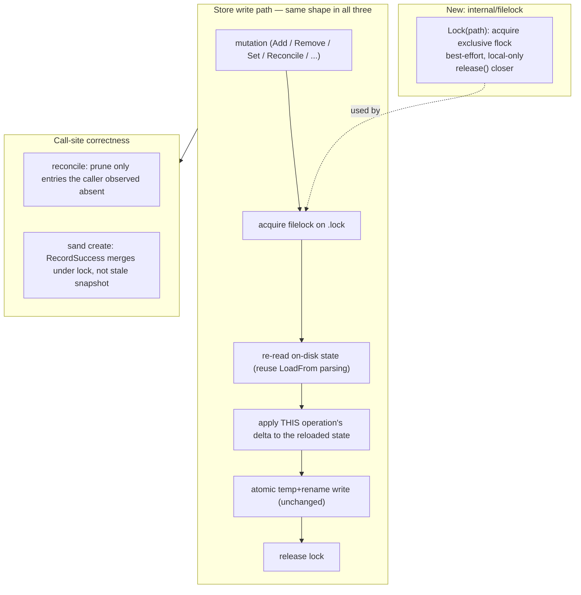
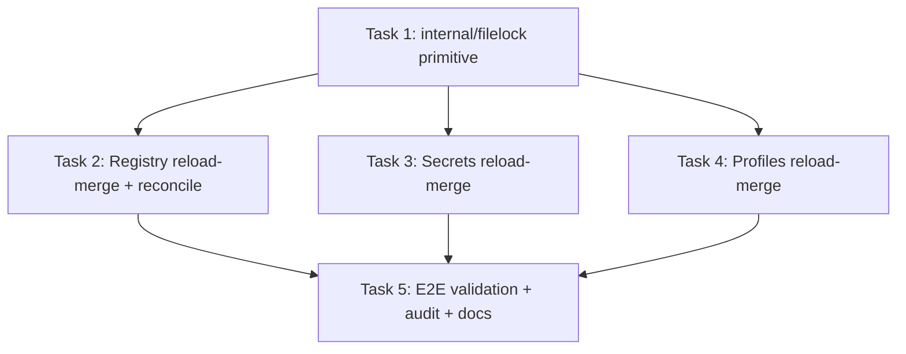

# Plan: Concurrency-Safe Host-Side State Stores

## Original Work Order

> Fix concurrent-instance lost updates in sand's host-side state stores.
>
> ## Problem
> Running two `sand` processes at once (e.g. the TUI in one terminal and `sand create` or a second TUI in another) can silently lose data in the three host-side state files. No file corruption or guest-VM corruption occurs — atomic temp+rename writes and the base-image flock prevent those — but the stores suffer session-long lost updates because they are loaded once, held in memory, and written as blind whole-file overwrites with NO cross-process lock and NO read-modify-write.
>
> ## Affected stores (all same design)
> - Registry (managed-VM index): $XDG_DATA_HOME/sandbar/managed-vms.json — internal/registry/registry.go, save() at ~line 503; AddScoped ~416, RemoveScoped ~437, ReconcileScoped ~466 (saves only when it prunes something).
> - Secrets (per-VM KEY=VALUE): $XDG_DATA_HOME/sandbar/secrets.json — internal/secrets/secrets.go, save() at ~line 469; SetAll/Set/Remove.
> - Profiles (connection profiles): $XDG_CONFIG_HOME/sandbar/profiles.yaml — internal/profiles/store.go, save() at ~line 355; Add/Update/Remove/Enable/Disable/SetLastUsed.
>
> Each save() serializes the entire in-memory map and atomically temp-writes + renames; it never re-reads the on-disk file first.
>
> ## Lifecycle facts
> - The TUI (internal/ui/model.go) loads all three ONCE in model.New(): registry.Load() at model.go:339 (held as m.reg), secrets.Load() at :347 (m.sec), profiles.Load() at :361 (m.profileStore). None are ever reloaded. Mutations go through the single in-memory copy for the whole session.
> - The TUI re-lists every member every 5s (internal/ui/refresh.go:29 refreshInterval) and on each vmsLoadedMsg calls manage.Reconcile(m.reg, live, sc) -> reg.ReconcileScoped, which calls save() whenever it drops anything (registry.go:477-480), writing the TUI's whole stale map.
> - Headless `sand create` (cmd/sand/create.go) has the same window, wider: loads reg at :201, reconciles (may save) at :218, provisions for minutes, then manage.RecordSuccess -> AddScoped -> save() at ~:281 writes the snapshot captured at :201.
>
> ## Concrete failure
> `sand create foo` writes {web, foo} to disk; the running TUI still holds {web} in memory; the TUI's next 5s reconcile (or any TUI mutation) saves {web}, erasing foo. foo still exists in `limactl list`, so it silently becomes UNMANAGED (no badge, recreate disabled, stored sizing config lost). The TUI's reconcile then also prunes foo's host secrets (model.go:970-972), cascading the loss into secrets.json. Symmetric in the other direction (a long create overwrites TUI edits made during its window).
>
> ## Existing precedent for the fix
> The codebase already has exactly the right cross-process primitive: internal/provision/baselock.go uses syscall.Flock via lima.HostFiles.OpenLock (internal/lima/hostfiles.go, ~line 146) — with a remote ssh-flock variant in internal/lima/sshhost.go (~line 729) — to serialize base-image build/clone/delete. It is deliberately best-effort: if the lock file can't be created it warns and proceeds unserialized rather than failing the operation. That posture (a lock failure is never an operation failure) should be mirrored here.
>
> ## Desired outcome
> Make the three host-side stores safe under concurrent `sand` processes: eliminate the lost-update window so a write from one process cannot silently discard another process's committed changes. Likely approach is a per-store cross-process lock around a read-modify-write (reload-merge-then-write) rather than the current blind whole-file overwrite — reusing the flock primitive already in the repo. Note these are LOCAL-only files today (registry/secrets/profiles live on the machine running the binary), unlike the base lock which must also work over SSH for remote Lima. Preserve the existing tolerant/best-effort error posture and the atomic temp+rename + .corrupt-quarantine behavior. Guest-side concurrency (per-VM limactl create/delete on the same instance) is out of scope — that is user-directed and bounded by Lima itself; this plan is about the host state files.

## Plan Clarifications

| Question | Answer |
| --- | --- |
| During an upgrade, an OLD sand binary (no lock) can run alongside a NEW one and still won't be serialized. How should the plan treat that cross-version window? | **Accept as a known limitation.** No format change, no migration, no version-negotiation machinery. Document that concurrent OLD+NEW binaries during an upgrade are not protected (YAGNI). |
| Where should the shared lock helper live, given registry/secrets/profiles must not depend on the `lima` package? | **A new `internal/filelock` package** — a small, local-only flock helper the three stores import. Leave `baselock.go`/`sshhost.go` as-is (they need the remote-SSH variant). |
| Is backwards compatibility required for the on-disk formats? | **Yes, preserved by construction.** On-disk JSON/YAML shapes, schema versions, atomic temp+rename, and `.corrupt` quarantine are all unchanged; only new sibling `*.lock` files are added. |
| Reloading under the lock via `LoadFrom` would re-enter `save()` — `LoadFrom` writes during v1/v2→v3 migration (registry.go:297-305), `seedLocal` writes on empty/missing profiles, and a parse failure renames to `.corrupt`. Wouldn't that self-deadlock the flock (a fresh lock-file fd is a distinct open file description, so a nested `LOCK_EX` blocks) or double-write? | **Auto-resolved (codebase).** The locked read-modify-write reloads through a **non-locking, side-effect-free parse** — the pure decode portion of `LoadFrom`, factored so that under the lock it neither calls `save()`, nor migrates-with-write, nor seeds, nor quarantines. Migration / seed / corrupt-quarantine continue to happen on the normal `Load()` path at process start, not on every locked reload. The lock is acquired once at the mutation boundary and inner writes never re-acquire it, so there is no re-entrant self-deadlock. |
| `ReconcileScoped(scope, present)` today prunes in-memory entries absent from the caller's live `present` set (registry.go:466-481). After the reload-under-lock, how does it avoid pruning an entry a concurrent process just added — which is legitimately absent from the caller's older `limactl list` snapshot? | **Auto-resolved (codebase).** Reconcile prunes only the **intersection** of *entries the caller already knew about* and *entries confirmed absent from its live list*, applied to the reloaded on-disk set. This requires the caller to pass the key set it originally knew about (its pre-reconcile registry snapshot) alongside `present`; entries that appeared on disk after that snapshot are never pruned. `manage.Reconcile` is adjusted to supply that snapshot. |
| Should the blocking acquire wait forever behind a wedged peer, and should `fsync` be standardized across the three stores (today only `secrets` fsyncs)? | **Auto-resolved (scope).** The acquire is **bounded** by a short deadline; on expiry or any lock error it degrades to today's unserialized write and emits a visible note — it never blocks a store write indefinitely, matching the best-effort posture. `fsync` is left exactly as each store does it today; standardizing crash-durability is out of scope (YAGNI) — this plan targets cross-process lost updates, not fsync durability. |

## Executive Summary

`sand`'s three host-side state stores — the managed-VM registry, the per-VM
secrets store, and the connection-profiles store — are each loaded once at
process start, held in memory for the life of the process, and written back as
a *blind whole-file overwrite* of the in-memory snapshot. There is no
cross-process lock and no re-read of the on-disk file before writing. As a
result, two concurrent `sand` processes (a long-lived TUI plus a headless
`sand create`, or two TUIs) silently lose each other's committed changes:
whichever process writes last wins, discarding entries the other process added.
The most visible symptom is a freshly created VM being demoted to "unmanaged"
— and having its host secrets pruned — by the other process's routine
5-second reconcile.

This plan closes that window by introducing a small, local-only cross-process
file lock (a new `internal/filelock` package that wraps `syscall.Flock`,
modeled on the existing base-image lock) and converting each store's write path
from "overwrite from my in-memory snapshot" to "under the lock, re-read the
current on-disk state and apply *this operation's* change to it, then write."
The store's in-memory map remains the working copy for reads, but it is never
the authority for a write — the disk is. This is the smallest change that makes
concurrent writers safe without a schema change, a daemon, or a redesign of how
the TUI holds state.

The approach was chosen because the repository already contains and trusts the
exact primitive required (the `flock`-based `baselock.go`), including its
deliberately tolerant posture: a lock that cannot be acquired never fails the
underlying operation, it just proceeds unserialized. Reusing that posture keeps
the fix low-risk — it can only make concurrent behavior better, never make a
single-process operation fail where it used to succeed. On-disk formats, atomic
writes, and corruption quarantine are all preserved unchanged, so there is no
migration and no backwards-compatibility break.

## Context

### Current State vs Target State

| Current State | Target State | Why? |
| --- | --- | --- |
| Registry / secrets / profiles are loaded once and written as a blind whole-file overwrite of the in-memory snapshot. | Each write acquires an exclusive cross-process lock, re-reads the current on-disk state, applies this operation's delta, then writes. | The blind overwrite is exactly what discards a concurrent process's committed changes. |
| No cross-process coordination exists for these three files. | A per-store lock file (`<store>.lock`) serializes read-modify-write across processes. | Two `sand` processes must not interleave a load and a save such that one clobbers the other. |
| A store mutation writes every entry the process knows about — including stale absences (an entry another process added is simply "not in my map"). | A store mutation changes only the entries it intends to (add X, remove Y, prune the set it actually observed), leaving unrelated entries as found on disk. | An add in one process and an unrelated write in another must both survive. |
| `ReconcileScoped` prunes against the caller's in-memory map and then saves that whole map. | Reconcile re-reads under the lock and prunes only the entries the caller actually observed as absent, never entries added on disk since the caller loaded. | A concurrent create's new entry must not be pruned merely because it did not exist when this process last listed. |
| Headless `sand create` captures the registry at load time and writes it back minutes later at `RecordSuccess`. | `RecordSuccess` (and the pre-act reconcile) operate under the lock against the then-current on-disk state. | The multi-minute provision window is the widest clobber window; it must merge, not overwrite. |
| The only cross-process lock in the codebase (`baselock.go`) is coupled to `lima.HostFiles` (local + remote SSH). | A new local-only `internal/filelock` package provides the primitive; the low-level stores depend on it, not on `lima`. | `registry`/`secrets`/`profiles` are local-only and must not gain a dependency on the `lima`/remote abstraction. |
| On concurrent writes, torn files are impossible but silent lost updates are routine. | On concurrent writes, neither torn files nor lost updates occur. | Correctness of the user's saved bookkeeping. |

### Background

The failure is well understood and localized (see the Original Work Order for
exact file:line references). Three facts make it a *lost update* rather than a
*corruption*:

1. **Writes are already atomic.** Every store writes to a unique temp file and
   `os.Rename`s it into place, so a reader never observes a half-written file,
   and a genuinely unparseable file is quarantined to `<path>.corrupt` rather
   than clobbered. These properties must be preserved exactly.

2. **Writes are blind.** `save()` serializes the entire in-memory map with no
   prior re-read, so it encodes "the world as this process last believed it,"
   not "the world as it is now." Serializing two blind writes (even with a
   lock) would still lose data — locking alone is *not* sufficient. The write
   path itself must become a read-modify-write.

3. **The in-memory copy is long-lived.** The TUI loads all three stores once in
   `model.New()` and never reloads, so its snapshot can be arbitrarily stale by
   the time it next writes (the 5-second reconcile guarantees it *will* write).

The base-image lock (`internal/provision/baselock.go`) is the proven local
precedent: it wraps `syscall.Flock`, blocks with a poll while honoring
context cancellation, and — critically — treats a lock it cannot create as a
non-fatal condition, emitting a note and proceeding unserialized. The store fix
should mirror that posture so it can never convert a concurrency guard into an
outage. Unlike the base lock, these three files are always local to the machine
running the binary, so the new primitive does not need the remote-SSH variant
that ties `baselock` to `lima.HostFiles`.

Cross-version concurrency (a pre-fix binary running beside a fixed one during
an upgrade) is explicitly out of scope: the older binary cannot be taught to
honor a lock it does not know about, and solving it would require a format or
protocol change that this plan deliberately avoids.

## Architectural Approach

The work divides into one new primitive and three near-identical store
conversions, plus the two call-site adjustments that widen the window
(reconcile and the headless create path). The in-memory store objects keep
serving reads; only the *write* path changes — from "overwrite from memory" to
"lock, reload from disk, apply my change, write, unlock."

### Component 1 — `internal/filelock` primitive

**Objective**: Provide the single cross-process mutual-exclusion primitive the
three stores share, without coupling low-level store packages to the `lima`
abstraction.

A new package `internal/filelock` exposes a minimal API: acquire an exclusive
advisory lock on a given lock-file path, returning a release function; the
implementation opens (creating if needed) the lock file and calls
`syscall.Flock(fd, LOCK_EX)`. It mirrors `baselock.go`'s tolerant posture:

- A failure to create or open the lock file, or to flock it, is reported to the
  caller as "could not lock; proceed unserialized" rather than as a hard error.
  The store's write must still happen — degraded to today's unlocked behavior —
  because refusing to persist state because a lock file could not be written
  would turn a safety improvement into a regression.
- The lock is process-scoped by the OS (`flock` releases on `Close`/exit), so a
  crashed `sand` never leaves a stale lock wedged.
- It is a *bounded blocking* acquire. A store write is sub-millisecond, so a
  brief wait behind another writer is invisible; but the acquire carries a short
  safety deadline so a wedged peer (a bug, a debugger-paused process) can never
  block a write forever. On deadline expiry — or any error creating/opening/
  locking the file — it degrades to today's unserialized write and emits a
  visible note, exactly matching the best-effort posture below. This differs
  from `baselock`, which is *not* a blocking `LOCK_EX`: `baselock` polls
  `TryLock()` (`LOCK_EX | LOCK_NB`) every 250ms while honoring `ctx`
  (`internal/provision/baselock.go`, `internal/lima/hostfiles.go:146-165`)
  because the base build it guards takes minutes. This primitive guards a
  sub-millisecond write, so a simple bounded blocking acquire is sufficient and
  it does not need the caller's `context`.
- **Non-re-entrant by contract.** `flock` on a second, independently-opened fd
  of the same lock file from the same process would *self-block*. The lock is
  therefore acquired exactly once, at the store's mutation boundary, and nothing
  it calls while holding the lock (the reload-parse or the atomic write) may
  re-acquire it. See Components 2–4 for the non-locking reload that makes this
  safe.
- Local-only: no SSH/remote variant, no `lima.HostFiles` dependency.

The lock file lives beside each store file (`managed-vms.json.lock`,
`secrets.json.lock`, `profiles.yaml.lock`), created under the same directory
the store already `MkdirAll`s. It is never the store file itself, so a flock on
it cannot interfere with the atomic rename of the real file.

### Component 2 — Registry store conversion

**Objective**: Make every registry mutation a locked read-modify-write so a
concurrent process's entries survive.

`internal/registry/registry.go` is refactored so each public mutation
(`AddScoped`, `RemoveScoped`, `ReconcileScoped`, and anything else that
currently ends in `save()`) performs its change against the *current on-disk*
index rather than the possibly-stale in-memory map:

- Under the store lock, re-read and parse the on-disk file using a
  **non-locking, side-effect-free parse** — the pure decode/migration-in-memory
  portion of `LoadFrom`, factored out so that during a locked reload it does
  **not** call `save()` (today `LoadFrom` writes back a migrated v3 index at
  registry.go:297-305), does not re-acquire the lock, and does not quarantine.
  Schema/version handling stays defined once (shared with `LoadFrom`), but the
  disk-writing side effects (migration persistence, `.corrupt` rename) remain on
  the process-start `Load()` path, not on every mutation. The result is the
  authoritative current entry set.
- Apply the specific delta: `AddScoped` inserts/overwrites exactly its one
  `(scope, name)` key; `RemoveScoped` deletes exactly its one key;
  `ReconcileScoped` removes only the `(scope, name)` keys the caller observed as
  absent (see Component 5), never keys that appeared on disk since load.
- Write the merged set with the existing atomic temp+rename `save()` body, then
  release the lock.
- Refresh the in-memory map from the merged result so subsequent reads in this
  process reflect what was actually persisted (including entries other
  processes added).

The stable-sort, byte-identical-output, `.corrupt` quarantine, and empty-path
(in-memory, test) no-op behaviors are all preserved.

### Component 3 — Secrets store conversion

**Objective**: Same locked read-modify-write for the per-VM secrets store,
which additionally holds real secret values and has the strictest file-mode
requirements.

`internal/secrets/secrets.go` is converted identically: `Set`/`SetAll`/`Remove`
re-read the on-disk store under the secrets lock, apply their per-`(connScope,
vm)` change to the reloaded tree, and write. The security-critical properties —
0600 temp file created before any secret bytes, forced 0700 parent dir, `fsync`
before rename, key/scope validation before any mutation — are all preserved;
the lock and reload wrap around them, they are not replaced. The reload uses the
same non-locking, side-effect-free parse described in Component 2 — it shares
`LoadFrom`'s v1/v2/v3 version detection/migration-in-memory (so version handling
is not duplicated) but does not itself `save()` or re-acquire the lock while the
lock is held.

### Component 4 — Profiles store conversion

**Objective**: Same locked read-modify-write for the connection-profiles store.

`internal/profiles/store.go` is converted identically: `Add`, `Update`,
`Remove`, `Enable`, `Disable`, and `SetLastUsed` re-read the on-disk profiles
under the profiles lock (via the same non-locking, side-effect-free parse — note
`profiles.LoadFrom` writes through `seedLocal()` on an empty/missing file, so the
locked reload must use the seed-free parse and let seeding stay on the
process-start `Load()` path), apply their change to the reloaded set, re-run
`validate()` against the merged set, and write. Preserved: the 0644 file mode,
insertion-order stability, the seed-local-on-empty behavior, and the
`.corrupt` quarantine.

The profiles store is the trickiest merge because, unlike the flat maps of
registry/secrets, it carries two fields that do not map-union cleanly (store.go
`order []string` at ~:31 and `lastUsed string` at ~:32):

- **Insertion order.** `Add` against the *reloaded* set appends its one new
  profile to the order as it exists on disk (which may already include a profile
  a concurrent process added), rather than rewriting `order` from this process's
  stale slice. `Remove` deletes exactly its one key from the reloaded order.
- **`LastUsed` scalar.** It is last-writer-wins by nature: a `SetLastUsed`
  updates only the scalar on the reloaded set; a concurrent profile edit updates
  only its profile entry. Both survive because each applies its own narrow delta
  — neither rewrites the other's field.

### Component 5 — Reconcile and headless-create call-site correctness

**Objective**: Close the two widest clobber windows at the call sites that the
Work Order identifies, so that locking + reload actually eliminates loss rather
than merely serializing it.

Two behaviors must change to be *merge-correct*, not just lock-protected:

- **Reconcile pruning basis.** `manage.Reconcile` / `ReconcileScoped` must
  prune only entries the caller *observed and found absent* from its live list,
  not "every entry in my in-memory map that isn't in `live`." Concretely: an
  entry that a concurrent process added to disk after this process took its
  `limactl list` snapshot must not be pruned merely because it is missing from
  that older snapshot. The reconcile operates on the intersection of "entries I
  knew about" and "entries confirmed absent," applied to the reloaded on-disk
  set. This prevents the headline failure (a 5-second TUI reconcile deleting a
  VM that `sand create` just recorded), and its cascade into the secrets prune
  at `model.go:970-972`.

  Concretely this is an interface change. Today `ReconcileScoped(scope Scope,
  present map[string]bool)` (registry.go:466-481) iterates the *in-memory* index
  and drops any entry in that scope not in `present`. After the reload it must
  iterate the *reloaded on-disk* set, but pruning only "reloaded entries not in
  `present`" would re-introduce the bug — it would drop a concurrently-added
  entry that is legitimately absent from the caller's older live list. So the
  method also takes the caller's originally-known key set (the scope's keys as
  the caller last observed them, i.e. its pre-reconcile snapshot) and prunes only
  `known ∩ absent-from-present`, leaving any reloaded key the caller never knew
  about untouched. `manage.Reconcile` (manage.go:24-30) is adjusted to capture
  and pass that snapshot alongside the `present` map it already builds from
  `p.List()`.

- **Headless `sand create` merge.** `cmd/sand/create.go` captures the registry
  at load time and writes it back minutes later via `manage.RecordSuccess`. With
  Component 2 in place, `RecordSuccess` (an `AddScoped`) already re-reads under
  the lock, so the stale snapshot is no longer the write basis. The pre-act
  reconcile at `create.go:218` must use the corrected pruning basis from above.
  Verify no remaining code path writes a registry/secrets/profiles snapshot
  captured before a long-running operation.

The TUI continues to hold its in-memory stores for reads and does not need to
reload on a timer; correctness now comes from every *write* reloading, and from
reconcile pruning only what it truly observed. Whether the TUI should also
refresh its in-memory view after a locked write (so the board reflects entries
other processes added) is an ergonomic follow-on, noted under Notes, not a
correctness requirement of this plan.

## Risk Considerations and Mitigation Strategies

Technical Risks

- **Locking alone does not fix lost updates.** Serializing two blind
  whole-file overwrites still loses data.
    - **Mitigation**: The plan's core is the read-modify-write conversion
      (Components 2–4), not just the lock. The lock is necessary but explicitly
      insufficient on its own; every store mutation must reload before writing.

- **flock semantics differ across filesystems.** `syscall.Flock` is advisory
  and may be a no-op or behave differently on some network filesystems.
    - **Mitigation**: The files are local user-config/data dirs (XDG paths on a
      local machine) — the same assumption `baselock.go` already relies on. The
      tolerant posture means a filesystem where flock is a no-op degrades to
      exactly today's behavior, never worse.

- **Reload-on-every-write reintroduces a parse/migration path.** Re-reading the
  on-disk file on each mutation risks divergence from `LoadFrom` if the parsing
  is duplicated.
    - **Mitigation**: Share `LoadFrom`'s decode/version-detection logic for the
      reload rather than hand-rolling a second parser, so schema/version
      handling lives in one place — but as a *non-saving* variant (see below).

- **Re-entrant self-deadlock via `LoadFrom`'s hidden writes.** `LoadFrom` is not
  a pure read: `registry.LoadFrom` persists a migrated v3 index (registry.go:297-305),
  `profiles.LoadFrom` writes through `seedLocal()` on an empty/missing file, and
  all three rename a bad file to `.corrupt`. If the locked read-modify-write
  reloaded by simply calling `LoadFrom`, that inner `save()` would re-enter the
  write path and try to re-acquire the flock on a freshly-opened lock-file fd —
  a distinct open file description, so `LOCK_EX` would block on the lock this
  same process already holds, self-deadlocking (or double-writing).
    - **Mitigation**: Factor a non-locking, side-effect-free parse (used only
      under the lock) that decodes and migrates *in memory* without `save()`,
      seed, quarantine, or lock re-acquire. Migration persistence, seeding, and
      corrupt-quarantine stay on the process-start `Load()` path. The lock is
      acquired exactly once, at the mutation boundary; nothing under it
      re-acquires it. A test drives a mutation on a file that would trigger
      migration/seed to prove no deadlock and no reload-time write occurs.

Implementation Risks

- **Merge semantics are per-store and easy to get subtly wrong** (e.g. a delete
  vs a concurrent add, or the profiles `LastUsed` scalar).
    - **Mitigation**: Each store applies only its own explicit delta to the
      reloaded set (insert one key, delete one key, update one scalar), never a
      whole-map overwrite. Tests exercise concurrent add-vs-delete and
      add-vs-reconcile interleavings.

- **Preserving the security posture of the secrets store while wrapping it.**
  The 0600-before-write, 0700-dir, and fsync guarantees must not regress.
    - **Mitigation**: The lock and reload wrap the existing `save()` body
      unchanged; the atomic-write internals are not rewritten.

- **Best-effort lock hiding real errors.** Silently proceeding unserialized on
  a lock failure could mask a genuine environment problem.
    - **Mitigation**: Mirror `baselock`'s behavior of emitting a visible note
      on lock failure (surfaced through each store's existing warning channel)
      so the degradation is observable, matching the registry/secrets tolerant
      precedent already documented in the code.

Quality Risks

- **Concurrency bugs are hard to test deterministically.**
    - **Mitigation**: Cover the mechanism with unit tests that drive two store
      instances against the same file path and assert both writers' changes
      survive; add a lock-contention test that asserts serialized outcomes; and
      include a self-validation step that runs two real `sand` processes.

## Success Criteria

### Primary Success Criteria

1. **No lost update across processes**: With two store instances (or two real
   `sand` processes) pointed at the same file, an `Add` in one and an unrelated
   `Add`/`Remove` in the other both survive — the final on-disk file contains
   both effects, regardless of write order.
2. **Reconcile does not prune concurrently-added entries**: A VM recorded by one
   process is still present and flagged managed after another process's reconcile
   runs against a live list that predates that VM; its host secrets are not
   pruned.
3. **Formats and safety unchanged**: On-disk JSON/YAML shapes, schema versions,
   file modes (0600 secrets / 0644 profiles), atomic temp+rename, and
   `.corrupt` quarantine are byte-for-byte unchanged for single-process use; no
   migration is introduced.
4. **Best-effort posture preserved**: When the lock file cannot be created or
   locked, every store mutation still completes (degraded to today's unlocked
   write) and emits a visible note; no operation newly fails because of the lock.
5. **No new dependency direction**: `registry`, `secrets`, and `profiles` depend
   on `internal/filelock`, not on `lima`; `baselock.go`/`sshhost.go` are
   unchanged.
6. **No re-entrant self-deadlock and no reload-time writes**: A mutation whose
   reload would otherwise trigger `LoadFrom`'s migration/seed/quarantine
   completes without deadlocking and without the reload itself writing to disk
   (the migrated/seeded write happens only on the process-start `Load()` path).
7. **Full suite green**: `go build ./...`, `go vet ./...`, and `go test ./...`
   all pass.

## Self Validation

Execute these after all tasks are complete:

1. **Two-process registry race (headline scenario).** In a scratch
   `XDG_DATA_HOME`/`XDG_CONFIG_HOME`, start `sand` (TUI) so it loads and holds
   the registry. In a second terminal run `sand create <name>` (or, if a full
   VM is impractical in the validation environment, drive the same
   registry/secrets code paths through a small Go test harness or `go test`
   that simulates the two processes). After the second process records the VM,
   trigger the first process's reconcile-save (or its equivalent mutation).
   Read `managed-vms.json` and confirm the second process's entry is still
   present and still tagged managed — it must not have been demoted to
   unmanaged.
2. **Concurrent add-vs-add and add-vs-remove.** Run a Go test that opens two
   store instances on one temp file, performs interleaved mutations from each,
   and asserts the final file reflects both. Do this for all three stores.
3. **Lock-failure degradation.** Point a store at a path whose directory
   prevents lock-file creation (or inject an OpenLock failure via the test seam)
   and confirm the mutation still persists and a note is emitted — proving the
   best-effort posture.
4. **Format-stability diff.** For each store, capture a known-good file written
   by the pre-change code, run a single-process mutation through the new code,
   and confirm the on-disk shape (keys, ordering, indentation, version, mode) is
   identical to what the old code produced for the same logical state.
5. **Secrets security invariants.** Confirm via a test (mirroring the existing
   secrets tests) that during a locked write the temp file is 0600, the parent
   dir is forced 0700, and `fsync` precedes the rename.
6. **Re-entrancy / no reload-time write.** For each store, run a single-process
   mutation against a file that would trigger the load-time side effect (a
   legacy-schema registry index that migrates; an empty/missing profiles file
   that seeds) and confirm: the mutation completes (no deadlock), and the *only*
   disk write during the mutation is the final atomic rename of the intended
   change — the reload step performs no `save()`/seed of its own.
7. **Suite.** Run `go build ./...`, `go vet ./...`, and `go test ./...` and
   confirm all pass.

## Documentation

- Update the doc comments in `internal/registry/registry.go`,
  `internal/secrets/secrets.go`, and `internal/profiles/store.go` to state that
  writes are lock-protected read-modify-writes (correcting the current
  "two TUI processes sharing a data dir don't race on a shared name" comment in
  `registry.go`, which only ever addressed temp-file name collisions).
- Add a package doc comment to `internal/filelock` explaining the local-only
  scope, the best-effort posture, and how it relates to (but deliberately does
  not share code with) `baselock.go`.
- Note in the relevant developer/AI-facing docs (e.g. `AGENTS.md` if it covers
  the state stores) that cross-version concurrency during an upgrade is a known,
  accepted limitation.

## Resource Requirements

### Development Skills

- Go concurrency and OS-level file locking (`syscall.Flock`, advisory lock
  semantics, fd lifetime).
- Familiarity with the existing store packages and their atomic-write and
  migration internals.

### Technical Infrastructure

- The existing Go toolchain and test suite; no new third-party dependencies
  (`syscall`/`golang.org/x/sys` as already used by `baselock.go`).
- A Lima host is helpful for the full end-to-end validation step but not
  required for the store-level concurrency tests.

## Integration Strategy

The change is internal and additive: a new `internal/filelock` package plus
in-place refactors of three existing store write paths and two call sites. No
public CLI surface, no on-disk format, and no configuration changes. The base
lock and all guest/`limactl` behavior are untouched, so the blast radius is
confined to how the three host-side files are persisted.

## Notes

- **Out of scope**: guest-side / `limactl` concurrency on the same instance
  (user-directed, bounded by Lima); cross-version (old+new binary) concurrency
  during an upgrade (accepted limitation); any redesign of how the TUI holds
  state in memory; standardizing `fsync` across the stores (only `secrets` fsyncs
  today — durability parity is a separate concern from the lost-update fix and is
  deliberately left untouched, YAGNI).
- **Possible ergonomic follow-on (not required here)**: after a locked write,
  the TUI could refresh its in-memory store from the merged on-disk result so
  the board immediately reflects VMs/secrets/profiles that other processes
  added. This plan guarantees *correctness of persisted data*; making the live
  TUI view converge faster to another process's additions is a separate UX
  improvement.
- Locking is necessary but not sufficient on its own — the read-modify-write
  conversion is the substantive fix. Any task breakdown must not ship the lock
  without the reload-merge, or the lost update persists.

### Change Log

- 2026-07-17 (refinement): Verified every file:line reference against the
  current code and hardened the design against three implementation hazards the
  first draft did not surface: (1) a **re-entrant self-deadlock** — `LoadFrom`
  writes during migration/seed/quarantine, so the locked reload must use a
  non-saving, non-locking parse (new clarification + Component 2–4 detail + new
  Technical Risk + Success Criterion 6 + Self-Validation step 6); (2) the
  **reconcile pruning basis** must intersect the caller's originally-known keys
  with observed-absent, which is a concrete `ReconcileScoped`/`manage.Reconcile`
  signature change (Component 5 detail); (3) the **profiles `order`/`lastUsed`
  fields** do not map-union — spelled out delta-apply for insertion order and
  last-writer-wins scalar (Component 4). Also: bounded the lock acquire with a
  deadline that degrades to unserialized (correcting the `baselock` contrast —
  `baselock` polls `TryLock(LOCK_NB)`+ctx, it is not a blocking `LOCK_EX`), and
  recorded `fsync`-standardization as explicitly out of scope.

## Execution Blueprint

**Validation Gates:**
- Reference: `/config/hooks/POST_PHASE.md`

### Dependency Diagram

No circular dependencies.

### ✅ Phase 1: Lock primitive foundation
**Parallel Tasks:**
- ✔️ Task 001: `internal/filelock` cross-process lock primitive

### ✅ Phase 2: Store conversions
**Parallel Tasks:**
- ✔️ Task 002: Registry store locked reload-merge + reconcile correctness (depends on: 001)
- ✔️ Task 003: Secrets store locked reload-merge (depends on: 001)
- ✔️ Task 004: Profiles store locked reload-merge (depends on: 001)

### Phase 3: Validation and documentation
**Parallel Tasks:**
- Task 005: End-to-end validation, call-site audit, and docs (depends on: 002, 003, 004)

### Post-phase Actions

Run the `POST_PHASE.md` validation gate after each phase: `go build ./...`,
`go vet ./...`, and `go test ./...` must pass before advancing. Phase 2 must not
begin until Task 001 is green (all three stores import the primitive); Phase 3
must not begin until all three stores are converted.

### Execution Summary
- Total Phases: 3
- Total Tasks: 5
