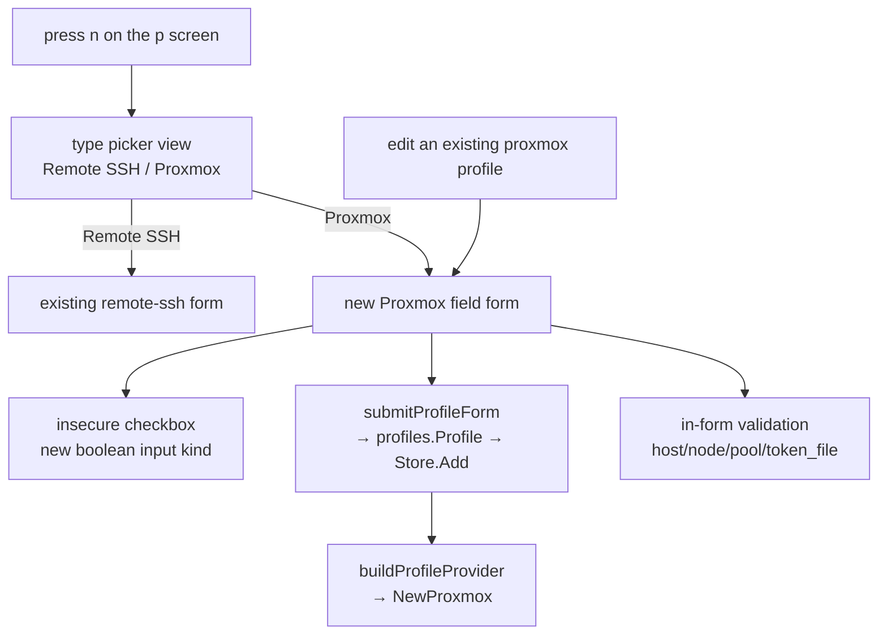
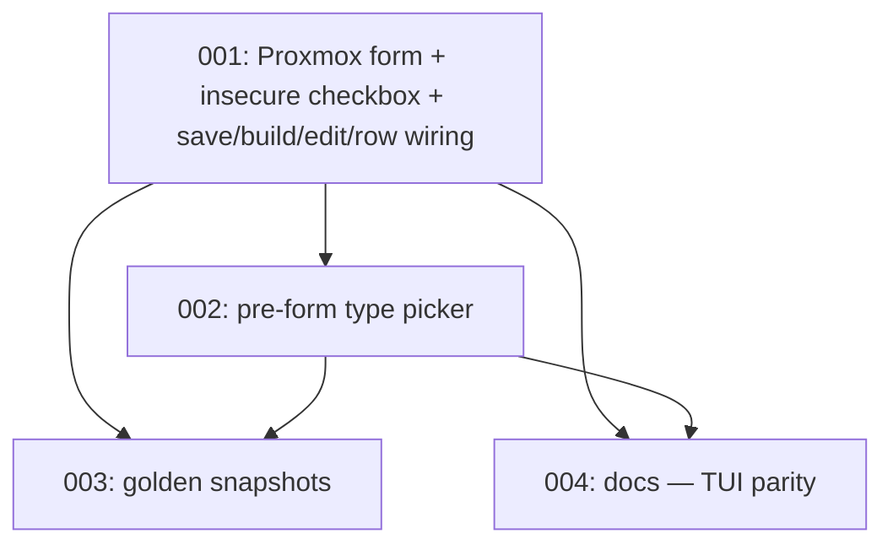

# Plan: Proxmox in the TUI Profile Form

## Original Work Order

> Add Proxmox support to the TUI profile-creation/edit form, bringing it to
> parity with the local and remote-ssh providers. Today the TUI's profile screen
> (press `p`, in internal/ui/profilesview.go) can only create and edit `local`
> and `remote-ssh` profiles — it branches solely on profiles.TypeRemoteSSH — so a
> `proxmox` profile can only be added by hand-editing profiles.yaml. Add a
> TypeProxmox branch to the form with fields for host, node, pool, storage,
> bridge, token_file (a PATH to the credential file, never the token value —
> reuse the same secret-free handling identity_path uses), insecure, and ca_file,
> with validation that mirrors profiles.validate (host/node/pool/token_file
> required). Include golden-snapshot tests for the new form layout. Once the TUI
> form supports proxmox, remove the docs caveat in docs/using-sand/proxmox.md
> Step 6 that says the TUI cannot create proxmox profiles, and update
> connection-profiles.md and AGENTS.md as needed.

## Plan Clarifications

| Question | Answer |
| --- | --- |
| How is the profile TYPE chosen at creation? Today `n` hardcodes remote-ssh; there is no picker. | A **pre-form type picker**: press `n` → a small list to choose "Remote SSH" or "Proxmox" → the field form for that type. Local is excluded (permanent, pre-seeded). It is the natural spot to add further backends later. |
| The form is all text inputs — how should the `insecure` boolean be handled? | A **real skip-cert-validation checkbox** (a new boolean input kind woven into the form's focus/render/update), not a typed "true/false" text field. |
| "There's a provider option in the TUI on main already." | Reconciled: that is the **VM-create form's profile *selector*** (`form.go`, choosing which existing profile to build a VM on) — type-agnostic, already works for a proxmox profile. It is **not** a profile-creation type picker; none exists. This plan adds the latter. |
| Backwards compatibility | **Free and required.** Purely additive: the local and remote-ssh create/edit flows are unchanged, and profile `Type` remains immutable in the store (edit never changes type). No on-disk or schema change. |

## Executive Summary

The Proxmox backend is already wired end to end — the provider, the
`internal/pve` client, the `profiles.TypeProxmox` type and its eight fields,
`profiles.validate`'s Proxmox rules, `LoadToken`, and the fleet/CLI selection
all landed in plan 18. The one place Proxmox is a second-class citizen is the
TUI's profile-management screen: pressing `p` then `n` always produces a
`remote-ssh` profile, so a Proxmox profile can only be created by hand-editing
`profiles.yaml`. This plan closes that last gap.

Two mechanics in the form are genuinely new and shape the work. First, there is
**no type picker** — creation hardcodes remote-ssh — so a small pre-form picker
is added ahead of the field form. Second, the form is built entirely from
`textinput.Model` values with no boolean or toggle widget anywhere, and the
Proxmox `insecure` field is a checkbox; so a boolean input kind must be woven
into the form's focus traversal, key handling, and rendering, which today all
assume a homogeneous slice of text inputs. Everything else is a
straightforward sibling of the existing remote-ssh branches: a Proxmox field
set, a save mapping onto the already-existing `Profile` fields, an edit-prefill,
a provider builder branch (`NewProxmox`), a list-row label, and — a real latent
bug this plan must fix — teaching `connectionFieldsEqual` about the Proxmox
fields it currently ignores.

The change is additive and low-risk: it touches one screen file plus its tests
and the docs, adds no dependency, and cannot alter the behaviour of the local or
remote-ssh flows.

## Context

### Current State vs Target State

| Current State | Target State | Why? |
| --- | --- | --- |
| `p` → `n` always creates a `remote-ssh` profile (`openProfileCreateForm` hardcodes `TypeRemoteSSH`) | `n` opens a type picker (Remote SSH / Proxmox); the chosen type drives the form | A proxmox profile is uncreatable in the TUI otherwise |
| The form is `[]textinput.Model` only — no boolean/toggle widget exists | A boolean checkbox input kind, used for `insecure`, woven into focus/render/update | `insecure` is a checkbox, not free text |
| `newProfileInputs` builds 1 field (Local) or 6 (RemoteSSH) | Also builds the Proxmox field set (name, host, node, pool, storage, bridge, token_file, insecure, ca_file) | The 8 Proxmox fields need inputs |
| `submitProfileForm`, `openProfileEditForm`, `buildProfileProvider`, `profileRowText`, `rebuildMember` branch only on `TypeRemoteSSH` | Each gains a `TypeProxmox` sibling | The form must save, edit, build, list, and connect a proxmox profile |
| `connectionFieldsEqual` compares only Host/User/Port/IdentityPath/LimaHome | Also compares Node/Pool/Storage/Bridge/TokenFile/Insecure/CAFile | Otherwise editing a proxmox profile's node/pool is misread as a pure rename and skips the rebuild — a real bug |
| Docs say the TUI cannot create proxmox profiles (proxmox.md Step 6 note) | That note is removed; connection-profiles.md and AGENTS.md reflect TUI parity | The caveat becomes false once this ships |
| No golden covers the profile *form* (only the list screen) | Goldens for the type picker and the Proxmox form; behavioural create/edit tests | Snapshot the new layout and pin the create/edit walk |

### Background

The TUI profile form lives entirely in `internal/ui/profilesview.go`. The field
indices are a local `iota` block (`pfName, pfHost, pfUser, pfPort,
pfIdentityPath, pfLimaHome`); labels are a parallel `profileFieldLabels` slice;
inputs are a `[]textinput.Model` built by `newProfileInputs(t profiles.Type)`.
The model carries `profileFormType`, `profileInputs`, `profileFormFocus`, and
`profileFormErr` (`internal/ui/model.go`). Focus traversal
(`profileFormFocusNext/Prev`), the key loop (`updateProfileForm`), and the
renderer (`profileFormView`) all iterate the text-input slice — which is exactly
why the `insecure` checkbox is the interesting part: it is a focusable element
that is not a `textinput.Model`.

The save path (`submitProfileForm`, a value receiver) builds a
`profiles.Profile{ID, Name, Type, Enabled}` and, for remote-ssh, maps the inputs
onto `Host/User/Port/IdentityPath/LimaHome` before calling `Store.Add`
(create) or `submitProfileEdit`→`Store.Update` (edit). The store is the
validation authority: `Store.Add/Update` call `profiles.validate`, which already
requires Host/Node/Pool/TokenFile for a proxmox profile and rejects a type
change on update. The form adds *in-form* checks for immediate feedback but
relies on the store for uniqueness and cross-field rules.

The downstream mapping the form must reproduce already exists twice and must be
kept in agreement with both: `internal/provider/fleet.go`'s `targetConfigFor`
and `cmd/sand/resolve.go`'s `targetConfigFor`/`providerForProfile` both convert a
proxmox `Profile` into a `TargetConfig{Provider: ProxmoxProviderID, Host, User,
Node, Pool, Storage, Bridge, TokenFile, Insecure, CAFile}` and call
`NewProxmox`. `buildProfileProvider` in the TUI is a third such site.

Golden tests use `teatest/v2` against `internal/ui/testdata/*.golden`,
regenerated with `go test ./internal/ui/ -run <name> -update`. Only
`TestTUIProfilesScreen.golden` covers this screen today; the create/edit form has
no golden yet.

## Architectural Approach

All production code is in `internal/ui/profilesview.go` (plus small model-state
additions in `internal/ui/model.go`); the rest is tests and docs.

### The Proxmox field form and the checkbox input kind
**Objective**: make the field form render, focus, edit, validate, and save a
proxmox profile — including the one non-text field.

A Proxmox field set (name, host, node, pool, storage, bridge, token_file,
insecure, ca_file) is added to `newProfileInputs`, with matching labels. Because
`insecure` is a checkbox rather than a text input, the form gains a minimal
boolean-field notion: a focusable element that renders as `[x] Insecure` /
`[ ] Insecure`, toggles on space/enter when focused, and participates in
focus traversal alongside the text inputs. The key loop, focus-next/prev, and
the view are taught to skip `.View()`/text-edit semantics for that one element.
`submitProfileForm` gains a `TypeProxmox` branch mapping the inputs onto the
Profile's Proxmox fields (token_file carried as a path, never a secret), with
in-form required-field checks (host/node/pool/token_file) mirroring
`profiles.validate`; `openProfileEditForm` prefills the same fields;
`buildProfileProvider` gains a `NewProxmox` branch; `profileRowText` gains a
"Proxmox" kind and a `host:node/pool` target; `rebuildMember`'s "connecting"
log treats proxmox as remote; and `connectionFieldsEqual` is extended to compare
the Proxmox fields (the latent edit bug).

### The pre-form type picker
**Objective**: let `n` choose the type before the field form opens.

Pressing `n` opens a small picker listing the creatable types (Remote SSH,
Proxmox — Local is permanent and excluded). Selecting one sets
`profileFormType` and opens the corresponding field form; `esc` backs out to the
list. This is a new lightweight view and a change to the single create entry
point (`openProfileCreateForm`), leaving the edit path (which inherits the
existing profile's type) untouched.

### Tests and documentation
**Objective**: pin the new layout and remove the now-false caveat.

Golden snapshots for the type picker and the Proxmox form (including the
checkbox in both states), plus behavioural tests: a create walk that picks
Proxmox, fills the fields, toggles the checkbox, and asserts the saved Profile;
an edit-prefill test; and a `connectionFieldsEqual` test that proves a
node/pool change is not mistaken for a rename. The docs caveat in
`proxmox.md` Step 6 is removed, and `connection-profiles.md` and `AGENTS.md`
are updated to say the TUI creates proxmox profiles.

## Risk Considerations and Mitigation Strategies

Technical Risks

- **The boolean checkbox is a new input kind in a text-only form.** The focus
  loop, key handler, and renderer all assume `[]textinput.Model`.
    - **Mitigation**: introduce the smallest possible boolean-field abstraction
      (or a single special-cased focus index) rather than reworking the form into
      a general widget system; keep the text-input path byte-for-byte unchanged.
- **Three copies of the proxmox `Profile`→`TargetConfig` mapping** (fleet.go,
  resolve.go, and now buildProfileProvider) can drift.
    - **Mitigation**: mirror the exact field mapping the other two already carry,
      and reference them in a comment as the existing pattern does for the
      remote-ssh mapping.

Implementation Risks

- **`connectionFieldsEqual` silently ignoring proxmox fields** would ship an
  edit that changes node/pool without rebuilding the member.
    - **Mitigation**: it is an explicit deliverable with its own test, not an
      afterthought.
- **Golden churn**: a layout tweak regenerates goldens and can hide a real
  regression in a large diff.
    - **Mitigation**: add goldens in the same change that creates the views, and
      review the generated files rather than blindly `-update`-ing.

## Success Criteria

### Primary Success Criteria

1. On the `p` screen, pressing `n` offers a type choice, and choosing **Proxmox**
   opens a form with all eight fields plus a working **insecure checkbox**;
   filling it and saving writes a valid `type: proxmox` profile to
   `profiles.yaml` with `token_file` as a path (no secret in the file).
2. Editing an existing proxmox profile prefills every field, and changing its
   node or pool rebuilds the member (is not treated as a rename).
3. Missing a required field (host/node/pool/token_file) shows an in-form error
   and does not save.
4. `go test ./internal/ui/... -race` passes, including new goldens for the picker
   and the Proxmox form and the create/edit behavioural tests.
5. The docs no longer claim the TUI cannot create proxmox profiles.

## Self Validation

After all tasks complete, execute and capture evidence:

1. **Build/vet/format**: `go build ./... && go vet ./... && gofmt -l internal/ui`
   — expect no output.
2. **Run the TUI create walk under test**:
   `go test ./internal/ui/ -race -run 'Proxmox' -v` — expect the picker→form→save
   tests to pass, including the checkbox toggle and the required-field error.
3. **Inspect a real save**: run the app (`go run ./cmd/sand`), press `p`, `n`,
   pick Proxmox, fill the fields, toggle insecure, save; then read
   `${XDG_CONFIG_HOME:-~/.config}/sandbar/profiles.yaml` and confirm a
   `type: proxmox` entry with `token_file` (a path) and `insecure: true`, and
   **no token value**. Capture the YAML.
4. **Golden review**: `go test ./internal/ui/ -run 'Proxmox' -update` then
   `git diff --stat internal/ui/testdata` — review the new/changed goldens by eye
   and confirm they show the picker and the 8-field form with the checkbox.
5. **Edit rebuild**: with a proxmox profile present, edit it, change the pool,
   save, and confirm the member rebuilds (a behavioural test asserting
   `connectionFieldsEqual` returns false for a pool change).
6. **Docs build**: `uvx --with-requirements docs/requirements.txt mkdocs build
   --strict` — succeeds, and the Step 6 caveat is gone.

## Documentation

- **Update** `docs/using-sand/proxmox.md`: remove the Step 6 admonition that the
  TUI cannot create proxmox profiles; describe the `p` → `n` → Proxmox flow as an
  alternative to hand-editing YAML.
- **Update** `docs/using-sand/connection-profiles.md`: the "Managing profiles →
  In the TUI" section now covers creating a proxmox profile (the type picker).
- **Update** `AGENTS.md`: the profile form is no longer remote-ssh-only; note the
  type picker and the boolean checkbox input kind so future agents know the form
  is not purely text inputs.

## Resource Requirements

### Development Skills

Go, Bubble Tea v2 / Bubbles (text inputs, focus, key handling, rendering),
`teatest/v2` golden snapshots, and technical writing.

### Technical Infrastructure

The existing repo toolchain; no new dependencies. `uvx` for the docs build (as
in plan 18).

## Integration Strategy

Purely additive within `internal/ui`. The local and remote-ssh create/edit flows
are unchanged; the store's immutable-`Type` rule means editing never converts a
profile between types; no on-disk schema changes. A `sand` build without a
proxmox profile behaves exactly as today.

## Notes

Deliberately **not** in scope: a TUI wizard for the *Proxmox-side* setup (pool /
role / token creation — that stays the CLI/`pveum` guide in the docs); editing
the token file's contents from the TUI (it remains a path to a file the operator
manages); and any change to the VM-create form's profile selector (already
type-agnostic and working).

## Execution Blueprint

**Validation Gates:**
- Reference: `/config/hooks/POST_PHASE.md`

### Dependency Diagram

No circular dependencies; every task appears in exactly one phase.

### ✅ Phase 1: The Proxmox Form
**Parallel Tasks:**
- ✔️ Task 001: Proxmox field form, insecure checkbox input kind, save/build/edit/row wiring, `connectionFieldsEqual` fix

### Phase 2: The Create Entry
**Parallel Tasks:**
- Task 002: Pre-form type picker (depends on: 001)

### Phase 3: Tests and Docs
**Parallel Tasks:**
- Task 003: Golden snapshots for the picker and the Proxmox form (depends on: 001, 002)
- Task 004: Docs — remove the "TUI can't create proxmox" caveat, update connection-profiles.md and AGENTS.md (depends on: 001, 002)

### Post-phase Actions

After each phase: `go build ./... && go vet ./... && gofmt -l internal/ui` clean,
and `go test ./internal/ui/... -race` green. Phase 3 additionally requires
`mkdocs build --strict`.

### Execution Summary
- Total Phases: 3
- Total Tasks: 4
