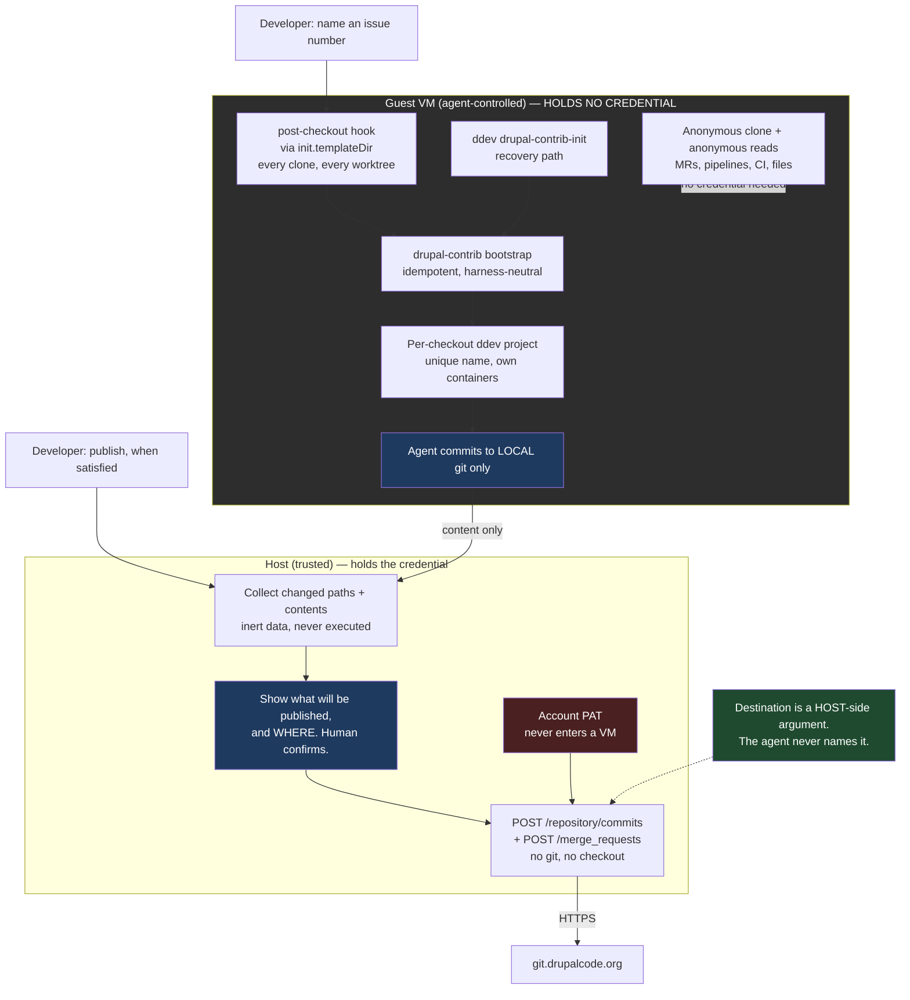

# Plan: Drupal.org Contribution and Development Workflow

## Original Work Order

> Improve our drupal.org contribution and development workflow.
>
> I'd like somehow for https://github.com/ddev/ddev-drupal-contrib to be
> automatically used. But I'm not sure where the best point is to do that. The
> biggest challenge is that the user could be cloning any drupal.org module, and
> that module likely knows nothing about sandbar, ai, skills, etc. The ddev
> environment should be set up so parallel instances with worktrees work well.
>
> There's another issue with gitlab authentication. drupal.org works with
> repository forks - each issue gets its own unique repository to work in. That's
> great on one hand - it means that gitlab api tokens are issue, and not project
> scoped. However, it also means that every new issue needs a new gitlab
> fine-grained token, and the UI for creating those is pretty rough. It also means
> if worktrees are used, each one of them needs its own token (instead of per
> module or project).
>
> Ideally nothing is specific to a harness like claude code, so users can work well
> with other tools as they choose.
>
> I'm open to ideas on improving this - the end goal is it needs to be SIMPLE for a
> Drupal developer to install sandbar, create a VM, and start contributing.

## Plan Clarifications

| Question | Answer |
| --- | --- |
| drupal.org's PAT docs say tokens are user-account scoped and push access to issue forks is granted per user, so one PAT could cover every fork. Is the per-issue token model a hard constraint or a chosen posture? | **Deliberate least-privilege.** One account-wide PAT would work technically, but an agent-controlled VM must not hold push access to the whole drupal.org account. Make narrow tokens cheap to create and place. |
| Where should creating and placing per-fork tokens happen? | **Host mints, guest receives** — conditional on confirming a GitLab API exists for it. User asked for that confirmation before committing. |
| (Confirmation requested) Does GitLab actually expose an API to create fine-grained tokens? | Confirmed: `POST /projects/:id/access_tokens`. Must be called with a *personal* access token, requires Maintainer/Owner, returns the token value, supports `access_level` below the caller's own. User then confirmed host-mints-guest-receives. |
| For ddev-drupal-contrib, where should the hook point live? | User challenged the proposal: *"how would an agent know to bootstrap the environment that way?"* Resolved by making bootstrap automatic at every sandbar-controlled entry point, with discovery as fallback. |
| Which automation and discovery surfaces should be built? | **Auto-bootstrap at clone time**, **auto-bootstrap new worktrees**, and **ddev global command + real errors**. `AGENTS.md` in the checkout was explicitly **excluded**. |
| What on-disk topology should a module and its issues use? | User challenged the proposal: *"Claude code for example will create its own worktrees in .claude. How would that work with this?"* Resolved by evidence (see Background): **do not mandate a topology**; work wherever a harness drops the worktree. |
| Is backwards compatibility required? | **Yes — additive, no BC break.** The existing directory-scoped `GH_TOKEN` wiring stays byte-identical; URL-keyed credentials are a parallel path used only for `git.drupalcode.org`. |

### Refinement session, 2026-08-26

| Question | Answer | Source |
| --- | --- | --- |
| How does sand learn *which* issue fork a checkout needs a token for, and what triggers minting? The original plan left this seam — between the ddev half and the credential half — entirely unspecified. | **Issue number, user-initiated.** The developer names an issue number against an existing drupal.org checkout; that one command derives the fork URL, mints, places the token, and creates the worktree for the issue branch. | User |
| (Challenge) *"How could use the drupalorg cli inside the VM, when the token minting needs to be on the user's workstation?"* | Valid contradiction in the original recommendation. Resolved by evidence: the host needs **neither** the `drupalorg` CLI nor an authenticated API call. See Background — fork URLs follow a documented convention, are anonymously readable, and the mint call accepts a URL-encoded project path. | User challenge, resolved by verification |
| Where does sand's own command place the worktree it creates, given the plan mandates no topology? | Sand's command uses a **default sibling path** under the issue namespace, overridable. "No mandated topology" is preserved because the `post-checkout` hook bootstraps a worktree created anywhere by any tool — the default binds only sand's own convenience command. | Assumption, with rationale |
| Where does the host-held account PAT live? The original plan said only "the same place sandbar already keeps host-side credentials" without confirming such a place exists. | It exists: `internal/profiles/token.go` establishes the pattern — config records only the *path* to a credential, and the loader refuses a file readable by group or other. The drupal.org PAT follows it. | Auto-resolved from codebase |
| Does the plan correctly distinguish GitLab's token scopes from access levels? | **No — the original plan conflated them.** They are independent axes deciding different things, and MR tooling depends on the scope axis. Corrected in Host-side token minting. | Auto-resolved; defect in prior revision |
| What happens to a drupal.org checkout and its worktrees across a `sand reset`? Unaddressed in the original plan. | A real gap. Reset stages only the clone's own org directory and restores it *after* finalize, while ddev's project registry lives in the guest's global state. Sibling worktrees under a different org directory are not staged at all. Recorded as a risk with an explicit requirement. | Auto-resolved from codebase; new requirement |
| Are minted tokens revoked when a worktree is removed? | **Superseded by refinement 3** — there are no minted tokens any more. Recorded because the reasoning (git provides no `worktree remove` hook) remains true and would resurface for any future per-worktree resource. | Superseded |

### Refinement session 2 — multiple projects per VM, 2026-08-26

| Question | Answer | Source |
| --- | --- | --- |
| *"How does this plan work if a user has a single VM for multiple drupal.org projects? Any complications?"* | Three real complications, one of them a defect in the prior revision. Folded in below. The credential half needs no change and is in fact vindicated by this case. | User |
| Does the clone-time trigger cover a second, third, or fourth module? | **No — this was a silent gap.** `CloneURL` is a single value per VM, so the Ansible path fires once. Resolved by installing the hook through git's template directory, which was verified to cover every clone in the VM through the same code path. | Auto-resolved by verification |
| Can the mint entry point identify the right module in a multi-module VM? | **No — defect in the prior revision**, which derived the module from the VM's create-time `CloneURL`. It must be read from the targeted checkout instead. Corrected. | Defect in prior revision |
| Does the multi-module case break the credential design? | No — it argues *for* it. All canonical drupal.org modules share one org directory, so a directory-scoped scheme would have given them a single shared token. | Auto-resolved from codebase |
| Was the reset risk stated correctly? | Partly. Because all canonical modules share one org directory, preserve-project stages every module clone, not just the first. The worktree half of the risk stands. Corrected in Background and in the risk entry. | Correction to prior revision |
| What actually limits how many projects can run at once? | Memory, not disk — 8 GiB against 100 GiB by default. Quantified in Background and in the risk entry. | Auto-resolved from shipped defaults |
| Must each task be verified before it is considered complete? | **Yes.** Every task runs `/code-review --fix` and then `/simplify` before it may be marked complete. Recorded as a per-task completion gate under Self Validation. | User |

### Refinement session 3 — the probe came back negative, 2026-08-27

| Question | Answer | Source |
| --- | --- | --- |
| Did the validation probe settle the two open drupal.org unknowns? | **Yes, both negative.** `access_level = 30` (Developer) on a real issue fork, below the Maintainer that creating a project access token requires; and `POST .../access_tokens` is blocked at drupal.org's edge for everyone. Per-issue-fork tokens are impossible. | Probe output |
| Could scripting the GitLab web UI work around the blocked endpoint? | **No.** The obstacle is the role, not the API: at Developer there is no access-tokens page to script. It would also require the developer's SSO session or password — a credential more dangerous than the one being avoided. | User proposal, resolved by verification |
| What is the actual requirement behind wanting narrow tokens? | *"Developers may have push access to highly used projects. An agent with a PAT could push to a project with bad code and affect 10s of thousands of sites."* Blast radius containment, not tidiness. This makes an account-wide PAT in a VM unacceptable rather than merely imperfect. | User |
| How should the credential half proceed given that? | **Host publishes; guest holds nothing.** No credential of any kind inside the VM. | User |
| *"Do we have to push with the git protocol? Do we have to have literal files on disk? What if as a part of land we then used the gitlab API to create a commit?"* | **Yes, and it is better than the git-based version.** Verified that drupal.org routes `POST /repository/commits`, `/repository/files`, `/repository/branches`, and `/merge_requests` to GitLab while blocking only the credential-minting endpoints. One call creates the branch and lands the change set. The host needs no git repository, no checkout, and no git objects — removing the architectural concession the git-based design required. | User idea, verified |
| Does the guest still need any drupal.org credential? | **No.** Anonymous requests returned 200 for merge requests, pipelines, branches, trees, commits, issues, and raw files. The entire read loop works unauthenticated, so the guest-side credential machinery of earlier revisions is removed, not merely bypassed. | Auto-resolved by verification |

## Executive Summary

A Drupal developer should be able to install `sand`, create a VM, point it at a
drupal.org module, and immediately have a working test environment and a safe way
to publish work on an issue — without learning anything about sandbar, without
hand-assembling a ddev project, and without a trip through GitLab's access-token
UI for every issue. Today none of that is true: the VM ships ddev, the
`drupalorg` CLI, and `glab`, but nothing connects them, and the module arrives as
bare source with no ddev project.

This plan closes that with two independent mechanisms sharing one design
principle: **the developer and the agent should not have to know anything.** The
ddev half is a single idempotent bootstrap, installed as a `post-checkout` hook
through git's template directory so it fires on every clone and every worktree
in the VM, whoever created them — and discoverable at point of need via a
self-listing ddev command and error messages that name it.

The publication half is shaped by a hard constraint the plan's own validation
probe established: **a Drupal developer often holds push access to modules
installed on tens of thousands of sites, and drupal.org offers no way to hold a
narrower credential.** Personal access tokens cannot be scoped to a project;
project access tokens require Maintainer, which an issue fork does not grant; and
drupal.org blocks the token-minting endpoints outright. Every attempt to give the
guest a *small* credential fails. So the guest is given **none**.

The guest clones anonymously, reads merge requests, pipelines and CI results
anonymously — all verified — and commits only to its own local git. Publication
happens on the host, through GitLab's content API rather than the git protocol:
one call creates the branch and lands the change set with correct authorship,
another opens the merge request. The host therefore needs no git repository, no
checkout and no git objects, which keeps agent-written code off the workstation
as `internal/landgh` intends. The security property is a split of authority
rather than the strength of a secret: **the agent decides content, the host
decides destination.** There is no credential in the VM to steal and no
destination field in the payload to poison, so a compromised agent cannot reach a
canonical project — it can only propose file contents for a target the human
already chose, in a form the human can read before it is sent.

## Context

### Current State vs Target State

| Current State | Target State | Why? |
| --- | --- | --- |
| `sand create --clone-url` of a drupal.org module leaves bare source with no ddev project | The clone arrives as a working, bootstrapped ddev-drupal-contrib project | The end goal is that creating a VM and contributing is one step, not a manual assembly job |
| A developer or agent must know the ddev-drupal-contrib incantation (`ddev config`, `add-on get`, `poser`, `symlink-project`) | Bootstrap runs automatically; nobody needs to know the sequence | The cloned module knows nothing about sandbar; knowledge cannot live in the repo |
| A new git worktree is an unconfigured directory | A new worktree is automatically its own ddev project with a unique name and URL | Parallel issue work is the stated goal, and per-worktree ddev projects are the only way to get true parallelism |
| `ddev config` in a fresh nested worktree silently rewrites the *parent* project's config | The worktree's own `.ddev/config.yaml` exists before any ddev command can run there | Verified destructive behavior; an agent can corrupt the main clone's setup by doing the obvious thing |
| Nothing tells an agent how to run tests in a contrib module | `ddev drupal-contrib-init` self-lists in `ddev help`; `ddev start` in an unbootstrapped module names it | Harness-neutral discovery, no Claude-Code-specific files |
| An agent that can push holds a credential reaching every project the developer can push to, including modules on tens of thousands of sites | No drupal.org credential exists inside the VM at all | Blast radius. drupal.org offers no narrower credential, so the only safe amount is none |
| Publishing requires the git protocol, a checkout, and credentials wherever the push happens | The host publishes over HTTPS through GitLab's content API — no git repository, no checkout, no git objects | Keeps agent-written code off the workstation, and removes the need for any guest credential |
| An agent could push anywhere its credential reaches | The agent decides content; the host decides destination | A structural boundary: no credential in the VM to steal, no destination field in the payload to poison |
| A push publishes first and shows a diff afterwards | The payload is a readable list of paths and resulting contents, reviewable before it is sent | Human review of agent work should happen before publication, not after |
| Starting work on an issue means: find the fork, add a remote, make a branch, configure ddev | Naming the issue number does all of it | This is the "SIMPLE for a Drupal developer" goal made concrete and testable |
| A `sand reset` would restore a drupal.org checkout with no registered ddev project, and would not stage sibling issue worktrees at all | Reset either restores drupal.org checkouts to a working state or refuses clearly and says what will be lost | Verified in the reset flow; silently returning a broken environment is worse than a clear refusal |
| Only the module named in `--clone-url` could ever be bootstrapped automatically | Every drupal.org clone in the VM bootstraps, whoever cloned it and however | One VM commonly holds several modules; a single create-time URL cannot cover them |
| A global hooks path would override every repository's own hooks | Hooks arrive via git's template directory, leaving existing and non-Drupal repositories alone | Drupal work shares the VM with unrelated repositories that have their own hooks |
| A task could be marked complete without a review or simplification pass | No task completes until `/code-review --fix` and then `/simplify` have run and their tests re-run | Correctness and quality gates belong at task boundaries, not as one sweep at the end |

### Background

The scope above was settled by investigation during planning rather than by
assumption. The findings below are load-bearing and several of them overturned
the design that seemed obvious at the start. Each is marked with how it was
established.

**Directory-scoped credentials cannot work for worktrees (verified
empirically).** Git resolves `includeIf "gitdir:…"` against `$GIT_DIR`. For a
linked worktree, `$GIT_DIR` is `<main-clone>/.git/worktrees/<name>` — not the
worktree's own directory. A test confirmed that an `includeIf` on the worktree's
path never fires, while an `includeIf` on the *main clone's* path fires from
inside the worktree. This has an unflagged consequence for sandbar's existing
GitHub support: every worktree of a repo silently inherits the main clone's
token today, and no per-worktree token is expressible through that mechanism.
That behavior is out of scope to change here (compatibility is additive) but is
recorded as a follow-up.

**URL-keyed credentials solve it, using machinery sandbar already has (verified
empirically).** `git-credential-store` files support one entry per URL
including a path component, and with `credential.useHttpPath` enabled git
resolves them per-repository. A test confirmed that distinct tokens for
`issue/foo-3123456`, `issue/bar-3999999`, and `project/foo` each resolve
correctly, that an unlisted fork yields no credential at all (fail-closed), and
that resolution is identical from inside a linked worktree. This reuses the
existing `git-credential-store` delivery path in `internal/provision/gitcred.go`
rather than introducing new plumbing.

**`useHttpPath` must be host-scoped or it breaks GitHub (verified
empirically).** Enabling `credential.useHttpPath` globally causes git to send a
path on every request, and sandbar's existing path-less `github.com` store entry
then stops matching — a real BC break. A test confirmed that scoping it to
`git.drupalcode.org` preserves the GitHub entry and gives per-fork resolution
simultaneously. This is a hard constraint on the implementation, not a
preference.

**ddev binds to the nearest ancestor project, destructively (verified
empirically with ddev v1.25.3).** Running `ddev config` inside a freshly created
nested worktree did not create a project there. ddev walked up, found the
parent's `.ddev/`, and reported *"You are reconfiguring the project at
…/mymodule. The existing configuration will be updated and replaced."* Since
Claude Code's `EnterWorktree` places worktrees at `<repo>/.claude/worktrees/…`
and other harnesses will each choose their own location, this is a live hazard:
the obvious action corrupts the main clone.

**A pre-existing child config wins (verified empirically).** With a
`.ddev/config.yaml` written into the nested worktree *first*, `ddev describe`
correctly bound to the child project at the nested path, and a subsequent `ddev
config` reconfigured the child rather than the parent. This is what makes nested
harness worktrees viable, and it is why writing the worktree's ddev config at
`git worktree add` time is a correctness requirement rather than a convenience.

**GitLab personal access tokens cannot be restricted to specific projects
(from GitLab documentation).** They are always account-wide. The narrow
credential for an issue fork is therefore a *project access token*, which
requires Maintainer or Owner on that project and is created through a Settings
→ Access tokens round-trip — precisely the rough UI described in the work order.

**The minting API exists and has a natural privilege ceiling (from GitLab API
documentation).** `POST /projects/:id/access_tokens` accepts `name`, `scopes[]`,
`expires_at`, and an optional `access_level`, and returns the token value in the
response. It must be called with a *personal* access token — "You cannot
authenticate with a project access token" — so a minted per-fork token can never
mint further tokens. The caller cannot exceed their own access level but may
mint below it. Default maximum lifetime is 365 days; rotation and revocation are
also API operations. Project access tokens require Premium on GitLab.com but are
available under any license on self-managed instances, and drupal.org is
self-managed, so the feature is not license-blocked there.

**Two drupal.org-specific unknowns remain, and are treated as risks rather than
assumptions.** First, whether clicking "Get push access" on an issue fork grants
Maintainer (required to mint) or only Developer. Second, whether
`POST /projects/:id/access_tokens` is among the API endpoints the Drupal
Association restricts by default; their documentation states new endpoints
require a request to the Infrastructure project. Additionally, drupal.org's PAT
policy permits any *individual action* a user could perform in a session but
bars using PATs to build "automation/bots" without prior DA approval — minting a
token for one's own use is arguably the former, but the boundary is not
explicitly drawn. These unknowns are why the plan builds placement first and
minting on top.

**Issue forks are derivable and anonymously readable (verified empirically).**
A `ls-remote` against `git.drupalcode.org/issue/drupal-3181657.git` succeeded
with no credential presented, returning the fork's branches including one named
for the issue. Three consequences follow, and together they resolve what looked
like an architectural contradiction — that the host must mint tokens while the
`drupalorg` CLI lives only in the guest. The fork URL is derivable from the
module name (which sand already holds from the clone URL) plus the issue number,
by drupal.org's documented `PROJECT-ISSUE_NUMBER` naming. Its existence and its
branch list can be confirmed anonymously, needing no token and no API access.
And the GitLab mint call accepts a URL-encoded project path, so it needs no
project-ID lookup either. The host therefore requires no PHP runtime, no Drupal
tooling, and exactly one authenticated API call — the mint itself.

This also rules out a guest-to-host minting broker, which would have been the
obvious alternative resolution. Such a broker would let a compromised guest
request a token for *any* fork, quietly restoring the account-wide push reach the
whole least-privilege design exists to prevent.

**A host-side credential pattern already exists (confirmed in the codebase).**
`internal/profiles/token.go` establishes it: `profiles.yaml` is secret-free and
records only where a credential lives, `LoadToken` is the single read site, and a
file readable by group or other is refused outright rather than warned about. The
drupal.org account PAT should follow this exact pattern rather than introducing a
new store. Note that `internal/secrets` is *not* the right home — it exists to
deliver secrets into guests, which is precisely what this credential must never
do.

**Reset does not currently accommodate this workflow (confirmed in the
codebase).** The reset flow re-clones during finalize and restores a preserved
project tree only *afterwards*, and it stages exactly one org directory derived
from the clone URL. Two consequences follow. ddev's project registry lives in the
guest's global state, not inside the checkout, so a preserved checkout returns
with its ddev configuration present but no registered project. And a sibling
issue worktree — living under the `issue/` org directory rather than the clone's
`project/` one — is never staged, so reset would destroy it while leaving the
main clone's worktree administrative files referencing paths that no longer
exist. Neither is acceptable silently.

**One VM can hold many drupal.org modules, and that changes three things
(verified empirically and in the codebase).** The plan was originally reasoned
around one module and many issues; several modules in one VM is a separate axis.

*The template directory closes the multi-module trigger gap.* A test confirmed
that `init.templateDir` installs hooks into every freshly created repository and
that `post-checkout` fires during `git clone` itself, with the new clone as the
working directory. The same test confirmed the null-SHA discriminator: git passes
an all-zero previous-HEAD for both clone and worktree-add, and a real SHA for an
ordinary branch switch. Without this, only the module named in `--clone-url` —
one value per VM — would ever be bootstrapped automatically.

*Multi-module is an argument for URL-keyed credentials, not merely compatible
with them.* Every canonical drupal.org module lives flat under
`git.drupalcode.org/project/<name>` — confirmed against a real contrib module —
so `OrgRelDir` returns the identical org directory, `git.drupalcode.org/project`,
for every module a developer clones. A directory-scoped credential scheme would
therefore have given every drupal.org module in the VM one shared token. Keying
by remote URL is what keeps them distinct.

*The same fact softens the reset risk for clones while leaving it intact for
worktrees.* Because all canonical modules share that one org directory, a
preserve-project reset stages every module clone together rather than only the
first — the earlier statement of this risk was accurate but misleading. Issue
worktrees under the `issue/` namespace remain a different org directory and are
still not staged.

**Memory, not disk, bounds parallelism (from the shipped defaults).** A VM
defaults to 8 GiB of memory and 100 GiB of disk. A running ddev project is a web
container plus a database container; a handful of concurrently *running* projects
is what 8 GiB supports, while 100 GiB comfortably holds many times that number of
*stopped* ones, since each project's cost on disk is its vendor tree, core, and
database volume. The practical shape of the workflow follows from this: many
projects may exist, few should run at once, and stopping a project rather than
destroying it is the normal move. Concurrent dependency resolution across several
bootstraps at once is the most likely way to exhaust memory.

**Per-issue-fork tokens are impossible on drupal.org (proven by probe, both
halves negative).** The probe answered both open questions, and neither answer is
recoverable by permissions or effort.

*The developer holds Developer, not Maintainer, on an issue fork.* A real probe
returned `access_level = 30`. GitLab requires Maintainer or Owner to create a
project access token **by any route, including the web UI**. So a per-fork token
cannot be minted, and cannot be created by hand either. Scripting the GitLab web
UI — considered explicitly — does not help: at Developer there is no
access-tokens settings page to drive, so the obstacle is the role, not the API.
Such a script would also need the developer's SSO session or password, a
credential strictly more dangerous than the token it was trying to avoid.

*drupal.org runs a per-path, per-method allowlist in front of the GitLab API, and
it blocks exactly the credential-minting endpoints.* This was mapped
unauthenticated, so it is a property of the platform rather than of one account:

| Endpoint | Result |
| --- | --- |
| `POST /repository/commits` | routed to GitLab |
| `POST /repository/files/:path`, `PUT` same | routed to GitLab |
| `POST /repository/branches` | routed to GitLab |
| `POST /merge_requests`, `POST /issues` | routed to GitLab |
| `GET /access_tokens` | routed to GitLab |
| `POST /access_tokens` | **blocked at the edge** |
| `POST /deploy_tokens` | **blocked at the edge** |
| `POST /deploy_keys` | **blocked at the edge** |

A blocked request never reaches GitLab at all: it returns a byte-identical 56 KB
HTML 404 from the drupal.org Drupal site, on every project tried, authenticated
or not. A routed request returns GitLab JSON. The policy this encodes is
coherent and worth stating plainly, because it shapes the entire design:
**drupal.org refuses to let anyone mint credentials through the API, while
permitting every content-write operation.** Contribution by API is the path the
platform deliberately leaves open.

**Everything an agent needs to read works with no credential (verified).**
Against a public fork, unauthenticated requests returned 200 for merge requests,
pipelines, branches, repository trees, commit lists, issues, and raw file
contents. Combined with anonymous `git clone`, this means a guest can do the
entire development loop — including reading CI results and merge-request feedback
— without ever authenticating. Only writes need a credential, and those are the
host's job.

**The GitLab content API can replace the git protocol entirely (from GitLab's
API documentation).** A single `POST /projects/:id/repository/commits` accepts a
target `branch`, a `start_branch` or `start_sha` to create it from, an `actions`
array of create/update/delete/move/chmod operations carrying file contents as
text or base64, and explicit `author_name`/`author_email`. So one call creates
the branch and lands a complete, correctly-attributed change set. Requests above
20 MB are rate limited and above 300 MB rejected — irrelevant for module patches.
This is what allows the host to publish without a git repository, a checkout, or
any git objects.

**What the VM already provides.** Every sand VM ships ddev, Docker, `mkcert`,
`glab`, and the `drupalorg` CLI — which already offers `issue:get-fork`,
`issue:setup-remote`, `issue:checkout`, and the `mr:*` family, and authenticates
to `git.drupalcode.org` through git credentials. `internal/checkouts` already
sweeps guests for git checkouts *and worktrees*. The pieces exist; this plan
connects them.

## Architectural Approach

The work divides into two mechanisms that share no code and can be built and
tested independently: an **environment path** that makes a drupal.org checkout a
working ddev project, and a **credential path** that gives that checkout push
access to exactly one issue fork. They meet only at the point where both are
triggered by the same event — a clone or a worktree appearing.

### Drupal.org project detection

**Objective**: Decide, from a URL alone, whether a checkout is a drupal.org
project that should be bootstrapped — without which every other component has no
trigger condition.

Detection keys on the git host `git.drupalcode.org` and the two path prefixes
drupal.org uses: `project/<name>` for canonical repositories and
`issue/<name>-<nid>` for issue forks. Both forms must be recognized, because a
developer may reasonably start from either — cloning the canonical project and
adding issue worktrees, or cloning an issue fork directly. Detection must also
tolerate the `.git` suffix, a trailing slash, and both HTTPS and SSH remote
forms, since the URL may arrive from `sand create --clone-url`, from an existing
remote, or from the `drupalorg` CLI.

Detection deliberately does *not* consult drupal.org's web API or the project
page. It is a pure function of the URL so that it can run identically on the
host (deciding whether to pass a flag to Ansible), inside the Ansible role, and
inside a git hook with no network access. A module-versus-theme distinction is
needed later for the ddev symlink target and is read from the checkout's
`.info.yml` `type:` key rather than from the URL, since the URL does not carry
it.

### The ddev-drupal-contrib bootstrap

**Objective**: One idempotent operation that turns any drupal.org checkout into
a working ddev project, so that every trigger surface shares a single
implementation and a single set of bugs.

The bootstrap performs the ddev-drupal-contrib setup sequence — configure the
project, install the add-on, resolve dependencies, and symlink the module into
the site — and is safe to run repeatedly on an already-bootstrapped checkout.
Idempotency is a hard requirement, not a nicety, because the `post-checkout`
trigger fires on ordinary branch checkouts as well as worktree creation, and
because agents retry.

Three behaviors distinguish it from running the upstream sequence by hand.
First, it **writes the ddev project configuration before invoking any ddev
command**, which is what prevents the verified parent-clobbering failure. Second,
it **derives a project name that is unique within the VM** rather than accepting
ddev's directory-basename default, since two different modules can easily have
worktrees with the same directory name and ddev rejects a duplicate name.
Third, it **keeps the checkout clean**: ddev-drupal-contrib writes a `.ddev`
directory into the repository, and for a drupal.org module that is untracked
cruft which must never reach a merge request. Exclusion is via the repository's
local exclude file, which lives in the shared git directory and therefore covers
every worktree, never appears in `git status`, and cannot be committed. Where a
module already tracks its own `.ddev` directory — an increasingly common
practice in contrib — the bootstrap must detect that and defer to the committed
configuration rather than overwrite it.

The bootstrap must degrade honestly. It depends on network access, Docker, and
upstream add-on availability, and when any of those fail it must fail loudly
with a message naming what to do, not leave a half-configured project that fails
mysteriously later.

### Trigger surfaces

**Objective**: Make the bootstrapped state the default state, so that neither a
developer nor an agent needs to know the bootstrap exists.

**One hook covers both clone time and worktree time.** The `post-checkout` hook
fires on `git clone` as well as on `git worktree add` — verified, with the new
clone's directory as the working directory in both cases. Installing it via
git's **template directory** therefore collapses what looked like two separate
trigger surfaces into one: with `init.templateDir` set in the guest's global git
configuration, *every* repository created in the VM receives the hook at creation
time, and the hook fires immediately on the initial checkout.

This matters most for the multi-project case. `CloneURL` is a single value, so
the Ansible clone-time path fires exactly once, for the module named at create
time; a developer working on several drupal.org modules in one VM clones the rest
by hand, and those would otherwise reach only the weakest discovery layer. The
template directory covers them all, through the same code path, regardless of
which tool did the cloning.

*Resolves the multi-project gap recorded in the second refinement.*

The hook must be cheap, and must no-op on the ordinary branch-checkout case that
fires it far more often. The discriminator is exact and was verified: git passes
the all-zero null SHA as the previous-HEAD argument for both a clone and a
worktree add, and a real commit SHA for an ordinary branch switch. Bootstrapping
only on the null SHA is therefore precise, not heuristic.

Installation must use the **template directory**, not a global `core.hooksPath`.
A template directory *copies* hooks into newly created repositories and leaves
existing repositories alone; a global hooks path *overrides* per-repository hooks
for every repository in the VM, including unrelated non-Drupal work sharing that
VM. The hook must also defer to a hooks path a repository or developer has
already set.

**Clone time (Ansible).** The `project` role still clones `--clone-url` into
`~/<host>/<org>/<repo>`, and with the template directory in place the hook fires
there too. The role's remaining responsibility is diagnostic rather than
triggering: because bootstrap is slow — it resolves Drupal core and its
dependencies — and provisioning failures are opaque, the role must surface
bootstrap failure as a distinct, recognizable outcome rather than failing the
whole provision run ambiguously.

**Point of need (ddev command and errors).** The bootstrap is also exposed as a
ddev **global custom command**, which self-lists in `ddev help` — a discovery
surface any agent that has decided to use ddev will encounter without being
told. It is reinforced by making a ddev start in an unbootstrapped drupal.org
checkout fail with a message that names the command. With the template directory
in place this is no longer the only path for hand-cloned repositories, but it
remains the recovery path for the cases the hook cannot reach: a repository
created before the template directory existed, one whose bootstrap failed, and
one in a checkout whose hooks path is owned by someone else.

No `AGENTS.md` or other file is written into the checkout; that was explicitly
excluded from scope.

### Per-checkout ddev project identity

**Objective**: Let many checkouts of many modules run simultaneously in one VM
without colliding, regardless of where a harness places them.

Each checkout — main clone or worktree, sibling or nested — is its own ddev
project with its own containers, database, and URL. The project name is derived
deterministically from the module and the checkout's identity so that it is
unique within the VM, stable across re-runs, and valid as a ddev project name
and hostname component. Because the resulting name determines the project's
`.ddev.site` URL, it should remain recognizable to a human reading a browser
address bar rather than being an opaque hash where that can be avoided.

The plan deliberately mandates **no topology**. Sibling worktrees and
harness-created nested worktrees must both work, because the work order requires
harness neutrality and because Claude Code, as one example, places worktrees
inside the repository. Nesting carries a known cost, recorded under risks: the
parent project's bind mount includes nested worktrees, so the parent site's
extension scanning may encounter a second copy of the same module.

### Host-side publication via the GitLab content API

**Objective**: Let an agent contribute to drupal.org without ever holding a
credential that could reach a high-traffic project.

*This section replaces the per-issue-fork token design of earlier revisions,
which the validation probe proved impossible. See Background for the evidence and
the Clarifications table for the decision.*

The requirement is blast radius, not tidiness. A Drupal developer may hold push
access to modules installed on tens of thousands of sites. A credential able to
reach those projects must never exist inside an agent-controlled VM, because a
single bad push is a supply-chain event affecting people who never opted into
anyone's AI experiment. Every earlier design in this plan tried to satisfy that
by making the guest's credential narrow. drupal.org makes narrow credentials
unobtainable. So the guest gets **no credential at all**.

**The guest never authenticates to drupal.org.** It clones anonymously, reads
merge requests, pipelines, branches, trees, commits, and file contents
anonymously — all verified to work with no credential presented — and commits
only to its own local git. Nothing it holds can publish anything.

**The host publishes, over HTTPS, with no git involved.** Publication uses
GitLab's content API rather than the git protocol: a single call creates the
branch and lands every file change in one commit, carrying the developer's
authorship, and a second opens the merge request. Both endpoints are verified
available on drupal.org. The host needs no git repository, no checkout, no
working tree, and no git objects — which preserves the no-code-on-host boundary
`internal/landgh` was built to protect, since nothing transits but inert data the
host forwards over HTTPS without ever writing it to a working tree or executing
it.

**The security property is the split of authority, not the strength of a
secret.** The agent decides *content*; the host decides *destination*. The target
project and branch are host-side arguments and never appear in anything the guest
produces, so a hostile agent cannot redirect its work to a canonical project — it
can only propose file contents for a destination the human already chose. That is
a structural boundary rather than a policy one: there is no credential in the VM
to steal, and no field in the payload to poison.

A useful side effect is reviewability. The payload is a plain list of paths and
their resulting contents, which a human can read before it is sent. That is a
considerably better review surface than a git push, which publishes first and
shows a diff afterwards.

Publication is deliberately a **human-initiated act**. This satisfies drupal.org's
policy that a token perform "any individual action a user could already perform
with a regular authenticated session", and keeps the workflow clear of the
automation-and-bots provision that requires prior Drupal Association approval.

### Consequences for the guest credential machinery

**Objective**: Record what this removes, so later work does not rebuild it.

Because the guest never authenticates to drupal.org, the credential mechanisms
earlier revisions specified are **not needed and must not be built**: no
recognized-forge entry for `git.drupalcode.org`, no per-fork entries in the
guest's credential store, and no `useHttpPath` configuration. The existing
GitHub `GH_TOKEN` wiring is untouched, exactly as the compatibility decision
requires — this plan now changes nothing about it at all.

The `includeIf`/worktree findings in Background remain accurate and are kept
because they are non-obvious and were expensively established: they explain why a
directory-scoped credential can never express per-worktree identity, and they
would resurface immediately if anyone later tries to give worktrees distinct
GitHub tokens. They simply no longer bear on drupal.org, which needs no guest
credential of any kind.

### The issue-number entry point

**Objective**: Give the whole workflow one user-facing action, and place the
host/guest boundary so that neither side needs the other's tooling.

*Resolves the seam left unspecified in the original revision — see the refinement
clarifications.*

The developer names an issue number against an existing drupal.org checkout.
Everything else follows from information sand already has. The module name is
read from **the checkout being targeted** — its origin remote, or the path the
developer names — and explicitly *not* from the VM's create-time `CloneURL`. That
distinction is load-bearing and was wrong in the previous revision: `CloneURL` is
a single value recorded once per VM, so in a VM holding several drupal.org
modules it identifies only the first, and deriving from it would mint against the
wrong fork. Combined with the issue number, the module name yields the fork URL
by drupal.org's documented `PROJECT-ISSUE_NUMBER` convention. The fork's existence
and its branch list are confirmed by an anonymous fetch — verified to need no
credential — which also identifies the issue branch to check out. The worktree
for that branch is then created, and the `post-checkout` hook bootstraps it into
a ddev project. No credential is placed in the guest, because the guest never
needs one.

Publication is the **second** user-facing action, and deliberately separate. When
the developer is satisfied with the work, one command on the host collects the
changed paths and their contents from the guest, shows what will be published and
where, and on confirmation creates the branch, the commit, and the merge request
through the content API. Keeping this distinct from the entry point is what makes
publication a conscious act rather than something an agent completes on its own.

The division of labor matters as much as the sequence. The host does the
derivation, the anonymous verification, and every authenticated call, because
that is where the credential lives and where it must stay. The guest does the
development work and reads everything it needs anonymously, keeping the
`drupalorg` CLI for merge-request status, pipeline logs, and diffs — all of which
were verified to work unauthenticated against a public fork. Neither side needs
the other's tooling: the host needs no PHP runtime, no Drupal knowledge, and no
git; the guest needs no credential.

Two alternatives are rejected deliberately. A guest-to-host broker that issues
credentials on the guest's request would let a compromised guest obtain one for
any project, restoring account-wide reach through the back door. And letting the
guest name its own publication target would hand the agent the one decision —
destination — that the whole design depends on the human keeping.

Where sand creates a worktree itself, it uses a default path under the issue
namespace, overridable by the developer. This does not reintroduce a mandated
topology: the default binds only sand's own convenience command, while the
`post-checkout` hook continues to bootstrap a worktree created anywhere, by any
tool. The default's interaction with reset is recorded under risks.

## Risk Considerations and Mitigation Strategies

Technical Risks

- **A worktree's first ddev command rewrites the parent project's config**:
  Verified with ddev v1.25.3 — ddev walks up to the nearest ancestor project and
  reconfigures it destructively. An agent doing the obvious thing corrupts the
  main clone.
    - **Mitigation**: The `post-checkout` hook writes the worktree's ddev
      configuration at creation time, before any ddev command can run there. A
      pre-existing child config was verified to win. This is treated as a
      correctness requirement with its own regression test, not as a convenience.
- **Nested worktrees are inside the parent's bind mount**: The parent ddev
  project mounts its whole approot, and ddev-drupal-contrib symlinks the module
  into the site, so the parent's extension scan may encounter a second copy of
  the same module. Drupal's extension discovery is believed to skip
  dot-directories — which would make `.claude/worktrees/` safe by luck — but this
  was **not verified** during planning, and a harness using a non-hidden worktree
  directory would not benefit from it regardless.
    - **Mitigation**: Verify the dot-directory behavior explicitly before relying
      on it. Independently, exclude worktree directories from the parent
      project's site scanning so correctness does not depend on a naming
      accident.
- **Memory exhaustion from parallel projects**: Each checkout is a full ddev
  project with its own containers and database, and each resolves its own copy of
  Drupal core. Against the shipped defaults of 8 GiB memory and 100 GiB disk,
  **memory is the binding constraint and disk is not** — a modest number of
  concurrently running projects saturates 8 GiB, while 100 GiB holds many times
  that number of stopped ones. Several modules each with several issue worktrees
  reaches the limit quickly. Running multiple dependency resolutions at once is
  the sharpest case.
    - **Mitigation**: Document the per-project memory cost and the sizing it
      implies, and state the operating rule plainly — many projects may exist,
      few should run at once. Prefer a shared package cache where ddev supports
      one. Make stopping a project (rather than destroying it) the obvious move,
      and avoid bootstrapping several modules concurrently.
- **`post-checkout` fires far more often than worktree creation**: The same hook
  runs on ordinary branch checkouts, where bootstrapping would be wasteful or
  actively disruptive.
    - **Mitigation**: The hook must detect the worktree-creation case and no-op
      cheaply otherwise, and must be idempotent so a spurious run is harmless.
- **Hook installation hijacks unrelated repositories**: A single VM commonly holds
  non-Drupal work alongside drupal.org modules. A global `core.hooksPath` would
  *override* per-repository hooks for every repository in the VM, silently
  disabling hooks that other projects depend on.
    - **Mitigation**: Install through git's template directory, which copies hooks
      into newly created repositories and leaves existing ones alone. Gate the
      hook on drupal.org detection so it no-ops immediately elsewhere, and gate it
      on the null previous-HEAD SHA so ordinary branch switches do nothing.
- **Hook installation collides with existing configuration**: A repository or
  developer may already set a hooks path.
    - **Mitigation**: Detect an existing hooks configuration and defer to it
      rather than overwriting, surfacing that the automatic worktree bootstrap is
      unavailable in that checkout.
- **Reset returns a broken or truncated environment**: Confirmed in the reset
  flow. A preserved checkout comes back with its ddev configuration but no
  registered ddev project, because that registry lives in the guest's global
  state rather than in the checkout. Reset also stages only the org directory
  derived from the clone URL, so a sibling issue worktree under the `issue/`
  namespace is not staged at all — reset destroys it while leaving the main
  clone's worktree administrative files pointing at paths that no longer exist.
  For *module clones* this is narrower than it first appears: every canonical
  drupal.org module shares the single org directory `git.drupalcode.org/project`,
  so staging that one directory captures all of them, not just the module named
  at create time. The worktree half of the problem is unaffected.
    - **Mitigation**: Treat reset as in scope for this work rather than
      discovering it later. Either stage every drupal.org checkout belonging to
      the VM and re-register its ddev project after restore, or detect the
      situation and refuse with a message naming exactly what would be lost. A
      silent broken restore is the one outcome that must not ship.
- **Remote and Proxmox profiles cannot reach ddev URLs directly**: Lima forwards
  guest ports to the *remote host's* loopback, not the developer's browser, and
  Linux hosts additionally cannot bind privileged ports unprivileged. Several
  parallel ddev projects compound both.
    - **Mitigation**: Document the constraint and point at the existing
      `ddev share --provider=cloudflared` path already covered in the web-servers
      documentation. Do not build port-forwarding machinery; sand deliberately
      manages no tunnels.

External Dependency and Policy Risks

- **The account PAT on the host is powerful, and the host publishes on its
  behalf**: Blast radius is removed from the *guest*, not from the system. The
  host still holds an account-wide credential and uses it to publish
  agent-authored content. A host-side bug that got the destination wrong would
  push agent output somewhere it should not go, and the credential's reach is
  exactly what makes that consequential.
    - **Mitigation**: The destination must be an explicit host-side argument that
      no guest-produced data can influence, and it must be shown to the human and
      confirmed before any write. Refuse to publish to anything outside the
      `issue/` namespace unless the developer overrides deliberately, so the
      dangerous case — writing to a canonical project — requires an extra,
      conscious act. Cover destination selection with tests that feed hostile
      guest payloads and assert the target is unchanged.
- **drupal.org's policy bars automation without approval**: PATs may perform any
  individual action a user could perform in a session, but may not build
  automation or bots without prior Drupal Association approval. A tool that
  publishes agent-written commits sits close to that line, and a separate DA
  policy governs AI-assisted contribution specifically.
    - **Mitigation**: Keep publication a human-initiated, human-confirmed action —
      which is also why it is a separate step from the issue entry point rather
      than folded into it. Document the policy in the user-facing guide, follow
      whatever disclosure the DA's AI policy requires for AI-assisted merge
      requests, and raise the design with the DA before promoting it widely.
- **The content API is not the git protocol, and differs in observable ways**:
  One call produces one commit, so a multi-commit branch needs several sequential
  calls; commits created this way are not GPG-signed by the developer; and
  `last_commit_id` is the only concurrency guard if the fork moved underneath.
  Requests above 20 MB are rate limited.
    - **Mitigation**: Decide deliberately whether a change set publishes as one
      commit or several, and say so in the documentation rather than surprising
      contributors. Send `last_commit_id` on update actions and treat a conflict
      as a normal outcome to re-derive from, not an error. Detect an oversized
      payload before sending and explain it.
- **The endpoint allowlist is drupal.org's to change**: The content endpoints
  this design depends on are permitted today because drupal.org allows them, not
  because they are guaranteed. The same edge that blocks the token endpoints
  could block others.
    - **Mitigation**: Treat a blocked-endpoint response — an HTML body where JSON
      was expected — as a distinct, recognizable failure that names what happened,
      rather than a generic API error. Re-run the endpoint map as a validation
      step so a change is caught deliberately.
- **Upstream ddev-drupal-contrib changes its setup sequence**: The bootstrap
  encodes a sequence owned by another project.
    - **Mitigation**: Keep the sequence in one place so a change is a
      single-location edit, and cover the bootstrap with a test that would fail
      loudly rather than silently producing a broken project.

Implementation Risks

- **Two credential mechanisms coexisting invites confusion**: Directory-scoped
  for GitHub, URL-keyed for drupal.org, in the same store.
    - **Mitigation**: Document the split and the reason at the point of
      definition. Record convergence — and the pre-existing GitHub
      worktree-inherits-main-clone-token behavior this investigation uncovered —
      as an explicit follow-up rather than leaving two mechanisms unexplained.
- **A published change is public and permanent**: Unlike a token, which can be
  revoked, a commit pushed to a shared issue fork is immediately visible to the
  Drupal community and cannot be quietly withdrawn. The failure mode of this
  design is therefore reputational and social rather than credential-theft.
    - **Mitigation**: The pre-publication confirmation is the control, so it must
      show what will change and where in a form a human can actually read, not a
      summary count. Publishing must never be the default or automatic outcome of
      any command.
- **Bootstrap failures inside provisioning are opaque**: A long, network-dependent
  step buried in an Ansible run produces poor diagnostics.
    - **Mitigation**: Surface bootstrap failure as a distinct outcome that names
      the failing stage and the command to re-run by hand.
- **Scope creep toward a general Drupal feature set**: The adjacent temptations —
  site-install workflows, MR creation, patch management — are numerous.
    - **Mitigation**: The deliverable is exactly the two mechanisms scoped here.
      The `drupalorg` CLI already covers issue and MR operations and should be
      used rather than reimplemented.

## Success Criteria

### Primary Success Criteria

1. `sand create` with a drupal.org module clone URL yields a VM in which that
   module is a running ddev project with a reachable URL, with no manual steps
   and no knowledge of ddev-drupal-contrib required.
2. `git worktree add` in a bootstrapped drupal.org checkout — at any path,
   including a harness-created nested path — produces an independent ddev project
   with a unique name and URL, and never modifies the parent project's
   configuration.
3. Two issue worktrees of the same module run simultaneously in one VM, each
   serving its own site, without name, port, or database collision.
4. A push from an issue worktree authenticates with a token scoped to that issue
   fork alone; a push from that worktree to a *different* fork or to the
   canonical project fails to authenticate.
5. Credential resolution for a given fork URL is identical from the main clone
   and from any worktree, at any path.
6. Existing GitHub behavior is unchanged: a VM created with a `GH_TOKEN` and a
   GitHub clone URL authenticates exactly as it does today, with no migration and
   no change to stored secrets.
7. The account-level drupal.org PAT is never present anywhere in a guest VM —
   not in the environment, the credential store, a `.env`, or a config file.
8. Every automated behavior is reachable by a human or any agent through
   documented, harness-neutral commands; nothing depends on a Claude-Code-specific
   file or convention.
9. Naming an issue number against a drupal.org checkout produces, in one step, a
   worktree on the issue branch, a bootstrapped ddev project, and push access
   scoped to that issue's fork.
10. The host requires no PHP runtime and no Drupal tooling, and makes exactly one
    authenticated GitLab call per mint; fork resolution and verification use no
    credential at all.
11. Running the bootstrap twice on the same checkout changes nothing and reports
    success — idempotency is asserted by test, since two of the three trigger
    surfaces can fire repeatedly.
12. A `sand reset` of a VM holding a drupal.org checkout and its worktrees either
    restores them to a working state, or refuses and names precisely what would be
    lost. It never returns a silently broken environment.
13. No drupal.org credential is present anywhere in a guest VM, in any form.
14. A second drupal.org module, cloned by hand inside the VM with a plain
    `git clone` and no sand involvement, becomes a working ddev project — and the
    first module is unaffected.
15. In a VM holding several modules, publishing targets the fork of the module
    actually being worked on, never the VM's create-time clone URL.
16. A non-Drupal repository in the same VM keeps its own hooks and never triggers
    a bootstrap, and an ordinary branch switch in any repository triggers nothing.
17. Every task in the blueprint passes the per-task completion gate —
    `/code-review --fix`, then `/simplify`, then tests re-run — before being
    marked complete.

## Self Validation

### Per-Task Completion Gate

This gate applies to **every task** generated from this plan, and is a
precondition for marking any task complete — not a final sweep at the end.

Before a task may be considered done, and after its own tests pass:

1. Run `/code-review --fix` against the task's changes, and apply or consciously
   reject every finding. This pass hunts correctness defects.
2. Then run `/simplify`, and apply or consciously reject its findings. This pass
   is quality only — reuse, simplification, efficiency — and deliberately does
   not look for bugs, which is why it runs second rather than instead.
3. Re-run the task's tests afterwards. Both commands modify the working tree, so
   a green result from before they ran is not evidence the task is still correct.

A task whose gate has not been run is not complete, regardless of whether its
functional work appears finished.

One point of possible confusion is worth pre-empting, because a future reader may
otherwise try to "fix" it: these are Claude Code commands, and this plan elsewhere
requires strict harness neutrality. There is no contradiction. Harness neutrality
is a constraint on **what sandbar ships to Drupal developers** — the workflow must
not depend on any particular assistant. It is not a constraint on the tooling used
to *build* sandbar. An implementer working in a different harness should run that
harness's closest equivalent review and simplification passes; the requirement is
the two passes and their order, not these two command names.

### Post-Implementation Validation

These steps inspect the real system and must be executed after implementation.
Several require a live VM; the drupal.org probes require a real account and a
real issue fork.

1. **Probe the drupal.org unknowns first.** Using a real drupal.org account with
   push access to a real issue fork, query the GitLab API for the caller's access
   level on that fork project, and attempt a token-creation call against it.
   Record whether the access level permits minting and whether the endpoint is
   permitted. Both came back negative in the probe already run — this step exists
   so a future change in drupal.org's posture is noticed deliberately rather than
   assumed.
2. **Verify the guest holds no drupal.org credential and needs none.** In a
   provisioned VM, complete a full development loop against a real issue: clone,
   bootstrap, edit, run tests, read the merge request and pipeline status. Then
   search the guest exhaustively — environment, credential store, per-directory
   `.env` files, git config, shell history — and confirm zero drupal.org
   credentials of any kind. The loop working *and* the search coming back empty
   are both required; either alone proves nothing.
3. **Verify fork resolution needs no credential.** With no credential available,
   resolve a real issue number plus module name to a fork URL by convention and
   list its branches. Confirm success and confirm the issue branch appears. This
   is the check that keeps the host free of Drupal tooling.
4. **Verify publication end to end.** From a real issue worktree with real
   changes, publish. Confirm a branch is created on the correct issue fork, that
   it contains exactly the intended file changes with correct authorship, and
   that a merge request is opened against the right target. Verify from a clean
   anonymous clone, not from the machine that published.
5. **Verify publication requires human confirmation.** Confirm the publish path
   cannot complete without an explicit confirmation, that declining publishes
   nothing at all, and that no code path publishes as a side effect of any other
   command.
6. **Verify no git artefacts reach the host.** During and after a publish, confirm
   the workstation created no git repository, no checkout, and no working tree for
   the guest's code, and that nothing from the guest was executed on the host.
7. **Verify end-to-end create.** Run `sand create` against a real drupal.org
   module URL. Confirm the checkout is a ddev project, that it starts, and fetch
   its project URL over HTTP from inside the guest, confirming a Drupal response
   rather than an error page.
8. **Verify the one-step issue entry point.** Against that checkout, name a real
   issue number and confirm all three outcomes in one action: a worktree exists on
   the issue branch, it is a running ddev project reachable over HTTP, and a push
   to that issue's fork authenticates. This is the plan's headline claim and must
   be demonstrated, not argued.
9. **Verify worktree bootstrap and non-clobbering.** Record the main clone's ddev
   configuration, add a worktree at a nested path, and confirm: a new independent
   ddev project exists at the worktree; its name differs from the parent's; the
   parent's configuration is byte-identical to what was recorded. Then run a ddev
   command inside the worktree and re-check the parent's configuration is still
   unchanged — this is the regression test for the verified clobbering hazard.
10. **Verify idempotency.** Run the bootstrap a second time on an already
    bootstrapped checkout and on a worktree. Confirm both report success, leave
    the ddev configuration byte-identical, and leave `git status --porcelain`
    unchanged.
11. **Verify parallelism.** With two issue worktrees of one module started
    simultaneously, fetch both project URLs and confirm two distinct running sites.
12. **Verify the guest cannot publish, by trying.** From inside a VM, attempt a
    direct `git push` to the issue fork, to a different issue fork, and to the
    canonical project. All three must fail for want of any credential. Then
    attempt the same through the `drupalorg` CLI and `glab`. This is the check
    that the blast-radius claim is structural rather than merely intended.
13. **Verify the split of authority under adversarial input.** Confirm that
    nothing the guest produces — file paths, contents, branch names, commit
    message — can alter which project or branch the host writes to, and that the
    host refuses a destination outside the `issue/` namespace without a
    deliberate override.
14. **Verify reset behavior explicitly.** Reset a VM holding a bootstrapped
    checkout plus at least one issue worktree. Confirm the outcome is either a
    working restored environment — checkout present, ddev project registered and
    startable, worktree intact — or a refusal that names what would be lost.
    Confirm it is never a silent partial restore, and specifically that the main
    clone is never left with worktree administrative files pointing at absent
    paths.
15. **Verify the destination cannot be influenced by the guest.** Plant a hostile
    payload in the guest — file paths and contents containing another project's
    path, absolute paths, `..` traversal, and shell metacharacters — then publish.
    Confirm the change lands on the intended fork and branch only, that no request
    is made against any other project, and that traversal-style paths are refused
    rather than normalised into somewhere unintended.
16. **Verify discovery surfaces.** Confirm the bootstrap command appears in `ddev
    help` output in a fresh VM, and that a ddev start in an unbootstrapped
    drupal.org checkout produces an error naming it.
17. **Verify checkout cleanliness.** In a bootstrapped module checkout and in a
    worktree, confirm `git status --porcelain` reports nothing attributable to
    the bootstrap.
18. **Verify the second module bootstraps with no sand involvement.** In a VM
    created against module A, clone an unrelated drupal.org module B by hand
    inside the guest, using plain `git clone` and nothing else. Confirm B becomes
    a running ddev project with a distinct name and URL, and that A is untouched.
    This is the multi-project claim, and it must be demonstrated with the same
    command a developer would type.
19. **Verify publication targets the right module.** With both A and B present,
    work an issue on B and publish. Confirm the change lands on B's fork — not
    A's, and not the VM's create-time clone URL. Confirm no credential was
    required inside the VM for any part of the loop.
20. **Verify the hook does not hijack unrelated repositories.** In the same VM,
    clone a non-Drupal repository and confirm the bootstrap does not run, that
    the repository's own hooks still execute, and that an ordinary branch switch
    in any repository triggers no bootstrap.
21. **Verify reset across multiple modules.** Reset a VM holding modules A and B
    plus at least one issue worktree. Confirm both module clones survive or are
    named as lost, per step 14's standard, and that the outcome is never silently
    partial.
22. **Re-run the endpoint map.** Re-probe drupal.org's allowlist and confirm the
    content endpoints this design depends on still route to GitLab and that the
    credential endpoints are still blocked. A change here is a platform change,
    and must be noticed deliberately rather than discovered as a bug.
23. **Verify a blocked endpoint is reported honestly.** Point the publisher at an
    endpoint known to be blocked and confirm it reports that drupal.org refused
    the request — recognising an HTML body where JSON was expected — rather than
    surfacing a generic API error or a misleading 404.
24. **Run the existing suite.** `go test ./... -race` must pass, and coverage must
    not fall below the committed floor enforced in CI.

## Documentation

Yes — this plan requires documentation updates, both human- and agent-facing.

- **A new user-facing guide for the Drupal.org workflow** under `docs/using-sand/`,
  covering the end-to-end path from `sand create` to a pushed issue-fork branch,
  the worktree model for parallel issues, and the token model. This is the
  document that carries the work order's "SIMPLE for a Drupal developer" goal and
  should be written for someone who knows Drupal and not sandbar.
- **`docs/using-sand/secrets.md`** — state plainly that drupal.org work needs no
  guest secret at all, and why: the credential lives on the workstation and the
  VM never authenticates to drupal.org. This is a notable exception to the page's
  whole premise and should not be left implicit.
- **`docs/reference/security-model.md`** — document the agent-decides-content /
  host-decides-destination split, why no drupal.org credential enters a VM, and
  the blast-radius reasoning behind it: a contributor may hold push access to
  modules on tens of thousands of sites, so the only safe credential in an
  agent-controlled VM is none. Also state the limit honestly — the host still
  holds a powerful credential and publishes agent-authored content with it.
- **`docs/using-sand/web-servers.md`** — extend the existing ddev guidance for
  multiple simultaneous projects and the Linux privileged-port interaction.
- **`docs/getting-started/available-tools.md`** — note that drupal.org checkouts
  are bootstrapped automatically and name the command.
- **`docs/reference/files-and-state.md`** — document the host-side account PAT
  file, its required mode, and that it is deliberately not part of the guest
  secrets store.
- **Reset documentation** — whichever of the reset sections applies, updated to
  state what happens to drupal.org checkouts and issue worktrees across a reset.
  The existing documentation already warns that a reset re-clones before secrets
  land; this workflow adds cases that warning does not currently cover.
- **`AGENTS.md`** — yes, this needs updating: it is the repository's own
  agent-facing documentation and must describe the new credential mechanism, the
  the reason no drupal.org credential belongs in a guest, and the worktree/ddev clobbering hazard
  so future work does not reintroduce it.
- **Follow-up record** — the pre-existing behavior that GitHub worktrees inherit
  the main clone's token, uncovered during this investigation and deliberately
  left unchanged for compatibility, should be filed rather than lost.

## Resource Requirements

### Development Skills

Go, for the host-side credential and minting work. Ansible, for the provisioning
role and the hook installation. Shell, for the bootstrap and the git hook. Working
knowledge of git's credential subsystem and configuration-matching rules — this
plan turns on details that are easy to get subtly wrong. Familiarity with ddev's
project model and approot discovery. Enough Drupal contribution experience to
judge whether the resulting workflow is actually what a contributor needs.

### Technical Infrastructure

A host with Lima and KVM for the real-VM end-to-end suite. Docker and ddev inside
the guest, both already provisioned. Network access to drupal.org's GitLab, to
ddev's add-on distribution, and to Packagist for dependency resolution.

### External Dependencies

A real drupal.org account with push access to at least one real issue fork, and
an account-level PAT with API scope held on the workstation — the publication
path needs both, and the end-to-end validation cannot be done without them. The
Drupal Association should be consulted about the automation and AI policies
before this is promoted widely; endpoint availability has now been established by
probe and needs re-checking rather than discovering.

## Integration Strategy

Both mechanisms attach to existing seams rather than introducing new
architecture. The credential work extends the recognized-forge table in
`internal/provision/gitcred.go` — whose own documentation anticipates a GitLab
entry — and reuses the existing `git-credential-store` delivery path and its
reconciliation behavior. The bootstrap attaches to the `project` Ansible role's
existing clone step. Hook installation joins the guest git configuration that
role already manages. The ddev global command lands in the guest's ddev
configuration, which the `dev-tools` role already provisions.

The host-side account PAT follows the credential pattern
`internal/profiles/token.go` already establishes — a path recorded in
configuration, one loader, and a hard refusal of over-permissive file modes —
rather than introducing a new store or extending the guest-facing secrets store.

Publication is a sibling of `internal/landgh` and should be built as one: a
host-side adapter that runs only on the workstation, takes a small structured
input, and shells out or calls out with an argument vector rather than a shell
string. `landgh`'s injection-safety invariant applies with more force here, since
the payload is agent-authored by construction. The difference is that `landgh`
calls `gh` for metadata about a branch already pushed by the guest, whereas this
adapter carries the content itself — so the destination must come from host-side
arguments alone, and never from anything the guest produced.

Note that `internal/provision/gitcred.go` is now **untouched** by this plan. The
`recognizedForgeTokens` table keeps its single GitHub entry.

The reset path in `internal/provision` **is** touched, which the previous
revision of this plan did not acknowledge. Reset's staging is currently derived
from the clone URL's single org directory, and this workflow legitimately
produces checkouts outside it. That is a change to existing behavior, but not a
compatibility break: reset's behavior for a VM holding no drupal.org checkout is
unchanged.

Nothing in this plan changes the Lima, Proxmox, or remote-SSH provider layers, the
TUI's board model, or the create form's existing fields. `internal/checkouts`
already discovers worktrees during its sweep and may later surface per-checkout
ddev or token state, but that is not required here and is deliberately left out.

## Notes

The work order's framing — "gitlab api tokens are issue, and not project scoped"
— turned out to be true in effect but not in mechanism. GitLab personal access
tokens cannot be project-restricted at all; what makes per-issue scoping possible
is that each issue fork is a separate *project*, so a project access token is
naturally issue-scoped. That distinction is why the plan reaches for project
access tokens and a host-held personal token rather than trying to narrow a
personal token, and it is worth carrying into the documentation because it is a
genuinely counterintuitive corner of GitLab.

The single most valuable finding of this investigation is that credentials must
be keyed by remote URL rather than by directory. It was not part of the original
framing, it invalidates the obvious design, and it is invisible until someone
tests `includeIf` inside a linked worktree. It also means the worktree question
and the token question — which read as two separate problems in the work order —
have one shared answer.

Finally, the design deliberately spends its effort on making knowledge
unnecessary rather than on conveying knowledge. Documentation and discovery
surfaces are the fallback layer, not the mechanism. That ordering is what the
"SIMPLE for a Drupal developer" goal actually demands, and it is also what makes
the result harness-neutral: a workflow that requires no instructions is
automatically portable to any tool.

### Known unresolved gaps

Carried deliberately rather than papered over. Downstream task generation should
treat these as known, not as oversights.

- **The Drupal Association has not been consulted.** The design publishes
  agent-authored commits through a permitted API as a human-confirmed action,
  which reads as within policy, but the DA's automation and AI policies were
  written without this shape in mind. Their view should be sought before this is
  promoted widely, and it may impose disclosure requirements on merge requests.
- **Whether Drupal's extension discovery skips dot-directories is assumed, not
  verified.** If it does not, nested worktrees pollute the parent site's extension
  scan. The plan requires explicit exclusion rather than relying on this.

### Change Log

- **2026-08-27 (refinement 3 — the probe came back negative, and the design
  improved because of it)**: The validation probe answered both open drupal.org
  questions negatively and unrecoverably: the developer holds Developer (not
  Maintainer) on a real issue fork, so a project access token cannot be created
  by any route including the web UI; and `POST .../access_tokens` is blocked at
  drupal.org's edge for everyone, on every project, authenticated or not.
  Scripting the GitLab UI was considered and rejected — the obstacle is the role,
  not the API, so there is no page to script, and it would require an SSO session
  more dangerous than the token it avoided.

  Restating the requirement as blast radius rather than tidiness changed the
  answer. Since drupal.org offers no narrow credential, the guest is given none.
  Publication moved to the host and, on the user's suggestion, to GitLab's
  **content API** rather than the git protocol — verified available, while only
  the credential-minting endpoints are blocked. One call creates the branch and
  lands the change set with correct authorship. The host therefore needs no git
  repository, no checkout and no git objects, which removes the architectural
  concession the git-based version required and preserves `internal/landgh`'s
  no-code-on-host boundary.

  Verified that the guest needs no credential whatsoever: anonymous requests
  return 200 for merge requests, pipelines, branches, trees, commits, issues and
  raw files, so the whole read loop works unauthenticated. Consequently the
  guest-side credential machinery of earlier revisions is **removed, not
  bypassed** — no forge-token entry, no per-fork store entries, no `useHttpPath`.
  This plan now changes nothing at all about the existing GitHub wiring, which
  over-satisfies the compatibility decision. The `includeIf`/worktree findings are
  kept in Background because they are non-obvious, expensively established, and
  would resurface for any future per-worktree GitHub credential.

  Reframed the security property as a split of authority rather than the strength
  of a secret — the agent decides content, the host decides destination — and
  added risks and validation for the parts that now carry the weight: destination
  integrity against hostile guest payloads, honest reporting of a blocked
  endpoint, content-API semantics that differ from git, and the fact that a
  published change, unlike a token, cannot be revoked. Replaced the token
  lifecycle risks and criteria, which are moot.

- **2026-08-26 (refinement 2 — multiple projects per VM)**: Consolidated the
  clone-time and worktree-time triggers into a single `post-checkout` hook
  installed through git's template directory, after verifying that the hook fires
  on `git clone` and that the null previous-HEAD SHA cleanly distinguishes
  clone/worktree-add from an ordinary branch switch. This closes a silent gap in
  which only the module named in `--clone-url` — one value per VM — was ever
  bootstrapped automatically. Corrected a defect that derived the module for
  minting from the VM's create-time `CloneURL`, which identifies only the first
  module in a multi-module VM; it now comes from the targeted checkout. Corrected
  the reset risk, which overstated the loss for module clones (all canonical
  drupal.org modules share one org directory, so staging it captures all of them)
  while leaving the worktree half intact. Quantified the resource risk as
  memory-bound rather than disk-bound against the shipped 8 GiB / 100 GiB
  defaults. Added a risk for a global hooks path hijacking unrelated repositories.
  Recorded why multi-module argues *for* URL-keyed credentials. Added a per-task
  completion gate requiring `/code-review --fix` then `/simplify` before any task
  may be marked complete, with a note distinguishing product harness-neutrality
  from build-process tooling. Added 4 success criteria and 4 validation steps.

- **2026-08-26 (creation)**: Initial plan, following an investigation that
  established the four verified findings in Background.
- **2026-08-26 (refinement)**: Specified the previously-missing seam between the
  ddev and credential halves as a user-initiated issue-number entry point, and
  added it as an architectural component and to the diagram. Resolved the
  host/guest contradiction it exposed — the host needs neither the `drupalorg`
  CLI nor an authenticated call to resolve a fork — by verifying that fork URLs
  are convention-derivable and anonymously readable; recorded why a guest-to-host
  minting broker is rejected. Corrected a genuine defect in the prior revision
  that conflated GitLab's `scopes` and `access_level` axes. Grounded the
  host-side PAT in the existing `internal/profiles/token.go` pattern rather than
  an unnamed store. Added the previously-unrecorded reset interaction as a risk,
  a requirement, and a validation step, and brought reset into the integration
  scope. Added risks for remote-profile ddev reachability and unknown token
  scopes. Added five success criteria and six validation steps, fixed the
  validation list's numbering and a stale cross-reference, and recorded the
  unresolved gaps above.
