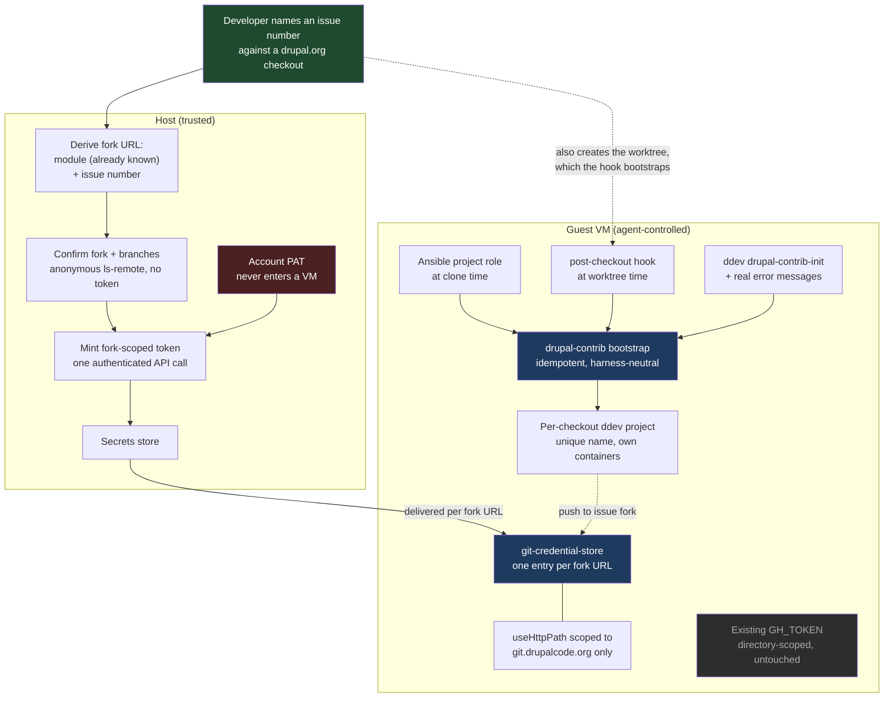

# Plan: Drupal.org Contribution and Development Workflow

## Original Work Order

> Improve our drupal.org contribution and development workflow.
>
> I'd like somehow for https://github.com/ddev/ddev-drupal-contrib to be
> automatically used. But I'm not sure where the best point is to do that. The
> biggest challenge is that the user could be cloning any drupal.org module, and
> that module likely knows nothing about sandbar, ai, skills, etc. The ddev
> environment should be set up so parallel instances with worktrees work well.
>
> There's another issue with gitlab authentication. drupal.org works with
> repository forks - each issue gets its own unique repository to work in. That's
> great on one hand - it means that gitlab api tokens are issue, and not project
> scoped. However, it also means that every new issue needs a new gitlab
> fine-grained token, and the UI for creating those is pretty rough. It also means
> if worktrees are used, each one of them needs its own token (instead of per
> module or project).
>
> Ideally nothing is specific to a harness like claude code, so users can work well
> with other tools as they choose.
>
> I'm open to ideas on improving this - the end goal is it needs to be SIMPLE for a
> Drupal developer to install sandbar, create a VM, and start contributing.

## Plan Clarifications

| Question | Answer |
| --- | --- |
| drupal.org's PAT docs say tokens are user-account scoped and push access to issue forks is granted per user, so one PAT could cover every fork. Is the per-issue token model a hard constraint or a chosen posture? | **Deliberate least-privilege.** One account-wide PAT would work technically, but an agent-controlled VM must not hold push access to the whole drupal.org account. Make narrow tokens cheap to create and place. |
| Where should creating and placing per-fork tokens happen? | **Host mints, guest receives** — conditional on confirming a GitLab API exists for it. User asked for that confirmation before committing. |
| (Confirmation requested) Does GitLab actually expose an API to create fine-grained tokens? | Confirmed: `POST /projects/:id/access_tokens`. Must be called with a *personal* access token, requires Maintainer/Owner, returns the token value, supports `access_level` below the caller's own. User then confirmed host-mints-guest-receives. |
| For ddev-drupal-contrib, where should the hook point live? | User challenged the proposal: *"how would an agent know to bootstrap the environment that way?"* Resolved by making bootstrap automatic at every sandbar-controlled entry point, with discovery as fallback. |
| Which automation and discovery surfaces should be built? | **Auto-bootstrap at clone time**, **auto-bootstrap new worktrees**, and **ddev global command + real errors**. `AGENTS.md` in the checkout was explicitly **excluded**. |
| What on-disk topology should a module and its issues use? | User challenged the proposal: *"Claude code for example will create its own worktrees in .claude. How would that work with this?"* Resolved by evidence (see Background): **do not mandate a topology**; work wherever a harness drops the worktree. |
| Is backwards compatibility required? | **Yes — additive, no BC break.** The existing directory-scoped `GH_TOKEN` wiring stays byte-identical; URL-keyed credentials are a parallel path used only for `git.drupalcode.org`. |

### Refinement session, 2026-08-26

| Question | Answer | Source |
| --- | --- | --- |
| How does sand learn *which* issue fork a checkout needs a token for, and what triggers minting? The original plan left this seam — between the ddev half and the credential half — entirely unspecified. | **Issue number, user-initiated.** The developer names an issue number against an existing drupal.org checkout; that one command derives the fork URL, mints, places the token, and creates the worktree for the issue branch. | User |
| (Challenge) *"How could use the drupalorg cli inside the VM, when the token minting needs to be on the user's workstation?"* | Valid contradiction in the original recommendation. Resolved by evidence: the host needs **neither** the `drupalorg` CLI nor an authenticated API call. See Background — fork URLs follow a documented convention, are anonymously readable, and the mint call accepts a URL-encoded project path. | User challenge, resolved by verification |
| Where does sand's own command place the worktree it creates, given the plan mandates no topology? | Sand's command uses a **default sibling path** under the issue namespace, overridable. "No mandated topology" is preserved because the `post-checkout` hook bootstraps a worktree created anywhere by any tool — the default binds only sand's own convenience command. | Assumption, with rationale |
| Where does the host-held account PAT live? The original plan said only "the same place sandbar already keeps host-side credentials" without confirming such a place exists. | It exists: `internal/profiles/token.go` establishes the pattern — config records only the *path* to a credential, and the loader refuses a file readable by group or other. The drupal.org PAT follows it. | Auto-resolved from codebase |
| Does the plan correctly distinguish GitLab's token scopes from access levels? | **No — the original plan conflated them.** They are independent axes deciding different things, and MR tooling depends on the scope axis. Corrected in Host-side token minting. | Auto-resolved; defect in prior revision |
| What happens to a drupal.org checkout and its worktrees across a `sand reset`? Unaddressed in the original plan. | A real gap. Reset stages only the clone's own org directory and restores it *after* finalize, while ddev's project registry lives in the guest's global state. Sibling worktrees under a different org directory are not staged at all. Recorded as a risk with an explicit requirement. | Auto-resolved from codebase; new requirement |
| Are minted tokens revoked when a worktree is removed? | Not resolvable without a `git worktree remove` hook, which git does not provide. Recorded as **unresolved** with mitigation: bounded expiry at mint time, plus an explicit listing/revocation surface so outstanding tokens are visible and killable. | Unresolved, mitigated |

## Executive Summary

A Drupal developer should be able to install `sand`, create a VM, point it at a
drupal.org module, and immediately have a working test environment and push
access to the issue fork they are working on — without learning anything about
sandbar, without hand-assembling a ddev project, and without a trip through
GitLab's access-token UI for every issue. Today none of that is true: the VM
ships ddev, the `drupalorg` CLI, and `glab`, but nothing connects them. The
module is cloned as bare source with no ddev project, and sandbar's credential
layer recognizes exactly one forge (`GH_TOKEN` → github.com), so
`git.drupalcode.org` has no authentication path at all.

This plan closes both gaps with two independent mechanisms that share a single
design principle: **the developer and the agent should not have to know
anything.** The ddev half is one idempotent bootstrap script, invoked
automatically at every entry point sandbar controls — the Ansible project role
at clone time, and a provisioned `post-checkout` git hook at worktree-creation
time — and discoverable at point of need everywhere else, via a self-listing
ddev global command and error messages that name it. The credential half
delivers per-issue-fork GitLab project access tokens into the guest keyed by
**remote URL** rather than by directory, with the powerful account-level PAT
held on the host and never exposed to an agent-controlled VM.

The two halves meet at a single user-facing action: naming an issue number
against a drupal.org checkout. From the module name sand already holds and the
issue number the developer supplies, the host derives the fork URL by drupal.org's
documented convention, confirms it anonymously, mints a token scoped to that fork
alone, places it in the guest, and creates the worktree for the issue branch. The
host needs no PHP, no Drupal tooling, and exactly one authenticated API call; the
`drupalorg` CLI stays in the guest for the merge-request work it is actually good
at. Everything else in the design is automatic or discoverable, which is what
makes the workflow portable to any tool the developer prefers.

The URL-keying is the load-bearing discovery of this plan's investigation, and
it is what makes worktrees work. Directory-scoped credentials cannot express
per-worktree identity at all — git resolves `includeIf gitdir:` against
`$GIT_DIR`, which for a linked worktree lives inside the *main* clone. URL-keyed
credentials sidestep the problem entirely: they resolve identically from the
main clone, from a sibling worktree, and from a harness-created nested worktree,
because they key on the thing that actually identifies an issue fork. That, plus
writing each worktree's ddev config eagerly at creation time, is what lets
parallel issue work run in one VM regardless of where a given tool decides to
put its worktrees.

## Context

### Current State vs Target State

| Current State | Target State | Why? |
| --- | --- | --- |
| `sand create --clone-url` of a drupal.org module leaves bare source with no ddev project | The clone arrives as a working, bootstrapped ddev-drupal-contrib project | The end goal is that creating a VM and contributing is one step, not a manual assembly job |
| A developer or agent must know the ddev-drupal-contrib incantation (`ddev config`, `add-on get`, `poser`, `symlink-project`) | Bootstrap runs automatically; nobody needs to know the sequence | The cloned module knows nothing about sandbar; knowledge cannot live in the repo |
| A new git worktree is an unconfigured directory | A new worktree is automatically its own ddev project with a unique name and URL | Parallel issue work is the stated goal, and per-worktree ddev projects are the only way to get true parallelism |
| `ddev config` in a fresh nested worktree silently rewrites the *parent* project's config | The worktree's own `.ddev/config.yaml` exists before any ddev command can run there | Verified destructive behavior; an agent can corrupt the main clone's setup by doing the obvious thing |
| `recognizedForgeTokens` knows only `GH_TOKEN` → github.com | It also recognizes a drupal.org GitLab credential for `git.drupalcode.org` | There is currently no authentication path to any drupal.org repository |
| Credentials are keyed by directory (`includeIf gitdir:~/<scope>/`) | drupal.org credentials are additionally keyed by remote URL | Verified: directory keying cannot express per-worktree identity, because a linked worktree's `$GIT_DIR` is inside the main clone |
| Every worktree silently inherits the main clone's token | An issue fork's token is scoped to that fork's URL, and unknown forks get no credential at all | Least privilege: a runaway agent in one issue's worktree must not be able to push to another issue, or to the canonical project |
| A per-issue token requires a manual GitLab Settings → Access tokens round-trip | `sand` mints the per-fork token from a host-held account PAT | The stated pain; the UI round-trip per issue is the main friction in the current workflow |
| The account-level PAT would have to live wherever pushes happen | The account PAT stays on the host and never enters a VM | An agent-controlled VM holding account-wide push access defeats the purpose of narrow tokens |
| Nothing tells an agent how to run tests in a contrib module | `ddev drupal-contrib-init` self-lists in `ddev help`; `ddev start` in an unbootstrapped module names it | Harness-neutral discovery, no Claude-Code-specific files |
| Starting work on an issue means: find the fork, add a remote, make a branch, make a token, place it, configure ddev | Naming the issue number does all of it | This is the "SIMPLE for a Drupal developer" goal made concrete and testable |
| A `sand reset` would restore a drupal.org checkout with no registered ddev project, and would not stage sibling issue worktrees at all | Reset either restores drupal.org checkouts to a working state or refuses clearly and says what will be lost | Verified in the reset flow; silently returning a broken environment is worse than a clear refusal |
| Outstanding minted tokens are invisible | The developer can list and revoke every token sand has minted | Every minted token is a live credential on the developer's real account |

### Background

The scope above was settled by investigation during planning rather than by
assumption. The findings below are load-bearing and several of them overturned
the design that seemed obvious at the start. Each is marked with how it was
established.

**Directory-scoped credentials cannot work for worktrees (verified
empirically).** Git resolves `includeIf "gitdir:…"` against `$GIT_DIR`. For a
linked worktree, `$GIT_DIR` is `<main-clone>/.git/worktrees/<name>` — not the
worktree's own directory. A test confirmed that an `includeIf` on the worktree's
path never fires, while an `includeIf` on the *main clone's* path fires from
inside the worktree. This has an unflagged consequence for sandbar's existing
GitHub support: every worktree of a repo silently inherits the main clone's
token today, and no per-worktree token is expressible through that mechanism.
That behavior is out of scope to change here (compatibility is additive) but is
recorded as a follow-up.

**URL-keyed credentials solve it, using machinery sandbar already has (verified
empirically).** `git-credential-store` files support one entry per URL
including a path component, and with `credential.useHttpPath` enabled git
resolves them per-repository. A test confirmed that distinct tokens for
`issue/foo-3123456`, `issue/bar-3999999`, and `project/foo` each resolve
correctly, that an unlisted fork yields no credential at all (fail-closed), and
that resolution is identical from inside a linked worktree. This reuses the
existing `git-credential-store` delivery path in `internal/provision/gitcred.go`
rather than introducing new plumbing.

**`useHttpPath` must be host-scoped or it breaks GitHub (verified
empirically).** Enabling `credential.useHttpPath` globally causes git to send a
path on every request, and sandbar's existing path-less `github.com` store entry
then stops matching — a real BC break. A test confirmed that scoping it to
`git.drupalcode.org` preserves the GitHub entry and gives per-fork resolution
simultaneously. This is a hard constraint on the implementation, not a
preference.

**ddev binds to the nearest ancestor project, destructively (verified
empirically with ddev v1.25.3).** Running `ddev config` inside a freshly created
nested worktree did not create a project there. ddev walked up, found the
parent's `.ddev/`, and reported *"You are reconfiguring the project at
…/mymodule. The existing configuration will be updated and replaced."* Since
Claude Code's `EnterWorktree` places worktrees at `<repo>/.claude/worktrees/…`
and other harnesses will each choose their own location, this is a live hazard:
the obvious action corrupts the main clone.

**A pre-existing child config wins (verified empirically).** With a
`.ddev/config.yaml` written into the nested worktree *first*, `ddev describe`
correctly bound to the child project at the nested path, and a subsequent `ddev
config` reconfigured the child rather than the parent. This is what makes nested
harness worktrees viable, and it is why writing the worktree's ddev config at
`git worktree add` time is a correctness requirement rather than a convenience.

**GitLab personal access tokens cannot be restricted to specific projects
(from GitLab documentation).** They are always account-wide. The narrow
credential for an issue fork is therefore a *project access token*, which
requires Maintainer or Owner on that project and is created through a Settings
→ Access tokens round-trip — precisely the rough UI described in the work order.

**The minting API exists and has a natural privilege ceiling (from GitLab API
documentation).** `POST /projects/:id/access_tokens` accepts `name`, `scopes[]`,
`expires_at`, and an optional `access_level`, and returns the token value in the
response. It must be called with a *personal* access token — "You cannot
authenticate with a project access token" — so a minted per-fork token can never
mint further tokens. The caller cannot exceed their own access level but may
mint below it. Default maximum lifetime is 365 days; rotation and revocation are
also API operations. Project access tokens require Premium on GitLab.com but are
available under any license on self-managed instances, and drupal.org is
self-managed, so the feature is not license-blocked there.

**Two drupal.org-specific unknowns remain, and are treated as risks rather than
assumptions.** First, whether clicking "Get push access" on an issue fork grants
Maintainer (required to mint) or only Developer. Second, whether
`POST /projects/:id/access_tokens` is among the API endpoints the Drupal
Association restricts by default; their documentation states new endpoints
require a request to the Infrastructure project. Additionally, drupal.org's PAT
policy permits any *individual action* a user could perform in a session but
bars using PATs to build "automation/bots" without prior DA approval — minting a
token for one's own use is arguably the former, but the boundary is not
explicitly drawn. These unknowns are why the plan builds placement first and
minting on top.

**Issue forks are derivable and anonymously readable (verified empirically).**
A `ls-remote` against `git.drupalcode.org/issue/drupal-3181657.git` succeeded
with no credential presented, returning the fork's branches including one named
for the issue. Three consequences follow, and together they resolve what looked
like an architectural contradiction — that the host must mint tokens while the
`drupalorg` CLI lives only in the guest. The fork URL is derivable from the
module name (which sand already holds from the clone URL) plus the issue number,
by drupal.org's documented `PROJECT-ISSUE_NUMBER` naming. Its existence and its
branch list can be confirmed anonymously, needing no token and no API access.
And the GitLab mint call accepts a URL-encoded project path, so it needs no
project-ID lookup either. The host therefore requires no PHP runtime, no Drupal
tooling, and exactly one authenticated API call — the mint itself.

This also rules out a guest-to-host minting broker, which would have been the
obvious alternative resolution. Such a broker would let a compromised guest
request a token for *any* fork, quietly restoring the account-wide push reach the
whole least-privilege design exists to prevent.

**A host-side credential pattern already exists (confirmed in the codebase).**
`internal/profiles/token.go` establishes it: `profiles.yaml` is secret-free and
records only where a credential lives, `LoadToken` is the single read site, and a
file readable by group or other is refused outright rather than warned about. The
drupal.org account PAT should follow this exact pattern rather than introducing a
new store. Note that `internal/secrets` is *not* the right home — it exists to
deliver secrets into guests, which is precisely what this credential must never
do.

**Reset does not currently accommodate this workflow (confirmed in the
codebase).** The reset flow re-clones during finalize and restores a preserved
project tree only *afterwards*, and it stages exactly one org directory derived
from the clone URL. Two consequences follow. ddev's project registry lives in the
guest's global state, not inside the checkout, so a preserved checkout returns
with its ddev configuration present but no registered project. And a sibling
issue worktree — living under the `issue/` org directory rather than the clone's
`project/` one — is never staged, so reset would destroy it while leaving the
main clone's worktree administrative files referencing paths that no longer
exist. Neither is acceptable silently.

**What the VM already provides.** Every sand VM ships ddev, Docker, `mkcert`,
`glab`, and the `drupalorg` CLI — which already offers `issue:get-fork`,
`issue:setup-remote`, `issue:checkout`, and the `mr:*` family, and authenticates
to `git.drupalcode.org` through git credentials. `internal/checkouts` already
sweeps guests for git checkouts *and worktrees*. The pieces exist; this plan
connects them.

## Architectural Approach

The work divides into two mechanisms that share no code and can be built and
tested independently: an **environment path** that makes a drupal.org checkout a
working ddev project, and a **credential path** that gives that checkout push
access to exactly one issue fork. They meet only at the point where both are
triggered by the same event — a clone or a worktree appearing.

### Drupal.org project detection

**Objective**: Decide, from a URL alone, whether a checkout is a drupal.org
project that should be bootstrapped — without which every other component has no
trigger condition.

Detection keys on the git host `git.drupalcode.org` and the two path prefixes
drupal.org uses: `project/<name>` for canonical repositories and
`issue/<name>-<nid>` for issue forks. Both forms must be recognized, because a
developer may reasonably start from either — cloning the canonical project and
adding issue worktrees, or cloning an issue fork directly. Detection must also
tolerate the `.git` suffix, a trailing slash, and both HTTPS and SSH remote
forms, since the URL may arrive from `sand create --clone-url`, from an existing
remote, or from the `drupalorg` CLI.

Detection deliberately does *not* consult drupal.org's web API or the project
page. It is a pure function of the URL so that it can run identically on the
host (deciding whether to pass a flag to Ansible), inside the Ansible role, and
inside a git hook with no network access. A module-versus-theme distinction is
needed later for the ddev symlink target and is read from the checkout's
`.info.yml` `type:` key rather than from the URL, since the URL does not carry
it.

### The ddev-drupal-contrib bootstrap

**Objective**: One idempotent operation that turns any drupal.org checkout into
a working ddev project, so that every trigger surface shares a single
implementation and a single set of bugs.

The bootstrap performs the ddev-drupal-contrib setup sequence — configure the
project, install the add-on, resolve dependencies, and symlink the module into
the site — and is safe to run repeatedly on an already-bootstrapped checkout.
Idempotency is a hard requirement, not a nicety, because the `post-checkout`
trigger fires on ordinary branch checkouts as well as worktree creation, and
because agents retry.

Three behaviors distinguish it from running the upstream sequence by hand.
First, it **writes the ddev project configuration before invoking any ddev
command**, which is what prevents the verified parent-clobbering failure. Second,
it **derives a project name that is unique within the VM** rather than accepting
ddev's directory-basename default, since two different modules can easily have
worktrees with the same directory name and ddev rejects a duplicate name.
Third, it **keeps the checkout clean**: ddev-drupal-contrib writes a `.ddev`
directory into the repository, and for a drupal.org module that is untracked
cruft which must never reach a merge request. Exclusion is via the repository's
local exclude file, which lives in the shared git directory and therefore covers
every worktree, never appears in `git status`, and cannot be committed. Where a
module already tracks its own `.ddev` directory — an increasingly common
practice in contrib — the bootstrap must detect that and defer to the committed
configuration rather than overwrite it.

The bootstrap must degrade honestly. It depends on network access, Docker, and
upstream add-on availability, and when any of those fail it must fail loudly
with a message naming what to do, not leave a half-configured project that fails
mysteriously later.

### Trigger surfaces

**Objective**: Make the bootstrapped state the default state, so that neither a
developer nor an agent needs to know the bootstrap exists.

**Clone time (Ansible).** The `project` role already clones `--clone-url` into
`~/<host>/<org>/<repo>`. When detection matches, the role invokes the bootstrap
after the clone. This is the path that makes "install sand, create a VM, start
contributing" true for the first module. Because bootstrap is slow — it resolves
Drupal core and its dependencies — and provisioning failures are opaque, the
role must surface bootstrap failure as a distinct, recognizable outcome rather
than failing the whole provision run ambiguously.

**Worktree time (git hook).** A provisioned `post-checkout` hook bootstraps a
newly created worktree. `git worktree add` fires `post-checkout`, so a plain
`git worktree add` — whatever tool runs it, wherever it places the result —
produces a configured ddev project with no new command to learn. This is the
surface that makes the work order's "parallel instances with worktrees" true,
and it is also the correctness mechanism from the previous section: it closes
the window in which an agent's first `ddev config` would rewrite the parent. The
hook must be cheap and must no-op quickly on the ordinary branch-checkout case,
which fires the same hook far more often. Hook installation is a guest-level git
configuration concern and must not overwrite a hooks path the repository or the
user has already set.

**Point of need (ddev command and errors).** The bootstrap is also exposed as a
ddev **global custom command**, which self-lists in `ddev help` — a discovery
surface any agent that has decided to use ddev will encounter without being
told. It is reinforced by making a ddev start in an unbootstrapped drupal.org
checkout fail with a message that names the command. This covers repositories
cloned by hand inside the VM, which no sandbar-controlled trigger sees.

No `AGENTS.md` or other file is written into the checkout; that was explicitly
excluded from scope.

### Per-checkout ddev project identity

**Objective**: Let many checkouts of many modules run simultaneously in one VM
without colliding, regardless of where a harness places them.

Each checkout — main clone or worktree, sibling or nested — is its own ddev
project with its own containers, database, and URL. The project name is derived
deterministically from the module and the checkout's identity so that it is
unique within the VM, stable across re-runs, and valid as a ddev project name
and hostname component. Because the resulting name determines the project's
`.ddev.site` URL, it should remain recognizable to a human reading a browser
address bar rather than being an opaque hash where that can be avoided.

The plan deliberately mandates **no topology**. Sibling worktrees and
harness-created nested worktrees must both work, because the work order requires
harness neutrality and because Claude Code, as one example, places worktrees
inside the repository. Nesting carries a known cost, recorded under risks: the
parent project's bind mount includes nested worktrees, so the parent site's
extension scanning may encounter a second copy of the same module.

### URL-keyed credential delivery

**Objective**: Give a checkout push access to exactly one issue fork, in a way
that survives worktrees and grants nothing else.

A new recognized forge entry covers `git.drupalcode.org`, alongside the existing
GitHub entry. Its delivery differs in one respect: rather than being wired by
directory scope, drupal.org credentials are written as per-URL entries in the
guest's credential store, one line per issue fork, with `useHttpPath` enabled
**only** for `git.drupalcode.org`. Host-scoping is mandatory — enabling it
globally was verified to break the existing GitHub wiring.

This yields three properties the directory-scoped mechanism cannot. Resolution
is identical from the main clone and from any worktree at any path, because it
keys on the remote URL. A fork with no entry gets no credential, so the failure
mode is a clean authentication failure rather than a silent fallback to a
broader token. And a token for one issue grants nothing for another issue or for
the canonical project, which is the least-privilege property the work order
asked for.

The existing GitHub path is untouched. The two mechanisms coexist by host, and
the reconciliation behavior that lets a removed token stop authenticating must
extend to the new entries so that revoking a token in the store actually revokes
it in the guest.

### Host-side token minting

**Objective**: Remove the per-issue GitLab UI round-trip while keeping the
powerful credential off the agent-controlled machine.

The account-level PAT is held on the host following the pattern
`internal/profiles/token.go` already establishes — configuration records the
*path* to the credential, a single loader reads it, and a file readable by group
or other is refused rather than warned about. It is used only to call the GitLab
API. `internal/secrets` is explicitly not the right home: that store exists to
deliver secrets into guests, which is exactly what this credential must never do.

For a given issue fork, `sand` mints a project access token bounded on **two
independent axes**, which the previous revision of this plan wrongly conflated.
The `scopes` axis decides what the token may *do* — repository write for pushing,
and API access if the guest's merge-request tooling is to work against that fork.
The `access_level` axis decides what role the token acts *as*, and may be set
below the caller's own. Both must be chosen deliberately: an over-scoped token
defeats the purpose, while a token with repository write but no API scope will
push fine and then fail confusingly the first time the `drupalorg` CLI or `glab`
tries to read the merge request. Which scope set is actually required is a
question for the validation probe, not an assumption.

Expiry is bounded at mint time. The account PAT never enters a VM, and because
GitLab refuses to mint from a project access token, a leaked guest token cannot
escalate by minting more — the privilege ceiling is structural rather than
merely conventional.

Minting is layered on top of placement, not fused with it. Placement — the
credential mechanism of the previous section — must work standalone with a token
the developer pasted in, because the two drupal.org unknowns (Maintainer on
forks, endpoint availability) could invalidate minting entirely. Built this way,
a negative answer costs the accelerant and leaves a working workflow. Token
lifecycle should use the API's rotation and revocation operations rather than
accumulating tokens indefinitely, since every minted token is a live credential
on the developer's account until it expires.

Because every minted token is a live credential on the developer's real
drupal.org account, the set of outstanding tokens must be **listable and
revocable** through sand, using the API's revoke operation. Without that, tokens
accumulate invisibly and the least-privilege posture erodes over time — a
developer with thirty forgotten fork tokens is not meaningfully better off than
one with a single account PAT.

One boundary is worth stating explicitly: issue **forks** cannot be created this
way. drupal.org's documentation is clear that forks are created from the issue
page and warns against creating them from GitLab. The workflow therefore begins
with a fork that already exists — created by the developer in the browser, which
is also where they click "Get push access".

### The issue-number entry point

**Objective**: Give the whole workflow one user-facing action, and place the
host/guest boundary so that neither side needs the other's tooling.

*Resolves the seam left unspecified in the original revision — see the refinement
clarifications.*

The developer names an issue number against an existing drupal.org checkout.
Everything else follows from information sand already has. The module name comes
from the clone URL; combined with the issue number it yields the fork URL by
drupal.org's documented `PROJECT-ISSUE_NUMBER` convention. The fork's existence
and its branch list are confirmed by an anonymous fetch — verified to need no
credential — which also identifies the issue branch to check out. The mint call
accepts a URL-encoded project path, so no project-ID lookup is needed. Then the
token is placed in the guest keyed by that fork URL, and the worktree for the
issue branch is created, which the `post-checkout` hook bootstraps into a ddev
project.

The division of labor matters as much as the sequence. The host does the
derivation, the anonymous verification, and the one authenticated call, because
that is where the account PAT lives and where it must stay. The guest does the
development work, and keeps the `drupalorg` CLI for the merge-request operations
it is genuinely good at — status, pipeline logs, diffs, patches. Neither side
needs the other's tooling: the host needs no PHP runtime or Drupal knowledge, and
the guest never sees a credential broader than one fork.

The alternative — a guest-to-host broker that mints on the guest's request — is
rejected deliberately. It would let a compromised guest obtain a token for any
fork, restoring account-wide push reach through the back door.

Where sand creates a worktree itself, it uses a default path under the issue
namespace, overridable by the developer. This does not reintroduce a mandated
topology: the default binds only sand's own convenience command, while the
`post-checkout` hook continues to bootstrap a worktree created anywhere, by any
tool. The default's interaction with reset is recorded under risks.

## Risk Considerations and Mitigation Strategies

Technical Risks

- **A worktree's first ddev command rewrites the parent project's config**:
  Verified with ddev v1.25.3 — ddev walks up to the nearest ancestor project and
  reconfigures it destructively. An agent doing the obvious thing corrupts the
  main clone.
    - **Mitigation**: The `post-checkout` hook writes the worktree's ddev
      configuration at creation time, before any ddev command can run there. A
      pre-existing child config was verified to win. This is treated as a
      correctness requirement with its own regression test, not as a convenience.
- **Enabling `useHttpPath` globally breaks existing GitHub authentication**:
  Verified — a path-less `github.com` store entry stops matching once git sends
  paths.
    - **Mitigation**: Scope `useHttpPath` to `git.drupalcode.org` only. Cover
      with a test that asserts the GitHub entry still resolves after the
      drupal.org wiring is applied.
- **Nested worktrees are inside the parent's bind mount**: The parent ddev
  project mounts its whole approot, and ddev-drupal-contrib symlinks the module
  into the site, so the parent's extension scan may encounter a second copy of
  the same module. Drupal's extension discovery is believed to skip
  dot-directories — which would make `.claude/worktrees/` safe by luck — but this
  was **not verified** during planning, and a harness using a non-hidden worktree
  directory would not benefit from it regardless.
    - **Mitigation**: Verify the dot-directory behavior explicitly before relying
      on it. Independently, exclude worktree directories from the parent
      project's site scanning so correctness does not depend on a naming
      accident.
- **Resource exhaustion from parallel projects**: Each checkout is a full ddev
  project with its own containers and database, and each resolves its own copy of
  Drupal core. A handful of parallel issues can exceed a default VM's memory and
  disk.
    - **Mitigation**: Document the per-project cost and the VM sizing it implies.
      Prefer a shared package cache where ddev supports one. Make it easy to stop
      a project without destroying it.
- **`post-checkout` fires far more often than worktree creation**: The same hook
  runs on ordinary branch checkouts, where bootstrapping would be wasteful or
  actively disruptive.
    - **Mitigation**: The hook must detect the worktree-creation case and no-op
      cheaply otherwise, and must be idempotent so a spurious run is harmless.
- **Hook installation collides with existing configuration**: A repository or
  developer may already set a hooks path.
    - **Mitigation**: Detect an existing hooks configuration and defer to it
      rather than overwriting, surfacing that the automatic worktree bootstrap is
      unavailable in that checkout.
- **Reset returns a broken or truncated environment**: Confirmed in the reset
  flow. A preserved checkout comes back with its ddev configuration but no
  registered ddev project, because that registry lives in the guest's global
  state rather than in the checkout. Worse, reset stages only the org directory
  derived from the clone URL, so a sibling issue worktree under the `issue/`
  namespace is not staged at all — reset destroys it while leaving the main
  clone's worktree administrative files pointing at paths that no longer exist.
    - **Mitigation**: Treat reset as in scope for this work rather than
      discovering it later. Either stage every drupal.org checkout belonging to
      the VM and re-register its ddev project after restore, or detect the
      situation and refuse with a message naming exactly what would be lost. A
      silent broken restore is the one outcome that must not ship.
- **Remote and Proxmox profiles cannot reach ddev URLs directly**: Lima forwards
  guest ports to the *remote host's* loopback, not the developer's browser, and
  Linux hosts additionally cannot bind privileged ports unprivileged. Several
  parallel ddev projects compound both.
    - **Mitigation**: Document the constraint and point at the existing
      `ddev share --provider=cloudflared` path already covered in the web-servers
      documentation. Do not build port-forwarding machinery; sand deliberately
      manages no tunnels.

External Dependency and Policy Risks

- **"Get push access" may grant Developer, not Maintainer**: Minting a project
  access token requires Maintainer or Owner. If drupal.org grants only Developer
  on issue forks, minting is impossible for exactly the repositories that need it.
    - **Mitigation**: Probe this against a real issue fork as the first
      validation step, before any minting work begins. The placement layer is
      unaffected and remains the deliverable if the probe fails.
- **The token-creation endpoint may be restricted by the Drupal Association**:
  Their documentation states that some API endpoints are restricted by default
  and new ones require an Infrastructure-project request.
    - **Mitigation**: Probe the endpoint directly in the same early step. If
      blocked, the placement layer ships and the minting layer becomes a request
      to the DA rather than a blocker.
- **drupal.org's PAT policy bars automation without approval**: PATs may perform
  any individual action a user could perform in a session, but may not be used to
  build automation or bots without prior DA approval. Minting a token for one's
  own use plausibly falls on the permitted side, but the boundary is not drawn
  explicitly.
    - **Mitigation**: Keep minting an explicitly user-initiated action rather than
      a background process, document the policy in the user-facing docs, and
      raise it with the DA if the feature is to be promoted broadly.
- **The required token scope set is unknown**: Pushing needs repository write;
  the guest's merge-request tooling needs API access. A token minted with too
  narrow a scope set pushes successfully and then fails confusingly on the first
  merge-request operation, which is a worse failure than being refused outright.
  Whether issue-fork branches are protected — which would raise the required
  access level from Developer to Maintainer — is likewise unverified.
    - **Mitigation**: Determine both empirically in the same early probe that
      settles the other drupal.org unknowns, by minting a token at the narrowest
      plausible setting and exercising a real push and a real merge-request read
      against a real fork. Do not infer either from documentation.
- **Upstream ddev-drupal-contrib changes its setup sequence**: The bootstrap
  encodes a sequence owned by another project.
    - **Mitigation**: Keep the sequence in one place so a change is a
      single-location edit, and cover the bootstrap with a test that would fail
      loudly rather than silently producing a broken project.

Implementation Risks

- **Two credential mechanisms coexisting invites confusion**: Directory-scoped
  for GitHub, URL-keyed for drupal.org, in the same store.
    - **Mitigation**: Document the split and the reason at the point of
      definition. Record convergence — and the pre-existing GitHub
      worktree-inherits-main-clone-token behavior this investigation uncovered —
      as an explicit follow-up rather than leaving two mechanisms unexplained.
- **Minted tokens accumulate as live credentials**: Every mint creates a real
  credential on the developer's account that persists until expiry. Git provides
  no `worktree remove` hook, so the natural teardown moment for a per-issue token
  **cannot** be observed automatically — this is recorded as an unresolved gap,
  not a solved one.
    - **Mitigation**: Bound expiry at mint time so orphans die on their own; use
      the API's revoke operation at the teardown points that *are* observable
      (VM delete, explicit revoke); and make outstanding tokens listable so a
      developer can audit and revoke by hand. Do not claim automatic cleanup on
      worktree removal.
- **Bootstrap failures inside provisioning are opaque**: A long, network-dependent
  step buried in an Ansible run produces poor diagnostics.
    - **Mitigation**: Surface bootstrap failure as a distinct outcome that names
      the failing stage and the command to re-run by hand.
- **Scope creep toward a general Drupal feature set**: The adjacent temptations —
  site-install workflows, MR creation, patch management — are numerous.
    - **Mitigation**: The deliverable is exactly the two mechanisms scoped here.
      The `drupalorg` CLI already covers issue and MR operations and should be
      used rather than reimplemented.

## Success Criteria

### Primary Success Criteria

1. `sand create` with a drupal.org module clone URL yields a VM in which that
   module is a running ddev project with a reachable URL, with no manual steps
   and no knowledge of ddev-drupal-contrib required.
2. `git worktree add` in a bootstrapped drupal.org checkout — at any path,
   including a harness-created nested path — produces an independent ddev project
   with a unique name and URL, and never modifies the parent project's
   configuration.
3. Two issue worktrees of the same module run simultaneously in one VM, each
   serving its own site, without name, port, or database collision.
4. A push from an issue worktree authenticates with a token scoped to that issue
   fork alone; a push from that worktree to a *different* fork or to the
   canonical project fails to authenticate.
5. Credential resolution for a given fork URL is identical from the main clone
   and from any worktree, at any path.
6. Existing GitHub behavior is unchanged: a VM created with a `GH_TOKEN` and a
   GitHub clone URL authenticates exactly as it does today, with no migration and
   no change to stored secrets.
7. The account-level drupal.org PAT is never present anywhere in a guest VM —
   not in the environment, the credential store, a `.env`, or a config file.
8. Every automated behavior is reachable by a human or any agent through
   documented, harness-neutral commands; nothing depends on a Claude-Code-specific
   file or convention.
9. Naming an issue number against a drupal.org checkout produces, in one step, a
   worktree on the issue branch, a bootstrapped ddev project, and push access
   scoped to that issue's fork.
10. The host requires no PHP runtime and no Drupal tooling, and makes exactly one
    authenticated GitLab call per mint; fork resolution and verification use no
    credential at all.
11. Running the bootstrap twice on the same checkout changes nothing and reports
    success — idempotency is asserted by test, since two of the three trigger
    surfaces can fire repeatedly.
12. A `sand reset` of a VM holding a drupal.org checkout and its worktrees either
    restores them to a working state, or refuses and names precisely what would be
    lost. It never returns a silently broken environment.
13. Every token sand has minted can be listed and revoked through sand.

## Self Validation

These steps inspect the real system and must be executed after implementation.
Several require a live VM; the drupal.org probes require a real account and a
real issue fork.

1. **Probe the drupal.org unknowns first.** Using a real drupal.org account with
   push access to a real issue fork, query the GitLab API for the caller's access
   level on that fork project, and attempt a token-creation call against it.
   Record whether the access level permits minting and whether the endpoint is
   permitted. Report both outcomes explicitly — a negative result reduces scope
   to the placement layer and must not be silently worked around.
2. **Settle the scope and access-level question in the same probe.** Mint a token
   at the narrowest plausible scope set and access level, then exercise both a
   real `git push` to a branch on that fork *and* a real merge-request read
   through the guest's tooling. Widen only until both succeed, and record the
   minimum that works. Neither axis may be inferred from documentation.
3. **Verify fork resolution needs no credential.** With no credential available,
   resolve a real issue number plus module name to a fork URL by convention and
   list its branches. Confirm success and confirm the issue branch appears. This
   is the check that keeps the host free of Drupal tooling.
4. **Verify credential resolution by URL.** In a provisioned VM with entries for
   two different issue forks, run git's credential-fill for each fork URL and
   confirm each returns its own distinct token, that a third, unlisted fork URL
   returns no credential, and that the canonical project URL returns whatever was
   configured for it and not an issue fork's token.
5. **Verify the same resolution from a worktree.** Repeat the previous step from
   inside a linked worktree at a nested path and confirm byte-identical results,
   proving path independence.
6. **Verify GitHub is unbroken.** In the same VM, run git's credential-fill for a
   `github.com` URL and confirm the existing `GH_TOKEN` still resolves. This is
   the explicit BC check and must be run *after* the drupal.org wiring is applied.
7. **Verify end-to-end create.** Run `sand create` against a real drupal.org
   module URL. Confirm the checkout is a ddev project, that it starts, and fetch
   its project URL over HTTP from inside the guest, confirming a Drupal response
   rather than an error page.
8. **Verify the one-step issue entry point.** Against that checkout, name a real
   issue number and confirm all three outcomes in one action: a worktree exists on
   the issue branch, it is a running ddev project reachable over HTTP, and a push
   to that issue's fork authenticates. This is the plan's headline claim and must
   be demonstrated, not argued.
9. **Verify worktree bootstrap and non-clobbering.** Record the main clone's ddev
   configuration, add a worktree at a nested path, and confirm: a new independent
   ddev project exists at the worktree; its name differs from the parent's; the
   parent's configuration is byte-identical to what was recorded. Then run a ddev
   command inside the worktree and re-check the parent's configuration is still
   unchanged — this is the regression test for the verified clobbering hazard.
10. **Verify idempotency.** Run the bootstrap a second time on an already
    bootstrapped checkout and on a worktree. Confirm both report success, leave
    the ddev configuration byte-identical, and leave `git status --porcelain`
    unchanged.
11. **Verify parallelism.** With two issue worktrees of one module started
    simultaneously, fetch both project URLs and confirm two distinct running sites.
12. **Verify least privilege by attempting to violate it.** From one issue
    worktree, attempt a push to a different issue fork and to the canonical
    project. Both must fail with an authentication error. Capture the output.
13. **Verify the account PAT's absence.** Search the guest filesystem — environment
    files, the credential store, per-directory `.env` files, and shell
    configuration — for the account PAT value and confirm zero matches.
14. **Verify reset behavior explicitly.** Reset a VM holding a bootstrapped
    checkout plus at least one issue worktree. Confirm the outcome is either a
    working restored environment — checkout present, ddev project registered and
    startable, worktree intact — or a refusal that names what would be lost.
    Confirm it is never a silent partial restore, and specifically that the main
    clone is never left with worktree administrative files pointing at absent
    paths.
15. **Verify token listing and revocation.** List outstanding minted tokens through
    sand and confirm a token minted earlier in this validation appears. Revoke it,
    confirm it disappears from the listing, and confirm a push using it now fails.
16. **Verify discovery surfaces.** Confirm the bootstrap command appears in `ddev
    help` output in a fresh VM, and that a ddev start in an unbootstrapped
    drupal.org checkout produces an error naming it.
17. **Verify checkout cleanliness.** In a bootstrapped module checkout and in a
    worktree, confirm `git status --porcelain` reports nothing attributable to
    the bootstrap.
18. **Run the existing suite.** `go test ./... -race` must pass, and coverage must
    not fall below the committed floor enforced in CI.

## Documentation

Yes — this plan requires documentation updates, both human- and agent-facing.

- **A new user-facing guide for the Drupal.org workflow** under `docs/using-sand/`,
  covering the end-to-end path from `sand create` to a pushed issue-fork branch,
  the worktree model for parallel issues, and the token model. This is the
  document that carries the work order's "SIMPLE for a Drupal developer" goal and
  should be written for someone who knows Drupal and not sandbar.
- **`docs/using-sand/secrets.md`** — extend the GitHub-token section to cover the
  drupal.org credential, and state plainly why it is keyed by URL rather than by
  directory, including the worktree consequence.
- **`docs/reference/security-model.md`** — document the host-mints/guest-receives
  split, why the account PAT never enters a VM, and the structural ceiling that
  prevents a guest token from minting more.
- **`docs/using-sand/web-servers.md`** — extend the existing ddev guidance for
  multiple simultaneous projects and the Linux privileged-port interaction.
- **`docs/getting-started/available-tools.md`** — note that drupal.org checkouts
  are bootstrapped automatically and name the command.
- **`docs/reference/files-and-state.md`** — document the host-side account PAT
  file, its required mode, and that it is deliberately not part of the guest
  secrets store.
- **Reset documentation** — whichever of the reset sections applies, updated to
  state what happens to drupal.org checkouts and issue worktrees across a reset.
  The existing documentation already warns that a reset re-clones before secrets
  land; this workflow adds cases that warning does not currently cover.
- **`AGENTS.md`** — yes, this needs updating: it is the repository's own
  agent-facing documentation and must describe the new credential mechanism, the
  `useHttpPath` host-scoping constraint, and the worktree/ddev clobbering hazard
  so future work does not reintroduce it.
- **Follow-up record** — the pre-existing behavior that GitHub worktrees inherit
  the main clone's token, uncovered during this investigation and deliberately
  left unchanged for compatibility, should be filed rather than lost.

## Resource Requirements

### Development Skills

Go, for the host-side credential and minting work. Ansible, for the provisioning
role and the hook installation. Shell, for the bootstrap and the git hook. Working
knowledge of git's credential subsystem and configuration-matching rules — this
plan turns on details that are easy to get subtly wrong. Familiarity with ddev's
project model and approot discovery. Enough Drupal contribution experience to
judge whether the resulting workflow is actually what a contributor needs.

### Technical Infrastructure

A host with Lima and KVM for the real-VM end-to-end suite. Docker and ddev inside
the guest, both already provisioned. Network access to drupal.org's GitLab, to
ddev's add-on distribution, and to Packagist for dependency resolution.

### External Dependencies

A real drupal.org account with push access to at least one real issue fork, for
the validation probes — the two open unknowns cannot be settled without one. An
account-level PAT with API scope for the minting path. Awareness that the Drupal
Association may need to be consulted about endpoint availability and the
automation policy.

## Integration Strategy

Both mechanisms attach to existing seams rather than introducing new
architecture. The credential work extends the recognized-forge table in
`internal/provision/gitcred.go` — whose own documentation anticipates a GitLab
entry — and reuses the existing `git-credential-store` delivery path and its
reconciliation behavior. The bootstrap attaches to the `project` Ansible role's
existing clone step. Hook installation joins the guest git configuration that
role already manages. The ddev global command lands in the guest's ddev
configuration, which the `dev-tools` role already provisions.

The host-side account PAT follows the credential pattern
`internal/profiles/token.go` already establishes — a path recorded in
configuration, one loader, and a hard refusal of over-permissive file modes —
rather than introducing a new store or extending the guest-facing secrets store.

The reset path in `internal/provision` **is** touched, which the previous
revision of this plan did not acknowledge. Reset's staging is currently derived
from the clone URL's single org directory, and this workflow legitimately
produces checkouts outside it. That is a change to existing behavior, but not a
compatibility break: reset's behavior for a VM holding no drupal.org checkout is
unchanged.

Nothing in this plan changes the Lima, Proxmox, or remote-SSH provider layers, the
TUI's board model, or the create form's existing fields. `internal/checkouts`
already discovers worktrees during its sweep and may later surface per-checkout
ddev or token state, but that is not required here and is deliberately left out.

## Notes

The work order's framing — "gitlab api tokens are issue, and not project scoped"
— turned out to be true in effect but not in mechanism. GitLab personal access
tokens cannot be project-restricted at all; what makes per-issue scoping possible
is that each issue fork is a separate *project*, so a project access token is
naturally issue-scoped. That distinction is why the plan reaches for project
access tokens and a host-held personal token rather than trying to narrow a
personal token, and it is worth carrying into the documentation because it is a
genuinely counterintuitive corner of GitLab.

The single most valuable finding of this investigation is that credentials must
be keyed by remote URL rather than by directory. It was not part of the original
framing, it invalidates the obvious design, and it is invisible until someone
tests `includeIf` inside a linked worktree. It also means the worktree question
and the token question — which read as two separate problems in the work order —
have one shared answer.

Finally, the design deliberately spends its effort on making knowledge
unnecessary rather than on conveying knowledge. Documentation and discovery
surfaces are the fallback layer, not the mechanism. That ordering is what the
"SIMPLE for a Drupal developer" goal actually demands, and it is also what makes
the result harness-neutral: a workflow that requires no instructions is
automatically portable to any tool.

### Known unresolved gaps

Carried deliberately rather than papered over. Downstream task generation should
treat these as known, not as oversights.

- **Automatic token cleanup on worktree removal is not possible.** Git exposes no
  `worktree remove` hook. Mitigated by bounded expiry, revocation at the teardown
  points that *are* observable, and a listing surface — not solved.
- **Three drupal.org facts are unverified** and gate the minting layer: whether
  push access grants Maintainer, whether the token-creation endpoint is permitted,
  and which scope set and access level are actually required. All three are
  settled by the first validation steps, before minting work begins.
- **Whether Drupal's extension discovery skips dot-directories is assumed, not
  verified.** If it does not, nested worktrees pollute the parent site's extension
  scan. The plan requires explicit exclusion rather than relying on this.

### Change Log

- **2026-08-26 (creation)**: Initial plan, following an investigation that
  established the four verified findings in Background.
- **2026-08-26 (refinement)**: Specified the previously-missing seam between the
  ddev and credential halves as a user-initiated issue-number entry point, and
  added it as an architectural component and to the diagram. Resolved the
  host/guest contradiction it exposed — the host needs neither the `drupalorg`
  CLI nor an authenticated call to resolve a fork — by verifying that fork URLs
  are convention-derivable and anonymously readable; recorded why a guest-to-host
  minting broker is rejected. Corrected a genuine defect in the prior revision
  that conflated GitLab's `scopes` and `access_level` axes. Grounded the
  host-side PAT in the existing `internal/profiles/token.go` pattern rather than
  an unnamed store. Added the previously-unrecorded reset interaction as a risk,
  a requirement, and a validation step, and brought reset into the integration
  scope. Added risks for remote-profile ddev reachability and unknown token
  scopes. Added five success criteria and six validation steps, fixed the
  validation list's numbering and a stale cross-reference, and recorded the
  unresolved gaps above.
