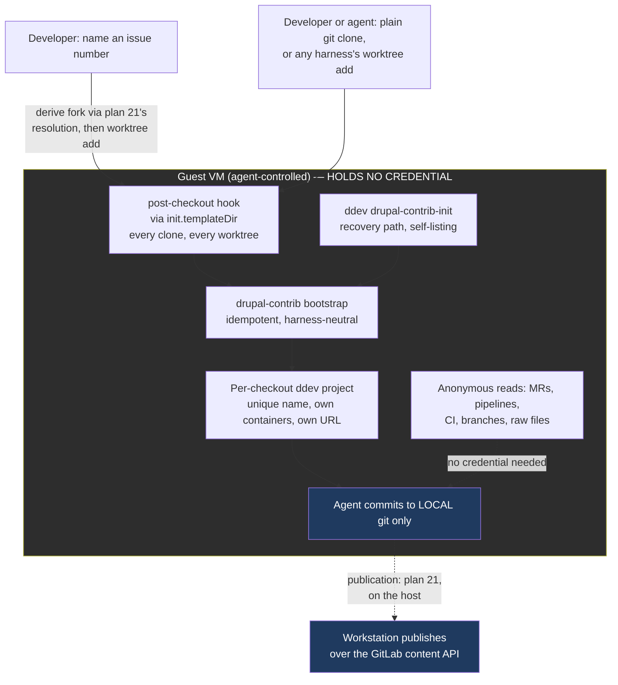

# Plan: Drupal.org Contribution and Development Workflow

## Original Work Order

> Improve our drupal.org contribution and development workflow.
>
> I'd like somehow for https://github.com/ddev/ddev-drupal-contrib to be
> automatically used. But I'm not sure where the best point is to do that. The
> biggest challenge is that the user could be cloning any drupal.org module, and
> that module likely knows nothing about sandbar, ai, skills, etc. The ddev
> environment should be set up so parallel instances with worktrees work well.
>
> There's another issue with gitlab authentication. drupal.org works with
> repository forks - each issue gets its own unique repository to work in. That's
> great on one hand - it means that gitlab api tokens are issue, and not project
> scoped. However, it also means that every new issue needs a new gitlab
> fine-grained token, and the UI for creating those is pretty rough. It also means
> if worktrees are used, each one of them needs its own token (instead of per
> module or project).
>
> Ideally nothing is specific to a harness like claude code, so users can work well
> with other tools as they choose.
>
> I'm open to ideas on improving this - the end goal is it needs to be SIMPLE for a
> Drupal developer to install sandbar, create a VM, and start contributing.

## Plan Clarifications

> **Note on the credential rows.** Sessions 1 through 5 below are kept intact as a
> record of what was asked and answered, including the questions that decided the
> publication design. That design was extracted to **plan 21** in session 6, and
> plan 21 is now the sole authority on all of it. Where a row below states a
> credential or publication decision, read it as history; the live version lives in
> plan 21.

| Question | Answer |
| --- | --- |
| drupal.org's PAT docs say tokens are user-account scoped and push access to issue forks is granted per user, so one PAT could cover every fork. Is the per-issue token model a hard constraint or a chosen posture? | **Deliberate least-privilege.** One account-wide PAT would work technically, but an agent-controlled VM must not hold push access to the whole drupal.org account. Make narrow tokens cheap to create and place. |
| Where should creating and placing per-fork tokens happen? | **Host mints, guest receives** — conditional on confirming a GitLab API exists for it. User asked for that confirmation before committing. |
| (Confirmation requested) Does GitLab actually expose an API to create fine-grained tokens? | Confirmed: `POST /projects/:id/access_tokens`. Must be called with a *personal* access token, requires Maintainer/Owner, returns the token value, supports `access_level` below the caller's own. User then confirmed host-mints-guest-receives. |
| For ddev-drupal-contrib, where should the hook point live? | User challenged the proposal: *"how would an agent know to bootstrap the environment that way?"* Resolved by making bootstrap automatic at every sandbar-controlled entry point, with discovery as fallback. |
| Which automation and discovery surfaces should be built? | **Auto-bootstrap at clone time**, **auto-bootstrap new worktrees**, and **ddev global command + real errors**. `AGENTS.md` in the checkout was explicitly **excluded**. |
| What on-disk topology should a module and its issues use? | User challenged the proposal: *"Claude code for example will create its own worktrees in .claude. How would that work with this?"* Resolved by evidence (see Background): **do not mandate a topology**; work wherever a harness drops the worktree. |
| Is backwards compatibility required? | **Yes — additive, no BC break.** The existing directory-scoped `GH_TOKEN` wiring stays byte-identical; URL-keyed credentials are a parallel path used only for `git.drupalcode.org`. |

### Refinement session, 2026-08-26

| Question | Answer | Source |
| --- | --- | --- |
| How does sand learn *which* issue fork a checkout needs a token for, and what triggers minting? The original plan left this seam — between the ddev half and the credential half — entirely unspecified. | **Issue number, user-initiated.** The developer names an issue number against an existing drupal.org checkout; that one command derives the fork URL, mints, places the token, and creates the worktree for the issue branch. | User |
| (Challenge) *"How could use the drupalorg cli inside the VM, when the token minting needs to be on the user's workstation?"* | Valid contradiction in the original recommendation. Resolved by evidence: the host needs **neither** the `drupalorg` CLI nor an authenticated API call. See Background — fork URLs follow a documented convention, are anonymously readable, and the mint call accepts a URL-encoded project path. | User challenge, resolved by verification |
| Where does sand's own command place the worktree it creates, given the plan mandates no topology? | Sand's command uses a **default sibling path** under the issue namespace, overridable. "No mandated topology" is preserved because the `post-checkout` hook bootstraps a worktree created anywhere by any tool — the default binds only sand's own convenience command. | Assumption, with rationale |
| Where does the host-held account PAT live? The original plan said only "the same place sandbar already keeps host-side credentials" without confirming such a place exists. | It exists: `internal/profiles/token.go` establishes the pattern — config records only the *path* to a credential, and the loader refuses a file readable by group or other. The drupal.org PAT follows it. | Auto-resolved from codebase |
| Does the plan correctly distinguish GitLab's token scopes from access levels? | **No — the original plan conflated them.** They are independent axes deciding different things, and MR tooling depends on the scope axis. Corrected in Host-side token minting. | Auto-resolved; defect in prior revision |
| What happens to a drupal.org checkout and its worktrees across a `sand reset`? Unaddressed in the original plan. | A real gap. Reset stages only the clone's own org directory and restores it *after* finalize, while ddev's project registry lives in the guest's global state. Sibling worktrees under a different org directory are not staged at all. Recorded as a risk with an explicit requirement. | Auto-resolved from codebase; new requirement |
| Are minted tokens revoked when a worktree is removed? | **Superseded by refinement 3** — there are no minted tokens any more. Recorded because the reasoning (git provides no `worktree remove` hook) remains true and would resurface for any future per-worktree resource. | Superseded |

### Refinement session 2 — multiple projects per VM, 2026-08-26

| Question | Answer | Source |
| --- | --- | --- |
| *"How does this plan work if a user has a single VM for multiple drupal.org projects? Any complications?"* | Three real complications, one of them a defect in the prior revision. Folded in below. The credential half needs no change and is in fact vindicated by this case. | User |
| Does the clone-time trigger cover a second, third, or fourth module? | **No — this was a silent gap.** `CloneURL` is a single value per VM, so the Ansible path fires once. Resolved by installing the hook through git's template directory, which was verified to cover every clone in the VM through the same code path. | Auto-resolved by verification |
| Can the mint entry point identify the right module in a multi-module VM? | **No — defect in the prior revision**, which derived the module from the VM's create-time `CloneURL`. It must be read from the targeted checkout instead. Corrected. | Defect in prior revision |
| Does the multi-module case break the credential design? | No — it argues *for* it. All canonical drupal.org modules share one org directory, so a directory-scoped scheme would have given them a single shared token. | Auto-resolved from codebase |
| Was the reset risk stated correctly? | Partly. Because all canonical modules share one org directory, preserve-project stages every module clone, not just the first. The worktree half of the risk stands. Corrected in Background and in the risk entry. | Correction to prior revision |
| What actually limits how many projects can run at once? | Memory, not disk — 8 GiB against 100 GiB by default. Quantified in Background and in the risk entry. | Auto-resolved from shipped defaults |
| Must each task be verified before it is considered complete? | **Yes.** Every task runs `/code-review --fix` and then `/simplify` before it may be marked complete. Recorded as a per-task completion gate under Self Validation. | User |

### Refinement session 3 — the probe came back negative, 2026-08-27

| Question | Answer | Source |
| --- | --- | --- |
| Did the validation probe settle the two open drupal.org unknowns? | **Yes, both negative.** `access_level = 30` (Developer) on a real issue fork, below the Maintainer that creating a project access token requires; and `POST .../access_tokens` is blocked at drupal.org's edge for everyone. Per-issue-fork tokens are impossible. | Probe output |
| Could scripting the GitLab web UI work around the blocked endpoint? | **No.** The obstacle is the role, not the API: at Developer there is no access-tokens page to script. It would also require the developer's SSO session or password — a credential more dangerous than the one being avoided. | User proposal, resolved by verification |
| What is the actual requirement behind wanting narrow tokens? | *"Developers may have push access to highly used projects. An agent with a PAT could push to a project with bad code and affect 10s of thousands of sites."* Blast radius containment, not tidiness. This makes an account-wide PAT in a VM unacceptable rather than merely imperfect. | User |
| How should the credential half proceed given that? | **Host publishes; guest holds nothing.** No credential of any kind inside the VM. | User |
| *"Do we have to push with the git protocol? Do we have to have literal files on disk? What if as a part of land we then used the gitlab API to create a commit?"* | **Yes, and it is better than the git-based version.** Verified that drupal.org routes `POST /repository/commits`, `/repository/files`, `/repository/branches`, and `/merge_requests` to GitLab while blocking only the credential-minting endpoints. One call creates the branch and lands the change set. The host needs no git repository, no checkout, and no git objects — removing the architectural concession the git-based design required. | User idea, verified |
| Does the guest still need any drupal.org credential? | **No.** Anonymous requests returned 200 for merge requests, pipelines, branches, trees, commits, issues, and raw files. The entire read loop works unauthenticated, so the guest-side credential machinery of earlier revisions is removed, not merely bypassed. | Auto-resolved by verification |

### Refinement session 4 — research contradicted an assumption, 2026-08-27

| Question | Answer | Source |
| --- | --- | --- |
| Is it true that GitLab PATs can never be project-scoped? | **No — this plan was wrong.** That holds for *classic* PATs only. **Fine-grained access tokens** went generally available on GitLab Self-Managed in **19.2**, carry a project/group/instance **access boundary**, include a `Code: Push` permission, are **Free tier**, and intersect with the user's own permissions — so **Maintainer is not required**. Verified against git.drupalcode.org's own served documentation; the instance runs GitLab 19.x. | Research, verified independently |
| Does that reopen a per-fork credential? | Yes, and better than per-fork: the `issue` namespace is a real group (`{"id":49196,"name":"Issue forks"}`), so **one** token bounded to that group reaches every issue fork while being structurally unable to touch any canonical `project/<module>` repository. | Verified |
| Can fine-grained tokens be minted via API? | **No.** `POST /user/personal_access_tokens` accepts only `k8s_proxy` and `self_rotate` and has no boundary parameter. Creation stays a web-UI act; only rotation is automatable. So the original "rough UI" friction returns — but once, not per issue. | Verified |
| What is still unverified? | Whether git.drupalcode.org's token UI actually exposes the fine-grained option, and whether the boundary picker allows selecting the `issue` group as a non-member. Both are minutes of manual checking and are recorded as validation steps. **Answered in refinement 5: the first yes, the second no.** | Resolved in refinement 5 |
| Was the edge allowlist a security boundary? | **No — the plan overstated it.** `POST /api/graphql` is not blocked, and git push over HTTPS bypasses the REST allowlist entirely. DA staff note their load balancer cannot inspect request bodies. The allowlist must not be treated as containment. | Research, corrected |
| Does the DA's automation policy forbid AI-assisted merge requests? | **No.** That policy governs site access and automation registration, and contains no rule about merge requests, commits, or pushes. Disclosure attaches to *approved automation tools*. A human reviewing and publishing the agent's work is "an individual action a user could already perform". Per-MR AI disclosure is proposed in governance issue 3565917 but is **not ratified policy**. | Research |
| Which design does the plan adopt? | **Deferred deliberately.** Host-side publication is verified working and needs nothing unverified; the fine-grained token restores the ordinary push loop at the cost of two unverified facts. They compose. The plan records both honestly rather than picking before the facts are in. | Open decision |

### Refinement session 5 — the token boundary is per-project, 2026-08-27

| Question | Answer | Source |
| --- | --- | --- |
| Does git.drupalcode.org's token UI expose fine-grained tokens at all? | **Yes.** The Generate token dropdown offers "Fine-grained token", the form exposes Group and project access, and resource `Code` -> permission `Push` is present. Refinement 4's first unverified fact resolves **positive**. | User, on a real account |
| Can the boundary select a single issue-fork project? | **Yes**, and a token so bounded was created and used to push to an issue fork successfully. | User, verified by pushing |
| Can the boundary select the `issue` group ("Issue forks")? | **No — projects only.** Refinement 4's second unverified fact resolves **negative**, and it inverts that session's conclusion. Corroborated by the access probe: `group_access` is `null` on an issue fork, so the developer's access there is a direct project membership and they are not a member of the `issue` group — and GitLab offers only boundaries the user belongs to. | User; corroborated by probe |
| What does that do to the fine-grained option? | It reduces it to **one hand-made token per issue fork**. The blast radius becomes *tighter* than the group option would have been — a single fork rather than every fork — but creation cannot be automated, so this is precisely the friction the work order opened with: *"every new issue needs a new gitlab fine-grained token, and the UI for creating those is pretty rough."* | Derived |
| Does a higher access level on a maintained module reopen project access tokens? | **No, and the finding is now structural rather than sampled.** The developer is a full maintainer of dubbot, created a brand-new issue and its fork, and still holds `access_level: 30` (Developer) on that fork. If the parent project's own maintainer is Developer on a fork they created themselves, no drupal.org user can hold Maintainer on an issue fork. Project access tokens are closed permanently, not merely unavailable to one account. | User probe |
| Which credential design does the plan build? | **Host-side publication only** — refinement 4's deliberate deferral is closed. The per-fork token is recorded as a manual escape hatch a developer may set up for themselves, but no sand machinery is built for it. Building one path honours the PRE_PLAN scope-control hook; the second would spend the URL-keyed credential store and host-scoped `useHttpPath` work to reinstate a friction the work order asked to remove. | User decision |
| Should the credential half become its own plan? | **No — keep one plan.** The split was proposed because two mutually-exclusive designs blocked decomposition. With one design chosen the plan decomposes end to end, and its length is accumulated reasoning rather than scope: the build is the ddev bootstrap, the issue entry point, and one publish command. | User decision |
| What remains unverified about the token option? | The negative control — that a token bounded to one issue fork **fails** to push to a canonical `project/<module>` — has not been run. It does not block this plan, which builds no token path, but it must pass before the escape hatch is documented as safe. | Unresolved |
| Did refinement 3's redesign leave stale artefacts behind? | **Yes.** Four success criteria and one validation step still described the deleted per-fork-token design, and validation step 8 contradicted step 12 outright — requiring a push to authenticate where step 12 requires every push to fail. Corrected in this session. | Defect in prior revision |

### Refinement session 6 — the publication half is extracted, 2026-08-27

| Question | Answer | Source |
| --- | --- | --- |
| Should the "push code to gitlab over the API" feature be extracted into its own plan? | **Yes — plan 21.** This reverses refinement 5's answer, and the reversal is on different grounds rather than a change of mind. Refinement 5 declined a split because two mutually-exclusive credential designs were blocking decomposition, and choosing one removed that blocker. That reasoning did not address what decides it now: this plan's own Architectural Approach certified, before the split, that the two mechanisms "share no code and can be built and tested independently"; every external blocker — three unanswered Drupal Association questions, the host PAT, a real account for end-to-end tests — sits entirely on the publication side; the two halves have qualitatively different test regimes, since publication validation creates **public, permanent** merge requests on drupal.org while this plan's runs wholly inside a local VM; and a combined blueprint would have run to roughly twenty tasks under the per-task gate. | User decision |
| Which plan is implemented first? | **Plan 21, before this one.** | User |
| What moved to plan 21? | The host-side publication design and its account PAT; the fine-grained token analysis and the manual escape hatch; the guest-credential consequences; fork resolution by convention; the endpoint map and `probe-drupalorg-api.sh`; the credential-related Background findings, success criteria, validation steps, risks, and documentation. Plan 21 is now the sole authority on all of them. | Derived |
| What stays here? | The ddev-drupal-contrib bootstrap, its trigger surfaces, per-checkout ddev identity, the issue-number entry point, reset, and the multi-project and harness-neutrality requirements. | Derived |
| Does this plan still assert that the guest holds no drupal.org credential? | **Yes, but as a property it must not weaken rather than one it establishes.** Plan 21 establishes it by building no credential path; this plan preserves it by placing none in the worktrees and checkouts it creates. | Derived |
| Does this plan now depend on plan 21? | **Yes, in one place.** The issue-number entry point derives a fork URL by drupal.org's `PROJECT-ISSUE_NUMBER` convention, which plan 21 builds first for its destination selection. This plan consumes that resolution rather than reimplementing it. | Derived from the ordering |

## Executive Summary

A Drupal developer should be able to install `sand`, create a VM, point it at a
drupal.org module, and immediately have a working test environment — without
learning anything about sandbar and without hand-assembling a ddev project. Today
that is not true: the VM ships ddev, the `drupalorg` CLI, and `glab`, but nothing
connects them, and the module arrives as bare source with no ddev project.

This plan closes the environment side of that, on one design principle: **the
developer and the agent should not have to know anything.** It is a single
idempotent bootstrap, installed as a `post-checkout` hook through git's template
directory so it fires on every clone and every worktree in the VM, whoever created
them — and discoverable at point of need via a self-listing ddev command and error
messages that name it. Naming an issue number is then the one action that produces
a worktree on the issue branch, already a running ddev project.

Publication is deliberately **not** part of this plan. It was extracted to
**plan 21**, which is implemented first, and which establishes the property this
plan must preserve: **the guest holds no drupal.org credential at all.** The short
version of plan 21's reasoning, because it constrains what may be built here — a
Drupal developer often holds push access to modules installed on tens of thousands
of sites, drupal.org offers no narrow credential that can be created by API, so
the workstation publishes over GitLab's content API and the VM authenticates to
drupal.org for nothing. Everything the guest needs to read — clones, merge
requests, pipelines, CI results, raw files — was verified to work anonymously, so
nothing in this plan needs a credential either. Nothing built here may place one in
a guest.

## Context

### Current State vs Target State

| Current State | Target State | Why? |
| --- | --- | --- |
| `sand create --clone-url` of a drupal.org module leaves bare source with no ddev project | The clone arrives as a working, bootstrapped ddev-drupal-contrib project | The end goal is that creating a VM and contributing is one step, not a manual assembly job |
| A developer or agent must know the ddev-drupal-contrib incantation (`ddev config`, `add-on get`, `poser`, `symlink-project`) | Bootstrap runs automatically; nobody needs to know the sequence | The cloned module knows nothing about sandbar; knowledge cannot live in the repo |
| A new git worktree is an unconfigured directory | A new worktree is automatically its own ddev project with a unique name and URL | Parallel issue work is the stated goal, and per-worktree ddev projects are the only way to get true parallelism |
| `ddev config` in a fresh nested worktree silently rewrites the *parent* project's config | The worktree's own `.ddev/config.yaml` exists before any ddev command can run there | Verified destructive behavior; an agent can corrupt the main clone's setup by doing the obvious thing |
| Nothing tells an agent how to run tests in a contrib module | `ddev drupal-contrib-init` self-lists in `ddev help`; `ddev start` in an unbootstrapped module names it | Harness-neutral discovery, no Claude-Code-specific files |
| Publishing work to drupal.org would need a credential wherever the push happens | The workstation publishes over GitLab's content API and the VM holds no drupal.org credential — **built in plan 21** | Blast radius. The design and its evidence live in plan 21; this plan must not weaken the property |
| Starting work on an issue means: find the fork, add a remote, make a branch, configure ddev | Naming the issue number does all of it | This is the "SIMPLE for a Drupal developer" goal made concrete and testable |
| A `sand reset` would restore a drupal.org checkout with no registered ddev project, and would not stage sibling issue worktrees at all | Reset either restores drupal.org checkouts to a working state or refuses clearly and says what will be lost | Verified in the reset flow; silently returning a broken environment is worse than a clear refusal |
| Only the module named in `--clone-url` could ever be bootstrapped automatically | Every drupal.org clone in the VM bootstraps, whoever cloned it and however | One VM commonly holds several modules; a single create-time URL cannot cover them |
| A global hooks path would override every repository's own hooks | Hooks arrive via git's template directory, leaving existing and non-Drupal repositories alone | Drupal work shares the VM with unrelated repositories that have their own hooks |
| A task could be marked complete without a review or simplification pass | No task completes until `/code-review --fix` and then `/simplify` have run and their tests re-run | Correctness and quality gates belong at task boundaries, not as one sweep at the end |

### Background

The scope above was settled by investigation during planning rather than by
assumption. The findings below are load-bearing and several of them overturned
the design that seemed obvious at the start. Each is marked with how it was
established.

**Git credential mechanics are plan 21's territory now.** Three findings
established during this investigation — that `includeIf "gitdir:…"` never fires for
a linked worktree, that URL-keyed `git-credential-store` entries with
`credential.useHttpPath` resolve per-fork correctly, and that `useHttpPath` must be
scoped to `git.drupalcode.org` or it breaks sandbar's existing GitHub entry — are
recorded in plan 21's Background. Nothing in this plan places a credential
anywhere, so none of them bear on it; they are noted here only so a reader does not
conclude the questions went unasked.

**ddev binds to the nearest ancestor project, destructively (verified
empirically with ddev v1.25.3).** Running `ddev config` inside a freshly created
nested worktree did not create a project there. ddev walked up, found the
parent's `.ddev/`, and reported *"You are reconfiguring the project at
…/mymodule. The existing configuration will be updated and replaced."* Since
Claude Code's `EnterWorktree` places worktrees at `<repo>/.claude/worktrees/…`
and other harnesses will each choose their own location, this is a live hazard:
the obvious action corrupts the main clone.

**A pre-existing child config wins (verified empirically).** With a
`.ddev/config.yaml` written into the nested worktree *first*, `ddev describe`
correctly bound to the child project at the nested path, and a subsequent `ddev
config` reconfigured the child rather than the parent. This is what makes nested
harness worktrees viable, and it is why writing the worktree's ddev config at
`git worktree add` time is a correctness requirement rather than a convenience.

**Why no drupal.org credential may enter a guest (established in plan 21).**
The full evidence chain lives in plan 21's Background and is not repeated here. The
conclusion is what constrains this plan: project access tokens require Maintainer
and no drupal.org user holds it on an issue fork — not even the parent project's own
maintainer, on a fork they created themselves; drupal.org blocks
`POST /projects/:id/access_tokens` at its edge for every caller; and a fine-grained
token *can* be bounded to a single issue fork but must be hand-built in GitLab's web
UI for every issue, because no API can create one. So the only narrow credential
that exists is unautomatable, and the guest is given none. This plan may not
introduce one.

**Issue forks are derivable and anonymously readable (verified empirically).**
A `ls-remote` against `git.drupalcode.org/issue/drupal-3181657.git` succeeded
with no credential presented, returning the fork's branches including one named
for the issue. Three consequences follow, and together they resolve what looked
like an architectural contradiction — that the host must act on a fork while the
`drupalorg` CLI lives only in the guest. The fork URL is derivable from the module
name (read from the targeted checkout) plus the issue number, by drupal.org's
documented `PROJECT-ISSUE_NUMBER` naming. Its existence and its branch list can be
confirmed anonymously, needing no token and no API access. And GitLab's project
endpoints accept a URL-encoded project path, so no project-ID lookup is needed
either. The host therefore requires no PHP runtime and no Drupal tooling, and
authenticates for one purpose only: publishing.

*Plan 21 builds the resolution itself, for its own destination selection.
This plan's issue-number entry point consumes it rather than reimplementing the
convention a second time.*

**Reset does not currently accommodate this workflow (confirmed in the
codebase).** The reset flow re-clones during finalize and restores a preserved
project tree only *afterwards*, and it stages exactly one org directory derived
from the clone URL. Two consequences follow. ddev's project registry lives in the
guest's global state, not inside the checkout, so a preserved checkout returns
with its ddev configuration present but no registered project. And a sibling
issue worktree — living under the `issue/` org directory rather than the clone's
`project/` one — is never staged, so reset would destroy it while leaving the
main clone's worktree administrative files referencing paths that no longer
exist. Neither is acceptable silently.

**One VM can hold many drupal.org modules, and that changes three things
(verified empirically and in the codebase).** The plan was originally reasoned
around one module and many issues; several modules in one VM is a separate axis.

*The template directory closes the multi-module trigger gap.* A test confirmed
that `init.templateDir` installs hooks into every freshly created repository and
that `post-checkout` fires during `git clone` itself, with the new clone as the
working directory. The same test confirmed the null-SHA discriminator: git passes
an all-zero previous-HEAD for both clone and worktree-add, and a real SHA for an
ordinary branch switch. Without this, only the module named in `--clone-url` —
one value per VM — would ever be bootstrapped automatically.

*Every canonical module shares one org directory.* Every canonical drupal.org
module lives flat under `git.drupalcode.org/project/<name>` — confirmed against a
real contrib module — so `OrgRelDir` returns the identical org directory,
`git.drupalcode.org/project`, for every module a developer clones. That fact
decides the reset behavior below, and it is also why any directory-scoped scheme
treats all of a VM's drupal.org modules as one thing.

*The same fact softens the reset risk for clones while leaving it intact for
worktrees.* Because all canonical modules share that one org directory, a
preserve-project reset stages every module clone together rather than only the
first — the earlier statement of this risk was accurate but misleading. Issue
worktrees under the `issue/` namespace remain a different org directory and are
still not staged.

**Memory, not disk, bounds parallelism (from the shipped defaults).** A VM
defaults to 8 GiB of memory and 100 GiB of disk. A running ddev project is a web
container plus a database container; a handful of concurrently *running* projects
is what 8 GiB supports, while 100 GiB comfortably holds many times that number of
*stopped* ones, since each project's cost on disk is its vendor tree, core, and
database volume. The practical shape of the workflow follows from this: many
projects may exist, few should run at once, and stopping a project rather than
destroying it is the normal move. Concurrent dependency resolution across several
bootstraps at once is the most likely way to exhaust memory.

**Everything an agent needs to read works with no credential (verified).**
Against a public fork, unauthenticated requests returned 200 for merge requests,
pipelines, branches, repository trees, commit lists, issues, and raw file
contents. Combined with anonymous `git clone`, this means a guest can do the
entire development loop — including reading CI results and merge-request feedback
— without ever authenticating. Only writes need a credential, and those are the
host's job.

**What the VM already provides.** Every sand VM ships ddev, Docker, `mkcert`,
`glab`, and the `drupalorg` CLI — which already offers `issue:get-fork`,
`issue:setup-remote`, `issue:checkout`, and the `mr:*` family. Its read operations
were all verified to work unauthenticated against a public fork, so the guest keeps
that CLI for merge-request status, pipeline logs, and diffs while holding no
credential. `internal/checkouts` already sweeps guests for git checkouts *and
worktrees*. The pieces exist; this plan connects them.

## Architectural Approach

This plan is the **environment path**: it makes any drupal.org checkout a
working ddev project, automatically, wherever and however that checkout appeared.
The publication path is plan 21, built first and separately; the two share no code,
which is what made the extraction clean. They meet at one point only — the
issue-number entry point, which creates a worktree here and reuses plan 21's fork
resolution to know which branch to check out.

### Drupal.org project detection

**Objective**: Decide, from a URL alone, whether a checkout is a drupal.org
project that should be bootstrapped — without which every other component has no
trigger condition.

Detection keys on the git host `git.drupalcode.org` and the two path prefixes
drupal.org uses: `project/<name>` for canonical repositories and
`issue/<name>-<nid>` for issue forks. Both forms must be recognized, because a
developer may reasonably start from either — cloning the canonical project and
adding issue worktrees, or cloning an issue fork directly. Detection must also
tolerate the `.git` suffix, a trailing slash, and both HTTPS and SSH remote
forms, since the URL may arrive from `sand create --clone-url`, from an existing
remote, or from the `drupalorg` CLI.

Detection deliberately does *not* consult drupal.org's web API or the project
page. It is a pure function of the URL so that it can run identically on the
host (deciding whether to pass a flag to Ansible), inside the Ansible role, and
inside a git hook with no network access. A module-versus-theme distinction is
needed later for the ddev symlink target and is read from the checkout's
`.info.yml` `type:` key rather than from the URL, since the URL does not carry
it.

### The ddev-drupal-contrib bootstrap

**Objective**: One idempotent operation that turns any drupal.org checkout into
a working ddev project, so that every trigger surface shares a single
implementation and a single set of bugs.

The bootstrap performs the ddev-drupal-contrib setup sequence — configure the
project, install the add-on, resolve dependencies, and symlink the module into
the site — and is safe to run repeatedly on an already-bootstrapped checkout.
Idempotency is a hard requirement, not a nicety, because the `post-checkout`
trigger fires on ordinary branch checkouts as well as worktree creation, and
because agents retry.

Three behaviors distinguish it from running the upstream sequence by hand.
First, it **writes the ddev project configuration before invoking any ddev
command**, which is what prevents the verified parent-clobbering failure. Second,
it **derives a project name that is unique within the VM** rather than accepting
ddev's directory-basename default, since two different modules can easily have
worktrees with the same directory name and ddev rejects a duplicate name.
Third, it **keeps the checkout clean**: ddev-drupal-contrib writes a `.ddev`
directory into the repository, and for a drupal.org module that is untracked
cruft which must never reach a merge request. Exclusion is via the repository's
local exclude file, which lives in the shared git directory and therefore covers
every worktree, never appears in `git status`, and cannot be committed. Where a
module already tracks its own `.ddev` directory — an increasingly common
practice in contrib — the bootstrap must detect that and defer to the committed
configuration rather than overwrite it.

The bootstrap must degrade honestly. It depends on network access, Docker, and
upstream add-on availability, and when any of those fail it must fail loudly
with a message naming what to do, not leave a half-configured project that fails
mysteriously later.

### Trigger surfaces

**Objective**: Make the bootstrapped state the default state, so that neither a
developer nor an agent needs to know the bootstrap exists.

**One hook covers both clone time and worktree time.** The `post-checkout` hook
fires on `git clone` as well as on `git worktree add` — verified, with the new
clone's directory as the working directory in both cases. Installing it via
git's **template directory** therefore collapses what looked like two separate
trigger surfaces into one: with `init.templateDir` set in the guest's global git
configuration, *every* repository created in the VM receives the hook at creation
time, and the hook fires immediately on the initial checkout.

This matters most for the multi-project case. `CloneURL` is a single value, so
the Ansible clone-time path fires exactly once, for the module named at create
time; a developer working on several drupal.org modules in one VM clones the rest
by hand, and those would otherwise reach only the weakest discovery layer. The
template directory covers them all, through the same code path, regardless of
which tool did the cloning.

*Resolves the multi-project gap recorded in the second refinement.*

The hook must be cheap, and must no-op on the ordinary branch-checkout case that
fires it far more often. The discriminator is exact and was verified: git passes
the all-zero null SHA as the previous-HEAD argument for both a clone and a
worktree add, and a real commit SHA for an ordinary branch switch. Bootstrapping
only on the null SHA is therefore precise, not heuristic.

Installation must use the **template directory**, not a global `core.hooksPath`.
A template directory *copies* hooks into newly created repositories and leaves
existing repositories alone; a global hooks path *overrides* per-repository hooks
for every repository in the VM, including unrelated non-Drupal work sharing that
VM. The hook must also defer to a hooks path a repository or developer has
already set.

**Clone time (Ansible).** The `project` role still clones `--clone-url` into
`~/<host>/<org>/<repo>`, and with the template directory in place the hook fires
there too. The role's remaining responsibility is diagnostic rather than
triggering: because bootstrap is slow — it resolves Drupal core and its
dependencies — and provisioning failures are opaque, the role must surface
bootstrap failure as a distinct, recognizable outcome rather than failing the
whole provision run ambiguously.

**Point of need (ddev command and errors).** The bootstrap is also exposed as a
ddev **global custom command**, which self-lists in `ddev help` — a discovery
surface any agent that has decided to use ddev will encounter without being
told. It is reinforced by making a ddev start in an unbootstrapped drupal.org
checkout fail with a message that names the command. With the template directory
in place this is no longer the only path for hand-cloned repositories, but it
remains the recovery path for the cases the hook cannot reach: a repository
created before the template directory existed, one whose bootstrap failed, and
one in a checkout whose hooks path is owned by someone else.

No `AGENTS.md` or other file is written into the checkout; that was explicitly
excluded from scope.

### Per-checkout ddev project identity

**Objective**: Let many checkouts of many modules run simultaneously in one VM
without colliding, regardless of where a harness places them.

Each checkout — main clone or worktree, sibling or nested — is its own ddev
project with its own containers, database, and URL. The project name is derived
deterministically from the module and the checkout's identity so that it is
unique within the VM, stable across re-runs, and valid as a ddev project name
and hostname component. Because the resulting name determines the project's
`.ddev.site` URL, it should remain recognizable to a human reading a browser
address bar rather than being an opaque hash where that can be avoided.

The plan deliberately mandates **no topology**. Sibling worktrees and
harness-created nested worktrees must both work, because the work order requires
harness neutrality and because Claude Code, as one example, places worktrees
inside the repository. Nesting carries a known cost, recorded under risks: the
parent project's bind mount includes nested worktrees, so the parent site's
extension scanning may encounter a second copy of the same module.

### The issue-number entry point

**Objective**: Give the whole workflow one user-facing action, and place the
host/guest boundary so that neither side needs the other's tooling.

*Resolves the seam left unspecified in the original revision — see the refinement
clarifications.*

The developer names an issue number against an existing drupal.org checkout.
Everything else follows from information sand already has. The module name is
read from **the checkout being targeted** — its origin remote, or the path the
developer names — and explicitly *not* from the VM's create-time `CloneURL`. That
distinction is load-bearing and was wrong in the previous revision: `CloneURL` is
a single value recorded once per VM, so in a VM holding several drupal.org
modules it identifies only the first, and deriving from it would resolve the wrong
fork. Combined with the issue number, the module name yields the fork URL by
drupal.org's documented `PROJECT-ISSUE_NUMBER` convention — **plan 21 builds that
resolution, and this entry point calls it rather than reimplementing it.** The
fork's existence
and its branch list are confirmed by an anonymous fetch — verified to need no
credential — which also identifies the issue branch to check out. The worktree
for that branch is then created, and the `post-checkout` hook bootstraps it into
a ddev project. No credential is placed in the guest, because the guest never
needs one.

Publication is a separate, second user-facing action, and it is **plan 21's**,
not this plan's. Keeping it distinct from the entry point is what makes publication
a conscious act rather than something an agent completes on its own, and the
separation is deliberate rather than an artefact of the split.

The division of labor matters as much as the sequence. The host does the fork
derivation and every authenticated call, because that is where plan 21 keeps the
credential. The guest does the development work and reads everything it needs
anonymously, keeping the `drupalorg` CLI for merge-request status, pipeline logs,
and diffs — all verified to work unauthenticated against a public fork. Neither side
needs the other's tooling: the host needs no PHP runtime, no Drupal knowledge, and
no git; the guest needs no credential.

One alternative is rejected here as firmly as in plan 21: a guest-to-host broker
that issues credentials on the guest's request would let a compromised guest obtain
one for any project, restoring account-wide reach through the back door. Nothing in
this plan's automatic bootstrap may grow into one.

Where sand creates a worktree itself, it uses a default path under the issue
namespace, overridable by the developer. This does not reintroduce a mandated
topology: the default binds only sand's own convenience command, while the
`post-checkout` hook continues to bootstrap a worktree created anywhere, by any
tool. The default's interaction with reset is recorded under risks.

## Risk Considerations and Mitigation Strategies

Technical Risks

- **A worktree's first ddev command rewrites the parent project's config**:
  Verified with ddev v1.25.3 — ddev walks up to the nearest ancestor project and
  reconfigures it destructively. An agent doing the obvious thing corrupts the
  main clone.
    - **Mitigation**: The `post-checkout` hook writes the worktree's ddev
      configuration at creation time, before any ddev command can run there. A
      pre-existing child config was verified to win. This is treated as a
      correctness requirement with its own regression test, not as a convenience.
- **Nested worktrees are inside the parent's bind mount**: The parent ddev
  project mounts its whole approot, and ddev-drupal-contrib symlinks the module
  into the site, so the parent's extension scan may encounter a second copy of
  the same module. Drupal's extension discovery is believed to skip
  dot-directories — which would make `.claude/worktrees/` safe by luck — but this
  was **not verified** during planning, and a harness using a non-hidden worktree
  directory would not benefit from it regardless.
    - **Mitigation**: Verify the dot-directory behavior explicitly before relying
      on it. Independently, exclude worktree directories from the parent
      project's site scanning so correctness does not depend on a naming
      accident.
- **Memory exhaustion from parallel projects**: Each checkout is a full ddev
  project with its own containers and database, and each resolves its own copy of
  Drupal core. Against the shipped defaults of 8 GiB memory and 100 GiB disk,
  **memory is the binding constraint and disk is not** — a modest number of
  concurrently running projects saturates 8 GiB, while 100 GiB holds many times
  that number of stopped ones. Several modules each with several issue worktrees
  reaches the limit quickly. Running multiple dependency resolutions at once is
  the sharpest case.
    - **Mitigation**: Document the per-project memory cost and the sizing it
      implies, and state the operating rule plainly — many projects may exist,
      few should run at once. Prefer a shared package cache where ddev supports
      one. Make stopping a project (rather than destroying it) the obvious move,
      and avoid bootstrapping several modules concurrently.
- **`post-checkout` fires far more often than worktree creation**: The same hook
  runs on ordinary branch checkouts, where bootstrapping would be wasteful or
  actively disruptive.
    - **Mitigation**: The hook must detect the worktree-creation case and no-op
      cheaply otherwise, and must be idempotent so a spurious run is harmless.
- **Hook installation hijacks unrelated repositories**: A single VM commonly holds
  non-Drupal work alongside drupal.org modules. A global `core.hooksPath` would
  *override* per-repository hooks for every repository in the VM, silently
  disabling hooks that other projects depend on.
    - **Mitigation**: Install through git's template directory, which copies hooks
      into newly created repositories and leaves existing ones alone. Gate the
      hook on drupal.org detection so it no-ops immediately elsewhere, and gate it
      on the null previous-HEAD SHA so ordinary branch switches do nothing.
- **Hook installation collides with existing configuration**: A repository or
  developer may already set a hooks path.
    - **Mitigation**: Detect an existing hooks configuration and defer to it
      rather than overwriting, surfacing that the automatic worktree bootstrap is
      unavailable in that checkout.
- **Reset returns a broken or truncated environment**: Confirmed in the reset
  flow. A preserved checkout comes back with its ddev configuration but no
  registered ddev project, because that registry lives in the guest's global
  state rather than in the checkout. Reset also stages only the org directory
  derived from the clone URL, so a sibling issue worktree under the `issue/`
  namespace is not staged at all — reset destroys it while leaving the main
  clone's worktree administrative files pointing at paths that no longer exist.
  For *module clones* this is narrower than it first appears: every canonical
  drupal.org module shares the single org directory `git.drupalcode.org/project`,
  so staging that one directory captures all of them, not just the module named
  at create time. The worktree half of the problem is unaffected.
    - **Mitigation**: Treat reset as in scope for this work rather than
      discovering it later. Either stage every drupal.org checkout belonging to
      the VM and re-register its ddev project after restore, or detect the
      situation and refuse with a message naming exactly what would be lost. A
      silent broken restore is the one outcome that must not ship.
- **Remote and Proxmox profiles cannot reach ddev URLs directly**: Lima forwards
  guest ports to the *remote host's* loopback, not the developer's browser, and
  Linux hosts additionally cannot bind privileged ports unprivileged. Several
  parallel ddev projects compound both.
    - **Mitigation**: Document the constraint and point at the existing
      `ddev share --provider=cloudflared` path already covered in the web-servers
      documentation. Do not build port-forwarding machinery; sand deliberately
      manages no tunnels.

External Dependency Risks

- **Upstream ddev-drupal-contrib changes its setup sequence**: The bootstrap
  encodes a sequence owned by another project.
    - **Mitigation**: Keep the sequence in one place so a change is a
      single-location edit, and cover the bootstrap with a test that would fail
      loudly rather than silently producing a broken project.

Implementation Risks

- **Someone wires a drupal.org credential into a guest**: This plan's automatic
  bootstrap runs at every clone and every worktree, which makes it the natural place
  for a future change to "helpfully" place a token. Plan 21's central property is an
  absence, and absences are easy to delete without noticing.
    - **Mitigation**: Nothing in the bootstrap, the hook, the ddev command, or the
      issue entry point may write a drupal.org credential, configure
      `credential.useHttpPath`, or add a recognized-forge entry for
      `git.drupalcode.org`. Cover the absence with a test rather than a comment, and
      record the reasoning in `AGENTS.md` so it survives contact with future work.
      Plan 21 documents the manual escape hatch for contributors who want an
      in-guest push loop; that is a developer's own act, not something sand does.
- **Bootstrap failures inside provisioning are opaque**: A long, network-dependent
  step buried in an Ansible run produces poor diagnostics.
    - **Mitigation**: Surface bootstrap failure as a distinct outcome that names
      the failing stage and the command to re-run by hand.
- **Scope creep toward a general Drupal feature set**: The adjacent temptations —
  site-install workflows, MR creation, patch management — are numerous.
    - **Mitigation**: The deliverable is exactly the environment mechanism scoped
      here. The `drupalorg` CLI already covers issue and MR read operations and
      should be used rather than reimplemented, and publication belongs to plan 21.

## Success Criteria

### Primary Success Criteria

1. `sand create` with a drupal.org module clone URL yields a VM in which that
   module is a running ddev project with a reachable URL, with no manual steps
   and no knowledge of ddev-drupal-contrib required.
2. `git worktree add` in a bootstrapped drupal.org checkout — at any path,
   including a harness-created nested path — produces an independent ddev project
   with a unique name and URL, and never modifies the parent project's
   configuration.
3. Two issue worktrees of the same module run simultaneously in one VM, each
   serving its own site, without name, port, or database collision.
4. Naming an issue number against a drupal.org checkout produces, in one step, a
   worktree on the issue branch and a bootstrapped, running ddev project — and
   places no credential anywhere in the guest, because none is needed.
5. Running the bootstrap twice on the same checkout changes nothing and reports
   success — idempotency is asserted by test, since two of the three trigger
   surfaces can fire repeatedly.
6. A second drupal.org module, cloned by hand inside the VM with a plain
   `git clone` and no sand involvement, becomes a working ddev project — and the
   first module is unaffected.
7. A non-Drupal repository in the same VM keeps its own hooks and never triggers
   a bootstrap, and an ordinary branch switch in any repository triggers nothing.
8. A `sand reset` of a VM holding a drupal.org checkout and its worktrees either
   restores them to a working state, or refuses and names precisely what would be
   lost. It never returns a silently broken environment.
9. Every automated behavior is reachable by a human or any agent through
   documented, harness-neutral commands; nothing depends on a Claude-Code-specific
   file or convention.
10. Nothing this plan builds places a drupal.org credential in a guest — not the
    bootstrap, the hook, the ddev command, or the issue entry point. No push from
    anywhere inside the guest authenticates to drupal.org, through `git`, through
    `glab`, or through the `drupalorg` CLI.
11. The guest's anonymous read loop works throughout: clone, merge requests,
    pipelines, branches, and raw files all succeed with no credential presented.
12. Existing GitHub behavior is unchanged: a VM created with a `GH_TOKEN` and a
    GitHub clone URL authenticates exactly as it does today, with no migration and
    no change to stored secrets.
13. Every task in the blueprint passes the per-task completion gate —
    `/code-review --fix`, then `/simplify`, then tests re-run — before being
    marked complete.

## Self Validation

### Per-Task Completion Gate

This gate applies to **every task** generated from this plan, and is a
precondition for marking any task complete — not a final sweep at the end.

Before a task may be considered done, and after its own tests pass:

1. Run `/code-review --fix` against the task's changes, and apply or consciously
   reject every finding. This pass hunts correctness defects.
2. Then run `/simplify`, and apply or consciously reject its findings. This pass
   is quality only — reuse, simplification, efficiency — and deliberately does
   not look for bugs, which is why it runs second rather than instead.
3. Re-run the task's tests afterwards. Both commands modify the working tree, so
   a green result from before they ran is not evidence the task is still correct.

A task whose gate has not been run is not complete, regardless of whether its
functional work appears finished.

One point of possible confusion is worth pre-empting, because a future reader may
otherwise try to "fix" it: these are Claude Code commands, and this plan elsewhere
requires strict harness neutrality. There is no contradiction. Harness neutrality
is a constraint on **what sandbar ships to Drupal developers** — the workflow must
not depend on any particular assistant. It is not a constraint on the tooling used
to *build* sandbar. An implementer working in a different harness should run that
harness's closest equivalent review and simplification passes; the requirement is
the two passes and their order, not these two command names.

### Post-Implementation Validation

These steps inspect the real system and must be executed after implementation.
All of them run inside a live VM; none requires a drupal.org account, a credential,
or any write to drupal.org. That is a property of the split, not a coincidence —
every step that writes to the real forge lives in plan 21.

1. **Verify end-to-end create.** Run `sand create` against a real drupal.org
   module URL. Confirm the checkout is a ddev project, that it starts, and fetch
   its project URL over HTTP from inside the guest, confirming a Drupal response
   rather than an error page.
2. **Verify the one-step issue entry point.** Against that checkout, name a real
   issue number and confirm all three outcomes in one action: a worktree exists on
   the issue branch, it is a running ddev project reachable over HTTP, and the
   guest still holds no drupal.org credential of any kind. This is the plan's
   headline claim and must be demonstrated, not argued.
3. **Verify fork resolution needs no credential.** With no credential available,
   resolve a real issue number plus module name to a fork URL by convention and
   list its branches. Confirm success and confirm the issue branch appears. The
   resolution itself is plan 21's; this step confirms the entry point uses it
   without authenticating.
4. **Verify worktree bootstrap and non-clobbering.** Record the main clone's ddev
   configuration, add a worktree at a nested path, and confirm: a new independent
   ddev project exists at the worktree; its name differs from the parent's; the
   parent's configuration is byte-identical to what was recorded. Then run a ddev
   command inside the worktree and re-check the parent's configuration is still
   unchanged — this is the regression test for the verified clobbering hazard.
5. **Verify idempotency.** Run the bootstrap a second time on an already
   bootstrapped checkout and on a worktree. Confirm both report success, leave the
   ddev configuration byte-identical, and leave `git status --porcelain` unchanged.
6. **Verify parallelism.** With two issue worktrees of one module started
   simultaneously, fetch both project URLs and confirm two distinct running sites.
7. **Verify checkout cleanliness.** In a bootstrapped module checkout and in a
   worktree, confirm `git status --porcelain` reports nothing attributable to the
   bootstrap.
8. **Verify discovery surfaces.** Confirm the bootstrap command appears in `ddev
   help` output in a fresh VM, and that a ddev start in an unbootstrapped
   drupal.org checkout produces an error naming it.
9. **Verify the second module bootstraps with no sand involvement.** In a VM
   created against module A, clone an unrelated drupal.org module B by hand inside
   the guest, using plain `git clone` and nothing else. Confirm B becomes a running
   ddev project with a distinct name and URL, and that A is untouched. This is the
   multi-project claim, and it must be demonstrated with the same command a
   developer would type.
10. **Verify the hook does not hijack unrelated repositories.** In the same VM,
    clone a non-Drupal repository and confirm the bootstrap does not run, that the
    repository's own hooks still execute, and that an ordinary branch switch in any
    repository triggers no bootstrap.
11. **Verify reset behavior explicitly.** Reset a VM holding a bootstrapped
    checkout plus at least one issue worktree. Confirm the outcome is either a
    working restored environment — checkout present, ddev project registered and
    startable, worktree intact — or a refusal that names what would be lost.
    Confirm it is never a silent partial restore, and specifically that the main
    clone is never left with worktree administrative files pointing at absent
    paths.
12. **Verify reset across multiple modules.** Reset a VM holding modules A and B
    plus at least one issue worktree. Confirm both module clones survive or are
    named as lost, per step 11's standard, and that the outcome is never silently
    partial.
13. **Verify the guest holds no drupal.org credential and needs none.** In a
    provisioned VM, complete a full development loop against a real issue: clone,
    bootstrap, edit, run tests, read the merge request and pipeline status. Then
    search the guest exhaustively — environment, credential store, per-directory
    `.env` files, git config, shell history — and confirm zero drupal.org
    credentials of any kind. The loop working *and* the search coming back empty
    are both required; either alone proves nothing.
14. **Verify the guest cannot push, by trying.** From inside a VM, attempt a direct
    `git push` to the issue fork, to a different issue fork, and to the canonical
    project. All three must fail for want of any credential. Then attempt the same
    through the `drupalorg` CLI and `glab`. Nothing this plan builds may make any
    of these succeed.
15. **Verify Drupal's extension discovery with a nested worktree.** Confirm the
    parent site does not pick up the module a second time from a nested worktree,
    and that the exclusion works regardless of whether the worktree directory is
    hidden.
16. **Run the existing suite.** `go test ./... -race` must pass, and coverage must
    not fall below the committed floor enforced in CI.

## Documentation

Yes — this plan requires documentation updates, both human- and agent-facing.

- **A new user-facing guide for the Drupal.org development workflow** under
  `docs/using-sand/`, covering `sand create` against a module, the automatic
  bootstrap, the worktree model for parallel issues, and the issue-number entry
  point. It should link to plan 21's publication guide for the rest of the path
  rather than duplicating it, and should be written for someone who knows Drupal and
  not sandbar. This is the document that carries the work order's "SIMPLE for a
  Drupal developer" goal.
- **`docs/using-sand/web-servers.md`** — extend the existing ddev guidance for
  multiple simultaneous projects and the Linux privileged-port interaction.
- **`docs/getting-started/available-tools.md`** — note that drupal.org checkouts
  are bootstrapped automatically and name the command.
- **Reset documentation** — whichever of the reset sections applies, updated to
  state what happens to drupal.org checkouts and issue worktrees across a reset.
  The existing documentation already warns that a reset re-clones before secrets
  land; this workflow adds cases that warning does not currently cover.
- **`AGENTS.md`** — yes, this needs updating: it is the repository's own
  agent-facing documentation and must describe the worktree/ddev clobbering hazard
  and the rule that nothing in the bootstrap path may place a drupal.org credential
  in a guest, so future work does not reintroduce either. Plan 21 covers the
  publication mechanism itself.

## Resource Requirements

### Development Skills

Ansible, for the provisioning role and the hook installation. Shell, for the
bootstrap and the git hook. Go, for the reset staging changes in
`internal/provision`. Working knowledge of git's hook and template-directory
mechanics, and of its configuration-matching rules — this plan turns on details
that are easy to get subtly wrong. Familiarity with ddev's project model and
approot discovery. Enough Drupal contribution experience to judge whether the
resulting workflow is actually what a contributor needs.

### Technical Infrastructure

A host with Lima and KVM for the real-VM end-to-end suite. Docker and ddev inside
the guest, both already provisioned. Network access to drupal.org's GitLab (read
only — nothing here authenticates), to ddev's add-on distribution, and to Packagist
for dependency resolution.

### External Dependencies

None that require credentials. Validation needs a real, public drupal.org module
and a real issue with an existing fork, both readable anonymously. The account and
PAT that publication requires are plan 21's dependency, not this plan's — which is
one of the reasons the two were separated.

## Integration Strategy

This plan attaches to existing seams rather than introducing new architecture.
The bootstrap attaches to the `project` Ansible role's existing clone step. Hook
installation joins the guest git configuration that role already manages. The ddev
global command lands in the guest's ddev configuration, which the `dev-tools` role
already provisions.

`internal/provision/gitcred.go` is **untouched**, and must stay that way. Its
`recognizedForgeTokens` table keeps its single GitHub entry, no
`credential.useHttpPath` is configured, and no drupal.org credential is written into
any guest by anything this plan builds.

**Relationship to plan 21.** Plan 21 is implemented first and is independent of this
one. The dependency runs one way: the issue-number entry point here reuses plan 21's
fork resolution — module name plus issue number to `issue/<module>-<nid>`, confirmed
anonymously — rather than reimplementing the convention. This plan also inherits the
property plan 21 establishes, that the guest holds no drupal.org credential, and
must not weaken it.

The reset path in `internal/provision` **is** touched, which the previous
revision of this plan did not acknowledge. Reset's staging is currently derived
from the clone URL's single org directory, and this workflow legitimately
produces checkouts outside it. That is a change to existing behavior, but not a
compatibility break: reset's behavior for a VM holding no drupal.org checkout is
unchanged.

Nothing in this plan changes the Lima, Proxmox, or remote-SSH provider layers, the
TUI's board model, or the create form's existing fields. `internal/checkouts`
already discovers worktrees during its sweep and may later surface per-checkout
ddev state, but that is not required here and is deliberately left out.

## Notes

The work order asked for two things, and the investigation's most useful result
was discovering that they have **separate answers** rather than the single shared
one the early revisions expected. Making a drupal.org checkout a working ddev
project is a guest-side automation problem with no credential in it at all. Getting
work published is a credential problem with no ddev in it. That is why this plan and
plan 21 share no code, and why splitting them cost nothing — the seam was already
there, discovered rather than imposed.

The environment half's own most valuable finding is the ddev clobbering hazard: a
`ddev config` inside a fresh nested worktree does not create a project there, it
walks up and destructively reconfigures the parent. It is invisible until someone
tries it, an agent doing the obvious thing hits it immediately, and it is the reason
the worktree's ddev configuration must be written by the hook at creation time
rather than by whatever command runs first.

Finally, the design deliberately spends its effort on making knowledge
unnecessary rather than on conveying knowledge. Documentation and discovery
surfaces are the fallback layer, not the mechanism. That ordering is what the
"SIMPLE for a Drupal developer" goal actually demands, and it is also what makes
the result harness-neutral: a workflow that requires no instructions is
automatically portable to any tool.

### Known unresolved gaps

Carried deliberately rather than papered over. Downstream task generation should
treat these as known, not as oversights.

- **The credential questions are plan 21's**, including the fine-grained token's
  unrun negative control and the three unanswered Drupal Association questions. None
  of them block anything here, because this plan builds no credential path; they are
  named only so a reader does not mistake their absence for an oversight.
- **Whether Drupal's extension discovery skips dot-directories is assumed, not
  verified.** If it does not, nested worktrees pollute the parent site's extension
  scan. The plan requires explicit exclusion rather than relying on this.

### Change Log

- **2026-08-27 (refinement 6 — the publication half extracted to plan 21)**: The
  "push code to gitlab over the API" feature and everything it depends on became
  **plan 21**, which is implemented first. Moved there: host-side publication and
  its account PAT, the fine-grained token analysis and the manual escape hatch, the
  guest-credential consequences, fork resolution by convention, the endpoint map and
  `probe-drupalorg-api.sh`, and the credential-related Background findings, success
  criteria, validation steps, risks, and documentation. This plan keeps the ddev
  bootstrap, its trigger surfaces, per-checkout identity, the issue-number entry
  point, and reset. Two consequences of the ordering: the "why can't I just push?"
  documentation and the token negative control went to plan 21 rather than staying
  here, because plan 21 ships first and owns that reasoning; and the issue entry
  point now consumes plan 21's fork resolution rather than defining its own. Success
  criteria went from seventeen to thirteen and validation steps from twenty-five to
  sixteen, and no validation step here requires a drupal.org account or writes to
  drupal.org. Nothing was re-decided during the extraction.
- **2026-08-27 (refinement 5 — the deferred decision, closed)**: Refinement 4's
  two unverified facts were checked on a real account, and they split. The token
  UI **does** expose fine-grained tokens, `Code: Push` **is** present, a single
  issue-fork project **is** a selectable boundary, and a token so bounded was
  verified pushing to its fork. But the `issue` **group is not selectable** — the
  access probe shows `group_access: null` on a fork, so the developer's Developer
  role there is a direct project membership and they are not a member of that
  group, while GitLab offers only boundaries the user belongs to. Refinement 4's
  enabling consequence — one token, created once, reaching every fork — therefore
  does not exist. What the platform actually offers is one hand-built token per
  issue fork: a *tighter* blast radius than the group option, but precisely the
  friction the work order opened by naming, and unautomatable because no API can
  create one.

  Separately, the access-level finding was strengthened from sampled to
  structural. A probe on `issue/dubbot-3619492` — a brand-new fork of a module the
  developer fully maintains, created by them moments earlier — still returns
  `access_level: 30`. If the parent project's own maintainer is merely a Developer
  on a fork they just created, no drupal.org user can hold Maintainer on an issue
  fork. Project access tokens are closed permanently, not merely closed to one
  account, and no earlier design reopens.

  On those facts the deferral was closed: **the plan builds host-side publication
  only.** The per-fork token is recorded as a manual escape hatch with its cost
  stated, and no sand machinery is built for it — building both would have spent
  the URL-keyed store and host-scoped `useHttpPath` work to reinstate a friction
  the work order asked to remove, against the scope-control hook. The plan also
  stays a single plan: the earlier proposal to split the credential half out was
  premised on two mutually-exclusive designs blocking decomposition, and with one
  design chosen it decomposes end to end.

  Corrected three claims the new facts falsified: the Executive Summary and Notes
  both still asserted that drupal.org offers no narrower credential (it offers
  one, but only by hand), and "Consequences for the guest credential machinery"
  claimed the per-fork machinery was unnecessary under *either* design — which was
  reasoning from the group boundary that turned out not to exist. Had the token
  design been chosen it would have needed exactly that machinery.

  Also swept up stale artefacts left by refinement 3's redesign, which task
  generation would have tripped over: success criteria 4, 5, 9 and 10 still
  described the deleted per-fork-token design, promising push access and "one
  authenticated call per mint" under a design with no tokens and no mint; and
  validation step 8 required a push to *authenticate* while step 12 required every
  push to *fail* — a direct contradiction. Recorded the one genuinely open token
  fact, the negative control, which has not been run.

- **2026-08-27 (refinement 4 — a corrected assumption)**: Background research
  contradicted a claim this plan had asserted flatly and built on: that GitLab
  personal access tokens can never be project-scoped. That is true only of
  *classic* PATs. **Fine-grained access tokens** are GA on GitLab Self-Managed
  from 19.2, carry a project/group/instance access boundary, include `Code: Push`,
  are Free tier, and require no Maintainer because their permissions intersect the
  user's own. Verified independently against git.drupalcode.org's own served
  documentation, which also pins the instance to GitLab 19.x. Recorded the
  enabling consequence — the `issue` namespace is a real group, so one token
  bounded to it reaches every issue fork and no canonical project — and the
  limiting one: fine-grained tokens cannot be created via API, so creation stays a
  web-UI act.

  Added the fine-grained option as a first-class alternative alongside host-side
  publication, with an explicit comparison, and deliberately did **not** choose
  between them: the decision depends on two unverified facts and on the
  developer's risk posture. Added the manual verification that settles it.

  Also corrected an overstatement: the plan had described drupal.org's endpoint
  allowlist as coherent containment. It is not a security boundary — GraphQL is
  unblocked and git push over HTTPS bypasses REST entirely, which DA staff
  attribute to their load balancer being unable to inspect request bodies. The
  plan now states that a credential in a guest cannot be contained by the edge.

  Finally, recorded that the DA's automation policy contains no prohibition on
  AI-assisted merge requests and no per-MR disclosure requirement; the proposed
  per-MR disclosure lives in an unratified governance issue.

- **2026-08-27 (refinement 3 — the probe came back negative, and the design
  improved because of it)**: The validation probe answered both open drupal.org
  questions negatively and unrecoverably: the developer holds Developer (not
  Maintainer) on a real issue fork, so a project access token cannot be created
  by any route including the web UI; and `POST .../access_tokens` is blocked at
  drupal.org's edge for everyone, on every project, authenticated or not.
  Scripting the GitLab UI was considered and rejected — the obstacle is the role,
  not the API, so there is no page to script, and it would require an SSO session
  more dangerous than the token it avoided.

  Restating the requirement as blast radius rather than tidiness changed the
  answer. Since drupal.org offers no narrow credential, the guest is given none.
  Publication moved to the host and, on the user's suggestion, to GitLab's
  **content API** rather than the git protocol — verified available, while only
  the credential-minting endpoints are blocked. One call creates the branch and
  lands the change set with correct authorship. The host therefore needs no git
  repository, no checkout and no git objects, which removes the architectural
  concession the git-based version required and preserves `internal/landgh`'s
  no-code-on-host boundary.

  Verified that the guest needs no credential whatsoever: anonymous requests
  return 200 for merge requests, pipelines, branches, trees, commits, issues and
  raw files, so the whole read loop works unauthenticated. Consequently the
  guest-side credential machinery of earlier revisions is **removed, not
  bypassed** — no forge-token entry, no per-fork store entries, no `useHttpPath`.
  This plan now changes nothing at all about the existing GitHub wiring, which
  over-satisfies the compatibility decision. The `includeIf`/worktree findings are
  kept in Background because they are non-obvious, expensively established, and
  would resurface for any future per-worktree GitHub credential.

  Reframed the security property as a split of authority rather than the strength
  of a secret — the agent decides content, the host decides destination — and
  added risks and validation for the parts that now carry the weight: destination
  integrity against hostile guest payloads, honest reporting of a blocked
  endpoint, content-API semantics that differ from git, and the fact that a
  published change, unlike a token, cannot be revoked. Replaced the token
  lifecycle risks and criteria, which are moot.

- **2026-08-26 (refinement 2 — multiple projects per VM)**: Consolidated the
  clone-time and worktree-time triggers into a single `post-checkout` hook
  installed through git's template directory, after verifying that the hook fires
  on `git clone` and that the null previous-HEAD SHA cleanly distinguishes
  clone/worktree-add from an ordinary branch switch. This closes a silent gap in
  which only the module named in `--clone-url` — one value per VM — was ever
  bootstrapped automatically. Corrected a defect that derived the module for
  minting from the VM's create-time `CloneURL`, which identifies only the first
  module in a multi-module VM; it now comes from the targeted checkout. Corrected
  the reset risk, which overstated the loss for module clones (all canonical
  drupal.org modules share one org directory, so staging it captures all of them)
  while leaving the worktree half intact. Quantified the resource risk as
  memory-bound rather than disk-bound against the shipped 8 GiB / 100 GiB
  defaults. Added a risk for a global hooks path hijacking unrelated repositories.
  Recorded why multi-module argues *for* URL-keyed credentials. Added a per-task
  completion gate requiring `/code-review --fix` then `/simplify` before any task
  may be marked complete, with a note distinguishing product harness-neutrality
  from build-process tooling. Added 4 success criteria and 4 validation steps.

- **2026-08-26 (creation)**: Initial plan, following an investigation that
  established the four verified findings in Background.
- **2026-08-26 (refinement)**: Specified the previously-missing seam between the
  ddev and credential halves as a user-initiated issue-number entry point, and
  added it as an architectural component and to the diagram. Resolved the
  host/guest contradiction it exposed — the host needs neither the `drupalorg`
  CLI nor an authenticated call to resolve a fork — by verifying that fork URLs
  are convention-derivable and anonymously readable; recorded why a guest-to-host
  minting broker is rejected. Corrected a genuine defect in the prior revision
  that conflated GitLab's `scopes` and `access_level` axes. Grounded the
  host-side PAT in the existing `internal/profiles/token.go` pattern rather than
  an unnamed store. Added the previously-unrecorded reset interaction as a risk,
  a requirement, and a validation step, and brought reset into the integration
  scope. Added risks for remote-profile ddev reachability and unknown token
  scopes. Added five success criteria and six validation steps, fixed the
  validation list's numbering and a stale cross-reference, and recorded the
  unresolved gaps above.
