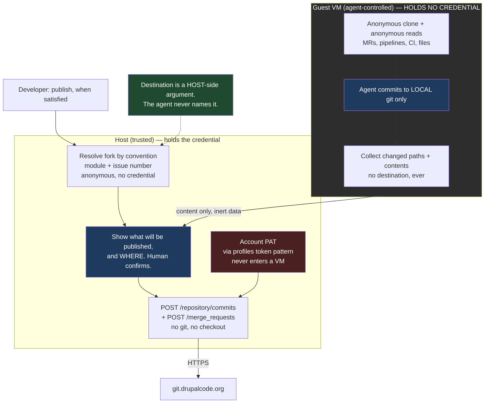

# Plan: Host-Side Drupal.org Publication via the GitLab Content API

## Original Work Order

This plan is an **extraction from plan 20**, whose work order asked for a
drupal.org contribution workflow that is simple for a Drupal developer. The
credential half of that work order is quoted below, unmodified:

> There's another issue with gitlab authentication. drupal.org works with
> repository forks - each issue gets its own unique repository to work in. That's
> great on one hand - it means that gitlab api tokens are issue, and not project
> scoped. However, it also means that every new issue needs a new gitlab
> fine-grained token, and the UI for creating those is pretty rough. It also means
> if worktrees are used, each one of them needs its own token (instead of per
> module or project).
>
> Ideally nothing is specific to a harness like claude code, so users can work well
> with other tools as they choose.

The extraction itself was directed separately:

> Yes, let's extract it into a new plan. It can be plan 21, but I'll implement it
> before doing plan 20.

Plan 20 retains the environment half — the ddev-drupal-contrib bootstrap, its
trigger surfaces, per-checkout ddev identity, the issue-number entry point, and
reset. This plan owns everything to do with credentials and publication.

## Plan Clarifications

Five refinement sessions on plan 20 established this design. The rows below are
the ones that decided *this* plan; they are reproduced here because this document
must stand alone, and because plan 20 is no longer the authority on any of them.

### Refinement session 1 — the seam, 2026-08-26

| Question | Answer | Source |
| --- | --- | --- |
| drupal.org's PAT docs say tokens are user-account scoped and push access to issue forks is granted per user, so one PAT could cover every fork. Is the per-issue token model a hard constraint or a chosen posture? | **Deliberate least-privilege.** One account-wide PAT would work technically, but an agent-controlled VM must not hold push access to the whole drupal.org account. | User |
| Where should creating and placing per-fork tokens happen? | **Host mints, guest receives** — conditional on confirming a GitLab API exists for it. *Superseded by refinement 3.* | User |
| Where does the host-held account PAT live? | `internal/profiles/token.go` establishes the pattern — config records only the *path* to a credential, and the loader refuses a file readable by group or other. The drupal.org PAT follows it. | Auto-resolved from codebase |
| Does the plan correctly distinguish GitLab's token scopes from access levels? | **No — the original plan conflated them.** They are independent axes deciding different things. Corrected. | Auto-resolved; defect in prior revision |
| *"How could use the drupalorg cli inside the VM, when the token minting needs to be on the user's workstation?"* | A valid contradiction. Resolved by evidence: the host needs **neither** the `drupalorg` CLI nor an authenticated API call to resolve a fork. See Background. | User challenge, resolved by verification |

### Refinement session 2 — multiple projects per VM, 2026-08-26

| Question | Answer | Source |
| --- | --- | --- |
| Does the multi-module case break the credential design? | No — it argues *for* it. All canonical drupal.org modules share one org directory, so a directory-scoped scheme would have given them a single shared token. | Auto-resolved from codebase |
| Can the publication entry point identify the right module in a multi-module VM? | **No — defect in the prior revision**, which derived the module from the VM's create-time `CloneURL`. It must be read from the targeted checkout instead. Corrected. | Defect in prior revision |
| Must each task be verified before it is considered complete? | **Yes.** Every task runs `/code-review --fix` and then `/simplify` before it may be marked complete. Recorded as a per-task completion gate under Self Validation. | User |

### Refinement session 3 — the probe came back negative, 2026-08-27

| Question | Answer | Source |
| --- | --- | --- |
| Did the validation probe settle the two open drupal.org unknowns? | **Yes, both negative.** `access_level = 30` (Developer) on a real issue fork, below the Maintainer that creating a project access token requires; and `POST .../access_tokens` is blocked at drupal.org's edge for everyone. Per-issue-fork *project access* tokens are impossible. | Probe output |
| Could scripting the GitLab web UI work around the blocked endpoint? | **No.** The obstacle is the role, not the API: at Developer there is no access-tokens page to script. It would also require the developer's SSO session or password — a credential more dangerous than the one being avoided. | User proposal, resolved by verification |
| What is the actual requirement behind wanting narrow tokens? | *"Developers may have push access to highly used projects. An agent with a PAT could push to a project with bad code and affect 10s of thousands of sites."* Blast radius containment, not tidiness. | User |
| How should the credential half proceed given that? | **Host publishes; guest holds nothing.** No credential of any kind inside the VM. | User |
| *"Do we have to push with the git protocol? Do we have to have literal files on disk? What if as a part of land we then used the gitlab API to create a commit?"* | **Yes, and it is better than the git-based version.** Verified that drupal.org routes `POST /repository/commits`, `/repository/files`, `/repository/branches`, and `/merge_requests` to GitLab while blocking only the credential-minting endpoints. One call creates the branch and lands the change set. The host needs no git repository, no checkout, and no git objects. | User idea, verified |
| Does the guest still need any drupal.org credential? | **No.** Anonymous requests returned 200 for merge requests, pipelines, branches, trees, commits, issues, and raw files. The entire read loop works unauthenticated. | Auto-resolved by verification |

### Refinement session 4 — research contradicted an assumption, 2026-08-27

| Question | Answer | Source |
| --- | --- | --- |
| Is it true that GitLab PATs can never be project-scoped? | **No — the plan was wrong.** That holds for *classic* PATs only. **Fine-grained access tokens** went generally available on GitLab Self-Managed in **19.2**, carry a project/group/instance **access boundary**, include a `Code: Push` permission, are **Free tier**, and intersect with the user's own permissions — so **Maintainer is not required**. Verified against git.drupalcode.org's own served documentation; the instance runs GitLab 19.x. | Research, verified independently |
| Can fine-grained tokens be minted via API? | **No.** `POST /user/personal_access_tokens` accepts only `k8s_proxy` and `self_rotate` and has no boundary parameter. Creation stays a web-UI act; only rotation is automatable. | Verified |
| Was the edge allowlist a security boundary? | **No — the plan overstated it.** `POST /api/graphql` is not blocked, and git push over HTTPS bypasses the REST allowlist entirely. DA staff note their load balancer cannot inspect request bodies. The allowlist must not be treated as containment. | Research, corrected |
| Does the DA's automation policy forbid AI-assisted merge requests? | **No.** That policy governs site access and automation registration, and contains no rule about merge requests, commits, or pushes. Disclosure attaches to *approved automation tools*. A human reviewing and publishing the agent's work is "an individual action a user could already perform". Per-MR AI disclosure is proposed in governance issue 3565917 but is **not ratified policy**. | Research |

### Refinement session 5 — the token boundary is per-project, 2026-08-27

| Question | Answer | Source |
| --- | --- | --- |
| Does git.drupalcode.org's token UI expose fine-grained tokens at all? | **Yes.** The Generate token dropdown offers "Fine-grained token", the form exposes Group and project access, and resource `Code` -> permission `Push` is present. | User, on a real account |
| Can the boundary select a single issue-fork project? | **Yes**, and a token so bounded was created and used to push to an issue fork successfully. | User, verified by pushing |
| Can the boundary select the `issue` group ("Issue forks")? | **No — projects only.** Corroborated by the access probe: `group_access` is `null` on an issue fork, so the developer's access there is a direct project membership and they are not a member of the `issue` group — and GitLab offers only boundaries the user belongs to. | User; corroborated by probe |
| Does a higher access level on a maintained module reopen project access tokens? | **No, and the finding is structural rather than sampled.** The developer is a full maintainer of dubbot, created a brand-new issue and its fork, and still holds `access_level: 30` (Developer) on that fork. If the parent project's own maintainer is Developer on a fork they created themselves, no drupal.org user can hold Maintainer on an issue fork. | User probe |
| Which credential design is built? | **Host-side publication only.** The per-fork fine-grained token is recorded as a manual escape hatch a developer may set up for themselves, but no sand machinery is built for it. | User decision |
| What remains unverified about the token option? | The negative control — that a token bounded to one issue fork **fails** to push to a canonical `project/<module>` — has not been run. It must pass before the escape hatch is documented as safe. | Unresolved |

### Refinement session 6 — extraction to a separate plan, 2026-08-27

| Question | Answer | Source |
| --- | --- | --- |
| Should the publication feature be extracted from plan 20 into its own plan? | **Yes.** Refinement 5 declined a split because two mutually-exclusive credential designs were blocking decomposition, and choosing one removed that blocker. That reasoning did not address the grounds that decide it now: plan 20 itself certified, before the split, that the two mechanisms "share no code and can be built and tested independently"; every external blocker (three unanswered Drupal Association questions, the host PAT, a real account for end-to-end tests) sits entirely on the publication side; the two halves have qualitatively different test regimes, since publication validation creates **public, permanent** merge requests on drupal.org while the environment half runs wholly inside a local VM; and a combined blueprint would run to roughly twenty tasks under a heavy per-task gate. | User decision |
| Which plan is implemented first? | **This one — plan 21 — before plan 20.** | User |
| Does that ordering change anything? | **Yes, two things.** The escape-hatch documentation and its negative control move here rather than staying with plan 20, because this plan both ships first and owns the credential reasoning; a contributor meets the "why can't I just push?" question the moment publication exists. And fork resolution by convention — needed by this plan's destination selection and by plan 20's issue entry point — is built here, with plan 20 reusing it. | Derived from the ordering |
| Does this plan depend on plan 20 in any way? | **No.** Publication takes a change set from any drupal.org checkout in a guest; it does not care whether that checkout is a bootstrapped ddev project. End-to-end validation uses a hand-made checkout in a VM, since the automatic bootstrap does not exist yet. | Derived |
| Was the per-task completion gate carried over? | **Yes**, unchanged. It applies to every task generated from this plan. | Carried from refinement 2 |

## Executive Summary

A Drupal developer working in an agent-controlled VM needs a way to publish work
to drupal.org. The obvious answer — put a credential in the VM — is unacceptable,
and the reason is specific rather than general: **a Drupal developer often holds
push access to modules installed on tens of thousands of sites.** A single bad
push is a supply-chain event affecting people who never opted into anyone's AI
experiment. The credential must therefore be narrow, or it must not be there.

drupal.org makes narrow credentials unobtainable in any automatable form, and this
plan's probes established that rather than assuming it. Project access tokens
require Maintainer, and an issue fork grants Developer to *everyone* — the parent
project's own maintainer included, on a fork they created themselves — so that
route is closed permanently rather than closed to one account. drupal.org
additionally blocks `POST /projects/:id/access_tokens` at its edge, for every
caller and every project. Fine-grained access tokens *can* be bounded to a single
issue fork, and one was verified pushing successfully; but the boundary picker
offers individual projects rather than the `issue` group, and no API can create
one, so the developer would hand-build a token in GitLab's web UI for every issue
— the exact friction the work order set out to remove.

So the guest is given **no credential at all**, and publication moves to the
workstation. The guest clones anonymously, reads merge requests, pipelines, branch
lists, trees, commits, and raw files anonymously — all verified — and commits only
to its own local git. Publication happens on the host through GitLab's content API
rather than the git protocol: one `POST /repository/commits` creates the branch
and lands the whole change set with correct authorship, and a second call opens
the merge request. The host therefore needs no git repository, no checkout and no
git objects, which preserves the no-code-on-host boundary `internal/landgh` exists
to protect — nothing transits but inert data the host forwards over HTTPS without
ever writing it to a working tree or executing it.

The security property is a **split of authority rather than the strength of a
secret**: the agent decides content, the host decides destination. The target
project and branch are host-side arguments that never appear in anything the guest
produces. There is no credential in the VM to steal and no destination field in
the payload to poison, so a compromised agent cannot reach a canonical project — it
can only propose file contents for a target the human already chose, in a form the
human can read before it is sent. That reviewability is a real gain over a git
push, which publishes first and shows a diff afterwards.

## Context

### Current State vs Target State

| Current State | Target State | Why? |
| --- | --- | --- |
| An agent that can push holds a credential reaching every project the developer can push to, including modules on tens of thousands of sites | No drupal.org credential exists inside the VM at all | Blast radius. The only narrower credential drupal.org offers must be hand-made per issue and cannot be minted by API, so the safe amount that is also automatable is none |
| Publishing requires the git protocol, a checkout, and credentials wherever the push happens | The host publishes over HTTPS through GitLab's content API — no git repository, no checkout, no git objects | Keeps agent-written code off the workstation, and removes the need for any guest credential |
| An agent could push anywhere its credential reaches | The agent decides content; the host decides destination | A structural boundary: no credential in the VM to steal, no destination field in the payload to poison |
| A push publishes first and shows a diff afterwards | The payload is a readable list of paths and resulting contents, reviewable before it is sent | Human review of agent work should happen before publication, not after |
| Resolving an issue fork appears to need drupal.org tooling, which lives only in the guest | Fork URLs are derived by convention and confirmed anonymously, from the host, with no credential and no Drupal tooling | Resolves the apparent contradiction between "the host holds the credential" and "the `drupalorg` CLI is in the guest" |
| A contributor who discovers that a fine-grained per-fork token works will assume it was overlooked | Documentation says it works, says what it costs, and says what accepting it gives up | Left unexplained, this invites someone to wire a token into a guest and quietly delete the design's central property |
| sandbar has no host-side credential outside the guest-facing secrets store | The account PAT follows `internal/profiles/token.go` — a recorded path, one loader, a hard refusal of over-permissive modes | `internal/secrets` exists to deliver secrets *into* guests, which is exactly what this credential must never do |
| A task could be marked complete without a review or simplification pass | No task completes until `/code-review --fix` and then `/simplify` have run and their tests re-run | Correctness and quality gates belong at task boundaries, not as one sweep at the end |

### Background

Every finding below was established by probe, by empirical test, or by reading the
codebase. Several overturned the design that seemed obvious at the start, and they
are recorded with how they were established because more than one earlier revision
was wrong in a way that changed the design.

**CLASSIC GitLab personal access tokens cannot be restricted to specific projects
— but fine-grained access tokens can (corrected 2026-08-27).** An earlier revision
stated flatly that GitLab PATs are always account-wide. That is true of *classic*
PATs, and it is what GitLab's classic PAT documentation says, but it was wrong as
a general claim and it drove several downstream design decisions.

GitLab **fine-grained access tokens** are a separate mechanism, introduced as a
beta in 18.10 and *"generally available on GitLab Self-Managed in GitLab 19.2"*.
They carry an explicit **access boundary** — a single project, a group, or the
whole instance — and a permission set that includes *"Push to a project
repository"* under resource `Code`. They are **Free tier** and available on
**GitLab Self-Managed**, and their permissions are intersected with the user's
own, so **Maintainer is not required**: Developer on an issue fork is enough.

This was verified against git.drupalcode.org itself, which serves its own
version's documentation: `/help/auth/tokens/fine_grained_access_tokens.md` and
`.../fine_grained_access_tokens_other.md` both return 200 while a control path
404s, and `/help/update/versions/gitlab_19_changes.md` exists while
`gitlab_20_changes.md` does not — so the instance runs GitLab 19.x, at or past
the version where this went generally available.

One consequence is limiting and permanent: fine-grained tokens **cannot be
created through the API**. The self-service endpoint
`POST /user/personal_access_tokens` accepts only `k8s_proxy` and `self_rotate`
scopes and has no boundary parameter, so creation remains a web-UI act. Only
rotation is automatable.

**The boundary is per-project, not per-group (verified in the UI, 2026-08-27).**
An earlier revision hoped that because the `issue` namespace is a real group (`GET
/api/v4/groups/issue` returns `{"id":49196,"name":"Issue forks","path":"issue"}`),
one token bounded to that group would reach every issue fork while being unable to
touch any canonical `project/<module>` — one token, created once, with the
catastrophic case removed by construction. It does not work. On a real account the
Generate token dropdown *does* offer **Fine-grained token**, the form *does* expose
resource `Code` -> permission `Push`, and a boundary of a **single issue-fork
project** works — a token so bounded was created and verified by pushing to that
fork. But the boundary picker offers individual projects only; the `issue` group is
not selectable. The access probe explains why: `group_access` is `null` on an issue
fork, so a developer's Developer role there is a *direct project membership* and
they hold no membership in the `issue` group — and GitLab offers only boundaries
the user belongs to.

The practical consequence is decisive. A fine-grained token is a **per-issue-fork
credential that must be hand-built in the web UI for every issue**. Its blast
radius is excellent — one fork, tighter than the group option would have given —
but it restores in full the friction the work order named at the outset, and no
amount of sand automation can remove it, because there is no minting API to call.
That is what settled the design on host-side publication rather than on a narrower
token.

**Per-issue-fork *project access* tokens are impossible on drupal.org (proven by
probe, both halves negative).** Note the qualifier: what is closed here is the
*project access token* specifically. A per-fork **fine-grained** token is possible,
as recorded above — but it must be created by hand, once per issue.

*Nobody holds Maintainer on an issue fork — not even the parent project's own
maintainer.* A first probe returned `access_level = 30` (Developer) on an issue
fork of a module where the developer was an ordinary contributor, which left open
the possibility that a maintainer would fare better on their own module. A second
probe closed that door: on `issue/dubbot-3619492` — a brand-new issue fork, of a
module the developer fully maintains, created by that developer moments earlier —
the access level is still `30`, with `group_access: null`. If the parent project's
own maintainer is merely a Developer on a fork they created themselves, the role is
a property of how drupal.org provisions issue forks rather than of any account's
standing. GitLab requires Maintainer or Owner to create a project access token **by
any route, including the web UI**, so this path is closed for every drupal.org
user, permanently. A per-fork project access token therefore cannot be minted, and
cannot be created by hand either. Scripting the GitLab web UI — considered
explicitly — does not help: at Developer there is no access-tokens settings page to
drive, so the obstacle is the role, not the API. Such a script would also need the
developer's SSO session or password, a credential strictly more dangerous than the
token it was trying to avoid.

**The minting API exists and has a natural privilege ceiling — but is unreachable
on drupal.org, and is recorded here only as history (from GitLab API
documentation).** Two independent findings kill it: nobody holds Maintainer on an
issue fork, and drupal.org blocks the endpoint at its edge. Nothing in the current
design calls it. `POST /projects/:id/access_tokens` accepts `name`, `scopes[]`,
`expires_at`, and an optional `access_level`, and returns the token value in the
response. It must be called with a *personal* access token — "You cannot
authenticate with a project access token" — so a minted per-fork token can never
mint further tokens. The caller cannot exceed their own access level but may mint
below it. Default maximum lifetime is 365 days; rotation and revocation are also
API operations. Project access tokens require Premium on GitLab.com but are
available under any license on self-managed instances, and drupal.org is
self-managed, so the feature is not license-blocked there.

**drupal.org runs a per-path, per-method allowlist in front of the GitLab API, and
it blocks exactly the credential-minting endpoints.** This was mapped
unauthenticated, so it is a property of the platform rather than of one account:

| Endpoint | Result |
| --- | --- |
| `POST /repository/commits` | routed to GitLab |
| `POST /repository/files/:path`, `PUT` same | routed to GitLab |
| `POST /repository/branches` | routed to GitLab |
| `POST /merge_requests`, `POST /issues` | routed to GitLab |
| `GET /access_tokens` | routed to GitLab |
| `POST /access_tokens` | **blocked at the edge** |
| `POST /deploy_tokens` | **blocked at the edge** |
| `POST /deploy_keys` | **blocked at the edge** |

A blocked request never reaches GitLab at all: it returns a byte-identical 56 KB
HTML 404 from the drupal.org Drupal site, on every project tried, authenticated or
not. A routed request returns GitLab JSON. The policy this encodes is coherent and
worth stating plainly, because it shapes the entire design: **drupal.org refuses
to let anyone mint credentials through the API, while permitting every
content-write operation.** Contribution by API is the path the platform
deliberately leaves open.

`probe-drupalorg-api.sh`, alongside this plan, re-runs that map. It is one of the
validation steps below, and it exists so that a change in drupal.org's posture is
noticed deliberately rather than discovered as a publication bug.

**The edge allowlist is NOT a security boundary (corrected 2026-08-27).** An
earlier revision described the allowlist as a "coherent policy" that blocks
credential minting while permitting content writes. The first half of that reading
was too generous, and this plan does not lean on it. Two findings undercut it:
`POST /api/graphql` is **not** blocked and returns 200 unauthenticated, and git
push over HTTPS (`git-receive-pack`) reaches GitLab directly, bypassing the REST
allowlist entirely. Drupal Association staff have explained why in their own
infrastructure issue — protecting GraphQL writes the same way "would require
inspecting the request body, which is not a capability of our load balancer."

The allowlist is therefore best understood as a control on one specific REST path,
not as containment. Nothing here may treat it as a barrier that would stop a leaked
credential: **if a credential ever enters a guest, the allowlist will not save
you.** That reinforces, rather than weakens, the decision to keep credentials out
of the guest — the guarantee has to come from the credential's own boundary or
from its absence, never from drupal.org's edge.

**Everything an agent needs to read works with no credential (verified).**
Against a public fork, unauthenticated requests returned 200 for merge requests,
pipelines, branches, repository trees, commit lists, issues, and raw file contents.
Combined with anonymous `git clone`, this means a guest can do the entire
development loop — including reading CI results and merge-request feedback —
without ever authenticating. Only writes need a credential, and those are the
host's job.

**Issue forks are derivable and anonymously readable (verified empirically).**
A `ls-remote` against `git.drupalcode.org/issue/drupal-3181657.git` succeeded with
no credential presented, returning the fork's branches including one named for the
issue. Three consequences follow, and together they resolve what looked like an
architectural contradiction — that the host must act on a fork while the
`drupalorg` CLI lives only in the guest. The fork URL is derivable from the module
name (read from the targeted checkout) plus the issue number, by drupal.org's
documented `PROJECT-ISSUE_NUMBER` naming. Its existence and its branch list can be
confirmed anonymously, needing no token and no API access. And GitLab's project
endpoints accept a URL-encoded project path, so no project-ID lookup is needed
either. The host therefore requires no PHP runtime and no Drupal tooling, and
authenticates for one purpose only: publishing.

This also rules out a **guest-to-host broker**, which would have been the obvious
alternative resolution and which returns in a new form under the current design. A
broker that let the guest request a credential would have restored account-wide
push reach through the back door; a broker that lets the guest name its own
publication target gives away the destination decision the whole split of authority
depends on. Both are rejected for the same reason: the guest must not be able to
widen its own reach by asking.

**The GitLab content API can replace the git protocol entirely (from GitLab's API
documentation).** A single `POST /projects/:id/repository/commits` accepts a target
`branch`, a `start_branch` or `start_sha` to create it from, an `actions` array of
create/update/delete/move/chmod operations carrying file contents as text or
base64, and explicit `author_name`/`author_email`. So one call creates the branch
and lands a complete, correctly-attributed change set. Requests above 20 MB are
rate limited and above 300 MB rejected — irrelevant for module patches. This is
what allows the host to publish without a git repository, a checkout, or any git
objects.

**A host-side credential pattern already exists (confirmed in the codebase).**
`internal/profiles/token.go` establishes it: `profiles.yaml` is secret-free and
records only where a credential lives, `LoadToken` is the single read site, and a
file readable by group or other is refused outright rather than warned about. The
drupal.org account PAT should follow this exact pattern rather than introducing a
new store. Note that `internal/secrets` is *not* the right home — it exists to
deliver secrets into guests, which is precisely what this credential must never
do.

**Directory-scoped credentials cannot work for worktrees (verified
empirically).** Git resolves `includeIf "gitdir:…"` against `$GIT_DIR`. For a
linked worktree, `$GIT_DIR` is `<main-clone>/.git/worktrees/<name>` — not the
worktree's own directory. A test confirmed that an `includeIf` on the worktree's
path never fires, while an `includeIf` on the *main clone's* path fires from
inside the worktree. This has an unflagged consequence for sandbar's existing
GitHub support: every worktree of a repo silently inherits the main clone's token
today, and no per-worktree token is expressible through that mechanism. That
behavior is out of scope to change here, but is recorded as a follow-up.

**URL-keyed credentials solve it (verified empirically).**
`git-credential-store` files support one entry per URL including a path component,
and with `credential.useHttpPath` enabled git resolves them per-repository. A test
confirmed that distinct tokens for `issue/foo-3123456`, `issue/bar-3999999`, and
`project/foo` each resolve correctly, that an unlisted fork yields no credential at
all (fail-closed), and that resolution is identical from inside a linked worktree.

**`useHttpPath` must be host-scoped or it breaks GitHub (verified empirically).**
Enabling `credential.useHttpPath` globally causes git to send a path on every
request, and sandbar's existing path-less `github.com` store entry then stops
matching — a real BC break. A test confirmed that scoping it to
`git.drupalcode.org` preserves the GitHub entry and gives per-fork resolution
simultaneously.

*Those last three findings are retained deliberately even though this plan builds
none of that machinery.* They are expensively established, and they become
load-bearing the instant anyone sets up the documented per-fork escape hatch, or
attempts per-worktree credentials on any forge. An earlier revision claimed the
machinery was unnecessary under **either** credential design, reasoning that a
token bounded to the `issue` group would be one credential for the whole host. That
group boundary does not exist. Had the token design been chosen, it would have
needed **exactly** this machinery. It is unnecessary here because host-side
publication was chosen, not because no design needs it.

**What the VM already provides.** Every sand VM ships ddev, Docker, `mkcert`,
`glab`, and the `drupalorg` CLI — which offers `issue:get-fork`,
`issue:setup-remote`, `issue:checkout`, and the `mr:*` family. All of the read
operations were verified to work unauthenticated against a public fork, so the
guest keeps that CLI for merge-request status, pipeline logs, and diffs while
holding no credential. `internal/checkouts` already sweeps guests for git checkouts
and worktrees.

## Architectural Approach

Publication is a host-side adapter and a small guest-side collection step. It is a
sibling of `internal/landgh` and should be built as one. The whole design turns on
a single asymmetry: **content flows guest to host; destination is decided only on
the host.**

### The host-side account PAT

**Objective**: Hold one powerful credential in the one place it is safe, in a way
that cannot leak into a guest by accident.

The credential is an account-level drupal.org personal access token with API
scope, held on the workstation. It follows the pattern `internal/profiles/token.go`
already establishes rather than introducing a new store: configuration records only
the *path* to the credential file, never the value; one loader is the single read
site; and a file readable by group or other is refused outright rather than warned
about.

Placement in `internal/secrets` must be refused explicitly, and the reason
documented at the point of the decision rather than only in this plan: that package
exists to deliver secrets *into* guests. Putting this credential there would make
the one thing the entire design forbids into a one-line change that looks correct.

The credential is only ever read at the moment of an authenticated call, and only
two calls are ever authenticated: the commit and the merge request. Fork
resolution, existence checks, and branch listing use no credential at all.

### Fork resolution by convention

**Objective**: Let the host name a destination without Drupal tooling, a PHP
runtime, git, or a credential — and let plan 20's issue entry point reuse the same
resolution.

The module name is read from **the checkout being targeted** — its origin remote,
or the path the developer names — and explicitly *not* from the VM's create-time
`CloneURL`. That distinction is load-bearing and was wrong in an earlier revision:
`CloneURL` is a single value recorded once per VM, so in a VM holding several
drupal.org modules it identifies only the first, and deriving from it would publish
to the wrong fork.

Combined with the issue number, the module name yields the fork path by
drupal.org's documented `PROJECT-ISSUE_NUMBER` convention: `issue/<module>-<nid>`.
Existence and the branch list are confirmed by an anonymous fetch. GitLab's project
endpoints accept a URL-encoded project path, so no project-ID lookup is needed.

Resolution is a pure function of module name and issue number plus one anonymous
network check, which is what lets it be shared: plan 20's issue-number entry point
needs exactly the same derivation to pick a branch to check out. Because this plan
is implemented first, resolution is built here and plan 20 consumes it.

### The publication payload

**Objective**: Carry the change set as inert data, structurally incapable of
naming where it goes.

The payload is a list of repository-relative paths and their resulting contents,
plus a commit message and the developer's authorship. It carries **no destination
field of any kind** — no project, no branch, no remote, no URL. This is the central
structural claim of the design and must be enforced by the type, not by convention:
if the payload cannot express a destination, no amount of prompt injection or agent
compromise can supply one.

Paths must be validated on the host before use: repository-relative only, no
absolute paths, no `..` traversal, no path that normalises outside the tree.
Traversal-style paths are **refused**, not normalised into something plausible —
silently correcting a hostile path is how a payload ends up writing somewhere
unintended.

The payload is also the review surface, which is a genuine improvement over a git
push. A human can read the paths and the resulting contents before anything is
sent, whereas a push publishes first and shows a diff afterwards.

### Destination selection and confirmation

**Objective**: Keep the one decision the design depends on — where this goes — in
human hands, and make the dangerous case require a conscious act.

The destination is assembled entirely from host-side arguments: the target
checkout the developer names, the issue number they give, and the branch derived
from them. Nothing the guest produced participates.

Two controls sit on top of that. The publisher **refuses any destination outside
the `issue/` namespace unless the developer overrides deliberately**, so writing to
a canonical `project/<module>` — the case that motivated the entire design — cannot
happen as a default or a bug, only as an explicit act. And publication requires
explicit human confirmation showing what will change and where, in a readable form
rather than a summary count. Declining publishes nothing. No code path may publish
as a side effect of any other command.

Publication being a **human-initiated act** is also what keeps the workflow clear
of drupal.org's automation-and-bots provision: it is "an individual action a user
could already perform with a regular authenticated session", not a bot.

### The publish call

**Objective**: Land a complete, correctly-attributed change set and open a merge
request, using no git.

One `POST /projects/:id/repository/commits` creates the branch from a
`start_branch` and applies every file action in a single commit carrying
`author_name` and `author_email`. A second call opens the merge request against the
issue branch. Both endpoints are verified routed on drupal.org.

Three behaviors of the content API differ observably from a git push and must be
decided rather than discovered:

- **One call is one commit.** A multi-commit branch needs several sequential calls.
  Decide deliberately whether a change set publishes as one commit or several, and
  say which in the documentation rather than surprising contributors.
- **Commits created this way are not GPG-signed** by the developer.
- **`last_commit_id` is the only concurrency guard** if the fork moved underneath.
  Send it on update actions, and treat a conflict as a normal outcome to re-derive
  from rather than an error.

Oversized payloads must be detected before sending and explained, since the API
rate-limits above 20 MB and rejects above 300 MB.

Failure reporting is a named requirement rather than an afterthought. Because
drupal.org's allowlist can change, a blocked endpoint returns an HTML body where
JSON was expected, and that must be recognised and reported as *drupal.org refused
this request* — not as a generic API error or a misleading 404.

### The fine-grained token option, and why this plan does not build it

**Objective**: Record precisely what is given up, and state the condition under
which the decision should be reopened.

The fine-grained token is real, and this plan should not pretend otherwise. It
exists on git.drupalcode.org, it carries a `Code: Push` permission, it can be
bounded to a single issue-fork project, and a token so bounded was verified pushing
to its fork. What is not available is the **group** boundary: the `issue` namespace
cannot be selected, so there is no one-token-forever. What is on offer is one
hand-built token per issue fork.

That reduces the comparison to a single honest trade:

| | Host publishes (**chosen**) | Fine-grained per-fork token |
| --- | --- | --- |
| Credential in the guest | none | one, bounded to a single issue fork |
| Worst case if the guest is hostile | nothing | garbage pushed to that one fork |
| Canonical project reachable | no | no |
| Guest can iterate against CI directly | no — each publish is a host step | yes, ordinary `git push` |
| Setup cost | none | a manual web-UI token, **per issue** |
| Can sand automate that setup | n/a | **no** — GitLab exposes no creation API |

The token's blast radius is genuinely excellent — one fork, tighter than the group
boundary would have given. It loses on cost, and it loses on the work order's own
terms. The work order opens by naming this exact friction — *"every new issue needs
a new gitlab fine-grained token, and the UI for creating those is pretty rough"* —
and asks for it to go away. A design whose first step is a trip through that UI,
once per issue, does not answer the question that was asked; and sand cannot soften
it, because there is no endpoint to call.

Building both was considered and rejected under the PRE_PLAN scope-control hook.
The second path is not free: it would require the URL-keyed credential store,
host-scoped `credential.useHttpPath`, and per-fork placement and lifecycle — a
substantial mechanism, bought to serve a workflow the developer must hand-configure
anyway, for a pain no one has yet reported feeling.

**What is given up, stated plainly.** A contributor iterating against a failing
pipeline pushes repeatedly, and under host-side publication every one of those
iterations is a host-side confirmed step rather than a `git push`. That is real
friction on a real workflow, and it is the price of holding no credential in the
guest. This plan pays it deliberately rather than by oversight.

**The escape hatch is documentation, not code.** A contributor who wants the
in-guest loop can create a fine-grained token bounded to their issue fork and place
it in the guest themselves. The documentation should say how, and should state what
it costs: a credential then exists inside an agent-controlled VM, and while its
boundary confines it to one issue fork, drupal.org's edge will not contain it if it
leaks. Before this is written up as safe, the negative control must pass: a token
bounded to one fork must be shown to **fail** when pushing to a canonical
`project/<module>`. That test has not been run, and the documentation must not ship
until it does.

**When to reopen this.** The decision rests on one fact: token creation cannot be
automated. If the Drupal Association ever allowlists fine-grained token creation, or
if GitLab makes a group-level boundary selectable by non-members, the in-guest loop
becomes cheap and this section should be revisited.

### What this plan deliberately does not build

**Objective**: Record the omissions explicitly, so later work does not rebuild them
by reflex.

The guest never authenticates to drupal.org, so no recognized-forge entry for
`git.drupalcode.org` is added, no per-fork entries are written to the guest's
credential store, and no `useHttpPath` configuration is set.
`internal/provision/gitcred.go` is **untouched** by this plan; its
`recognizedForgeTokens` table keeps its single GitHub entry, and the existing
`GH_TOKEN` wiring is unchanged in every respect.

No guest-to-host credential broker is built, and none should be: it would restore
account-wide reach through the back door. No mechanism lets the guest name its own
publication target.

## Risk Considerations and Mitigation Strategies

Security and Trust Risks

- **The account PAT on the host is powerful, and the host publishes on its
  behalf**: Blast radius is removed from the *guest*, not from the system. The
  host still holds an account-wide credential and uses it to publish
  agent-authored content. A host-side bug that got the destination wrong would
  push agent output somewhere it should not go, and the credential's reach is
  exactly what makes that consequential.
    - **Mitigation**: The destination must be an explicit host-side argument that
      no guest-produced data can influence, and it must be shown to the human and
      confirmed before any write. Refuse to publish to anything outside the
      `issue/` namespace unless the developer overrides deliberately, so the
      dangerous case — writing to a canonical project — requires an extra,
      conscious act. Cover destination selection with tests that feed hostile
      guest payloads and assert the target is unchanged.
- **The payload is agent-authored by construction**: `internal/landgh`'s
  injection-safety invariant applies here with more force, because that adapter
  calls `gh` for metadata about a branch the guest already pushed, whereas this one
  carries the content itself.
    - **Mitigation**: Shell out or call out with an argument vector rather than a
      shell string, never interpolate guest data into a command or a URL, and make
      the payload type structurally incapable of carrying a destination. Validate
      paths as repository-relative and refuse traversal rather than normalising it.
- **Someone reintroduces a guest credential later**: The design's central property
  is an absence, and absences are easy to delete without noticing. A contributor
  who discovers that a fine-grained per-fork token works will assume it was
  overlooked.
    - **Mitigation**: Document the reasoning where the contributor meets the
      friction, not only in this plan: the token works, it is bounded to one fork,
      and it costs a manual web-UI trip per issue because no API can create one.
      Record it in `AGENTS.md` so future agent-driven work does not reintroduce it.
      Do not ship sand machinery for it until someone reports the iteration pain.
- **A leaked guest credential would not be contained by drupal.org**: If the escape
  hatch is used, the edge allowlist offers no protection — `POST /api/graphql` is
  unblocked and git push over HTTPS bypasses REST entirely.
    - **Mitigation**: State this in the escape-hatch documentation, and gate that
      documentation on the negative control passing. A boundary observed only
      permitting things has not been shown to forbid anything.

External Dependency and Policy Risks

- **drupal.org's policy bars automation without approval**: PATs may perform any
  individual action a user could perform in a session, but may not build automation
  or bots without prior Drupal Association approval. A tool that publishes
  agent-written commits sits close to that line, and a separate DA policy governs
  AI-assisted contribution specifically.
    - **Mitigation**: Keep publication a human-initiated, human-confirmed action.
      Document the policy in the user-facing guide, follow whatever disclosure the
      DA's AI policy requires for AI-assisted merge requests, and raise the design
      with the DA before promoting it widely.
- **The content API is not the git protocol, and differs in observable ways**: One
  call produces one commit, so a multi-commit branch needs several sequential
  calls; commits created this way are not GPG-signed by the developer; and
  `last_commit_id` is the only concurrency guard if the fork moved underneath.
  Requests above 20 MB are rate limited.
    - **Mitigation**: Decide deliberately whether a change set publishes as one
      commit or several, and say so in the documentation rather than surprising
      contributors. Send `last_commit_id` on update actions and treat a conflict as
      a normal outcome to re-derive from, not an error. Detect an oversized payload
      before sending and explain it.
- **The endpoint allowlist is drupal.org's to change**: The content endpoints this
  design depends on are permitted today because drupal.org allows them, not because
  they are guaranteed. The same edge that blocks the token endpoints could block
  others.
    - **Mitigation**: Treat a blocked-endpoint response — an HTML body where JSON
      was expected — as a distinct, recognizable failure that names what happened,
      rather than a generic API error. Re-run the endpoint map as a validation step
      so a change is caught deliberately.

Implementation Risks

- **A published change is public and permanent**: Unlike a token, which can be
  revoked, a commit pushed to a shared issue fork is immediately visible to the
  Drupal community and cannot be quietly withdrawn. The failure mode of this design
  is therefore reputational and social rather than credential-theft.
    - **Mitigation**: The pre-publication confirmation is the control, so it must
      show what will change and where in a form a human can actually read, not a
      summary count. Publishing must never be the default or automatic outcome of
      any command.
- **End-to-end validation writes to real drupal.org**: Unlike the environment work
  in plan 20, this plan cannot be validated entirely inside a local VM. Its tests
  create real merge requests on a public forge.
    - **Mitigation**: Validate against an issue fork of a module the developer
      maintains, on an issue created for the purpose, so the artefacts are
      recognisable and expected rather than noise in someone else's queue. Keep the
      unit-level destination and payload tests hermetic so that only the final
      end-to-end steps need the real forge.
- **Scope creep toward a general Drupal feature set**: The adjacent temptations —
  site-install workflows, patch management, a general MR client — are numerous.
    - **Mitigation**: The deliverable is publication and the credential handling it
      needs. The `drupalorg` CLI already covers issue and MR read operations and
      should be used rather than reimplemented.

## Success Criteria

### Primary Success Criteria

1. No drupal.org credential is present anywhere in a guest VM, in any form — not
   in the environment, the credential store, a `.env`, a git config, or a shell
   history.
2. The account-level drupal.org PAT exists only on the workstation, is referenced
   in configuration by path rather than by value, and is refused outright if its
   file is readable by group or other.
3. A developer publishes a change set from a guest checkout with one host-side
   command: the branch is created on the correct issue fork, contains exactly the
   intended file changes with correct authorship, and a merge request is opened
   against the right target.
4. The host requires no PHP runtime, no Drupal tooling, and no git — no repository,
   no checkout, no working tree, no git objects. Fork resolution and verification
   use no credential; the only authenticated calls are the commit and the merge
   request.
5. Nothing the guest produces — file paths, contents, branch names, commit message
   — can alter which project or branch the host writes to. The payload type cannot
   express a destination at all.
6. Publication cannot complete without explicit human confirmation that shows what
   will change and where; declining publishes nothing, and no code path publishes
   as a side effect of another command.
7. A destination outside the `issue/` namespace is refused without a deliberate
   override.
8. Publication behaves identically whether the change set originates in a main
   clone or in a worktree at any path, including a harness-created nested one — the
   worktree's location never affects where the work lands.
9. In a VM holding several drupal.org modules, publication targets the fork of the
   module actually being worked on, never the VM's create-time clone URL.
10. A blocked or non-routed drupal.org endpoint is reported as a refusal by
    drupal.org, naming what happened, rather than as a generic API error or a
    misleading 404.
11. Existing GitHub behavior is unchanged: `internal/provision/gitcred.go` is
    untouched, a VM created with a `GH_TOKEN` authenticates exactly as it does
    today, and no stored secret changes.
12. Every task in the blueprint passes the per-task completion gate —
    `/code-review --fix`, then `/simplify`, then tests re-run — before being marked
    complete.

## Self Validation

### Per-Task Completion Gate

This gate applies to **every task** generated from this plan, and is a
precondition for marking any task complete — not a final sweep at the end.

Before a task may be considered done, and after its own tests pass:

1. Run `/code-review --fix` against the task's changes, and apply or consciously
   reject every finding. This pass hunts correctness defects.
2. Then run `/simplify`, and apply or consciously reject its findings. This pass is
   quality only — reuse, simplification, efficiency — and deliberately does not look
   for bugs, which is why it runs second rather than instead.
3. Re-run the task's tests afterwards. Both commands modify the working tree, so a
   green result from before they ran is not evidence the task is still correct.

A task whose gate has not been run is not complete, regardless of whether its
functional work appears finished.

One point of possible confusion is worth pre-empting: these are Claude Code
commands, and this plan requires strict harness neutrality in what sandbar *ships*.
There is no contradiction. Harness neutrality constrains the workflow delivered to
Drupal developers, not the tooling used to build sandbar. An implementer working in
a different harness should run that harness's closest equivalent review and
simplification passes; the requirement is the two passes and their order, not these
two command names.

### Post-Implementation Validation

These steps inspect the real system and must be executed after implementation.
Several require a real drupal.org account, a real issue fork, and a host PAT.
Because plan 20 has not been implemented, the guest-side checkout used by these
steps is created by hand — an ordinary `git clone` of a drupal.org module and a
`git worktree add` — rather than by any sand bootstrap.

1. **Re-probe the drupal.org access ceiling.** Using a real drupal.org account,
   query the GitLab API for the caller's access level on an issue fork **of a module
   that account maintains**, and attempt a token-creation call against it. Both came
   back negative and are not expected to change: the access level is Developer (30)
   even for the parent project's own maintainer on a fork they created themselves,
   and `POST .../access_tokens` is blocked at the edge for everyone. Use the
   maintained-module variant specifically — the weaker probe, against a module the
   account merely contributes to, cannot distinguish "this account is not privileged
   enough" from "no account can be".
2. **Re-run the endpoint map.** Run `probe-drupalorg-api.sh` and confirm the content
   endpoints this design depends on still route to GitLab and that the credential
   endpoints are still blocked. A change here is a platform change and must be
   noticed deliberately rather than discovered as a bug.
3. **Verify fork resolution needs no credential.** With no credential available,
   resolve a real issue number plus module name to a fork path by convention and
   list its branches. Confirm success and confirm the issue branch appears. This is
   the check that keeps the host free of Drupal tooling.
4. **Verify the PAT loader's file-mode refusal.** Point configuration at a PAT file
   readable by group, then by other, and confirm the loader refuses outright rather
   than warning. Confirm the token value never appears in configuration, in logs, or
   in any error message.
5. **Verify the PAT never reaches a guest.** After a publish, search a provisioned
   VM exhaustively — environment, credential store, per-directory `.env` files, git
   config, shell history — and confirm the account PAT is absent in every form.
6. **Verify publication end to end.** From a real issue worktree with real changes,
   publish. Confirm a branch is created on the correct issue fork, that it contains
   exactly the intended file changes with correct authorship, and that a merge
   request is opened against the right target. Verify from a clean anonymous clone,
   not from the machine that published.
7. **Verify publication requires human confirmation.** Confirm the publish path
   cannot complete without an explicit confirmation, that declining publishes
   nothing at all, and that no code path publishes as a side effect of any other
   command.
8. **Verify no git artefacts reach the host.** During and after a publish, confirm
   the workstation created no git repository, no checkout, and no working tree for
   the guest's code, and that nothing from the guest was executed on the host.
9. **Verify the split of authority under adversarial input.** Confirm that nothing
   the guest produces — file paths, contents, branch names, commit message — can
   alter which project or branch the host writes to, and that the host refuses a
   destination outside the `issue/` namespace without a deliberate override.
10. **Verify the destination cannot be influenced by a hostile payload.** Plant a
    hostile payload in the guest — file paths and contents containing another
    project's path, absolute paths, `..` traversal, and shell metacharacters — then
    publish. Confirm the change lands on the intended fork and branch only, that no
    request is made against any other project, and that traversal-style paths are
    refused rather than normalised into somewhere unintended.
11. **Verify publication targets the right module.** With two drupal.org modules
    cloned in one VM, work an issue on the second and publish. Confirm the change
    lands on that module's fork — not the first module's, and not the VM's
    create-time clone URL.
12. **Verify publication is location-independent.** Publish the same change set
    from a main clone and from a worktree at a nested path, and confirm both land
    identically. The worktree's location must not affect the destination.
13. **Verify the guest cannot publish, by trying.** From inside a VM, attempt a
    direct `git push` to the issue fork, to a different issue fork, and to the
    canonical project. All three must fail for want of any credential. Then attempt
    the same through the `drupalorg` CLI and `glab`. This is the check that the
    blast-radius claim is structural rather than merely intended.
14. **Verify the guest's read loop still works with no credential.** In the same VM,
    confirm an anonymous clone, a merge-request read, a pipeline status read, and a
    raw file fetch all succeed. The loop working *and* step 13 failing are both
    required; either alone proves nothing.
15. **Verify a blocked endpoint is reported honestly.** Point the publisher at an
    endpoint known to be blocked and confirm it reports that drupal.org refused the
    request — recognising an HTML body where JSON was expected — rather than
    surfacing a generic API error or a misleading 404.
16. **Verify content-API edge behaviors.** Confirm an oversized payload is detected
    and explained before sending, and that a `last_commit_id` conflict — produced by
    moving the fork underneath a prepared publish — is reported as a re-derivable
    conflict rather than a failure.
17. **Run the fine-grained token's negative control, before documenting the escape
    hatch.** Most of this check is already answered and must not be re-litigated:
    the UI does expose fine-grained tokens, `Code: Push` exists, a single issue-fork
    project is a selectable boundary, the `issue` group is **not**, and a
    fork-bounded token pushes to its fork successfully. What has **not** been run is
    the negative control that carries the whole blast-radius claim: take a token
    bounded to one issue fork and attempt a push to a canonical `project/<module>`
    the developer maintains. It **must** fail. Until it does, the escape hatch stays
    undocumented.
18. **Run the existing suite.** `go test ./... -race` must pass, and coverage must
    not fall below the committed floor enforced in CI.

## Documentation

Yes — this plan requires documentation updates, both human- and agent-facing.

- **`docs/reference/security-model.md`** — document the agent-decides-content /
  host-decides-destination split, why no drupal.org credential enters a VM, and the
  blast-radius reasoning behind it: a contributor may hold push access to modules on
  tens of thousands of sites, so the only safe credential in an agent-controlled VM
  is none. Also state the limit honestly — the host still holds a powerful
  credential and publishes agent-authored content with it, and drupal.org's edge
  allowlist is not a containment boundary.
- **A user-facing guide to publishing** under `docs/using-sand/`, covering how a
  change set gets from a guest checkout to a merge request, what the confirmation
  shows, what one publish produces (one commit or several — whichever the
  implementation chooses), and the fact that commits published this way are not
  GPG-signed. Written for someone who knows Drupal and not sandbar. When plan 20
  lands, this becomes part of the end-to-end drupal.org guide rather than a separate
  page.
- **An honest answer to "why can't I just push?"**, placed where the contributor
  meets the friction rather than buried in a security page. A fine-grained token
  bounded to one issue fork demonstrably works, so a contributor who finds that out
  will assume it was overlooked. Say that it works, that it is bounded to a single
  fork, and that it costs a manual web-UI token per issue because GitLab exposes no
  API to create one. Describe the manual escape hatch and what accepting it gives up
  — a credential inside an agent-controlled VM, which drupal.org's edge will not
  contain if it leaks. **Do not write this up until validation step 17 has passed.**
- **`docs/using-sand/secrets.md`** — state plainly that drupal.org work needs no
  guest secret at all, and why: the credential lives on the workstation and the VM
  never authenticates to drupal.org. This is a notable exception to the page's whole
  premise and should not be left implicit.
- **`docs/reference/files-and-state.md`** — document the host-side account PAT file,
  its required mode, and that it is deliberately not part of the guest secrets
  store.
- **`AGENTS.md`** — describe the publication mechanism and the reason no drupal.org
  credential belongs in a guest, so future agent-driven work does not reintroduce
  one.
- **drupal.org policy** — record, in the user-facing guide, that publication is a
  human-initiated action under drupal.org's PAT policy, and note that the DA has not
  been formally consulted.
- **Follow-up record** — the pre-existing behavior that GitHub worktrees inherit the
  main clone's token, uncovered during this investigation and deliberately left
  unchanged for compatibility, should be filed rather than lost.

## Resource Requirements

### Development Skills

Go, for the credential handling and the publication client. Working knowledge of
GitLab's REST API, specifically the repository-commits and merge-requests
endpoints. Familiarity with `internal/landgh`'s injection-safety invariant and with
the `internal/profiles/token.go` credential pattern. Enough Drupal contribution
experience to judge whether the resulting publish step is what a contributor
actually needs. Working knowledge of git's credential subsystem is needed only for
the documented escape hatch, not for the build.

### Technical Infrastructure

A workstation with a host PAT file at the correct mode. A provisioned sand VM with
a hand-made drupal.org checkout for the guest-side steps. Network access to
`git.drupalcode.org`. `glab` on the host for the endpoint probe.

### External Dependencies

A real drupal.org account with push access to at least one real issue fork —
preferably a fork of a module the account maintains, so the access-ceiling probe
and the token negative control are conclusive — and an account-level PAT with API
scope held on the workstation. End-to-end validation cannot be done without both,
and it creates public, permanent artefacts on drupal.org. The Drupal Association
should be consulted before this is promoted widely; endpoint availability is
established by probe and needs re-checking rather than discovering.

## Integration Strategy

Publication is a sibling of `internal/landgh` and should be built as one: a
host-side adapter that runs only on the workstation, takes a small structured
input, and shells out or calls out with an argument vector rather than a shell
string. `landgh`'s injection-safety invariant applies with more force here, since
the payload is agent-authored by construction. The difference is that `landgh`
calls `gh` for metadata about a branch already pushed by the guest, whereas this
adapter carries the content itself — so the destination must come from host-side
arguments alone, and never from anything the guest produced.

The host-side account PAT follows the credential pattern
`internal/profiles/token.go` already establishes — a path recorded in
configuration, one loader, and a hard refusal of over-permissive file modes —
rather than introducing a new store or extending the guest-facing secrets store.

`internal/provision/gitcred.go` is **untouched**. Its `recognizedForgeTokens` table
keeps its single GitHub entry, and no `useHttpPath` configuration is written into
any guest.

Collecting the change set from the guest uses sandbar's existing guest-execution
and transfer paths rather than introducing new plumbing. `internal/checkouts`
already sweeps guests for git checkouts and worktrees and may later surface
per-checkout publication state, but that is not required here and is deliberately
left out.

Nothing in this plan changes the Lima, Proxmox, or remote-SSH provider layers, the
TUI's board model, or the create form's existing fields.

**Relationship to plan 20.** This plan is implemented first and depends on nothing
in plan 20. The dependency runs the other way: plan 20's issue-number entry point
reuses the fork resolution built here rather than reimplementing the
`PROJECT-ISSUE_NUMBER` convention a second time. Plan 20 also inherits the property
this plan establishes — that the guest holds no drupal.org credential — and must
not weaken it.

## Notes

The work order's framing — "gitlab api tokens are issue, and not project scoped" —
turned out to be right about the shape and wrong about the mechanism, and the
mechanism is what decided the design. Each issue fork is a separate *project*, so
per-issue scoping is natural in principle. Two of the three ways to exploit that are
closed: a *classic* personal access token cannot be restricted to a project at all,
and a *project access token* requires Maintainer, which no one holds on an issue
fork. The third — a **fine-grained** access token bounded to one fork — genuinely
works, and was verified pushing. It fails on economics rather than capability:
GitLab exposes no API that can create one, and the boundary cannot be widened to the
`issue` group, so every issue costs a manual trip through the web UI. That is why
this plan publishes from the host instead of narrowing a token, and it is worth
carrying into the documentation, because "the secure option exists but cannot be
automated" is a far less obvious conclusion than "the secure option does not exist."

The corollary is worth stating for anyone who revisits this: the deciding constraint
is drupal.org's *token-creation* surface, not GitLab's token model. If the Drupal
Association ever exposed fine-grained token creation by API, or if a group-level
boundary became selectable by non-members, the in-guest push loop would become cheap
and this decision should be reopened.

The finding that actually decided the plan is blunt: **on drupal.org, every
credential that is safe enough to hand an agent is one a human must create by hand,
one issue at a time.** Once that is true, the cheapest secure design is not a better
token but no token — which is why publication moved to the host, and why the two
halves of the original work order turned out to have separate answers rather than
the single shared one the earlier revisions expected. That separation is also what
made this extraction from plan 20 clean.

### Known unresolved gaps

Carried deliberately rather than papered over. Downstream task generation should
treat these as known, not as oversights.

- **The fine-grained token's negative control has not been run.** A token bounded to
  a single issue fork has been verified *permitting* a push to that fork; it has not
  been verified *refusing* a push to a canonical `project/<module>`. This blocks
  nothing in the build, which places no token in a guest, but the manual escape hatch
  must not be documented as safe until it passes.
- **The in-guest iteration loop is a known, accepted cost.** Responding to a failing
  pipeline means a host-side confirmed publish per attempt rather than a `git push`.
  This is a deliberate trade and the most likely source of contributor complaint. If
  it bites in practice, the reopening condition is recorded above.
- **The Drupal Association has not been consulted, on three separate questions.**
  Whether host-side publishing via the commits API is acceptable under the automation
  policy given a human confirms each publish — the reading here is that it is "an
  individual action a user could already perform", but that is an inference and not a
  ruling. Whether they would allowlist `POST /projects/:id/access_tokens` — worth
  asking only if the escape hatch ever becomes a supported path. And whether
  AI-assisted merge requests must be disclosed — governance issue 3565917 proposes it
  but it is not ratified. None block building; all should be settled before this is
  promoted widely.
- **Whether a change set publishes as one commit or several is not yet decided.**
  The content API makes one call one commit. The choice is a product decision with a
  documentation consequence, and it should be made during task generation rather than
  fallen into.

### Change Log

- **2026-08-27 (created by extraction from plan 20)**: The publication and credential
  half of plan 20 was extracted into this plan, at the user's direction, to be
  implemented first. The grounds were that plan 20 itself certified the two mechanisms
  share no code and can be built and tested independently; that every external blocker
  — three unanswered Drupal Association questions, the host PAT, a real account for
  end-to-end tests — sits entirely on this side; that the test regimes differ in kind,
  since validation here creates public, permanent merge requests while plan 20's runs
  wholly inside a local VM; and that a combined blueprint would have run to roughly
  twenty tasks under a heavy per-task gate. Because this plan ships first, two items
  moved here that an earlier analysis had assigned to plan 20: the "why can't I just
  push?" documentation with its escape hatch, and the fine-grained token negative
  control that gates it. Fork resolution by convention is also built here, with plan
  20 consuming it. All findings are carried unchanged from plan 20's five refinement
  sessions; nothing was re-decided during the extraction.
