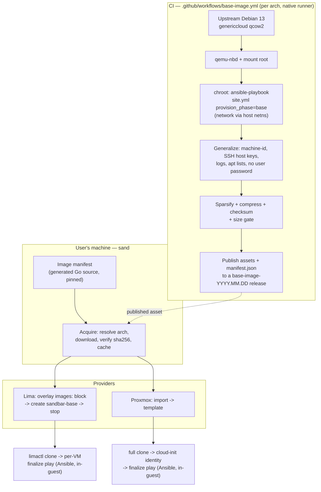
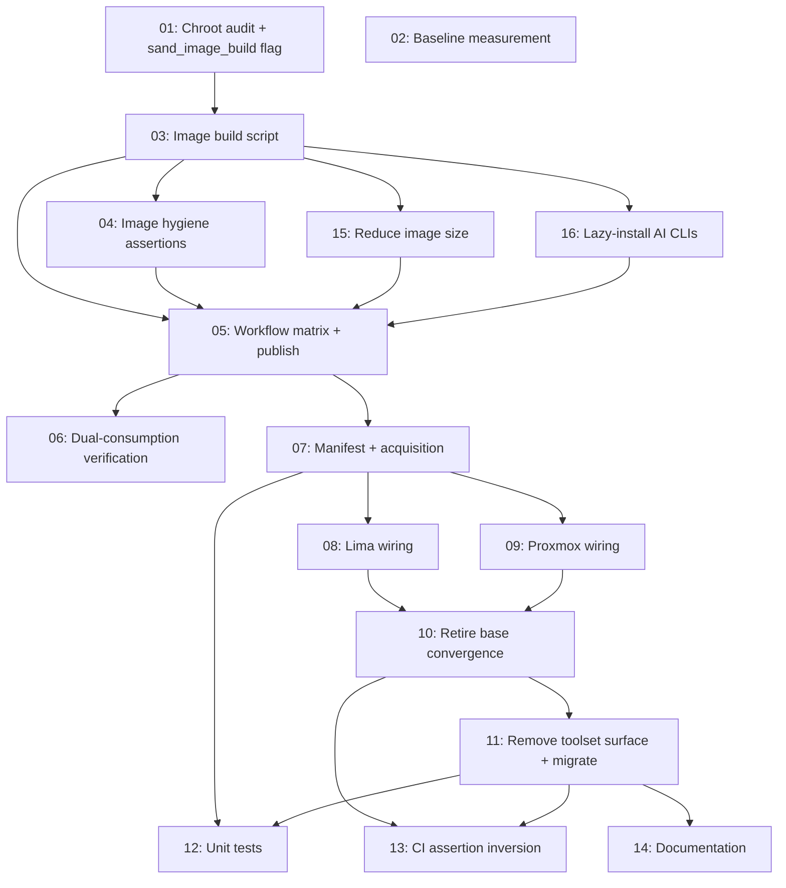

# Plan: Baked Base Images — Ship Prebuilt Guest Images Instead of Building Them On First Run

## Original Work Order

> I would like to switch from a model where users apply an ansible playbook locally at all, to one where we provide fully baked built images. I think this means we would need to provide base images for lima on macos / arm, lima on linux amd64 and arm64, and proxmox on amd64. We would just have one image with all tools - no more checkboxes to select. This is only worth it if it makes first installs faster for users (and saves us from having to constantly rebuild base images on updates too). We'd also need to have free storage in github releases without issue. We'd still need some facility for local builds of images for sandbar development of itself. I think this would also replace or combine with the existing PR that has a plan for "golden images".

## Plan Clarifications

| Question | Answer |
| --- | --- |
| Free GitHub arm64 runners expose no `/dev/kvm`, so an arm64 image cannot be built inside an accelerated VM on free CI. How should images be built? | **Rootfs build, no VM.** Run the existing Ansible roles against a mounted image root on a native per-arch runner (`ubuntu-latest` for amd64, `ubuntu-24.04-arm` for arm64), then publish the resulting qcow2. Needs no virtualization on either arch. This is an extension of the technique `.github/workflows/base-image.yml` already uses in this repo. |
| What happens to PR #70 / plan 17 ("golden VM templates" — snapshot a configured VM and clone from it)? | **Combine.** Baked images replace the locally *built* `sandbar-base`, and PR #70's user-facing snapshot/clone templates remain a layer on top. This plan supersedes PR #70's base-image assumptions but not its feature; the clone-from-a-stopped-instance machinery is exactly what makes a downloaded image usable. PR #70's already-written `internal/provider/proxmoxtemplate.go` is unaffected. |
| Should Ansible still run on the user's machine for the per-VM finalize step? | **Ansible stays — and it never ran on the user's machine to begin with.** The survey of the current code established that `ansible-playbook` is installed *inside the guest* and run with `--connection=local` (`internal/provision/provision.go:55-67`); the host only ships a mount/tar of the playbook. Keeping Ansible for finalize therefore costs the user nothing locally, and preserves the natural extension point the user is interested in. _(User's stated lean: "I'm tempted to keep ansible and let it grow so that users could add ansible config to their repos to be automatically applied." That extension is **out of scope here** — see Notes — but this decision keeps the door open.)_ |
| Removing the tool-selection checkboxes changes existing saved configs. How should that break be handled? | **Migrate with warning.** Old `toolset_*` / `With*` fields are detected, a one-time notice explains that every image now ships all tools, and the config is rewritten without them. Existing VMs keep running untouched. |
| The work order lists four image targets (lima/macos-arm, lima/linux-amd64, lima/linux-arm64, proxmox/amd64). Is that the real artifact count? | **No — two.** The artifact is a *guest* image, and the guest is Debian 13 either way, so the host OS is irrelevant: Lima on macOS/arm64 and Lima on Linux/arm64 consume the *same* arm64 qcow2. Proxmox/amd64 and Lima/amd64 share the amd64 one. The matrix is `{amd64, arm64}`. Confirming that one image boots under both Lima and PVE is an explicit task, not an assumption. |
| Is "free storage in GitHub Releases without issue" actually true? | **In aggregate yes, per-file no.** GitHub documents no limit on total release size and no bandwidth limit, and allows up to 1000 assets per release — but **each individual file must be under 2 GiB**. See the dedicated question below; this was raised as a possible blocker and is not one. |
| Does "one image with all tools" mean the AI CLIs are baked in too? | **No — Claude Code and Codex install on first use.** They are the two largest items in the image (Codex 318 MB, Claude 214 MB — 532 MB combined, more than the JDK), and they release far more often than images are rebuilt. Baking them in means every VM ships a stale binary that immediately updates itself, so users would pay ~532 MB of download for content with no shelf life. Each gets a small shim that installs the real tool on first invocation; all of their *configuration* (settings, onboarding seed, `config.toml`, the clipboard shims) stays baked in. This is a refinement of the "one image with all tools" goal, not an exception to it: the tools are still there and still require no user choice — only the binary fetch is deferred to the moment of first use. _(User decision: "install it on first use. We should do the same with claude code. They update so often that whatever we ship will be stale.")_ |
| Could the 2 GiB per-asset limit block the plan outright? | **No.** Estimated compressed size for an all-tools image is ~1.2-1.6 GiB (from ~3.2-4.0 GiB of installed content), so it likely fits — but without comfortable margin, which is why it is measured early and gated in CI rather than assumed. If it does not fit, four independent fallbacks exist, none of which change the plan's architecture: (1) zstd rather than qcow2's default zlib compression; (2) trimming large droppable content such as `golang-doc` and Go's bundled `src`; (3) splitting into parts reassembled inside sand's own acquisition layer, invisible to both providers; (4) publishing to **GHCR** as an OCI artifact, which is free for public packages and has no comparable per-file ceiling. The constraint shapes one component; it is not a premise the plan rests on. |

## Executive Summary

Today, the very first `sand create` on a new machine builds the shared base image from scratch: Lima boots a stock Debian cloud image, a bootstrap script installs `ansible-core` and friends inside the guest, and then the full base playbook runs in-guest — five APT repositories, one thirty-package transaction, three `curl | sh` vendor installers, and several downloaded binaries. That is the single slowest thing sandbar ever does to a new user, and it is repeated on every machine, for every user, forever. Worse, the base is keyed on a content hash of the playbook fileset (`internal/provision/baseversion.go:121-127`), so shipping any playbook change obliges users to rebuild — and because a *released* binary extracts the playbook to a fresh temp directory each run, an upgraded binary's base is un-convergeable by construction and gets rebuilt from scratch (`internal/provision/baseoverlay.go:20-24`).

This plan moves that work to CI, once per image release, and turns first create into a download-and-clone. The project already does exactly this for Proxmox: `.github/workflows/base-image.yml` bakes `qemu-guest-agent` into a Debian genericcloud qcow2 using `qemu-nbd` plus a `chroot` — never booting the guest, needing no KVM — and publishes it as a GitHub Release asset that the Proxmox provider downloads and verifies by SHA-256. The work here is to grow that proven pipeline into the real thing: mount the image root, run the *entire* base-phase playbook inside the chroot against it (a chroot shares the host network namespace, so the vendor installers and APT repos work unchanged), build it for both `amd64` and `arm64` on native runners, and publish the pair. Lima then consumes the image through an `images:` block instead of Lima's stock `template:_images/debian-13`, and Proxmox keeps the import path it already has.

The expected outcome is a first create that costs a one-time image download plus a clone plus the short finalize play, rather than a full guest build; a base that no longer churns when the binary is upgraded, because it is pinned to a released image rather than to a hash of the playbook; and a simpler product surface, with the five tool checkboxes replaced by one image that has everything. Because the payoff is explicitly conditional — the user's framing is "only worth it if it makes first installs faster" — this plan measures the before and after and treats the comparison as a success criterion, not a hope.

## Context

### Current State vs Target State

| Current State | Target State | Why? |
| --- | --- | --- |
| First `sand create` builds `sandbar-base` in-guest: Lima boots stock Debian, installs `ansible-core`, then runs the full base playbook (5 APT repos, 30-package transaction, 3 `curl \| sh` installers) | First `sand create` downloads one prebuilt qcow2, verifies its SHA-256, and clones from it | This is the whole point of the work order: move the slow, repeated, per-user work into CI where it happens once |
| The base is keyed on `PlaybookVersion` = sha256(playbook fileset) + toolset key; any playbook change makes every user's base stale | The base is keyed on a released **image version**; the playbook hash no longer drives base staleness | "Saves us from having to constantly rebuild base images on updates" — a binary upgrade must stop implying a guest rebuild |
| A released binary's base is un-convergeable by construction (fresh temp dir per run), so upgrades rebuild from scratch | Upgrades change the pinned image reference or nothing at all; no rebuild path is triggered by the binary's own version | The current behaviour is the worst case of the thing the user wants removed |
| Five tool checkboxes (`--with-claude/-ddev/-go/-java/-codex`) fan out into `toolset_*` Ansible vars and into the base's version stamp | One image with every tool; selection flags and toggles are removed, old config fields migrated with a warning | "We would just have one image with all tools - no more checkboxes to select" |
| Lima gets its image from Lima's own `template:_images/debian-13`; sand has no arch handling for Lima at all | Lima gets a sand-published image via an `images:` block carrying one entry per arch with digests; Lima still selects by host arch | The image must be ours for it to be baked; Lima's per-arch selection is reused rather than reimplemented |
| Proxmox already downloads a project-built golden image, pinned by a hand-maintained triple of URL + filename + SHA-256 constant (`internal/provider/proxmoxprovision.go:61-77`) | Both providers resolve the same generated, single-source-of-truth image manifest | Three constants kept in sync by hand is a standing bug source, and there are about to be twice as many |
| `base-image.yml` bakes only `qemu-guest-agent`, amd64 only, and the base playbook still runs on top in-guest | `base-image.yml` bakes the complete base phase, for amd64 and arm64, and nothing base-phase runs in the guest afterwards | The image has to actually contain the tools for any of this to pay off |
| Users can build a base from their working-tree playbook simply by running `sand` from a checkout (`LocatePlaybook` tier 1) | A local image build path reproduces the CI build on a developer machine; the working-tree finalize loop is preserved | "We'd still need some facility for local builds of images for sandbar development of itself" |
| No measurement of first-create cost exists in the repo | First-create wall-clock is measured on the current model and on the new one, and the comparison is recorded | The user made the whole plan conditional on this being faster |

### Background

- **The chroot build technique is already proven in this repo.** `.github/workflows/base-image.yml` mounts the qcow2 with `qemu-nbd`, finds the ext4 root via `blkid`, drops a `policy-rc.d` returning 101 so package postinsts do not try to start services, bind-mounts `dev`/`proc`/`sys`, installs, then enables units with `systemctl --root=`. It deliberately avoids libguestfs, whose `virt-*` tools are broken on the 24.04 runner (Debian #1086844). It never boots the guest, so cloud-init's first-boot behaviour is untouched. Every one of those properties is needed again here.
- **A chroot has full network access.** It shares the host's network namespace, so with `/etc/resolv.conf` in place the base playbook's APT repositories, `curl | sh` vendor installers, `glab` `.deb` download and `drupalorg.phar` fetch all work exactly as they do in-guest. This is what makes "run the real playbook at build time" viable rather than requiring an offline `.deb` closure like the current workflow's narrow `qemu-guest-agent` case.
- **Ansible already never runs on the host.** It is installed inside the guest and invoked `--connection=local` (`internal/provision/provision.go:55-67`), with variables passed on stdin to a `0600` file in `/dev/shm`. The user-facing claim "users apply an ansible playbook locally" describes where the *slowness* is felt, not where Ansible runs. Keeping Ansible for finalize is therefore free in dependency terms.
- **The base/finalize split is already an identity boundary.** `BuildExtraVars` (`internal/provision/vars.go:85-112`) sends `toolset_*` only in the `base` phase, and `user_git_user_name`, `user_git_user_email`, `project_clone_url`, `project_clone_token` only in non-base phases. The base image has never received a git identity or a clone token. That boundary is what makes the base safely *publishable* — but it is not sufficient on its own; see the generalization work below.
- **Three tasks are deliberately ungated today and must stay per-instance.** The timezone block (`roles/base/tasks/main.yml:325-420`) and `~/.tmux.conf` (`roles/user/tasks/main.yml:125-131`) run in every phase on purpose, with comments explaining why: a shared, long-lived base must not fix the clone's timezone, and a cheap re-render lets a config change reach a new VM without a base rebuild. A published image makes both arguments *stronger*, not weaker.
- **Generalization is a known, solved-once problem here.** `generalizeScript` (`internal/provider/proxmoxprovision.go:437-457`) truncates `/etc/machine-id` and re-links `/var/lib/dbus/machine-id`, because cloned machine-ids made `systemd-networkd` hand every clone the same DHCP lease. A publicly distributed image needs that and more.
- **Prior art explicitly deferred this.** Archived plan 13 ("faster base VM provisioning") states at line 419: *"Tier 3 (publishing a pre-provisioned golden image) is explicitly out of scope. Nothing here should download, host, or publish a prebuilt image. The work in this plan is nonetheless the right precursor: a leaner, single-transaction, cache-backed playbook is exactly what a published image would run on top of."* This plan is that deferred Tier 3, and it inherits a base playbook already restructured into a single consolidated APT transaction for exactly this purpose.
- **The `lima-e2e` CI job asserts the behaviour being removed.** `.github/workflows/test.yml:234-270` deliberately dirties `roles/base/tasks/main.yml` and then asserts the base was converged *in place* rather than rebuilt. Under a baked-image model there is no in-place base convergence, so that assertion inverts rather than merely relaxing.
- **Release mechanics are constrained by immutable releases.** This repo has immutable releases enabled, so assets cannot be added after publish. `base-image.yml` works around it by creating a **draft**, uploading assets, then flipping `--draft=false`. Image tags are `base-image-YYYY.MM.DD`, a namespace disjoint from release-please's `vX.Y.Z`.

## Architectural Approach

The change is a relocation of work, not a new subsystem: the base phase moves from the user's guest to CI, and a small acquisition layer appears in front of both providers. Seven components.

### Component 1: The Image Build Pipeline

**Objective**: Produce a complete, generalized, publishable all-tools guest image for each architecture, on free CI, without virtualization.

`base-image.yml` grows from a single amd64 job that installs one package into a matrix of two native jobs — `ubuntu-latest` for `amd64`, `ubuntu-24.04-arm` for `arm64` — that each run the full base phase. The existing `qemu-nbd` → `blkid` → mount → `policy-rc.d` → bind-mount scaffold is retained verbatim; what changes is what happens inside the chroot. Instead of `dpkg -i` over a prefetched `.deb` closure, the job installs `ansible-core` and the playbook's own bootstrap dependencies into the image root and runs `ansible-playbook -i localhost, --connection=local site.yml --extra-vars provision_phase=base` under `chroot`. Because the chroot shares the host network namespace, the five APT repositories, the three vendor `curl | sh` installers, the `glab` `.deb` and the `drupalorg.phar` fetch all behave as they do in-guest. The upstream source URL becomes arch-parameterized (`debian-13-genericcloud-{amd64,arm64}.qcow2`), and the published asset name follows.

Three classes of task cannot work under `chroot` and need explicit handling rather than hope. Units cannot be *started* — `policy-rc.d` already blocks that, and enabling is done with `systemctl --root=`, so any `state: started` in the base path must become enable-only at build time. `loginctl enable-linger` requires a live systemd and must be expressed as the file it creates, `/var/lib/systemd/linger/<user>`. And anything reading live system state (a running D-Bus, a populated `/run`) must be identified and gated. The approach is to introduce a single `sand_image_build` flag, default false, that the build passes and that the affected tasks consult — keeping one playbook rather than forking a build-only copy, and keeping the in-guest path byte-identical to today when the flag is false.

### Component 2: Generalization and Image Hygiene

**Objective**: Make an image that is safe to hand to the public and safe to clone many times.

This is the component with the sharpest security edge, because the current base is built privately on each user's machine and the new one is downloaded by everyone. Four things must be true of a published image that are not true of a locally built base today.

First, **no shared user password**. `roles/user/tasks/main.yml:6-19` generates a 24-character random password at build time and sets it on the user. Baked into a published image, that becomes one password shared by every sandbar user on earth. The account must ship with a *locked* password; interactive access is already by SSH key (Lima) or cloud-init-injected key (Proxmox), and `sudo` is already passwordless via `/etc/sudoers.d/nopasswd-sudo`. The "display the generated password" task (`:248-253`) goes away with it.

Second, **no baked SSH host keys**. If the image ships `/etc/ssh/ssh_host_*`, every VM created from it worldwide shares a host identity. The build must remove them and ensure the regeneration path on first boot is intact.

Third, **machine-id generalization**, reusing the established fix: truncate `/etc/machine-id` and re-link `/var/lib/dbus/machine-id`, exactly as `generalizeScript` does for Proxmox today.

Fourth, **no build residue**: APT lists, package caches, logs, shell history, and any transient credential material are cleared, and `dpkg`'s `force-unsafe-io` build-speed hack is restored to safe settings — a step the base role already performs at `roles/base/tasks/main.yml:492-496` for precisely this reason.

Because these properties are easy to regress silently and catastrophic when regressed, they are asserted by an automated check over the built image, not left to review.

### Component 3: Size, Compression, and Distribution

**Objective**: Get a multi-gigabyte artifact through a 2 GiB-per-file ceiling — or prove it fits, with named fallbacks if it does not.

GitHub imposes no limit on total release size or bandwidth and permits 1000 assets per release, but each file must be under 2 GiB. This was raised as a possible blocker for the whole plan, so it is treated as the first thing to settle empirically.

The estimate: roughly 3.2-4.0 GiB of installed filesystem content (Debian base plus base packages, Node, Docker, Go, a JDK, DDEV, Claude, Codex, uv, glab, drupalorg, mkcert), which on this class of content typically compresses to **~1.2-1.6 GiB**. That fits, but not with margin worth relying on. So the build sparsifies (zero free space, then `qemu-img convert -c`), reports the resulting size, and CI **fails the build** if an asset exceeds a conservative threshold below the hard limit. That gate is the mechanism that converts a silent future breakage into a loud one as the toolset grows.

If measurement shows the image does not fit, four fallbacks exist in preference order, none of which changes the plan's architecture:

1. **zstd compression** — qcow2's `-c` defaults to zlib; `-o compression_type=zstd` gives a materially better ratio and is read transparently by QEMU/Lima and by PVE. Cheapest fix, likely sufficient alone.
2. **Trim droppable bulk** — `golang-doc`, Go's bundled `src` tree and similar are large and removable without losing a tool.
3. **Split parts, reassembled by sand** — deliberately *not* done by splitting the published asset for the providers to fetch, because Lima's `images:` block and PVE's server-side `DownloadURL` can each fetch only one URL. The split lives entirely inside sand's acquisition layer (Component 4), which downloads parts, reassembles, verifies, and hands each provider a single local file. Invisible to both providers.
4. **GHCR instead of Releases** — publishing the image as an OCI artifact to `ghcr.io`, which is free for public packages and carries no comparable per-file ceiling. A host swap behind the same manifest abstraction.

Distribution reuses the existing, constraint-shaped release dance: create a draft release on a `base-image-YYYY.MM.DD` tag, upload every asset plus checksums, then flip it to published. Alongside the images, the build publishes a small `manifest.json` describing the release: for each arch, the asset URL, size, and SHA-256.

### Component 4: Image Acquisition on the Host

**Objective**: One pinned, verified, cached source of image truth for both providers, replacing three hand-maintained constants.

Today the Proxmox provider carries `baseImageURL`, `baseImageFile` and `defaultBaseImageSHA256` as three constants with a comment warning that they must be bumped together (`internal/provider/proxmoxprovision.go:61-77`). With two architectures and two providers that becomes four-plus constants and a standing source of drift. They are replaced by a single generated Go source file — the pinned image manifest — carrying, per architecture, the asset URL, filename and SHA-256, plus the image version string. A small `make`/`go generate` target regenerates it from a published release, so bumping the image is one command and one reviewable diff rather than a careful hand-edit.

A thin acquisition helper resolves the entry for the target architecture, returns a cached local path if the file is present and its digest matches, and otherwise downloads with progress reported through the same `io.Writer` that already feeds the TUI's job stream (`internal/ui/progress.go:39`, `internal/ui/jobstream.go`), verifying the digest before the file is considered good. A partially downloaded file must never be mistaken for a complete one. This helper is also where multi-part reassembly would live if Component 3's measurement requires it, and where a host swap to GHCR would land.

### Component 5: Provider Wiring and the Retirement of Base Convergence

**Objective**: Make both providers start from the downloaded image, and remove the machinery that existed only to rebuild and converge a locally built base.

For **Lima**, `RenderBaseOverlay` (`internal/provision/overlay.go:122-133`) stops emitting `base: [template:_images/debian-13]` and instead emits an `images:` block with one entry per architecture carrying `location`, `arch` and `digest`, letting Lima keep doing host-arch selection and download caching (or, where sand has already cached the file, a local `location` path). The read-only `/mnt/playbook` mount and the `overlayProvision` bootstrap remain — but the bootstrap shrinks, because `ansible-core`, `rsync`, `curl`, `gnupg` and `python3-passlib` are now already in the image; its idempotent guard (`overlay.go:51-101`) will simply find them present on every boot. `buildBase` (`internal/provision/provision.go:216-304`) no longer runs the base playbook: it creates the instance from the image, applies generalization-sensitive per-instance setup, stops it, and stamps the image version.

For **Proxmox**, the flow barely changes — it already downloads a golden image and imports it — but `provisionBase` (`internal/provider/proxmoxprovision.go:386-432`) drops its `runPlaybookPhase(base)` call, and the image URL comes from the manifest rather than a constant.

The removals are the larger half of this component. Base *staleness and convergence* — `ensureBaseStopped`'s four-outcome logic, `reapplyBase`, `baseConvergeable`, the 30-day apt self-refresh, `mergeToolsetVersion` and the "de-selected tools remain installed" advisory — exist solely to manage a base built from a playbook whose hash can drift. With the base pinned to a released image, the question they answer no longer exists: the only staleness is "your pinned image version differs from the instance you have", which is a simple equality check and a rebuild-from-image path. `PlaybookVersion` loses its toolset component; the base version stamp becomes the image version. The tool-selection surface (`CreateConfig.WithClaude/WithDDEV/WithGo/WithJava/WithCodex`, `ToolPtrs`, `ToolsetKey`, `ApplyToolset`, the five CLI flags, the five TUI toggles and their reset-replay counterparts) is removed, with a migration that detects the old fields in a saved config, emits a one-time notice that all images now carry every tool, and rewrites the file without them.

### Component 6: Local Image Builds and the Contributor Loop

**Objective**: Keep sandbar developable on sandbar, and keep the working-tree feedback loop that contributors rely on.

Two distinct needs, easily conflated. The first is building an *image* locally — reproducing what CI does, on a developer's machine, from a working-tree playbook. Because the CI build is a shell procedure over `qemu-nbd` and `chroot`, it is extracted into a single committed script that both the workflow and a developer invoke, with the workflow reduced to environment setup plus a call to it. On Linux/amd64 and Linux/arm64 a developer can run it directly for their own architecture; it is not expected to work on macOS, and says so.

The second is the *contributor promise* documented at `docs/contributing/ansible-playbook.md:35-38`: running `go run ./cmd/sand` from inside a checkout makes uncommitted playbook edits take effect on the very next provision, via `LocatePlaybook`'s tier-1 git-toplevel lookup. That promise survives intact for the **finalize** phase, which still runs in-guest from the located playbook. It cannot survive for the base phase, because the base is now a downloaded artifact — editing `roles/base` and re-creating a VM will no longer change anything without a local image rebuild. This is a real regression in iteration speed for base-role work, it is the honest cost of the plan, and it is documented explicitly rather than left for a contributor to discover.

### Component 7: Testing the New Model

**Objective**: Cover the paths that changed, and invert the CI assertion that encoded the old model.

The `lima-e2e` job's warm-path assertion — dirty `roles/base/tasks/main.yml`, create a second VM, assert in-place convergence (`.github/workflows/test.yml:234-270`) — tested a behaviour this plan deletes. It is replaced by an assertion of the new contract: a base-role edit does **not** trigger any base rebuild, and a changed pinned image version *does*. Unit coverage focuses on the genuinely new logic — manifest resolution and arch selection, digest verification including the rejection of a truncated or corrupt download, cache hit and miss, and the config migration that strips old toolset fields — rather than on re-testing Go's HTTP client. The image-hygiene assertions from Component 2 run in CI against every built image, which is where a security regression must be caught.

## Risk Considerations and Mitigation Strategies

Technical Risks

- **Base playbook tasks that cannot run under `chroot`**: `state: started`, `loginctl enable-linger`, and anything needing live D-Bus or a populated `/run` will fail or silently no-op in an offline root.
    - **Mitigation**: enumerate them up front as a discrete audit step against `roles/base` and `roles/user` rather than discovering them one CI failure at a time; express each as its offline equivalent (`systemctl --root= enable`, writing `/var/lib/systemd/linger/<user>` directly) behind a single `sand_image_build` flag that defaults false, so the in-guest path is unchanged when the flag is absent.
- **One image failing to satisfy both Lima and PVE**: Lima expects a cloud-init-capable image with a serial console and working `growpart`; PVE expects an importable disk with `qemu-guest-agent` present. Debian genericcloud nominally satisfies both, but "nominally" is not evidence.
    - **Mitigation**: make dual-consumption an explicit, early verification task — boot the built image under Lima and import it on PVE — before any downstream work is built on the assumption. If it fails, the fallback is two per-provider variants from one build, which costs assets but not architecture.
- **Compressed image exceeding the 2 GiB per-asset limit**: an all-tools image may not fit, and neither Lima's `images:` block nor PVE's server-side `DownloadURL` can fetch a split file.
    - **Mitigation**: measure before engineering; gate CI on a conservative size threshold so a future overflow fails loudly; then apply the Component 3 fallback ladder in order — zstd, trim, sand-side multi-part reassembly, GHCR — each of which leaves the architecture intact.
- **arm64 built on a runner with no KVM anywhere in reach**: the whole build must remain virtualization-free; any step that quietly wants a VM will fail only on the arm64 leg.
    - **Mitigation**: the technique is `qemu-nbd` plus `chroot` and never boots a guest — the same property the existing workflow already relies on; run both matrix legs from day one so an arm64-only regression cannot hide behind a green amd64 job.
- **Loss of the in-place converge safety net**: today a broken base can often be repaired by re-applying the playbook; with a pinned image the only repair is to re-download and re-clone.
    - **Mitigation**: keep a single explicit rebuild-from-image path (the existing `--rebuild` flag's natural successor) and ensure the cached image is re-verified rather than blindly reused, so a corrupt cache cannot make a rebuild loop.

Security and Distribution Risks

- **A shared user password baked into a public image**: `roles/user` generates a random password at build time; baked in, it becomes one password shared by every user of the project.
    - **Mitigation**: ship the account with a locked password and drop the password-display task; access is already by SSH key with passwordless `sudo`. Assert the locked state automatically against every built image.
- **Shared SSH host keys**: an image shipping `/etc/ssh/ssh_host_*` gives every VM worldwide the same host identity, defeating host verification.
    - **Mitigation**: remove host keys during generalization and verify first-boot regeneration; assert their absence in the built image.
- **Shared machine-id**: known to make `systemd-networkd` hand every clone the same DHCP lease.
    - **Mitigation**: reuse the established fix (truncate `/etc/machine-id`, re-link `/var/lib/dbus/machine-id`) and assert it.
- **Supply chain — users now execute a binary image we host**: the trust surface moves from "run this playbook on your machine" to "boot this disk we built".
    - **Mitigation**: pin and verify SHA-256 on every download and on every cache reuse; build only from upstream Debian genericcloud with a reproducible, committed, reviewable build script; publish checksums as release assets alongside the images; never fall back to an unverified image on digest mismatch — fail.
- **Build residue leaking into a public artifact**: caches, logs, shell history or transient credential material captured into a widely distributed image.
    - **Mitigation**: an explicit cleanup stage plus automated assertions over the built image, so hygiene is enforced by CI rather than by reviewer attention.

Product and Process Risks

- **The payoff failing to materialize**: the user made this conditional — "only worth it if it makes first installs faster". A multi-gigabyte download on a slow link could plausibly be *slower* than building in-guest.
    - **Mitigation**: measure first-create wall-clock on the current model before changing it, measure it after, and record the comparison as a success criterion. Treat a failure to improve as a finding to report, not a result to bury.
- **Contributor iteration on base roles gets slower**: the working-tree-edit-then-provision loop no longer covers the base phase.
    - **Mitigation**: ship the local image build script as a first-class, documented path in the same change that introduces the regression, and state the limitation plainly in the contributing docs rather than leaving it to be discovered.
- **Scope creep into per-repo user Ansible**: the user's stated interest in letting users drop Ansible config into their own repos is adjacent and tempting.
    - **Mitigation**: explicitly out of scope for this plan (see Notes). The decision to keep Ansible for finalize is what keeps that door open; building the door is separate work.
- **Collision with PR #70**: both touch base-image and clone machinery.
    - **Mitigation**: the combination is settled by clarification — this plan owns where the *base* comes from, PR #70 owns user-defined snapshot templates on top. PR #70's `internal/provider/proxmoxtemplate.go` is untouched here; the interaction to keep correct is that a template cloned from a baked base records the image version rather than a playbook hash.

## Success Criteria

### Primary Success Criteria

1. A `base-image-YYYY.MM.DD` GitHub Release exists carrying an all-tools Debian 13 image for both `amd64` and `arm64`, each under the 2 GiB per-asset limit, each with a published SHA-256, built by CI on free runners with no KVM and without ever booting a guest.
2. On a machine with no prior sandbar state, `sand create` produces a working VM without running the base-phase playbook anywhere: the base instance is created from the downloaded image, and only the finalize play runs in-guest.
3. Measured first-create wall-clock on a clean machine is **faster** than the current model's, with both figures recorded. (This is the user's stated condition for the work being worth doing; if it is not met, that is reported as the outcome rather than worked around.)
4. Upgrading the `sand` binary, or editing a file under `roles/base/`, does **not** trigger a base rebuild; changing the pinned image version does.
5. Every tool previously reachable via a `--with-*` flag is present in a VM created from the image, the flags and TUI toggles are gone, and a saved config containing old toolset fields loads with a one-time warning and is rewritten without them.
6. The published image is safe to distribute: no user password set, no SSH host keys, a truncated machine-id, and no build residue — each asserted automatically in CI against the built artifact.
7. The same image is consumable by both Lima (both architectures) and Proxmox (amd64), demonstrated end to end.
8. A developer can build an image locally from a working-tree playbook using a committed script, on Linux, for their own architecture.

## Self Validation

After all tasks are complete, perform these concrete checks:

1. **Record the baseline first.** Before the provider wiring lands (or against a `main` build), on a machine with no `${LIMA_HOME}` state, run `time sand create baseline-vm` and record the wall-clock figure. This is the number criterion 3 compares against, and it cannot be recovered after the fact.
2. Trigger the image workflow via `gh workflow run base-image.yml` and confirm both matrix legs succeed. Download both published assets and confirm `sha256sum -c` passes against the published `.sha256` files, and that each asset is under 2 GiB (`ls -l`).
3. Inspect the built image's hygiene directly: mount it with `qemu-nbd` and confirm `passwd -S <user>` in the offline root reports a locked password, `ls /etc/ssh/ssh_host_*` finds nothing, `/etc/machine-id` is zero-length, and `/var/lib/apt/lists/` holds no package lists.
4. Confirm the tools are actually baked: in the mounted root, check for `node`, `docker`, `ddev`, `go`, a JDK, `claude`, `codex`, `glab`, `drupalorg`, `uv` and `mkcert` at their expected paths.
5. On a clean machine (no `${LIMA_HOME}`, no cached image), run `time sand create fresh-vm`. Confirm the output shows a download-and-clone rather than a base playbook run, confirm no `TASK [base :` banners appear for the base phase, and record the wall-clock for criterion 3.
6. Shell into `fresh-vm` and run each tool's version command (`node --version`, `docker --version`, `ddev --version`, `go version`, `java -version`, `claude --version`, `glab --version`, `drupalorg --version`, `uv --version`) confirming all succeed.
7. Confirm per-VM identity still applies: check `hostname` matches the VM name, `git config user.name` and `user.email` are the configured identity, `/etc/timezone` is the host's zone, `~/.tmux.conf` exists, and `loginctl show-user <user>` reports `Linger=yes`.
8. Create a **second** VM and confirm it reuses the cached image and the existing base instance — no second download — and completes materially faster than the first.
9. Confirm criterion 4 by touching a file under `roles/base/`, running `sand create third-vm`, and verifying no base rebuild occurs and no image is re-downloaded.
10. Confirm the migration: write a config file containing the old `WithClaude`/`WithGo` style toolset fields, run `sand`, and verify a one-time warning appears, the VM still creates, and the config on disk has been rewritten without those fields. Confirm `sand create --help` no longer lists any `--with-*` flag.
11. Confirm the arm64 leg end to end on an arm64 host (macOS/Apple Silicon or Linux/arm64): `sand create arm-vm`, then verify `uname -m` reports `aarch64` inside the guest and the tool checks from step 6 pass.
12. Run the Proxmox path against a real PVE target with the opt-in e2e suite, confirming the amd64 image imports, templates, clones, and finalizes without a base playbook run.
13. Run the local build script on a Linux host from a working-tree checkout with a deliberate marker change in `roles/base`, and confirm the produced image contains that marker.
14. Run the full unit suite and the `lima-e2e` job, confirming green including the inverted base-staleness assertion.
15. Confirm the docs are true: follow `docs/getting-started/first-vm.md` and `how-it-works.md` as written and verify each stated step matches observed behaviour.

## Documentation

- `docs/getting-started/how-it-works.md` — the page is currently a description of the two-pass local build, including a mermaid diagram of it. It needs rewriting around download-and-clone plus finalize. (Note two statements here are *already* stale independent of this plan — that finalize runs `apt upgrade`, and that the VM always restarts at the end of finalize — and should be corrected while the page is being rewritten.)
- `docs/contributing/ansible-playbook.md` — the embed/mount/rsync/phase mechanism, the three-phase table, and above all the working-tree-edit promise at lines 35-38, which must be narrowed explicitly to the finalize phase and paired with the local image build path.
- `docs/contributing/releases.md` — currently does not mention `base-image.yml` at all; needs a section covering image releases, the `base-image-YYYY.MM.DD` tag namespace, the draft-then-publish dance forced by immutable releases, and how to bump the pinned manifest.
- `docs/using-sand/cli-reference.md` — remove the five `--with-*` flags and the "configures the SHARED base image" note, update `--rebuild` semantics, refresh the pasted help text.
- `docs/getting-started/available-tools.md` — all tools are now always present; the `--with-codex` opt-in note goes away.
- `docs/getting-started/first-vm.md` — the "first VM builds a shared base image, which can take a while" passage becomes a one-time image download.
- `docs/using-sand/proxmox.md` — the `base_image` row and the "why the default image is a project-built one" admonition need updating now that *both* providers work this way.
- `docs/reference/troubleshooting.md` — the stale-base and `--rebuild` guidance changes shape; add image download/verification failure modes.
- `docs/reference/files-and-state.md` — add the image cache location; update the base-version stamp description.
- `docs/reference/security-model.md` — add the image supply-chain posture: what is baked, what is generalized per VM, and how the download is verified.
- `AGENTS.md` — update if the base-version stamp conventions or the playbook-fileset invariant (currently pinned across four locations by `TestGuestSyncCopiesOnlyThePlaybook`) change shape.

## Resource Requirements

### Development Skills

- Go — provisioning layer, image acquisition and verification, provider wiring, config migration, CLI and TUI surface removal.
- Ansible — auditing `roles/base` and `roles/user` for chroot compatibility and introducing the build-time flag.
- GitHub Actions — matrix builds on native per-arch runners, release publishing under immutable-release constraints.
- Linux image plumbing — `qemu-nbd`, `chroot`, offline `systemctl --root=`, sparsification and qcow2 compression, image generalization.
- Bubble Tea / Lip Gloss — removing the toolset toggles and updating the affected golden snapshot tests.

### Technical Infrastructure

- GitHub-hosted `ubuntu-latest` (amd64) and `ubuntu-24.04-arm` (arm64) runners — both free for public repositories; neither exposes `/dev/kvm`, which the build does not need.
- GitHub Releases as the artifact host — no total-size or bandwidth limit, 1000 assets per release, 2 GiB per file. GHCR is the named fallback host.
- Upstream Debian 13 genericcloud qcow2 images for both architectures.
- A real Proxmox VE target for the opt-in `proxmoxe2e` suite, and an arm64 host (Apple Silicon or Linux/arm64) for arm64 verification.

## Integration Strategy

The change lands against two existing pieces of work and must stay coherent with both.

**PR #70 / plan 17 (golden VM templates)** is combined rather than replaced. That plan's subject is *user-defined* templates — snapshot a configured VM, clone new VMs from it — and its central mechanic is that every VM is already created by cloning a stopped Lima instance. This plan changes only where the *base* stopped instance comes from: a downloaded image instead of an in-guest playbook build. The two compose directly. The one interaction to keep correct is provenance: a template's recorded version stamp becomes the image version rather than a playbook content hash. PR #70's `internal/provider/proxmoxtemplate.go` needs no change here.

**Archived plan 13 (faster base VM provisioning)** named this work as its deferred Tier 3 and deliberately built toward it — the single consolidated APT transaction and cache-backed playbook it produced are exactly what makes a chroot build tractable. Nothing from plan 13 is undone; its optimizations now run once in CI instead of once per user.

## Notes

- **Out of scope: per-repo user Ansible.** The user's stated interest — "let it grow so that users could add ansible config to their repos to be automatically applied" — is a genuine and appealing direction, and the decision to retain Ansible for the finalize phase is what keeps it available. Building it is separate work and is deliberately not planned here, per the YAGNI and scope-control rules in `PRE_PLAN.md`.
- **The artifact count is two, not four.** The work order anticipated four images (lima/macos-arm, lima/linux-amd64, lima/linux-arm64, proxmox/amd64). Because the artifact is a *guest* image and the guest is Debian 13 regardless of host OS, the real matrix is `{amd64, arm64}`. Whether one image serves both Lima and PVE is verified early rather than assumed.
- **"Users apply an ansible playbook locally" was never literally true.** Ansible is installed in the guest and run with `--connection=local`; the host only provides the playbook files. The user-visible problem is the *time* the in-guest base build costs, which is what this plan removes.
- **The 2 GiB ceiling is the one hard external constraint, and it is not a blocker.** Everything else about GitHub Releases (total size, bandwidth, asset count) is generous enough to ignore. The ceiling is measured early, gated in CI, and backed by a four-step fallback ladder ending in GHCR.

## Execution Blueprint

**Validation Gates:**
- Reference: `/config/hooks/POST_PHASE.md`

### Dependency Diagram

No circular dependencies: every edge runs from a lower task ID to a higher one.

### ✅ Phase 1: Foundations — Playbook Audit and the Irrecoverable Measurement
**Parallel Tasks:**
- ✔️ Task 01: Audit `roles/base` and `roles/user` for chroot compatibility and add the `sand_image_build` flag — **completed**
- ✔️ Task 02: Record the baseline first-create wall-clock on the current model — **completed**

**Phase 1 results (verified by the orchestrator, not taken on report):**

- Task 01 added `sand_image_build: false` and guarded `loginctl enable-linger`, the docker socket/service tasks, and the sshd/docker handlers. `ansible-playbook --syntax-check` exits 0; the diff is purely additive (73 insertions, 1 formatting-only deletion).
- **Key constraint discovered for Task 03:** Ansible's `hostname` module (`hostname.py:613`) selects `SystemdStrategy` only when `is_systemd_managed()` finds `/run/systemd/system/`, `/dev/.run/systemd/` or `/dev/.systemd/`. On a never-booted image root none exist, so it silently falls back to writing `/etc/hostname` directly — the offline behaviour we want. **The build must therefore NOT bind-mount host `/run`.** Bind-mounting `/dev` remains safe (both `/dev/` canaries verified absent on the build host). No guard on the hostname task is needed or wanted.
- **Task 03 interface:** run `systemctl --root="$MOUNT" enable docker.socket` and `disable docker.service` after the chroot run; pass `samba_enabled: false`, `provision_phase: base`, `sand_image_build: true`. No other unit enablement is required by this fileset.
- Baseline measured on x86_64 / Debian 13, commit `44a7c05`: **cold create 24m18.9s**, of which base image creation 8m55s and the base playbook 12m57s — **21m52s is exactly the work baked images remove**. Warm create was *estimated* at ~1m44s from the cold run's own clone+start+finalize phases, not independently measured.
- Minor nit for later: the offline linger task uses `state: touch`, which always reports changed. Harmless in a run-once image build, but it would fail an idempotence check if that path is ever molecule-tested.

_Task 02 is ordering-critical: it measures a code path this plan deletes, so the number cannot be recovered after Phase 6. It has no dependencies precisely so it can run first._

### ✅ Phase 2: The Build
**Parallel Tasks:**
- ✔️ Task 03: Image build script — chroot base-phase build, generalization, compression, size gate (depends on: 01) — **completed**

Final artifact: **1,230,045,184 bytes**, SHA-256 `67d8a5e1aff2137304162a584ffd0ee78e695c3ba36bd677526734e10f8a8109`. Playbook result was identical on every post-fix run: `ok=78 changed=58 failed=0 skipped=27`.

**Root cause of the size instability** (recorded because it is non-obvious and will recur if the zero-fill is ever removed): ext4 does not zero a block's contents on delete — only the allocation bitmap changes. `qemu-img convert -c` cannot see ext4's free-block bitmap, so residual bytes from deleted files (apt lists and caches, logs, resize slack) were compressed as real entropy. Different runs left different garbage behind, which is why byte-identical inputs produced a 108 MiB spread. The fix zero-fills free space with `dd if=/dev/zero` and deletes the filler while still mounted — the manual equivalent of `zerofree`, needing no extra package and no TRIM plumbing through `qemu-nbd`.

**Note for Task 04:** `/var/lib/dbus/machine-id` does **not exist** in this image — no `dbus` package is installed, so the upstream image never ships it. The generalization correctly did nothing (it only re-links when the path exists and is a regular file). Task 04's assertion must treat *absent* as a pass, not require a symlink.

One additional playbook change beyond Task 01's: `roles/user/tasks/main.yml` now creates `/var/lib/systemd/linger/` before touching the per-user linger file. On a never-booted genericcloud image that directory does not exist (logind creates it lazily), so the offline-equivalent task failed with `ENOENT`. This was the only playbook task that failed under chroot across all four runs, and it was fixed by extending the `sand_image_build` guard rather than working around it in the script.

### Phase 3: The Gate and the Size Work
**Sequential Tasks** (all perform image builds and contend for `qemu-nbd` devices, RAM and disk — they must NOT run concurrently):
- Task 15: Reduce the published image size with safe trims and zstd compression (depends on: 03)
- Task 16: Install Claude Code and Codex on first use instead of baking them in (depends on: 03)
- Task 04: Assert the built image is safe to distribute (depends on: 03)

**Size reduction ledger** (measured unless marked estimate):

| Stage | Compressed size | % of 2 GiB |
| --- | --- | --- |
| Task 03 as built | 1172.7 MiB | 57.3% |
| + zstd compression | **1098.1 MiB** (measured) | 53.6% |
| + safe trims | ~1078 MiB (est.) | ~53% |
| + lazy AI CLIs | ~865 MiB (est.) | ~42% |

zstd bought 74.6 MiB (6.4%) — less than the 10-20% initially projected, because the image is dominated by already-compressed vendor binaries that zstd cannot improve on much. The lazy-install change is by far the largest single lever.

**Build-host hazard discovered during execution:** `/tmp` on the development host is a **tmpfs**, so multi-gigabyte image outputs written there are held in RAM and triggered an OOM kill of a background process. Builds must write outputs to a disk-backed path (`/var/tmp`), and intermediate images must be deleted once their size and digest are recorded. **Task 05 must apply the same rule in CI** — hosted runners also have constrained RAM and a small `/tmp`.

### Phase 4: Publication
**Parallel Tasks:**
- Task 05: Two-arch CI matrix, hygiene gate, release publish with `manifest.json` (depends on: 03, 04)

### Phase 5: Verify the Assumption, Build the Host Side
**Parallel Tasks:**
- Task 06: Verify one image boots under Lima (both arches) and imports on Proxmox (depends on: 05)
- Task 07: Pin the image manifest in Go and add the verified, cached acquisition helper (depends on: 05)

_Task 06 is a gate whose failure redirects Phase 6; it runs in parallel with 07 so a negative result arrives before the provider wiring is written._

### Phase 6: Provider Wiring
**Parallel Tasks:**
- Task 08: Create the Lima base from the downloaded image (depends on: 07)
- Task 09: Point Proxmox at the manifest image and drop its base playbook run (depends on: 07)

### Phase 7: Retire the Old Model
**Parallel Tasks:**
- Task 10: Remove base staleness and convergence machinery (depends on: 08, 09)

### Phase 8: Simplify the Surface
**Parallel Tasks:**
- Task 11: Remove the tool-selection surface and migrate saved configs (depends on: 10)

### Phase 9: Cover and Document
**Parallel Tasks:**
- Task 12: Unit-test manifest resolution, acquisition and the config migration (depends on: 07, 11)
- Task 13: Invert the CI base-staleness assertion and wire the hygiene gate (depends on: 10, 11)
- Task 14: Update the documentation for the baked-image model (depends on: 11)

### Post-phase Actions

- After Phase 4, the published release is a real, public artifact. Confirm its assets and checksums before any downstream task pins them.
- After Phase 7, verify success criterion 4 directly (a `roles/base/` edit must not rebuild; an image version change must) rather than waiting for Phase 9's CI encoding of it.
- After Phase 9, run the plan's Self Validation in full, comparing the measured first-create time against Task 02's recorded baseline. Success criterion 3 is the user's stated condition for the work being worthwhile; if it is not met, report that as the outcome.

### Execution Summary
- Total Phases: 9
- Total Tasks: 16

### ✅ Phase 2: The Build — Results

Task 03 is complete and the approach is **validated**. The headline findings:

- **The chroot build works.** The full base-phase playbook — five APT repositories, the 30-package transaction, and all three `curl | sh` vendor installers — ran to completion inside a `chroot` over a mounted image root, with no init and no D-Bus. This was the single largest technical unknown in the plan.
- **Task 01's `/run` constraint was respected in practice**, verified by the orchestrator from the live mount table: only `dev`, `proc` and `sys` were bind-mounted.
- **Size was initially unstable and is now reproducible.** Runs 1 and 2 produced 1890.3 MiB and 1998.8 MiB — a 108.4 MiB swing, with run 2 failing the script's own 1900 MiB gate and landing within 49 MiB of GitHub's hard ceiling. The cause was uncompressed garbage left in free space before `qemu-img convert -c`. After the fix, runs 3 and 4 produced 1173.06 MiB and 1172.68 MiB — a **384 KiB delta (0.03%)**.
- **The 2 GiB per-asset limit is not a blocker.** Final size is **1,229,651,968 bytes (1172.68 MiB)** — 57.3% of the ceiling, with ~875 MiB of headroom.
- Teardown is idempotent: after a *failed* run 2, exactly one temp directory and no stale nbd connections or orphaned mounts remained.

**Measured image composition** (3.0 GB uncompressed → 1172.68 MiB compressed, 2.6x), from mounting the built image:

| Component | Uncompressed |
| --- | --- |
| Codex (251M binary + 67M helper) | 318M |
| JDK | 286M |
| Go (lib 113M + src 140M + test/api 29M) | 282M |
| Docker stack | ~300M |
| GCC + headers | 230M |
| Claude (single binary, single version) | 214M |
| node | 121M |
| glab / uv / gh / ddev / cloudflared | 216M |

Trimmable text content totals ~200M uncompressed but only ~40 MiB compressed; **zstd is the larger lever at an expected 120-230 MiB**. This drove the addition of Task 15. User decisions recorded: the **JDK and cloudflared are retained**; `/usr/include`, GCC and Go's `src` tree are retained for functional reasons (native module builds, and Go compiling its stdlib from source since 1.20).
