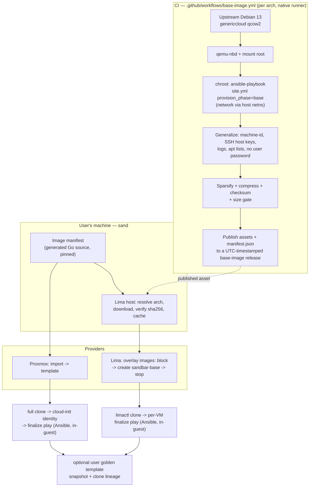
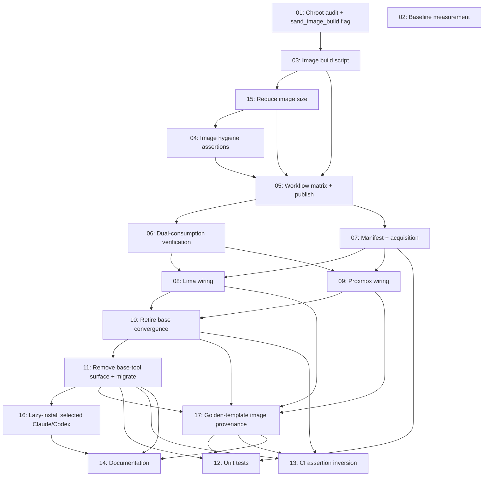

# Plan: Baked Base Images — Ship Prebuilt Guest Images Instead of Building Them On First Run

## Original Work Order

> I would like to switch from a model where users apply an ansible playbook locally at all, to one where we provide fully baked built images. I think this means we would need to provide base images for lima on macos / arm, lima on linux amd64 and arm64, and proxmox on amd64. We would just have one image with all tools - no more checkboxes to select. This is only worth it if it makes first installs faster for users (and saves us from having to constantly rebuild base images on updates too). We'd also need to have free storage in github releases without issue. We'd still need some facility for local builds of images for sandbar development of itself. I think this would also replace or combine with the existing PR that has a plan for "golden images".

## Plan Clarifications

| Question | Answer |
| --- | --- |
| Free GitHub arm64 runners expose no `/dev/kvm`, so an arm64 image cannot be built inside an accelerated VM on free CI. How should images be built? | **Rootfs build, no VM.** Run the existing Ansible roles against a mounted image root on a native per-arch runner (`ubuntu-24.04` for amd64, `ubuntu-24.04-arm` for arm64), then publish the resulting qcow2. Needs no virtualization on either arch. This is an extension of the technique `.github/workflows/base-image.yml` already uses in this repo. |
| What happens to plan 17's golden VM templates, now landed on `main`? | **Combine and migrate provenance.** Published base images replace the locally built `sandbar-base`; user-created golden templates remain a layer above it. Their current playbook/toolset freshness fields must become inherited image-version lineage, and template-backed create/reset must continue bypassing shared-base preparation. _(2026-09-28, auto-resolved from the landed registry/provider/CLI/TUI implementation.)_ |
| Should Ansible still run on the user's machine for the per-VM finalize step? | **Ansible stays — and it never ran on the user's machine to begin with.** The survey of the current code established that `ansible-playbook` is installed *inside the guest* and run with `--connection=local` (`internal/provision/provision.go:55-67`); the host only ships a mount/tar of the playbook. Keeping Ansible for finalize therefore costs the user nothing locally, and preserves the natural extension point the user is interested in. _(User's stated lean: "I'm tempted to keep ansible and let it grow so that users could add ansible config to their repos to be automatically applied." That extension is **out of scope here** — see Notes — but this decision keeps the door open.)_ |
| Removing the base-tool checkboxes changes registry records. How should that break be handled? | **Migrate with warning.** Retired DDEV/Go/Java fields are removed from VM and golden-template configs with a one-time notice. Agent selections and all unrelated registry/provenance fields survive. Existing VMs keep running untouched. |
| The work order lists four image targets (lima/macos-arm, lima/linux-amd64, lima/linux-arm64, proxmox/amd64). Is that the real artifact count? | **No — two.** The artifact is a *guest* image, and the guest is Debian 13 either way, so the host OS is irrelevant: Lima on macOS/arm64 and Lima on Linux/arm64 consume the *same* arm64 qcow2. Proxmox/amd64 and Lima/amd64 share the amd64 one. The matrix is `{amd64, arm64}`. Confirming that one image boots under both Lima and PVE is an explicit task, not an assumption. |
| Is "free storage in GitHub Releases without issue" actually true? | **In aggregate yes, per-file no.** GitHub documents no limit on total release size and no bandwidth limit, and allows up to 1000 assets per release — but **each individual file must be under 2 GiB**. See the dedicated question below; this was raised as a possible blocker and is not one. |
| Does "one image with all tools" mean coding agents are baked in too? | **No.** Since this plan was drafted, `main` moved Claude Code, Codex, OpenCode, and Pi into a remembered per-VM agent lifecycle during finalize. Preserve those choices. For selected Claude Code and Codex, retain the user's explicit decision to install the current release on first invocation; OpenCode and Pi keep their current behavior. Agent state never participates in the published-image version. |
| Could the 2 GiB per-asset limit block the plan outright? | **No.** Estimated compressed size for an all-tools image is ~1.2-1.6 GiB (from ~3.2-4.0 GiB of installed content), so it likely fits — but without comfortable margin, which is why it is measured early and gated in CI rather than assumed. If it does not fit, three fallbacks exist: (1) zstd rather than qcow2's default zlib compression; (2) trimming safe, functionally unused content such as docs, man pages, extra locales, and Go's test/API data; (3) moving the intact qcow2 to a directly downloadable host such as **GHCR** if its delivery contract works for PVE's importer. Splitting is not a provider-transparent fallback because PVE performs its own server-side download. The constraint shapes one component; it is not a premise the plan rests on. |
| How should the post-rebase plan/task inconsistencies be resolved? | **Apply the reviewed consistency fixes.** Serialize size reduction before hygiene verification, resolve Lima architecture on the host that runs `limactl`, accept an absent `/var/lib/dbus/machine-id`, and remove split-file fallback language that conflicts with PVE's downloader. Preserve the provider-specific task model mappings and keep the branch plan-only. _(Approved by the user on 2026-09-28.)_ |
| How should the remaining work land after the image-producer PR? | **Use a diamond-shaped PR series.** Keep PR 206 open only through Task 06's direct Lima/Proxmox image verification so image defects can be fixed at the producer. Then land a shared manifest/acquisition PR, followed by sibling Lima and Proxmox integration PRs based on that shared foundation. Join them only after both provider PRs land, in a final cleanup/migration/docs/CI PR. Do not stack either provider on the other. If a later integration exposes a new image defect, fix and republish it in a focused producer follow-up instead of holding PR 206 open for the entire implementation. _(Approved by the user on 2026-09-29.)_ |

## Executive Summary

Today, the very first `sand create` on a new machine builds the shared base image from scratch: Lima boots a stock Debian cloud image, a bootstrap script installs `ansible-core` and friends inside the guest, and then the full base playbook runs in-guest — five APT repositories, one thirty-package transaction, three `curl | sh` vendor installers, and several downloaded binaries. That is the single slowest thing sandbar ever does to a new user, and it is repeated on every machine, for every user, forever. Worse, the base is keyed on a content hash of the playbook fileset (`internal/provision/baseversion.go:121-127`), so shipping any playbook change obliges users to rebuild — and because a *released* binary extracts the playbook to a fresh temp directory each run, an upgraded binary's base is un-convergeable by construction and gets rebuilt from scratch (`internal/provision/baseoverlay.go:20-24`).

This plan moves that work to CI, once per image release, and turns first create into a download-and-clone. The project already does exactly this for Proxmox: `.github/workflows/base-image.yml` bakes `qemu-guest-agent` into a Debian genericcloud qcow2 using `qemu-nbd` plus a `chroot` — never booting the guest, needing no KVM — and publishes it as a GitHub Release asset that the Proxmox provider downloads and verifies by SHA-256. The work here is to grow that proven pipeline into the real thing: mount the image root, run the *entire* base-phase playbook inside the chroot against it (a chroot shares the host network namespace, so the vendor installers and APT repos work unchanged), build it for both `amd64` and `arm64` on native runners, and publish the pair. Lima then consumes the image through an `images:` block instead of Lima's stock `template:_images/debian-13`, and Proxmox keeps the import path it already has.

The expected outcome is a first create that costs a one-time image download plus a clone plus the short finalize play, rather than a full guest build; a base pinned to a released image rather than a playbook hash; and a simpler product surface where DDEV, Go, and Java are fixed image content while coding agents remain per-VM choices. The landed golden-template workflow remains intact above that base and carries image-version lineage. Because the payoff is conditional, this plan measures before and after as a success criterion.

## Context

### Current State vs Target State

| Current State | Target State | Why? |
| --- | --- | --- |
| First `sand create` builds `sandbar-base` in-guest: Lima boots stock Debian, installs `ansible-core`, then runs the full base playbook (5 APT repos, 30-package transaction, 3 `curl \| sh` installers) | First `sand create` downloads one prebuilt qcow2, verifies its SHA-256, and clones from it | This is the whole point of the work order: move the slow, repeated, per-user work into CI where it happens once |
| The base is keyed on `PlaybookVersion` = sha256(playbook fileset) + toolset key; any playbook change makes every user's base stale | The base is keyed on a released **image version**; the playbook hash no longer drives base staleness | "Saves us from having to constantly rebuild base images on updates" — a binary upgrade must stop implying a guest rebuild |
| A released binary's base is un-convergeable by construction (fresh temp dir per run), so upgrades rebuild from scratch | Upgrades change the pinned image reference or nothing at all; no rebuild path is triggered by the binary's own version | The current behaviour is the worst case of the thing the user wants removed |
| DDEV, Go, and Java choices alter the shared base; four coding agents are separately selected and installed per VM | DDEV/Go/Java are fixed image content; agent choices and `agentprefs` remain per VM; retired base-tool fields migrate safely | Matches the all-tools base goal without undoing the newer generic-agent lifecycle |
| Golden templates record playbook/toolset freshness and clone from reserved provider templates | Golden templates inherit baked-image-version lineage; template create/reset still clone their reserved source without touching the shared base | Prevent false “current” status and source substitution after the base model changes |
| Lima gets its image from Lima's own `template:_images/debian-13`; sand has no arch handling for Lima at all | Lima gets a sand-published image via an `images:` block carrying the verified host-matching image and digest | The image must be ours for it to be baked; local and remote Lima must resolve the architecture where `limactl` actually runs |
| Proxmox already downloads a project-built golden image, pinned by a hand-maintained triple of URL + filename + SHA-256 constant (`internal/provider/proxmoxprovision.go:61-77`) | Both providers resolve the same generated, single-source-of-truth image manifest | Three constants kept in sync by hand is a standing bug source, and there are about to be twice as many |
| `base-image.yml` bakes only `qemu-guest-agent`, amd64 only, and the base playbook still runs on top in-guest | `base-image.yml` bakes the complete base phase, for amd64 and arm64, and nothing base-phase runs in the guest afterwards | The image has to actually contain the tools for any of this to pay off |
| Users can build a base from their working-tree playbook simply by running `sand` from a checkout (`LocatePlaybook` tier 1) | A local image build path reproduces the CI build on a developer machine; the working-tree finalize loop is preserved | "We'd still need some facility for local builds of images for sandbar development of itself" |
| No measurement of first-create cost exists in the repo | First-create wall-clock is measured on the current model and on the new one, and the comparison is recorded | The user made the whole plan conditional on this being faster |

### Background

- **The chroot build technique is already proven in this repo.** `.github/workflows/base-image.yml` mounts the qcow2 with `qemu-nbd`, finds the ext4 root via `blkid`, drops a `policy-rc.d` returning 101 so package postinsts do not try to start services, bind-mounts `dev`/`proc`/`sys`, installs, then enables units with `systemctl --root=`. It deliberately avoids libguestfs, whose `virt-*` tools are broken on the 24.04 runner (Debian #1086844). It never boots the guest, so cloud-init's first-boot behaviour is untouched. Every one of those properties is needed again here.
- **A chroot has full network access.** It shares the host's network namespace, so with `/etc/resolv.conf` in place the base playbook's APT repositories, `curl | sh` vendor installers, `glab` `.deb` download and `drupalorg.phar` fetch all work exactly as they do in-guest. This is what makes "run the real playbook at build time" viable rather than requiring an offline `.deb` closure like the current workflow's narrow `qemu-guest-agent` case.
- **Ansible already never runs on the host.** It is installed inside the guest and invoked `--connection=local` (`internal/provision/provision.go:55-67`), with variables passed on stdin to a `0600` file in `/dev/shm`. The user-facing claim "users apply an ansible playbook locally" describes where the *slowness* is felt, not where Ansible runs. Keeping Ansible for finalize is therefore free in dependency terms.
- **The base/finalize split is now also an agent boundary.** DDEV/Go/Java belong to the base; Claude Code, Codex, OpenCode, and Pi are selected, remembered, and installed per VM during finalize. Git identity, project tokens, and agent state remain outside the public artifact.
- **Three tasks are deliberately ungated today and must stay per-instance.** The timezone block (`roles/base/tasks/main.yml:325-420`) and `~/.tmux.conf` (`roles/user/tasks/main.yml:125-131`) run in every phase on purpose, with comments explaining why: a shared, long-lived base must not fix the clone's timezone, and a cheap re-render lets a config change reach a new VM without a base rebuild. A published image makes both arguments *stronger*, not weaker.
- **Generalization is a known, solved-once problem here.** `generalizeScript` (`internal/provider/proxmoxprovision.go:437-457`) truncates `/etc/machine-id` and re-links `/var/lib/dbus/machine-id`, because cloned machine-ids made `systemd-networkd` hand every clone the same DHCP lease. A publicly distributed image needs that and more.
- **Prior art explicitly deferred this.** Archived plan 13 ("faster base VM provisioning") states at line 419: *"Tier 3 (publishing a pre-provisioned golden image) is explicitly out of scope. Nothing here should download, host, or publish a prebuilt image. The work in this plan is nonetheless the right precursor: a leaner, single-transaction, cache-backed playbook is exactly what a published image would run on top of."* This plan is that deferred Tier 3, and it inherits a base playbook already restructured into a single consolidated APT transaction for exactly this purpose.
- **The `lima-e2e` CI job asserts the behaviour being removed.** `.github/workflows/test.yml:234-270` deliberately dirties `roles/base/tasks/main.yml` and then asserts the base was converged *in place* rather than rebuilt. Under a baked-image model there is no in-place base convergence, so that assertion inverts rather than merely relaxing.
- **Release mechanics are constrained by immutable releases.** This repo has immutable releases enabled, so assets cannot be added after publish. `base-image.yml` works around it by creating a **draft**, uploading assets, then flipping `--draft=false`. New image tags are UTC-timestamped as `base-image-YYYY.MM.DD.HHMMSS`, allowing multiple releases per day; legacy date-only tags remain valid. The `base-image-` namespace is disjoint from release-please's `vX.Y.Z`.

## Architectural Approach

The change is a relocation of work, not a new subsystem: the base phase moves from the user's guest to CI, and a small acquisition layer appears in front of both providers. Seven components.

```mermaid
flowchart TB
    subgraph CI["CI — .github/workflows/base-image.yml (per arch, native runner)"]
        U[Upstream Debian 13<br/>genericcloud qcow2]
        N[qemu-nbd + mount root]
        A["chroot: ansible-playbook<br/>site.yml provision_phase=base<br/>(network via host netns)"]
        G[Generalize: machine-id, SSH host keys,<br/>logs, apt lists, no user password]
        C[Sparsify + compress + checksum<br/>+ size gate]
        M[Publish assets + manifest.json<br/>to a UTC-timestamped base-image release]
        U --> N --> A --> G --> C --> M
    end

    subgraph Host["User's machine — sand"]
        R["Image manifest<br/>(generated Go source, pinned)"]
        D["Lima host: resolve arch,<br/>download, verify sha256, cache"]
        R --> D
    end

    subgraph Providers
        L["Lima: overlay images: block<br/>-> create sandbar-base -> stop"]
        P["Proxmox: import -> template"]
    end

    M -.published asset.-> D
    D --> L
    R --> P
    L --> CL["limactl clone -> per-VM<br/>finalize play (Ansible, in-guest)"]
    P --> CP["full clone -> cloud-init identity<br/>-> finalize play (Ansible, in-guest)"]
    CL --> GT["optional user golden template<br/>snapshot + clone lineage"]
    CP --> GT
```

### Component 1: The Image Build Pipeline

**Objective**: Produce a complete, generalized, publishable all-tools guest image for each architecture, on free CI, without virtualization.

`base-image.yml` grows from a single amd64 job that installs one package into a matrix of two native jobs — `ubuntu-24.04` for `amd64`, `ubuntu-24.04-arm` for `arm64` — that each run the full base phase. The existing `qemu-nbd` → `blkid` → mount → `policy-rc.d` → bind-mount scaffold is retained verbatim; what changes is what happens inside the chroot. Instead of `dpkg -i` over a prefetched `.deb` closure, the job installs `ansible-core` and the playbook's own bootstrap dependencies into the image root and runs `ansible-playbook -i localhost, --connection=local site.yml --extra-vars provision_phase=base` under `chroot`. Because the chroot shares the host network namespace, the five APT repositories, the three vendor `curl | sh` installers, the `glab` `.deb` and the `drupalorg.phar` fetch all behave as they do in-guest. The upstream source URL becomes arch-parameterized (`debian-13-genericcloud-{amd64,arm64}.qcow2`), and the published asset name follows.

Three classes of task cannot work under `chroot` and need explicit handling rather than hope. Units cannot be *started* — `policy-rc.d` already blocks that, and enabling is done with `systemctl --root=`, so any `state: started` in the base path must become enable-only at build time. `loginctl enable-linger` requires a live systemd and must be expressed as the file it creates, `/var/lib/systemd/linger/<user>`. And anything reading live system state (a running D-Bus, a populated `/run`) must be identified and gated. The approach is to introduce a single `sand_image_build` flag, default false, that the build passes and that the affected tasks consult — keeping one playbook rather than forking a build-only copy, and keeping the in-guest path byte-identical to today when the flag is false.

### Component 2: Generalization and Image Hygiene

**Objective**: Make an image that is safe to hand to the public and safe to clone many times.

This is the component with the sharpest security edge, because the current base is built privately on each user's machine and the new one is downloaded by everyone. Four things must be true of a published image that are not true of a locally built base today.

First, **no shared user password**. `roles/user/tasks/main.yml:6-19` generates a 24-character random password at build time and sets it on the user. Baked into a published image, that becomes one password shared by every sandbar user on earth. The account must ship with a *locked* password; interactive access is already by SSH key (Lima) or cloud-init-injected key (Proxmox), and `sudo` is already passwordless via `/etc/sudoers.d/nopasswd-sudo`. The "display the generated password" task (`:248-253`) goes away with it.

Second, **no baked SSH host keys**. If the image ships `/etc/ssh/ssh_host_*`, every VM created from it worldwide shares a host identity. The build must remove them and ensure the regeneration path on first boot is intact.

Third, **machine-id generalization**, reusing the established fix: truncate `/etc/machine-id`; when `/var/lib/dbus/machine-id` exists as a regular file, replace it with a link to `/etc/machine-id`. Its absence is valid for images without the `dbus` package and must not fail the hygiene gate.

Fourth, **no build residue**: APT lists, package caches, logs, shell history, and any transient credential material are cleared, and `dpkg`'s `force-unsafe-io` build-speed hack is restored to safe settings — a step the base role already performs at `roles/base/tasks/main.yml:492-496` for precisely this reason.

Because these properties are easy to regress silently and catastrophic when regressed, they are asserted by an automated check over the built image, not left to review.

### Component 3: Size, Compression, and Distribution

**Objective**: Get a multi-gigabyte artifact through a 2 GiB-per-file ceiling — or prove it fits, with named fallbacks if it does not.

GitHub imposes no limit on total release size or bandwidth and permits 1000 assets per release, but each file must be under 2 GiB. This was raised as a possible blocker for the whole plan, so it is treated as the first thing to settle empirically.

The image contains Debian plus shared dependencies such as Node, Docker, Go, a JDK, DDEV, uv, glab, drupalorg, mkcert, and self-review tooling. Coding-agent binaries are not part of this estimate because `main` installs them per VM. A prior prototype including agents produced a 1.17 GiB compressed artifact, so the current shape has comfortable expected margin, but the build still sparsifies, reports size, and fails below GitHub's hard ceiling.

If measurement shows the image does not fit, three fallbacks exist in preference order, none of which changes the plan's architecture:

1. **zstd compression** — qcow2's `-c` defaults to zlib; `-o compression_type=zstd` gives a materially better ratio and is read transparently by QEMU/Lima and by PVE. Cheapest fix, likely sufficient alone.
2. **Trim droppable bulk** — documentation, man pages, unused locales, and Go's bundled test/API data are removable without losing a tool. Go's `src` tree remains because modern Go builds the standard library from source on demand.
3. **Alternate artifact hosting** — move the intact qcow2 to a host with a larger per-file ceiling, such as GHCR if its artifact URL and authentication model work with PVE's server-side importer. Splitting is not provider-transparent because PVE currently downloads the asset itself.

Distribution reuses the existing, constraint-shaped release dance: create a draft release on a UTC `base-image-YYYY.MM.DD.HHMMSS` tag, upload every asset plus checksums, then flip it to published. Timestamp precision permits multiple immutable releases on one day without tag discovery or sequence allocation; legacy `base-image-YYYY.MM.DD` tags remain accepted for existing images. Alongside the images, the build publishes a small `manifest.json` describing the release: for each arch, the asset URL, size, and SHA-256.

### Component 4: Manifest and Provider-Aware Acquisition

**Objective**: One pinned source of image truth, with acquisition occurring on the machine that consumes the image.

Today the Proxmox provider carries `baseImageURL`, `baseImageFile` and `defaultBaseImageSHA256` as three constants with a comment warning that they must be bumped together (`internal/provider/proxmoxprovision.go:61-77`). With two architectures and two providers that becomes four-plus constants and a standing source of drift. They are replaced by a single generated Go source file — the pinned image manifest — carrying, per architecture, the asset URL, filename and SHA-256, plus the image version string. A small `make`/`go generate` target regenerates it from a published release, so bumping the image is one command and one reviewable diff rather than a careful hand-edit.

For Lima, acquisition runs through the existing `lima.Host` seam so the verified cached path exists where `limactl` runs: locally for local Lima and remotely for remote Lima. Architecture is resolved on that same host — `runtime.GOARCH` is sufficient only for local Lima; remote Lima must normalize the result of a host-side `uname -m` (`x86_64`/`aarch64`) before selecting the manifest entry. Only the matching image is acquired and emitted in the overlay. Progress feeds the existing job stream, and partial files never become cache hits. Proxmox does not use that workstation cache: it passes the same manifest URL and SHA-256 to PVE's existing server-side download/verification path.

### Component 5: Provider Wiring and the Retirement of Base Convergence

**Objective**: Make both providers start from the downloaded image, and remove the machinery that existed only to rebuild and converge a locally built base.

For **Lima**, `RenderBaseOverlay` (`internal/provision/overlay.go:122-133`) stops emitting `base: [template:_images/debian-13]` and instead emits an `images:` block with one entry per architecture carrying `location`, `arch` and `digest`, letting Lima keep doing host-arch selection and download caching (or, where sand has already cached the file, a local `location` path). The read-only `/mnt/playbook` mount and the `overlayProvision` bootstrap remain — but the bootstrap shrinks, because `ansible-core`, `rsync`, `curl`, `gnupg` and `python3-passlib` are now already in the image; its idempotent guard (`overlay.go:51-101`) will simply find them present on every boot. `buildBase` (`internal/provision/provision.go:216-304`) no longer runs the base playbook: it creates the instance from the image, applies generalization-sensitive per-instance setup, stops it, and stamps the image version.

For **Proxmox**, the flow barely changes — it already downloads a golden image and imports it — but `provisionBase` (`internal/provider/proxmoxprovision.go:386-432`) drops its `runPlaybookPhase(base)` call, and the image URL comes from the manifest rather than a constant.

The removals are the larger half of this component. Base *staleness and convergence* — `ensureBaseStopped`'s four-outcome logic, `reapplyBase`, `baseConvergeable`, the 30-day apt self-refresh, `mergeToolsetVersion`, and the de-selection advisory — collapse to image-version equality plus rebuild-from-image. Only the DDEV/Go/Java selection surface and `ToolsetKey` plumbing disappear. Claude Code, Codex, OpenCode, Pi, `AgentPtrs`, and `agentprefs` remain per VM. Registry migration covers both VM configs and golden-template configs.

### Component 6: Golden-Template Provenance

**Objective**: Keep the landed user-created template workflow correct when base freshness stops using the playbook hash.

Golden templates remain provider-owned clone sources above the published base. Their registry record changes from `PlaybookVersion`/`ToolsetKey` to an inherited baked-image version. A snapshot must inherit the version of its actual source lineage—even if the current binary pins a newer image—and legacy records degrade to `unknown`. CLI/TUI freshness uses the manifest version, while create/reset from a golden template continues cloning the reserved template instance without acquiring or rebuilding `sandbar-base`.

### Component 7: Local Image Builds and the Contributor Loop

**Objective**: Keep sandbar developable on sandbar, and keep the working-tree feedback loop that contributors rely on.

Two distinct needs, easily conflated. The first is building an *image* locally — reproducing what CI does, on a developer's machine, from a working-tree playbook. Because the CI build is a shell procedure over `qemu-nbd` and `chroot`, it is extracted into a single committed script that both the workflow and a developer invoke, with the workflow reduced to environment setup plus a call to it. On Linux/amd64 and Linux/arm64 a developer can run it directly for their own architecture; it is not expected to work on macOS, and says so.

The second is the *contributor promise* documented at `docs/contributing/ansible-playbook.md:35-38`: running `go run ./cmd/sand` from inside a checkout makes uncommitted playbook edits take effect on the very next provision, via `LocatePlaybook`'s tier-1 git-toplevel lookup. That promise survives intact for the **finalize** phase, which still runs in-guest from the located playbook. It cannot survive for the base phase, because the base is now a downloaded artifact — editing `roles/base` and re-creating a VM will no longer change anything without a local image rebuild. This is a real regression in iteration speed for base-role work, it is the honest cost of the plan, and it is documented explicitly rather than left for a contributor to discover.

### Component 8: Testing the New Model

**Objective**: Cover the paths that changed, and invert the CI assertion that encoded the old model.

The `lima-e2e` warm-path assertion inverts: a base-role edit does **not** rebuild, while a changed pinned image version does. Coverage includes manifest resolution, host-correct Lima caching, digest failures, registry migration, golden-template lineage, and proof that template-backed create/reset bypass the shared base. Image-hygiene assertions run against every built artifact.

## Risk Considerations and Mitigation Strategies

Technical Risks

- **Base playbook tasks that cannot run under `chroot`**: `state: started`, `loginctl enable-linger`, and anything needing live D-Bus or a populated `/run` will fail or silently no-op in an offline root.
    - **Mitigation**: enumerate them up front as a discrete audit step against `roles/base` and `roles/user` rather than discovering them one CI failure at a time; express each as its offline equivalent (`systemctl --root= enable`, writing `/var/lib/systemd/linger/<user>` directly) behind a single `sand_image_build` flag that defaults false, so the in-guest path is unchanged when the flag is absent.
- **One image failing to satisfy both Lima and PVE**: Lima expects a cloud-init-capable image with a serial console and working `growpart`; PVE expects an importable disk with `qemu-guest-agent` present. Debian genericcloud nominally satisfies both, but "nominally" is not evidence.
    - **Mitigation**: make dual-consumption an explicit, early verification task — boot the built image under Lima and import it on PVE — before any downstream work is built on the assumption. If it fails, the fallback is two per-provider variants from one build, which costs assets but not architecture.
- **Compressed image exceeding the 2 GiB per-asset limit**: an all-tools image may not fit, and neither Lima's `images:` block nor PVE's server-side `DownloadURL` can fetch a split file.
    - **Mitigation**: measure before engineering; gate CI on a conservative size threshold so a future overflow fails loudly; then apply the Component 3 fallback ladder in order — zstd, safe trimming, then an alternate host capable of serving the intact qcow2 directly to PVE.
- **arm64 built on a runner with no KVM anywhere in reach**: the whole build must remain virtualization-free; any step that quietly wants a VM will fail only on the arm64 leg.
    - **Mitigation**: the technique is `qemu-nbd` plus `chroot` and never boots a guest — the same property the existing workflow already relies on; run both matrix legs from day one so an arm64-only regression cannot hide behind a green amd64 job.
- **Loss of the in-place converge safety net**: today a broken base can often be repaired by re-applying the playbook; with a pinned image the only repair is to re-download and re-clone.
    - **Mitigation**: keep a single explicit rebuild-from-image path (the existing `--rebuild` flag's natural successor) and ensure the cached image is re-verified rather than blindly reused, so a corrupt cache cannot make a rebuild loop.

Security and Distribution Risks

- **A shared user password baked into a public image**: `roles/user` generates a random password at build time; baked in, it becomes one password shared by every user of the project.
    - **Mitigation**: ship the account with a locked password and drop the password-display task; access is already by SSH key with passwordless `sudo`. Assert the locked state automatically against every built image.
- **Shared SSH host keys**: an image shipping `/etc/ssh/ssh_host_*` gives every VM worldwide the same host identity, defeating host verification.
    - **Mitigation**: remove host keys during generalization and verify first-boot regeneration; assert their absence in the built image.
- **Shared machine-id**: known to make `systemd-networkd` hand every clone the same DHCP lease.
    - **Mitigation**: truncate `/etc/machine-id`; re-link `/var/lib/dbus/machine-id` only when that path exists, and accept absence on images without `dbus`. Assert the resulting valid state.
- **Supply chain — users now execute a binary image we host**: the trust surface moves from "run this playbook on your machine" to "boot this disk we built".
    - **Mitigation**: pin and verify SHA-256 on every download and on every cache reuse; build only from upstream Debian genericcloud with a reproducible, committed, reviewable build script; publish checksums as release assets alongside the images; never fall back to an unverified image on digest mismatch — fail.
- **Build residue leaking into a public artifact**: caches, logs, shell history or transient credential material captured into a widely distributed image.
    - **Mitigation**: an explicit cleanup stage plus automated assertions over the built image, so hygiene is enforced by CI rather than by reviewer attention.

Product and Process Risks

- **The payoff failing to materialize**: the user made this conditional — "only worth it if it makes first installs faster". A multi-gigabyte download on a slow link could plausibly be *slower* than building in-guest.
    - **Mitigation**: measure first-create wall-clock on the current model before changing it, measure it after, and record the comparison as a success criterion. Treat a failure to improve as a finding to report, not a result to bury.
- **Contributor iteration on base roles gets slower**: the working-tree-edit-then-provision loop no longer covers the base phase.
    - **Mitigation**: ship the local image build script as a first-class, documented path in the same change that introduces the regression, and state the limitation plainly in the contributing docs rather than leaving it to be discovered.
- **Scope creep into per-repo user Ansible**: the user's stated interest in letting users drop Ansible config into their own repos is adjacent and tempting.
    - **Mitigation**: explicitly out of scope for this plan (see Notes). The decision to keep Ansible for finalize is what keeps that door open; building the door is separate work.
- **Golden-template lineage drift**: the landed feature currently derives freshness from playbook/toolset stamps and can fall back to the current binary rather than the source VM's actual lineage.
    - **Mitigation**: migrate template records to inherited image versions, render unprovable legacy lineage as `unknown`, and test template-backed create/reset at the provider boundary.

## Success Criteria

### Primary Success Criteria

1. A UTC-timestamped `base-image-YYYY.MM.DD.HHMMSS` GitHub Release carries a shared-dependency Debian 13 image for both `amd64` and `arm64`, each under 2 GiB with a published SHA-256, built on free CI without booting a guest.
2. On a machine with no prior sandbar state, `sand create` produces a working VM without running the base-phase playbook anywhere: the base instance is created from the downloaded image, and only the finalize play runs in-guest.
3. Measured first-create wall-clock on a clean machine is **faster** than the current model's, with both figures recorded. (This is the user's stated condition for the work being worth doing; if it is not met, that is reported as the outcome rather than worked around.)
4. Upgrading the `sand` binary, or editing a file under `roles/base/`, does **not** trigger a base rebuild; changing the pinned image version does.
5. DDEV, Go, and Java are fixed image content and their selectors are gone; Claude Code, Codex, OpenCode, and Pi remain per-VM choices, with selected Claude/Codex installing on first use.
6. The published image is safe to distribute: no user password set, no SSH host keys, a truncated machine-id, and no build residue — each asserted automatically in CI against the built artifact.
7. The same image is consumable by both Lima (both architectures) and Proxmox (amd64), demonstrated end to end.
8. A developer can build an image locally from a working-tree playbook using a committed script, on Linux, for their own architecture.
9. Golden-template status reflects inherited baked-image lineage, legacy records degrade safely to unknown, and template-backed create/reset never substitutes or rebuilds the shared base.

## Self Validation

After all tasks are complete, perform these concrete checks:

1. **Record the baseline first.** Before the provider wiring lands (or against a `main` build), on a machine with no `${LIMA_HOME}` state, run `time sand create baseline-vm` and record the wall-clock figure. This is the number criterion 3 compares against, and it cannot be recovered after the fact.
2. Trigger the image workflow via `gh workflow run base-image.yml` and confirm both matrix legs succeed. Download both published assets and confirm `sha256sum -c` passes against the published `.sha256` files, and that each asset is under 2 GiB (`ls -l`).
3. Inspect the built image's hygiene directly: mount it with `qemu-nbd` and confirm `passwd -S <user>` in the offline root reports a locked password, `ls /etc/ssh/ssh_host_*` finds nothing, `/etc/machine-id` is zero-length, and `/var/lib/apt/lists/` holds no package lists.
4. Confirm shared dependencies are baked and coding-agent binaries/state are absent from the mounted image.
5. On a clean machine (no `${LIMA_HOME}`, no cached image), run `time sand create fresh-vm`. Confirm the output shows a download-and-clone rather than a base playbook run, confirm no `TASK [base :` banners appear for the base phase, and record the wall-clock for criterion 3.
6. Shell into `fresh-vm`, verify shared tools, verify a selected Claude/Codex shim installs on first invocation, and confirm an unselected agent is absent.
7. Confirm per-VM identity still applies: check `hostname` matches the VM name, `git config user.name` and `user.email` are the configured identity, `/etc/timezone` is the host's zone, `~/.tmux.conf` exists, and `loginctl show-user <user>` reports `Linger=yes`.
8. Create a **second** VM and confirm it reuses the cached image and the existing base instance — no second download — and completes materially faster than the first.
9. Confirm criterion 4 by touching a file under `roles/base/`, running `sand create third-vm`, and verifying no base rebuild occurs and no image is re-downloaded.
10. Seed a schema-v4 registry with retired DDEV/Go/Java fields in both a VM and golden template. Verify one-time migration preserves agent choices, provenance, and unrelated fields; confirm only base-tool flags disappear from help.
11. Confirm the arm64 leg end to end on an arm64 host (macOS/Apple Silicon or Linux/arm64): `sand create arm-vm`, then verify `uname -m` reports `aarch64` inside the guest and the tool checks from step 6 pass.
12. Run the Proxmox path against a real PVE target with the opt-in e2e suite, confirming the amd64 image imports, templates, clones, and finalizes without a base playbook run.
13. Run the local build script on a Linux host from a working-tree checkout with a deliberate marker change in `roles/base`, and confirm the produced image contains that marker.
14. Run the full unit suite and the `lima-e2e` job, confirming green including the inverted base-staleness assertion.
15. Snapshot a VM built from image version A, switch the pinned manifest to B, and verify the template remains stamped A; create and reset from it without shared-base acquisition.
16. Confirm the docs are true, including `golden-templates.md` and the base-tool versus coding-agent distinction.

## Documentation

- `docs/getting-started/how-it-works.md` — the page is currently a description of the two-pass local build, including a mermaid diagram of it. It needs rewriting around download-and-clone plus finalize. (Note two statements here are *already* stale independent of this plan — that finalize runs `apt upgrade`, and that the VM always restarts at the end of finalize — and should be corrected while the page is being rewritten.)
- `docs/contributing/ansible-playbook.md` — the embed/mount/rsync/phase mechanism, the three-phase table, and above all the working-tree-edit promise at lines 35-38, which must be narrowed explicitly to the finalize phase and paired with the local image build path.
- `docs/contributing/releases.md` — currently does not mention `base-image.yml` at all; needs a section covering UTC-timestamped `base-image-YYYY.MM.DD.HHMMSS` releases, legacy date-only compatibility, the draft-then-publish dance forced by immutable releases, and how to bump the pinned manifest.
- `docs/using-sand/cli-reference.md` — remove DDEV/Go/Java selectors, preserve agent flags, update `--rebuild`, and refresh pasted help.
- `docs/getting-started/available-tools.md` — distinguish fixed shared dependencies from per-VM agents and document Claude/Codex first-use installation.
- `docs/getting-started/first-vm.md` — the "first VM builds a shared base image, which can take a while" passage becomes a one-time image download.
- `docs/using-sand/proxmox.md` — the `base_image` row and the "why the default image is a project-built one" admonition need updating now that *both* providers work this way.
- `docs/reference/troubleshooting.md` — the stale-base and `--rebuild` guidance changes shape; add image download/verification failure modes.
- `docs/reference/files-and-state.md` — add the image cache location; update the base-version stamp description.
- `docs/reference/security-model.md` — add the image supply-chain posture: what is baked, what is generalized per VM, and how the download is verified.
- `docs/using-sand/golden-templates.md` — replace playbook/toolset freshness with image-version lineage and document shared-base bypass.
- `AGENTS.md` — update the published-base stamp, provider-aware acquisition, per-VM agent, and golden-template lineage invariants.

## Resource Requirements

### Development Skills

- Go — provisioning layer, image acquisition and verification, provider wiring, config migration, CLI and TUI surface removal.
- Ansible — auditing `roles/base` and `roles/user` for chroot compatibility and introducing the build-time flag.
- GitHub Actions — matrix builds on native per-arch runners, release publishing under immutable-release constraints.
- Linux image plumbing — `qemu-nbd`, `chroot`, offline `systemctl --root=`, sparsification and qcow2 compression, image generalization.
- Bubble Tea / Lip Gloss — removing only base-tool toggles while preserving agent and golden-template Source UI.

### Technical Infrastructure

- GitHub-hosted `ubuntu-24.04` (amd64) and `ubuntu-24.04-arm` (arm64) runners — both free for public repositories; neither exposes `/dev/kvm`, which the build does not need.
- GitHub Releases as the artifact host — no total-size or bandwidth limit, 1000 assets per release, 2 GiB per file. GHCR is the named fallback host.
- Upstream Debian 13 genericcloud qcow2 images for both architectures.
- A real Proxmox VE target for the opt-in `proxmoxe2e` suite, and an arm64 host (Apple Silicon or Linux/arm64) for arm64 verification.

## Integration Strategy

The change lands against two existing pieces of work and must stay coherent with both.

**Golden VM templates are now landed on `main`.** Their provider mechanics remain, but their metadata and UI/CLI freshness checks do require coordinated changes: playbook/toolset stamps become inherited image versions, legacy values become unknown, and template-backed create/reset keep their reserved source.

**Archived plan 13 (faster base VM provisioning)** named this work as its deferred Tier 3 and deliberately built toward it — the single consolidated APT transaction and cache-backed playbook it produced are exactly what makes a chroot build tractable. Nothing from plan 13 is undone; its optimizations now run once in CI instead of once per user.

### Pull Request Landing Strategy

The remaining work lands as a diamond rather than a linear provider stack:

1. **PR 206 — image production (Tasks 01–05):** keep it open only until Task 06 proves the published images boot under Lima and import into Proxmox. A negative finding is fixed and republished here before merge; a positive finding makes PR 206 ready to merge.
2. **Shared foundation PR (Task 07 plus its focused acquisition tests):** pin the published manifest and add provider-neutral resolution plus verified Lima-host caching. It may be developed on PR 206 while review is open, but rebases onto `main` after PR 206 lands.
3. **Sibling provider PRs (Tasks 08 and 09):** branch both from the shared foundation. Lima and Proxmox do not depend on each other's lifecycle changes, so neither PR is stacked on the other.
4. **Join/cleanup PR (Tasks 10–14, 16, and 17):** begin only once both provider integrations are present together. Retire the old convergence model, migrate persisted/UI surfaces and golden-template provenance, invert CI, and update documentation in the integrated tree.

This boundary keeps supply-chain acquisition review separate from provider lifecycle review, permits the two providers to be tested and landed independently, and avoids carrying PR 206 as the base of a deep stack. A provider integration that later reveals an image defect opens a focused producer fix and a new immutable image release; it does not reopen or indefinitely delay the already-verified producer PR.

## Notes

- **Out of scope: per-repo user Ansible.** The user's stated interest — "let it grow so that users could add ansible config to their repos to be automatically applied" — is a genuine and appealing direction, and the decision to retain Ansible for the finalize phase is what keeps it available. Building it is separate work and is deliberately not planned here, per the YAGNI and scope-control rules in `PRE_PLAN.md`.
- **The artifact count is two, not four.** The work order anticipated four images (lima/macos-arm, lima/linux-amd64, lima/linux-arm64, proxmox/amd64). Because the artifact is a *guest* image and the guest is Debian 13 regardless of host OS, the real matrix is `{amd64, arm64}`. Whether one image serves both Lima and PVE is verified early rather than assumed.
- **"Users apply an ansible playbook locally" was never literally true.** Ansible is installed in the guest and run with `--connection=local`; the host only provides the playbook files. The user-visible problem is the *time* the in-guest base build costs, which is what this plan removes.
- **The 2 GiB ceiling is the one hard external constraint, and it is not a blocker.** It is measured and gated; coding agents no longer contribute to the artifact.
### Change Log

- 2026-09-28: Rebased onto the landed golden-template and generic-agent work; separated base dependencies from per-VM agents; added template lineage/migration coverage; corrected local/remote Lima versus PVE acquisition; migrated every active task to provider-specific `models` plus `effort`.
- 2026-09-28: Serialized size reduction before hygiene verification; made remote-Lima architecture resolution host-correct; aligned machine-id assertions with images that omit `dbus`; removed the provider-incompatible split-file fallback; revalidated all task model mappings.
- 2026-09-29: Added the approved diamond PR landing strategy; made Task 06 the merge gate for PR 206; separated the shared acquisition foundation from sibling Lima/Proxmox integrations and their post-merge cleanup join.

## Execution Blueprint

**Validation Gates:**
- Reference: `/config/hooks/POST_PHASE.md`

### Dependency Diagram

```mermaid
graph TD
    T01[01: Chroot audit + sand_image_build flag] --> T03[03: Image build script]
    T02[02: Baseline measurement]
    T03 --> T15[15: Reduce image size]
    T15 --> T04[04: Image hygiene assertions]
    T03 --> T05[05: Workflow matrix + publish]
    T04 --> T05
    T15 --> T05
    T05 --> T06[06: Dual-consumption verification]
    T05 --> T07[07: Manifest + acquisition]
    T06 --> T08[08: Lima wiring]
    T07 --> T08
    T06 --> T09[09: Proxmox wiring]
    T07 --> T09
    T08 --> T10[10: Retire base convergence]
    T09 --> T10
    T10 --> T11[11: Remove base-tool surface + migrate]
    T11 --> T16[16: Lazy-install selected Claude/Codex]
    T08 --> T17[17: Golden-template image provenance]
    T09 --> T17
    T10 --> T17
    T11 --> T17
    T07 --> T12[12: Unit tests]
    T11 --> T12
    T17 --> T12
    T10 --> T13[13: CI assertion inversion]
    T11 --> T13
    T17 --> T13
    T11 --> T14[14: Documentation]
    T16 --> T14
    T17 --> T14
```

The dependency graph is acyclic. Task numbering is descriptive rather than topological: task 15 intentionally precedes task 04 at execution time so the final compressed artifact is the one the hygiene gate inspects.

### ✅ Phase 1: Foundations — Playbook Audit and the Irrecoverable Measurement

**Status:** completed

**Parallel Tasks:**
- ✔️ Task 01: Audit `roles/base` and `roles/user` for chroot compatibility and add the `sand_image_build` flag — `completed`
- ✔️ Task 02: Validate the cold baseline and independently measure the warm create — `completed`

**Retained research from the earlier prototype:**

- The earlier audit identified `loginctl enable-linger`, service starts, and handlers as the chroot-sensitive paths. Its implementation was intentionally rolled back; task 01 must reapply the findings against current `main`.
- **Key image-build constraint:** Ansible's `hostname` module (`hostname.py:613`) selects `SystemdStrategy` only when `is_systemd_managed()` finds `/run/systemd/system/`, `/dev/.run/systemd/` or `/dev/.systemd/`. On a never-booted image root none exist, so it silently falls back to writing `/etc/hostname` directly — the offline behaviour we want. **The build must therefore NOT bind-mount host `/run`.** Bind-mounting `/dev` remains safe (both `/dev/` canaries verified absent on the build host). No guard on the hostname task is needed or wanted.
- **Image-build interface:** run `systemctl --root="$MOUNT" enable docker.socket` and `disable docker.service` after the chroot run; pass `samba_enabled: false`, `provision_phase: base`, `sand_image_build: true`. No other unit enablement is required by this fileset.
- Baseline measured on x86_64 / Debian 13, commit `44a7c05`: **cold create 24m18.9s**, of which base image creation 8m55s and the base playbook 12m57s — **21m52s is exactly the work baked images remove**. Warm create was *estimated* at ~1m44s from the cold run's own clone+start+finalize phases, not independently measured.
- Minor nit for later: the offline linger task uses `state: touch`, which always reports changed. Harmless in a run-once image build, but it would fail an idempotence check if that path is ever molecule-tested.

_Task 02 is ordering-critical: it measures a code path this plan deletes, so the number cannot be recovered after Phase 6. It has no dependencies precisely so it can run first._

### ✅ Phase 2: The Build

**Status:** completed

**Parallel Tasks:**
- ✔️ Task 03: Image build script — chroot base-phase build, generalization, compression, size gate (depends on: 01) — `completed`

The rolled-back prototype proved the chroot approach and produced a 1.17 GiB artifact. Task 03 reimplements it against current `main`, where agents are no longer base content.

**Root cause of the size instability** (recorded because it is non-obvious): ext4 does not zero a block's contents on delete — only the allocation bitmap changes. `qemu-img convert -c` cannot infer that filesystem state, so residual bytes from deleted files can be compressed as real entropy. The implementation connects nbd with `--discard=unmap`, runs `fstrim` while the filesystem is mounted, and then converts with zstd compression. Three consecutive successful builds measured 1,032–1,041 MiB, comfortably below the 1,900 MiB gate.

**Hygiene-gate note:** the builder creates `/var/lib/dbus` when needed and installs `/var/lib/dbus/machine-id` as a symlink to the deliberately empty `/etc/machine-id`. The distribution-safety assertion requires that exact generalized state.

One additional playbook change beyond Task 01's: `roles/user/tasks/main.yml` now creates `/var/lib/systemd/linger/` before touching the per-user linger file. On a never-booted genericcloud image that directory does not exist (logind creates it lazily), so the offline-equivalent task failed with `ENOENT`. This was the only playbook task that failed under chroot across all four runs, and it was fixed by extending the `sand_image_build` guard rather than working around it in the script.

### ✅ Phase 3: The Size Work

**Status:** completed

**Tasks:**
- ✔️ Task 15: Reduce the published image size with safe trims and zstd compression (depends on: 03) — `completed`

**Size reduction ledger** (measured unless marked estimate):

| Stage | Compressed size | % of 2 GiB |
| --- | --- | --- |
| Task 03 zstd baseline | 1040.125 MiB | 50.8% |
| Task 15 final build D | 960.625 MiB | 46.9% |
| Task 15 final build E | **959.8125 MiB** | 46.9% |

The final image saves 80.3125 MiB (7.72%) against the fresh Task 03 baseline. Offline ext4 shrink/regrow normalization reduced the final D/E size delta to 0.8125 MiB without changing the 20 GiB runtime filesystem. The optimization also found and removed a shared mkcert CA private key from the base; a dedicated finalize/full role now creates it per VM.

**Build-host hazard discovered during execution:** `/tmp` on the development host is a **tmpfs**, so multi-gigabyte image outputs written there are held in RAM and triggered an OOM kill of a background process. Builds must write outputs to a disk-backed path (`/var/tmp`), and intermediate images must be deleted once their size and digest are recorded. **The publication workflow must apply the same rule in CI** — hosted runners also have constrained RAM and a small `/tmp`.

### ✅ Phase 4: The Distribution Gate

**Status:** completed

**Tasks:**
- ✔️ Task 04: Assert the built image is safe to distribute (depends on: 15) — `completed`

### ✅ Phase 5: Publication
**Status:** completed

**Parallel Tasks:**
- ✔️ Task 05: Two-arch CI matrix, hygiene gate, release publish with `manifest.json` (depends on: 03, 04) — `completed`

Release `base-image-2026.09.29.151245` was published from PR 206 commit `6a61c25`; both architecture jobs and the publish job succeeded. The five release assets were downloaded, both checksum files passed `sha256sum -c`, both qcow2 files passed `qemu-img check`, and their sizes are 1,006,632,960 bytes (amd64) and 974,258,176 bytes (arm64).

### Phase 6: Verify the Assumption, Build the Shared Host Side
**Parallel Tasks:**
- Task 06: Verify one image boots under Lima (both arches) and imports on Proxmox (depends on: 05)
- Task 07: Pin the image manifest in Go and add the verified, cached acquisition helper (depends on: 05)

_Task 06 is PR 206's merge gate and redirects Phase 7 on failure. Task 07 is the shared-foundation PR and may be developed in parallel, but provider wiring cannot begin until Task 06 succeeds._

### Phase 7: Sibling Provider PRs
**Parallel Tasks:**
- Task 08: Create the Lima base from the downloaded image (depends on: 07)
- Task 09: Point Proxmox at the manifest image and drop its base playbook run (depends on: 07)

_Tasks 08 and 09 branch independently from Task 07's shared foundation. Neither provider PR is based on the other._

### Phase 8: Join the Providers and Retire the Old Model
**Parallel Tasks:**
- Task 10: Remove base staleness and convergence machinery (depends on: 08, 09)

_This begins the integrated cleanup PR only after both provider PRs are present together._

### Phase 9: Simplify the Surface
**Sequential then parallel Tasks:**
- Task 11: Remove the base-tool selection surface and migrate registry records (depends on: 10)
- Task 16: Lazy-install selected Claude Code and Codex agents on first use (depends on: 11)
- Task 17: Carry baked-image provenance through golden VM templates (depends on: 08, 09, 10, 11)

### Phase 10: Cover and Document
**Parallel Tasks:**
- Task 12: Unit-test manifest resolution, migration, and template routing (depends on: 07, 11, 17)
- Task 13: Invert the CI base-staleness assertion and wire the hygiene gate (depends on: 10, 11, 17)
- Task 14: Update documentation (depends on: 11, 16, 17)

### Post-phase Actions

- After Phase 5, the published release is a real, public artifact. Confirm its assets and checksums before any downstream task pins them.
- Keep PR 206 open through Task 06. If dual-consumption verification fails, fix the producer and publish a new immutable image before merging; if it succeeds, PR 206 is ready to merge and Task 07 rebases onto the resulting `main`.
- After Task 07 lands, create Tasks 08 and 09 as sibling branches from the shared foundation. Do not base one provider PR on the other.
- After Phase 8, verify success criterion 4 directly (a `roles/base/` edit must not rebuild; an image version change must) rather than waiting for Phase 10's CI encoding of it.
- After Phase 10, run the plan's Self Validation in full, comparing the measured first-create time against Task 02's recorded baseline. Success criterion 3 is the user's stated condition for the work being worthwhile; if it is not met, report that as the outcome.

### Execution Summary
- Total Phases: 10
- Total Tasks: 17

### Prior Prototype Findings (implementation rolled back)

The prior implementation was removed from this branch at the user's request, but its empirical findings remain useful inputs:

- **The chroot build works.** The full base-phase playbook — five APT repositories, the 30-package transaction, and all three `curl | sh` vendor installers — ran to completion inside a `chroot` over a mounted image root, with no init and no D-Bus. This was the single largest technical unknown in the plan.
- **Task 01's `/run` constraint was respected in practice**, verified by the orchestrator from the live mount table: only `dev`, `proc` and `sys` were bind-mounted.
- **Size was initially unstable and is now reproducible.** Runs 1 and 2 produced 1890.3 MiB and 1998.8 MiB — a 108.4 MiB swing, with run 2 failing the script's own 1900 MiB gate and landing within 49 MiB of GitHub's hard ceiling. The cause was uncompressed garbage left in free space before `qemu-img convert -c`. After the fix, runs 3 and 4 produced 1173.06 MiB and 1172.68 MiB — a **384 KiB delta (0.03%)**.
- **The 2 GiB per-asset limit is not a blocker.** Final size is **1,229,651,968 bytes (1172.68 MiB)** — 57.3% of the ceiling, with ~875 MiB of headroom.
- Teardown is idempotent: after a *failed* run 2, exactly one temp directory and no stale nbd connections or orphaned mounts remained.

**Measured image composition** (3.0 GB uncompressed → 1172.68 MiB compressed, 2.6x), from mounting the built image:

| Component | Uncompressed |
| --- | --- |
| JDK | 286M |
| Go (lib 113M + src 140M + test/api 29M) | 282M |
| Docker stack | ~300M |
| GCC + headers | 230M |
| node | 121M |
| glab / uv / gh / ddev / cloudflared | 216M |

The prototype included Claude and Codex in the base, unlike current `main`, so its size ledger is directional rather than a valid current baseline. The JDK and cloudflared remain retained; `/usr/include`, GCC, and Go's `src` tree remain for native builds and Go toolchain behavior.
