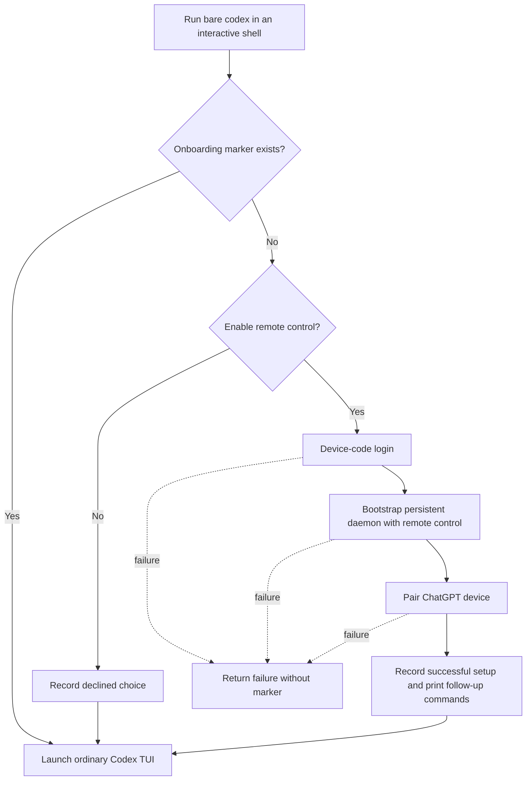
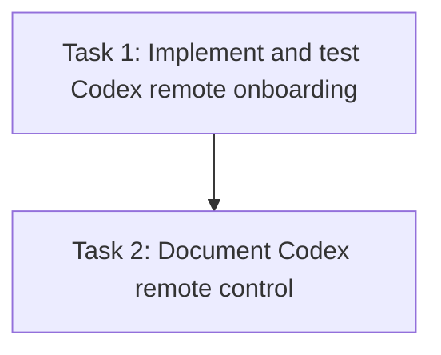

# Plan: Add First-Run Codex App-Server and Remote-Control Setup

## Original Work Order

> Implement app-server support for Codex users. The first time a user runs codex at the command line, our wrapper should ask if the user wants to use remote control support. If so, it should
>
> 1. use device auth to log in to codex
> 2. run the appropriate codex app-server commands to set up a persistent app server and enable remote control.
> 3. run `codex remote-control pair` so the user can pair another device with the chatgpt app.
> 4. Tell the user they can run `codex agents` to connect locally, and they can use the pairing command to connect more devices.

## Plan Clarifications

| Question | Answer |
|----------|--------|
| Must the wrapper preserve existing behavior for users who decline remote control, including remembering the choice, forwarding normal commands and options unchanged, and launching the regular Codex TUI? | Yes. |

## Executive Summary

This change adds a one-time, interactive onboarding path to the provisioned Codex command. On the first bare interactive invocation, the wrapper asks whether the user wants remote-control support. An affirmative answer authenticates through Codex's device-code flow, installs durable app-server management with remote control enabled, starts the managed service, and launches the device-pairing command. A declined choice is remembered without changing normal Codex behavior.

The implementation will follow the existing shell-wrapper convention used by the provisioned Claude command while remaining scoped to VMs where the opt-in Codex role is installed. Ordinary Codex subcommands and options will continue to reach the upstream binary unchanged, non-interactive use will not block on a prompt, and a bare invocation will enter the ordinary Codex TUI after successful setup or a remembered decline. Focused shell-level tests will exercise the user-visible workflow against a fake upstream Codex binary, and the getting-started documentation will replace its obsolete statement that Codex remote control is unavailable from the CLI.

## Context

### Current State vs Target State

| Current State | Target State | Why? |
|---------------|--------------|------|
| The Codex role installs the upstream CLI and configuration but provides no first-run wrapper. | A Codex-scoped wrapper offers remote-control setup on the first bare interactive launch. | Users should be able to opt into app-server support without discovering and sequencing experimental commands themselves. |
| Users must run `codex login --device-auth` manually in a VM. | Accepting the prompt starts device-code authentication as part of onboarding. | The browser callback used by normal OAuth is unsuitable for the default VM shell path. |
| No persistent Codex app-server is configured by Sandbar. | The wrapper bootstraps durable daemon management with remote control enabled. | Local `codex agents` and paired ChatGPT devices require a shared app-server that remains available beyond one CLI process. |
| The documentation says Codex has no CLI-reachable remote control. | Documentation explains the opt-in first-run flow, local agent browser, and repeat pairing command. | The installed Codex CLI now exposes daemon and remote-control commands, so the current guidance is obsolete. |
| Declining or using a normal subcommand has no defined onboarding compatibility contract. | Declines are remembered; normal subcommands/options are forwarded byte-for-byte; non-interactive use does not prompt. | The new onboarding must not disrupt established CLI workflows or repeatedly nag users who opted out. |

### Background

Codex is an opt-in Sandbar toolset installed by `roles/codex`. Its upstream executable lives on the user's `PATH`, and the role already prepares `~/.codex/config.toml`. The adjacent Claude integration establishes the repository convention for a shell function that delegates to the real executable via `command`.

Official OpenAI authentication documentation identifies `codex login --device-auth` as the preferred flow for remote or headless hosts. The installed Codex CLI additionally exposes durable management through `codex app-server daemon bootstrap --remote-control`, local browsing through `codex agents`, and manual device pairing through `codex remote-control pair`. These local command surfaces are newer than the repository's current Codex documentation and will be treated as the executable contract for the provisioned CLI version.

The first-run state belongs under Sandbar's existing per-user configuration directory. The state must distinguish only whether onboarding has completed; an affirmative setup is recorded after the full sequence succeeds, while a decline is recorded immediately. A failed affirmative setup remains retryable on the next bare interactive run.

## Architectural Approach

### Codex-Scoped Shell Wrapper

**Objective**: Introduce first-run onboarding without changing the upstream executable or affecting VMs where Codex is not selected.

The Codex Ansible role will install a managed Bash wrapper definition after the upstream CLI is available. The function will intercept only a bare interactive `codex` invocation while onboarding is incomplete. Invocations with commands or options, and invocations without a terminal, will delegate directly to `command codex "$@"` so automation, diagnostics, and the full upstream command surface remain compatible.

The prompt will offer remote-control support once. A negative answer will create a Sandbar-owned completion marker and immediately launch the ordinary Codex TUI. The implementation will avoid modifying upstream Codex credential or configuration files merely to remember the user's Sandbar onboarding choice.

### Authenticated Persistent App-Server Setup

**Objective**: Sequence the supported Codex commands required for a durable, remotely controllable app server.

For an affirmative answer, the wrapper will call the upstream executable explicitly for device authentication, durable daemon bootstrap with remote control enabled, and manual pairing. Each step must succeed before the next begins. The completion marker will be written only after the entire setup finishes so a transient login, service, or pairing failure can be retried on the next launch. After successful pairing, the wrapper will explain that `codex agents` connects locally and `codex remote-control pair` pairs additional devices, then continue into the normal TUI.

### Critical-Path Verification and Documentation

**Objective**: Prove the wrapper's boundary behavior and publish accurate first-use instructions.

Shell-level tests will source the deployed wrapper in an isolated home directory with a fake `codex` executable recording argv. They will cover the affirmative command order and success messaging, remembered decline behavior, retryability after setup failure, argument forwarding, and the non-interactive no-prompt path. Ansible syntax validation will ensure the role remains valid. The Codex section of the first-VM guide will describe the one-time choice, device-code login, persistent app server, initial pairing, local `codex agents` access, and additional pairing command.

## Risk Considerations and Mitigation Strategies

Technical Risks

- **Interactive prompt breaks automation**: A shell function could unexpectedly consume stdin during `codex exec`, `codex --help`, or redirected use.
    - **Mitigation**: Prompt only for a bare invocation with terminal stdin; otherwise delegate all arguments unchanged.
- **Partial setup is mistaken for completion**: Authentication or daemon setup may succeed before pairing fails.
    - **Mitigation**: Create the affirmative completion marker only after every required command succeeds, leaving the flow retryable after any failure.
- **Wrapper recurses into itself**: Calling `codex` from a function named `codex` can recurse.
    - **Mitigation**: Invoke every upstream operation with Bash's `command codex` form.
- **Upstream experimental commands change**: App-server and remote-control commands are marked experimental.
    - **Mitigation**: Use the smallest command sequence exposed by the installed CLI and cover the exact argv contract with focused tests.

Implementation Risks

- **Role leakage**: Defining the function in the general user role would affect VMs where Codex was not requested.
    - **Mitigation**: Keep installation and wrapper management inside `roles/codex`.
- **Provisioning overwrites user state**: Reprovisioning could reset the onboarding choice.
    - **Mitigation**: Manage only the wrapper definition; create and preserve the runtime marker from the user's shell session.
- **Documentation retains contradictory guidance**: The current guide explicitly says CLI remote control is unavailable.
    - **Mitigation**: Replace that statement as part of the same change and validate the MkDocs site strictly.

## Success Criteria

### Primary Success Criteria

1. The first bare interactive `codex` invocation asks once whether to enable remote-control support.
2. Accepting runs device-code login, bootstraps a persistent app-server daemon with remote control enabled, and runs `codex remote-control pair` in the required order.
3. Successful setup tells the user that `codex agents` connects locally and `codex remote-control pair` pairs more devices.
4. Declining is remembered and still launches the normal Codex TUI without setup commands.
5. Failed affirmative setup remains retryable and does not launch the TUI as though setup succeeded.
6. Existing commands, options, and non-interactive usage pass through to the upstream Codex CLI without an onboarding prompt.
7. User documentation accurately describes the first-run flow and no longer claims the CLI cannot provide remote control.

## Self Validation

1. Provision the Codex role into an isolated test home, source the resulting Bash configuration in a pseudo-terminal, put a recording fake `codex` executable first on `PATH`, choose yes, and verify its log contains `login --device-auth`, `app-server daemon bootstrap --remote-control`, `remote-control pair`, and the final bare invocation in that order.
2. Repeat from a clean isolated home, choose no, launch bare `codex` twice, and verify the prompt appears only once while both invocations reach the fake upstream TUI.
3. Make the fake login or daemon command fail, invoke bare `codex` twice, and verify the setup prompt is offered again because no completion marker was created.
4. Invoke representative pass-through forms such as `codex --version`, `codex exec test`, and a redirected/non-terminal command; verify the fake executable receives exactly the original argv and no prompt text is emitted.
5. Run the repository's Ansible syntax check and `uvx --with-requirements docs/requirements.txt mkdocs build --strict`; both must exit successfully.

## Documentation

Update `docs/getting-started/first-vm.md` to document the first-run opt-in prompt, device-code authentication, persistent app-server setup, initial ChatGPT pairing, `codex agents` for local access, and `codex remote-control pair` for additional devices. Remove the obsolete statement that Codex remote control is unavailable from the CLI. Keep role comments accurate where they describe the Codex installation and first-use behavior.

`AGENTS.md` does not need an update: this change adds a scoped provisioning behavior rather than a new cross-cutting architecture rule, and the executable contract is captured by the role, focused tests, and user guide.

## Resource Requirements

### Development Skills

- Bash function and interactive-terminal behavior
- Ansible role authoring
- Shell integration testing
- MkDocs documentation maintenance

### Technical Infrastructure

- The existing Codex Ansible role and user Bash configuration
- A current Codex CLI exposing device auth, app-server daemon management, remote control, and agents commands
- Bash with pseudo-terminal-capable test tooling
- The repository's Ansible and MkDocs validation commands

## Integration Strategy

The feature remains behind the existing `toolset_codex` selection and changes no Go-side VM lifecycle or toolset defaults. It integrates at provision time through the Codex role and at runtime through the user's Bash command resolution. Existing upstream subcommands remain reachable through the wrapper, and the ordinary Codex TUI remains the endpoint after either a completed setup or a remembered decline.

## Notes

Remote control is an experimental upstream Codex capability. The implementation should describe the observed CLI workflow without promising availability beyond the user's ChatGPT account, workspace policy, or Codex rollout.

## Execution Blueprint

**Validation Gates:**
- Reference: `/config/hooks/POST_PHASE.md`

### Dependency Diagram

### ✅ Phase 1: Codex onboarding implementation

**Status:** completed

**Parallel Tasks:**
- ✔️ Task 1: Implement and test the Codex remote-control onboarding wrapper — `completed`

### ✅ Phase 2: User documentation

**Status:** completed

**Parallel Tasks:**
- ✔️ Task 2: Document Codex remote-control setup and follow-up commands (depends on: 1) — `completed`

### Post-phase Actions

- After Phase 1, run the focused wrapper tests and Ansible syntax validation, then apply the verification gate.
- After Phase 2, run the strict MkDocs build, inspect the final documentation against the implementation, and apply the verification gate.
- After all phases, run the repository-wide post-execution checks required by `POST_EXECUTION.md`.

### Execution Summary
- Total Phases: 2
- Total Tasks: 2
