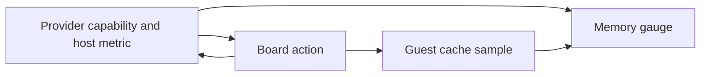
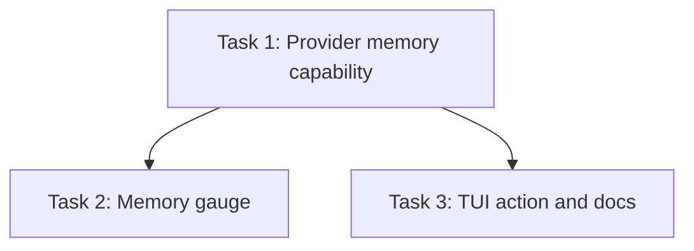

# Plan: Provider-aware memory reclaim and memory display

## Original Work Order

> Implement a provider-aware **“Reclaim memory”** feature in Sandbar, and improve the TUI memory display so it distinguishes guest filesystem cache from other memory while showing total memory usage from the host/hypervisor perspective.
>
> ## Background
>
> We have confirmed the following behavior:
>
> * On **Proxmox**, Linux guests may accumulate very large filesystem caches. For example, a 32 GB VM may have ~9 GB of actual workload memory and ~18 GB of filesystem cache while consuming ~30 GB on the Proxmox host.
> * Running the following inside the guest:
>
> ```sh
> sync
> echo 3 > /proc/sys/vm/drop_caches
> ```
>
> drops the guest filesystem/page cache and, importantly, we have confirmed that the Proxmox host's memory usage for that VM falls correspondingly.
>
> * This works using Sandbar's existing SSH access to the guest. We do **not** need additional Proxmox API permissions or QEMU monitor/balloon access.
> * On **Lima/macOS**, dropping Linux guest caches works inside the guest but does **not** reduce the VM's memory footprint as seen by macOS. Therefore Lima should **not** offer the reclaim-memory action.
>
> Do not implement ballooning as part of this feature.
>
> ## Provider capability
>
> Make memory reclaim an optional provider capability rather than assuming every provider supports it.
>
> The design should fit the existing provider abstractions rather than special-casing provider names in the TUI.
>
> Conceptually, providers should be able to indicate whether they support something like:
>
> ```text
> reclaimMemory
> ```
>
> and expose an operation to perform it.
>
> Exact interfaces/names should follow existing Sandbar conventions.
>
> Behavior:
>
> * **Proxmox provider:** supports memory reclaim.
> * **Lima provider:** does not support memory reclaim.
> * Other providers should default to unsupported unless explicitly implemented.
>
> The TUI should only offer **Reclaim memory** when the active provider advertises support.
>
> ## Proxmox reclaim implementation
>
> For a Proxmox VM, reclaim memory by executing inside the guest using Sandbar's existing SSH mechanism:
>
> ```sh
> sync
> echo 3 > /proc/sys/vm/drop_caches
> ```
>
> Use whatever privilege escalation mechanism Sandbar already uses for privileged guest operations.
>
> Important constraints:
>
> * Do not add new Proxmox permissions.
> * Do not use the QEMU monitor.
> * Do not alter the VM's configured memory/minimum/balloon settings.
> * Do not reboot the VM.
> * Do not kill services or processes.
> * Failure should be reported cleanly to the user through the existing TUI error/status patterns.
>
> This operation is intentionally explicit/manual. Do not automatically reclaim memory in the background as part of this change.
>
> ## Memory metrics
>
> Update the memory information used by the TUI.
>
> There are two different measurements we care about:
>
> 1. **Host/hypervisor memory usage**
>
>    * This should become the primary "memory used" value displayed for the VM.
>    * For Proxmox, use the existing host-side VM memory metric exposed by Proxmox rather than the guest's `used` memory.
>    * For Lima or other providers, use the provider's best host-side VM memory measurement if one already exists.
>    * Do not present guest `used` memory as though it were the amount of physical host RAM occupied by the VM.
>
> 2. **Guest filesystem/cache memory**
>
>    * Obtain this from Linux guest memory information through the existing guest/SSH path.
>    * Prefer the same semantics users would recognize from `free`, using Linux `/proc/meminfo` rather than shelling out to parse localized `free` output if practical.
>    * This value is informational and will be used to render a distinct cache portion/pattern in the memory bar.
>
> Keep the metrics separate in the data model because one comes from the provider/hypervisor and the other comes from inside the guest.
>
> Handle unavailable guest cache metrics gracefully.
>
> ## TUI memory bar
>
> Update the existing memory bar.
>
> Currently it shows memory usage based primarily on what Linux reports from inside the VM. Instead:
>
> * The total filled amount should represent **memory currently consumed as seen by the host/hypervisor**.
> * Within that used portion, show the guest's filesystem/cache amount using a **distinct visual pattern** from ordinary application/other memory.
> * Preserve the existing compact width of the bar.
> * Do not make the bar wider just to accommodate another metric.
> * Use an existing Sandbar TUI visual convention if there is an appropriate one; otherwise introduce a subtle terminal-safe pattern that works in supported terminals and themes.
>
> Conceptually, for a 32 GB VM:
>
> ```text
> Host/hypervisor memory: 30 GB
> Guest cache:            17 GB
>
> | app/other | cache-pattern........ | free |
> ```
>
> The cache portion is a subset of the host-resident memory visualization, not an additional quantity added on top.
>
> Be defensive about accounting discrepancies. Guest cache can race with host metrics, and provider accounting will not necessarily equal the sum of guest categories exactly. Clamp visual values appropriately rather than producing negative or overflowing segments.
>
> ## Memory number
>
> Change the numeric memory figure next to/in the existing TUI memory bar so that it reports memory usage **as seen from the host/hypervisor**, not guest Linux `used` memory.
>
> For example, if:
>
> ```text
> guest workload/"used": 9 GB
> guest cache:           18 GB
> Proxmox host usage:    30 GB
> VM maximum:            32 GB
> ```
>
> the primary TUI number should be approximately:
>
> ```text
> 30 / 32 GB
> ```
>
> not:
>
> ```text
> 9 / 32 GB
> ```
>
> The bar should visually indicate that a substantial portion of the 30 GB is cache.
>
> ## Reclaim action UX
>
> For providers that support the capability, expose a TUI action named:
>
> **Reclaim memory**
>
> Use existing action/menu/keybinding conventions.
>
> When invoked:
>
> 1. Execute the cache-drop operation in the VM.
> 2. Show appropriate progress/status feedback using existing Sandbar patterns.
> 3. Refresh both:
>
>    * guest cache metrics;
>    * host/hypervisor memory usage.
> 4. The TUI should then naturally show the reduced cache and, on Proxmox, reduced host memory footprint.
>
> Do not promise an exact number of bytes reclaimed; Linux may retain live shared memory, mapped pages, unreclaimable slab, etc.
>
> ## Lima
>
> Lima should explicitly remain unsupported for this action for now.
>
> Do not expose **Reclaim memory** for Lima, because although `drop_caches` frees guest page cache, we have verified that it does not reduce the macOS-side VM memory footprint.
>
> It is fine for the generic capability design to allow Lima to support this in the future if its virtualization backend gains effective host memory reclamation.
>
> ## Tests
>
> Add tests covering at least:
>
> * provider capability detection;
> * Proxmox advertises reclaim support;
> * Lima does not advertise reclaim support;
> * reclaim command uses the guest SSH execution path;
> * the expected `sync` + `drop_caches` operation is performed;
> * unsupported providers do not expose the TUI action;
> * host/hypervisor memory is used for the primary memory number;
> * cache is represented separately from ordinary used memory;
> * cache visualization is clamped safely when guest and host metrics disagree;
> * missing/unavailable cache statistics do not break rendering;
> * the TUI refreshes metrics after reclaim completes.
>
> Use existing project testing conventions and abstractions rather than introducing a parallel framework.
>
> ## Non-goals
>
> Do not implement any of these as part of this change:
>
> * automatic memory reclaim;
> * Proxmox balloon configuration;
> * QEMU monitor commands;
> * new Proxmox API privileges;
> * changing VM minimum/maximum RAM;
> * memory-pressure monitoring;
> * automatic reactions to tests/builds/agents;
> * Lima/macOS host-memory reclamation;
> * reboot-based reclamation.
>
> Keep this feature focused: expose accurate host-side memory accounting, make guest cache visible, and let supported providers offer an explicit low-risk **Reclaim memory** action.

## Plan Clarifications

| Question | Answer |
| --- | --- |
| Must existing external Go provider APIs remain backward compatible? | No compatibility requirement. |

## Executive Summary

Sandbar will offer a manual Reclaim memory action only when the selected VM's provider supports effective host memory reduction. Proxmox will use its existing guest SSH path to sync and drop caches; Lima will remain unsupported. The action will follow the board's command and status conventions and refresh metrics on completion.

The VM memory gauge will report host or hypervisor resident memory as its primary amount and show guest filesystem cache as a distinct subset of that filled gauge. Guest cache and host memory remain separate measurements, with unknown values and mismatched samples handled safely.

## Context

### Current State vs Target State

| Current state | Target state | Why |
| --- | --- | --- |
| The VM memory gauge uses guest MemAvailable arithmetic. | The main amount uses a provider host-side VM measurement when available. | Guest workload usage does not describe host RAM occupied. |
| Guest cache is not separately visible. | Cache has a distinct pattern within the compact filled bar. | A large reclaimable cache should be recognizable. |
| No manual memory action exists. | Proxmox exposes Reclaim memory through an optional capability; Lima does not. | Guest cache drops reduce Proxmox VM host usage but not Lima/macOS usage. |

### Background

Proxmox already exposes a VM memory reading through its API, and Sandbar already executes guest commands over SSH. The TUI heartbeat reads Linux /proc/meminfo. Neither QEMU monitor access nor balloon configuration is required. The work order excludes background reclamation and any change to VM sizing.

## Architectural Approach

### Provider capability and host measurement

**Objective**: Keep provider-specific reclaim behavior and host memory accounting at the provider seam.

Add an optional capability and operation consistent with existing provider conventions. Proxmox advertises support and invokes the existing guest SSH transport with the required privileged sync and drop_caches command. Other providers do not advertise support. Expose Proxmox's existing VM host memory metric to the UI; use an existing host-side measurement for any other provider if one is available, otherwise mark it unknown.

### Guest cache and gauge

**Objective**: Show cache without conflating it with host memory.

Extend the heartbeat's /proc/meminfo parsing to derive a free-like filesystem/cache amount. Keep that guest amount separate from host usage. Render the cache portion with a distinct terminal-safe pattern inside the existing gauge width, clamped to host-resident usage and the VM total. Missing samples show an unknown reading rather than fabricated zero.

### Board action and refresh

**Objective**: Make reclaim a discoverable manual action for eligible running VMs.

Register Reclaim memory in the existing command registry behind the optional provider capability. Run it asynchronously with existing feedback/error conventions. On completion, refresh the guest heartbeat and provider host usage so the tile reflects the latest readings.



## Risk Considerations and Mitigation Strategies

<details>
<summary>Technical Risks</summary>

- **Different accounting clocks and semantics**: Clamp cache to host used and maximum memory before rendering; distinguish unknown data.
- **Privilege escalation or SSH failure**: Use the existing guest privilege pattern and report the actual error through the board's action status.
</details>

<details>
<summary>Implementation Risks</summary>

- **UI command drift**: Register the action only in the central command registry and test eligibility across providers.
- **Stale readings after action**: Explicitly request both host and guest refresh after the operation completes.
</details>

## Success Criteria

### Primary Success Criteria

1. Proxmox alone advertises memory reclaim and invokes guest SSH to run sync followed by privileged drop_caches without changing VM configuration.
2. The TUI's primary memory number and filled width use host/hypervisor VM memory; guest cache is separately patterned within it and safely clamped.
3. Reclaim memory appears only for supported running VMs, reports failures, and refreshes host and guest readings on completion.
4. Focused provider, heartbeat, rendering, and TUI action tests pass under the repository's ordinary Go test suite.

## Self Validation

1. Run `go test ./internal/provider ./internal/ui` and inspect the tests asserting Proxmox SSH command, Lima capability absence, host memory number, cache pattern and clamps, and post-action refresh.
2. Run `go test ./...` and `go vet ./...`; require zero failures.
3. Run `gofmt -l .`; require no Go files listed.
4. Inspect the Proxmox reclaim implementation to confirm it uses guest SSH only and contains no balloon or QEMU monitor calls, and inspect the command registry to confirm its provider capability gate.

## Documentation

Update the user-facing documentation site for the new action and meaning of the memory gauge. Update AGENTS.md only if the change introduces a durable architectural rule future agents need to know.

## Resource Requirements

### Development Skills

Go provider interfaces, Proxmox guest transport, Bubble Tea TUI rendering, Linux memory accounting, and test fakes.

### Technical Infrastructure

Existing Go toolchain and repository tests; no additional API permissions or dependencies.

## Execution Blueprint

**Validation Gates:**
- Reference: `/config/hooks/POST_PHASE.md`

### Dependency Diagram



### ✅ Phase 1: Provider capability and measurements

**Parallel Tasks:**
- ✔️ Task 1: Provider memory capability, operation, and host measurement

### ✅ Phase 2: TUI integration

**Parallel Tasks:**
- ✔️ Task 2: Host memory and cache gauge (depends on: 1)
- ✔️ Task 3: Reclaim action and docs (depends on: 1)

### Post-phase Actions

Run the repository verification gate and post-phase hook after each phase.

### Execution Summary
- Total Phases: 2
- Total Tasks: 3
