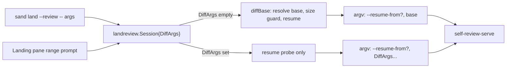

# Plan: Review a chosen diff range from `sand land` and the Landing pane

## Original Work Order

> Take a look at https://github.com/Lullabot/sandbar/issues/226 - I like being able to pass arguments like this. How should we integrate this into the TUI, if at all?
>
> (Follow-up) I like your suggestion of the CLI pass-through and a review-range for the TUI. Use /st-create-plan to plan this out.
>
> Scope agreed in discussion: (1) CLI: `sand land NAME PATH --review -- <git diff args>` passes args through to self-review-serve as discrete argv elements in place of the resolved base (new `landreview.Session` `DiffArgs` field; skip `diffBase`/`maxDiffFiles` when set, probe Resume separately, keep `--resume-from` carry-in and `--clean`; no-`--` behaviour unchanged; update `sand land --help` and `docs/using-sand/review.md` with an example). (2) TUI: Landing pane gets a separate key opening a single textinput (blank → whole branch, e.g. `HEAD~2`, `HEAD~2...HEAD`), whitespace-split into argv with no shell, esc cancels; `v`/`V` unchanged; help derives from the existing bindings; update goldens. Out of scope: `default-diff-args` from `.self-review.yaml`, a commit-picker UI, a numstat file-count guard.

Source issue: Lullabot/sandbar#226, "`sand land --review`: accept a diff range, the way `self-review` takes git diff arguments".

## Plan Clarifications

| Question | Answer |
| --- | --- |
| Is backwards compatibility required? | Yes. `sand land … --review` with no `--`, the TUI `v`/`V` keys, and a zero-value `landreview.Session` must behave exactly as today. Every change is additive. |
| Which TUI key opens the range prompt? | Not `r` (an earlier suggestion): `r` is the Landing pane's rescan key (`landingRefreshKey`). Use `R`. *Auto-resolved:* the pane's only bindings are `enter`/`o`, `r`, `v`, `V` and `↑↓`, so `R` is free. |
| Should the file-count guard and `default-diff-args` be handled for custom ranges? | No; both are out of scope. *Auto-resolved from the agreed scope.* |

## Executive Summary

Today `landreview.Session.Run` always resolves its own review base in the guest (`diffBaseScript`) and appends it to the `self-review-serve` argv. That default suits "review what I have here", but there is no way to ask for a narrower slice, such as the last two commits after a round of review feedback. The issue reports a 15-commit, 92-file review when 2 commits and 6 files were wanted.

The plan adds an optional list of git diff arguments to `landreview.Session`. When it is non-empty, `Run` passes those arguments to `self-review-serve` unchanged, in place of the resolved base, exactly as the desktop `self-review <git diff args>` does. The CLI exposes it as `-- <args>` after `--review`; the TUI exposes it as a small one-line prompt on the Landing pane behind a dedicated key. The shared operation lives in `internal/landreview` so the two entrypoints cannot drift, per the repository's rule that CLI and TUI verbs stay equivalent.

The default path is untouched. No range means the current base resolution, file-count guard, and description run as before. This keeps the change small and reviewable, and avoids a picker or a new roster-style surface.

## Context

### Current State vs Target State

| Current State | Target State | Why? |
| --- | --- | --- |
| `Session.Run` always calls `diffBase` and appends the resolved commit to the serve argv. | When `DiffArgs` is set, those arguments are appended instead and `diffBase`'s base resolution is skipped. | Users need to review a narrower range than "everything not on a remote". |
| `sand land` rejects anything after `--review` other than known flags. | `sand land NAME PATH --review -- <args>` accepts diff arguments after `--`. | Mirrors `self-review <git diff args>` so existing knowledge carries over. |
| The Landing pane's `v`/`V` always review the whole local branch. | A dedicated key opens a one-line range prompt; blank behaves like `v`. | The TUI is the primary surface and must offer what the CLI offers. |
| `Resume` (a saved `review.xml`) is reported only by `diffBaseScript`, together with the base. | The resume check also runs on its own when a range is given. | A saved review must still be carried in with a range, and `--clean` must still discard it. |
| `sand land --help` and `docs/using-sand/review.md` describe only the automatic base. | Both document the pass-through with an example of reviewing the last few commits. | Acceptance criterion in the issue. |

### Background

- `diffBaseScript` (`internal/landreview/landreview.go`) is a fixed literal that prints `sandresume=1` when a default-path `review.xml` exists, then `sandbase`, `sanddate`, `sandcommits` and `sandfiles`. Resume does not depend on the base, and `parseDiffBase` already keeps `Resume` when no base was found.
- `Session.Run` runs `sh -c serveScript sh <path> [--resume-from <file>] [<base>]`. Every element is a discrete argv element around a fixed script; nothing guest-derived is ever a shell string. The new arguments must keep that property.
- `self-review-serve` applies `default-diff-args` from `.self-review.yaml` only when it receives no diff arguments. Today `sand land` always passes a base, so that setting never applies. This plan does not change that; see Notes.
- The Landing pane already uses a `textinput` for the issue field (`newIssueInput`), including the `SetWidth` requirement described in `landing.go`, so a range prompt has an existing pattern to follow.
- Repository rules that apply: the CLI and TUI share operations in `internal/landreview`; the TUI cannot import `cmd/sand`; keys and help derive from bindings, with no hand-maintained help list; tests fake `provider.Provider` with `internal/providerfake`; TUI changes need golden updates with the diff eyeballed; commit messages and code comments must not reference plans.

## Architectural Approach

### Shared session support for diff arguments
**Objective**: Make `landreview.Session` accept caller-supplied diff arguments and use them in place of the resolved base, without changing the no-range path.

- Add an optional `DiffArgs []string` field to `Session`. A nil or empty value keeps today's behaviour exactly.
- When set, `Run` does not resolve a base and does not apply the `maxDiffFiles` guard. The guard depends on the resolved base's file count; measuring a user-chosen range would mean running the user's arguments through a second guest `git` invocation, which is deliberately out of scope.
- The resume check must still run. Split the `sandresume` snippet out of `diffBaseScript` into a shared constant used by both `diffBaseScript` (unchanged output) and a small new fixed-literal script for the range path, so the two cannot diverge on the `output-file` rules. The script takes the checkout path as a positional argument and prints nothing guest-derived except the flag.
- `Clean` behaves as now: `removeOutput` runs first, so the resume probe finds nothing and no `--resume-from` is added.
- Argv order stays flags first, then the range: `--resume-from <path>` (when resuming), then each `DiffArgs` element as its own argv element. Arguments reach the fixed `serveScript` as positional parameters, never interpolated.
- The progress line printed by `Run` gets a range variant, for example "reviewing <path> in <vm> (range: HEAD~2)", alongside the existing `describeBase` wording. `describeBase` itself is unchanged.
- Arguments are the user's own input, not guest data, so no allow-list is applied. Empty elements are dropped, and flags such as `--staged` pass through untouched.

### CLI pass-through in `sand land`
**Objective**: Accept `-- <git diff args>` after `--review` and hand them to the session.

- `runLand` parses flags with `flag.FlagSet` after `reorderLandFlags`, which would treat `--` as ending flag parsing and mix the diff arguments with the positional NAME and PATH. Split `args` at the first `--` before reordering; everything after it is `DiffArgs`, everything before it goes through the existing parser unchanged.
- Refuse `--` arguments without `--review` with a clear error, matching how `--clean` is already refused without `--review`. An empty list after `--` (a trailing `--`) is treated as no range.
- `--pr`/`--web` combination rules and PATH requirements are unchanged.
- Update `landUsage` with the new synopsis line and an example such as `sand land NAME PATH --review -- HEAD~2`, plus a sentence on `HEAD~2...HEAD` and `--staged`, and one on how a saved review is still carried in.
- Preserve the exit code and error style of the surrounding code, and pass the field through `landReview` without changing it.

### Landing pane range prompt
**Objective**: Give the TUI the same capability without slowing the common case.

- Add a `landingReviewRangeKey` binding and a matching entry wherever the Landing pane derives its footer help, so the key appears next to `v review` and disappears when a review is in flight on that row, as `v` does. The key is `R`, not `r`, because `r` is the rescan key; `R` is verified unused on this pane.
- The key opens a single-line `textinput`, styled and sized like the issue input (including the width setting the existing code documents as required). The placeholder and help say a blank value reviews the whole branch and give examples (`HEAD~2`, `HEAD~2...HEAD`, `--staged`). All help strings are constants, per the project's golden-file rule.
- `enter` submits: split the text on whitespace into argv elements with no shell or quote handling, then start the review through the existing review-start body with `DiffArgs` set. Blank input starts a review identical to `v`. `esc` closes the prompt and starts nothing.
- Reuse `startLandingReview` rather than duplicating it: extend it (or the small wrapper both verbs call) to take the diff arguments, so the in-flight-review guard, context ownership, URL forwarding and teardown are shared and unchanged. `v` and `V` keep their current signatures and behaviour, and `V`'s confirmation flow is not altered.
- The prompt must obey the pane's existing input rules: while it is focused, keys go to the input, `q` is not treated as quit, and leaving the pane closes it. Height is budgeted so the footer stays visible at 80x24.
- A cancelled or failed review reports through the existing `landReviewDoneMsg` path; no new message type is needed unless the range needs to be echoed on the row.

### Tests and documentation
**Objective**: Prove the argv, the unchanged default, and the user-facing surfaces.

- `internal/landreview`: with a `providerfake.Provider`, assert the exact `self-review-serve` argv for no range (unchanged), a single range, a `...` range, `--staged`, a range with a saved `review.xml` (carry-in present), and a range with `Clean` (carry-in absent, `removeOutput` first). Assert the guest base script is not run when `DiffArgs` is set, and that arguments containing shell metacharacters arrive as single inert argv elements.
- `cmd/sand`: table tests for splitting at `--`, `--` without `--review`, trailing `--`, and unchanged parsing without `--`.
- `internal/ui`: behavioural tests for the prompt (open, type, submit reaches the session with the split args; blank equals `v`; `esc` starts nothing; no start while a review is in flight), plus a golden for the prompt open and for the updated footer. Regenerate with `-update` and review the text diff.
- Docs: update `docs/using-sand/review.md` with a "review only the last few commits" section covering CLI and TUI, and the `sand land --help` text. Run the `mkdocs build --strict` check.

## Risk Considerations and Mitigation Strategies

Technical Risks

- **Skipping the file-count guard on a custom range**: an enormous range could reach `self-review-serve` and fail with a Node buffer error instead of a readable message.
    - **Mitigation**: Accepted and documented; the user chose the range deliberately. A numstat-based guard is recorded as follow-up rather than built here.
- **Resume probe drift**: two copies of the `output-file` check could disagree and resume from the wrong review.
    - **Mitigation**: Share one constant between `diffBaseScript` and the range-path script, and keep the existing `diffBaseScript` tests passing unchanged.
- **`--` handling in the flag reorderer**: splitting at `--` too late could put diff arguments among positionals.
    - **Mitigation**: Split before `reorderLandFlags` and test both orders of flags and positionals.

Implementation Risks

- **TUI key collision or input focus bugs**: `r` is taken, and a focused text input can leak keys such as `q`.
    - **Mitigation**: Use a verified-free key, follow the issue input's focus handling, and cover it with behavioural tests plus a golden.
- **Argument injection expectations**: users may assume shell quoting works in the prompt.
    - **Mitigation**: The prompt help states arguments are split on spaces; git revisions and flags need no quoting. Quoted values are out of scope.

## Success Criteria

### Primary Success Criteria
1. `sand land NAME PATH --review -- HEAD~2` serves a review of the last two commits plus working-tree changes; `-- HEAD~2...HEAD` serves only those commits; `-- --staged` works.
2. `sand land NAME PATH --review` with no `--` produces the same argv, output and behaviour as before, with the existing tests unchanged and passing.
3. Arguments after `--` reach `self-review-serve` as discrete argv elements; a test proves metacharacters stay inert.
4. A saved `review.xml` is carried in with a range, and `--clean` discards it first.
5. The Landing pane's range key starts the same review through the shared session, blank input equals `v`, and `esc` starts nothing; `v`/`V` behave as before.
6. `sand land --help` and `docs/using-sand/review.md` document the pass-through with an example.
7. `gofmt -l .` is empty, `go vet ./...` and `go test ./...` pass, and the docs build under `--strict`.

## Self Validation

- Run `go build ./cmd/sand && ./sand land --help` and confirm the new synopsis and example appear.
- Run `go test ./internal/landreview ./cmd/sand ./internal/ui` and confirm the new argv, `--` parsing and prompt tests pass, and that the pre-existing tests pass without edits.
- In a scratch Git repository, run `sh -c` with the same `serveScript` arguments the session builds for `HEAD~2` and check the resulting argv with a stub `self-review-serve` that prints its arguments; confirm they match `self-review-serve HEAD~2` exactly and that a `; touch /tmp/x` argument creates no file.
- Run `go test ./internal/ui -run TestTUI -update`, then `git diff internal/ui/testdata` and confirm the only changes are the new footer entry and the range prompt.
- Launch the TUI under a fake provider or `teatest`, open the Landing pane, press the range key, type `HEAD~2`, press enter, and confirm the review starts with those arguments; repeat with blank input and with `esc`.
- Run `uvx --with-requirements docs/requirements.txt mkdocs build --strict` and confirm it succeeds.
- Where a Lima host is available, run the real end-to-end path once: create a checkout with three commits, run `sand land NAME PATH --review -- HEAD~1`, and confirm the served review lists only the last commit.

## Documentation

Yes, documentation must change.

- `docs/using-sand/review.md`: add the range pass-through, CLI and TUI examples, how it interacts with a saved review and `--clean`, and the note that the automatic base and file-count guard apply only when no range is given.
- `sand land --help` (`landUsage` in `cmd/sand/land.go`).
- The Landing pane's key help, through its bindings.
- `AGENTS.md`: yes, add a short note under the `landreview` entry that `Session.DiffArgs` replaces the resolved base and skips the size guard, and that the resume probe is separate, since a future agent could otherwise "restore" the guard or fold the probe back into the base script.

## Resource Requirements

### Development Skills
Go, Bubble Tea v2 (`charm.land/...`) and `bubbles` textinput conventions, POSIX `sh` and Git plumbing, and the repository's `providerfake` and `teatest` test seams.

### Technical Infrastructure
Existing toolchain only: `go`, `gofmt`, `uvx` for the docs build. No new dependencies. A Lima host is optional, for the end-to-end check.

## Integration Strategy

The change sits entirely behind two existing entrypoints (`cmd/sand/land.go` and the Landing pane) and one shared package (`internal/landreview`). Work starts from a fresh worktree off `origin/main`; commits follow Conventional Commits (for example `feat(land): review a chosen diff range`) with no plan references in messages or comments.

## Notes

- **Out of scope**: honouring `default-diff-args` from `.self-review.yaml` (it would need the guest to read the project config and stop passing a base), a commit-picker UI, and a numstat-based size guard for custom ranges. The first is worth a follow-up issue.
- 2026-09-29: Refined after a baseline review. Verified `R` is unused on the Landing pane, recorded it and the scope exclusions as auto-resolved clarifications, and removed an unnecessary NUL check from the argument handling (argv cannot contain NUL).
- The TUI prompt is intentionally a plain string, not a structured picker: a second UI for the same idea would add a render path and a guest round trip on a path where guest contact is avoided.
