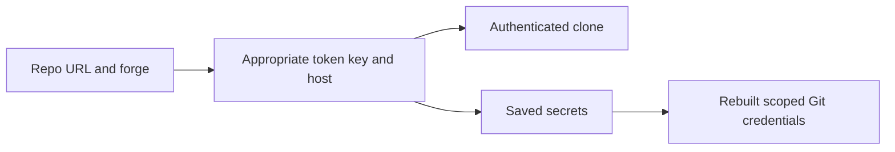
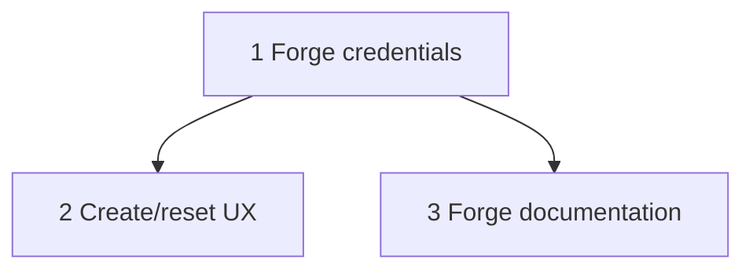

# Plan: GitLab token UX

## Original Work Order
> [$st-full-workflow](/home/andrew/github.com/Lullabot/sandbar/.agents/skills/st-full-workflow/SKILL.md) pull main and implement https://github.com/Lullabot/sandbar/issues/188, considering that we need to have a really good UX considering we also support GitHub.

## Plan Clarifications
| Question | Answer |
| --- | --- |
| Include self-hosted GitLab and preserve GitHub? | Include self-hosted GitLab too. GitHub support is explicitly required in the work order. |

## Executive Summary
GitLab.com and self-hosted GitLab users will clone private repositories through the same create flow, authenticate Git in fresh shells, and retain directory-scoped credentials through reset. Existing GitHub flows remain supported.

Infer the forge for github.com and gitlab.com. An explicit forge selection identifies custom GitLab hosts, avoiding guessing from arbitrary hostnames. Scope GITLAB_TOKEN credentials to the directory and its host; preserve the existing GitHub token convention. No GitLab landing implementation is included.

## Context
### Current State vs Target State
| Current | Target | Why |
| --- | --- | --- |
| Every clone token is GH_TOKEN | Forge-appropriate tokens | GitLab clone and reset authentication |
| GitHub-only form labels | Neutral labels and host-specific help | Clear onboarding for both forges |
| Only fixed GitHub credential wiring | Scoped GitLab wiring including custom hosts | Fresh-shell Git authentication |
### Background
Issue 188 requests clone, push, scoped-secret, reset, CLI help and permissions documentation. The user also requests self-hosted GitLab.

## Architectural Approach
### Forge selection
Add optional CreateConfig.CloneForge and CLI --clone-forge (auto, github, gitlab). The form selects automatically for public hosts and allows GitLab for custom hosts. Persist the non-secret choice in recorded configuration and retain it during reset.
### Credential delivery
Wire GITLAB_TOKEN in non-empty scopes using the scope host for self-hosted GitLab. Clone provisioning uses an HTTPS credential helper with oauth2 and no token in process argv. GitLab create tokens are saved in the repository parent scope and reapplied after reset. Multiple recognized tokens in one scope must coexist without overwriting.

## Risk Considerations and Mitigation Strategies

Technical Risks

Token leakage and wrong-host delivery: keep tokens off argv and logs, bind helpers to HTTPS host, validate forge choices, and exercise real Git credential lookup in isolated homes. GitHub helper precedence must not override scoped GitLab credentials.

Implementation Risks

CLI/TUI divergence and reset data loss: verify both entrypoints and persist the forge selection. Check narrow-terminal form rendering and help.

## Success Criteria
### Primary Success Criteria
1. CLI and TUI clone tokens support github.com, gitlab.com and explicitly selected self-hosted GitLab.
2. Scoped GITLAB_TOKEN authenticates real Git credential lookup for its host in fresh shells, survives reapplication, and supports token rotation/removal.
3. Reset retains forge identity and reapplies stored credentials; private recloning can use a supplied clone token as with GitHub.
4. Form, secrets tips, CLI help and documentation explain host selection, scope, token permissions and reset behavior.
5. GitHub existing behavior remains covered and all applicable checks pass.

## Self Validation
Run new real-Git isolated-home credential integration tests, inspecting returned host/username/password for GitHub, gitlab.com and a custom host, including coexisting tokens and reapplication. Execute Go suite, vet, build, Python lifecycle tests, Ansible syntax, MkDocs strict build. Regenerate and inspect TUI golden diffs and run CLI --help to inspect forge guidance. Live private forge operations require user credentials and are not claimed by local validation.

## Documentation
Update secrets.md, CLI reference, relevant TUI/onboarding guidance and AGENTS.md with forge selection and self-hosted scoped-token semantics. Link official GitLab permissions: Code Download for clone/pull and Code Push for push at project/group boundary. Explain legacy read_repository/write_repository separately.

## Resource Requirements
### Development Skills
Go, Ansible, Bubble Tea, technical documentation.
### Technical Infrastructure
Existing Go/Git, Ansible and uv/MkDocs. No new production dependency.

## Execution Blueprint
**Validation Gates:** config/shared/verification-gate.md and config/hooks/POST_PHASE.md
### Dependency Diagram

### ✅ Phase 1: Credential delivery
**Status:** completed
**Parallel Tasks:**
- ✔️ Task 001: Forge credentials (completed)
### ✅ Phase 2: User experience and documentation
**Status:** completed
**Parallel Tasks:**
- ✔️ Task 002: Create/reset UX (completed; depends on: 001)
- ✔️ Task 003: Forge documentation (completed; depends on: 001)
### Post-phase Actions
Verify evidence and create conventional phase commits.
### Execution Summary
- Total Phases: 2
- Total Tasks: 3

### Phase 1 verification
Parent ran `go test ./internal/vm ./internal/secrets ./internal/provision` and Ansible syntax check successfully, including real HTTPS authenticated clone/fetch/push and real-Git lookup tests. `gofmt -l` and `git diff --check` are clean. Feature-branch script skipped detached HEAD; continuing on current checkout as instructed.

### Phase 2 verification
Parent inspected the CLI help, deterministic focused-token 80x24 golden, and changes to token seeding, reset configuration, secrets tips and docs. The full Go race suite passes with `TMPDIR=/var/tmp`. Vet/build/format checks pass; all 22 Python lifecycle tests, Ansible syntax and MkDocs strict build pass. Initial race snapshots exposed unpinned host free space in two template form fixtures; those fixtures now explicitly suppress host warnings. Golden trailing padding is intentional; nongolden whitespace checks pass.
