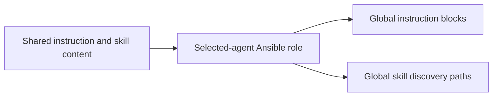
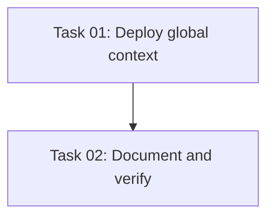

# Plan: Global Agent Environment Context

## Original Work Order
> Propose ways we could ship skills or system prompts in provisioned VMs as global skills.
>
> it might also be useful to expose some skills so that the agent *knows* its within a sandbar VM.
>
> but I have totally had to say "hey, go ahead and use sudo". This should be automatic.
>
> We also support Pi and OpenCode, can we install configs for them too?
>
> I like the direction this is going in. Let's flesh it out using $st-full-workflow
>
> You know, I have another session working on the provisioning aspect. Let's just focus this PR on creating the skills and deploying them for new VMs.

## Plan Clarifications
| Question | Answer |
| --- | --- |
| Include backwards compatibility or existing-VM migration? | No. Focus this PR on skills and deployment for new VMs; another session owns broader provisioning changes. |

## Executive Summary
Ship concise global environment instructions and one portable sandbar-environment skill for Claude Code, Codex, Pi, and OpenCode. The instructions identify the guest and authorize necessary passwordless sudo within requested work. The skill provides accurate local guidance on tmux and the shipped development environment without browsing the documentation site.

A shared Ansible role installs the same content for selected agents during normal clone provisioning. Preserve personal instructions and unrelated skills. Do not introduce update commands, automatic convergence, or existing-VM migration. No changes to VM lifecycle orchestration or reset staging are required.

## Context
### Current State vs Target State
| Current | Target | Why |
| --- | --- | --- |
| Custom tmux settings are unknown to agents | Global skill describes shipped settings and live inspection | Prevent generic Ctrl-B advice |
| Passwordless sudo exists but users must explain it | Small global instruction block permits necessary guest sudo | Avoid repeated permission reminders |
| Four agents have separate discovery conventions | Shared content installed in supported global locations | Equal behavior across selected agents |
### Background
Tmux config sets Ctrl-A, vi copy mode, mouse support, and custom splits. All supported providers run the same playbook. Agent roles execute outside the base phase. Global instructions are distinct from replacing harness system prompts. Detailed skills load on demand.

## Architectural Approach
### Shared content
**Objective**: Keep one portable source of environment facts.
Store a short instruction fragment and sandbar-environment/SKILL.md with local references in a dedicated role. Include sudo, tmux navigation, persistent shells, installed tools, image clipboard, and guest/workstation responsibilities. Explain how to inspect current tmux settings; defaults are not proof of live state. Do not embed secrets or suggest host access.
### Selected-agent deployment
**Objective**: Install discoverable content during new VM provisioning.
Run a shared role outside base after agent installation. Deploy instructions as marked Markdown comment blocks to ~/.claude/CLAUDE.md, ~/.codex/AGENTS.md, ~/.pi/agent/AGENTS.md, and ~/.config/opencode/AGENTS.md for selected agents. Deploy one skill in ~/.agents/skills for Codex/Pi/OpenCode, and expose the same content for Claude under ~/.claude/skills. Preserve unrelated files, personal text, and existing permissions. Detect conflicting user-owned skill destinations rather than silently replacing them. Use ordinary role files so embedded playbooks carry the bundle. Keep base images agent-free.

## Risk Considerations and Mitigation Strategies

Technical Risks

Harness discovery and symlink behavior vary. Use documented locations and integration checks of installed paths and relative references. Live tmux settings may differ; teach inspection and identify shipped defaults explicitly.

Implementation Risks

Personal files may already exist. Preserve unowned content and modes, refresh only Sandbar-owned blocks and skill artifacts, and verify a second run is idempotent. A failed copy must fail provisioning visibly.

## Success Criteria
### Primary Success Criteria
1. New VM full/finalize runs install global context for each selected agent; base and unselected agents receive no agent context.
2. Instructions identify the Sandbar guest and permit needed sudo for authorized guest work.
3. The skill accurately explains Ctrl-A, pane navigation, splits, detach, live inspection, and local tools.
4. Existing personal instructions and unrelated skills survive; repeat execution refreshes owned content without duplication.
5. Ansible integration tests inspect actual temporary guest filesystem output; all repository checks pass.

## Self Validation
Execute the real role through ansible-playbook against isolated temporary guest homes for each selection and base/full/finalize. Inspect installed instruction blocks, skill paths, linked references, permissions, preserved personal text, collision handling, and idempotent repeat output. Run the isolated Python lifecycle suite, Ansible syntax check, go vet and go test, and strict MkDocs build. Review skill content against shipped templates and documentation. These checks verify deployment and content, not nondeterministic model adherence; live authenticated agent evaluation is a follow-up rather than a completion claim.

## Documentation
Update the existing available-tools and provisioning documentation to describe global environment context, supported agents, and new-VM delivery. Update AGENTS.md only where facts change; no new documentation system.

## Resource Requirements
### Development Skills
Ansible, agent skill authoring, Python integration testing, Markdown documentation.
### Technical Infrastructure
Existing Ansible, Python unittest, Go toolchain, uvx/MkDocs. No new runtime dependency.

## Integration Strategy
Use existing site.yml provisioning and provider transports. Leave CLI/TUI commands, provider lifecycle, reset staging, and live updates outside this PR.

## Execution Blueprint

**Validation Gates:** .ai/strikethroo/config/hooks/POST_PHASE.md and config/shared/verification-gate.md.

### Dependency Diagram

### ✅ Phase 1: Context implementation
**Status:** completed
**Parallel Tasks:**
- ✔️ Task 01: Deploy global agent context (completed)

### Phase 2: Documentation and verification
**Status:** pending
**Parallel Tasks:**
- Task 02: Document and verify agent context (depends on: 01)

### Post-phase Actions
Inspect actual outputs, run fresh verification, update statuses, and create a conventional commit per phase.

### Execution Summary
- Total Phases: 2
- Total Tasks: 2

### Implementation verification evidence
Parent independently ran the real role integration suite: 4 tests in 100.415s, OK. Ansible site syntax check passed; skill validator reported valid. An isolated tmux server loaded with the shipped template confirmed C-a, arrows for pane movement, custom splits, new window, and detach. Static task import fixes the dynamic-include task-count mismatch before completion. No user VM was changed.
