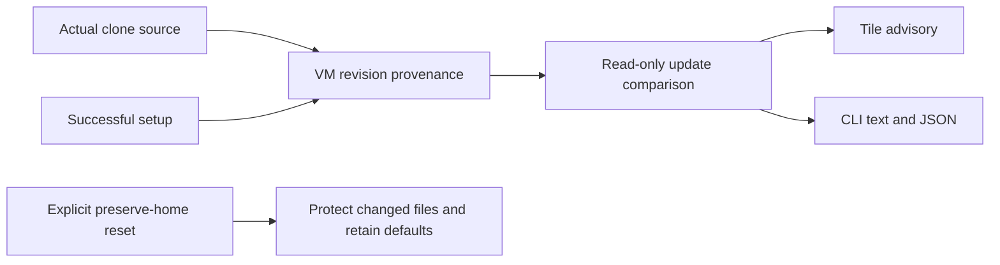
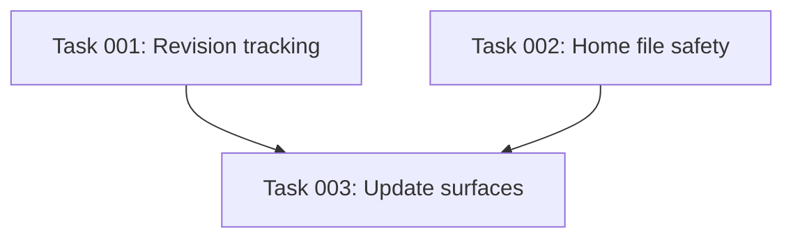

# Plan: Safe VM Update Notices

## Original Work Order
> Let's improve how we handle updates of our base vm and playbook for users. A few things:
>
> 1. Can we show a line on each tile when a given vm's base image is out of date? Or a message in the messages list perhaps when starting or connecting to a shell? I'm open to ideas here.
> 2. If we upgrade the ansible playbook steps that happen after cloning a base image, what should we do? The challenge is a user or agent may have changed *anything* and we don't want to clobber it.
>
> I suspect we have to do something special for any provisioning into the home directory.

> I agree with your three states to show. We should also make sure we have a way to expose that from the CLI. Let's follow your safe update policy.
>
> Yes, we absolutely should preserve existing VMs.
> We should never rerun provisioning automatically, and show update notices and offer resets.

## Plan Clarifications
| Question | Answer |
| --- | --- |
| Preserve existing VMs? | Yes, absolutely. Missing version metadata means unknown; never prevent use. |
| Update mechanism? | Never rerun provisioning automatically. Show notices and offer explicit resets. |
| Update display and protection? | Base update available, setup update available, version unknown; expose in CLI too. Follow safe file policy: replace unchanged provisioned files only, preserve edited or unknown files and retain new defaults separately. |

## Executive Summary
Record the base revision actually cloned and the setup revision successfully applied to each VM, using provider provenance so local Lima, remote Lima and Proxmox share the same behavior. Compare these with the current desired revisions without booting guests or running provisioning. Surface independent base/setup advisories and unknown metadata on tiles and in a read-only CLI command.

Explicit resets remain the update mechanism. Protect preserved home configuration against finalize writes. Record baselines for files sand provisions, replace only unchanged files, and retain proposed defaults separately when a file is edited or its origin is unknown. Existing VMs stay usable without a metadata migration that invents history.

## Context
### Current State vs Target State
| Current State | Target State | Why? |
| --- | --- | --- |
| Base freshness only affects future clones | Each VM retains its actual base revision | Rebuilding the shared base must not mark older clones current. |
| No per-VM setup revision | Record successful setup revision independently | Setup changes need a distinct advisory. |
| Home restored before finalize is overwritten | Preserve edited/unknown configuration and offer separate defaults | Users and agents own their changes. |
| No headless update inspection | Read-only CLI inspection with JSON output | Automation must see the same state as tiles. |

### Background
Provider transports differ. Published-image and golden-template provenance must describe the actual source; do not stamp the newest source merely because finalize succeeded. Failed builds and abandoned-build healing cannot claim setup completed. Missing history remains unknown.

## Architectural Approach
### Revision tracking
Use additive secret-free provenance fields plus shared comparison logic and provider-specific source revision resolution. Base identity includes applicable image/preparation changes, and setup identity includes post-clone playbook content. Keep tool selections canonical. Avoid synchronous filesystem/network operations in tile rendering.
### User notices
Show compact tile advisories without displacing fixed gauge rows; offer the existing reset action. A read-only `sand updates NAME` command supports human output and JSON with independent base/setup states. Unknown revisions are explicitly unknown, never current or stale by assumption. No start/shell side effects.
### Home configuration safety
Track installed content for provisioned home configuration. During preserved-home reset, retain files that differ from their baseline, including untracked legacy files, and save the new default separately without overwriting user artifacts. Update baselines only for content actually installed; avoid recloning preserved projects or rewriting credentials as an update side effect. Cover symlinks and reruns conservatively.

## Risk Considerations and Mitigation Strategies

Technical Risks

Incorrect current claims: capture actual source, never infer old VM history from today's base. File loss: preserve changed/untracked files and test actual filesystem contents. Provider differences: use optional seams and each provider's revision format. Home reset changes: retain recovery archives on failures.

## Success Criteria
### Primary Success Criteria
1. A new successful VM carries truthful base/setup revisions; failures and legacy VMs do not acquire invented successful history.
2. Tile and CLI show base update available, setup update available, and version unknown consistently, including independent simultaneous advisories.
3. Update checking does not provision, start, or mutate guests.
4. Preserved-home resets retain edited/untracked configuration and provide new defaults separately; unchanged tracked files receive new content.
5. Existing VMs remain usable and all providers retain support.

## Self Validation
Run focused new tests proving revision capture/comparison and actual filesystem protection, inspect resulting default/baseline files, and drive tile integration output with stale and unknown markers. Run `go run ./cmd/sand updates -h` and inspect documented flags without contacting a provider. Run Go tests, build, vet, Python lifecycle tests, Ansible syntax validation and strict docs build. Inspect golden differences and the final patch for guest mutations in read-only inspection.

## Documentation
Update the existing VM reset/update documentation, CLI reference and AGENTS.md with revision semantics and home file ownership. These updates describe the requested behavior rather than adding a new documentation system.

## Resource Requirements
### Development Skills
Go provider/provisioning integration, Bubble Tea rendering, Ansible/Python guest filesystem safety.
### Technical Infrastructure
Existing Go, Python, Ansible and uv tools; no new dependencies or automatic in-place updater.

## Execution Blueprint

**Validation Gates:** `/config/hooks/POST_PHASE.md` and `/config/shared/verification-gate.md`.

### Dependency Diagram

### Phase 1: ✅ Revision tracking and home safety
**Status:** completed
**Parallel Tasks:**
- ✔️ Task 001: Truthful revision tracking
- ✔️ Task 002: Preserve home configuration

### Phase 2: ✅ User update surfaces
**Status:** completed
**Parallel Tasks:**
- ✔️ Task 003: Tile and CLI notices (depends on: 001, 002)

### Post-phase Actions
Review evidence, run verification and create a conventional commit per phase.

### Execution Summary
- Total Phases: 2
- Total Tasks: 3

### Phase 1 Verification
Root verified provider/manage/provision/registry tests, full Python lifecycle suite (31 tests), final helper filesystem tests (9), and final Ansible home-role integration (including GitLab include preservation and zero-change rerun). Ansible syntax, gofmt and diff checks passed. Temporary standalone Ansible fixture also installed and preserved actual temp-home contents.

### Phase 2 and Final Verification

Root ran the CI Go race/coverage command over all packages with `TMPDIR=/var/tmp/s26`; every package passed and internal coverage was 90.9%, meeting the existing 90.9% floor. Build, vet, `go run ./cmd/sand updates -h`, Ansible syntax, strict MkDocs build, and the full Python suite (33 tests) passed. New real-provider revision tests and checkout/embedded source tests passed, including the no-extraction filesystem assertion. The production Ansible home-role fixture verifies installed defaults, retained edits and GitLab include blocks, proposed defaults, and zero-change reruns on actual temporary home contents. No live VM reset or VM e2e was performed.

Root inspected the read-only CLI path and asynchronous tile refresh, and confirmed they invoke no lifecycle or marker writes. Legacy metadata is read without migration or quarantine. Tile goldens retain fixed gauges and work badges; existing board golden changes only replace legacy uptime footers with unknown-version advice. Formatting and non-golden diff checks passed. Golden snapshots intentionally preserve padded terminal rows, the sole trailing-whitespace exception.

Initial race compilation exhausted the shared `/tmp` tmpfs. Moving temporary files to a longer path exposed existing Unix socket path-length limits; the short `/var/tmp/s26` path resolved both environmental failures. A legacy-index fixture initially used `local` instead of the persisted `lima` provider identifier and was corrected. Coverage initially measured 90.8%; adding real provider/source boundary tests brought it to 90.9% without changing the gate.
