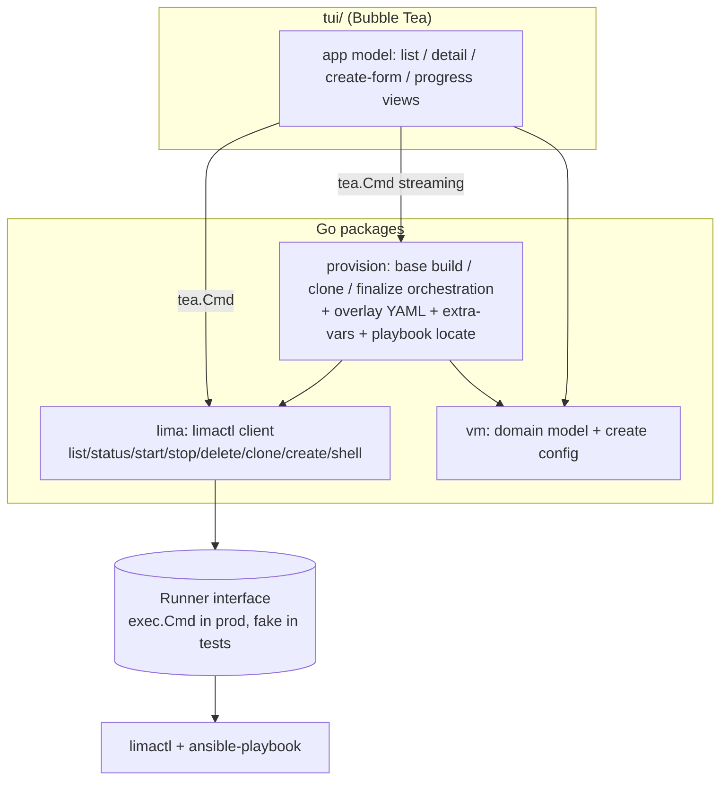
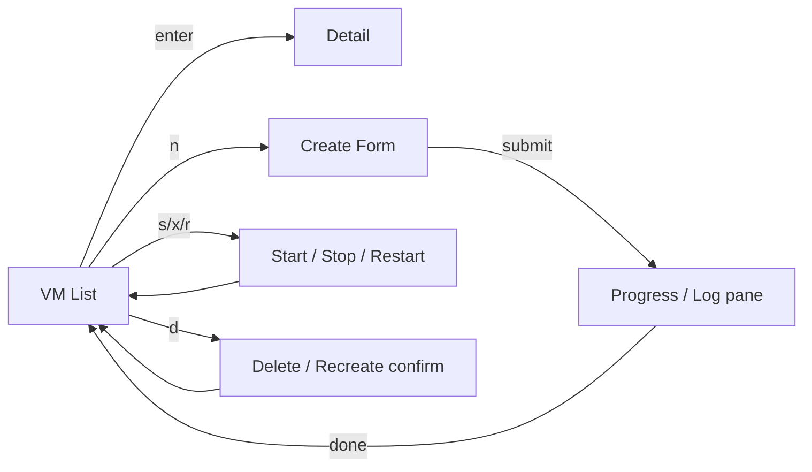
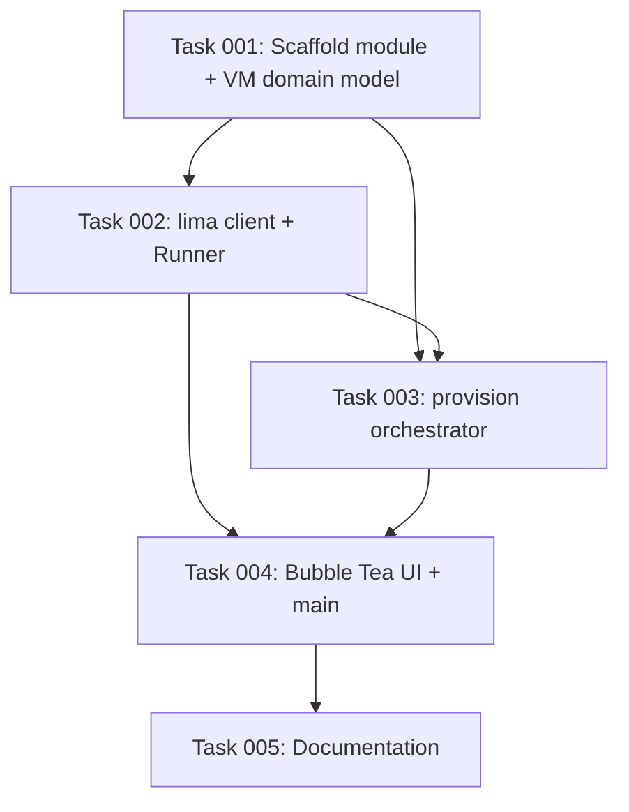

# Plan: Sandbox VM Manager TUI (Go + Bubble Tea)

## Original Work Order
> Create a golang TUI application based on the new-vm bash script. Our goal is a sandbox virtual-machine manager with CRUD options. Use BubbleWrap (the well-used golang tui library).

## Plan Clarifications

| Question | Answer |
|----------|--------|
| "BubbleWrap" — did you mean Charm's Bubble Tea? (bubblewrap is a sandboxing tool, not a TUI lib) | **Bubble Tea (Charm)**: bubbletea + bubbles + lipgloss |
| How should the Go app perform VM operations (the create flow is heavy)? | **Reimplement fully in Go** — port the new-vm.sh orchestration (Lima overlay rendering, base build, clone, finalize, Ansible vars) into Go; shell out only to `limactl` and `ansible-playbook` as external tools |
| Which CRUD operations should the TUI expose? | **All four**: Create new VM, List + view details, Start/Stop/Restart, Delete/Recreate |
| Where should the Go app live, and what about the bash script? | **New subdirectory with its own `go.mod`; leave `new-vm.sh` in place unchanged** |

## Executive Summary

This plan delivers a self-contained Go terminal UI, built on Charm's Bubble Tea
stack, that replaces the interactive surface of `scripts/new-vm.sh` with a
keyboard-driven manager for the project's disposable Claude Code Lima VMs. The
application exposes the full lifecycle as CRUD: **Create** a new VM (via the same
base-image → clone → finalize flow the script uses), **Read** the list of
instances and a per-VM detail view, **Update** their run state
(start/stop/restart), and **Delete** or recreate them.

The orchestration logic that `new-vm.sh` performs in Bash — rendering the Lima
overlay YAML, building the phased Ansible `extra-vars`, locating the playbook,
building the stopped base image, cloning it, and running the light "finalize"
pass — is **ported into Go** rather than shelling out to the existing script. The
Go binary shells out only to the same two external tools the script already
relies on (`limactl` and, inside the guest over `limactl shell`, `ansible-playbook`).
This keeps the binary distributable on its own while preserving the proven,
security-conscious provisioning model (ephemeral VMs, read-only playbook mount,
secrets streamed over guest stdin into tmpfs, never into argv or the persistent
disk).

The chosen approach favors a small, well-layered design: a thin testable
`limactl` client, a provisioner that encapsulates the ported orchestration and
streams its output, a plain VM domain model, and a Bubble Tea UI layer on top.
Long-running provisioning runs as an asynchronous `tea.Cmd` that streams progress
into a log pane so the UI never blocks. The existing `scripts/new-vm.sh` remains
untouched as the curl|bash / CI entry point; the TUI is an additive, interactive
alternative.

## Context

### Current State vs Target State

| Current State | Target State | Why? |
|---------------|--------------|------|
| VMs are created only through the interactive `new-vm.sh` Bash prompts | A keyboard-driven TUI lists, creates, controls, and deletes VMs | A manager UI is faster for day-to-day multi-VM work and is the explicit goal |
| Listing/status/lifecycle requires raw `limactl list/start/stop/delete` commands | One screen shows all VMs with live status and a detail view | "Read" half of CRUD; removes memorizing `limactl` invocations |
| Provisioning orchestration lives only in Bash | The base/clone/finalize orchestration is also available as Go packages | "Reimplement fully in Go" so the binary is self-contained and testable |
| Create flow is one-shot, output scrolls past in a pipe | Create runs async with a streamed, scrollable progress/log pane | Long provisions must not freeze the UI; users need to watch progress |
| No Go code in the repo | A new `tui/` subdirectory with its own `go.mod` and a `claude-vm` binary | Keeps Go tooling isolated from the Ansible root; script stays in place |

### Background

`scripts/new-vm.sh` is the reference behavior. The salient details the Go port
must preserve:

- **Two-phase provisioning** driven by a `provision_phase` var: a heavy,
  identity-free `base` phase baked once into a stopped `claude-base` image, then a
  light `finalize` phase per clone (hostname, git identity, `apt upgrade`, optional
  repo clone). Heavy roles are skipped on `finalize`; the `project` role is skipped
  on `base`.
- **Lima overlay YAML** that inherits `template:_images/debian-13`, sets
  cpus/memory/disk, mounts the playbook **read-only** at `/mnt/playbook`, omits the
  host-home mount, and includes a `dependency` provision script that installs
  `ansible`+`rsync`.
- **The playbook is run by the orchestrator, not by Lima**: it `rsync`s
  `/mnt/playbook/` into the guest and runs `ansible-playbook -i localhost,
  --connection=local site.yml --extra-vars @vars` over `limactl shell ... sudo bash`,
  so output streams live.
- **Secret hygiene**: the `extra-vars` file (which may contain a clone token) is
  streamed over stdin into `/dev/shm`, created `install -m 600`, and removed via an
  EXIT trap — never in argv, never on the persistent disk. A global umask is
  deliberately avoided (it would break apt keyrings).
- **Lifecycle invariants**: the base must be `Stopped` before a `clone`; an existing
  target is refused unless `--recreate`/`--rebuild`; `--name` must differ from the
  base name; cpus must be a positive integer; the VM is bounced once after finalize.
- **Playbook location**: repo checkout (git toplevel containing `site.yml`) when run
  from a checkout, else a cached clone pinned to the latest release tag.

`go1.24.4` is available. `limactl` is **not** installed in the development/CI
sandbox, so all `limactl`/`ansible` interaction must sit behind an injectable
command runner and be exercised with fakes; a live end-to-end VM provision is out
of scope for automated execution (the existing CI workflow already covers the live
Bash path under nested virtualization).

## Architectural Approach

The application is layered so the UI, the orchestration, and the external-tool
boundary are independently testable. The `limactl`/`ansible` boundary is a single
injectable `Runner` interface; everything above it is pure Go that can be unit- and
integration-tested without Lima present.

User flow across the CRUD surface:

### Component 1 — `lima` client (external-tool boundary)
**Objective**: A single, testable place that turns Go calls into `limactl`
subprocess invocations, so the rest of the app never spawns processes directly.

A `Runner` interface (`Run(ctx, stdin, name, args...) (stdout, stderr, err)` plus a
streaming variant that writes combined output to an `io.Writer`) is implemented by
an `execRunner` in production and a `fakeRunner` in tests. The `Client` exposes
`List()` (parses `limactl list --format json` into VM structs), `Status(name)`,
`Start`, `Stop`, `Delete(force)`, `Clone(base, name)`, `Create(name, overlayPath)`,
and `Shell(name, stdin, argv...)`. Parsing the `limactl list` JSON into the domain
model is the custom logic here and is unit-tested against captured fixtures.

### Component 2 — `vm` domain model
**Objective**: Shared types with no I/O, so UI and provisioner agree on shape.

`VM{Name, Status, CPUs, Memory, Disk, Dir, IP, Base}` and a
`CreateConfig{Name, BaseName, Hostname, User, GitName, GitEmail, CPUs, Memory,
Disk, Locale, Domain, DockerProxyHost, CloneURL, CloneToken}` with the script's
defaults (name `claude`, base `claude-base`, memory `8GiB`, disk `100GiB`, cpus =
half host, domain `lan`) and the same validation rules (`Validate()`:
git name/email required, name ≠ base name, cpus positive integer).

### Component 3 — `provision` orchestrator (the ported core)
**Objective**: Reproduce `new-vm.sh`'s base/clone/finalize flow in Go.

Pure, deterministic helpers (the highest-value unit-test targets):
- `RenderBaseOverlay(cfg, playbookDir) []byte` — the Lima overlay YAML (debian-13
  base, cpus/memory/disk, read-only playbook mount, ansible+rsync dependency script).
- `BuildExtraVars(cfg, phase, hostname) []byte` — the phased `all.yml`; identity and
  clone/token vars only for non-`base` phases; `samba_enabled: false`. Use
  `gopkg.in/yaml.v3` for correct scalar quoting (replacing the script's hand-rolled
  `yaml_str`).
- `LocatePlaybook()` — git-toplevel-with-`site.yml` first, else cached clone.

Orchestration methods drive the `lima` client and stream output through an
`io.Writer`/channel: `BuildBase(cfg)` (render overlay → `Create`/`Start` → run
`base` ansible via `Shell` with vars on stdin → `Stop`), and `CreateVM(cfg)`
(ensure base exists & stopped → `Clone` → `Start` → run `finalize` ansible → bounce).
The in-guest command mirrors the script exactly: `install -m 600 /dev/null` the
vars file in `/dev/shm`, `cat` stdin into it, EXIT-trap remove it, `rsync` the
playbook, `ansible-playbook -i localhost, --connection=local site.yml --extra-vars @vars`.
Recreate = `Delete(force)` then `CreateVM`.

### Component 4 — Bubble Tea UI
**Objective**: The interactive CRUD surface.

A root model switches among views: a **list** (bubbles `table`, refreshed from
`Client.List()`), a **detail** view, a **create form** (bubbles `textinput`
fields seeded with defaults; masked token input), and a **progress/log** pane
(viewport + spinner) for the streamed create/provision output. Lifecycle actions
(`s` start, `x` stop, `r` restart, `d` delete/recreate with a confirm) run as
`tea.Cmd`s; long-running provisioning runs as a `tea.Cmd` that reads from the
provisioner's output channel and emits progress `tea.Msg`s so the UI never blocks.
Styling via `lipgloss`; key hints via bubbles `help`.

### Component 5 — `main` + module wiring
**Objective**: Entry point and packaging.

A new `tui/` directory with its own `go.mod` (module
`github.com/deviantintegral/claude-code-ansible/tui`), a `claude-vm` binary under
`cmd/claude-vm`, and internal packages `lima`, `provision`, `vm`, `ui`. A preflight
check (`limactl` present, `limactl clone` supported) mirrors the script's guard and
fails with a clear message. `new-vm.sh` is left unchanged.

## Risk Considerations and Mitigation Strategies

Technical Risks

- **`limactl` absent in dev/CI sandbox**: cannot run a live VM during automated execution.
    - **Mitigation**: All process spawning sits behind the `Runner` interface; unit/integration tests use a `fakeRunner`. Live VM testing is documented as a manual/CI-with-nested-virt step, out of scope for the automated blueprint run.
- **Long-running provisioning blocking the UI**: a multi-minute base build would freeze a naïve TUI.
    - **Mitigation**: Provisioning runs in a `tea.Cmd` goroutine that streams output over a channel; the model consumes progress messages incrementally.
- **Losing a security nuance from the Bash port** (umask/keyring, secret-in-tmpfs, read-only mount, ephemerality).
    - **Mitigation**: Port the exact in-guest command string; replicate `install -m 600` + EXIT-trap + `/dev/shm`; assert the rendered overlay/extra-vars in unit tests against the script's behavior.

Implementation Risks

- **YAML quoting divergence** from the script's `yaml_str`.
    - **Mitigation**: Use `gopkg.in/yaml.v3` to marshal scalars; test values containing quotes/backslashes.
- **`limactl list` output format drift** across Lima versions.
    - **Mitigation**: Parse the documented `--format json`; keep parsing isolated in `lima` with fixture-based tests.
- **Scope creep** beyond the four CRUD operations.
    - **Mitigation**: Implement only Create / List+detail / Start-Stop-Restart / Delete-Recreate (+ the shell-in convenience already implied); no extra config surfaces.

## Success Criteria

### Primary Success Criteria
1. `cd tui && go build ./...` and `go vet ./...` succeed; `go test ./...` passes.
2. The TUI lists existing Lima VMs with status and shows a per-VM detail view (Read).
3. The create form collects config and launches the ported base→clone→finalize flow, streaming output to a non-blocking progress pane (Create).
4. Start, Stop, and Restart actions change a selected VM's run state via `limactl` (Update).
5. Delete and Recreate work from the UI, with a confirmation step (Delete).
6. Unit tests cover the overlay-YAML render, the phased extra-vars builder, the config validation rules, and the `limactl list` parser; an integration test asserts the provisioner issues the correct ordered `limactl`/ansible calls against a fake runner.

## Documentation

- Add a `tui/README.md` documenting build, run, prerequisites (`limactl`), and the CRUD keybindings.
- Update the root `README.md` with a short "Interactive TUI (`tui/`)" subsection pointing to it and noting `new-vm.sh` remains the scripted/CI path.

## Resource Requirements

### Development Skills
- Go (go1.24.x), Bubble Tea / bubbles / lipgloss TUI development.
- Subprocess orchestration and streaming I/O in Go.
- Familiarity with Lima (`limactl`) and the existing Ansible provisioning flow.

### Technical Infrastructure
- `github.com/charmbracelet/bubbletea`, `.../bubbles`, `.../lipgloss`; `gopkg.in/yaml.v3`.
- `limactl` + `ansible-playbook` at runtime (not required to build/test).

## Integration Strategy
Additive: a new `tui/` module with an isolated `go.mod`. No changes to the Ansible
roles, `site.yml`, or `scripts/new-vm.sh`. The Go provisioner consumes the same
playbook directory and the same `provision_phase` contract, so both entry points
stay behavior-compatible.

## Notes
- The Go `provision` package is a faithful port of `scripts/new-vm.sh` lines ~307–509
  (overlay render, `build_allyml`, `run_provision`, `build_base`, `finalize_clone`,
  launch sequence); keep that script as the reference while porting.
- "Reimplement fully in Go" means the *orchestration* is Go; `limactl` and
  `ansible-playbook` remain external executables the binary invokes, exactly as the
  script does.

## Execution Blueprint

**Validation Gates:**
- Reference: `/config/hooks/POST_PHASE.md`

The architecture is naturally layered (model → client → orchestrator → UI → docs),
so the dependency graph is a linear chain — each layer compiles and is tested before
the next consumes it.

No circular dependencies.

### Phase 1: Foundation
**Parallel Tasks:**
- Task 001: Scaffold the `tui/` Go module and VM domain model

### Phase 2: External-tool boundary
**Parallel Tasks:**
- Task 002: Implement the `lima` client and `Runner` abstraction (depends on: 001)

### Phase 3: Ported orchestration core
**Parallel Tasks:**
- Task 003: Port the base/clone/finalize orchestration into `provision` (depends on: 001, 002)

### Phase 4: Interactive UI
**Parallel Tasks:**
- Task 004: Build the Bubble Tea TUI and `claude-vm` entry point (depends on: 002, 003)

### Phase 5: Documentation
**Parallel Tasks:**
- Task 005: Document the TUI (`tui/README.md` + root README subsection) (depends on: 004)

### Post-phase Actions
After each phase: ensure `cd tui && go build ./... && go vet ./... && go test ./...`
passes (where Go code exists), then create a conventional-commit for the phase.

### Execution Summary
- Total Phases: 5
- Total Tasks: 5
- Maximum Parallelism: 1 task per phase (inherent to the layered dependency chain)
- Critical Path Length: 5 phases
