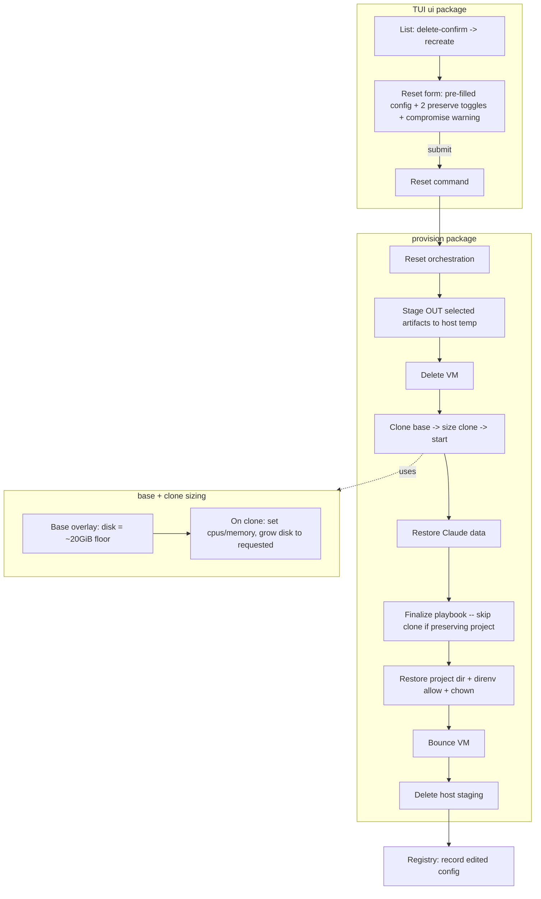
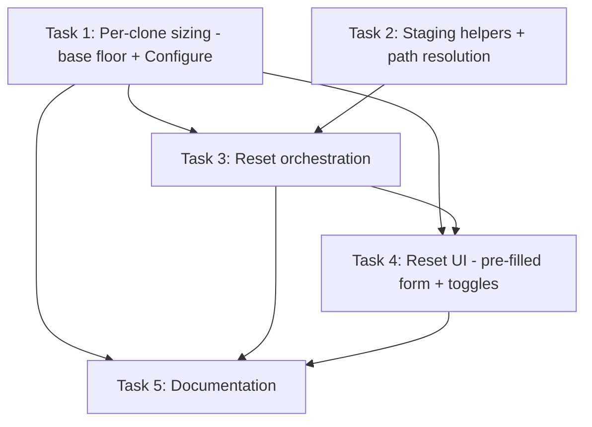

# Plan: Easy VM Reset (recreate-with-previous-settings + optional preserve)

## Original Work Order

> I want to make resetting a VM to its new state to be easy. What it should do is:
>
> 1. Recreate the VM defaulting to all of the previous settings specified by the user. This way they can do something like shrink the disk.
> 2. Give the user the option to 1: preserve all claude code settings 2: preserve the provisioned .env file and the directory the checkout was made to.

## Plan Clarifications

| Question | Answer |
|----------|--------|
| Which surface gets the reset feature? | **TUI only** (`claude-vm`). It already persists each VM's `CreateConfig` in the registry; `new-vm.sh` is unchanged. |
| How to honor an edited disk size, given disk is baked into the shared base and clones inherit it? | The `disk:` value is the qcow2 **virtual/max** size; the file is sparse. qcow2 can be **grown** but not shrunk live. So build the base with a **small virtual floor** and **grow each clone** to the requested size on clone. A "shrink" is just a fresh clone grown to a smaller number than the old VM — no live qcow2 shrink ever happens. cpus/memory are launch params (not in the disk), so they are set on the clone too. **No base rebuild needed** for cpu/memory/disk changes. |
| Base floor size? | **Fixed ~20 GiB** (comfortable headroom for the OS + Docker/Node/Go/Java/Python/Claude Code + an apt upgrade). |
| Does the grow-on-clone plumbing also go into `new-vm.sh`? | **TUI provisioner only.** (Documented cross-tool limitation; see Risks.) |
| What does "preserve Claude settings" copy? | The whole `~/.claude/` directory **and** `~/.claude.json`, **including the OAuth login** — so no re-login after a reset. The playbook still re-applies `settings.json` on top. |
| How is preserved data carried across the destroy/recreate, given the VM is fully ephemeral? | **Stage on the host, then delete the staging copy after restore.** Show a warning that the user should NOT preserve if they suspect the VM is compromised (preserving copies the `.env`'s `GH_TOKEN` and the Claude login out of the sandbox). |

## Executive Summary

Today a managed VM can be "recreated" from the TUI (delete-confirm → `[r] recreate`), but it jumps straight to provisioning using the stored config with no chance to change anything, and it wipes everything inside the VM — the Claude login, the per-org `.env`, and the project checkout. This work turns that into a proper **Reset to new** flow: pressing recreate opens the create form **pre-filled with the VM's last-used settings**, the user edits what they want (e.g. a smaller disk), and may optionally **preserve the Claude login** and/or **the provisioned `.env` + checkout directory** across the reset.

Two enabling changes make this real. First, **per-VM sizing**: the base image is built with a small virtual-disk floor (~20 GiB) and each clone is configured to the requested cpus/memory and **grown** to the requested disk size at clone time. Because qcow2 grows but never shrinks live, building small and growing per-clone is what lets a user pick *any* size — effectively "shrinking" relative to a previous VM — without rebuilding the base. Second, **preserve-by-staging**: when a preserve option is on, the chosen artifacts are streamed out of the running VM to a private host temp directory before the delete, then streamed back into the freshly provisioned VM and the staging copy is deleted.

The result is a fast, low-friction reset that keeps the parts a developer cares about (their working tree, their token, their Claude session) while still letting them re-shape the VM. The reset records the edited settings, so the *next* reset defaults to them too. Scope is deliberately confined to the TUI; `new-vm.sh` is untouched.

## Context

### Current State vs Target State

| Current State | Target State | Why? |
|---------------|--------------|------|
| Recreate (`[r]`) provisions immediately from the stored config — nothing is editable | Recreate opens the create form pre-filled with the stored config; the user edits any field, then submits | The user wants to "recreate defaulting to previous settings" so they can change one thing (e.g. disk) without re-typing everything |
| `disk` is set on the **base** overlay and clones inherit it; clones cannot be sized down | Base uses a small **~20 GiB virtual floor**; each clone is **grown** to the requested `disk` at clone time | qcow2 can grow but not shrink live; small-base + grow-on-clone yields true per-VM disk sizing including effective "shrinks" |
| cpus/memory come from the base and are not overridden on the clone | cpus/memory are applied to the clone before first start | Makes cpu/memory edits on reset take effect with no base rebuild |
| Recreate destroys the Claude login, `.env`, and checkout with no option to keep them | Optional toggles preserve `~/.claude/` + `~/.claude.json`, and/or the per-org `.env` + checkout dir | Avoids a forced `claude` re-login and the loss of the working tree / token on every reset |
| `limactl delete` provably removes everything; nothing leaves the VM | Preserve copies selected artifacts to a private host temp dir and back, then deletes it; a compromise warning is shown | The only way to carry data across a full destroy/recreate; the user accepted this scoped exception |
| Recreate keeps the original stored config | Reset records the **edited** config | So a subsequent reset defaults to the most recent settings |

### Background

- **Architecture.** Each VM is a `limactl clone` of a stopped, identity-free base image (`claude-base`). A light "finalize" Ansible phase applies per-VM bits (hostname, git identity, apt upgrade, optional repo clone). The TUI's `provision` package mirrors `new-vm.sh` but is independent Go code; this work changes only the TUI side.
- **Where settings live.** `registry.go` persists a secret-free `vm.CreateConfig` per managed VM (clone token stripped). This already backs "recreate with previous sizing/identity" — it is the seed for the editable reset form.
- **Artifacts to preserve.**
  - Claude: `~/.claude/` (settings, credentials, history, projects) and `~/.claude.json`. The login lives here; preserving it skips the required interactive `claude` login.
  - Project: the `project` role creates `~/<host>/<org>/` containing the per-org `.env` (`GH_TOKEN=…`, mode 0600, direnv-approved) and the checkout at `~/<host>/<org>/<repo>`. The org-dir path is derivable from the stored `CloneURL`.
- **Disk facts.** Lima's `disk:` sets the qcow2 *virtual* size; the backing file is sparse on APFS/ext4. Increasing `disk:` and starting triggers a Lima resize; the Debian cloud image's growpart extends the root filesystem on boot. Decreasing it is unsupported — hence build-small-and-grow.
- **No-go for now.** `new-vm.sh` plumbing is out of scope (TUI-only decision); no general "rebuild base" button is added to the TUI (existing-base migration is handled by deleting `claude-base` so the next create/reset rebuilds it at the new floor).

## Architectural Approach

The work has three cooperating parts: (A) per-clone sizing in the provisioner, (B) the editable reset form in the UI, and (C) preserve-by-staging in the provisioner. (A) is independent and unblocks the "shrink the disk" requirement; (B) and (C) build the reset UX on top.



### Component A — Per-VM sizing (small base floor + grow-on-clone)

**Objective**: Make cpus/memory/disk edits on reset actually take effect, including effective disk "shrinks", without rebuilding the shared base.

- The base overlay (`RenderBaseOverlay`) sets `disk:` to a fixed small **floor (~20 GiB)** rather than the requested size. A named constant documents the floor and the reason (qcow2 grows, never shrinks live). cpus/memory at base-build time become irrelevant to clones (clones set their own), so they can stay at modest values.
- A new `lima.Client` capability configures a **stopped clone's** cpus, memory, and disk before first start (e.g. via `limactl edit` flags, or by editing the clone's `lima.yaml`; the exact mechanism is verified against the installed Lima — see Risks). Growing `disk` here is what enlarges the clone; Lima resizes on start and growpart extends the FS.
- `provision.createVM` gains a "configure the clone" step between `Clone` and `Start`, applying `cfg.CPUs`, `cfg.Memory`, and the (grown) `cfg.Disk`.
- Guard: if the requested disk is **smaller than the current base's virtual size** (e.g. a pre-migration large base), surface a clear warning that shrinking below the base requires rebuilding the base smaller; do not silently no-op.

### Component B — Editable reset form (pre-filled defaults)

**Objective**: Turn "recreate" into "reset", defaulting every field to the VM's last-used settings and letting the user change them.

- The delete-confirm `[r] recreate` action no longer provisions immediately. Instead it opens the existing create form in a new **reset mode**, seeded from `registry.Config(name)` (sizing, hostname, user, git identity, clone URL). The **Name field is locked** (a reset targets one existing VM). If no stored config exists (legacy entry), fall back to host-derived defaults as the current code does.
- The form gains two **preserve toggles**: *Preserve Claude Code settings* and *Preserve project `.env` + checkout*. The project toggle is only meaningful when a `CloneURL` is known; it is disabled/hidden otherwise.
- When either toggle is on, the form shows the **compromise warning**: do not preserve if you suspect the VM is compromised (the `.env` token and Claude login would be copied out of the sandbox).
- Submitting validates as today and dispatches the Reset command (carrying the edited config + the two toggle states) through the existing streaming progress view.
- Token handling: with the project toggle **on**, the finalize clone is skipped and the restored `.env` supplies `GH_TOKEN`, so no token entry is needed. With it **off** and a `CloneURL` set, finalize re-clones and the (unstored) token must be re-entered in the form, matching current behavior.

### Component C — Preserve-by-staging

**Objective**: Carry the selected artifacts across the destroy/recreate, then leave the host clean.

- A new `Reset` path in the `provision` package orchestrates the full sequence (the `provisionFunc`/`beginProvision` plumbing is extended to pass the preserve options alongside the config):
  1. **Stage out** (only what is toggled), from the still-running VM into a private host temp dir (mode 0700): Claude → `~/.claude/` + `~/.claude.json`; project → the resolved `~/<host>/<org>/` org dir (includes `.env` + checkout). Streaming a `tar` over `limactl shell` (preserving modes/ownership) is preferred over per-file copy.
  2. **Delete** the VM.
  3. **Clone + size + start** (Component A).
  4. **Restore Claude data before finalize**, so the finalize playbook re-applies `settings.json` on top while the credentials/history survive.
  5. **Finalize**, skipping the project git-clone when the project toggle is on.
  6. **Restore the project org dir after finalize**, then re-`chown` to the VM user and re-run `direnv allow` on the org dir.
  7. **Bounce** the VM (as the normal create flow does).
  8. **Delete the host staging dir** on success; on failure, leave it and report its path so the user can recover.
- Ownership/permissions are normalized after restore (`.env` stays 0600; restored trees owned by the VM user).
- The reset records the **edited** config in the registry on success (reusing the existing `provisionDone → reg.Add` path), so the next reset defaults to the new settings.

```mermaid
sequenceDiagram
    participant U as User
    participant UI as TUI
    participant P as Provisioner
    participant H as Host temp
    participant V as VM (Lima)
    U->>UI: recreate -> edit fields, toggle preserve
    UI->>P: Reset(cfg, preserveClaude, preserveProject)
    alt any preserve on
        P->>V: tar out ~/.claude(+json) and/or org dir
        V-->>H: streamed archive(s)
    end
    P->>V: delete
    P->>V: clone base, set cpu/mem, grow disk, start
    opt preserve Claude
        H-->>V: restore ~/.claude + ~/.claude.json
    end
    P->>V: finalize playbook (skip clone if preserving project)
    opt preserve project
        H-->>V: restore org dir; chown; direnv allow
    end
    P->>V: bounce
    P->>H: delete staging
    P-->>UI: done -> record edited config
```

## Risk Considerations and Mitigation Strategies

<details>
<summary>Technical Risks</summary>
- **Lima mechanism for per-clone cpu/memory/disk varies by version.** The exact way to set a stopped clone's resources and to trigger a disk grow differs across Lima releases.
    - **Mitigation**: Confirm the mechanism against the installed Lima during implementation; reuse the existing preflight (`limactl clone` capability check) and extend it if needed; prefer a documented, stable invocation.
- **Disk grows but the guest filesystem does not.** If growpart/cloud-init does not extend root, the larger virtual disk is unusable.
    - **Mitigation**: Rely on the Debian cloud image's growpart-on-boot; verify after first start; if needed, extend the root FS during finalize.
- **Preserve + too-small disk.** Restoring a large checkout/Claude state into a freshly shrunk disk can run out of space.
    - **Mitigation**: Surface the restore failure clearly and keep the host staging copy for recovery; document the interaction.
</details>

<details>
<summary>Implementation Risks</summary>
- **Restore ordering vs the finalize playbook.** Restoring `~/.claude` after finalize would clobber the freshly templated `settings.json`; restoring the project dir before finalize would be clobbered by the clone.
    - **Mitigation**: Fixed ordering — Claude restored *before* finalize, project restored *after* finalize with the finalize clone skipped.
- **Staging requires the VM running.** Stage-out must happen before delete, while the source is up.
    - **Mitigation**: Sequence stage-out first; abort the reset (without deleting) if stage-out fails.
</details>

<details>
<summary>Security Risks</summary>
- **Secrets leave the sandbox during preserve.** The `.env` `GH_TOKEN` and the Claude login are copied to the host.
    - **Mitigation**: Opt-in toggles only; private 0700 staging dir; delete staging immediately after a successful restore; prominent warning to not preserve a possibly-compromised VM.
</details>

<details>
<summary>Integration / Compatibility Risks</summary>
- **TUI-only plumbing diverges from `new-vm.sh` on a shared base.** A `claude-base` built by `new-vm.sh` keeps the large disk and `new-vm.sh` clones do not grow, so TUI shrink is limited until the base is rebuilt by the TUI.
    - **Mitigation**: Document the one-time migration (delete `claude-base`; next TUI create/reset rebuilds it at the floor) and the cross-tool caveat; warn when a requested disk is below the current base's virtual size.
</details>

## Success Criteria

### Primary Success Criteria
1. From the TUI, recreating a managed VM opens a form pre-filled with that VM's last-used settings, with the Name locked.
2. Editing cpus, memory, or disk on reset takes effect on the resulting VM with no manual base rebuild; reducing disk relative to the previous VM yields a smaller VM (when the base is at the floor).
3. The base image is built at the ~20 GiB virtual floor and clones are grown to the requested size.
4. With "preserve Claude settings" on, the reset VM is already logged in (no `claude` re-login needed) and `settings.json` reflects the current playbook template.
5. With "preserve project" on, the per-org `.env` and the checkout directory (including uncommitted changes) survive the reset, and direnv loads the `.env`.
6. A compromise warning appears whenever a preserve option is enabled; the host staging directory is removed after a successful reset and its path is reported on failure.
7. The reset records the edited configuration so the next reset defaults to it.

## Documentation

- **README.md**: update the TUI section to describe Reset (editable previous settings + preserve options); document the small-base-floor / grow-on-clone disk behavior and the one-time base-rebuild migration for existing bases; note the scoped staging exception in the Security Model section.
- **tui/README.md**: reset usage (keys, pre-filled form, preserve toggles), the compromise warning, and the disk-sizing behavior/limitations.
- Update in-code package/function doc comments in `provision` and `ui` to reflect the reset flow and the per-clone sizing.

## Resource Requirements

### Development Skills
- Go (Bubble Tea TUI patterns already used in `ui`, and the `provision`/`lima` packages).
- Lima/`limactl` operational knowledge: clone, per-instance resource config, disk resize, `limactl shell`, file movement.
- Ansible familiarity (finalize phase behavior, the `project` and `claude-code` roles, direnv).

### Technical Infrastructure
- Lima new enough for `limactl clone` and per-instance disk resize (existing preflight extended as needed).
- A Debian 13 Lima template whose image grows the root FS on boot (growpart/cloud-init).
- The existing managed-VM registry under the XDG data dir.

## Integration Strategy

Reset reuses the existing streaming progress view, the managed-VM registry, and the create form. Component A also benefits ordinary creates (clones are sized from the floor). No changes to `new-vm.sh`, the Ansible roles' core behavior (only finalize clone-skipping is parameterized), or the on-disk registry schema are required beyond what is described.

## Notes

- "Reset" is the user-facing name for the enhanced recreate; it remains gated to claude-vm-managed VMs (the existing `confirmBase` gate).
- Preserving the project dir intentionally skips the finalize clone, so a reset-with-preserve needs no clone token even for a private repo.
- The ~20 GiB floor is a constant chosen for headroom; it is the practical minimum size a clone can be.

## Execution Blueprint

**Validation Gates:**
- Reference: `/config/hooks/POST_PHASE.md`

### Dependency Diagram



No circular dependencies.

### Phase 1: Foundations (no dependencies — run in parallel)
**Parallel Tasks:**
- Task 1: Per-clone sizing — small base floor + grow/configure clone
- Task 2: Staging helpers — tar-out/in + guest path resolution

### Phase 2: Reset engine
**Parallel Tasks:**
- Task 3: Reset orchestration (depends on: 1, 2)

### Phase 3: Reset UI
**Parallel Tasks:**
- Task 4: TUI reset flow — pre-filled form + preserve toggles + dispatch (depends on: 1, 3)

### Phase 4: Documentation
**Parallel Tasks:**
- Task 5: Documentation — reset flow, disk sizing, staging security note (depends on: 1, 3, 4)

### Post-phase Actions
After each phase, run the package test suite (`cd tui && go test ./...`) as the validation gate before starting the next phase.

### Execution Summary
- Total Phases: 4
- Total Tasks: 5
- Maximum Parallelism: 2 tasks (in Phase 1)
- Critical Path Length: 4 phases (1/2 → 3 → 4 → 5)
