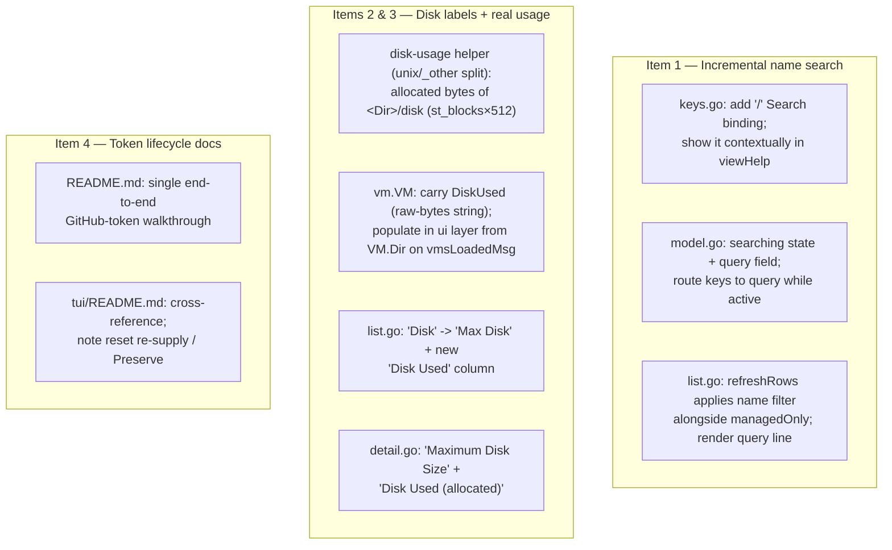
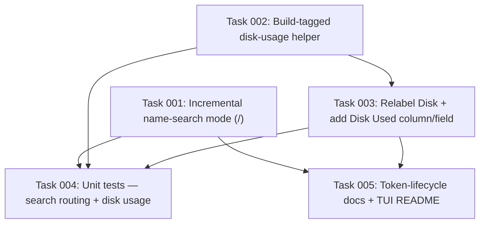

# Plan: claude-vm List Search, Real Disk Usage, and Token-Lifecycle Docs

## Original Work Order

> Implement the TUI (claude-vm) enhancements and related tasks captured in todo.md:
>
> 1. Forward-slash search: pressing `/` filters/searches the VM list by name (incremental search over the table). Distinct from the existing `f` "filter managed" toggle. Pairs with the key map in tui/internal/ui/keys.go and the table in tui/internal/ui/list.go; a new incremental-filter mode separate from managedOnly.
>
> 2. Rename "Disk" → "Maximum Disk Size": the current Disk column shows the qcow2 virtual (max) size, so label it as the maximum, not the actual usage. (List column in tui/internal/ui/list.go and the detail view in tui/internal/ui/detail.go.)
>
> 3. Add a "Disk Used" column: the actual on-disk file size consumed by the VM's disk image (sparse usage), shown alongside the maximum. If feasible, account for copy-on-write / APFS clones (and similar reflink filesystems like Btrfs/XFS) so the reported usage reflects real blocks consumed rather than apparent size — e.g. use allocated-block size (st_blocks / du-style) rather than logical size. Note: these VMs are created via limactl clone (copy-on-write on APFS/ext4), so apparent disk size and actually allocated blocks differ a lot — a freshly cloned VM may report ~full virtual size logically but consume almost nothing physically. This is relevant to the in-progress plan 4 work (small base floor + grow-on-clone, virtual-vs-actual disk-size distinction).
>
> 4. Do a better job of explaining GitHub token credential management.
>
> 5. Come up with a better name for the repo and the app.
>
> 6. Remove the bash script once the TUI has it all.
>
> 7. Unit tests / code coverage / mutation testing.
>
> 8. Figure out the best way to share content out from the VMs. Can we automatically expose the checkout or home directory to the host as a network or shared folder? Not a bind mount — this is specifically to replace limactl copy.

## Plan Clarifications

| Question | Answer |
|----------|--------|
| The work order mixes small TUI changes with large/open-ended efforts. Which of items 5–8 should this plan also cover now? | **Defer 5, 6, 7, and 8 to their own plans.** This plan covers items **1–4 only**. |
| "Maximum Disk Size" is wide for a table header — how should the list columns read? | List uses the compact headers **`Max Disk`** and **`Disk Used`**; the detail view spells them out fully (`Maximum Disk Size`, `Disk Used (allocated)`). |
| For the token docs (item 4), what most needs improving? | A single **end-to-end token-lifecycle walkthrough**: create fine-grained PAT → supply at create → lands in the per-org `.env` as `GH_TOKEN` → direnv loads it → rotation/expiry → revoke, tying the scattered pieces together. |
| What should the new "Disk Used" figure measure per VM? | **The VM's qcow2 `disk` image only** — its allocated blocks (`st_blocks × 512`), which matches `qemu-img info`'s "disk size". It excludes the per-instance `cidata.iso` (~300 MB) and log files; "Disk Used" is the VM's growable disk consumption, not its whole instance-dir footprint. |
| Lima 2.x names the disk image `disk`; older Lima used `diffdisk`+`basedisk`. How robust should the probe be? | **Measure `<dir>/disk` only.** The installed Lima (2.1.3) and CI's `lima-vm/lima-actions/setup@v1` both write a single `disk`; per YAGNI we add no fallback for Lima layouts we don't run. (Original plan text incorrectly targeted `diffdisk`/`basedisk`, which do not exist on this Lima.) |
| How should the plan explain the virtual-vs-actual disk gap? | **Lead with qcow2 sparse allocation** (the dominant, always-present effect: a 100 GiB virtual disk holds only ~5 GiB of data). Reflink/CoW block-sharing is a platform-specific *bonus* on APFS/Btrfs/XFS, not the primary mechanism — on non-CoW ext4 (this dev box and the CI runner) `limactl clone` is a full copy, so a fresh clone consumes ~the base's size, well below virtual but **not** "almost nothing". |

## Executive Summary

This plan delivers four scoped, user-facing improvements to the `claude-vm` TUI and its documentation. First, an **incremental name-search mode** bound to `/` lets the user filter a long instance list by typing, independent of and composable with the existing `f` "managed only" toggle. Second and third, it corrects a **misleading disk label** — the current `Disk` column shows the qcow2 *virtual* (maximum) size but reads as if it were real usage — by relabelling it `Max Disk` and adding a new **`Disk Used`** column that reports the *allocated* on-disk size of each VM's disk image. Fourth, it consolidates the project's **GitHub-token guidance** into one coherent lifecycle walkthrough.

The disk-usage work is the most technically interesting. The `Disk` column today shows the qcow2 *virtual* (maximum) size Lima reports — e.g. 100 GiB — but a qcow2 only allocates the blocks it actually uses, so a VM holding ~5 GiB of data reports 100 GiB. That **qcow2 sparse allocation** is the dominant, always-present gap between the maximum and the real consumption; on copy-on-write filesystems (APFS, and Btrfs/XFS reflinks) a `limactl clone` can additionally share blocks with its base, shrinking the figure further, but that is a platform-specific bonus — on non-CoW ext4 (this dev box and the GitHub CI runner) `limactl clone` is a full copy, so a fresh clone consumes roughly the base's size, well below virtual but not near-zero. Reporting *allocated blocks* (`st_blocks × 512`, the `du` measure — which on this host matches `qemu-img info`'s "disk size" to the byte) rather than logical size is what makes "Disk Used" honest in every case. The figure is the allocated size of the instance's single qcow2 `disk` file (Lima 2.x writes one `disk` per instance). The measurement mirrors the repository's existing cross-platform pattern (the `hostres_unix.go` `//go:build linux || darwin` probe plus the `hostres_other.go` `!linux && !darwin` fallback, over `golang.org/x/sys/unix`), so it adds no new dependency and degrades gracefully on unsupported platforms.

All four changes are deliberately low-blast-radius: they touch the `ui` package, a small disk-usage helper, one field on the shared VM record, and two README files. The `new-vm.sh` script, the provisioner, the managed-VM registry, and the create/reset flows are untouched. The larger todo items (repo rename, removing the bash script, a testing/coverage/mutation initiative, and VM→host file sharing) are explicitly out of scope and will each get their own plan.

## Context

### Current State vs Target State

| Current State | Target State | Why? |
|---------------|--------------|------|
| Pressing `/` in the list does nothing; the only filter is the `f` managed/all toggle | `/` enters an incremental name-search mode that filters the table live as the user types, composing with the `f` toggle | Finding a VM by name in a long `limactl list` (which shows every Lima instance, not just managed ones) is slow without search (item 1) |
| The list column and detail field are labelled `Disk`, showing the qcow2 virtual (max) size but reading as if it were actual usage | List header reads `Max Disk`; detail reads `Maximum Disk Size`; the value is unchanged (still the virtual size) | The current label misleads users into thinking it is real consumption (item 2) |
| There is no view of a VM's actual on-disk consumption | A new `Disk Used` column (list) and `Disk Used (allocated)` field (detail) report the allocated on-disk size of the VM's qcow2 `disk` image | A qcow2 only allocates the blocks it uses, so a VM's real consumption (e.g. ~5 GiB) is far below its virtual/maximum size (e.g. 100 GiB); users need the real figure to manage disk pressure (item 3) |
| GitHub-token guidance is scattered across README sections (PAT scopes in one place, `.env`/direnv in another, reset/token-not-stored caveats in the TUI README) | One end-to-end token-lifecycle walkthrough threads create → supply → per-org `.env` `GH_TOKEN` → direnv → precedence → rotation/revoke → reset re-supply | The flow is correct but hard to follow as discrete fragments; a single narrative makes credential management understandable (item 4) |

### Background

- **Search composes with, not replaces, the managed filter.** `m.managedOnly` already filters `refreshRows` (`tui/internal/ui/list.go`). The new name filter is an additional predicate applied in the same rebuild, so the two stack: the user can be in "managed only" *and* type a name fragment. The existing cursor-reseat guard in `refreshRows` (which reseats the table cursor to 0 when a filter empties and then refills the list) already handles a filter matching nothing and must be preserved.
- **Key routing is the crux of search.** The Bubble Tea `table` component consumes navigation runes (`j`/`k`/arrows) and `updateList` (`list.go:98`) binds single letters to actions — `s` start, `x` stop, `d` delete, `r` restart, `S` shell, `f` filter, `n` new, `q` quit, and `enter` open-detail. While search is active, every typed rune — including all of those letters (upper and lower case) — must edit the query, not trigger an action or move the cursor. This requires a dedicated "searching" state in the model that intercepts keys ahead of the normal list bindings, exited by `esc` (clear the query and leave search) or `enter` (keep the filter and return to normal table navigation). Note `enter` therefore does double duty: in search it commits the filter; outside search it still opens the detail view.
- **Lima exposes the instance directory.** `limactl list --format json` includes `dir` (e.g. `/home/andrew/.lima/claude`), already parsed into `vm.VM.Dir` (`tui/internal/lima/client.go`). Lima 2.x writes the instance's growable qcow2 as a single file named **`disk`** in that directory (verified on Lima 2.1.3: `~/.lima/<name>/disk`; there is no `diffdisk`/`basedisk` — that was an older Lima layout the project no longer uses). The allocated-block size of `<dir>/disk` is the "Disk Used" figure.
- **Allocated blocks vs virtual size — qcow2 sparseness is the main effect.** `limactl list` reports the qcow2 *virtual* (maximum) size (verified: `disk: 107374182400` = 100 GiB), which is what the current `Disk` column shows. A qcow2 image only allocates the blocks it actually contains, so the real on-disk size is far smaller (verified: a 100 GiB-virtual clone's `disk` is ~5 GiB allocated). That sparse-allocation gap is always present, independent of filesystem. On copy-on-write filesystems (APFS, Btrfs/XFS reflinks) `limactl clone` can *also* share blocks with the base, shrinking the figure further — but on non-CoW ext4 (this dev box and the CI runner) the clone is a full copy (the repo's own CI note: *"`limactl clone` copies the provisioned qcow2 (the runner's ext4 isn't copy-on-write)"*), so a fresh clone consumes ~the base's size. `st_blocks × 512` (the `du` measure) is the honest "blocks consumed" figure in all cases and matches `qemu-img info`'s "disk size" exactly on this host; on APFS it reflects shared-block accounting and may differ for blocks shared with a clone source — worth a one-line caveat in the docs. Plan 4's small base floor (`20GiB`) + grow-on-clone makes the *maximum* per-VM; this figure is the complementary *actual*.
- **Cross-platform precedent already exists.** `tui/internal/ui/hostres_unix.go` (`//go:build linux || darwin`) calls `golang.org/x/sys/unix` for host stats, with `hostres_other.go` returning zero on other platforms. The disk-usage probe follows the same split, so no new dependency is introduced and non-unix builds fall back to "unknown" cleanly.
- **Token flow that the docs must describe accurately.** A clone token supplied at create time is written to the per-org `.env` as `GH_TOKEN` (loaded by direnv, `load_dotenv = true`) and takes precedence over `gh auth login`; the token is **never stored** in the managed-VM registry, so a reset of a private-repo VM needs it re-supplied unless *Preserve project .env + checkout* is enabled. The walkthrough must reflect this exactly.
- **Out of scope (each deferred to its own plan):** item 5 (repo/app rename — ripples through the Go module path, `install.sh`/README URLs, and the XDG data dir), item 6 (removing `new-vm.sh` — still the entry point for `curl | bash`, Homebrew, and the CI `lima-e2e` job, with a non-interactive flag set the TUI lacks), item 7 (testing/coverage/mutation — note CI does not yet run the TUI's Go tests at all), and item 8 (VM→host file sharing — can build on the existing but Lima-disabled `samba` role, or host-side sshfs).

## Architectural Approach

The work splits into three independent workstreams over a small, well-bounded surface. The diagram shows where each touches the code.

### Component 1 — Incremental name search (item 1)

**Objective:** Let the user narrow a long instance list by typing a name fragment, without disturbing the existing managed/all filter or the action keybindings.

Add a `Search` binding for `/` to the keymap (`keys.go`) and surface it in the list view's help (`viewHelp`, `keys.go:56`). Introduce a model "searching" state plus a query string. When searching is active, `updateList` (`list.go:98`) routes keys to the query (append runes, backspace to edit) ahead of *all* the normal action bindings and ahead of the final `m.table.Update(msg)` fall-through, so a typed `s`/`x`/`d`/`r`/`S`/`f`/`n`/`q` edits the search rather than firing its action and `j`/`k` do not move the cursor; `esc` clears the query and exits search, `enter` keeps the current filter and returns to normal table navigation. The interception must sit before the `switch` in `updateList` (and `ctrl+c` continues to be handled in `Update` at `model.go:215`, so it still quits — search never captures it). `refreshRows` gains a case-insensitive substring match on the VM name applied *in addition to* the `managedOnly` predicate, so the two filters compose. The list view renders the active query (e.g. a `/claude` prompt line) near the status line, and the existing empty-list cursor-reseat guard continues to protect against a filter that matches nothing. Search is purely a view concern — it filters rows, never the underlying `m.vms`, and clears on `esc`, so it cannot affect which VM an action targets beyond the visible selection.

### Component 2 — Disk size labelling and real usage (items 2 & 3)

**Objective:** Stop the disk figure from misleading users, and add an honest, CoW-aware measure of what each VM actually consumes.

Relabelling is mechanical: the list column header `Disk` (`list.go:25`) becomes `Max Disk` and the detail field label `Disk` (`detail.go:42`) becomes `Maximum Disk Size`; the value (Lima's reported virtual/maximum size, humanized) is unchanged.

The new usage figure is computed by a small helper that, given a VM's instance directory (`vm.VM.Dir`), returns the **allocated** size — `st_blocks × 512`, not logical length — of the single qcow2 image file Lima keeps there, named **`disk`** (Lima 2.x layout, verified on the installed 2.1.3). It stats only `<dir>/disk`; per the clarifications it does **not** add a fallback for the legacy `diffdisk`/`basedisk` layout (no Lima we run uses it) and does **not** include the `cidata.iso` seed or logs ("Disk Used" is the growable disk's consumption, not the whole instance-dir footprint). The allocated-block measure is what makes the figure honest: a qcow2 only allocates the blocks it holds, so this reports real consumption (~5 GiB) rather than the virtual maximum (~100 GiB) the `Disk` column shows; on reflink/CoW filesystems (APFS, Btrfs/XFS) it additionally reflects blocks shared with a clone source, and on this host it matches `qemu-img info`'s "disk size" to the byte. The helper follows the repository's existing build-tag split: a `linux || darwin` implementation over `golang.org/x/sys/unix` (reading `unix.Stat_t.Blocks`) and an `!linux && !darwin` fallback that reports "unknown" (a negative/zero sentinel), mirroring `hostres_unix.go`/`hostres_other.go` so no new dependency is added.

A `DiskUsed` field is added to the shared `vm.VM` record. To stay consistent with the existing `Memory`/`Disk` fields — which `humanizeBytes` (`format.go`) renders from a *raw-bytes string* — `DiskUsed` is carried as a raw-bytes string (or as an `int64` with a thin byte-count humanizer; either is acceptable, but it must round-trip through the same humanizer so units match the other columns). It is populated **in the `ui` layer once per load**, when `vmsLoadedMsg` is handled (`model.go:151`), by calling the build-tagged helper over each `v.Dir` — *not* inside `lima.Client.List()` (which would force the `lima` package to import a build-tagged `ui` helper) and *not* inside `refreshRows` (which re-runs on every filter/search keystroke). Statting one file per VM on load is microseconds and reads no file contents. It is then rendered humanized in a new `Disk Used` list column and a `Disk Used (allocated)` detail field. When `disk` is missing or unreadable (probe returns the "unknown" sentinel), the cell renders **blank** rather than `0 B`, so an unmeasurable VM is visibly distinct from a genuinely tiny one. The list column layout is adjusted so `Max Disk` and `Disk Used` both fit; the table already clamps to the terminal width on `WindowSizeMsg` (`model.go:135`).

### Component 3 — GitHub token lifecycle documentation (item 4)

**Objective:** Replace scattered token fragments with one walkthrough a reader can follow start to finish.

Consolidate the README's GitHub-authentication guidance into a single end-to-end narrative that follows one token through its whole life: create a fine-grained PAT with the recommended scopes (the existing scope table is retained); supply it at VM-create time (TUI form field or `new-vm.sh --clone-token`); see it written to the per-org `.env` as `GH_TOKEN`; understand that direnv (`load_dotenv = true`) loads it on `cd` and that `GH_TOKEN` takes precedence over `gh auth login`; rotate or revoke it on expiry; and know that a **reset does not carry the token** (it is never stored), so a private-repo VM must have it re-supplied unless *Preserve project .env + checkout* is enabled. The existing "separate VM per org/context" guidance is folded in as the multi-token recommendation. The `tui/README.md` is cross-referenced so the reset section points at the single canonical explanation rather than restating it.

## Risk Considerations and Mitigation Strategies

Technical Risks

- **Search key routing collides with table navigation and action keys**: while typing a query, every action rune (`j`, `k`, `s`, `x`, `d`, `r`, `S`, `f`, `n`, `q`, and `enter`) must not navigate or fire actions.
    - **Mitigation**: a dedicated "searching" model state intercepts all keys before the normal list bindings and before the table component's `Update`; only `esc`/`enter` leave the mode (and `ctrl+c`, handled earlier in `Update`, still quits). Covered by unit tests that feed each action-letter rune while searching and assert the query (not an action) changed.
- **Disk-image filename and allocated-block semantics are Lima/filesystem dependent**: Lima 2.x writes a single `disk`, but a future Lima could rename or split it; `st_blocks` is reflink-accurate on Linux CoW filesystems but on APFS may differ for blocks shared with a clone source.
    - **Mitigation**: target the verified Lima 2.x `<dir>/disk` name (the only layout the project runs; a fallback for layouts we don't run is explicitly out of scope per YAGNI), stat it defensively (skip when absent/unreadable), and fall back to a **blank** cell — not `0 B` — when it cannot be measured, so a layout change degrades visibly rather than silently reading "0". Report the allocated-block measure as the honest "blocks consumed" figure and add a one-line caveat in the docs about APFS shared-block accounting.
- **Statting disk usage on every list refresh adds I/O**: the list reloads after every lifecycle action.
    - **Mitigation**: the probe stats only a couple of files per VM (microseconds) and reads no file contents; it runs on list load, not on every keystroke.
- **Non-unix platforms lack `st_blocks`**: the syscall is unix-only.
    - **Mitigation**: reuse the existing `linux || darwin` vs `!linux && !darwin` build-tag split so other platforms compile and render "unknown."

Implementation Risks

- **Added column widens the table beyond a narrow terminal**: `Max Disk` + `Disk Used` + `Managed` could overflow.
    - **Mitigation**: use the agreed compact headers and tune column widths; the table already clamps to the terminal width on `WindowSizeMsg`.
- **Help bar / keymap clutter**: another binding on an already-busy list help line.
    - **Mitigation**: show the `/` search binding contextually (and the in-search help — esc/enter — only while searching).
- **Docs drift from behaviour**: the token walkthrough must match the real precedence and the reset "token not stored" rule.
    - **Mitigation**: derive every step from the current `project` role / direnv config and the registry's token-stripping behaviour; cross-reference rather than duplicate between the two READMEs.

Quality Risks

- **CI does not run the TUI's Go tests** (the broader testing initiative is deferred to item 7's own plan), so regressions in this work would not be caught by CI.
    - **Mitigation**: add focused unit tests for the new logic — search filtering/key-routing and the disk-usage formatting/fallback — runnable locally with `go test ./...`, consistent with the package's existing test coverage. Wiring Go tests into CI is left to the item-7 plan.

## Success Criteria

### Primary Success Criteria

1. Pressing `/` in the list enters an incremental search that filters rows by case-insensitive name substring as the user types; it composes with the `f` managed filter, `esc` clears and exits, `enter` keeps the filter and returns to table navigation, and action-letter keys edit the query (not fire actions) while searching. The binding appears in the help bar.
2. The list column header reads `Max Disk` and the detail field reads `Maximum Disk Size`, with the displayed value unchanged from today's virtual/maximum size.
3. A `Disk Used` list column and a `Disk Used (allocated)` detail field show each VM's allocated on-disk size (`st_blocks × 512` of `<dir>/disk`); a typical VM shows a usage well below its `Max Disk` (e.g. ~5 GiB used vs a 100 GiB maximum — qcow2 sparseness), and a VM whose `disk` cannot be measured renders a blank cell (not `0 B`) without error. (On a CoW filesystem the figure may be lower still where a clone shares blocks with its base; on non-CoW ext4 a fresh clone is a full copy and shows roughly the base's size.)
4. The README presents a single end-to-end GitHub-token lifecycle walkthrough (create PAT → supply at create → per-org `.env` `GH_TOKEN` → direnv load → precedence over `gh auth login` → rotation/revoke → reset re-supply or *Preserve project*), and `tui/README.md` cross-references it instead of restating it.

## Documentation

- **README.md** — rework the "GitHub Authentication" section into the consolidated token-lifecycle walkthrough (retaining the fine-grained PAT scope table), and add the one-line "Disk Used = allocated blocks" caveat where disk sizing is discussed.
- **tui/README.md** — add the `/` search row to the List-view keybindings table; update the list/detail column descriptions to `Max Disk` + `Disk Used`; point the token discussion at the README walkthrough.
- In-app help text — ensure the list help bar reflects the new `/` binding (and the in-search esc/enter help).

## Resource Requirements

### Development Skills

- Go and the Bubble Tea / `bubbles` widgets already used here (`table`, `textinput`, `key`, `help`), specifically model/Update key routing.
- Familiarity with Lima's per-instance directory layout (Lima 2.x writes a single qcow2 `disk` per instance) and with unix `stat`/`st_blocks` allocated-block semantics across Linux and macOS/APFS.
- Markdown/technical writing for the token-lifecycle documentation.

### Technical Infrastructure

- Existing module dependencies only: `github.com/charmbracelet/bubbletea` + `bubbles`, and `golang.org/x/sys/unix` (already vendored for the host-resource probes). No new dependency.
- A real Lima host is useful to eyeball "Disk Used" against `du` on cloned VMs (this dev environment can boot Lima VMs).

## Integration Strategy

All code changes are confined to the TUI module: the `ui` package (keys, model, list, detail), a small disk-usage helper following the existing `hostres` build-tag pattern, and one new field on the shared `vm.VM` record populated at list-load time. The `lima.Client`, `provision.Provisioner`, `registry.Registry`, the create/reset flows, and `scripts/new-vm.sh` are not modified. Documentation changes are limited to the two README files. Nothing here alters the managed-VM index format or the security model, so it integrates without migration.

## Notes

- The four deferred items each warrant their own plan: **item 5** (rename) is a cross-cutting rename of the module path, install URLs, and data dir; **item 6** (remove `new-vm.sh`) is blocked until the TUI reaches parity with the script's non-interactive `curl | bash` / Homebrew / CI entry points; **item 7** (testing/coverage/mutation) should, among other things, add a CI job that runs the TUI's Go tests (none runs them today); **item 8** (VM→host file sharing) can build on the existing `samba` role (currently disabled on the Lima flow) over a host-reachable Lima network, or on host-side sshfs, and must respect the "nothing leaves the VM" security posture.
- This plan's `Disk Used` work is the natural complement to plan 4's virtual-vs-actual disk-size handling (small base floor + grow-on-clone): plan 4 made the *maximum* per-VM, and this plan surfaces the *actual* consumption.

### Decision Log

- **Disk-image file:** measure only the single qcow2 `disk` Lima 2.x writes per instance (`<dir>/disk`), via `st_blocks × 512`. Verified on the installed Lima 2.1.3; matches `qemu-img info`'s "disk size". *No* fallback to the legacy `diffdisk`/`basedisk` layout (YAGNI — the project runs no such Lima). *Excludes* `cidata.iso` and logs — "Disk Used" is the growable disk's consumption, not the whole instance-dir footprint.
- **Why the figure is honest:** the dominant gap is qcow2 sparse allocation (virtual ≫ allocated), present on every filesystem; reflink/CoW block-sharing is an additional, platform-specific reducer on APFS/Btrfs/XFS only. On non-CoW ext4 (dev box + CI runner) `limactl clone` is a full copy, so a fresh clone consumes ~the base's size — *not* "almost nothing". Plan and success criteria are worded to this reality.
- **Where `DiskUsed` is populated:** in the `ui` layer when `vmsLoadedMsg` is handled (once per load), not in `lima.Client.List()` (avoids a `lima → ui` build-tagged import) and not in `refreshRows` (avoids re-statting on every filter/search keystroke). Carried as a raw-bytes string so it round-trips through the existing `humanizeBytes`.
- **Search interception** covers the full action-key set (`s x d r S f n q` + `enter`, upper/lower) by intercepting before the `updateList` switch and the table fall-through; `esc` clears, `enter` commits, `ctrl+c` still quits.

### Change Log

- 2026-06-30 (refinement): Corrected the disk-image filename from the non-existent `diffdisk`/`basedisk` to Lima 2.x's single `disk` (verified on Lima 2.1.3 against three live instances). Reframed the virtual-vs-actual rationale to lead with qcow2 sparse allocation and demote reflink/CoW to a platform-specific bonus, citing the repo's own CI note that ext4 clones are full copies; reworded Success Criterion 3 away from "almost nothing". Pinned scope to the qcow2 `disk` only (no `cidata.iso`/logs, no legacy-Lima fallback). Specified that `DiskUsed` is a raw-bytes string populated in the `ui` layer on `vmsLoadedMsg` (not in `lima.Client` or `refreshRows`) and rendered via the existing `humanizeBytes`. Completed the search-mode key set (added `S`/`r`/`enter`) and added file:line anchors throughout. Added Plan Clarifications rows and this Decision Log.

## Execution Blueprint

**Validation Gates:**
- Reference: `/config/hooks/POST_PHASE.md`

### Dependency Diagram

No circular dependencies: the graph is acyclic.

### Phase 1: Independent foundations
**Parallel Tasks:**
- Task 001: Incremental name-search mode bound to `/` (search state, key routing, `refreshRows` filter, help)
- Task 002: Build-tagged disk-usage helper (`diskUsedBytes` — allocated blocks of `<dir>/disk`)

### Phase 2: Disk labels and usage rendering
**Parallel Tasks:**
- Task 003: Relabel `Disk`→`Max Disk`/`Maximum Disk Size` and add the `Disk Used` column/field, populated on load (depends on: 002)

### Phase 3: Verification and documentation
**Parallel Tasks:**
- Task 004: Unit tests for search key-routing and disk-usage measurement/formatting (depends on: 001, 002, 003)
- Task 005: Consolidated GitHub-token lifecycle docs + TUI README search/disk updates (depends on: 001, 003)

### Post-phase Actions
After each phase, run `cd tui && go build ./... && go vet ./...` (and `go test ./...` from Phase 3 onward) to confirm the module stays green before the next phase begins.

### Execution Summary
- Total Phases: 3
- Total Tasks: 5
- Maximum Parallelism: 2 tasks (Phase 1, and again Phase 3)
- Critical Path Length: 3 phases (002 → 003 → 004/005)
