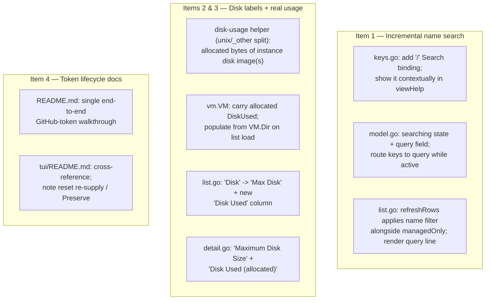

# Plan: claude-vm List Search, Real Disk Usage, and Token-Lifecycle Docs

## Original Work Order

> Implement the TUI (claude-vm) enhancements and related tasks captured in todo.md:
>
> 1. Forward-slash search: pressing `/` filters/searches the VM list by name (incremental search over the table). Distinct from the existing `f` "filter managed" toggle. Pairs with the key map in tui/internal/ui/keys.go and the table in tui/internal/ui/list.go; a new incremental-filter mode separate from managedOnly.
>
> 2. Rename "Disk" → "Maximum Disk Size": the current Disk column shows the qcow2 virtual (max) size, so label it as the maximum, not the actual usage. (List column in tui/internal/ui/list.go and the detail view in tui/internal/ui/detail.go.)
>
> 3. Add a "Disk Used" column: the actual on-disk file size consumed by the VM's disk image (sparse usage), shown alongside the maximum. If feasible, account for copy-on-write / APFS clones (and similar reflink filesystems like Btrfs/XFS) so the reported usage reflects real blocks consumed rather than apparent size — e.g. use allocated-block size (st_blocks / du-style) rather than logical size. Note: these VMs are created via limactl clone (copy-on-write on APFS/ext4), so apparent disk size and actually allocated blocks differ a lot — a freshly cloned VM may report ~full virtual size logically but consume almost nothing physically. This is relevant to the in-progress plan 4 work (small base floor + grow-on-clone, virtual-vs-actual disk-size distinction).
>
> 4. Do a better job of explaining GitHub token credential management.
>
> 5. Come up with a better name for the repo and the app.
>
> 6. Remove the bash script once the TUI has it all.
>
> 7. Unit tests / code coverage / mutation testing.
>
> 8. Figure out the best way to share content out from the VMs. Can we automatically expose the checkout or home directory to the host as a network or shared folder? Not a bind mount — this is specifically to replace limactl copy.

## Plan Clarifications

| Question | Answer |
|----------|--------|
| The work order mixes small TUI changes with large/open-ended efforts. Which of items 5–8 should this plan also cover now? | **Defer 5, 6, 7, and 8 to their own plans.** This plan covers items **1–4 only**. |
| "Maximum Disk Size" is wide for a table header — how should the list columns read? | List uses the compact headers **`Max Disk`** and **`Disk Used`**; the detail view spells them out fully (`Maximum Disk Size`, `Disk Used (allocated)`). |
| For the token docs (item 4), what most needs improving? | A single **end-to-end token-lifecycle walkthrough**: create fine-grained PAT → supply at create → lands in the per-org `.env` as `GH_TOKEN` → direnv loads it → rotation/expiry → revoke, tying the scattered pieces together. |

## Executive Summary

This plan delivers four scoped, user-facing improvements to the `claude-vm` TUI and its documentation. First, an **incremental name-search mode** bound to `/` lets the user filter a long instance list by typing, independent of and composable with the existing `f` "managed only" toggle. Second and third, it corrects a **misleading disk label** — the current `Disk` column shows the qcow2 *virtual* (maximum) size but reads as if it were real usage — by relabelling it `Max Disk` and adding a new **`Disk Used`** column that reports the *allocated* on-disk size of each VM's disk image. Fourth, it consolidates the project's **GitHub-token guidance** into one coherent lifecycle walkthrough.

The disk-usage work is the most technically interesting: because these VMs are created with `limactl clone` on copy-on-write filesystems (APFS, Btrfs/XFS reflinks, and the base-floor + grow-on-clone sizing from plan 4), a freshly cloned VM reports its full virtual size logically while consuming almost no physical blocks. Reporting *allocated blocks* (the `st_blocks`/`du` measure) rather than logical size is what makes "Disk Used" honest. The measurement mirrors the repository's existing cross-platform pattern (`hostres_unix.go` + `hostres_other.go` build-tag split over `golang.org/x/sys/unix`), so it adds no new dependency and degrades gracefully on unsupported platforms.

All four changes are deliberately low-blast-radius: they touch the `ui` package, a small disk-usage helper, one field on the shared VM record, and two README files. The `new-vm.sh` script, the provisioner, the managed-VM registry, and the create/reset flows are untouched. The larger todo items (repo rename, removing the bash script, a testing/coverage/mutation initiative, and VM→host file sharing) are explicitly out of scope and will each get their own plan.

## Context

### Current State vs Target State

| Current State | Target State | Why? |
|---------------|--------------|------|
| Pressing `/` in the list does nothing; the only filter is the `f` managed/all toggle | `/` enters an incremental name-search mode that filters the table live as the user types, composing with the `f` toggle | Finding a VM by name in a long `limactl list` (which shows every Lima instance, not just managed ones) is slow without search (item 1) |
| The list column and detail field are labelled `Disk`, showing the qcow2 virtual (max) size but reading as if it were actual usage | List header reads `Max Disk`; detail reads `Maximum Disk Size`; the value is unchanged (still the virtual size) | The current label misleads users into thinking it is real consumption (item 2) |
| There is no view of a VM's actual on-disk consumption | A new `Disk Used` column (list) and `Disk Used (allocated)` field (detail) report the allocated on-disk size of the VM's disk image | Clones on CoW filesystems report ~full virtual size logically but consume almost nothing physically; users need the real figure to manage disk pressure (item 3) |
| GitHub-token guidance is scattered across README sections (PAT scopes in one place, `.env`/direnv in another, reset/token-not-stored caveats in the TUI README) | One end-to-end token-lifecycle walkthrough threads create → supply → per-org `.env` `GH_TOKEN` → direnv → precedence → rotation/revoke → reset re-supply | The flow is correct but hard to follow as discrete fragments; a single narrative makes credential management understandable (item 4) |

### Background

- **Search composes with, not replaces, the managed filter.** `m.managedOnly` already filters `refreshRows` (`tui/internal/ui/list.go`). The new name filter is an additional predicate applied in the same rebuild, so the two stack: the user can be in "managed only" *and* type a name fragment. The existing cursor-reseat guard in `refreshRows` (which reseats the table cursor to 0 when a filter empties and then refills the list) already handles a filter matching nothing and must be preserved.
- **Key routing is the crux of search.** The Bubble Tea `table` component consumes navigation runes (`j`/`k`/arrows) and the list handler binds single letters to actions (`s` start, `x` stop, `d` delete, `f` filter, `n` new, `q` quit). While search is active, every typed rune — including those letters — must edit the query, not trigger an action or move the cursor. This requires a dedicated "searching" state in the model that intercepts keys ahead of the normal list bindings, exited by `esc` (clear) or `enter` (keep the filter and return to normal table navigation).
- **Lima exposes the instance directory.** `limactl list --format json` includes `dir` (e.g. `/home/andrew/.lima/claude`), already parsed into `vm.VM.Dir`. The growable qcow2 overlay Lima writes there is `diffdisk` (alongside a `basedisk`). Allocated-block size of the disk image file(s) under that directory is the "Disk Used" figure.
- **Allocated blocks vs logical size.** Plan 4 builds the base at a small virtual-disk floor (`20GiB`) and grows each clone to its requested size, and `limactl clone` is a CoW copy. So logical/virtual size (what the current `Disk` column shows) and physically allocated blocks diverge sharply. `st_blocks × 512` (the `du` measure) is reflink-aware on Linux CoW filesystems; on APFS it reflects shared-block accounting and may under-count blocks shared with a clone source — acceptable and worth a one-line caveat in the docs.
- **Cross-platform precedent already exists.** `tui/internal/ui/hostres_unix.go` (`//go:build linux || darwin`) calls `golang.org/x/sys/unix` for host stats, with `hostres_other.go` returning zero on other platforms. The disk-usage probe follows the same split, so no new dependency is introduced and non-unix builds fall back to "unknown" cleanly.
- **Token flow that the docs must describe accurately.** A clone token supplied at create time is written to the per-org `.env` as `GH_TOKEN` (loaded by direnv, `load_dotenv = true`) and takes precedence over `gh auth login`; the token is **never stored** in the managed-VM registry, so a reset of a private-repo VM needs it re-supplied unless *Preserve project .env + checkout* is enabled. The walkthrough must reflect this exactly.
- **Out of scope (each deferred to its own plan):** item 5 (repo/app rename — ripples through the Go module path, `install.sh`/README URLs, and the XDG data dir), item 6 (removing `new-vm.sh` — still the entry point for `curl | bash`, Homebrew, and the CI `lima-e2e` job, with a non-interactive flag set the TUI lacks), item 7 (testing/coverage/mutation — note CI does not yet run the TUI's Go tests at all), and item 8 (VM→host file sharing — can build on the existing but Lima-disabled `samba` role, or host-side sshfs).

## Architectural Approach

The work splits into three independent workstreams over a small, well-bounded surface. The diagram shows where each touches the code.

### Component 1 — Incremental name search (item 1)

**Objective:** Let the user narrow a long instance list by typing a name fragment, without disturbing the existing managed/all filter or the action keybindings.

Add a `Search` binding for `/` to the keymap and surface it in the list view's help. Introduce a model "searching" state plus a query string. When searching is active, `Update`/`updateList` routes keys to the query (append runes, backspace to edit) ahead of the normal action bindings, so a typed `s`/`d`/`q` edits the search rather than starting/deleting/quitting; `esc` clears the query and exits search, `enter` keeps the current filter and returns to normal table navigation. `refreshRows` gains a case-insensitive substring match on the VM name applied *in addition to* the `managedOnly` predicate, so the two filters compose. The list view renders the active query (e.g. a `/claude` prompt line) near the status line, and the existing empty-list cursor-reseat guard continues to protect against a filter that matches nothing. Search is purely a view concern — it filters rows, never the underlying `m.vms`, and clears on `esc`, so it cannot affect which VM an action targets beyond the visible selection.

### Component 2 — Disk size labelling and real usage (items 2 & 3)

**Objective:** Stop the disk figure from misleading users, and add an honest, CoW-aware measure of what each VM actually consumes.

Relabelling is mechanical: the list column header `Disk` becomes `Max Disk` and the detail field `Disk` becomes `Maximum Disk Size`; the value (Lima's reported virtual/maximum size, humanized) is unchanged.

The new usage figure is computed by a small helper that, given a VM's instance directory (`vm.VM.Dir`), sums the **allocated** size — `st_blocks × 512`, not logical length — of the qcow2 disk image file(s) Lima keeps there (the growable `diffdisk`, plus `basedisk` when present as a regular file), skipping anything missing or unreadable. This is the `du`/allocated-block measure, so on reflink/CoW filesystems it reflects real blocks consumed rather than the apparent size — exactly the case the work order calls out for `limactl clone`d VMs and plan 4's grow-on-clone sizing. The helper follows the repository's existing build-tag split: a `linux || darwin` implementation over `golang.org/x/sys/unix` and an `!linux && !darwin` fallback that reports "unknown," mirroring `hostres_unix.go`/`hostres_other.go` so no new dependency is added. The allocated size is carried on the shared `vm.VM` record and populated when the list loads (statting a couple of files per VM is cheap), then rendered humanized in a new `Disk Used` list column and a `Disk Used (allocated)` detail field. When the directory is empty or the probe returns "unknown," the cell renders blank rather than `0 B`, so an unmeasurable VM is visibly distinct from a genuinely tiny one. The list column layout is adjusted so `Max Disk` and `Disk Used` both fit; the table already scales to the terminal width.

### Component 3 — GitHub token lifecycle documentation (item 4)

**Objective:** Replace scattered token fragments with one walkthrough a reader can follow start to finish.

Consolidate the README's GitHub-authentication guidance into a single end-to-end narrative that follows one token through its whole life: create a fine-grained PAT with the recommended scopes (the existing scope table is retained); supply it at VM-create time (TUI form field or `new-vm.sh --clone-token`); see it written to the per-org `.env` as `GH_TOKEN`; understand that direnv (`load_dotenv = true`) loads it on `cd` and that `GH_TOKEN` takes precedence over `gh auth login`; rotate or revoke it on expiry; and know that a **reset does not carry the token** (it is never stored), so a private-repo VM must have it re-supplied unless *Preserve project .env + checkout* is enabled. The existing "separate VM per org/context" guidance is folded in as the multi-token recommendation. The `tui/README.md` is cross-referenced so the reset section points at the single canonical explanation rather than restating it.

## Risk Considerations and Mitigation Strategies

Technical Risks

- **Search key routing collides with table navigation and action keys**: while typing a query, runes like `j`, `s`, `d`, `q` must not navigate or fire actions.
    - **Mitigation**: a dedicated "searching" model state intercepts all keys before the normal list bindings and the table component; only `esc`/`enter` leave the mode. Covered by unit tests that feed action-letter runes while searching and assert the query (not an action) changed.
- **Allocated-block semantics vary by filesystem**: `st_blocks` is reflink-accurate on Linux CoW filesystems but on APFS may under-count blocks shared with a clone source, and the disk-image filename layout (`diffdisk`/`basedisk`) is a Lima convention that could drift.
    - **Mitigation**: report the allocated-block measure as the honest "blocks consumed" figure and add a one-line caveat in the docs about shared-block accounting; sum over the known disk-image files defensively, skipping any that are absent/unreadable, and fall back to a blank cell when the directory yields nothing.
- **Statting disk usage on every list refresh adds I/O**: the list reloads after every lifecycle action.
    - **Mitigation**: the probe stats only a couple of files per VM (microseconds) and reads no file contents; it runs on list load, not on every keystroke.
- **Non-unix platforms lack `st_blocks`**: the syscall is unix-only.
    - **Mitigation**: reuse the existing `linux || darwin` vs `!linux && !darwin` build-tag split so other platforms compile and render "unknown."

Implementation Risks

- **Added column widens the table beyond a narrow terminal**: `Max Disk` + `Disk Used` + `Managed` could overflow.
    - **Mitigation**: use the agreed compact headers and tune column widths; the table already clamps to the terminal width on `WindowSizeMsg`.
- **Help bar / keymap clutter**: another binding on an already-busy list help line.
    - **Mitigation**: show the `/` search binding contextually (and the in-search help — esc/enter — only while searching).
- **Docs drift from behaviour**: the token walkthrough must match the real precedence and the reset "token not stored" rule.
    - **Mitigation**: derive every step from the current `project` role / direnv config and the registry's token-stripping behaviour; cross-reference rather than duplicate between the two READMEs.

Quality Risks

- **CI does not run the TUI's Go tests** (the broader testing initiative is deferred to item 7's own plan), so regressions in this work would not be caught by CI.
    - **Mitigation**: add focused unit tests for the new logic — search filtering/key-routing and the disk-usage formatting/fallback — runnable locally with `go test ./...`, consistent with the package's existing test coverage. Wiring Go tests into CI is left to the item-7 plan.

## Success Criteria

### Primary Success Criteria

1. Pressing `/` in the list enters an incremental search that filters rows by case-insensitive name substring as the user types; it composes with the `f` managed filter, `esc` clears and exits, `enter` keeps the filter and returns to table navigation, and action-letter keys edit the query (not fire actions) while searching. The binding appears in the help bar.
2. The list column header reads `Max Disk` and the detail field reads `Maximum Disk Size`, with the displayed value unchanged from today's virtual/maximum size.
3. A `Disk Used` list column and a `Disk Used (allocated)` detail field show each VM's allocated on-disk size; a freshly `limactl clone`d VM on a CoW filesystem shows a usage well below its `Max Disk`, and a VM whose directory cannot be measured renders a blank cell (not `0 B`) without error.
4. The README presents a single end-to-end GitHub-token lifecycle walkthrough (create PAT → supply at create → per-org `.env` `GH_TOKEN` → direnv load → precedence over `gh auth login` → rotation/revoke → reset re-supply or *Preserve project*), and `tui/README.md` cross-references it instead of restating it.

## Documentation

- **README.md** — rework the "GitHub Authentication" section into the consolidated token-lifecycle walkthrough (retaining the fine-grained PAT scope table), and add the one-line "Disk Used = allocated blocks" caveat where disk sizing is discussed.
- **tui/README.md** — add the `/` search row to the List-view keybindings table; update the list/detail column descriptions to `Max Disk` + `Disk Used`; point the token discussion at the README walkthrough.
- In-app help text — ensure the list help bar reflects the new `/` binding (and the in-search esc/enter help).

## Resource Requirements

### Development Skills

- Go and the Bubble Tea / `bubbles` widgets already used here (`table`, `textinput`, `key`, `help`), specifically model/Update key routing.
- Familiarity with Lima's per-instance directory layout (`diffdisk`/`basedisk`) and with unix `stat`/`st_blocks` allocated-block semantics across Linux and macOS/APFS.
- Markdown/technical writing for the token-lifecycle documentation.

### Technical Infrastructure

- Existing module dependencies only: `github.com/charmbracelet/bubbletea` + `bubbles`, and `golang.org/x/sys/unix` (already vendored for the host-resource probes). No new dependency.
- A real Lima host is useful to eyeball "Disk Used" against `du` on cloned VMs (this dev environment can boot Lima VMs).

## Integration Strategy

All code changes are confined to the TUI module: the `ui` package (keys, model, list, detail), a small disk-usage helper following the existing `hostres` build-tag pattern, and one new field on the shared `vm.VM` record populated at list-load time. The `lima.Client`, `provision.Provisioner`, `registry.Registry`, the create/reset flows, and `scripts/new-vm.sh` are not modified. Documentation changes are limited to the two README files. Nothing here alters the managed-VM index format or the security model, so it integrates without migration.

## Notes

- The four deferred items each warrant their own plan: **item 5** (rename) is a cross-cutting rename of the module path, install URLs, and data dir; **item 6** (remove `new-vm.sh`) is blocked until the TUI reaches parity with the script's non-interactive `curl | bash` / Homebrew / CI entry points; **item 7** (testing/coverage/mutation) should, among other things, add a CI job that runs the TUI's Go tests (none runs them today); **item 8** (VM→host file sharing) can build on the existing `samba` role (currently disabled on the Lima flow) over a host-reachable Lima network, or on host-side sshfs, and must respect the "nothing leaves the VM" security posture.
- This plan's `Disk Used` work is the natural complement to plan 4's virtual-vs-actual disk-size handling (small base floor + grow-on-clone): plan 4 made the *maximum* per-VM, and this plan surfaces the *actual* consumption.
