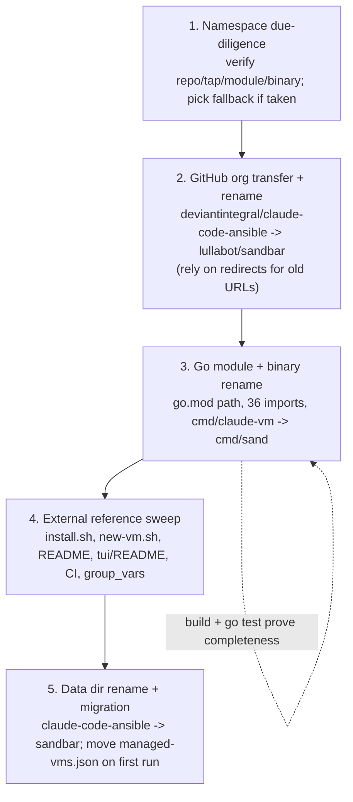

# Plan: Rename to `sandbar` and Move to the lullabot Org

## Original Work Order

> ITEM 5 — Come up with a better name for the repo and the app, and rename to it. Current repo: deviantintegral/claude-code-ansible; current app/binary: claude-vm (Go TUI under tui/). A rename ripples through the Go module path (github.com/deviantintegral/claude-code-ansible/tui), install.sh + README curl|bash URLs, the XDG data dir (~/.local/share/claude-code-ansible, holding managed-vms.json), the CI workflow, and the GitHub repo name. Needs a chosen name + the mechanical rename + any data-dir migration/back-compat.

## Plan Clarifications

| Question | Answer |
|----------|--------|
| What is the new name? | **`sandbar`** — the short CLI binary stays **`sand`**. Coastal/ephemeral metaphor that pairs with Lima's coastal namesake; deliberately avoids "claude" so the tool can manage other AI agents in future. |
| Where does the repo live? | It moves to the **`lullabot`** GitHub organization → **`lullabot/sandbar`** (owner changes from `deviantintegral`, not just the name). |
| How far does the rename go? | **Full rename**: GitHub repo + org, Go module path + all import sites, the app/binary name, the install/CI/doc URLs, and the XDG data dir — with a one-time, lossless migration of the existing `managed-vms.json`. |
| Namespace safety? | The name must not step on another project's namespace. `sandcastle` and `mayfly` were rejected for in-domain collisions (e.g. `mattpocock/sandcastle` orchestrates sandboxed coding agents). The plan verifies availability of `lullabot/sandbar`, the tap formula, the Go module path, and the `sand` binary on `PATH`, and keeps a fallback. |

## Executive Summary

The project's current identity — `deviantintegral/claude-code-ansible`, app binary `claude-vm` — is clunky, undersells the Bubble Tea TUI, ties the brand to "claude" (limiting a future where it manages other agents), and lives under a personal account. This plan rebrands it to **`sandbar`** (binary **`sand`**) and moves it to the **`lullabot`** organization, giving it a clean, agent-neutral, Lima-themed identity.

The work is mostly mechanical but cross-cutting: the rename touches the GitHub repo/owner, the Go module path (`github.com/deviantintegral/claude-code-ansible/tui` → `github.com/lullabot/sandbar/tui`) and its 36 import sites, every external URL in `install.sh`/`README.md`/`tui/README.md`/CI, the binary/command directory (`tui/cmd/claude-vm` → `tui/cmd/sand`), and the XDG data dir (`~/.local/share/claude-code-ansible` → `~/.local/share/sandbar`). Because the data dir holds the managed-VM index that gates the safe "recreate" action, the change must migrate an existing index in place rather than orphaning it.

The approach front-loads a namespace-availability check (with a documented fallback), performs the GitHub org transfer + rename (leaning on GitHub's automatic redirects for old web/git URLs), then sweeps the code/docs/CI for the old identity, and finally renames the data dir with a first-run migration. Logic risk is low — the Go compiler and existing tests catch broken imports — so the real risks are missed string references and the data-dir migration, both explicitly mitigated. This plan is a prerequisite for Plan 07 (the Homebrew tap and binary distribution build on the new name, binary, and org).

## Context

### Current State vs Target State

| Current State | Target State | Why? |
|---------------|--------------|------|
| Repo `deviantintegral/claude-code-ansible` under a personal account | Repo `lullabot/sandbar` under the lullabot org | Cleaner brand, org ownership, and an agent-neutral name |
| Go module `github.com/deviantintegral/claude-code-ansible/tui` (36 import sites) | `github.com/lullabot/sandbar/tui` | Module path must match the repo location to be `go get`-able and self-consistent |
| App/binary `claude-vm`; command dir `tui/cmd/claude-vm` | Binary `sand`; command dir `tui/cmd/sand` | Short, memorable command; drops "claude" for agent-neutrality |
| Install/raw URLs point at `deviantintegral/claude-code-ansible` (install.sh, new-vm.sh, READMEs, CI) | All point at `lullabot/sandbar` | Old URLs must resolve to the new home; raw + module URLs do not redirect reliably |
| Data dir `~/.local/share/claude-code-ansible` (holds `managed-vms.json`) | `~/.local/share/sandbar`, with existing index migrated | Keep the managed-VM provenance (which gates recreate) across the rename |
| Brand tied to "claude" | Agent-neutral "sandbar" identity | Leave room to support other AI agents later |

### Background

- **The module path is load-bearing in 36 places** across `internal/lima`, `internal/provision`, `internal/registry`, `internal/ui`, and `cmd/claude-vm`. A single `go.mod` edit plus an import rewrite covers them; the build + `go test ./...` prove completeness.
- **The data dir name appears in three runtime spots**: `install.sh` and `scripts/new-vm.sh` (`CACHE_DIR`) and `internal/registry/registry.go` (`defaultPath`, which builds `managed-vms.json`). All three must move together so the cache and the managed index agree.
- **GitHub redirects soften the move**: after a transfer/rename, GitHub redirects old web and `git` URLs to the new location, so existing clones and links keep working for a time. Raw content URLs (`raw.githubusercontent.com/...`) and the Go module path do **not** redirect dependably, so the curl|bash one-liners and `go.mod` must be updated outright. (Plan 07 replaces the curl|bash path with `brew` anyway.)
- **No external Go importers** exist — the module is internal to this repo — so changing the module path is safe and needs no version gymnastics.
- **Namespace due-diligence is a requirement**, not a nicety: the user explicitly wants to avoid taking over another project's namespace. The "sandbox + coding agent" space is crowded (`sandcastle` ×4, `mayfly` ×4, various `sandbox-*`), which is why `sandbar` (no in-domain collision found) was chosen; the plan still verifies `lullabot/sandbar`, the Homebrew formula name, the module path, and `sand` on `PATH` before committing, with a fallback name if any is taken.
- **Dependency direction**: Plan 07 (Homebrew tap + headless binary) consumes this plan's outputs (name `sandbar`, binary `sand`, org `lullabot`, tap `lullabot/homebrew-sandbar`). This plan should land first.

## Architectural Approach

### Namespace due-diligence and fallback

**Objective:** Confirm the new identity is free before baking it everywhere.

Verify that `lullabot/sandbar` is available (or creatable) in the org, that a Homebrew formula/tap name is free for Plan 07, that the `github.com/lullabot/sandbar` module path is unclaimed, and that the `sand` binary does not collide with a common tool on users' `PATH`. If any check fails, fall back to a vetted alternative (e.g. a coastal/Lima-themed name) and record the decision. This step exists because the rename is expensive to redo once the module path and URLs are committed.

### GitHub org transfer and rename

**Objective:** Move the repository to its new home with minimal breakage for existing users.

Transfer the repo to the `lullabot` org and rename it to `sandbar`, relying on GitHub's automatic redirects so old web/`git` URLs and existing clones keep resolving. This is an account/permissions operation (needs lullabot org admin) rather than a code change, but it anchors every URL update that follows.

### Go module and binary rename

**Objective:** Make the code self-consistent under the new module path and command name.

Update the module path in `go.mod`, rewrite the import path across all 36 sites, and rename the command directory `tui/cmd/claude-vm` → `tui/cmd/sand` so the built binary is `sand`. The Go toolchain makes this verifiable: a clean `go build` and a green `go test ./...` prove no import or reference was missed. Any user-facing strings that name the binary (help text, titles) are updated in the same pass.

### External reference sweep

**Objective:** Repoint every non-Go reference to the new identity.

Sweep `install.sh`, `scripts/new-vm.sh`, `README.md`, `tui/README.md`, the CI workflow, and any `group_vars`/docs for `deviantintegral`, `claude-code-ansible`, and `claude-vm`, replacing repo/raw URLs, the cache/data-dir name, and the app name. A repository-wide grep for the old identity strings is the completeness check.

### Data dir rename and one-time migration

**Objective:** Adopt `~/.local/share/sandbar` without losing the managed-VM index.

Point `CACHE_DIR` (install.sh, new-vm.sh) and `registry.defaultPath` at `sandbar`. Because an existing user already has `~/.local/share/claude-code-ansible/managed-vms.json` — the index that marks which VMs are claude-vm-managed and therefore safe to recreate — the registry load path performs a one-time migration: if the new dir has no index but the old one does, copy it forward before reading, leaving the old copy in place until the new one is written so a failure cannot lose data.

## Risk Considerations and Mitigation Strategies

Technical Risks

- **Missed string references** to the old name/URLs leave dead links or a split-brain data dir.
    - **Mitigation**: a repo-wide grep for `deviantintegral`, `claude-code-ansible`, and `claude-vm` as the completeness gate; the Go build + tests catch every import.
- **Data-dir migration could orphan or lose the managed index**, breaking the recreate safety gate.
    - **Mitigation**: migrate on first run only when the new index is absent and the old exists; copy (don't move) so the old data survives a failed write; document the change.
- **Raw/module URLs don't follow GitHub redirects**, so curl|bash and `go get` would break if left stale.
    - **Mitigation**: update them outright; note that Plan 07 retires the curl|bash path in favour of `brew`.

Implementation Risks

- **Org transfer needs lullabot admin rights** and is outside the codebase.
    - **Mitigation**: treat the transfer/rename as an explicit operational step coordinated with an org admin; sequence URL edits after it.
- **Chosen name turns out to be taken** (repo, tap, module, or `sand` on PATH).
    - **Mitigation**: the due-diligence step gates the whole rename and carries a documented fallback name.

## Success Criteria

### Primary Success Criteria

1. The repository lives at `lullabot/sandbar`; old `deviantintegral/claude-code-ansible` web/git URLs redirect to it.
2. `go build` produces a `sand` binary and `go test ./...` passes, with no remaining `deviantintegral/claude-code-ansible` import paths anywhere in the module.
3. A repository-wide search finds no stale `deviantintegral`, `claude-code-ansible`, or `claude-vm` references in install/CI/docs; all point at `lullabot/sandbar` / `sand`.
4. The data dir is `~/.local/share/sandbar`; a pre-existing `claude-code-ansible` managed index is migrated automatically on first run with no loss of managed/recreate state.
5. Namespace availability for the repo, tap formula, module path, and `sand` binary was verified (or a documented fallback applied) before the rename was committed.

## Documentation

- **README.md**, **tui/README.md** — repo name, URLs, app/binary name, and data-dir references throughout.
- **install.sh** / **scripts/new-vm.sh** headers and `CACHE_DIR` — new URLs and dir (note: Plan 07 may remove these files entirely).
- Any **group_vars**/example/CONTRIBUTING references to the old identity.

## Resource Requirements

### Development Skills

- Go (module path + import rewrite, command-dir rename) and confidence reading the build/test signal as the completeness check.
- GitHub org administration on `lullabot` (repo transfer + rename, redirect behaviour).

### Technical Infrastructure

- Existing Go toolchain; no new dependencies. A grep/replace sweep and a CI run to confirm green after the rename.

## Integration Strategy

This plan is the foundation for Plan 07: the Homebrew tap (`lullabot/homebrew-sandbar`), the release artifacts, and the headless binary all assume the `sandbar` name, the `sand` binary, and the `lullabot` org established here. Plans 08 (CI testing) and 09 (Samba share) are independent of the rename but will inherit the new module path and URLs once this lands. To avoid churn, this rename should be completed before Plan 07 begins.

## Notes

- The org move (`deviantintegral` → `lullabot`) is as significant as the name change — both owner and name change — so URL updates must reflect the new owner, not just the new repo name.
- Keep the old `deviantintegral` repo as a redirect stub rather than deleting it, so bookmarked links and existing clones continue to resolve during the transition.
- The `sand` binary name is short and generic; the PATH-collision check is part of due-diligence, and the fallback can keep `sandbar` as the command if `sand` proves problematic.
